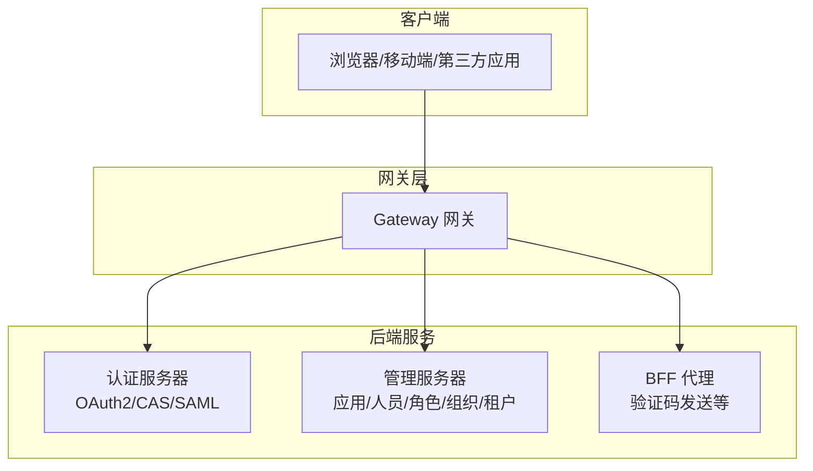
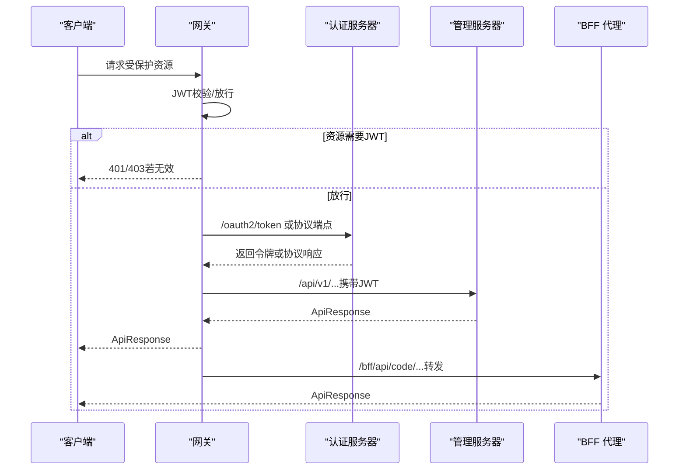
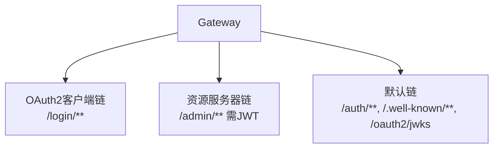
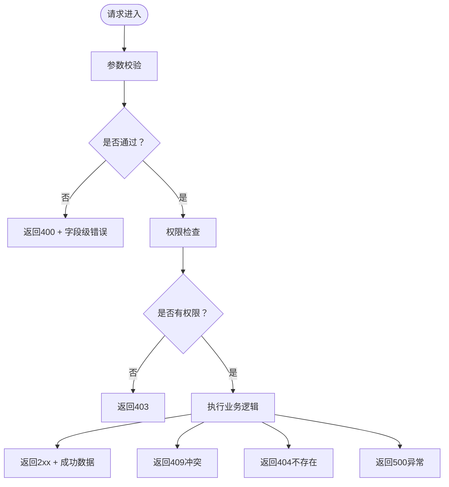

# API参考

<cite>
**本文引用的文件**
- [ApplicationController.java](file://iam-admin-server/src/main/java/iam/platform/admin/interfaces/rest/ApplicationController.java)
- [PersonController.java](file://iam-admin-server/src/main/java/iam/platform/admin/interfaces/rest/PersonController.java)
- [RoleController.java](file://iam-admin-server/src/main/java/iam/platform/admin/interfaces/rest/RoleController.java)
- [OrganizationController.java](file://iam-admin-server/src/main/java/iam/platform/admin/interfaces/rest/OrganizationController.java)
- [TenantAccountController.java](file://iam-admin-server/src/main/java/iam/platform/admin/interfaces/rest/TenantAccountController.java)
- [TenantController.java](file://iam-admin-server/src/main/java/iam/platform/admin/interfaces/rest/TenantController.java)
- [GlobalExceptionHandler.java](file://iam-admin-server/src/main/java/iam/platform/admin/interfaces/rest/common/GlobalExceptionHandler.java)
- [AdminSecurityConfig.java](file://iam-admin-server/src/main/java/iam/platform/admin/infrastructure/config/AdminSecurityConfig.java)
- [AuthenticationController.java](file://iam-auth-server/src/main/java/iam/platform/auth/interfaces/rest/AuthenticationController.java)
- [LoginController.java](file://iam-auth-server/src/main/java/iam/platform/auth/interfaces/web/LoginController.java)
- [CasController.java](file://iam-auth-server/src/main/java/iam/platform/auth/interfaces/web/CasController.java)
- [SamlSsoController.java](file://iam-auth-server/src/main/java/iam/platform/auth/interfaces/web/SamlSsoController.java)
- [DefaultSecurityConfig.java](file://iam-auth-server/src/main/java/iam/platform/auth/infrastructure/config/DefaultSecurityConfig.java)
- [BffVerificationCodeController.java](file://iam-bff-server/src/main/java/iam/platform/bff/interfaces/rest/BffVerificationCodeController.java)
- [BffWebMvcConfig.java](file://iam-bff-server/src/main/java/iam/platform/bff/infrastructure/config/BffWebMvcConfig.java)
- [GatewaySecurityConfig.java](file://iam-gateway/src/main/java/iam/platform/gateway/infrastructure/security/GatewaySecurityConfig.java)
- [ApiResponse.java](file://iam-common/src/main/java/iam/platform/common/api/ApiResponse.java)
- [RequirePermission.java](file://iam-common/src/main/java/iam/platform/common/model/annotation/RequirePermission.java)
</cite>

## 目录
1. [简介](#简介)
2. [项目结构](#项目结构)
3. [核心组件](#核心组件)
4. [架构总览](#架构总览)
5. [详细组件分析](#详细组件分析)
6. [依赖分析](#依赖分析)
7. [性能考虑](#性能考虑)
8. [故障排查指南](#故障排查指南)
9. [结论](#结论)
10. [附录](#附录)

## 简介
本文件为IAM平台的完整API参考文档，覆盖认证服务器、管理服务器、前端代理（BFF）服务器以及网关的安全与路由策略。内容包括：
- 所有公共REST端点：HTTP方法、URL模式、请求/响应结构与认证方式
- 认证服务器端点：OAuth2授权、令牌颁发、用户信息、CAS/SAML协议端点、JWKS等
- 管理服务器端点：应用与权限、人员、角色、组织、租户与租户账号管理
- 前端代理（BFF）简化API接口
- 错误处理策略、状态码说明与错误响应格式
- API版本控制与向后兼容性说明
- 使用示例、客户端实现指南、性能优化建议
- 权限控制、速率限制与调试监控方法

## 项目结构
IAM平台采用多模块微服务架构，主要模块如下：
- 认证服务器（iam-auth-server）：提供OAuth2授权、令牌颁发、CAS/SAML协议、登录页等
- 管理服务器（iam-admin-server）：提供应用、人员、角色、组织、租户、租户账号等管理API
- 前端代理（BFF）服务器（iam-bff-server）：对内转发至认证/管理服务，对外暴露简化API
- 网关（iam-gateway）：统一入口，负责OAuth2资源访问校验、CORS、健康检查等
- 公共模块（iam-common）：统一响应模型、权限注解、通用DTO与异常定义

图表来源
- [GatewaySecurityConfig.java:25-73](file://iam-gateway/src/main/java/iam/platform/gateway/infrastructure/security/GatewaySecurityConfig.java#L25-L73)
- [DefaultSecurityConfig.java:35-63](file://iam-auth-server/src/main/java/iam/platform/auth/infrastructure/config/DefaultSecurityConfig.java#L35-L63)
- [AdminSecurityConfig.java:18-34](file://iam-admin-server/src/main/java/iam/platform/admin/infrastructure/config/AdminSecurityConfig.java#L18-L34)

章节来源
- [GatewaySecurityConfig.java:25-73](file://iam-gateway/src/main/java/iam/platform/gateway/infrastructure/security/GatewaySecurityConfig.java#L25-L73)
- [DefaultSecurityConfig.java:35-63](file://iam-auth-server/src/main/java/iam/platform/auth/infrastructure/config/DefaultSecurityConfig.java#L35-L63)
- [AdminSecurityConfig.java:18-34](file://iam-admin-server/src/main/java/iam/platform/admin/infrastructure/config/AdminSecurityConfig.java#L18-L34)

## 核心组件
- 统一响应模型：所有REST接口返回统一的 ApiResponse 结构，包含状态码、消息、数据、字段级错误与时间戳
- 统一异常处理：全局异常处理器将业务异常、参数校验、鉴权/授权失败、资源不存在、数据冲突等映射为标准HTTP状态码与错误响应
- 权限注解：通过 RequirePermission 注解在方法级别声明权限要求，结合切面进行权限拦截
- 安全配置：认证服务器与管理服务器分别配置过滤器链，支持OAuth2登录、CAS/SAML协议、JWT校验与跨域策略

章节来源
- [ApiResponse.java:18-60](file://iam-common/src/main/java/iam/platform/common/api/ApiResponse.java#L18-L60)
- [GlobalExceptionHandler.java:24-99](file://iam-admin-server/src/main/java/iam/platform/admin/interfaces/rest/common/GlobalExceptionHandler.java#L24-L99)
- [RequirePermission.java:17-34](file://iam-common/src/main/java/iam/platform/common/model/annotation/RequirePermission.java#L17-L34)
- [DefaultSecurityConfig.java:35-63](file://iam-auth-server/src/main/java/iam/platform/auth/infrastructure/config/DefaultSecurityConfig.java#L35-L63)
- [AdminSecurityConfig.java:18-34](file://iam-admin-server/src/main/java/iam/platform/admin/infrastructure/config/AdminSecurityConfig.java#L18-L34)

## 架构总览
下图展示API调用流与安全链路：

图表来源
- [GatewaySecurityConfig.java:47-58](file://iam-gateway/src/main/java/iam/platform/gateway/infrastructure/security/GatewaySecurityConfig.java#L47-L58)
- [AuthenticationController.java:13-31](file://iam-auth-server/src/main/java/iam/platform/auth/interfaces/rest/AuthenticationController.java#L13-L31)
- [BffVerificationCodeController.java:24-37](file://iam-bff-server/src/main/java/iam/platform/bff/interfaces/rest/BffVerificationCodeController.java#L24-L37)

## 详细组件分析

### 认证服务器（OAuth2/CAS/SAML/登录页）
- OAuth2令牌端点（标准Spring Authorization Server自动处理）
  - 方法：POST
  - 路径：/oauth2/token
  - 内容类型：application/x-www-form-urlencoded
  - 参数：grant_type=password、username、password、client_id、client_secret
  - 响应：Access Token、Refresh Token、ID Token（由Spring AS生成）
  - 说明：密码模式令牌发放由标准端点处理，不在此处自定义
- CAS协议
  - 登录页：GET /cas/login
  - 登录处理：POST /cas/login
  - 票据验证：GET /cas/serviceTicket?ticket=...
  - 健康检查：GET /cas/health
  - 响应：XML兼容CAS 3.0；票据有效时返回用户属性
- SAML协议
  - SSO登录页：GET /saml/sso
  - SSO处理：POST /saml/sso
  - 元数据：GET /saml/metadata（application/xml）
  - 响应：自动提交表单到SP的ACS
- 登录页（Web）
  - GET /login（支持子域名/查询参数/头部识别租户）

章节来源
- [AuthenticationController.java:13-31](file://iam-auth-server/src/main/java/iam/platform/auth/interfaces/rest/AuthenticationController.java#L13-L31)
- [CasController.java:44-158](file://iam-auth-server/src/main/java/iam/platform/auth/interfaces/web/CasController.java#L44-L158)
- [SamlSsoController.java:42-103](file://iam-auth-server/src/main/java/iam/platform/auth/interfaces/web/SamlSsoController.java#L42-L103)
- [LoginController.java:19-47](file://iam-auth-server/src/main/java/iam/platform/auth/interfaces/web/LoginController.java#L19-L47)
- [DefaultSecurityConfig.java:39-60](file://iam-auth-server/src/main/java/iam/platform/auth/infrastructure/config/DefaultSecurityConfig.java#L39-L60)

### 管理服务器（应用/人员/角色/组织/租户/租户账号）
- 应用与权限管理
  - 创建应用：POST /api/v1/applications
  - 查询应用：GET /api/v1/applications/{id}
  - 按appId查询：GET /api/v1/applications/by-app-id/{appId}
  - 租户应用列表：GET /api/v1/applications/tenant/{tenantId}
  - 更新应用：PUT /api/v1/applications/{id}
  - 删除应用：DELETE /api/v1/applications/{id}
  - 旋转密钥：POST /api/v1/applications/{id}/rotate-secret
  - 应用状态：POST /api/v1/applications/{id}/activate | /deactivate | /block
  - 应用权限：POST /api/v1/applications/{id}/permissions | GET /.../{id}/permissions | DELETE /.../permissions/{permissionId}
- 人员管理
  - 创建人员：POST /v1/persons
  - 查询人员：GET /v1/persons/{id}
  - 更新人员：PUT /v1/persons/{id}
  - 删除人员：DELETE /v1/persons/{id}
  - 列表分页：GET /v1/persons?page=&size=
- 角色管理
  - 创建租户角色：POST /v1/tenants/{tenantId}/roles
  - 查询角色：GET /v1/tenants/{tenantId}/roles/{id}
  - 列表（含全局角色）：GET /v1/tenants/{tenantId}/roles
  - 删除角色：DELETE /v1/tenants/{tenantId}/roles/{id}
- 组织管理
  - 创建组织：POST /v1/tenants/{tenantId}/organizations
  - 查询组织：GET /v1/tenants/{tenantId}/organizations/{id}
  - 更新组织：PUT /v1/tenants/{tenantId}/organizations/{id}
  - 删除组织：DELETE /v1/tenants/{tenantId}/organizations/{id}
  - 组织激活/停用：POST /v1/tenants/{tenantId}/organizations/{id}/activate | /deactivate
  - 组织树：GET /v1/tenants/{tenantId}/organizations
- 租户管理
  - 创建租户：POST /v1/tenants（需权限：tenant:write）
  - 查询租户：GET /v1/tenants/{id}（需权限：tenant:read）
  - 更新租户：PUT /v1/tenants/{id}（需权限：tenant:write）
  - 删除租户（软删）：DELETE /v1/tenants/{id}（需权限：tenant:write）
  - 列表分页：GET /v1/tenants?page=&size（需权限：tenant:read）
  - 启用/挂起：POST /v1/tenants/{id}/activate | /suspend（需权限：tenant:write）
- 租户账号管理
  - 为人员创建租户账号：POST /persons/{personId}/tenant-accounts
  - 查询账号：GET /tenant-accounts/{id}
  - 更新账号：PUT /tenant-accounts/{id}
  - 挂起账号：POST /tenant-accounts/{id}/suspend
  - 恢复账号：POST /tenant-accounts/{id}/reactivate
  - 退出租户：POST /tenant-accounts/{id}/leave
  - 人员账号列表：GET /persons/{personId}/tenant-accounts
  - 租户账号列表：GET /tenants/{tenantId}/tenant-accounts?page=&size

章节来源
- [ApplicationController.java:38-137](file://iam-admin-server/src/main/java/iam/platform/admin/interfaces/rest/ApplicationController.java#L38-L137)
- [PersonController.java:33-66](file://iam-admin-server/src/main/java/iam/platform/admin/interfaces/rest/PersonController.java#L33-L66)
- [RoleController.java:31-56](file://iam-admin-server/src/main/java/iam/platform/admin/interfaces/rest/RoleController.java#L31-L56)
- [OrganizationController.java:33-82](file://iam-admin-server/src/main/java/iam/platform/admin/interfaces/rest/OrganizationController.java#L33-L82)
- [TenantController.java:34-88](file://iam-admin-server/src/main/java/iam/platform/admin/interfaces/rest/TenantController.java#L34-L88)
- [TenantAccountController.java:34-92](file://iam-admin-server/src/main/java/iam/platform/admin/interfaces/rest/TenantAccountController.java#L34-L92)

### 前端代理（BFF）服务器
- 发送短信验证码：POST /bff/api/code/sms?phone=...
- 发送邮箱验证码：POST /bff/api/code/email?email=...

说明
- BFF作为简化入口，内部通过Feign转发至认证服务
- 开发环境允许CORS，生产由网关统一处理

章节来源
- [BffVerificationCodeController.java:24-37](file://iam-bff-server/src/main/java/iam/platform/bff/interfaces/rest/BffVerificationCodeController.java#L24-L37)
- [BffWebMvcConfig.java:14-21](file://iam-bff-server/src/main/java/iam/platform/bff/infrastructure/config/BffWebMvcConfig.java#L14-L21)

## 依赖分析
- 网关安全链
  - OAuth2客户端链：处理浏览器登录流程（/login/**、/oauth2/**、/login/oauth2/code/**）
  - 资源服务器链：校验JWT（/admin/**），未通过则返回JSON错误
  - 默认链：放行公开路径（/auth/**、/.well-known/**、/oauth2/jwks）
- 认证服务器安全链
  - 放行静态资源与登录注册页面
  - 统一认证过滤器替代默认表单登录
  - 租户上下文过滤器在统一认证之后执行
- 管理服务器安全链
  - 除健康/文档/错误外，其余请求均需认证
  - 会话策略：无状态（STATELESS）

图表来源
- [GatewaySecurityConfig.java:29-73](file://iam-gateway/src/main/java/iam/platform/gateway/infrastructure/security/GatewaySecurityConfig.java#L29-L73)

章节来源
- [GatewaySecurityConfig.java:29-73](file://iam-gateway/src/main/java/iam/platform/gateway/infrastructure/security/GatewaySecurityConfig.java#L29-L73)
- [DefaultSecurityConfig.java:39-60](file://iam-auth-server/src/main/java/iam/platform/auth/infrastructure/config/DefaultSecurityConfig.java#L39-L60)
- [AdminSecurityConfig.java:18-34](file://iam-admin-server/src/main/java/iam/platform/admin/infrastructure/config/AdminSecurityConfig.java#L18-L34)

## 性能考虑
- 无状态会话：管理服务器采用STATELESS，降低会话存储压力
- 过滤器链精简：移除不必要的中间件，减少请求开销
- 统一异常处理：避免重复的错误分支逻辑，提升可维护性
- BFF转发：前端仅与BFF交互，降低跨域与复杂认证处理
- 建议
  - 对高频查询使用分页参数（page/size）
  - 对大对象更新采用PATCH增量更新（如适用）
  - 缓存只读元数据（如租户/应用基础信息）
  - 对外部调用设置超时与重试策略

## 故障排查指南
- 常见HTTP状态码
  - 200/201：成功/已创建
  - 400：参数校验失败/非法参数
  - 401：未认证（缺少或无效JWT）
  - 403：权限不足（无所需权限）
  - 404：资源不存在
  - 409：数据冲突（如唯一约束）
  - 500：服务器内部错误
- 错误响应格式
  - 字段：code、message、errors（字段级）、timestamp
  - 示例路径：[ApiResponse.java:18-60](file://iam-common/src/main/java/iam/platform/common/api/ApiResponse.java#L18-L60)
- 异常映射
  - 业务异常：按业务状态码返回
  - 参数校验：BAD_REQUEST + 字段级错误
  - 权限不足：FORBIDDEN
  - 未认证：UNAUTHORIZED
  - 数据冲突：CONFLICT
  - 资源不存在：NOT_FOUND
  - 未捕获异常：INTERNAL_SERVER_ERROR

图表来源
- [GlobalExceptionHandler.java:24-99](file://iam-admin-server/src/main/java/iam/platform/admin/interfaces/rest/common/GlobalExceptionHandler.java#L24-L99)
- [ApiResponse.java:25-50](file://iam-common/src/main/java/iam/platform/common/api/ApiResponse.java#L25-L50)

章节来源
- [GlobalExceptionHandler.java:24-99](file://iam-admin-server/src/main/java/iam/platform/admin/interfaces/rest/common/GlobalExceptionHandler.java#L24-L99)
- [ApiResponse.java:25-50](file://iam-common/src/main/java/iam/platform/common/api/ApiResponse.java#L25-L50)

## 结论
本API参考文档系统性地梳理了IAM平台的认证、管理、BFF与网关各模块的端点与安全策略，提供了统一的响应与错误模型、权限注解与拦截机制，并给出性能优化与故障排查建议。建议在生产环境中配合网关统一处理CORS与安全策略，确保令牌校验与权限控制的一致性。

## 附录

### API版本控制与兼容性
- 版本前缀
  - 管理服务器：/api/v1/...（明确版本化）
  - 管理服务器部分端点：/v1/...（语义化版本）
- 兼容性建议
  - 新增字段以非破坏性方式扩展
  - 旧字段标注弃用并在未来版本移除
  - 保持URL稳定，变更仅影响请求/响应内容

章节来源
- [ApplicationController.java](file://iam-admin-server/src/main/java/iam/platform/admin/interfaces/rest/ApplicationController.java#L29)
- [PersonController.java](file://iam-admin-server/src/main/java/iam/platform/admin/interfaces/rest/PersonController.java#L26)
- [RoleController.java](file://iam-admin-server/src/main/java/iam/platform/admin/interfaces/rest/RoleController.java#L24)
- [OrganizationController.java](file://iam-admin-server/src/main/java/iam/platform/admin/interfaces/rest/OrganizationController.java#L26)
- [TenantController.java](file://iam-admin-server/src/main/java/iam/platform/admin/interfaces/rest/TenantController.java#L27)
- [TenantAccountController.java](file://iam-admin-server/src/main/java/iam/platform/admin/interfaces/rest/TenantAccountController.java#L27)

### 认证与权限控制
- 认证方式
  - OAuth2：/oauth2/token（密码模式等）
  - JWT：网关资源服务器链校验
  - CAS/SAML：协议端点
- 权限控制
  - 方法级注解：@RequirePermission（支持anyOf/allOf）
  - 管理服务器对敏感操作（如租户写操作）强制权限
- 速率限制
  - 认证服务器内置预/后置管道与速率限制处理器（实现位于应用服务层）

章节来源
- [RequirePermission.java:17-34](file://iam-common/src/main/java/iam/platform/common/model/annotation/RequirePermission.java#L17-L34)
- [TenantController.java:37-88](file://iam-admin-server/src/main/java/iam/platform/admin/interfaces/rest/TenantController.java#L37-L88)
- [DefaultSecurityConfig.java:39-60](file://iam-auth-server/src/main/java/iam/platform/auth/infrastructure/config/DefaultSecurityConfig.java#L39-L60)

### API使用示例与客户端实现指南
- 获取应用列表（携带JWT）
  - GET /api/v1/applications?page=0&size=20
  - Authorization: Bearer <token>
- 发送短信验证码（BFF）
  - POST /bff/api/code/sms?phone=13800001111
- CAS票据验证
  - GET /cas/serviceTicket?ticket=ST-xxxxx
- SAML元数据
  - GET /saml/metadata

章节来源
- [ApplicationController.java:66-70](file://iam-admin-server/src/main/java/iam/platform/admin/interfaces/rest/ApplicationController.java#L66-L70)
- [BffVerificationCodeController.java:24-37](file://iam-bff-server/src/main/java/iam/platform/bff/interfaces/rest/BffVerificationCodeController.java#L24-L37)
- [CasController.java:114-149](file://iam-auth-server/src/main/java/iam/platform/auth/interfaces/web/CasController.java#L114-L149)
- [SamlSsoController.java:98-103](file://iam-auth-server/src/main/java/iam/platform/auth/interfaces/web/SamlSsoController.java#L98-L103)

### 监控与调试
- 网关错误入口点：统一返回JSON错误，便于前端与日志采集
- Swagger/OpenAPI：管理服务器对部分端点标注OpenAPI标签，便于联调
- 日志：控制器与异常处理器记录关键事件与错误

章节来源
- [GatewaySecurityConfig.java:78-129](file://iam-gateway/src/main/java/iam/platform/gateway/infrastructure/security/GatewaySecurityConfig.java#L78-L129)
- [AdminSecurityConfig.java:21-28](file://iam-admin-server/src/main/java/iam/platform/admin/infrastructure/config/AdminSecurityConfig.java#L21-L28)