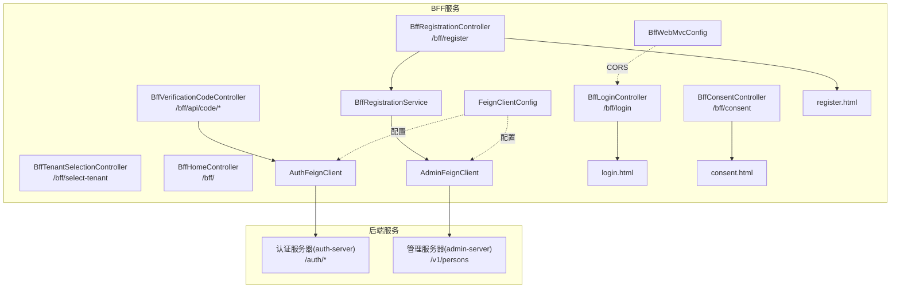
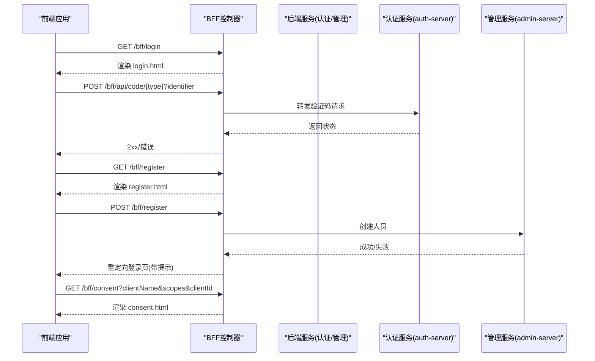
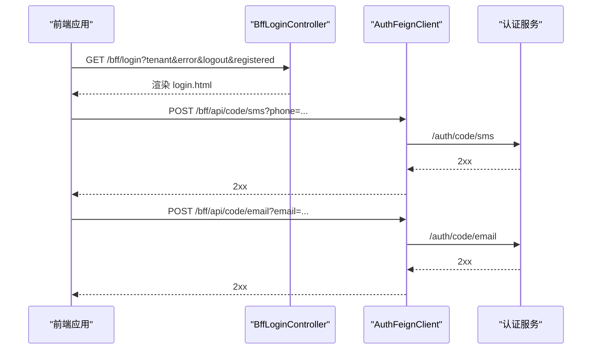
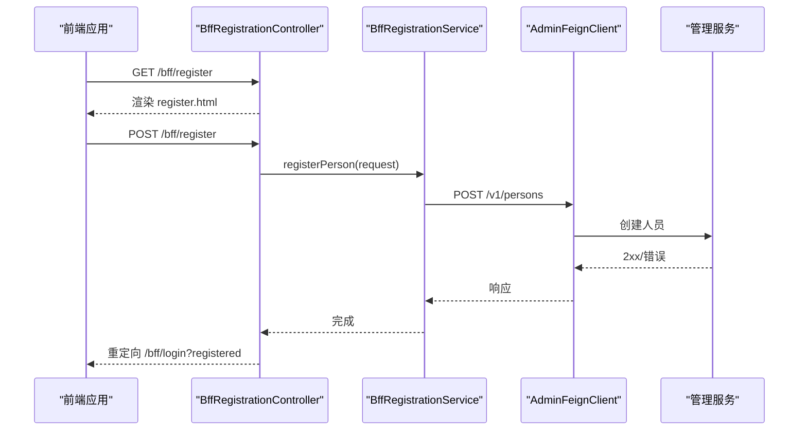
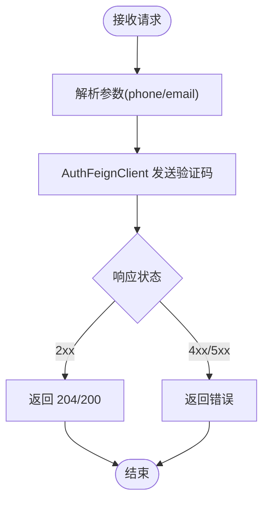
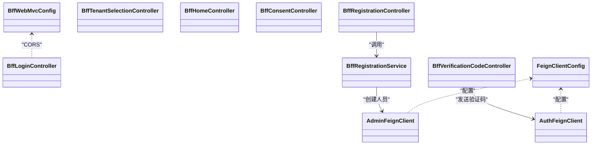

# 前端代理API

<cite>
**本文引用的文件**
- [BffLoginController.java](file://iam-bff-server/src/main/java/iam/platform/bff/interfaces/web/BffLoginController.java)
- [BffRegistrationController.java](file://iam-bff-server/src/main/java/iam/platform/bff/interfaces/web/BffRegistrationController.java)
- [BffVerificationCodeController.java](file://iam-bff-server/src/main/java/iam/platform/bff/interfaces/rest/BffVerificationCodeController.java)
- [BffTenantSelectionController.java](file://iam-bff-server/src/main/java/iam/platform/bff/interfaces/web/BffTenantSelectionController.java)
- [BffHomeController.java](file://iam-bff-server/src/main/java/iam/platform/bff/interfaces/web/BffHomeController.java)
- [BffConsentController.java](file://iam-bff-server/src/main/java/iam/platform/bff/interfaces/web/BffConsentController.java)
- [BffRegistrationService.java](file://iam-bff-server/src/main/java/iam/platform/bff/application/service/BffRegistrationService.java)
- [AdminFeignClient.java](file://iam-bff-server/src/main/java/iam/platform/bff/infrastructure/client/AdminFeignClient.java)
- [AuthFeignClient.java](file://iam-bff-server/src/main/java/iam/platform/bff/infrastructure/client/AuthFeignClient.java)
- [FeignClientConfig.java](file://iam-bff-server/src/main/java/iam/platform/bff/infrastructure/config/FeignClientConfig.java)
- [BffWebMvcConfig.java](file://iam-bff-server/src/main/java/iam/platform/bff/infrastructure/config/BffWebMvcConfig.java)
- [application.yml](file://iam-bff-server/src/main/resources/application.yml)
- [login.html](file://iam-bff-server/src/main/resources/templates/login.html)
- [register.html](file://iam-bff-server/src/main/resources/templates/register.html)
- [consent.html](file://iam-bff-server/src/main/resources/templates/consent.html)
</cite>

## 目录
1. [简介](#简介)
2. [项目结构](#项目结构)
3. [核心组件](#核心组件)
4. [架构总览](#架构总览)
5. [详细组件分析](#详细组件分析)
6. [依赖分析](#依赖分析)
7. [性能考虑](#性能考虑)
8. [故障排查指南](#故障排查指南)
9. [结论](#结论)
10. [附录](#附录)

## 简介
本文件面向前端开发者与集成工程师，系统化梳理前端代理服务器（BFF）为前端应用提供的简化API与页面接口，包括登录、注册、验证码发送、租户选择、主页与同意页等。重点说明BFF如何通过统一入口简化前后端交互、提供一致的认证体验，并阐述其与认证服务器（auth-server）及管理服务器（admin-server）的协作机制。同时给出前端集成示例、最佳实践、页面渲染机制与模板使用说明，并总结BFF在微服务架构中的作用与优势。

## 项目结构
BFF服务采用Spring MVC + Thymeleaf模板引擎提供Web页面，同时通过OpenFeign客户端调用后端服务，统一对外暴露REST API与页面路由，便于前端以统一风格消费。

图表来源
- [BffLoginController.java:1-49](file://iam-bff-server/src/main/java/iam/platform/bff/interfaces/web/BffLoginController.java#L1-L49)
- [BffRegistrationController.java:1-39](file://iam-bff-server/src/main/java/iam/platform/bff/interfaces/web/BffRegistrationController.java#L1-L39)
- [BffVerificationCodeController.java:1-38](file://iam-bff-server/src/main/java/iam/platform/bff/interfaces/rest/BffVerificationCodeController.java#L1-L38)
- [BffTenantSelectionController.java:1-21](file://iam-bff-server/src/main/java/iam/platform/bff/interfaces/web/BffTenantSelectionController.java#L1-L21)
- [BffHomeController.java:1-21](file://iam-bff-server/src/main/java/iam/platform/bff/interfaces/web/BffHomeController.java#L1-L21)
- [BffConsentController.java:1-34](file://iam-bff-server/src/main/java/iam/platform/bff/interfaces/web/BffConsentController.java#L1-L34)
- [BffRegistrationService.java:1-31](file://iam-bff-server/src/main/java/iam/platform/bff/application/service/BffRegistrationService.java#L1-L31)
- [AdminFeignClient.java:1-26](file://iam-bff-server/src/main/java/iam/platform/bff/infrastructure/client/AdminFeignClient.java#L1-L26)
- [AuthFeignClient.java:1-31](file://iam-bff-server/src/main/java/iam/platform/bff/infrastructure/client/AuthFeignClient.java#L1-L31)
- [FeignClientConfig.java:1-52](file://iam-bff-server/src/main/java/iam/platform/bff/infrastructure/config/FeignClientConfig.java#L1-L52)
- [BffWebMvcConfig.java:1-22](file://iam-bff-server/src/main/java/iam/platform/bff/infrastructure/config/BffWebMvcConfig.java#L1-L22)
- [login.html:1-341](file://iam-bff-server/src/main/resources/templates/login.html#L1-L341)
- [register.html:1-64](file://iam-bff-server/src/main/resources/templates/register.html#L1-L64)
- [consent.html:1-34](file://iam-bff-server/src/main/resources/templates/consent.html#L1-L34)

章节来源
- [application.yml:1-54](file://iam-bff-server/src/main/resources/application.yml#L1-L54)

## 核心组件
- 登录页面控制器：负责渲染登录页，支持错误、退出、注册成功提示，以及租户识别参数透传。
- 注册页面控制器：提供注册表单渲染与提交处理，调用注册服务完成用户创建。
- 验证码REST控制器：转发短信/邮箱验证码请求到认证服务。
- 租户选择控制器：渲染租户选择页（预留从管理服务拉取可用租户数据）。
- 主页控制器：重定向至登录页（可扩展为仪表盘或欢迎页）。
- 同意页控制器：渲染OAuth2授权同意页，传递客户端名称、权限范围与客户端ID。
- 注册服务：通过Feign客户端调用管理服务创建人员。
- Feign客户端：分别对接认证服务与管理服务，统一请求头与错误处理。
- Web配置：本地开发允许跨域，生产由网关统一处理。

章节来源
- [BffLoginController.java:1-49](file://iam-bff-server/src/main/java/iam/platform/bff/interfaces/web/BffLoginController.java#L1-L49)
- [BffRegistrationController.java:1-39](file://iam-bff-server/src/main/java/iam/platform/bff/interfaces/web/BffRegistrationController.java#L1-L39)
- [BffVerificationCodeController.java:1-38](file://iam-bff-server/src/main/java/iam/platform/bff/interfaces/rest/BffVerificationCodeController.java#L1-L38)
- [BffTenantSelectionController.java:1-21](file://iam-bff-server/src/main/java/iam/platform/bff/interfaces/web/BffTenantSelectionController.java#L1-L21)
- [BffHomeController.java:1-21](file://iam-bff-server/src/main/java/iam/platform/bff/interfaces/web/BffHomeController.java#L1-L21)
- [BffConsentController.java:1-34](file://iam-bff-server/src/main/java/iam/platform/bff/interfaces/web/BffConsentController.java#L1-L34)
- [BffRegistrationService.java:1-31](file://iam-bff-server/src/main/java/iam/platform/bff/application/service/BffRegistrationService.java#L1-L31)
- [AdminFeignClient.java:1-26](file://iam-bff-server/src/main/java/iam/platform/bff/infrastructure/client/AdminFeignClient.java#L1-L26)
- [AuthFeignClient.java:1-31](file://iam-bff-server/src/main/java/iam/platform/bff/infrastructure/client/AuthFeignClient.java#L1-L31)
- [FeignClientConfig.java:1-52](file://iam-bff-server/src/main/java/iam/platform/bff/infrastructure/config/FeignClientConfig.java#L1-L52)
- [BffWebMvcConfig.java:1-22](file://iam-bff-server/src/main/java/iam/platform/bff/infrastructure/config/BffWebMvcConfig.java#L1-L22)

## 架构总览
BFF作为前端代理层，承担以下职责：
- 页面渲染：基于Thymeleaf模板输出登录、注册、同意页。
- API聚合：提供验证码发送等REST接口，内部转发至认证服务。
- 业务编排：注册流程通过管理服务创建人员，返回统一状态。
- 安全与策略：统一请求头注入、错误解码、CORS策略（本地开发）。

图表来源
- [BffLoginController.java:18-48](file://iam-bff-server/src/main/java/iam/platform/bff/interfaces/web/BffLoginController.java#L18-L48)
- [BffVerificationCodeController.java:24-37](file://iam-bff-server/src/main/java/iam/platform/bff/interfaces/rest/BffVerificationCodeController.java#L24-L37)
- [BffRegistrationController.java:27-38](file://iam-bff-server/src/main/java/iam/platform/bff/interfaces/web/BffRegistrationController.java#L27-L38)
- [BffConsentController.java:16-33](file://iam-bff-server/src/main/java/iam/platform/bff/interfaces/web/BffConsentController.java#L16-L33)
- [AuthFeignClient.java:22-29](file://iam-bff-server/src/main/java/iam/platform/bff/infrastructure/client/AuthFeignClient.java#L22-L29)
- [AdminFeignClient.java:23-24](file://iam-bff-server/src/main/java/iam/platform/bff/infrastructure/client/AdminFeignClient.java#L23-L24)

## 详细组件分析

### 登录API
- 路由：GET /bff/login
- 参数：
  - tenant：租户编码（可选）
  - error：登录错误提示（可选）
  - logout：退出提示（可选）
  - registered：注册成功提示（可选）
- 行为：
  - 将租户信息与提示消息放入模型，渲染登录页。
  - 支持密码登录、验证码登录（短信/邮箱）、社交登录（OAuth2）三种方式。
- 模板：login.html
- 前端要点：
  - 密码登录与验证码登录通过隐藏字段切换认证方法。
  - 验证码发送通过调用 /bff/api/code/{sms|email} 实现。
  - 社交登录直接跳转到 /oauth2/authorization/{provider}。

图表来源
- [BffLoginController.java:18-48](file://iam-bff-server/src/main/java/iam/platform/bff/interfaces/web/BffLoginController.java#L18-L48)
- [BffVerificationCodeController.java:24-37](file://iam-bff-server/src/main/java/iam/platform/bff/interfaces/rest/BffVerificationCodeController.java#L24-L37)
- [login.html:161-208](file://iam-bff-server/src/main/resources/templates/login.html#L161-L208)

章节来源
- [BffLoginController.java:18-48](file://iam-bff-server/src/main/java/iam/platform/bff/interfaces/web/BffLoginController.java#L18-L48)
- [login.html:161-208](file://iam-bff-server/src/main/resources/templates/login.html#L161-L208)

### 注册API
- 路由：GET /bff/register（渲染注册页），POST /bff/register（提交注册）
- 行为：
  - GET：向模型注入空的创建请求对象，渲染注册页。
  - POST：调用注册服务创建人员，成功则重定向至登录页并带已注册提示；失败回显错误与表单数据。
- 内部流程：注册服务通过管理服务Feign客户端创建人员。

图表来源
- [BffRegistrationController.java:21-38](file://iam-bff-server/src/main/java/iam/platform/bff/interfaces/web/BffRegistrationController.java#L21-L38)
- [BffRegistrationService.java:23-29](file://iam-bff-server/src/main/java/iam/platform/bff/application/service/BffRegistrationService.java#L23-L29)
- [AdminFeignClient.java:23-24](file://iam-bff-server/src/main/java/iam/platform/bff/infrastructure/client/AdminFeignClient.java#L23-L24)

章节来源
- [BffRegistrationController.java:21-38](file://iam-bff-server/src/main/java/iam/platform/bff/interfaces/web/BffRegistrationController.java#L21-L38)
- [BffRegistrationService.java:23-29](file://iam-bff-server/src/main/java/iam/platform/bff/application/service/BffRegistrationService.java#L23-L29)

### 验证码API
- 路由：POST /bff/api/code/sms（参数 phone），POST /bff/api/code/email（参数 email）
- 行为：记录日志并转发给认证服务的对应端点，返回原响应状态。
- 适用场景：登录页中“发送验证码”按钮触发。

图表来源
- [BffVerificationCodeController.java:24-37](file://iam-bff-server/src/main/java/iam/platform/bff/interfaces/rest/BffVerificationCodeController.java#L24-L37)
- [AuthFeignClient.java:22-29](file://iam-bff-server/src/main/java/iam/platform/bff/infrastructure/client/AuthFeignClient.java#L22-L29)

章节来源
- [BffVerificationCodeController.java:24-37](file://iam-bff-server/src/main/java/iam/platform/bff/interfaces/rest/BffVerificationCodeController.java#L24-L37)

### 租户选择API
- 路由：GET /bff/select-tenant
- 行为：渲染租户选择页；当前版本未接入后端租户列表（预留扩展）。
- 建议：后续通过管理服务Feign客户端拉取当前用户可用租户集合。

章节来源
- [BffTenantSelectionController.java:15-20](file://iam-bff-server/src/main/java/iam/platform/bff/interfaces/web/BffTenantSelectionController.java#L15-L20)

### 主页API
- 路由：GET /bff/
- 行为：当前重定向至登录页；未来可扩展为仪表盘或欢迎页。

章节来源
- [BffHomeController.java:15-20](file://iam-bff-server/src/main/java/iam/platform/bff/interfaces/web/BffHomeController.java#L15-L20)

### 同意页面API
- 路由：GET /bff/consent
- 参数：clientName、scopes、clientId
- 行为：渲染OAuth2授权同意页，展示客户端名称与请求权限，支持批准/拒绝。

章节来源
- [BffConsentController.java:16-33](file://iam-bff-server/src/main/java/iam/platform/bff/interfaces/web/BffConsentController.java#L16-L33)
- [consent.html:14-29](file://iam-bff-server/src/main/resources/templates/consent.html#L14-L29)

## 依赖分析
- 控制器与模板：
  - 登录/注册/同意控制器分别渲染 login.html/register.html/consent.html。
  - 模板通过Thymeleaf读取模型属性，实现动态文案与表单。
- Feign客户端：
  - AdminFeignClient：对接管理服务 /v1/persons。
  - AuthFeignClient：对接认证服务 /auth/code/sms 与 /auth/code/email。
- 配置：
  - FeignClientConfig：统一注入请求头 X-Source，并自定义错误解码。
  - BffWebMvcConfig：本地开发允许 /bff/** 的跨域访问。
- 应用配置：
  - application.yml：端口、SSL、Thymeleaf模板路径、OpenFeign超时、监控与追踪等。

图表来源
- [BffRegistrationController.java:19-38](file://iam-bff-server/src/main/java/iam/platform/bff/interfaces/web/BffRegistrationController.java#L19-L38)
- [BffRegistrationService.java:18-29](file://iam-bff-server/src/main/java/iam/platform/bff/application/service/BffRegistrationService.java#L18-L29)
- [AdminFeignClient.java:13-24](file://iam-bff-server/src/main/java/iam/platform/bff/infrastructure/client/AdminFeignClient.java#L13-L24)
- [BffVerificationCodeController.java:19-37](file://iam-bff-server/src/main/java/iam/platform/bff/interfaces/rest/BffVerificationCodeController.java#L19-L37)
- [AuthFeignClient.java:12-29](file://iam-bff-server/src/main/java/iam/platform/bff/infrastructure/client/AuthFeignClient.java#L12-L29)
- [FeignClientConfig.java:18-31](file://iam-bff-server/src/main/java/iam/platform/bff/infrastructure/config/FeignClientConfig.java#L18-L31)
- [BffWebMvcConfig.java:14-21](file://iam-bff-server/src/main/java/iam/platform/bff/infrastructure/config/BffWebMvcConfig.java#L14-L21)

章节来源
- [FeignClientConfig.java:18-31](file://iam-bff-server/src/main/java/iam/platform/bff/infrastructure/config/FeignClientConfig.java#L18-L31)
- [BffWebMvcConfig.java:14-21](file://iam-bff-server/src/main/java/iam/platform/bff/infrastructure/config/BffWebMvcConfig.java#L14-L21)
- [application.yml:25-48](file://iam-bff-server/src/main/resources/application.yml#L25-L48)

## 性能考虑
- 超时设置：OpenFeign默认连接超时1秒，读取超时3秒，适合轻量API转发。
- 日志与追踪：开启Zipkin与Prometheus指标，便于定位延迟与错误。
- 模板缓存：Thymeleaf启用缓存，减少模板解析开销。
- 建议：
  - 对高频验证码发送增加本地限流与冷却时间。
  - 在网关层统一限流与熔断，避免BFF成为瓶颈。
  - 使用静态资源CDN与压缩，优化登录/注册页加载速度。

## 故障排查指南
- 验证码发送失败
  - 检查 /bff/api/code/* 是否正确转发至 /auth/code/*。
  - 查看Feign错误解码日志，确认4xx/5xx原因。
- 注册失败
  - 检查 /bff/register 提交是否成功调用 /v1/persons。
  - 关注BFF侧异常抛出与回显信息。
- 登录页无法显示
  - 确认Thymeleaf模板路径与缓存配置。
  - 检查CORS配置（本地开发）。
- OAuth2同意页
  - 确保 /bff/consent 接收 clientName、scopes、clientId 并正确渲染。

章节来源
- [FeignClientConfig.java:36-50](file://iam-bff-server/src/main/java/iam/platform/bff/infrastructure/config/FeignClientConfig.java#L36-L50)
- [BffRegistrationController.java:30-37](file://iam-bff-server/src/main/java/iam/platform/bff/interfaces/web/BffRegistrationController.java#L30-L37)
- [application.yml:15-18](file://iam-bff-server/src/main/resources/application.yml#L15-L18)
- [BffWebMvcConfig.java:14-21](file://iam-bff-server/src/main/java/iam/platform/bff/infrastructure/config/BffWebMvcConfig.java#L14-L21)

## 结论
BFF通过统一的页面与API入口，显著简化了前端与后端服务之间的交互复杂度，提供了统一的认证体验与一致的UI风格。它在微服务架构中扮演“代理+编排”的角色：既负责用户体验（页面与模板），又负责服务间通信（Feign转发）。配合网关的统一鉴权与安全策略，BFF能够稳定支撑多租户、多认证方式的复杂场景。

## 附录

### 前端集成示例与最佳实践
- 登录页集成
  - 使用 /bff/login 获取登录页，根据提示参数显示错误/退出/注册成功信息。
  - 验证码发送：调用 /bff/api/code/sms 或 /bff/api/code/email，前端自行实现倒计时与错误提示。
  - 社交登录：跳转 /oauth2/authorization/{provider}。
- 注册页集成
  - GET /bff/register 渲染表单，POST /bff/register 提交。
  - 失败时保留表单数据并显示错误信息。
- 同意页集成
  - 由认证服务器重定向至 /bff/consent，携带 clientName、scopes、clientId。
  - 用户点击批准/拒绝后，认证服务器继续授权流程。
- 最佳实践
  - 所有对 /bff/api/* 的调用均通过BFF转发，避免绕过网关。
  - 在网关层统一做速率限制、IP白名单与审计。
  - 前端对验证码发送增加本地防抖与冷却时间。

### 页面渲染机制与模板使用说明
- 模板位置：classpath:/templates/*.html
- Thymeleaf配置：前缀、后缀与缓存已在 application.yml 中配置。
- 模板变量：
  - login.html：tenantCode、tenantIdentified、error、logout、registered。
  - register.html：personRequest（用于表单绑定）。
  - consent.html：clientName、scopes、clientId。
- 样式与脚本：模板通过 th:href 引入 /bff/css/style.css，确保与BFF静态资源路径一致。

章节来源
- [application.yml:15-18](file://iam-bff-server/src/main/resources/application.yml#L15-L18)
- [login.html:144-151](file://iam-bff-server/src/main/resources/templates/login.html#L144-L151)
- [register.html:14](file://iam-bff-server/src/main/resources/templates/register.html#L14)
- [consent.html:14-29](file://iam-bff-server/src/main/resources/templates/consent.html#L14-L29)