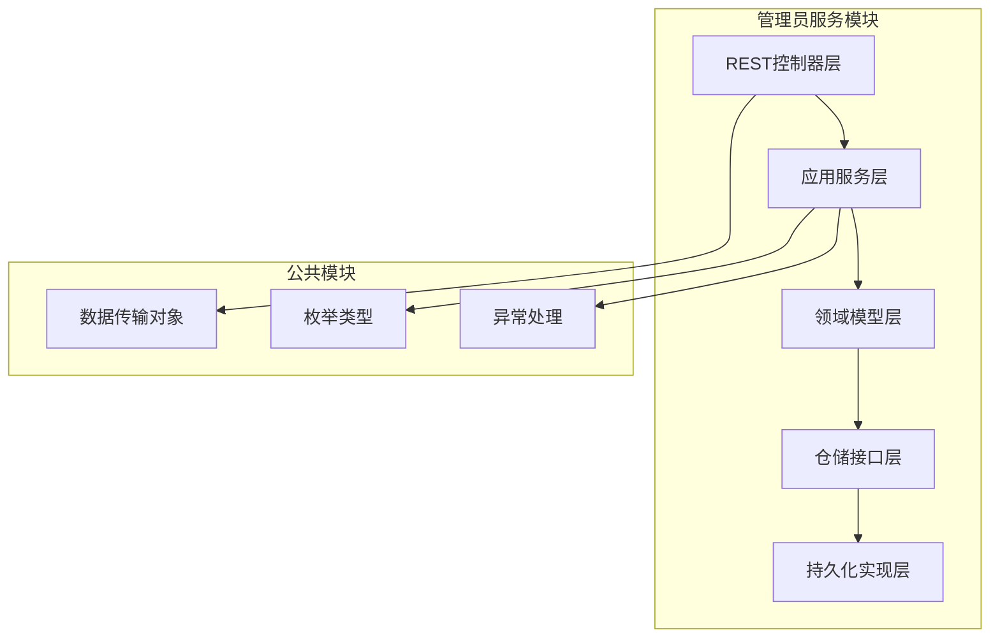
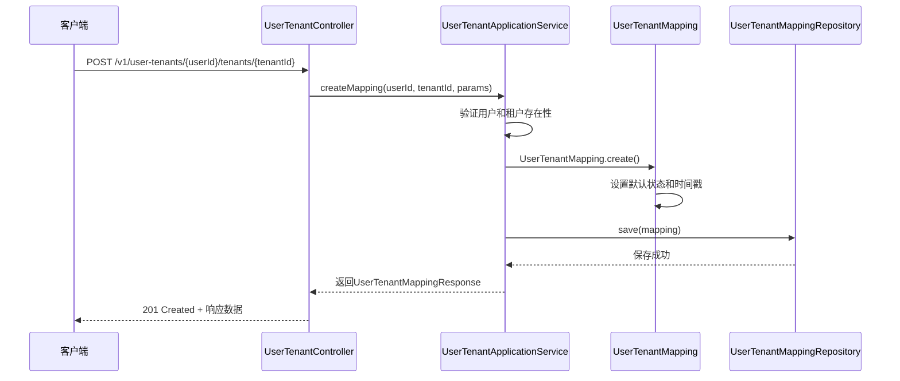
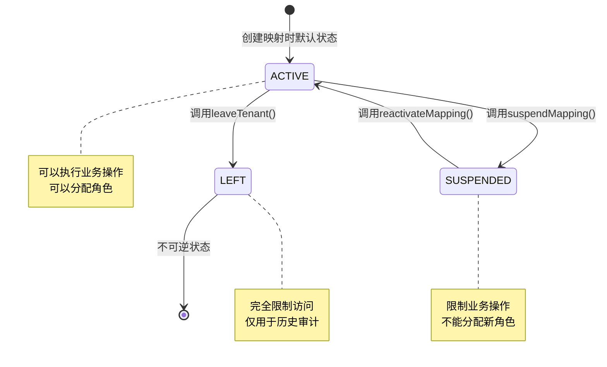
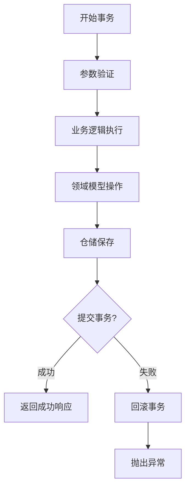
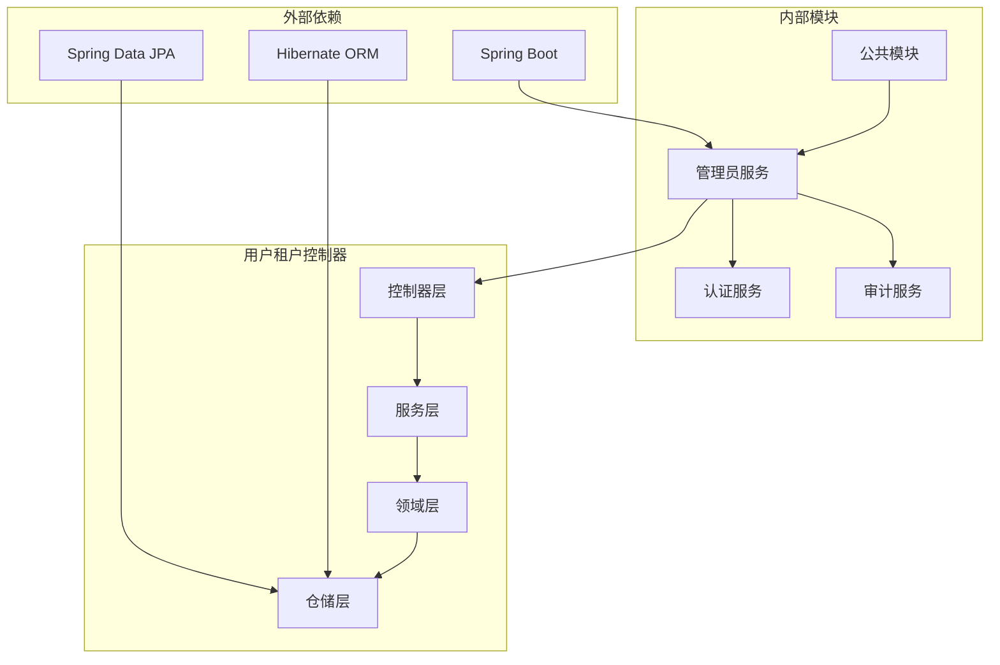
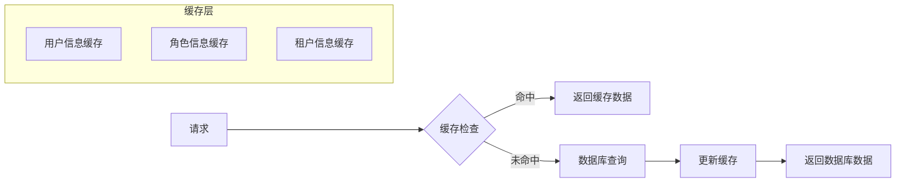
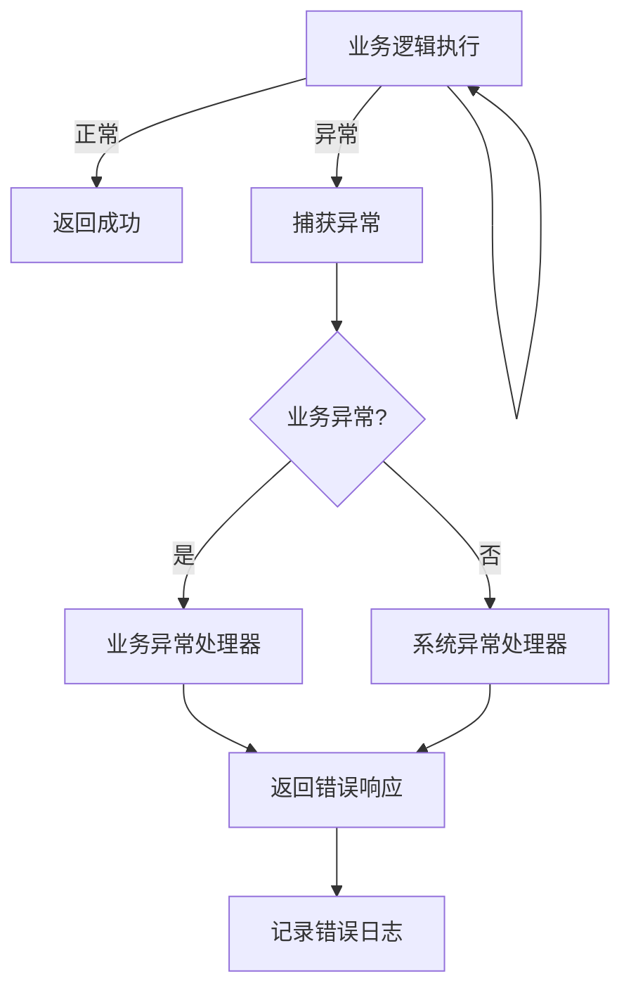

# 用户租户控制器

<cite>
**本文档引用的文件**
- [UserTenantController.java](file://iam-admin-server/src/main/java/iam/platform/admin/interfaces/rest/UserTenantController.java)
- [UserTenantApplicationService.java](file://iam-admin-server/src/main/java/iam/platform/admin/application/service/UserTenantApplicationService.java)
- [UserTenantMapping.java](file://iam-admin-server/src/main/java/iam/platform/admin/domain/model/entity/UserTenantMapping.java)
- [UserRoleMapping.java](file://iam-admin-server/src/main/java/iam/platform/admin/domain/model/entity/UserRoleMapping.java)
- [UserTenantMappingRepository.java](file://iam-admin-server/src/main/java/iam/platform/admin/domain/repository/UserTenantMappingRepository.java)
- [TenantController.java](file://iam-admin-server/src/main/java/iam/platform/admin/interfaces/rest/TenantController.java)
- [TenantApplicationService.java](file://iam-admin-server/src/main/java/iam/platform/admin/application/service/TenantApplicationService.java)
- [UserTenantStatus.java](file://iam-common/src/main/java/iam/platform/common/model/enums/UserTenantStatus.java)
- [TenantStatus.java](file://iam-common/src/main/java/iam/platform/common/model/enums/TenantStatus.java)
- [TenantInterceptor.java](file://iam-admin-server/src/main/java/iam/platform/admin/infrastructure/security/TenantInterceptor.java)
- [AdminSecurityConfig.java](file://iam-admin-server/src/main/java/iam/platform/admin/infrastructure/config/AdminSecurityConfig.java)
- [GlobalExceptionHandler.java](file://iam-admin-server/src/main/java/iam/platform/admin/interfaces/rest/common/GlobalExceptionHandler.java)
</cite>

## 目录
1. [简介](#简介)
2. [项目结构](#项目结构)
3. [核心组件](#核心组件)
4. [架构概览](#架构概览)
5. [详细组件分析](#详细组件分析)
6. [依赖关系分析](#依赖关系分析)
7. [性能考虑](#性能考虑)
8. [故障排除指南](#故障排除指南)
9. [结论](#结论)

## 简介

用户租户控制器是IAM平台中负责管理用户与租户关联关系的核心组件。该系统采用分层架构设计，通过REST API提供用户-租户映射的完整生命周期管理，包括创建、查询、状态管理和角色分配等功能。

系统支持多租户架构，允许一个用户在多个租户之间切换，并为每个租户维护独立的配置和权限。通过状态管理机制，系统能够跟踪用户的加入、暂停和离开状态，确保数据的一致性和可审计性。

## 项目结构

IAM平台采用模块化架构，用户租户控制器位于管理员服务模块中，遵循DDD（领域驱动设计）原则进行组织：

**图表来源**
- [UserTenantController.java:1-100](file://iam-admin-server/src/main/java/iam/platform/admin/interfaces/rest/UserTenantController.java#L1-L100)
- [UserTenantApplicationService.java:1-146](file://iam-admin-server/src/main/java/iam/platform/admin/application/service/UserTenantApplicationService.java#L1-L146)

**章节来源**
- [UserTenantController.java:1-100](file://iam-admin-server/src/main/java/iam/platform/admin/interfaces/rest/UserTenantController.java#L1-L100)
- [TenantController.java:1-90](file://iam-admin-server/src/main/java/iam/platform/admin/interfaces/rest/TenantController.java#L1-L90)

## 核心组件

用户租户控制器系统包含以下核心组件：

### 控制器层
- **UserTenantController**: 提供REST API接口，处理用户-租户映射的所有HTTP请求
- **TenantController**: 管理租户实体的CRUD操作和状态变更

### 应用服务层
- **UserTenantApplicationService**: 实现业务逻辑，协调领域模型和仓储操作
- **TenantApplicationService**: 处理租户相关的业务规则和状态转换

### 领域模型层
- **UserTenantMapping**: 用户-租户直接映射实体，包含状态管理和偏好设置
- **UserRoleMapping**: 用户-角色-租户映射实体，支持多租户权限管理

### 仓储层
- **UserTenantMappingRepository**: 定义用户-租户映射的数据库操作接口
- **UserRepository**: 用户数据访问接口
- **TenantRepository**: 租户数据访问接口

**章节来源**
- [UserTenantApplicationService.java:25-146](file://iam-admin-server/src/main/java/iam/platform/admin/application/service/UserTenantApplicationService.java#L25-L146)
- [UserTenantMapping.java:16-123](file://iam-admin-server/src/main/java/iam/platform/admin/domain/model/entity/UserTenantMapping.java#L16-L123)

## 架构概览

系统采用经典的三层架构模式，结合领域驱动设计原则：

```mermaid
graph TD
Client[客户端] --> API[REST API]
API --> Controller[用户租户控制器]
Controller --> Service[应用服务层]
Service --> Domain[领域模型]
Domain --> Repository[仓储接口]
Repository --> Persistence[持久化实现]
subgraph "安全层"
SecurityConfig[安全配置]
TenantInterceptor[租户拦截器]
end
API --> SecurityConfig
SecurityConfig --> TenantInterceptor
subgraph "异常处理"
GlobalHandler[全局异常处理器]
end
Service --> GlobalHandler
```

**图表来源**
- [AdminSecurityConfig.java:1-41](file://iam-admin-server/src/main/java/iam/platform/admin/infrastructure/config/AdminSecurityConfig.java#L1-L41)
- [TenantInterceptor.java:1-54](file://iam-admin-server/src/main/java/iam/platform/admin/infrastructure/security/TenantInterceptor.java#L1-L54)

系统的核心特性包括：

1. **状态管理**: 支持ACTIVE、SUSPENDED、LEFT三种用户-租户映射状态
2. **权限控制**: 基于角色的访问控制（RBAC），支持多租户权限隔离
3. **审计日志**: 所有关键操作都记录审计事件
4. **事务管理**: 关键业务操作使用事务保证数据一致性

**章节来源**
- [UserTenantStatus.java:1-10](file://iam-common/src/main/java/iam/platform/common/model/enums/UserTenantStatus.java#L1-L10)
- [TenantStatus.java:1-5](file://iam-common/src/main/java/iam/platform/common/model/enums/TenantStatus.java#L1-L5)

## 详细组件分析

### 用户租户控制器分析

用户租户控制器提供了完整的用户-租户映射管理功能：

#### 主要API端点

| HTTP方法 | 端点路径 | 功能描述 | 请求参数 |
|---------|----------|----------|----------|
| POST | `/v1/user-tenants/{userId}/tenants/{tenantId}` | 关联用户与租户 | accountCode, employeeNo |
| GET | `/v1/user-tenants/{id}` | 按ID获取映射 | 无 |
| GET | `/v1/user-tenants/user/{userId}` | 按用户ID获取映射列表 | 无 |
| GET | `/v1/user-tenants/tenant/{tenantId}` | 按租户ID分页查询 | page, size |
| PUT | `/v1/user-tenants/{id}/suspend` | 暂停用户-租户映射 | 无 |
| PUT | `/v1/user-tenants/{id}/reactivate` | 重新激活映射 | 无 |
| PUT | `/v1/user-tenants/{id}/leave` | 用户离开租户 | 无 |
| POST | `/v1/user-tenants/roles` | 分配角色给用户 | userId, tenantId, roleId, assignedBy |
| DELETE | `/v1/user-tenants/roles` | 撤销用户角色 | userId, tenantId, roleId |
| GET | `/v1/user-tenants/roles/user/{userId}/tenant/{tenantId}` | 获取用户在租户中的角色 | 无 |

#### 数据流序列图

**图表来源**
- [UserTenantController.java:24-32](file://iam-admin-server/src/main/java/iam/platform/admin/interfaces/rest/UserTenantController.java#L24-L32)
- [UserTenantApplicationService.java:32-47](file://iam-admin-server/src/main/java/iam/platform/admin/application/service/UserTenantApplicationService.java#L32-L47)

#### 状态转换流程

**图表来源**
- [UserTenantMapping.java:64-90](file://iam-admin-server/src/main/java/iam/platform/admin/domain/model/entity/UserTenantMapping.java#L64-L90)

**章节来源**
- [UserTenantController.java:16-99](file://iam-admin-server/src/main/java/iam/platform/admin/interfaces/rest/UserTenantController.java#L16-L99)
- [UserTenantApplicationService.java:32-115](file://iam-admin-server/src/main/java/iam/platform/admin/application/service/UserTenantApplicationService.java#L32-L115)

### 领域模型分析

#### UserTenantMapping实体

UserTenantMapping是用户-租户直接映射的核心实体，包含以下关键属性：

| 属性名 | 类型 | 描述 | 默认值 |
|--------|------|------|--------|
| id | Long | 映射唯一标识符 | 自动生成 |
| userId | Long | 关联用户ID | 必填 |
| tenantId | Long | 关联租户ID | 必填 |
| accountCode | String | 账户编码 | 可选 |
| employeeNo | String | 员工编号 | 可选 |
| status | UserTenantStatus | 映射状态 | ACTIVE |
| preferredLanguage | String | 偏好语言 | zh-CN |
| timezone | String | 时区设置 | Asia/Shanghai |
| joinedAt | LocalDateTime | 加入时间 | 当前时间 |
| leftAt | LocalDateTime | 离开时间 | 可选 |
| createdAt | LocalDateTime | 创建时间 | 当前时间 |
| updatedAt | LocalDateTime | 更新时间 | 当前时间 |

#### UserRoleMapping实体

UserRoleMapping管理用户在特定租户中的角色分配：

| 属性名 | 类型 | 描述 | 是否必填 |
|--------|------|------|----------|
| id | Long | 角色映射ID | 自动生成 |
| userId | Long | 用户ID | 必填 |
| tenantId | Long | 租户ID | 必填 |
| roleId | Long | 角色ID | 必填 |
| assignedAt | LocalDateTime | 分配时间 | 自动设置 |
| assignedBy | Long | 分配者ID | 可选 |

**章节来源**
- [UserTenantMapping.java:20-123](file://iam-admin-server/src/main/java/iam/platform/admin/domain/model/entity/UserTenantMapping.java#L20-L123)
- [UserRoleMapping.java:18-51](file://iam-admin-server/src/main/java/iam/platform/admin/domain/model/entity/UserRoleMapping.java#L18-L51)

### 应用服务层分析

#### UserTenantApplicationService核心方法

应用服务层实现了所有业务逻辑，包括：

1. **映射创建**: 验证用户和租户存在性，创建新的UserTenantMapping实例
2. **状态管理**: 提供suspendMapping、reactivateMapping、leaveTenant方法
3. **角色管理**: 支持assignRole和revokeRole操作
4. **查询操作**: 提供多种查询方法满足不同业务需求

#### 事务管理策略

所有写操作都使用@Transactional注解确保数据一致性：

**图表来源**
- [UserTenantApplicationService.java:32-115](file://iam-admin-server/src/main/java/iam/platform/admin/application/service/UserTenantApplicationService.java#L32-L115)

**章节来源**
- [UserTenantApplicationService.java:25-146](file://iam-admin-server/src/main/java/iam/platform/admin/application/service/UserTenantApplicationService.java#L25-L146)

## 依赖关系分析

系统采用清晰的依赖层次结构，遵循依赖倒置原则：

**图表来源**
- [UserTenantController.java:1-100](file://iam-admin-server/src/main/java/iam/platform/admin/interfaces/rest/UserTenantController.java#L1-L100)
- [UserTenantApplicationService.java:1-146](file://iam-admin-server/src/main/java/iam/platform/admin/application/service/UserTenantApplicationService.java#L1-L146)

### 关键依赖关系

1. **控制器到服务层**: UserTenantController依赖UserTenantApplicationService
2. **服务到仓储层**: 应用服务依赖领域仓储接口
3. **仓储到持久化**: 仓储接口由JPA实现类提供
4. **领域到基础设施**: 领域模型不依赖具体的技术实现

**章节来源**
- [UserTenantMappingRepository.java:1-29](file://iam-admin-server/src/main/java/iam/platform/admin/domain/repository/UserTenantMappingRepository.java#L1-L29)

## 性能考虑

### 查询优化策略

1. **分页查询**: 对租户用户列表使用分页避免大数据量查询
2. **索引优化**: 在常用查询字段上建立数据库索引
3. **批量操作**: 支持批量角色分配和撤销操作

### 缓存策略

### 并发控制

系统通过以下机制确保并发安全性：

1. **乐观锁**: 使用版本号防止并发更新冲突
2. **事务隔离**: 合理的事务隔离级别避免脏读
3. **状态约束**: 严格的业务状态转换规则

## 故障排除指南

### 常见错误类型及解决方案

| 错误类型 | 异常代码 | 描述 | 解决方案 |
|----------|----------|------|----------|
| 用户不存在 | 404 | 用户ID无效或不存在 | 验证用户ID有效性 |
| 租户不存在 | 404 | 租户ID无效或不存在 | 验证租户ID有效性 |
| 数据完整性冲突 | 409 | 违反数据库约束 | 检查唯一性约束 |
| 参数验证失败 | 400 | 请求参数格式错误 | 按DTO规范提供参数 |
| 权限不足 | 403 | 无权执行操作 | 检查用户权限 |

### 异常处理流程

**图表来源**
- [GlobalExceptionHandler.java:24-101](file://iam-admin-server/src/main/java/iam/platform/admin/interfaces/rest/common/GlobalExceptionHandler.java#L24-L101)

**章节来源**
- [GlobalExceptionHandler.java:1-101](file://iam-admin-server/src/main/java/iam/platform/admin/interfaces/rest/common/GlobalExceptionHandler.java#L1-L101)

## 结论

用户租户控制器是IAM平台中关键的多租户管理组件，具有以下特点：

1. **完整的生命周期管理**: 支持用户-租户映射的创建、查询、状态管理和删除
2. **灵活的状态控制**: 通过ACTIVE、SUSPENDED、LEFT状态实现精细化的用户权限管理
3. **完善的权限体系**: 集成RBAC模型，支持多租户环境下的权限隔离
4. **健壮的异常处理**: 全面的异常处理机制确保系统的稳定性
5. **清晰的架构设计**: 遵循DDD原则，层次清晰，职责明确

该系统为多租户应用场景提供了可靠的基础设施，支持复杂的权限管理和用户生命周期管理需求。通过合理的性能优化和异常处理策略，能够满足生产环境的高可用性要求。