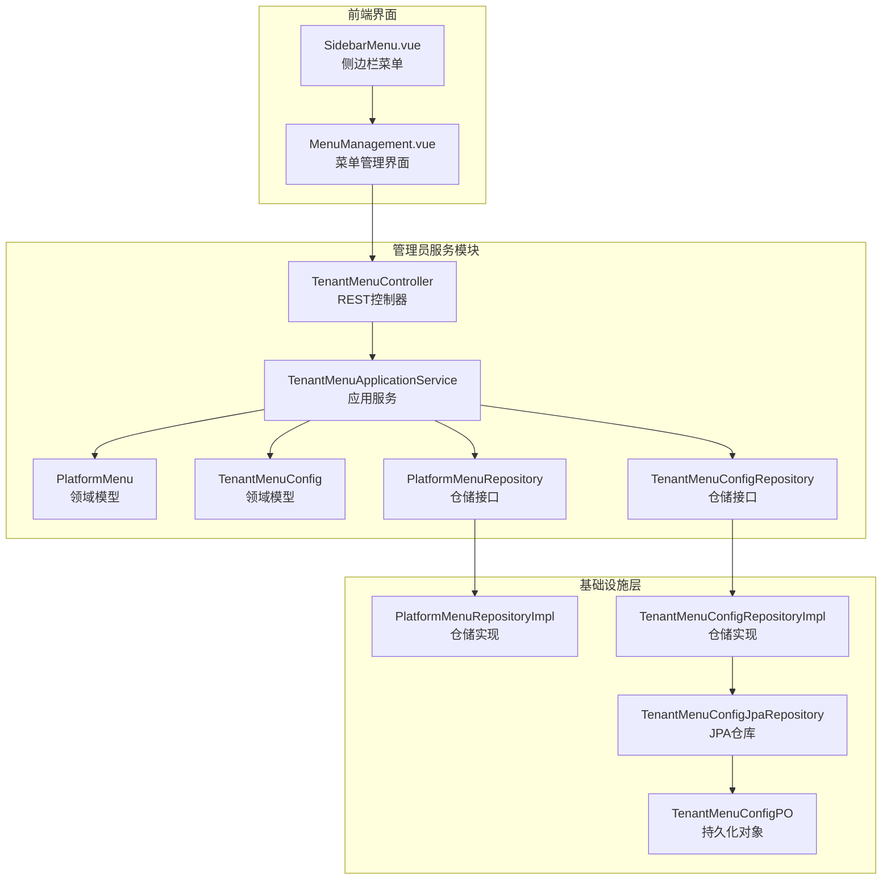
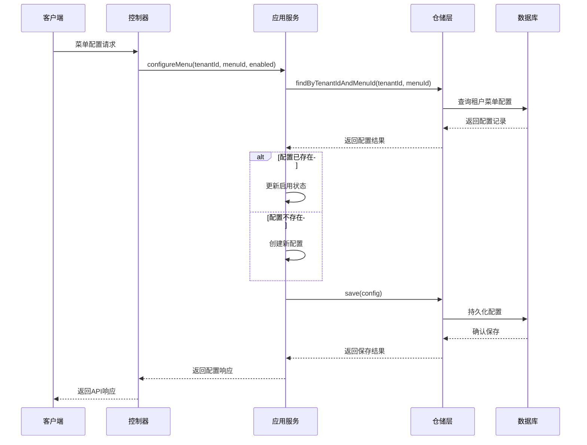
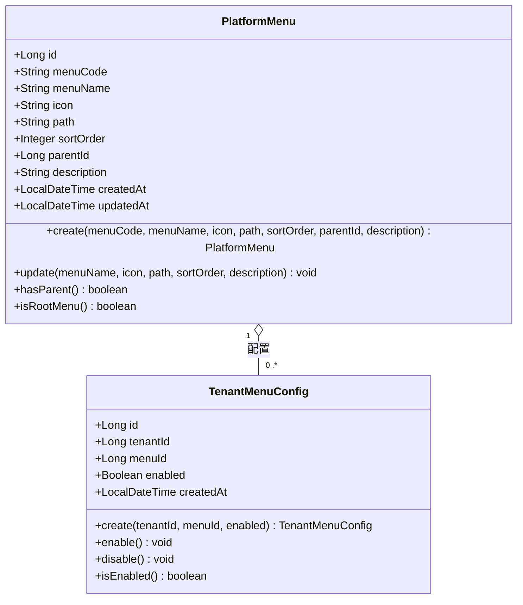
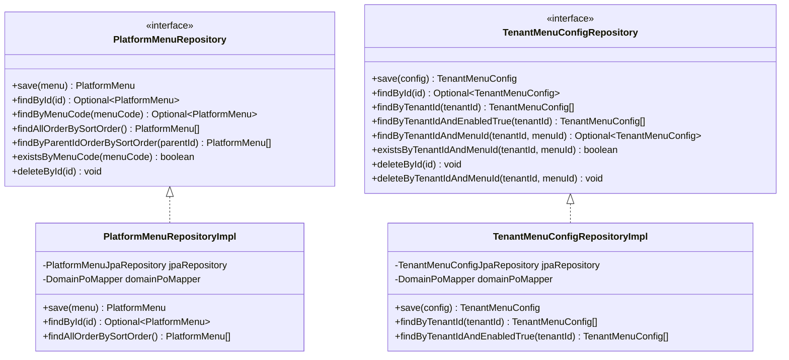
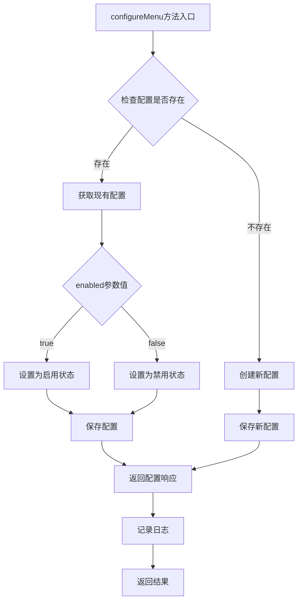
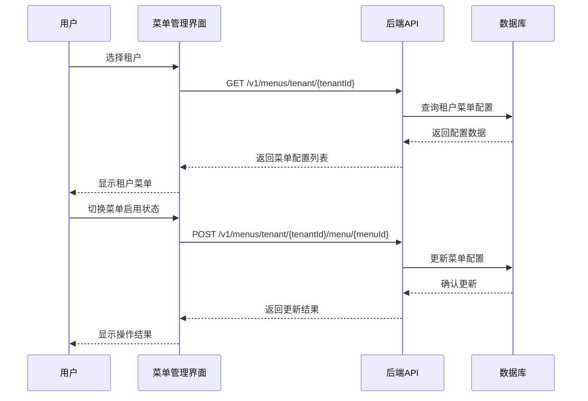
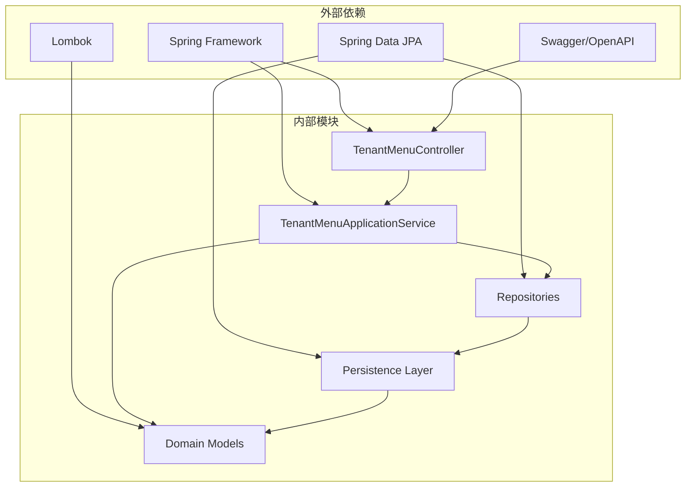

# 租户菜单控制器

<cite>
**本文档引用的文件**
- [TenantMenuController.java](file://iam-admin-server/src/main/java/iam/platform/admin/interfaces/rest/TenantMenuController.java)
- [TenantMenuApplicationService.java](file://iam-admin-server/src/main/java/iam/platform/admin/application/service/TenantMenuApplicationService.java)
- [PlatformMenu.java](file://iam-admin-server/src/main/java/iam/platform/admin/domain/model/entity/PlatformMenu.java)
- [TenantMenuConfig.java](file://iam-admin-server/src/main/java/iam/platform/admin/domain/model/entity/TenantMenuConfig.java)
- [PlatformMenuRepository.java](file://iam-admin-server/src/main/java/iam/platform/admin/domain/repository/PlatformMenuRepository.java)
- [TenantMenuConfigRepository.java](file://iam-admin-server/src/main/java/iam/platform/admin/domain/repository/TenantMenuConfigRepository.java)
- [PlatformMenuRepositoryImpl.java](file://iam-admin-server/src/main/java/iam/platform/admin/infrastructure/persistence/impl/PlatformMenuRepositoryImpl.java)
- [TenantMenuConfigRepositoryImpl.java](file://iam-admin-server/src/main/java/iam/platform/admin/infrastructure/persistence/impl/TenantMenuConfigRepositoryImpl.java)
- [TenantMenuConfigJpaRepository.java](file://iam-admin-server/src/main/java/iam/platform/admin/infrastructure/persistence/repository/TenantMenuConfigJpaRepository.java)
- [TenantMenuConfigPO.java](file://iam-admin-server/src/main/java/iam/platform/admin/infrastructure/persistence/entity/TenantMenuConfigPO.java)
- [MenuManagement.vue](file://iam-admin-ui/src/views/MenuManagement.vue)
- [SidebarMenu.vue](file://iam-admin-ui/src/components/layout/SidebarMenu.vue)
</cite>

## 目录
1. [简介](#简介)
2. [项目结构](#项目结构)
3. [核心组件](#核心组件)
4. [架构概览](#架构概览)
5. [详细组件分析](#详细组件分析)
6. [依赖关系分析](#依赖关系分析)
7. [性能考虑](#性能考虑)
8. [故障排除指南](#故障排除指南)
9. [结论](#结论)

## 简介

租户菜单控制器是IAM平台中的一个关键组件，负责管理平台级菜单和租户级菜单配置。该系统允许管理员为不同租户配置可见的菜单项，实现了多租户环境下的菜单权限控制功能。

系统采用分层架构设计，包含表现层、应用服务层、领域模型层和基础设施层，确保了良好的可维护性和扩展性。

## 项目结构

IAM平台采用模块化架构，租户菜单控制器位于管理员服务模块中：

**图表来源**
- [TenantMenuController.java:15-19](file://iam-admin-server/src/main/java/iam/platform/admin/interfaces/rest/TenantMenuController.java#L15-L19)
- [TenantMenuApplicationService.java:15-21](file://iam-admin-server/src/main/java/iam/platform/admin/application/service/TenantMenuApplicationService.java#L15-L21)

**章节来源**
- [TenantMenuController.java:1-102](file://iam-admin-server/src/main/java/iam/platform/admin/interfaces/rest/TenantMenuController.java#L1-L102)
- [TenantMenuApplicationService.java:1-130](file://iam-admin-server/src/main/java/iam/platform/admin/application/service/TenantMenuApplicationService.java#L1-L130)

## 核心组件

### REST控制器层

租户菜单控制器提供完整的REST API接口，支持平台菜单管理和租户菜单配置两大功能模块。

**平台菜单管理接口：**
- 创建平台菜单：POST `/v1/menus/platform`
- 获取平台菜单：GET `/v1/menus/platform/{id}`
- 列出所有平台菜单：GET `/v1/menus/platform`
- 更新平台菜单：PUT `/v1/menus/platform/{id}`
- 删除平台菜单：DELETE `/v1/menus/platform/{id}`

**租户菜单配置接口：**
- 配置租户菜单：POST `/v1/menus/tenant/{tenantId}/menu/{menuId}`
- 获取租户菜单配置：GET `/v1/menus/tenant/{tenantId}`
- 获取启用的租户菜单：GET `/v1/menus/tenant/{tenantId}/enabled`
- 移除租户菜单：DELETE `/v1/menus/tenant/{tenantId}/menu/{menuId}`

### 应用服务层

应用服务层封装了业务逻辑，提供了事务管理和数据转换功能：

- 平台菜单CRUD操作
- 租户菜单配置管理
- 数据验证和错误处理
- 响应数据格式化

**章节来源**
- [TenantMenuController.java:25-100](file://iam-admin-server/src/main/java/iam/platform/admin/interfaces/rest/TenantMenuController.java#L25-L100)
- [TenantMenuApplicationService.java:25-98](file://iam-admin-server/src/main/java/iam/platform/admin/application/service/TenantMenuApplicationService.java#L25-L98)

## 架构概览

系统采用经典的分层架构模式，实现了关注点分离和职责明确划分：

**图表来源**
- [TenantMenuController.java:76-80](file://iam-admin-server/src/main/java/iam/platform/admin/interfaces/rest/TenantMenuController.java#L76-L80)
- [TenantMenuApplicationService.java:64-82](file://iam-admin-server/src/main/java/iam/platform/admin/application/service/TenantMenuApplicationService.java#L64-L82)

## 详细组件分析

### 领域模型分析

#### 平台菜单实体

平台菜单实体定义了系统中的功能菜单结构，支持树形层级关系：

**图表来源**
- [PlatformMenu.java:18-88](file://iam-admin-server/src/main/java/iam/platform/admin/domain/model/entity/PlatformMenu.java#L18-L88)
- [TenantMenuConfig.java:19-64](file://iam-admin-server/src/main/java/iam/platform/admin/domain/model/entity/TenantMenuConfig.java#L19-L64)

#### 仓储接口设计

仓储接口定义了数据访问的抽象层：

**图表来源**
- [PlatformMenuRepository.java:10-26](file://iam-admin-server/src/main/java/iam/platform/admin/domain/repository/PlatformMenuRepository.java#L10-L26)
- [TenantMenuConfigRepository.java:8-24](file://iam-admin-server/src/main/java/iam/platform/admin/domain/repository/TenantMenuConfigRepository.java#L8-L24)

**章节来源**
- [PlatformMenu.java:35-77](file://iam-admin-server/src/main/java/iam/platform/admin/domain/model/entity/PlatformMenu.java#L35-L77)
- [TenantMenuConfig.java:31-57](file://iam-admin-server/src/main/java/iam/platform/admin/domain/model/entity/TenantMenuConfig.java#L31-L57)

### 应用服务实现

应用服务层提供了完整的业务逻辑实现，包括数据验证、事务管理和错误处理：

**图表来源**
- [TenantMenuApplicationService.java:64-82](file://iam-admin-server/src/main/java/iam/platform/admin/application/service/TenantMenuApplicationService.java#L64-L82)

**章节来源**
- [TenantMenuApplicationService.java:25-98](file://iam-admin-server/src/main/java/iam/platform/admin/application/service/TenantMenuApplicationService.java#L25-L98)

### 前端集成分析

前端界面提供了直观的菜单管理操作界面：

**图表来源**
- [MenuManagement.vue:169-180](file://iam-admin-ui/src/views/MenuManagement.vue#L169-L180)
- [MenuManagement.vue:238-246](file://iam-admin-ui/src/views/MenuManagement.vue#L238-L246)

**章节来源**
- [MenuManagement.vue:149-246](file://iam-admin-ui/src/views/MenuManagement.vue#L149-L246)
- [SidebarMenu.vue:30-33](file://iam-admin-ui/src/components/layout/SidebarMenu.vue#L30-L33)

## 依赖关系分析

系统采用了清晰的依赖注入和分层架构设计：

**图表来源**
- [TenantMenuController.java:1-14](file://iam-admin-server/src/main/java/iam/platform/admin/interfaces/rest/TenantMenuController.java#L1-L14)
- [TenantMenuApplicationService.java:1-14](file://iam-admin-server/src/main/java/iam/platform/admin/application/service/TenantMenuApplicationService.java#L1-L14)

**章节来源**
- [PlatformMenuRepositoryImpl.java:1-67](file://iam-admin-server/src/main/java/iam/platform/admin/infrastructure/persistence/impl/PlatformMenuRepositoryImpl.java#L1-L67)
- [TenantMenuConfigRepositoryImpl.java:1-67](file://iam-admin-server/src/main/java/iam/platform/admin/infrastructure/persistence/impl/TenantMenuConfigRepositoryImpl.java#L1-L67)

## 性能考虑

### 数据访问优化

1. **查询优化**：使用JPA仓库的原生查询方法，避免N+1查询问题
2. **索引策略**：在数据库层面为常用查询字段建立索引
3. **缓存机制**：可以考虑添加适当的缓存策略减少重复查询

### 事务管理

1. **事务边界**：合理设置事务边界，避免长时间持有数据库连接
2. **批量操作**：对于大量数据的操作，考虑使用批量处理机制

### 前端性能

1. **懒加载**：菜单数据采用懒加载方式，提升页面响应速度
2. **状态管理**：使用Vue的响应式系统优化数据更新性能

## 故障排除指南

### 常见问题及解决方案

**菜单配置失败**
- 检查租户ID和菜单ID的有效性
- 确认数据库连接正常
- 查看应用日志获取详细错误信息

**菜单显示异常**
- 验证菜单层级关系的正确性
- 检查前端路由配置
- 确认用户权限设置

**性能问题**
- 分析数据库查询执行计划
- 检查索引使用情况
- 优化复杂查询语句

**章节来源**
- [TenantMenuApplicationService.java:35-38](file://iam-admin-server/src/main/java/iam/platform/admin/application/service/TenantMenuApplicationService.java#L35-L38)
- [TenantMenuApplicationService.java:94-98](file://iam-admin-server/src/main/java/iam/platform/admin/application/service/TenantMenuApplicationService.java#L94-L98)

## 结论

租户菜单控制器是一个设计良好、功能完整的多租户菜单管理系统。系统通过清晰的分层架构、完善的领域建模和友好的用户界面，为IAM平台提供了强大的菜单权限控制能力。

主要特点包括：
- 完整的REST API接口设计
- 清晰的业务逻辑分层
- 可扩展的领域模型
- 用户友好的前端界面
- 良好的错误处理机制

该系统为后续的功能扩展和维护奠定了坚实的基础，能够满足复杂的多租户应用场景需求。