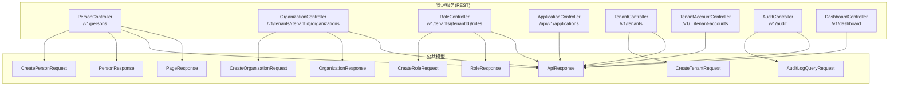
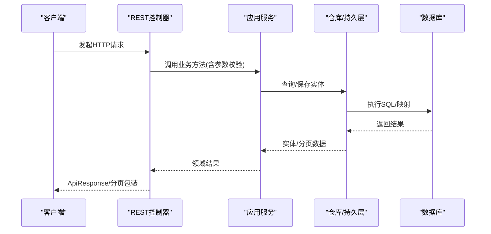
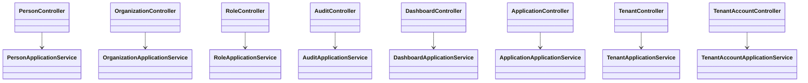

# 管理API

<cite>
**本文引用的文件**
- [PersonController.java](file://iam-admin-server/src/main/java/iam/platform/admin/interfaces/rest/PersonController.java)
- [OrganizationController.java](file://iam-admin-server/src/main/java/iam/platform/admin/interfaces/rest/OrganizationController.java)
- [RoleController.java](file://iam-admin-server/src/main/java/iam/platform/admin/interfaces/rest/RoleController.java)
- [AuditController.java](file://iam-admin-server/src/main/java/iam/platform/admin/interfaces/rest/AuditController.java)
- [DashboardController.java](file://iam-admin-server/src/main/java/iam/platform/admin/interfaces/rest/DashboardController.java)
- [ApplicationController.java](file://iam-admin-server/src/main/java/iam/platform/admin/interfaces/rest/ApplicationController.java)
- [TenantController.java](file://iam-admin-server/src/main/java/iam/platform/admin/interfaces/rest/TenantController.java)
- [TenantAccountController.java](file://iam-admin-server/src/main/java/iam/platform/admin/interfaces/rest/TenantAccountController.java)
- [CreatePersonRequest.java](file://iam-common/src/main/java/iam/platform/common/dto/request/CreatePersonRequest.java)
- [CreateOrganizationRequest.java](file://iam-common/src/main/java/iam/platform/common/dto/request/CreateOrganizationRequest.java)
- [CreateRoleRequest.java](file://iam-common/src/main/java/iam/platform/common/dto/request/CreateRoleRequest.java)
- [CreateTenantRequest.java](file://iam-common/src/main/java/iam/platform/common/dto/request/CreateTenantRequest.java)
- [AuditLogQueryRequest.java](file://iam-common/src/main/java/iam/platform/common/dto/request/AuditLogQueryRequest.java)
- [PersonResponse.java](file://iam-common/src/main/java/iam/platform/common/dto/response/PersonResponse.java)
- [OrganizationResponse.java](file://iam-common/src/main/java/iam/platform/common/dto/response/OrganizationResponse.java)
- [RoleResponse.java](file://iam-common/src/main/java/iam/platform/common/dto/response/RoleResponse.java)
- [ApiResponse.java](file://iam-common/src/main/java/iam/platform/common/api/ApiResponse.java)
- [PageResponse.java](file://iam-common/src/main/java/iam/platform/common/api/PageResponse.java)
</cite>

## 目录
1. [简介](#简介)
2. [项目结构](#项目结构)
3. [核心组件](#核心组件)
4. [架构总览](#架构总览)
5. [详细组件分析](#详细组件分析)
6. [依赖分析](#依赖分析)
7. [性能考虑](#性能考虑)
8. [故障排查指南](#故障排查指南)
9. [结论](#结论)
10. [附录](#附录)

## 简介
本文件为管理服务器的完整API文档，覆盖用户管理、组织管理、角色与权限、租户管理、审计日志、仪表板以及应用管理等模块。每个API均给出请求路径、方法、参数、请求/响应示例及错误处理说明，并对RBAC权限模型进行说明。

## 项目结构
管理API位于 iam-admin-server 模块的 REST 控制器层，请求参数与响应数据模型统一定义在 iam-common 模块中，采用统一的 ApiResponse 包裹返回体与分页 PageResponse。

图表来源
- [PersonController.java:25-67](file://iam-admin-server/src/main/java/iam/platform/admin/interfaces/rest/PersonController.java#L25-L67)
- [OrganizationController.java:25-83](file://iam-admin-server/src/main/java/iam/platform/admin/interfaces/rest/OrganizationController.java#L25-L83)
- [RoleController.java:23-57](file://iam-admin-server/src/main/java/iam/platform/admin/interfaces/rest/RoleController.java#L23-L57)
- [ApplicationController.java:28-138](file://iam-admin-server/src/main/java/iam/platform/admin/interfaces/rest/ApplicationController.java#L28-L138)
- [TenantController.java:26-89](file://iam-admin-server/src/main/java/iam/platform/admin/interfaces/rest/TenantController.java#L26-L89)
- [TenantAccountController.java:26-93](file://iam-admin-server/src/main/java/iam/platform/admin/interfaces/rest/TenantAccountController.java#L26-L93)
- [AuditController.java:26-88](file://iam-admin-server/src/main/java/iam/platform/admin/interfaces/rest/AuditController.java#L26-L88)
- [DashboardController.java:23-70](file://iam-admin-server/src/main/java/iam/platform/admin/interfaces/rest/DashboardController.java#L23-L70)
- [CreatePersonRequest.java:11-36](file://iam-common/src/main/java/iam/platform/common/dto/request/CreatePersonRequest.java#L11-L36)
- [CreateOrganizationRequest.java:12-42](file://iam-common/src/main/java/iam/platform/common/dto/request/CreateOrganizationRequest.java#L12-L42)
- [CreateRoleRequest.java:11-29](file://iam-common/src/main/java/iam/platform/common/dto/request/CreateRoleRequest.java#L11-L29)
- [CreateTenantRequest.java:16-42](file://iam-common/src/main/java/iam/platform/common/dto/request/CreateTenantRequest.java#L16-L42)
- [AuditLogQueryRequest.java:13-40](file://iam-common/src/main/java/iam/platform/common/dto/request/AuditLogQueryRequest.java#L13-L40)
- [PersonResponse.java:10-29](file://iam-common/src/main/java/iam/platform/common/dto/response/PersonResponse.java#L10-L29)
- [OrganizationResponse.java:12-39](file://iam-common/src/main/java/iam/platform/common/dto/response/OrganizationResponse.java#L12-L39)
- [RoleResponse.java:11-25](file://iam-common/src/main/java/iam/platform/common/dto/response/RoleResponse.java#L11-L25)
- [ApiResponse.java](file://iam-common/src/main/java/iam/platform/common/api/ApiResponse.java)
- [PageResponse.java](file://iam-common/src/main/java/iam/platform/common/api/PageResponse.java)

章节来源
- [PersonController.java:25-67](file://iam-admin-server/src/main/java/iam/platform/admin/interfaces/rest/PersonController.java#L25-L67)
- [OrganizationController.java:25-83](file://iam-admin-server/src/main/java/iam/platform/admin/interfaces/rest/OrganizationController.java#L25-L83)
- [RoleController.java:23-57](file://iam-admin-server/src/main/java/iam/platform/admin/interfaces/rest/RoleController.java#L23-L57)
- [ApplicationController.java:28-138](file://iam-admin-server/src/main/java/iam/platform/admin/interfaces/rest/ApplicationController.java#L28-L138)
- [TenantController.java:26-89](file://iam-admin-server/src/main/java/iam/platform/admin/interfaces/rest/TenantController.java#L26-L89)
- [TenantAccountController.java:26-93](file://iam-admin-server/src/main/java/iam/platform/admin/interfaces/rest/TenantAccountController.java#L26-L93)
- [AuditController.java:26-88](file://iam-admin-server/src/main/java/iam/platform/admin/interfaces/rest/AuditController.java#L26-L88)
- [DashboardController.java:23-70](file://iam-admin-server/src/main/java/iam/platform/admin/interfaces/rest/DashboardController.java#L23-L70)

## 核心组件
- 统一响应包装：所有接口返回 ApiResponse<T>，成功时携带 data；分页列表使用 PageResponse<T>。
- 分页参数：默认 page=0、size=20，支持排序字段与方向。
- 权限注解：部分端点使用 @RequirePermission 进行RBAC校验。
- 参数校验：请求对象使用 Jakarta Bean Validation 注解进行参数约束。

章节来源
- [ApiResponse.java](file://iam-common/src/main/java/iam/platform/common/api/ApiResponse.java)
- [PageResponse.java](file://iam-common/src/main/java/iam/platform/common/api/PageResponse.java)
- [DashboardController.java:34-68](file://iam-admin-server/src/main/java/iam/platform/admin/interfaces/rest/DashboardController.java#L34-L68)

## 架构总览
管理API采用分层设计：控制器层负责HTTP路由与参数绑定，应用服务层编排业务逻辑，数据访问层通过仓库接口持久化。审计与权限切面在运行期织入，确保日志与鉴权横切关注点。

图表来源
- [PersonController.java:33-66](file://iam-admin-server/src/main/java/iam/platform/admin/interfaces/rest/PersonController.java#L33-L66)
- [OrganizationController.java:33-82](file://iam-admin-server/src/main/java/iam/platform/admin/interfaces/rest/OrganizationController.java#L33-L82)
- [RoleController.java:31-49](file://iam-admin-server/src/main/java/iam/platform/admin/interfaces/rest/RoleController.java#L31-L49)
- [ApplicationController.java:38-137](file://iam-admin-server/src/main/java/iam/platform/admin/interfaces/rest/ApplicationController.java#L38-L137)
- [TenantController.java:34-88](file://iam-admin-server/src/main/java/iam/platform/admin/interfaces/rest/TenantController.java#L34-L88)
- [TenantAccountController.java:34-92](file://iam-admin-server/src/main/java/iam/platform/admin/interfaces/rest/TenantAccountController.java#L34-L92)
- [AuditController.java:34-87](file://iam-admin-server/src/main/java/iam/platform/admin/interfaces/rest/AuditController.java#L34-L87)
- [DashboardController.java:32-69](file://iam-admin-server/src/main/java/iam/platform/admin/interfaces/rest/DashboardController.java#L32-L69)

## 详细组件分析

### 用户管理 API
- 路径前缀：/v1/persons
- 支持操作：创建、按ID查询、更新、删除、分页列表
- 请求/响应模型：CreatePersonRequest、UpdatePersonRequest、PersonResponse
- 统一返回：ApiResponse<PersonResponse> 或 ApiResponse<PageResponse<PersonResponse>>

请求示例（创建）
- 方法：POST
- 路径：/v1/persons
- 请求体字段参考：用户名、邮箱、电话、密码、昵称、头像URL
- 示例字段路径：[CreatePersonRequest.java:15-36](file://iam-common/src/main/java/iam/platform/common/dto/request/CreatePersonRequest.java#L15-L36)

响应示例（创建）
- 状态码：201 Created
- 返回体：ApiResponse<PersonResponse>，data为新建用户信息
- 示例字段路径：[PersonResponse.java:14-29](file://iam-common/src/main/java/iam/platform/common/dto/response/PersonResponse.java#L14-L29)

错误处理
- 参数校验失败：返回400，错误信息由验证框架生成
- 业务异常：抛出通用业务异常，由全局异常处理器转换为统一格式

章节来源
- [PersonController.java:25-67](file://iam-admin-server/src/main/java/iam/platform/admin/interfaces/rest/PersonController.java#L25-L67)
- [CreatePersonRequest.java:11-36](file://iam-common/src/main/java/iam/platform/common/dto/request/CreatePersonRequest.java#L11-L36)
- [PersonResponse.java:10-29](file://iam-common/src/main/java/iam/platform/common/dto/response/PersonResponse.java#L10-L29)
- [ApiResponse.java](file://iam-common/src/main/java/iam/platform/common/api/ApiResponse.java)
- [PageResponse.java](file://iam-common/src/main/java/iam/platform/common/api/PageResponse.java)

### 组织管理 API
- 路径前缀：/v1/tenants/{tenantId}/organizations
- 支持操作：创建、按ID查询、更新、删除、启用/停用、查询组织树
- 请求/响应模型：CreateOrganizationRequest、UpdateOrganizationRequest、OrganizationResponse
- 统一返回：ApiResponse<OrganizationResponse> 或 ApiResponse<List<OrganizationResponse>>

请求示例（创建）
- 方法：POST
- 路径：/v1/tenants/{tenantId}/organizations
- 请求体字段参考：组织编码、名称、类型、父级ID、负责人ID、排序、电话、邮箱、描述
- 示例字段路径：[CreateOrganizationRequest.java:16-42](file://iam-common/src/main/java/iam/platform/common/dto/request/CreateOrganizationRequest.java#L16-L42)

响应示例（查询组织树）
- 方法：GET
- 路径：/v1/tenants/{tenantId}/organizations
- 返回：ApiResponse<List<OrganizationResponse>>
- 示例字段路径：[OrganizationResponse.java:12-39](file://iam-common/src/main/java/iam/platform/common/dto/response/OrganizationResponse.java#L12-L39)

错误处理
- 参数校验失败：返回400
- 业务异常：统一异常转换

章节来源
- [OrganizationController.java:25-83](file://iam-admin-server/src/main/java/iam/platform/admin/interfaces/rest/OrganizationController.java#L25-L83)
- [CreateOrganizationRequest.java:12-42](file://iam-common/src/main/java/iam/platform/common/dto/request/CreateOrganizationRequest.java#L12-L42)
- [OrganizationResponse.java:12-39](file://iam-common/src/main/java/iam/platform/common/dto/response/OrganizationResponse.java#L12-L39)
- [ApiResponse.java](file://iam-common/src/main/java/iam/platform/common/api/ApiResponse.java)

### 角色与权限管理 API
- 路径前缀：/v1/tenants/{tenantId}/roles
- 支持操作：创建、按ID查询、列出（含全局角色）、删除
- 请求/响应模型：CreateRoleRequest、RoleResponse
- 统一返回：ApiResponse<RoleResponse> 或 ApiResponse<List<RoleResponse>>

请求示例（创建）
- 方法：POST
- 路径：/v1/tenants/{tenantId}/roles
- 请求体字段参考：角色编码、名称、类型、描述、是否系统内置
- 示例字段路径：[CreateRoleRequest.java:15-29](file://iam-common/src/main/java/iam/platform/common/dto/request/CreateRoleRequest.java#L15-L29)

响应示例（列出）
- 方法：GET
- 路径：/v1/tenants/{tenantId}/roles
- 返回：ApiResponse<List<RoleResponse>>
- 示例字段路径：[RoleResponse.java:11-25](file://iam-common/src/main/java/iam/platform/common/dto/response/RoleResponse.java#L11-L25)

RBAC说明
- 控制器层使用 @RequirePermission 注解进行权限拦截
- 典型权限键如：dashboard:read、audit:read、tenant:read、tenant:write

章节来源
- [RoleController.java:23-57](file://iam-admin-server/src/main/java/iam/platform/admin/interfaces/rest/RoleController.java#L23-L57)
- [CreateRoleRequest.java:11-29](file://iam-common/src/main/java/iam/platform/common/dto/request/CreateRoleRequest.java#L11-L29)
- [RoleResponse.java:11-25](file://iam-common/src/main/java/iam/platform/common/dto/response/RoleResponse.java#L11-L25)
- [DashboardController.java:34-68](file://iam-admin-server/src/main/java/iam/platform/admin/interfaces/rest/DashboardController.java#L34-L68)
- [ApiResponse.java](file://iam-common/src/main/java/iam/platform/common/api/ApiResponse.java)

### 租户管理 API
- 路径前缀：/v1/tenants
- 支持操作：创建、按ID查询、更新、删除（软删）、分页列表、启用/挂起
- 请求/响应模型：CreateTenantRequest、UpdateTenantRequest、TenantResponse
- 统一返回：ApiResponse<TenantResponse> 或 ApiResponse<PageResponse<TenantResponse>>

请求示例（创建）
- 方法：POST
- 路径：/v1/tenants
- 请求体字段参考：租户编码、名称、最大用户数、联系邮箱、电话、过期时间
- 示例字段路径：[CreateTenantRequest.java:16-42](file://iam-common/src/main/java/iam/platform/common/dto/request/CreateTenantRequest.java#L16-L42)

响应示例（分页列表）
- 方法：GET
- 路径：/v1/tenants?page=0&size=20
- 返回：ApiResponse<PageResponse<TenantResponse>>

错误处理
- 参数校验失败：返回400
- 权限注解：@RequirePermission("tenant:read"/"tenant:write")

章节来源
- [TenantController.java:26-89](file://iam-admin-server/src/main/java/iam/platform/admin/interfaces/rest/TenantController.java#L26-L89)
- [CreateTenantRequest.java:16-42](file://iam-common/src/main/java/iam/platform/common/dto/request/CreateTenantRequest.java#L16-L42)
- [ApiResponse.java](file://iam-common/src/main/java/iam/platform/common/api/ApiResponse.java)
- [PageResponse.java](file://iam-common/src/main/java/iam/platform/common/api/PageResponse.java)

### 审计日志 API
- 路径前缀：/v1/audit
- 支持操作：按条件分页查询、按ID查看详情、按用户/资源过滤查询、统计、CSV导出
- 请求/响应模型：AuditLogQueryRequest、AuditLogResponse、AuditStatisticsResponse
- 统一返回：ApiResponse<PageResponse<AuditLogResponse>> 等

请求示例（查询）
- 方法：GET
- 路径：/v1/audit/logs?tenantId=...&startDate=...&endDate=...
- 查询参数参考：租户ID、人员ID、用户名、事件分类、事件类型、结果、资源类型/ID、时间范围、分页与排序
- 示例字段路径：[AuditLogQueryRequest.java:13-40](file://iam-common/src/main/java/iam/platform/common/dto/request/AuditLogQueryRequest.java#L13-L40)

响应示例（统计）
- 方法：GET
- 路径：/v1/audit/statistics?tenantId=...&startDate=...&endDate=...
- 返回：ApiResponse<AuditStatisticsResponse>

导出CSV
- 方法：POST
- 路径：/v1/audit/logs/export
- 返回：application/octet-stream，文件名包含导出时间戳

章节来源
- [AuditController.java:26-88](file://iam-admin-server/src/main/java/iam/platform/admin/interfaces/rest/AuditController.java#L26-L88)
- [AuditLogQueryRequest.java:13-40](file://iam-common/src/main/java/iam/platform/common/dto/request/AuditLogQueryRequest.java#L13-L40)
- [ApiResponse.java](file://iam-common/src/main/java/iam/platform/common/api/ApiResponse.java)

### 仪表板 API
- 路径前缀：/v1/dashboard
- 支持操作：全局概览、租户概览、自然人统计、应用统计、审计统计
- 统一返回：ApiResponse<...Response>

请求示例（全局概览）
- 方法：GET
- 路径：/v1/dashboard/overview
- 权限：dashboard:read

请求示例（审计统计）
- 方法：GET
- 路径：/v1/dashboard/statistics/audit?tenantId=...&startDate=...&endDate=...
- 权限：audit:read

章节来源
- [DashboardController.java:23-70](file://iam-admin-server/src/main/java/iam/platform/admin/interfaces/rest/DashboardController.java#L23-L70)
- [ApiResponse.java](file://iam-common/src/main/java/iam/platform/common/api/ApiResponse.java)

### 应用管理 API
- 路径前缀：/api/v1/applications
- 支持操作：创建、按ID/按appId查询、按租户查询、全量列表、更新、删除、轮转密钥、状态管理（启用/停用/封禁）、权限管理（创建/查询/删除）

请求示例（创建应用）
- 方法：POST
- 路径：/api/v1/applications
- 描述：应用密钥仅在创建时返回一次
- 返回：ApiResponse<ApplicationCreatedResponse>

请求示例（轮转密钥）
- 方法：POST
- 路径：/api/v1/applications/{id}/rotate-secret
- 描述：新密钥仅返回一次

请求示例（权限管理）
- 创建权限：POST /api/v1/applications/{id}/permissions
- 列出权限：GET /api/v1/applications/{id}/permissions
- 删除权限：DELETE /api/v1/applications/permissions/{permissionId}

章节来源
- [ApplicationController.java:28-138](file://iam-admin-server/src/main/java/iam/platform/admin/interfaces/rest/ApplicationController.java#L28-L138)
- [ApiResponse.java](file://iam-common/src/main/java/iam/platform/common/api/ApiResponse.java)

### 租户账户管理 API
- 路径前缀：/v1/.../tenant-accounts
- 支持操作：为自然人创建租户账户、按ID查询、更新、挂起、重新激活、退出租户、按人员/租户查询

请求示例（创建租户账户）
- 方法：POST
- 路径：/v1/persons/{personId}/tenant-accounts
- 返回：ApiResponse<TenantAccountResponse>

请求示例（退出租户）
- 方法：POST
- 路径：/v1/tenant-accounts/{id}/leave
- 返回：ApiResponse<Void>

章节来源
- [TenantAccountController.java:26-93](file://iam-admin-server/src/main/java/iam/platform/admin/interfaces/rest/TenantAccountController.java#L26-L93)
- [ApiResponse.java](file://iam-common/src/main/java/iam/platform/common/api/ApiResponse.java)

## 依赖分析
- 控制器到应用服务：各控制器依赖对应的应用服务类，应用服务编排领域逻辑
- 应用服务到仓库：应用服务通过仓库接口访问持久层
- 公共模型：请求/响应对象与枚举统一在 iam-common 中定义，避免重复
- 统一异常与返回：全局异常处理器与 ApiResponse 统一错误与响应格式

图表来源
- [PersonController.java:31-31](file://iam-admin-server/src/main/java/iam/platform/admin/interfaces/rest/PersonController.java#L31-L31)
- [OrganizationController.java:31-31](file://iam-admin-server/src/main/java/iam/platform/admin/interfaces/rest/OrganizationController.java#L31-L31)
- [RoleController.java:29-29](file://iam-admin-server/src/main/java/iam/platform/admin/interfaces/rest/RoleController.java#L29-L29)
- [AuditController.java:32-32](file://iam-admin-server/src/main/java/iam/platform/admin/interfaces/rest/AuditController.java#L32-L32)
- [DashboardController.java:29-30](file://iam-admin-server/src/main/java/iam/platform/admin/interfaces/rest/DashboardController.java#L29-L30)
- [ApplicationController.java:34-34](file://iam-admin-server/src/main/java/iam/platform/admin/interfaces/rest/ApplicationController.java#L34-L34)
- [TenantController.java:32-32](file://iam-admin-server/src/main/java/iam/platform/admin/interfaces/rest/TenantController.java#L32-L32)
- [TenantAccountController.java:32-32](file://iam-admin-server/src/main/java/iam/platform/admin/interfaces/rest/TenantAccountController.java#L32-L32)

## 性能考虑
- 分页查询：默认每页20条，建议前端根据场景调整 size 并设置合理的排序字段
- 导出CSV：大数据量导出会占用IO与内存，建议限制时间范围与条数
- 组织树查询：树形结构建议缓存热点租户的组织树以降低计算成本
- 审计统计：聚合统计可结合索引优化，避免全表扫描

## 故障排查指南
常见错误与定位
- 参数校验失败：检查请求体字段是否满足约束（长度、格式、必填），查看400响应中的具体提示
- 权限不足：检查调用方是否具备所需权限键（如 tenant:read、audit:read）
- 资源不存在：确认ID是否存在或已被软删除
- 导出失败：检查请求参数的时间范围与过滤条件是否合理

章节来源
- [DashboardController.java:34-68](file://iam-admin-server/src/main/java/iam/platform/admin/interfaces/rest/DashboardController.java#L34-L68)
- [TenantController.java:37-61](file://iam-admin-server/src/main/java/iam/platform/admin/interfaces/rest/TenantController.java#L37-L61)
- [AuditController.java:73-87](file://iam-admin-server/src/main/java/iam/platform/admin/interfaces/rest/AuditController.java#L73-L87)

## 结论
本管理API覆盖了IAM平台的核心管理能力，采用统一的响应与分页模型，结合RBAC权限控制与审计导出能力，能够支撑多租户环境下的用户、组织、角色、应用与租户账户的全生命周期管理。

## 附录

### API一览与示例字段路径
- 用户管理
  - 创建：[PersonController.java:33-38](file://iam-admin-server/src/main/java/iam/platform/admin/interfaces/rest/PersonController.java#L33-L38)，请求体字段参考：[CreatePersonRequest.java:15-36](file://iam-common/src/main/java/iam/platform/common/dto/request/CreatePersonRequest.java#L15-L36)
  - 查询详情：[PersonController.java:40-44](file://iam-admin-server/src/main/java/iam/platform/admin/interfaces/rest/PersonController.java#L40-L44)，响应字段参考：[PersonResponse.java:14-29](file://iam-common/src/main/java/iam/platform/common/dto/response/PersonResponse.java#L14-L29)
  - 更新：[PersonController.java:46-51](file://iam-admin-server/src/main/java/iam/platform/admin/interfaces/rest/PersonController.java#L46-L51)
  - 删除：[PersonController.java:53-58](file://iam-admin-server/src/main/java/iam/platform/admin/interfaces/rest/PersonController.java#L53-L58)
  - 列表：[PersonController.java:60-66](file://iam-admin-server/src/main/java/iam/platform/admin/interfaces/rest/PersonController.java#L60-L66)

- 组织管理
  - 创建：[OrganizationController.java:33-40](file://iam-admin-server/src/main/java/iam/platform/admin/interfaces/rest/OrganizationController.java#L33-L40)，请求体字段参考：[CreateOrganizationRequest.java:16-42](file://iam-common/src/main/java/iam/platform/common/dto/request/CreateOrganizationRequest.java#L16-L42)
  - 查询详情：[OrganizationController.java:42-47](file://iam-admin-server/src/main/java/iam/platform/admin/interfaces/rest/OrganizationController.java#L42-L47)
  - 更新：[OrganizationController.java:49-55](file://iam-admin-server/src/main/java/iam/platform/admin/interfaces/rest/OrganizationController.java#L49-L55)
  - 删除：[OrganizationController.java:57-62](file://iam-admin-server/src/main/java/iam/platform/admin/interfaces/rest/OrganizationController.java#L57-L62)
  - 启用/停用：[OrganizationController.java:64-76](file://iam-admin-server/src/main/java/iam/platform/admin/interfaces/rest/OrganizationController.java#L64-L76)
  - 组织树：[OrganizationController.java:78-82](file://iam-admin-server/src/main/java/iam/platform/admin/interfaces/rest/OrganizationController.java#L78-L82)

- 角色管理
  - 创建：[RoleController.java:31-37](file://iam-admin-server/src/main/java/iam/platform/admin/interfaces/rest/RoleController.java#L31-L37)，请求体字段参考：[CreateRoleRequest.java:15-29](file://iam-common/src/main/java/iam/platform/common/dto/request/CreateRoleRequest.java#L15-L29)
  - 查询详情：[RoleController.java:39-43](file://iam-admin-server/src/main/java/iam/platform/admin/interfaces/rest/RoleController.java#L39-L43)
  - 列表：[RoleController.java:45-49](file://iam-admin-server/src/main/java/iam/platform/admin/interfaces/rest/RoleController.java#L45-L49)
  - 删除：[RoleController.java:51-56](file://iam-admin-server/src/main/java/iam/platform/admin/interfaces/rest/RoleController.java#L51-L56)

- 租户管理
  - 创建：[TenantController.java:34-40](file://iam-admin-server/src/main/java/iam/platform/admin/interfaces/rest/TenantController.java#L34-L40)，请求体字段参考：[CreateTenantRequest.java:16-42](file://iam-common/src/main/java/iam/platform/common/dto/request/CreateTenantRequest.java#L16-L42)
  - 查询详情：[TenantController.java:42-47](file://iam-admin-server/src/main/java/iam/platform/admin/interfaces/rest/TenantController.java#L42-L47)
  - 更新：[TenantController.java:49-55](file://iam-admin-server/src/main/java/iam/platform/admin/interfaces/rest/TenantController.java#L49-L55)
  - 删除：[TenantController.java:57-63](file://iam-admin-server/src/main/java/iam/platform/admin/interfaces/rest/TenantController.java#L57-L63)
  - 启用/挂起：[TenantController.java:74-88](file://iam-admin-server/src/main/java/iam/platform/admin/interfaces/rest/TenantController.java#L74-L88)
  - 列表：[TenantController.java:65-72](file://iam-admin-server/src/main/java/iam/platform/admin/interfaces/rest/TenantController.java#L65-L72)

- 审计日志
  - 查询：[AuditController.java:34-39](file://iam-admin-server/src/main/java/iam/platform/admin/interfaces/rest/AuditController.java#L34-L39)，查询参数参考：[AuditLogQueryRequest.java:13-40](file://iam-common/src/main/java/iam/platform/common/dto/request/AuditLogQueryRequest.java#L13-L40)
  - 详情：[AuditController.java:41-45](file://iam-admin-server/src/main/java/iam/platform/admin/interfaces/rest/AuditController.java#L41-L45)
  - 用户日志：[AuditController.java:47-53](file://iam-admin-server/src/main/java/iam/platform/admin/interfaces/rest/AuditController.java#L47-L53)
  - 资源日志：[AuditController.java:55-63](file://iam-admin-server/src/main/java/iam/platform/admin/interfaces/rest/AuditController.java#L55-L63)
  - 统计：[AuditController.java:65-71](file://iam-admin-server/src/main/java/iam/platform/admin/interfaces/rest/AuditController.java#L65-L71)
  - 导出：[AuditController.java:73-87](file://iam-admin-server/src/main/java/iam/platform/admin/interfaces/rest/AuditController.java#L73-L87)

- 仪表板
  - 全局概览：[DashboardController.java:32-37](file://iam-admin-server/src/main/java/iam/platform/admin/interfaces/rest/DashboardController.java#L32-L37)
  - 租户概览：[DashboardController.java:39-44](file://iam-admin-server/src/main/java/iam/platform/admin/interfaces/rest/DashboardController.java#L39-L44)
  - 自然人统计：[DashboardController.java:46-52](file://iam-admin-server/src/main/java/iam/platform/admin/interfaces/rest/DashboardController.java#L46-L52)
  - 应用统计：[DashboardController.java:54-60](file://iam-admin-server/src/main/java/iam/platform/admin/interfaces/rest/DashboardController.java#L54-L60)
  - 审计统计：[DashboardController.java:62-69](file://iam-admin-server/src/main/java/iam/platform/admin/interfaces/rest/DashboardController.java#L62-L69)

- 应用管理
  - 创建：[ApplicationController.java:38-45](file://iam-admin-server/src/main/java/iam/platform/admin/interfaces/rest/ApplicationController.java#L38-L45)
  - 查询详情：[ApplicationController.java:47-51](file://iam-admin-server/src/main/java/iam/platform/admin/interfaces/rest/ApplicationController.java#L47-L51)
  - 按appId查询：[ApplicationController.java:53-57](file://iam-admin-server/src/main/java/iam/platform/admin/interfaces/rest/ApplicationController.java#L53-L57)
  - 按租户查询：[ApplicationController.java:59-64](file://iam-admin-server/src/main/java/iam/platform/admin/interfaces/rest/ApplicationController.java#L59-L64)
  - 全量列表：[ApplicationController.java:66-70](file://iam-admin-server/src/main/java/iam/platform/admin/interfaces/rest/ApplicationController.java#L66-L70)
  - 更新：[ApplicationController.java:72-77](file://iam-admin-server/src/main/java/iam/platform/admin/interfaces/rest/ApplicationController.java#L72-L77)
  - 删除：[ApplicationController.java:79-84](file://iam-admin-server/src/main/java/iam/platform/admin/interfaces/rest/ApplicationController.java#L79-L84)
  - 轮转密钥：[ApplicationController.java:86-91](file://iam-admin-server/src/main/java/iam/platform/admin/interfaces/rest/ApplicationController.java#L86-L91)
  - 启用/停用/封禁：[ApplicationController.java:95-114](file://iam-admin-server/src/main/java/iam/platform/admin/interfaces/rest/ApplicationController.java#L95-L114)
  - 创建权限：[ApplicationController.java:118-124](file://iam-admin-server/src/main/java/iam/platform/admin/interfaces/rest/ApplicationController.java#L118-L124)
  - 列出权限：[ApplicationController.java:126-130](file://iam-admin-server/src/main/java/iam/platform/admin/interfaces/rest/ApplicationController.java#L126-L130)
  - 删除权限：[ApplicationController.java:132-137](file://iam-admin-server/src/main/java/iam/platform/admin/interfaces/rest/ApplicationController.java#L132-L137)

- 租户账户管理
  - 创建：[TenantAccountController.java:34-41](file://iam-admin-server/src/main/java/iam/platform/admin/interfaces/rest/TenantAccountController.java#L34-L41)
  - 查询详情：[TenantAccountController.java:43-47](file://iam-admin-server/src/main/java/iam/platform/admin/interfaces/rest/TenantAccountController.java#L43-L47)
  - 更新：[TenantAccountController.java:49-55](file://iam-admin-server/src/main/java/iam/platform/admin/interfaces/rest/TenantAccountController.java#L49-L55)
  - 挂起：[TenantAccountController.java:57-62](file://iam-admin-server/src/main/java/iam/platform/admin/interfaces/rest/TenantAccountController.java#L57-L62)
  - 重新激活：[TenantAccountController.java:64-69](file://iam-admin-server/src/main/java/iam/platform/admin/interfaces/rest/TenantAccountController.java#L64-L69)
  - 退出租户：[TenantAccountController.java:71-76](file://iam-admin-server/src/main/java/iam/platform/admin/interfaces/rest/TenantAccountController.java#L71-L76)
  - 按人员查询：[TenantAccountController.java:78-83](file://iam-admin-server/src/main/java/iam/platform/admin/interfaces/rest/TenantAccountController.java#L78-L83)
  - 按租户查询：[TenantAccountController.java:85-92](file://iam-admin-server/src/main/java/iam/platform/admin/interfaces/rest/TenantAccountController.java#L85-L92)