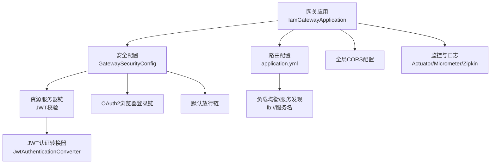
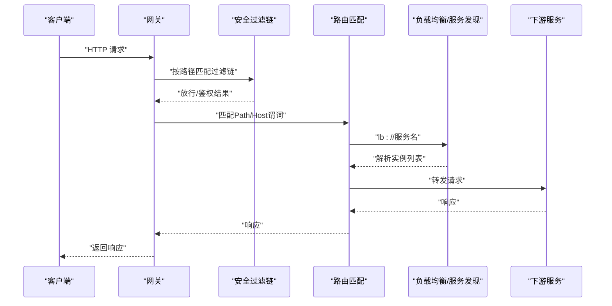
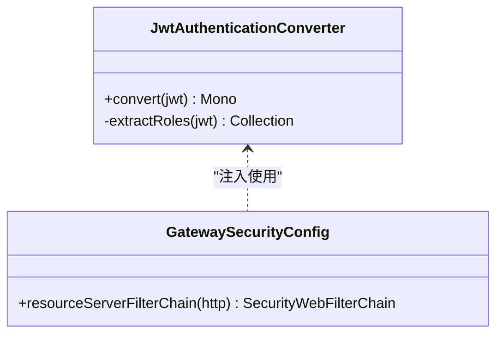
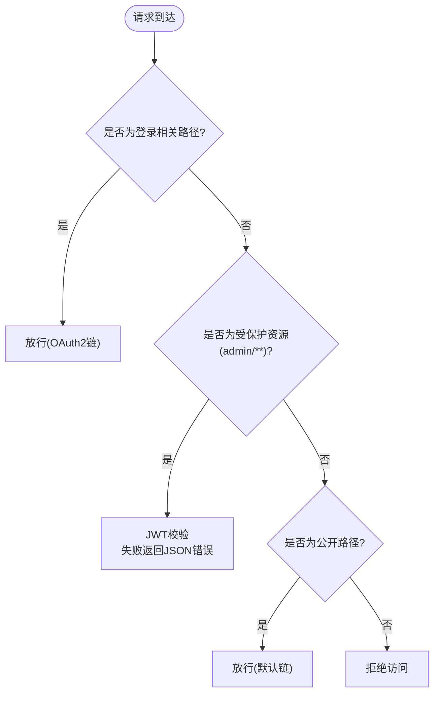
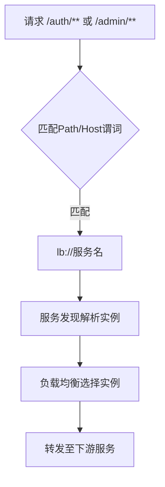
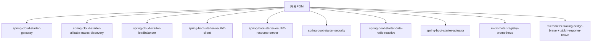

# 网关API

<cite>
**本文引用的文件**
- [IamGatewayApplication.java](file://iam-gateway/src/main/java/iam/platform/gateway/IamGatewayApplication.java)
- [JwtAuthenticationConverter.java](file://iam-gateway/src/main/java/iam/platform/gateway/infrastructure/security/JwtAuthenticationConverter.java)
- [GatewaySecurityConfig.java](file://iam-gateway/src/main/java/iam/platform/gateway/infrastructure/security/GatewaySecurityConfig.java)
- [GatewayAuthenticationSuccessHandler.java](file://iam-gateway/src/main/java/iam/platform/gateway/infrastructure/security/GatewayAuthenticationSuccessHandler.java)
- [application.yml](file://iam-gateway/src/main/resources/application.yml)
- [application-dev.yml](file://iam-gateway/src/main/resources/application-dev.yml)
- [bootstrap.yml](file://iam-gateway/bootstrap.yml)
- [pom.xml](file://iam-gateway/pom.xml)
- [docker-compose.yml](file://docker-compose.yml)
- [README.md](file://README.md)
</cite>

## 目录
1. [简介](#简介)
2. [项目结构](#项目结构)
3. [核心组件](#核心组件)
4. [架构总览](#架构总览)
5. [详细组件分析](#详细组件分析)
6. [依赖分析](#依赖分析)
7. [性能考虑](#性能考虑)
8. [故障排查指南](#故障排查指南)
9. [结论](#结论)
10. [附录](#附录)

## 简介
本文件面向API网关模块，系统性梳理其路由配置、请求转发、JWT认证转换器、安全过滤与权限控制、负载均衡与故障转移、跨域CORS、监控与日志、配置示例与部署指南，并总结在微服务架构中的核心作用与设计原则。目标是帮助开发者与运维人员快速理解并正确使用网关。

## 项目结构
- 网关应用入口启用服务发现客户端，集成Spring Cloud Gateway与WebFlux安全栈。
- 安全配置分为三层过滤链：OAuth2浏览器登录链、资源服务器JWT校验链、默认放行链。
- 路由以手动配置为主，结合基于路径与主机头的匹配规则，统一走Ribbon/LB负载均衡。
- 全局跨域配置开启，允许凭证与常见HTTP方法与头部。
- 集成Redis用于限流，Zipkin/Micrometer用于可观测性，Actuator暴露指标。

图表来源
- [IamGatewayApplication.java:1-15](file://iam-gateway/src/main/java/iam/platform/gateway/IamGatewayApplication.java#L1-L15)
- [GatewaySecurityConfig.java:25-73](file://iam-gateway/src/main/java/iam/platform/gateway/infrastructure/security/GatewaySecurityConfig.java#L25-L73)
- [JwtAuthenticationConverter.java:15-49](file://iam-gateway/src/main/java/iam/platform/gateway/infrastructure/security/JwtAuthenticationConverter.java#L15-L49)
- [application.yml:14-68](file://iam-gateway/src/main/resources/application.yml#L14-L68)

章节来源
- [IamGatewayApplication.java:1-15](file://iam-gateway/src/main/java/iam/platform/gateway/IamGatewayApplication.java#L1-L15)
- [application.yml:14-68](file://iam-gateway/src/main/resources/application.yml#L14-L68)

## 核心组件
- 网关应用入口与服务发现
  - 启动类启用@EnableDiscoveryClient，接入Nacos服务注册与发现。
- 安全过滤链
  - OAuth2浏览器登录链：处理/login/**、/oauth2/**等路径，登录成功后重定向首页。
  - 资源服务器链：对/admin/**等受保护路径进行JWT校验，失败时返回JSON错误。
  - 默认放行链：对公开路径如/auth/**、/static/**、/actuator/**等放行。
- JWT认证转换器
  - 从JWT中提取角色信息，构造带权限的认证令牌，支持realm_access.roles与自定义roles声明。
- 路由与转发
  - 手动配置路由，支持Path与Host谓词；统一通过lb://服务名走负载均衡。
- 跨域与CORS
  - 全局配置允许通配符来源、方法、头部，支持凭证与预检缓存。
- 监控与日志
  - 暴露health、info、metrics、gateway、prometheus等端点；Micrometer集成Prometheus；Zipkin桥接Brave；日志级别可调。

章节来源
- [GatewaySecurityConfig.java:25-73](file://iam-gateway/src/main/java/iam/platform/gateway/infrastructure/security/GatewaySecurityConfig.java#L25-L73)
- [GatewayAuthenticationSuccessHandler.java:13-37](file://iam-gateway/src/main/java/iam/platform/gateway/infrastructure/security/GatewayAuthenticationSuccessHandler.java#L13-L37)
- [JwtAuthenticationConverter.java:15-49](file://iam-gateway/src/main/java/iam/platform/gateway/infrastructure/security/JwtAuthenticationConverter.java#L15-L49)
- [application.yml:14-68](file://iam-gateway/src/main/resources/application.yml#L14-L68)
- [application.yml:93-116](file://iam-gateway/src/main/resources/application.yml#L93-L116)

## 架构总览
下图展示请求在网关内的流转：浏览器发起请求，按安全过滤链匹配，随后进入路由匹配阶段，最终转发至对应下游服务（认证/管理），并可携带JWT进行资源服务器校验。

图表来源
- [GatewaySecurityConfig.java:25-73](file://iam-gateway/src/main/java/iam/platform/gateway/infrastructure/security/GatewaySecurityConfig.java#L25-L73)
- [application.yml:18-54](file://iam-gateway/src/main/resources/application.yml#L18-L54)

## 详细组件分析

### JWT认证转换器工作原理与配置
- 工作原理
  - 从JWT中优先尝试读取realm_access.roles，其次读取自定义roles声明，构造包含权限集合的认证令牌。
  - 返回响应式Mono，适配WebFlux安全栈。
- 配置方法
  - 在资源服务器链中注入JwtAuthenticationConverter，完成JWT到权限令牌的转换。
  - 资源服务器issuer-uri与网关配置保持一致，确保签名校验通过。
- 关键点
  - 若JWT不包含角色声明，将返回空权限集合，需在下游服务侧补充RBAC策略或在上游颁发含角色的JWT。

图表来源
- [JwtAuthenticationConverter.java:15-49](file://iam-gateway/src/main/java/iam/platform/gateway/infrastructure/security/JwtAuthenticationConverter.java#L15-L49)
- [GatewaySecurityConfig.java:45-59](file://iam-gateway/src/main/java/iam/platform/gateway/infrastructure/security/GatewaySecurityConfig.java#L45-L59)

章节来源
- [JwtAuthenticationConverter.java:15-49](file://iam-gateway/src/main/java/iam/platform/gateway/infrastructure/security/JwtAuthenticationConverter.java#L15-L49)
- [GatewaySecurityConfig.java:45-59](file://iam-gateway/src/main/java/iam/platform/gateway/infrastructure/security/GatewaySecurityConfig.java#L45-L59)

### 安全过滤规则与权限控制策略
- OAuth2浏览器登录链
  - 放行/login/**与/oauth2/**路径，其余路径需认证；登录成功后重定向首页。
- 资源服务器链
  - 对/admin/**路径进行JWT校验；认证失败时返回JSON错误，包含错误类型与路径信息。
- 默认放行链
  - 对公开路径如/auth/**、/static/**、/favicon.ico、/error、/actuator/**、/.well-known/**、/oauth2/jwks放行。
- 权限控制策略建议
  - 在资源服务器链中仅保护敏感路径；在下游服务中基于JWT中的角色/权限做细粒度RBAC。
  - 结合网关层的速率限制与CORS策略，形成多层防护。

图表来源
- [GatewaySecurityConfig.java:25-73](file://iam-gateway/src/main/java/iam/platform/gateway/infrastructure/security/GatewaySecurityConfig.java#L25-L73)

章节来源
- [GatewaySecurityConfig.java:25-73](file://iam-gateway/src/main/java/iam/platform/gateway/infrastructure/security/GatewaySecurityConfig.java#L25-L73)
- [GatewayAuthenticationSuccessHandler.java:13-37](file://iam-gateway/src/main/java/iam/platform/gateway/infrastructure/security/GatewayAuthenticationSuccessHandler.java#L13-L37)

### 路由配置与请求转发机制
- 路由规则
  - 认证服务路由：/auth/**路径转发至lb://iam-auth-service；管理服务路由：/admin/**路径转发至lb://iam-admin-service。
  - 域名路由：auth.iam.local与admin.iam.local分别转发至对应服务。
- 转发机制
  - 通过lb://服务名结合服务发现与负载均衡，实现多实例间的请求分发。
- 速率限制
  - 为/auth/**与/admin/**路由分别配置RequestRateLimiter，参数包括replenishRate、burstCapacity与requestedTokens。

图表来源
- [application.yml:18-54](file://iam-gateway/src/main/resources/application.yml#L18-L54)

章节来源
- [application.yml:18-54](file://iam-gateway/src/main/resources/application.yml#L18-L54)

### 负载均衡与故障转移机制
- 负载均衡
  - 通过lb://服务名与Spring Cloud LoadBalancer实现客户端负载均衡，默认轮询策略。
- 故障转移
  - 当某个实例不可用时，LB会自动切换到可用实例；若所有实例均不可用，将返回上游错误。
- 服务发现
  - 网关与下游服务均接入Nacos，服务上下线由注册中心维护。

章节来源
- [pom.xml:30-34](file://iam-gateway/pom.xml#L30-L34)
- [bootstrap.yml:1-10](file://iam-gateway/bootstrap.yml#L1-L10)

### 跨域请求与CORS配置
- 全局CORS
  - 允许通配符来源模式、常见HTTP方法、任意头部、允许凭证、预检缓存时间。
- 使用建议
  - 生产环境建议收窄allowedOriginPatterns，避免使用通配符；根据业务场景调整允许的方法与头部。

章节来源
- [application.yml:55-68](file://iam-gateway/src/main/resources/application.yml#L55-L68)

### 监控与日志
- 指标与端点
  - 暴露health、info、metrics、gateway、prometheus等端点，便于健康检查与性能观测。
- 链路追踪
  - Micrometer集成Zipkin，采样概率设为1.0，便于全量追踪。
- 日志
  - 可调整root、网关包、Spring Security、Spring Cloud Gateway的日志级别，便于问题定位。

章节来源
- [application.yml:93-116](file://iam-gateway/src/main/resources/application.yml#L93-L116)

## 依赖分析
- 核心依赖
  - Spring Cloud Gateway（WebFlux）、Nacos服务发现、Spring Cloud LoadBalancer、OAuth2 Client、OAuth2 Resource Server、Spring Security、Redis Reactive、Actuator、Micrometer Prometheus、Zipkin。
- 依赖关系
  - 网关应用依赖上述Starter，配合application.yml与bootstrap.yml完成路由、安全、监控与服务发现配置。

图表来源
- [pom.xml:17-87](file://iam-gateway/pom.xml#L17-L87)

章节来源
- [pom.xml:17-87](file://iam-gateway/pom.xml#L17-L87)

## 性能考虑
- 路由与转发
  - 明确划分Path/Host路由，减少不必要的匹配开销；合理设置lb实例数量与权重。
- 限流
  - 为高并发接口配置合理的replenishRate与burstCapacity，避免突发流量击穿下游。
- 安全链路
  - 将登录链与资源服务器链分离，避免非必要路径进入JWT校验。
- 监控
  - 启用gateway指标，关注路由维度的错误率与延迟；结合Prometheus与Zipkin进行根因分析。

## 故障排查指南
- 认证失败
  - 检查JWT错误入口点返回的错误类型（过期、签名无效、发行者无效、缺少令牌等），核对issuer-uri与密钥配置。
- 登录重定向异常
  - 查看OAuth2登录成功处理器是否正确设置302重定向与Location头。
- 跨域问题
  - 确认CORS配置中的allowedOriginPatterns、方法与头部是否覆盖前端请求；生产环境避免使用通配符。
- 路由不通
  - 检查路由谓词（Path/Host）与lb://服务名是否正确；确认服务已在Nacos注册且网关可发现。
- 指标与追踪
  - 通过/actuator/gateway查看路由断言与过滤器执行情况；通过Prometheus与Zipkin定位慢调用与异常。

章节来源
- [GatewaySecurityConfig.java:78-129](file://iam-gateway/src/main/java/iam/platform/gateway/infrastructure/security/GatewaySecurityConfig.java#L78-L129)
- [GatewayAuthenticationSuccessHandler.java:13-37](file://iam-gateway/src/main/java/iam/platform/gateway/infrastructure/security/GatewayAuthenticationSuccessHandler.java#L13-L37)
- [application.yml:55-68](file://iam-gateway/src/main/resources/application.yml#L55-L68)
- [application.yml:18-54](file://iam-gateway/src/main/resources/application.yml#L18-L54)

## 结论
该网关以WebFlux为核心，结合Nacos服务发现与Spring Security，提供了清晰的三层安全过滤链、灵活的手动路由配置、完善的CORS与限流能力，并通过Actuator、Micrometer与Zipkin实现了可观测性。在微服务架构中，网关承担了统一入口、安全边界与流量治理的关键职责，建议在生产环境中进一步收紧CORS与认证策略，完善灰度与熔断机制。

## 附录

### 配置示例与部署指南
- 环境变量与配置要点
  - Nacos地址与命名空间：NACOS_ADDR、NACOS_NAMESPACE
  - Redis连接：REDIS_HOST、REDIS_PORT、REDIS_PASSWORD
  - 网关客户端密钥：GATEWAY_CLIENT_SECRET
  - Zipkin端点：ZIPKIN_ENDPOINT
  - Spring Profile：SPRING_PROFILES_ACTIVE
- Docker Compose
  - 提供Nacos、PostgreSQL、Redis、Zipkin以及各服务容器编排，包含健康检查与端口映射。
- 快速启动
  - 使用docker-compose一键拉起环境，访问网关端口即可体验登录与转发流程。

章节来源
- [docker-compose.yml:1-190](file://docker-compose.yml#L1-L190)
- [bootstrap.yml:1-10](file://iam-gateway/bootstrap.yml#L1-L10)
- [application.yml:1-116](file://iam-gateway/src/main/resources/application.yml#L1-L116)
- [README.md:160-169](file://README.md#L160-L169)