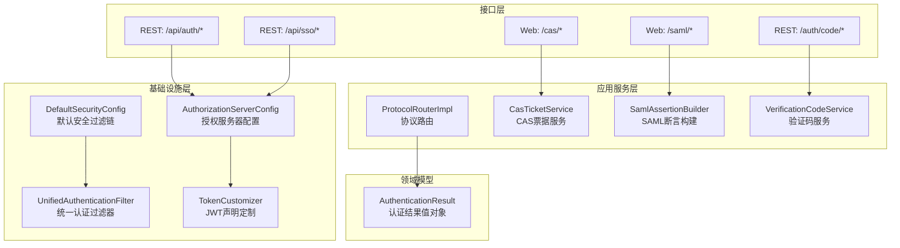
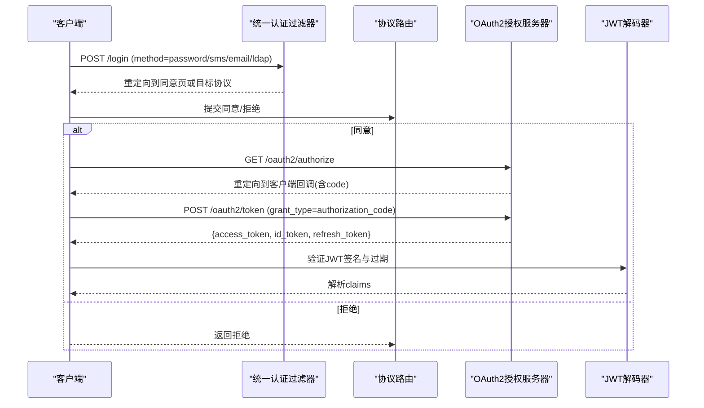
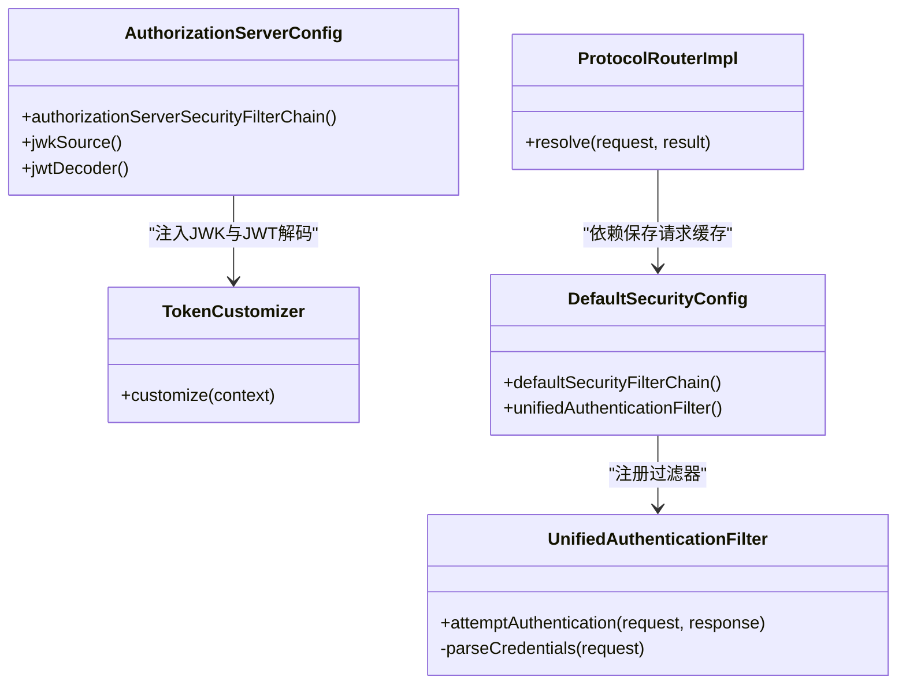

# 认证API

<cite>
**本文引用的文件**
- [AuthenticationController.java](file://iam-auth-server/src/main/java/iam/platform/auth/interfaces/rest/AuthenticationController.java)
- [SsoProactiveAuthController.java](file://iam-auth-server/src/main/java/iam/platform/auth/interfaces/rest/SsoProactiveAuthController.java)
- [VerificationCodeRequestController.java](file://iam-auth-server/src/main/java/iam/platform/auth/interfaces/rest/VerificationCodeRequestController.java)
- [CasController.java](file://iam-auth-server/src/main/java/iam/platform/auth/interfaces/web/CasController.java)
- [SamlSsoController.java](file://iam-auth-server/src/main/java/iam/platform/auth/interfaces/web/SamlSsoController.java)
- [AuthorizationServerConfig.java](file://iam-auth-server/src/main/java/iam/platform/auth/infrastructure/config/AuthorizationServerConfig.java)
- [DefaultSecurityConfig.java](file://iam-auth-server/src/main/java/iam/platform/auth/infrastructure/config/DefaultSecurityConfig.java)
- [UnifiedAuthenticationFilter.java](file://iam-auth-server/src/main/java/iam/platform/auth/infrastructure/security/UnifiedAuthenticationFilter.java)
- [TokenCustomizer.java](file://iam-auth-server/src/main/java/iam/platform/auth/infrastructure/security/TokenCustomizer.java)
- [ProtocolRouterImpl.java](file://iam-auth-server/src/main/java/iam/platform/auth/application/service/routing/ProtocolRouterImpl.java)
- [AuthenticationResult.java](file://iam-auth-server/src/main/java/iam/platform/auth/domain/model/valueobject/AuthenticationResult.java)
- [application.yml](file://iam-auth-server/src/main/resources/application.yml)
- [login.html](file://iam-auth-server/src/main/resources/templates/login.html)
- [consent.html](file://iam-auth-server/src/main/resources/templates/consent.html)
</cite>

## 目录
1. [简介](#简介)
2. [项目结构](#项目结构)
3. [核心组件](#核心组件)
4. [架构总览](#架构总览)
5. [详细组件分析](#详细组件分析)
6. [依赖分析](#依赖分析)
7. [性能考虑](#性能考虑)
8. [故障排查指南](#故障排查指南)
9. [结论](#结论)
10. [附录](#附录)

## 简介
本文件为认证服务器的完整API文档，覆盖以下能力：
- OAuth2/OIDC 标准端点：令牌颁发、用户信息、JWKS 等
- CAS 协议登录/登出与票据校验
- SAML SSO 断言消费者服务端点与元数据
- 验证码登录API（短信/邮件）
- 主动认证API（SSO平台向应用推送授权码）
- 内部认证API（仅内部服务使用）

同时提供各端点的HTTP方法、URL模式、请求参数、响应格式与错误码，并给出认证流程示例与客户端集成要点。

## 项目结构
认证服务器采用多模块分层设计，核心集中在 iam-auth-server 中：
- 接口层：REST 控制器与Web控制器分别处理OAuth2/OIDC、CAS、SAML、验证码、主动认证等
- 应用服务层：路由适配、票据与断言构建、验证服务等
- 基础设施层：安全过滤链、JWK/JWT配置、统一认证过滤器
- 领域模型：认证结果值对象、凭证模型等
- 资源与模板：登录页、同意页、静态资源等

图表来源
- [DefaultSecurityConfig.java:35-63](file://iam-auth-server/src/main/java/iam/platform/auth/infrastructure/config/DefaultSecurityConfig.java#L35-L63)
- [AuthorizationServerConfig.java:44-64](file://iam-auth-server/src/main/java/iam/platform/auth/infrastructure/config/AuthorizationServerConfig.java#L44-L64)
- [UnifiedAuthenticationFilter.java:18-38](file://iam-auth-server/src/main/java/iam/platform/auth/infrastructure/security/UnifiedAuthenticationFilter.java#L18-L38)
- [TokenCustomizer.java:27-61](file://iam-auth-server/src/main/java/iam/platform/auth/infrastructure/security/TokenCustomizer.java#L27-L61)
- [ProtocolRouterImpl.java:20-50](file://iam-auth-server/src/main/java/iam/platform/auth/application/service/routing/ProtocolRouterImpl.java#L20-L50)
- [AuthenticationResult.java:14-55](file://iam-auth-server/src/main/java/iam/platform/auth/domain/model/valueobject/AuthenticationResult.java#L14-L55)

章节来源
- [DefaultSecurityConfig.java:24-95](file://iam-auth-server/src/main/java/iam/platform/auth/infrastructure/config/DefaultSecurityConfig.java#L24-L95)
- [AuthorizationServerConfig.java:36-130](file://iam-auth-server/src/main/java/iam/platform/auth/infrastructure/config/AuthorizationServerConfig.java#L36-L130)

## 核心组件
- 统一认证过滤器：将多种认证方式（密码、短信验证码、邮箱验证码、LDAP）统一到 /login 表单提交
- 协议路由：根据保存的请求上下文决定重定向目标（OAuth2、CAS、SAML或默认）
- Token定制器：在JWT中注入多租户上下文、角色与权限等声明
- CAS控制器：处理CAS登录、票据校验与健康检查
- SAML控制器：处理SAML SSO登录、断言生成与元数据导出
- 验证码控制器：发送短信/邮件验证码
- 主动认证控制器：SSO平台向应用推送授权码

章节来源
- [UnifiedAuthenticationFilter.java:18-80](file://iam-auth-server/src/main/java/iam/platform/auth/infrastructure/security/UnifiedAuthenticationFilter.java#L18-L80)
- [ProtocolRouterImpl.java:20-50](file://iam-auth-server/src/main/java/iam/platform/auth/application/service/routing/ProtocolRouterImpl.java#L20-L50)
- [TokenCustomizer.java:27-127](file://iam-auth-server/src/main/java/iam/platform/auth/infrastructure/security/TokenCustomizer.java#L27-L127)
- [CasController.java:30-170](file://iam-auth-server/src/main/java/iam/platform/auth/interfaces/web/CasController.java#L30-L170)
- [SamlSsoController.java:28-151](file://iam-auth-server/src/main/java/iam/platform/auth/interfaces/web/SamlSsoController.java#L28-L151)
- [VerificationCodeRequestController.java:12-31](file://iam-auth-server/src/main/java/iam/platform/auth/interfaces/rest/VerificationCodeRequestController.java#L12-L31)
- [SsoProactiveAuthController.java:25-116](file://iam-auth-server/src/main/java/iam/platform/auth/interfaces/rest/SsoProactiveAuthController.java#L25-L116)

## 架构总览
认证服务器通过两套安全过滤链协同工作：
- 默认安全过滤链：处理表单登录、社交登录、注销、静态资源放行等
- 授权服务器过滤链：启用OAuth2/OIDC，提供标准端点（如 /oauth2/token），并配置JWT解码与JWK

图表来源
- [DefaultSecurityConfig.java:35-63](file://iam-auth-server/src/main/java/iam/platform/auth/infrastructure/config/DefaultSecurityConfig.java#L35-L63)
- [AuthorizationServerConfig.java:44-64](file://iam-auth-server/src/main/java/iam/platform/auth/infrastructure/config/AuthorizationServerConfig.java#L44-L64)
- [login.html:164-211](file://iam-auth-server/src/main/resources/templates/login.html#L164-L211)
- [consent.html:23-29](file://iam-auth-server/src/main/resources/templates/consent.html#L23-L29)

## 详细组件分析

### OAuth2/OIDC 标准端点
- 令牌颁发 /oauth2/token
  - 方法：POST
  - 内容类型：application/x-www-form-urlencoded
  - 请求参数：
    - grant_type：authorization_code 或 password 等
    - client_id / client_secret：客户端凭据（当使用密码授权时）
    - code / redirect_uri：授权码流程必需
    - username / password：密码授权必需
    - code_verifier：PKCE可选
  - 响应：成功返回 {access_token, token_type, expires_in, scope, refresh_token, id_token}
  - 错误：400/401/403/500，依据OAuth2规范
  - 安全：由授权服务器自动校验客户端、执行预/后置认证管道、生成JWT并应用声明定制器

- 用户信息 /oauth2/userinfo
  - 方法：GET
  - 头部：Authorization: Bearer <access_token>
  - 响应：包含受保护的用户属性（由TokenCustomizer注入的claims）

- JWKS /oauth2/jwks
  - 方法：GET
  - 响应：JWK Set（RSA密钥），KeyID基于公钥SHA-256指纹生成，保证重启后稳定

- 授权页 /oauth2/authorize
  - 方法：GET/POST
  - GET：显示同意页，供用户授权或拒绝
  - POST：批准/拒绝授权请求，触发授权码发放

- 登录页 /login
  - 方法：GET/POST
  - GET：展示统一登录界面（密码/验证码/社交）
  - POST：统一提交至 /login，由统一认证过滤器解析method并认证

- 注销 /logout
  - 方法：POST
  - 效果：使会话失效并重定向到登录页

章节来源
- [AuthorizationServerConfig.java:44-99](file://iam-auth-server/src/main/java/iam/platform/auth/infrastructure/config/AuthorizationServerConfig.java#L44-L99)
- [TokenCustomizer.java:27-127](file://iam-auth-server/src/main/java/iam/platform/auth/infrastructure/security/TokenCustomizer.java#L27-L127)
- [DefaultSecurityConfig.java:35-63](file://iam-auth-server/src/main/java/iam/platform/auth/infrastructure/config/DefaultSecurityConfig.java#L35-L63)
- [login.html:164-211](file://iam-auth-server/src/main/resources/templates/login.html#L164-L211)
- [consent.html:23-29](file://iam-auth-server/src/main/resources/templates/consent.html#L23-L29)

### CAS 协议端点
- 登录页 /cas/login
  - 方法：GET
  - 参数：service（可选）、renew（可选）、gateway（可选）
  - 响应：登录表单（支持CAS样式）

- 登录处理 /cas/login
  - 方法：POST
  - 参数：username、password、service（可选）
  - 响应：重定向至 service?ticket=ST-xxx 或成功页

- 票据校验 /cas/serviceTicket
  - 方法：GET
  - 参数：ticket
  - 响应：XML（成功包含用户与属性；失败返回INVALID_TICKET）

- 健康检查 /cas/health
  - 方法：GET
  - 响应：JSON（包含状态、协议版本与SLO能力）

- 单点登出（参考CAS控制器中的注册逻辑）
  - 在登录时将service注册到会话，用于后续SLO流程

章节来源
- [CasController.java:40-170](file://iam-auth-server/src/main/java/iam/platform/auth/interfaces/web/CasController.java#L40-L170)

### SAML SSO 端点
- SSO 登录页 /saml/sso
  - 方法：GET
  - 参数：acsUrl（必须）、relayState（可选）
  - 响应：登录表单

- SSO 登录处理 /saml/sso
  - 方法：POST
  - 参数：username、password、acsUrl（必须）、relayState（可选）
  - 响应：自动提交SAMLResponse的HTML表单至SP的ACS

- 元数据 /saml/metadata
  - 方法：GET
  - 响应：IdP元数据XML

- 断言构建
  - 基于认证结果生成SAML Assertion并返回自动提交表单

章节来源
- [SamlSsoController.java:38-151](file://iam-auth-server/src/main/java/iam/platform/auth/interfaces/web/SamlSsoController.java#L38-L151)

### 验证码登录API
- 发送短信验证码 /auth/code/sms
  - 方法：POST
  - 参数：phone
  - 响应：成功

- 发送邮件验证码 /auth/code/email
  - 方法：POST
  - 参数：email
  - 响应：成功

- 验证码登录（统一入口）
  - 方法：POST
  - URL：/login
  - 参数：method=sms或method=email；对应 phone/code 或 email/code
  - 响应：重定向至目标协议或默认页面

章节来源
- [VerificationCodeRequestController.java:19-30](file://iam-auth-server/src/main/java/iam/platform/auth/interfaces/rest/VerificationCodeRequestController.java#L19-L30)
- [login.html:296-325](file://iam-auth-server/src/main/resources/templates/login.html#L296-L325)
- [UnifiedAuthenticationFilter.java:43-62](file://iam-auth-server/src/main/java/iam/platform/auth/infrastructure/security/UnifiedAuthenticationFilter.java#L43-L62)

### 主动认证API（SSO平台推送授权码）
- 推送授权码 /api/sso/push/{clientId}
  - 方法：GET
  - 权限：已认证用户
  - 参数：state（可选）、nonce（可选）、code_challenge（可选）、code_challenge_method（默认S256）
  - 响应：内部转发至授权端点，返回授权码并重定向至客户端回调

- 登录回退 /api/sso/push/{clientId}/login
  - 方法：GET
  - 功能：未认证时重定向至登录页，并携带返回URL

章节来源
- [SsoProactiveAuthController.java:48-116](file://iam-auth-server/src/main/java/iam/platform/auth/interfaces/rest/SsoProactiveAuthController.java#L48-L116)

### 内部认证API
- 内部认证占位 /api/auth/*
  - 说明：保留给内部服务直接认证场景（不产生OAuth2令牌）
  - 注意：密码授权请使用标准 /oauth2/token 端点

章节来源
- [AuthenticationController.java:7-46](file://iam-auth-server/src/main/java/iam/platform/auth/interfaces/rest/AuthenticationController.java#L7-L46)

## 依赖分析
- 统一认证过滤器依赖认证管理器与统一成功/失败处理器，负责解析method并构造认证令牌
- 授权服务器配置启用OAuth2AuthorizationServer，注册OIDC与JWT解码器，并注入自定义JWK
- 协议路由根据保存的请求上下文选择CAS、SAML或OAuth2目标
- Token定制器从当前请求上下文中读取租户信息，向JWT注入多租户与权限声明

图表来源
- [DefaultSecurityConfig.java:35-88](file://iam-auth-server/src/main/java/iam/platform/auth/infrastructure/config/DefaultSecurityConfig.java#L35-L88)
- [AuthorizationServerConfig.java:44-99](file://iam-auth-server/src/main/java/iam/platform/auth/infrastructure/config/AuthorizationServerConfig.java#L44-L99)
- [UnifiedAuthenticationFilter.java:18-79](file://iam-auth-server/src/main/java/iam/platform/auth/infrastructure/security/UnifiedAuthenticationFilter.java#L18-L79)
- [TokenCustomizer.java:27-61](file://iam-auth-server/src/main/java/iam/platform/auth/infrastructure/security/TokenCustomizer.java#L27-L61)
- [ProtocolRouterImpl.java:24-50](file://iam-auth-server/src/main/java/iam/platform/auth/application/service/routing/ProtocolRouterImpl.java#L24-L50)

章节来源
- [DefaultSecurityConfig.java:24-95](file://iam-auth-server/src/main/java/iam/platform/auth/infrastructure/config/DefaultSecurityConfig.java#L24-L95)
- [AuthorizationServerConfig.java:36-130](file://iam-auth-server/src/main/java/iam/platform/auth/infrastructure/config/AuthorizationServerConfig.java#L36-L130)

## 性能考虑
- 连接池与超时：数据库连接池最大10，连接超时30秒，空闲超时10分钟，生命周期30分钟
- Redis：会话存储于Redis，命名空间为 sso-auth
- 速率限制与账户锁定：默认开启，5分钟内最多5次尝试；累计10次失败锁定30分钟
- IP白名单/黑名单：可配置
- JWT KeyID稳定性：基于公钥SHA-256指纹生成，避免重启导致JWKS缓存失效

章节来源
- [application.yml:15-32](file://iam-auth-server/src/main/resources/application.yml#L15-L32)
- [application.yml:90-102](file://iam-auth-server/src/main/resources/application.yml#L90-L102)
- [AuthorizationServerConfig.java:117-128](file://iam-auth-server/src/main/java/iam/platform/auth/infrastructure/config/AuthorizationServerConfig.java#L117-L128)

## 故障排查指南
- OAuth2令牌颁发失败
  - 检查客户端凭据与授权类型是否匹配
  - 确认授权码有效且未过期
  - 核对PKCE code_verifier（如有）

- 用户信息查询失败
  - 确认访问令牌有效且未过期
  - 检查TokenCustomizer是否正确注入claims

- CAS票据无效
  - 票据可能已消费或过期
  - 检查票据有效期配置

- SAML断言提交失败
  - 确认SP的ACS URL与RelayState正确
  - 检查断言构建与自动提交表单

- 验证码发送失败
  - 检查短信/邮件提供商配置
  - 查看服务端日志与网络连通性

- 主动认证推送失败
  - 确认调用方已认证
  - 检查客户端配置与授权范围

章节来源
- [CasController.java:114-149](file://iam-auth-server/src/main/java/iam/platform/auth/interfaces/web/CasController.java#L114-L149)
- [SamlSsoController.java:58-93](file://iam-auth-server/src/main/java/iam/platform/auth/interfaces/web/SamlSsoController.java#L58-L93)
- [VerificationCodeRequestController.java:19-30](file://iam-auth-server/src/main/java/iam/platform/auth/interfaces/rest/VerificationCodeRequestController.java#L19-L30)
- [SsoProactiveAuthController.java:71-78](file://iam-auth-server/src/main/java/iam/platform/auth/interfaces/rest/SsoProactiveAuthController.java#L71-L78)

## 结论
本认证服务器提供完整的OAuth2/OIDC、CAS、SAML能力，并通过统一认证入口与协议路由实现多协议融合。JWT声明定制器确保多租户与权限上下文在令牌中清晰表达。验证码登录与主动认证API满足多样化业务需求。建议客户端按标准端点与参数进行集成，并结合配置项优化性能与安全策略。

## 附录

### OAuth2 授权类型与流程
- 授权码（Authorization Code）：适用于Web应用与移动应用
- 隐式（Implicit）：不推荐
- 密码（Resource Owner Password Credentials）：仅在可信环境使用
- 客户端凭证（Client Credentials）：用于机器到机器
- 刷新令牌（Refresh Token）：续期访问令牌

章节来源
- [DefaultSecurityConfig.java:45-48](file://iam-auth-server/src/main/java/iam/platform/auth/infrastructure/config/DefaultSecurityConfig.java#L45-L48)
- [AuthenticationController.java:10-31](file://iam-auth-server/src/main/java/iam/platform/auth/interfaces/rest/AuthenticationController.java#L10-L31)

### JWT 令牌格式与声明
- 标准声明：iss、sub、aud、exp、iat、jti
- 自定义声明（由TokenCustomizer注入）：
  - email、nickname、person_id
  - tenant_id、tenant_account_id、tenant_code、employee_no
  - roles（角色编码列表）、permissions（权限编码集合）
  - 当无租户上下文时，提供 tenant_accounts 列表供客户端选择

章节来源
- [TokenCustomizer.java:33-125](file://iam-auth-server/src/main/java/iam/platform/auth/infrastructure/security/TokenCustomizer.java#L33-L125)

### 安全考虑
- 强制HTTPS（可通过SSL配置启用）
- 速率限制与账户锁定
- IP白名单/黑名单
- JWT KeyID稳定，避免频繁更新
- 统一认证入口与协议路由减少攻击面

章节来源
- [application.yml:3-9](file://iam-auth-server/src/main/resources/application.yml#L3-L9)
- [application.yml:90-102](file://iam-auth-server/src/main/resources/application.yml#L90-L102)
- [AuthorizationServerConfig.java:117-128](file://iam-auth-server/src/main/java/iam/platform/auth/infrastructure/config/AuthorizationServerConfig.java#L117-L128)