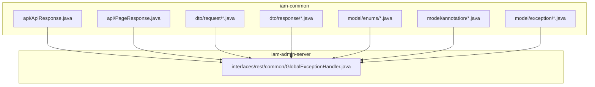
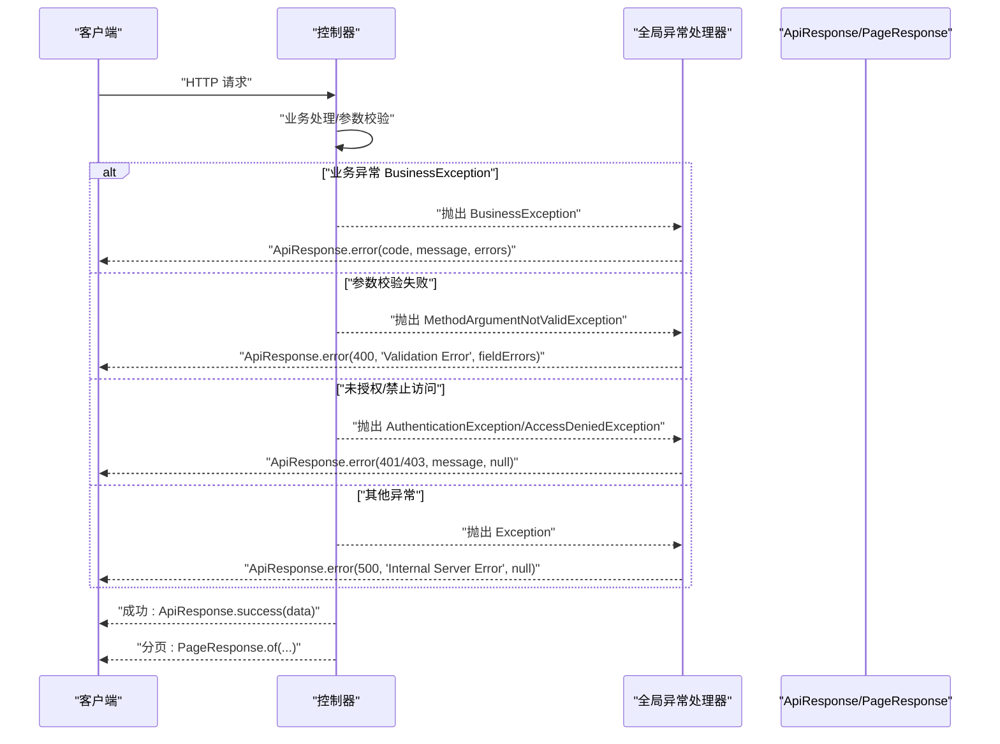
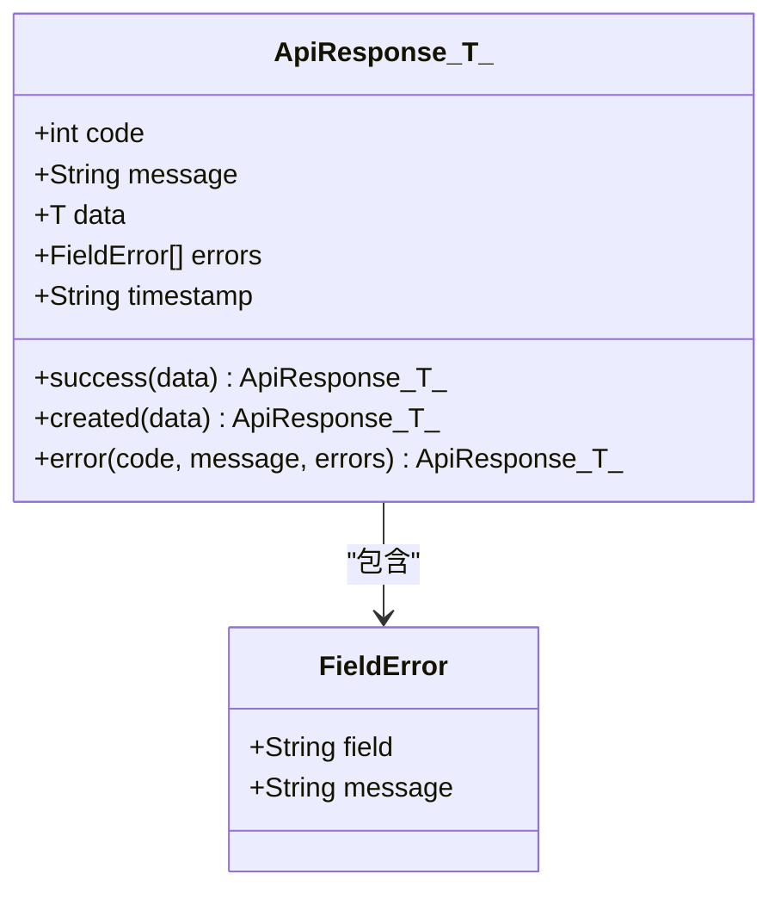
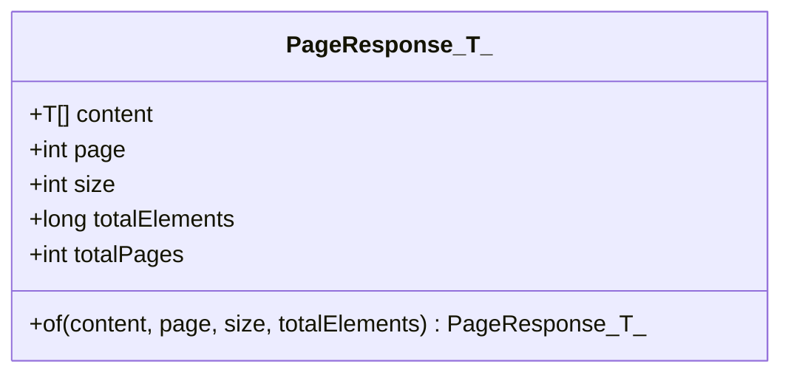
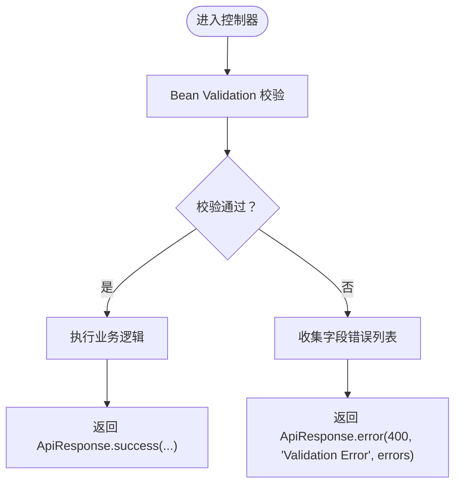
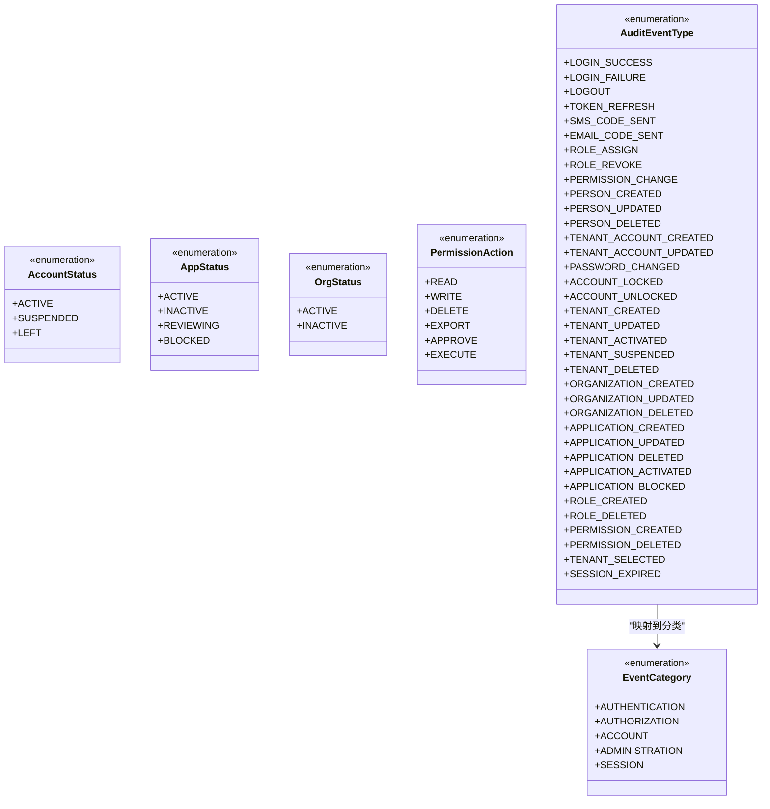
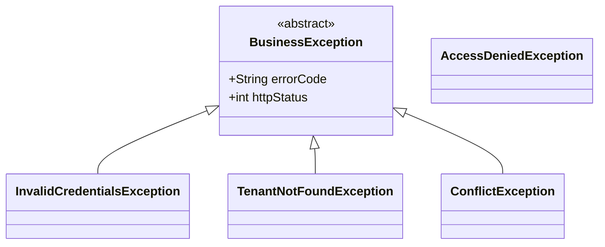
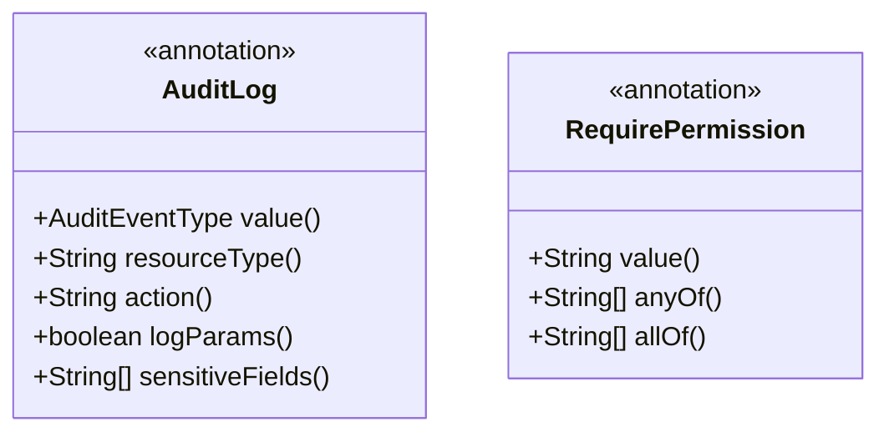
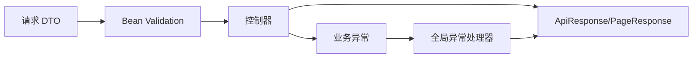

# 通用API

<cite>
**本文引用的文件**
- [ApiResponse.java](file://iam-common/src/main/java/iam/platform/common/api/ApiResponse.java)
- [PageResponse.java](file://iam-common/src/main/java/iam/platform/common/api/PageResponse.java)
- [CreatePersonRequest.java](file://iam-common/src/main/java/iam/platform/common/dto/request/CreatePersonRequest.java)
- [PersonResponse.java](file://iam-common/src/main/java/iam/platform/common/dto/response/PersonResponse.java)
- [CreateTenantRequest.java](file://iam-common/src/main/java/iam/platform/common/dto/request//CreateTenantRequest.java)
- [TenantResponse.java](file://iam-common/src/main/java/iam/platform/common/dto/response/TenantResponse.java)
- [AccountStatus.java](file://iam-common/src/main/java/iam/platform/common/model/enums/AccountStatus.java)
- [AppStatus.java](file://iam-common/src/main/java/iam/platform/common/model/enums/AppStatus.java)
- [OrgStatus.java](file://iam-common/src/main/java/iam/platform/common/model/enums/OrgStatus.java)
- [PermissionAction.java](file://iam-common/src/main/java/iam/platform/common/model/enums/PermissionAction.java)
- [AuditEventType.java](file://iam-common/src/main/java/iam/platform/common/model/enums/AuditEventType.java)
- [EventCategory.java](file://iam-common/src/main/java/iam/platform/common/model/enums/EventCategory.java)
- [AuditLog.java](file://iam-common/src/main/java/iam/platform/common/model/annotation/AuditLog.java)
- [RequirePermission.java](file://iam-common/src/main/java/iam/platform/common/model/annotation/RequirePermission.java)
- [BusinessException.java](file://iam-common/src/main/java/iam/platform/common/model/exception/BusinessException.java)
- [AccessDeniedException.java](file://iam-common/src/main/java/iam/platform/common/model/exception/AccessDeniedException.java)
- [InvalidCredentialsException.java](file://iam-common/src/main/java/iam/platform/common/model/exception/InvalidCredentialsException.java)
- [TenantNotFoundException.java](file://iam-common/src/main/java/iam/platform/common/model/exception/TenantNotFoundException.java)
- [ConflictException.java](file://iam-common/src/main/java/iam/platform/common/model/exception/ConflictException.java)
- [GlobalExceptionHandler.java](file://iam-admin-server/src/main/java/iam/platform/admin/interfaces/rest/common/GlobalExceptionHandler.java)
</cite>

## 目录
1. [简介](#简介)
2. [项目结构](#项目结构)
3. [核心组件](#核心组件)
4. [架构总览](#架构总览)
5. [详细组件分析](#详细组件分析)
6. [依赖分析](#依赖分析)
7. [性能考虑](#性能考虑)
8. [故障排查指南](#故障排查指南)
9. [结论](#结论)
10. [附录](#附录)

## 简介
本文件为 IAM 平台的通用 API 数据模型文档，聚焦于共享的数据传输对象（DTO）、统一的响应格式、分页模型、枚举类型、异常体系、数据校验规则、以及认证与授权相关注解的使用方法。文档旨在帮助开发者在各子系统中保持一致的 API 行为与契约，提升可维护性与一致性。

## 项目结构
通用 API 模型主要位于 iam-common 模块，包含：
- 统一响应模型：ApiResponse、PageResponse
- 请求 DTO：如 CreatePersonRequest、CreateTenantRequest
- 响应 DTO：如 PersonResponse、TenantResponse
- 枚举类型：账户状态、应用状态、组织状态、权限动作、审计事件类型与分类等
- 注解：审计日志标记、权限校验注解
- 异常体系：业务异常基类及具体异常类型
- 全局异常处理器：统一捕获并返回标准响应

**图表来源**
- [ApiResponse.java:1-61](file://iam-common/src/main/java/iam/platform/common/api/ApiResponse.java#L1-L61)
- [PageResponse.java:1-32](file://iam-common/src/main/java/iam/platform/common/api/PageResponse.java#L1-L32)
- [CreatePersonRequest.java:1-37](file://iam-common/src/main/java/iam/platform/common/dto/request/CreatePersonRequest.java#L1-L37)
- [PersonResponse.java:1-30](file://iam-common/src/main/java/iam/platform/common/dto/response/PersonResponse.java#L1-L30)
- [CreateTenantRequest.java:1-43](file://iam-common/src/main/java/iam/platform/common/dto/request/CreateTenantRequest.java#L1-L43)
- [TenantResponse.java:1-27](file://iam-common/src/main/java/iam/platform/common/dto/response/TenantResponse.java#L1-L27)
- [AccountStatus.java:1-6](file://iam-common/src/main/java/iam/platform/common/model/enums/AccountStatus.java#L1-L6)
- [AppStatus.java:1-6](file://iam-common/src/main/java/iam/platform/common/model/enums/AppStatus.java#L1-L6)
- [OrgStatus.java:1-6](file://iam-common/src/main/java/iam/platform/common/model/enums/OrgStatus.java#L1-L6)
- [PermissionAction.java:1-6](file://iam-common/src/main/java/iam/platform/common/model/enums/PermissionAction.java#L1-L6)
- [AuditEventType.java:1-59](file://iam-common/src/main/java/iam/platform/common/model/enums/AuditEventType.java#L1-L59)
- [EventCategory.java:1-13](file://iam-common/src/main/java/iam/platform/common/model/enums/EventCategory.java#L1-L13)
- [AuditLog.java:1-46](file://iam-common/src/main/java/iam/platform/common/model/annotation/AuditLog.java#L1-L46)
- [RequirePermission.java:1-35](file://iam-common/src/main/java/iam/platform/common/model/annotation/RequirePermission.java#L1-L35)
- [BusinessException.java:1-17](file://iam-common/src/main/java/iam/platform/common/model/exception/BusinessException.java#L1-L17)
- [GlobalExceptionHandler.java:1-101](file://iam-admin-server/src/main/java/iam/platform/admin/interfaces/rest/common/GlobalExceptionHandler.java#L1-L101)

**章节来源**
- [ApiResponse.java:1-61](file://iam-common/src/main/java/iam/platform/common/api/ApiResponse.java#L1-L61)
- [PageResponse.java:1-32](file://iam-common/src/main/java/iam/platform/common/api/PageResponse.java#L1-L32)
- [GlobalExceptionHandler.java:1-101](file://iam-admin-server/src/main/java/iam/platform/admin/interfaces/rest/common/GlobalExceptionHandler.java#L1-L101)

## 核心组件
- 统一响应模型 ApiResponse：封装 code、message、data、errors、timestamp 字段，并提供 success、created、error 静态工厂方法；支持字段级错误列表 FieldError。
- 分页响应模型 PageResponse：封装 content、page、size、totalElements、totalPages，并提供 of 工厂方法计算总页数。
- 请求 DTO：如 CreatePersonRequest、CreateTenantRequest，内置 Jakarta Bean Validation 注解，覆盖必填、长度、格式、数值范围等约束。
- 响应 DTO：如 PersonResponse、TenantResponse，标准化输出字段，便于前端统一消费。
- 枚举类型：AccountStatus、AppStatus、OrgStatus、PermissionAction、AuditEventType、EventCategory，统一语义与取值范围。
- 注解：AuditLog、RequirePermission，用于自动审计与权限拦截。
- 异常体系：BusinessException 抽象基类与具体异常（如 InvalidCredentialsException、TenantNotFoundException、ConflictException），配合全局异常处理器统一返回标准响应。

**章节来源**
- [ApiResponse.java:13-60](file://iam-common/src/main/java/iam/platform/common/api/ApiResponse.java#L13-L60)
- [PageResponse.java:10-31](file://iam-common/src/main/java/iam/platform/common/api/PageResponse.java#L10-L31)
- [CreatePersonRequest.java:11-36](file://iam-common/src/main/java/iam/platform/common/dto/request/CreatePersonRequest.java#L11-L36)
- [CreateTenantRequest.java:16-42](file://iam-common/src/main/java/iam/platform/common/dto/request/CreateTenantRequest.java#L16-L42)
- [PersonResponse.java:10-29](file://iam-common/src/main/java/iam/platform/common/dto/response/PersonResponse.java#L10-L29)
- [TenantResponse.java:10-26](file://iam-common/src/main/java/iam/platform/common/dto/response/TenantResponse.java#L10-L26)
- [AccountStatus.java:3-5](file://iam-common/src/main/java/iam/platform/common/model/enums/AccountStatus.java#L3-L5)
- [AppStatus.java:3-5](file://iam-common/src/main/java/iam/platform/common/model/enums/AppStatus.java#L3-L5)
- [OrgStatus.java:3-5](file://iam-common/src/main/java/iam/platform/common/model/enums/OrgStatus.java#L3-L5)
- [PermissionAction.java:3-5](file://iam-common/src/main/java/iam/platform/common/model/enums/PermissionAction.java#L3-L5)
- [AuditEventType.java:6-58](file://iam-common/src/main/java/iam/platform/common/model/enums/AuditEventType.java#L6-L58)
- [EventCategory.java:6-12](file://iam-common/src/main/java/iam/platform/common/model/enums/EventCategory.java#L6-L12)
- [AuditLog.java:15-45](file://iam-common/src/main/java/iam/platform/common/model/annotation/AuditLog.java#L15-L45)
- [RequirePermission.java:14-34](file://iam-common/src/main/java/iam/platform/common/model/annotation/RequirePermission.java#L14-L34)
- [BusinessException.java:5-16](file://iam-common/src/main/java/iam/platform/common/model/exception/BusinessException.java#L5-L16)
- [InvalidCredentialsException.java:3-9](file://iam-common/src/main/java/iam/platform/common/model/exception/InvalidCredentialsException.java#L3-L9)
- [TenantNotFoundException.java:3-9](file://iam-common/src/main/java/iam/platform/common/model/exception/TenantNotFoundException.java#L3-L9)
- [ConflictException.java:3-9](file://iam-common/src/main/java/iam/platform/common/model/exception/ConflictException.java#L3-L9)

## 架构总览
统一响应与异常处理贯穿各服务层，控制器返回 ApiResponse 或 PageResponse，全局异常处理器将各类异常转换为标准响应体。

**图表来源**
- [GlobalExceptionHandler.java:22-99](file://iam-admin-server/src/main/java/iam/platform/admin/interfaces/rest/common/GlobalExceptionHandler.java#L22-L99)
- [ApiResponse.java:25-50](file://iam-common/src/main/java/iam/platform/common/api/ApiResponse.java#L25-L50)
- [PageResponse.java:21-30](file://iam-common/src/main/java/iam/platform/common/api/PageResponse.java#L21-L30)

## 详细组件分析

### 统一响应模型 ApiResponse
- 结构字段
  - code：HTTP 状态码或业务码
  - message：消息文本
  - data：泛型业务数据
  - errors：字段级错误列表（FieldError）
  - timestamp：响应时间
- 工厂方法
  - success(data)：code=200，message="Success"
  - created(data)：code=201，message="Created"
  - error(code, message, errors)：自定义 code 与错误信息
- FieldError 内嵌结构：field、message

**图表来源**
- [ApiResponse.java:13-60](file://iam-common/src/main/java/iam/platform/common/api/ApiResponse.java#L13-L60)

**章节来源**
- [ApiResponse.java:13-60](file://iam-common/src/main/java/iam/platform/common/api/ApiResponse.java#L13-L60)

### 分页响应模型 PageResponse
- 结构字段
  - content：当前页数据列表
  - page：页码（从 0 开始）
  - size：每页大小
  - totalElements：总记录数
  - totalPages：总页数（由工具方法计算）
- 工厂方法 of(content, page, size, totalElements)：自动计算 totalPages

**图表来源**
- [PageResponse.java:10-31](file://iam-common/src/main/java/iam/platform/common/api/PageResponse.java#L10-L31)

**章节来源**
- [PageResponse.java:10-31](file://iam-common/src/main/java/iam/platform/common/api/PageResponse.java#L10-L31)

### 请求 DTO 与数据校验规则
- CreatePersonRequest
  - username：非空，3-100 字符
  - email：非空，邮箱格式
  - phone：最多 20 字符
  - password：非空，8-100 字符
  - nickname：最多 100 字符
  - avatarUrl：最多 500 字符
- CreateTenantRequest
  - tenantCode：非空，小写字母/数字/连字符，3-50 字符
  - tenantName：非空，2-200 字符
  - maxUsers：最小 10
  - contactEmail：邮箱格式
  - contactPhone：最多 20 字符
  - expiresAt：必须在未来

**图表来源**
- [CreatePersonRequest.java:11-36](file://iam-common/src/main/java/iam/platform/common/dto/request/CreatePersonRequest.java#L11-L36)
- [CreateTenantRequest.java:16-42](file://iam-common/src/main/java/iam/platform/common/dto/request/CreateTenantRequest.java#L16-L42)
- [GlobalExceptionHandler.java:31-42](file://iam-admin-server/src/main/java/iam/platform/admin/interfaces/rest/common/GlobalExceptionHandler.java#L31-L42)

**章节来源**
- [CreatePersonRequest.java:11-36](file://iam-common/src/main/java/iam/platform/common/dto/request/CreatePersonRequest.java#L11-L36)
- [CreateTenantRequest.java:16-42](file://iam-common/src/main/java/iam/platform/common/dto/request/CreateTenantRequest.java#L16-L42)
- [GlobalExceptionHandler.java:31-42](file://iam-admin-server/src/main/java/iam/platform/admin/interfaces/rest/common/GlobalExceptionHandler.java#L31-L42)

### 响应 DTO
- PersonResponse：标准化人员信息输出，包含基础字段、状态位与时间戳
- TenantResponse：标准化租户信息输出，包含状态、计数与到期时间

**章节来源**
- [PersonResponse.java:10-29](file://iam-common/src/main/java/iam/platform/common/dto/response/PersonResponse.java#L10-L29)
- [TenantResponse.java:10-26](file://iam-common/src/main/java/iam/platform/common/dto/response/TenantResponse.java#L10-L26)

### 枚举类型与取值范围
- 账户状态：ACTIVE、SUSPENDED、LEFT
- 应用状态：ACTIVE、INACTIVE、REVIEWING、BLOCKED
- 组织状态：ACTIVE、INACTIVE
- 权限动作：READ、WRITE、DELETE、EXPORT、APPROVE、EXECUTE
- 审计事件类型：涵盖 AUTHENTICATION、AUTHORIZATION、ACCOUNT、ADMINISTRATION、SESSION 等类别
- 事件分类：AUTHENTICATION、AUTHORIZATION、ACCOUNT、ADMINISTRATION、SESSION

**图表来源**
- [AccountStatus.java:3-5](file://iam-common/src/main/java/iam/platform/common/model/enums/AccountStatus.java#L3-L5)
- [AppStatus.java:3-5](file://iam-common/src/main/java/iam/platform/common/model/enums/AppStatus.java#L3-L5)
- [OrgStatus.java:3-5](file://iam-common/src/main/java/iam/platform/common/model/enums/OrgStatus.java#L3-L5)
- [PermissionAction.java:3-5](file://iam-common/src/main/java/iam/platform/common/model/enums/PermissionAction.java#L3-L5)
- [EventCategory.java:6-12](file://iam-common/src/main/java/iam/platform/common/model/enums/EventCategory.java#L6-L12)
- [AuditEventType.java:6-58](file://iam-common/src/main/java/iam/platform/common/model/enums/AuditEventType.java#L6-L58)

**章节来源**
- [AccountStatus.java:3-5](file://iam-common/src/main/java/iam/platform/common/model/enums/AccountStatus.java#L3-L5)
- [AppStatus.java:3-5](file://iam-common/src/main/java/iam/platform/common/model/enums/AppStatus.java#L3-L5)
- [OrgStatus.java:3-5](file://iam-common/src/main/java/iam/platform/common/model/enums/OrgStatus.java#L3-L5)
- [PermissionAction.java:3-5](file://iam-common/src/main/java/iam/platform/common/model/enums/PermissionAction.java#L3-L5)
- [AuditEventType.java:6-58](file://iam-common/src/main/java/iam/platform/common/model/enums/AuditEventType.java#L6-L58)
- [EventCategory.java:6-12](file://iam-common/src/main/java/iam/platform/common/model/enums/EventCategory.java#L6-L12)

### 通用异常类型与错误码
- BusinessException 抽象基类：统一携带 errorCode、httpStatus
- 具体异常
  - InvalidCredentialsException：errorCode="INVALID_CREDENTIALS"，HTTP 401
  - TenantNotFoundException：errorCode="TENANT_NOT_FOUND"，HTTP 404
  - ConflictException：errorCode="CONFLICT"，HTTP 409
  - AccessDeniedException：运行时异常，用于权限不足场景
- 全局异常处理器
  - BusinessException：按其 httpStatus 返回 ApiResponse.error
  - MethodArgumentNotValidException：400 + 字段级错误列表
  - AccessDeniedException：403
  - AuthenticationException：401
  - UsernameNotFoundException：404
  - IllegalArgumentException：400
  - DataIntegrityViolationException：409
  - NoResourceFoundException：404
  - Exception：500

**图表来源**
- [BusinessException.java:5-16](file://iam-common/src/main/java/iam/platform/common/model/exception/BusinessException.java#L5-L16)
- [InvalidCredentialsException.java:3-9](file://iam-common/src/main/java/iam/platform/common/model/exception/InvalidCredentialsException.java#L3-L9)
- [TenantNotFoundException.java:3-9](file://iam-common/src/main/java/iam/platform/common/model/exception/TenantNotFoundException.java#L3-L9)
- [ConflictException.java:3-9](file://iam-common/src/main/java/iam/platform/common/model/exception/ConflictException.java#L3-L9)
- [AccessDeniedException.java:6-24](file://iam-common/src/main/java/iam/platform/common/model/exception/AccessDeniedException.java#L6-L24)

**章节来源**
- [BusinessException.java:5-16](file://iam-common/src/main/java/iam/platform/common/model/exception/BusinessException.java#L5-L16)
- [InvalidCredentialsException.java:3-9](file://iam-common/src/main/java/iam/platform/common/model/exception/InvalidCredentialsException.java#L3-L9)
- [TenantNotFoundException.java:3-9](file://iam-common/src/main/java/iam/platform/common/model/exception/TenantNotFoundException.java#L3-L9)
- [ConflictException.java:3-9](file://iam-common/src/main/java/iam/platform/common/model/exception/ConflictException.java#L3-L9)
- [AccessDeniedException.java:6-24](file://iam-common/src/main/java/iam/platform/common/model/exception/AccessDeniedException.java#L6-L24)
- [GlobalExceptionHandler.java:24-99](file://iam-admin-server/src/main/java/iam/platform/admin/interfaces/rest/common/GlobalExceptionHandler.java#L24-L99)

### 认证与授权注解
- AuditLog
  - 作用：对方法进行审计日志标记，自动记录审计事件
  - 属性：value（事件类型）、resourceType（资源类型）、action（动作描述模板，支持 SpEL）、logParams（是否记录参数）、sensitiveFields（敏感字段掩码，默认包含 password、secret、token）
- RequirePermission
  - 作用：对方法进行权限拦截校验
  - 属性：value（单一权限）、anyOf（任一满足 OR 逻辑）、allOf（全部满足 AND 逻辑）

**图表来源**
- [AuditLog.java:15-45](file://iam-common/src/main/java/iam/platform/common/model/annotation/AuditLog.java#L15-L45)
- [RequirePermission.java:14-34](file://iam-common/src/main/java/iam/platform/common/model/annotation/RequirePermission.java#L14-L34)

**章节来源**
- [AuditLog.java:15-45](file://iam-common/src/main/java/iam/platform/common/model/annotation/AuditLog.java#L15-L45)
- [RequirePermission.java:14-34](file://iam-common/src/main/java/iam/platform/common/model/annotation/RequirePermission.java#L14-L34)

### API 版本控制与向后兼容性
- 本仓库未发现显式的 API 版本控制实现（如路径前缀 /v1、媒体类型参数或 Accept 头约定）。建议在网关或控制器层引入版本策略以保障向后兼容。
- 向后兼容建议
  - 保留旧字段并在新模型中标记为废弃
  - 新增字段默认可选
  - 使用统一响应结构，避免破坏性变更
  - 通过注释与文档明确弃用计划

[本节为通用指导，不直接分析具体文件]

## 依赖分析
- ApiResponse 与 PageResponse 作为通用契约被各服务共享
- 全局异常处理器依赖 ApiResponse 与各异常类型，统一输出
- DTO 依赖 Bean Validation 注解进行参数校验
- 注解依赖枚举类型进行语义表达

**图表来源**
- [CreatePersonRequest.java:11-36](file://iam-common/src/main/java/iam/platform/common/dto/request/CreatePersonRequest.java#L11-L36)
- [CreateTenantRequest.java:16-42](file://iam-common/src/main/java/iam/platform/common/dto/request/CreateTenantRequest.java#L16-L42)
- [ApiResponse.java:25-50](file://iam-common/src/main/java/iam/platform/common/api/ApiResponse.java#L25-L50)
- [PageResponse.java:21-30](file://iam-common/src/main/java/iam/platform/common/api/PageResponse.java#L21-L30)
- [GlobalExceptionHandler.java:24-99](file://iam-admin-server/src/main/java/iam/platform/admin/interfaces/rest/common/GlobalExceptionHandler.java#L24-L99)

**章节来源**
- [GlobalExceptionHandler.java:22-99](file://iam-admin-server/src/main/java/iam/platform/admin/interfaces/rest/common/GlobalExceptionHandler.java#L22-L99)

## 性能考虑
- 响应序列化：ApiResponse 使用 JSON 序列化，建议避免在 data 中传递超大对象，优先采用分页或懒加载
- 分页策略：合理设置 page/size，避免过大的 size 导致内存压力
- 校验开销：在 DTO 上使用精确的校验注解，减少无效请求进入业务层
- 异常处理：业务异常应尽量携带明确的错误码与状态，便于快速定位问题

[本节提供通用建议，不直接分析具体文件]

## 故障排查指南
- 参数校验失败
  - 现象：返回 400，errors 包含字段级错误
  - 排查：检查 DTO 注解配置与前端传参
- 未授权/禁止访问
  - 现象：401/403
  - 排查：确认令牌有效性、权限范围与 RequirePermission 配置
- 数据冲突
  - 现象：409
  - 排查：检查唯一约束冲突与幂等性设计
- 业务异常
  - 现象：根据 BusinessException 的 httpStatus 返回
  - 排查：查看 errorCode 与日志定位业务分支
- 未知错误
  - 现象：500
  - 排查：查看服务器日志与堆栈信息

**章节来源**
- [GlobalExceptionHandler.java:24-99](file://iam-admin-server/src/main/java/iam/platform/admin/interfaces/rest/common/GlobalExceptionHandler.java#L24-L99)

## 结论
通过统一的响应模型、严格的 DTO 校验、清晰的枚举与注解体系，以及完善的异常处理机制，本项目实现了跨服务一致的 API 行为。建议在后续迭代中补充 API 版本控制策略，以进一步增强向后兼容能力。

## 附录

### 使用示例与最佳实践
- 成功响应
  - 使用 ApiResponse.success(data) 返回标准成功响应
- 创建资源
  - 使用 ApiResponse.created(data) 返回 201
- 错误响应
  - 使用 ApiResponse.error(code, message, errors) 返回错误
  - errors 为空时仅返回 code/message/timestamp
- 分页查询
  - 使用 PageResponse.of(content, page, size, totalElements) 生成分页响应
- 参数校验
  - 在请求 DTO 上使用 @NotBlank、@Size、@Email、@Pattern、@Min、@Future 等注解
  - 全局异常处理器会自动将校验错误映射为字段级错误列表
- 权限控制
  - 在方法上使用 @RequirePermission(value 或 anyOf/allOf) 进行权限拦截
- 审计日志
  - 在方法上使用 @AuditLog(value=AuditEventType.XXX, ...) 自动记录审计事件
- 异常处理
  - 业务异常统一继承 BusinessException 并指定 errorCode 与 httpStatus
  - 避免抛出原始异常给客户端，确保统一响应格式

**章节来源**
- [ApiResponse.java:25-50](file://iam-common/src/main/java/iam/platform/common/api/ApiResponse.java#L25-L50)
- [PageResponse.java:21-30](file://iam-common/src/main/java/iam/platform/common/api/PageResponse.java#L21-L30)
- [CreatePersonRequest.java:11-36](file://iam-common/src/main/java/iam/platform/common/dto/request/CreatePersonRequest.java#L11-L36)
- [CreateTenantRequest.java:16-42](file://iam-common/src/main/java/iam/platform/common/dto/request/CreateTenantRequest.java#L16-L42)
- [AuditLog.java:15-45](file://iam-common/src/main/java/iam/platform/common/model/annotation/AuditLog.java#L15-L45)
- [RequirePermission.java:14-34](file://iam-common/src/main/java/iam/platform/common/model/annotation/RequirePermission.java#L14-L34)
- [BusinessException.java:5-16](file://iam-common/src/main/java/iam/platform/common/model/exception/BusinessException.java#L5-L16)
- [GlobalExceptionHandler.java:24-99](file://iam-admin-server/src/main/java/iam/platform/admin/interfaces/rest/common/GlobalExceptionHandler.java#L24-L99)