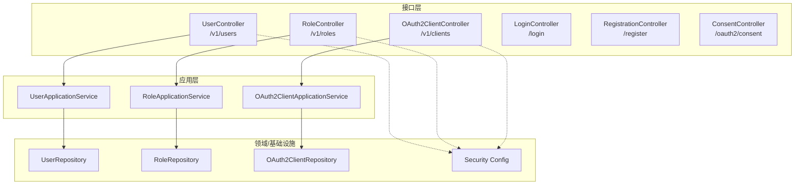
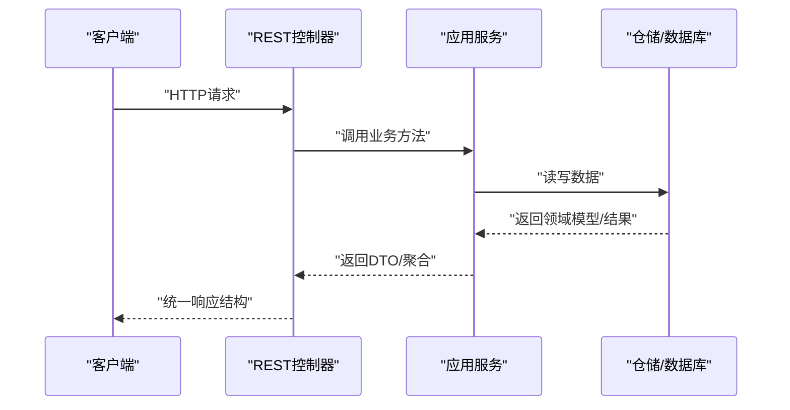
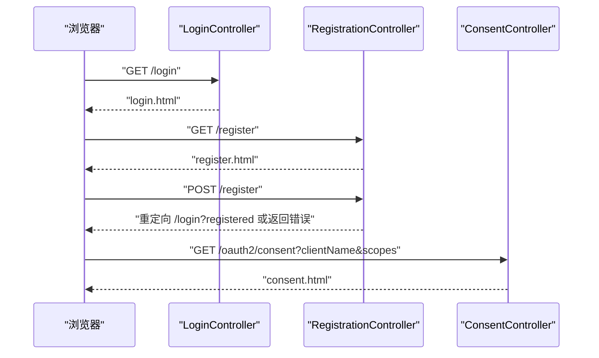
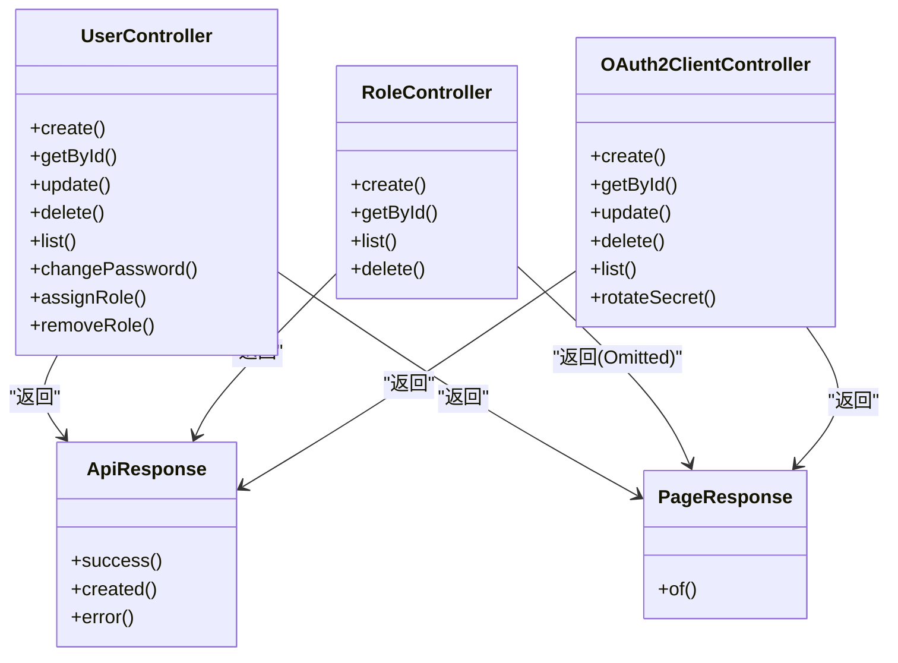

# API接口文档

<cite>
**本文引用的文件**
- [UserController.java](file://src/main/java/sso/oidc/interfaces/rest/UserController.java)
- [RoleController.java](file://src/main/java/sso/oidc/interfaces/rest/RoleController.java)
- [OAuth2ClientController.java](file://src/main/java/sso/oidc/interfaces/rest/OAuth2ClientController.java)
- [LoginController.java](file://src/main/java/sso/oidc/interfaces/web/LoginController.java)
- [RegistrationController.java](file://src/main/java/sso/oidc/interfaces/web/RegistrationController.java)
- [ConsentController.java](file://src/main/java/sso/oidc/interfaces/web/ConsentController.java)
- [CreateUserRequest.java](file://src/main/java/sso/oidc/application/dto/request/CreateUserRequest.java)
- [UpdateUserRequest.java](file://src/main/java/sso/oidc/application/dto/request/UpdateUserRequest.java)
- [AssignRoleRequest.java](file://src/main/java/sso/oidc/application/dto/request/AssignRoleRequest.java)
- [ChangePasswordRequest.java](file://src/main/java/sso/oidc/application/dto/request/ChangePasswordRequest.java)
- [CreateOAuth2ClientRequest.java](file://src/main/java/sso/oidc/application/dto/request/CreateOAuth2ClientRequest.java)
- [UpdateOAuth2ClientRequest.java](file://src/main/java/sso/oidc/application/dto/request/UpdateOAuth2ClientRequest.java)
- [UserResponse.java](file://src/main/java/sso/oidc/application/dto/response/UserResponse.java)
- [RoleResponse.java](file://src/main/java/sso/oidc/application/dto/response/RoleResponse.java)
- [OAuth2ClientResponse.java](file://src/main/java/sso/oidc/application/dto/response/OAuth2ClientResponse.java)
- [ClientCreatedResponse.java](file://src/main/java/sso/oidc/application/dto/response/ClientCreatedResponse.java)
- [ApiResponse.java](file://src/main/java/sso/oidc/interfaces/rest/common/ApiResponse.java)
- [PageResponse.java](file://src/main/java/sso/oidc/interfaces/rest/common/PageResponse.java)
</cite>

## 目录
1. [简介](#简介)
2. [项目结构](#项目结构)
3. [核心组件](#核心组件)
4. [架构总览](#架构总览)
5. [详细组件分析](#详细组件分析)
6. [依赖分析](#依赖分析)
7. [性能与安全考虑](#性能与安全考虑)
8. [故障排查指南](#故障排查指南)
9. [结论](#结论)
10. [附录](#附录)

## 简介
本文件为IAM Platform认证服务的完整API接口文档，覆盖REST API与Web页面接口，包括：
- 用户管理API：创建用户、按ID查询、分页列表、更新、删除、修改密码、角色分配与移除
- 角色管理API：创建角色、按ID查询、查询列表、删除
- OAuth2客户端管理API：注册客户端、按ID查询、更新、删除、分页列表、轮换密钥
- Web页面接口：登录、注册、授权同意页

文档同时说明统一响应结构、请求参数校验规则、典型成功/错误响应示例、版本控制策略、速率限制与安全注意事项。

## 项目结构
后端采用分层架构：
- 接口层（REST/Web Controllers）：暴露HTTP端点
- 应用层（Application Services）：编排业务逻辑
- 领域层（Domain Models/Repositories/Services）：封装业务规则与数据访问
- 基础设施层（Security/Config/Persistence）：安全配置、持久化实现、JWK等

**图表来源**
- [UserController.java:27-89](file://src/main/java/sso/oidc/interfaces/rest/UserController.java#L27-L89)
- [RoleController.java:22-58](file://src/main/java/sso/oidc/interfaces/rest/RoleController.java#L22-L58)
- [OAuth2ClientController.java:26-74](file://src/main/java/sso/oidc/interfaces/rest/OAuth2ClientController.java#L26-L74)
- [LoginController.java:6-13](file://src/main/java/sso/oidc/interfaces/web/LoginController.java#L6-L13)
- [RegistrationController.java:15-42](file://src/main/java/sso/oidc/interfaces/web/RegistrationController.java#L15-L42)
- [ConsentController.java:7-18](file://src/main/java/sso/oidc/interfaces/web/ConsentController.java#L7-L18)

**章节来源**
- [UserController.java:27-89](file://src/main/java/sso/oidc/interfaces/rest/UserController.java#L27-L89)
- [RoleController.java:22-58](file://src/main/java/sso/oidc/interfaces/rest/RoleController.java#L22-L58)
- [OAuth2ClientController.java:26-74](file://src/main/java/sso/oidc/interfaces/rest/OAuth2ClientController.java#L26-L74)
- [LoginController.java:6-13](file://src/main/java/sso/oidc/interfaces/web/LoginController.java#L6-L13)
- [RegistrationController.java:15-42](file://src/main/java/sso/oidc/interfaces/web/RegistrationController.java#L15-L42)
- [ConsentController.java:7-18](file://src/main/java/sso/oidc/interfaces/web/ConsentController.java#L7-L18)

## 核心组件
- 统一响应结构：所有REST响应遵循统一结构，包含状态码、消息、数据体、错误字段集合与时间戳
- 分页响应结构：列表接口返回分页对象，包含内容、页码、大小、总数与总页数
- 请求参数校验：通过Jakarta Validation在接口层进行参数校验，失败时返回结构化错误
- 版本控制：所有REST路径以/v1前缀标识版本

**章节来源**
- [ApiResponse.java:13-60](file://src/main/java/sso/oidc/interfaces/rest/common/ApiResponse.java#L13-L60)
- [PageResponse.java:10-31](file://src/main/java/sso/oidc/interfaces/rest/common/PageResponse.java#L10-L31)

## 架构总览
下图展示从客户端到控制器、应用服务与仓储的调用链路，以及Web页面的交互流程。

**图表来源**
- [UserController.java:35-88](file://src/main/java/sso/oidc/interfaces/rest/UserController.java#L35-L88)
- [RoleController.java:30-57](file://src/main/java/sso/oidc/interfaces/rest/RoleController.java#L30-L57)
- [OAuth2ClientController.java:34-73](file://src/main/java/sso/oidc/interfaces/rest/OAuth2ClientController.java#L34-L73)

## 详细组件分析

### 用户管理API
- 路径：/v1/users
- 版本：v1
- 认证与授权：需具备相应管理权限（由安全配置决定）
- 统一响应：成功返回200或201；错误返回4xx并携带错误字段

端点一览
- POST /v1/users
  - 功能：创建用户
  - 请求体：CreateUserRequest
  - 成功响应：201 Created，返回UserResponse
  - 失败示例：用户名/邮箱/密码格式不合法、重复注册等
  - 参考
    - [UserController.java:35-40](file://src/main/java/sso/oidc/interfaces/rest/UserController.java#L35-L40)
    - [CreateUserRequest.java:15-30](file://src/main/java/sso/oidc/application/dto/request/CreateUserRequest.java#L15-L30)
    - [UserResponse.java:15-25](file://src/main/java/sso/oidc/application/dto/response/UserResponse.java#L15-L25)

- GET /v1/users/{id}
  - 功能：按ID获取用户
  - 成功响应：200 OK，返回UserResponse
  - 失败示例：用户不存在
  - 参考
    - [UserController.java:42-46](file://src/main/java/sso/oidc/interfaces/rest/UserController.java#L42-L46)

- PUT /v1/users/{id}
  - 功能：更新用户
  - 请求体：UpdateUserRequest
  - 成功响应：200 OK，返回UserResponse
  - 失败示例：邮箱格式不合法、昵称过长等
  - 参考
    - [UserController.java:48-52](file://src/main/java/sso/oidc/interfaces/rest/UserController.java#L48-L52)
    - [UpdateUserRequest.java:13-21](file://src/main/java/sso/oidc/application/dto/request/UpdateUserRequest.java#L13-L21)

- DELETE /v1/users/{id}
  - 功能：删除用户
  - 成功响应：204 No Content
  - 失败示例：用户不存在
  - 参考
    - [UserController.java:54-59](file://src/main/java/sso/oidc/interfaces/rest/UserController.java#L54-L59)

- GET /v1/users
  - 功能：分页获取用户列表
  - 查询参数：page（默认0），size（默认20）
  - 成功响应：200 OK，返回PageResponse<UserResponse>
  - 参考
    - [UserController.java:61-67](file://src/main/java/sso/oidc/interfaces/rest/UserController.java#L61-L67)
    - [PageResponse.java:14-31](file://src/main/java/sso/oidc/interfaces/rest/common/PageResponse.java#L14-L31)

- PUT /v1/users/{id}/password
  - 功能：修改密码
  - 请求体：ChangePasswordRequest
  - 成功响应：200 OK，无数据体
  - 失败示例：旧密码不正确、新密码长度不合法等
  - 参考
    - [UserController.java:69-74](file://src/main/java/sso/oidc/interfaces/rest/UserController.java#L69-L74)
    - [ChangePasswordRequest.java:14-21](file://src/main/java/sso/oidc/application/dto/request/ChangePasswordRequest.java#L14-L21)

- POST /v1/users/{id}/roles
  - 功能：分配角色
  - 请求体：AssignRoleRequest（roleCode）
  - 成功响应：200 OK，无数据体
  - 失败示例：角色不存在、用户不存在等
  - 参考
    - [UserController.java:76-81](file://src/main/java/sso/oidc/interfaces/rest/UserController.java#L76-L81)
    - [AssignRoleRequest.java:13-16](file://src/main/java/sso/oidc/application/dto/request/AssignRoleRequest.java#L13-L16)

- DELETE /v1/users/{id}/roles/{roleCode}
  - 功能：移除角色
  - 成功响应：200 OK，无数据体
  - 失败示例：角色不存在或未分配
  - 参考
    - [UserController.java:83-88](file://src/main/java/sso/oidc/interfaces/rest/UserController.java#L83-L88)

请求/响应示例（路径参考）
- 创建用户成功
  - 请求：POST /v1/users
  - 响应：201 Created，data为UserResponse
  - 参考
    - [ApiResponse.java:34-41](file://src/main/java/sso/oidc/interfaces/rest/common/ApiResponse.java#L34-L41)
    - [UserResponse.java:15-25](file://src/main/java/sso/oidc/application/dto/response/UserResponse.java#L15-L25)

- 修改密码失败（字段校验错误）
  - 请求：PUT /v1/users/{id}/password
  - 响应：400 Bad Request，包含FieldError数组
  - 参考
    - [ApiResponse.java:43-50](file://src/main/java/sso/oidc/interfaces/rest/common/ApiResponse.java#L43-L50)

**章节来源**
- [UserController.java:27-89](file://src/main/java/sso/oidc/interfaces/rest/UserController.java#L27-L89)
- [CreateUserRequest.java:15-30](file://src/main/java/sso/oidc/application/dto/request/CreateUserRequest.java#L15-L30)
- [UpdateUserRequest.java:13-21](file://src/main/java/sso/oidc/application/dto/request/UpdateUserRequest.java#L13-L21)
- [AssignRoleRequest.java:13-16](file://src/main/java/sso/oidc/application/dto/request/AssignRoleRequest.java#L13-L16)
- [ChangePasswordRequest.java:14-21](file://src/main/java/sso/oidc/application/dto/request/ChangePasswordRequest.java#L14-L21)
- [UserResponse.java:15-25](file://src/main/java/sso/oidc/application/dto/response/UserResponse.java#L15-L25)
- [ApiResponse.java:13-60](file://src/main/java/sso/oidc/interfaces/rest/common/ApiResponse.java#L13-L60)
- [PageResponse.java:14-31](file://src/main/java/sso/oidc/interfaces/rest/common/PageResponse.java#L14-L31)

### 角色管理API
- 路径：/v1/roles
- 版本：v1

端点一览
- POST /v1/roles
  - 功能：创建角色
  - 查询参数：code（必填）、name（必填）、description（可选）
  - 成功响应：201 Created，返回RoleResponse
  - 失败示例：code/name为空、重复等
  - 参考
    - [RoleController.java:30-38](file://src/main/java/sso/oidc/interfaces/rest/RoleController.java#L30-L38)
    - [RoleResponse.java:14-21](file://src/main/java/sso/oidc/application/dto/response/RoleResponse.java#L14-L21)

- GET /v1/roles/{id}
  - 功能：按ID获取角色
  - 成功响应：200 OK，返回RoleResponse
  - 参考
    - [RoleController.java:40-44](file://src/main/java/sso/oidc/interfaces/rest/RoleController.java#L40-L44)

- GET /v1/roles
  - 功能：查询角色列表
  - 成功响应：200 OK，返回List<RoleResponse>
  - 参考
    - [RoleController.java:46-49](file://src/main/java/sso/oidc/interfaces/rest/RoleController.java#L46-L49)

- DELETE /v1/roles/{id}
  - 功能：删除角色
  - 成功响应：204 No Content
  - 失败示例：角色不存在
  - 参考
    - [RoleController.java:52-57](file://src/main/java/sso/oidc/interfaces/rest/RoleController.java#L52-L57)

请求/响应示例（路径参考）
- 创建角色成功
  - 请求：POST /v1/roles?code=...&name=...
  - 响应：201 Created，data为RoleResponse
  - 参考
    - [ApiResponse.java:34-41](file://src/main/java/sso/oidc/interfaces/rest/common/ApiResponse.java#L34-L41)
    - [RoleResponse.java:14-21](file://src/main/java/sso/oidc/application/dto/response/RoleResponse.java#L14-L21)

**章节来源**
- [RoleController.java:22-58](file://src/main/java/sso/oidc/interfaces/rest/RoleController.java#L22-L58)
- [RoleResponse.java:14-21](file://src/main/java/sso/oidc/application/dto/response/RoleResponse.java#L14-L21)
- [ApiResponse.java:13-60](file://src/main/java/sso/oidc/interfaces/rest/common/ApiResponse.java#L13-L60)

### OAuth2客户端管理API
- 路径：/v1/clients
- 版本：v1
- 安全提示：客户端密钥仅在创建时返回一次，请妥善保存

端点一览
- POST /v1/clients
  - 功能：注册OAuth2客户端
  - 请求体：CreateOAuth2ClientRequest
  - 成功响应：201 Created，返回ClientCreatedResponse（包含clientSecret）
  - 失败示例：重定向URI/授权类型/作用域为空、PKCE/同意页配置非法等
  - 参考
    - [OAuth2ClientController.java:34-39](file://src/main/java/sso/oidc/interfaces/rest/OAuth2ClientController.java#L34-L39)
    - [CreateOAuth2ClientRequest.java:16-33](file://src/main/java/sso/oidc/application/dto/request/CreateOAuth2ClientRequest.java#L16-L33)
    - [ClientCreatedResponse.java:10-12](file://src/main/java/sso/oidc/application/dto/response/ClientCreatedResponse.java#L10-L12)

- GET /v1/clients/{id}
  - 功能：按ID获取客户端
  - 成功响应：200 OK，返回OAuth2ClientResponse
  - 参考
    - [OAuth2ClientController.java:41-45](file://src/main/java/sso/oidc/interfaces/rest/OAuth2ClientController.java#L41-L45)
    - [OAuth2ClientResponse.java:15-26](file://src/main/java/sso/oidc/application/dto/response/OAuth2ClientResponse.java#L15-L26)

- PUT /v1/clients/{id}
  - 功能：更新客户端
  - 请求体：UpdateOAuth2ClientRequest
  - 成功响应：200 OK，返回OAuth2ClientResponse
  - 参考
    - [OAuth2ClientController.java:47-52](file://src/main/java/sso/oidc/interfaces/rest/OAuth2ClientController.java#L47-L52)
    - [UpdateOAuth2ClientRequest.java:15-25](file://src/main/java/sso/oidc/application/dto/request/UpdateOAuth2ClientRequest.java#L15-L25)

- DELETE /v1/clients/{id}
  - 功能：删除客户端
  - 成功响应：204 No Content
  - 参考
    - [OAuth2ClientController.java:54-59](file://src/main/java/sso/oidc/interfaces/rest/OAuth2ClientController.java#L54-L59)

- GET /v1/clients
  - 功能：分页获取客户端列表
  - 查询参数：page（默认0），size（默认20）
  - 成功响应：200 OK，返回PageResponse<OAuth2ClientResponse>
  - 参考
    - [OAuth2ClientController.java:61-67](file://src/main/java/sso/oidc/interfaces/rest/OAuth2ClientController.java#L61-L67)
    - [PageResponse.java:14-31](file://src/main/java/sso/oidc/interfaces/rest/common/PageResponse.java#L14-L31)

- POST /v1/clients/{id}/rotate-secret
  - 功能：轮换客户端密钥
  - 成功响应：200 OK，返回ClientCreatedResponse（新的clientSecret仅返回一次）
  - 参考
    - [OAuth2ClientController.java:69-73](file://src/main/java/sso/oidc/interfaces/rest/OAuth2ClientController.java#L69-L73)
    - [ClientCreatedResponse.java:10-12](file://src/main/java/sso/oidc/application/dto/response/ClientCreatedResponse.java#L10-L12)

请求/响应示例（路径参考）
- 注册客户端成功
  - 请求：POST /v1/clients
  - 响应：201 Created，data为ClientCreatedResponse（含clientSecret）
  - 参考
    - [ApiResponse.java:34-41](file://src/main/java/sso/oidc/interfaces/rest/common/ApiResponse.java#L34-L41)
    - [ClientCreatedResponse.java:10-12](file://src/main/java/sso/oidc/application/dto/response/ClientCreatedResponse.java#L10-L12)

**章节来源**
- [OAuth2ClientController.java:26-74](file://src/main/java/sso/oidc/interfaces/rest/OAuth2ClientController.java#L26-L74)
- [CreateOAuth2ClientRequest.java:16-33](file://src/main/java/sso/oidc/application/dto/request/CreateOAuth2ClientRequest.java#L16-L33)
- [UpdateOAuth2ClientRequest.java:15-25](file://src/main/java/sso/oidc/application/dto/request/UpdateOAuth2ClientRequest.java#L15-L25)
- [OAuth2ClientResponse.java:15-26](file://src/main/java/sso/oidc/application/dto/response/OAuth2ClientResponse.java#L15-L26)
- [ClientCreatedResponse.java:10-12](file://src/main/java/sso/oidc/application/dto/response/ClientCreatedResponse.java#L10-L12)
- [ApiResponse.java:13-60](file://src/main/java/sso/oidc/interfaces/rest/common/ApiResponse.java#L13-L60)
- [PageResponse.java:14-31](file://src/main/java/sso/oidc/interfaces/rest/common/PageResponse.java#L14-L31)

### Web页面接口
- 登录页：GET /login
  - 返回模板：login.html
  - 用途：用户输入凭据发起OIDC授权流程
  - 参考
    - [LoginController.java:9-12](file://src/main/java/sso/oidc/interfaces/web/LoginController.java#L9-L12)

- 注册页：GET /register
  - 返回模板：register.html
  - 行为：渲染注册表单
  - 参考
    - [RegistrationController.java:21-25](file://src/main/java/sso/oidc/interfaces/web/RegistrationController.java#L21-L25)

- 提交注册：POST /register
  - 表单绑定：CreateUserRequest
  - 成功：重定向至 /login?registered
  - 失败：保留错误信息并返回注册页
  - 参考
    - [RegistrationController.java:27-41](file://src/main/java/sso/oidc/interfaces/web/RegistrationController.java#L27-L41)
    - [CreateUserRequest.java:15-30](file://src/main/java/sso/oidc/application/dto/request/CreateUserRequest.java#L15-L30)

- 授权同意页：GET /oauth2/consent
  - 参数：clientName、scopes（可选）
  - 返回模板：consent.html
  - 用途：向用户展示将要授权的应用与范围，供用户确认
  - 参考
    - [ConsentController.java:10-17](file://src/main/java/sso/oidc/interfaces/web/ConsentController.java#L10-L17)

**图表来源**
- [LoginController.java:9-12](file://src/main/java/sso/oidc/interfaces/web/LoginController.java#L9-L12)
- [RegistrationController.java:21-41](file://src/main/java/sso/oidc/interfaces/web/RegistrationController.java#L21-L41)
- [ConsentController.java:10-17](file://src/main/java/sso/oidc/interfaces/web/ConsentController.java#L10-L17)

**章节来源**
- [LoginController.java:6-13](file://src/main/java/sso/oidc/interfaces/web/LoginController.java#L6-L13)
- [RegistrationController.java:15-42](file://src/main/java/sso/oidc/interfaces/web/RegistrationController.java#L15-L42)
- [ConsentController.java:7-18](file://src/main/java/sso/oidc/interfaces/web/ConsentController.java#L7-L18)

## 依赖分析
- 控制器与应用服务：各控制器依赖对应应用服务，应用服务再依赖仓储接口
- 统一响应：所有REST控制器均使用ApiResponse作为统一响应载体
- DTO映射：请求/响应DTO用于跨层传输，避免直接暴露领域模型

**图表来源**
- [UserController.java:35-88](file://src/main/java/sso/oidc/interfaces/rest/UserController.java#L35-L88)
- [RoleController.java:30-57](file://src/main/java/sso/oidc/interfaces/rest/RoleController.java#L30-L57)
- [OAuth2ClientController.java:34-73](file://src/main/java/sso/oidc/interfaces/rest/OAuth2ClientController.java#L34-L73)
- [ApiResponse.java:13-60](file://src/main/java/sso/oidc/interfaces/rest/common/ApiResponse.java#L13-L60)
- [PageResponse.java:14-31](file://src/main/java/sso/oidc/interfaces/rest/common/PageResponse.java#L14-L31)

**章节来源**
- [UserController.java:27-89](file://src/main/java/sso/oidc/interfaces/rest/UserController.java#L27-L89)
- [RoleController.java:22-58](file://src/main/java/sso/oidc/interfaces/rest/RoleController.java#L22-L58)
- [OAuth2ClientController.java:26-74](file://src/main/java/sso/oidc/interfaces/rest/OAuth2ClientController.java#L26-L74)
- [ApiResponse.java:13-60](file://src/main/java/sso/oidc/interfaces/rest/common/ApiResponse.java#L13-L60)
- [PageResponse.java:14-31](file://src/main/java/sso/oidc/interfaces/rest/common/PageResponse.java#L14-L31)

## 性能与安全考虑
- 版本控制：所有REST端点以/v1前缀标识版本，便于后续演进与兼容
- 统一响应：减少前端解析成本，提升一致性
- 分页：列表接口支持分页参数，避免一次性返回大量数据
- 参数校验：在接口层进行严格校验，快速失败，降低无效请求对后端的压力
- 安全要点（建议）
  - 所有敏感端点启用HTTPS
  - 对客户端密钥进行最小权限管理，轮换周期合理设置
  - 在网关或Spring Security中实施速率限制（Rate Limiting）
  - 对关键操作（如删除、轮换密钥）增加二次确认或审计日志
  - 使用强密码策略与密码复杂度校验（已在请求DTO中体现）

[本节为通用指导，无需特定文件来源]

## 故障排查指南
- 常见错误响应
  - 400 Bad Request：请求参数校验失败，响应体包含FieldError数组
  - 404 Not Found：资源不存在（用户/角色/客户端）
  - 409 Conflict：业务冲突（如重复注册）
  - 500 Internal Server Error：服务器内部错误
- 排查步骤
  - 检查请求URL、方法与路径变量是否正确
  - 校验请求体JSON格式与字段类型
  - 查看响应中的错误字段与消息定位问题
  - 关注统一响应的时间戳与状态码
- 参考
  - [ApiResponse.java:43-50](file://src/main/java/sso/oidc/interfaces/rest/common/ApiResponse.java#L43-L50)

**章节来源**
- [ApiResponse.java:13-60](file://src/main/java/sso/oidc/interfaces/rest/common/ApiResponse.java#L13-L60)

## 结论
本API文档覆盖了用户、角色、OAuth2客户端的核心管理能力，并提供了Web页面交互流程说明。通过统一响应结构、严格的参数校验与清晰的版本控制，系统在可用性与安全性之间取得平衡。建议在生产环境中结合网关与安全策略进一步强化访问控制与监控告警。

[本节为总结，无需特定文件来源]

## 附录

### 统一响应结构
- 字段
  - code：HTTP语义化的状态码
  - message：简要描述
  - data：实际数据体（可能为单对象、列表或空）
  - errors：字段级错误集合（当存在校验失败时）
  - timestamp：响应时间
- 示例（成功/创建/错误）
  - 成功：200 OK，data为具体对象
  - 创建：201 Created，data为创建结果
  - 错误：4xx，errors包含字段与消息
- 参考
  - [ApiResponse.java:13-60](file://src/main/java/sso/oidc/interfaces/rest/common/ApiResponse.java#L13-L60)

**章节来源**
- [ApiResponse.java:13-60](file://src/main/java/sso/oidc/interfaces/rest/common/ApiResponse.java#L13-L60)

### 分页响应结构
- 字段
  - content：当前页内容
  - page：页码（从0开始）
  - size：每页大小
  - totalElements：总数
  - totalPages：总页数
- 参考
  - [PageResponse.java:14-31](file://src/main/java/sso/oidc/interfaces/rest/common/PageResponse.java#L14-L31)

**章节来源**
- [PageResponse.java:14-31](file://src/main/java/sso/oidc/interfaces/rest/common/PageResponse.java#L14-L31)