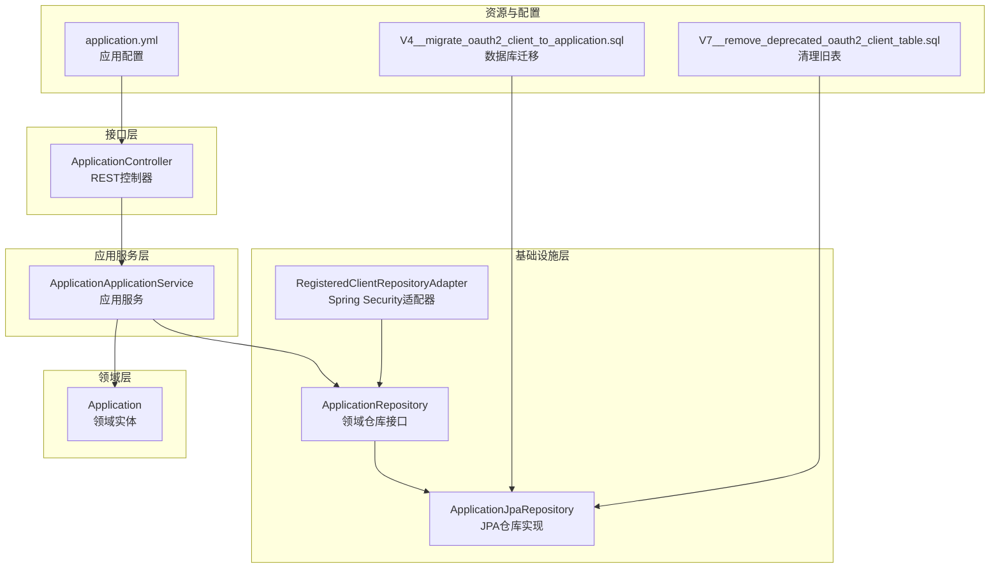
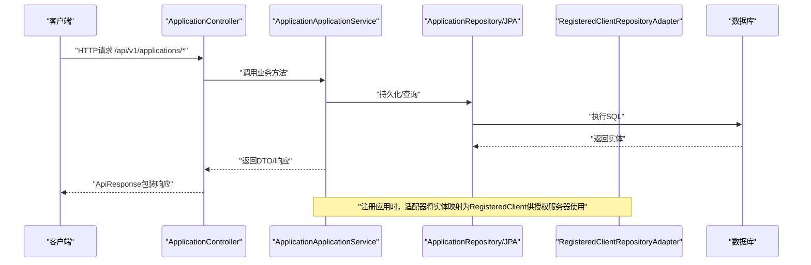
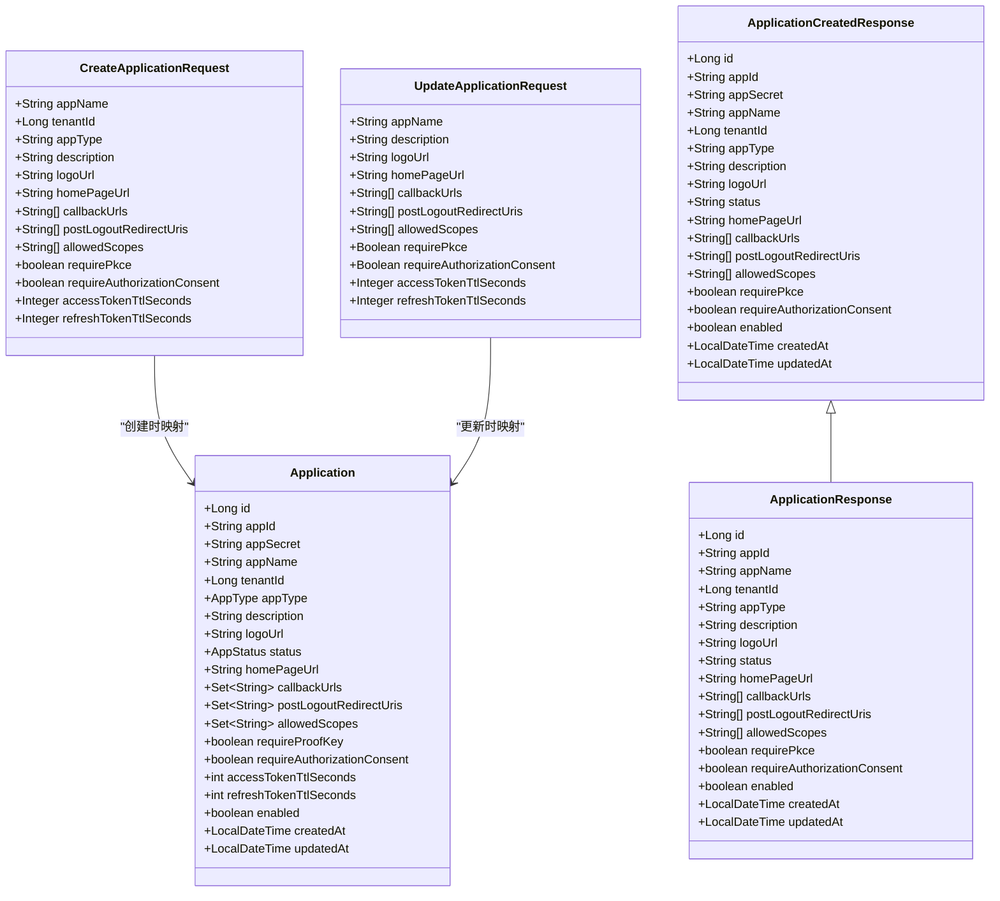
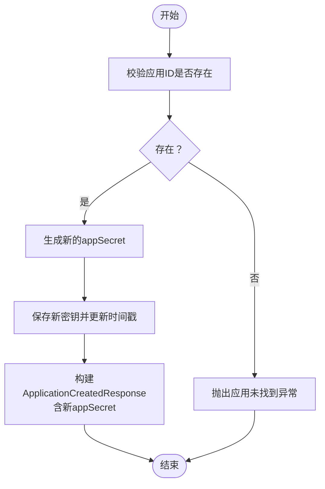
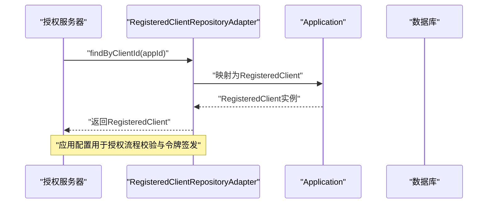
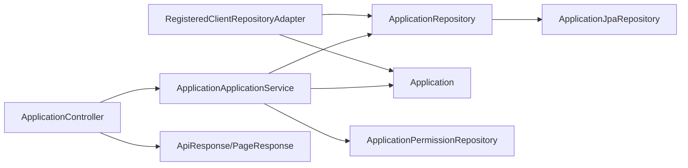

# OAuth2客户端API

<cite>
**本文档引用的文件**
- [ApplicationController.java](file://src/main/java/sso/oidc/interfaces/rest/ApplicationController.java)
- [ApplicationApplicationService.java](file://src/main/java/sso/oidc/application/service/ApplicationApplicationService.java)
- [Application.java](file://src/main/java/sso/oidc/domain/model/entity/Application.java)
- [RegisteredClientRepositoryAdapter.java](file://src/main/java/sso/oidc/infrastructure/security/RegisteredClientRepositoryAdapter.java)
- [CreateApplicationRequest.java](file://src/main/java/sso/oidc/application/dto/request/CreateApplicationRequest.java)
- [UpdateApplicationRequest.java](file://src/main/java/sso/oidc/application/dto/request/UpdateApplicationRequest.java)
- [ApplicationCreatedResponse.java](file://src/main/java/sso/oidc/application/dto/response/ApplicationCreatedResponse.java)
- [ApplicationResponse.java](file://src/main/java/sso/oidc/application/dto/response/ApplicationResponse.java)
- [ApiResponse.java](file://src/main/java/sso/oidc/interfaces/rest/common/ApiResponse.java)
- [PageResponse.java](file://src/main/java/sso/oidc/interfaces/rest/common/PageResponse.java)
- [ApplicationRepository.java](file://src/main/java/sso/oidc/domain/repository/ApplicationRepository.java)
- [ApplicationJpaRepository.java](file://src/main/java/sso/oidc/infrastructure/persistence/repository/ApplicationJpaRepository.java)
- [application.yml](file://src/main/resources/application.yml)
- [V4__migrate_oauth2_client_to_application.sql](file://src/main/resources/db/migration/V4__migrate_oauth2_client_to_application.sql)
- [V7__remove_deprecated_oauth2_client_table.sql](file://src/main/resources/db/migration/V7__remove_deprecated_oauth2_client_table.sql)
</cite>

## 更新摘要
**所做更改**
- 更新架构总览以反映OAuth2ClientController已移除，API重构为ApplicationController
- 修改所有API端点路径从/v1/clients更改为/api/v1/applications
- 更新客户端概念为应用（Application），包含更丰富的功能集
- 添加应用权限管理功能
- 更新数据库模式说明，反映t_application表替代t_oauth2_client表
- 更新密钥轮换机制为应用密钥轮换

## 目录
1. [简介](#简介)
2. [项目结构](#项目结构)
3. [核心组件](#核心组件)
4. [架构总览](#架构总览)
5. [详细组件分析](#详细组件分析)
6. [依赖关系分析](#依赖关系分析)
7. [性能考虑](#性能考虑)
8. [故障排除指南](#故障排除指南)
9. [结论](#结论)
10. [附录](#附录)

## 简介
本文件为OAuth2应用管理API的完整技术文档，覆盖以下REST接口：
- POST /api/v1/applications：注册OAuth2应用（仅创建时返回应用密钥）
- GET /api/v1/applications/{id}：按ID获取应用详情
- GET /api/v1/applications/by-app-id/{appId}：按应用ID获取应用详情
- GET /api/v1/applications/tenant/{tenantId}：按租户获取应用列表
- GET /api/v1/applications：获取所有应用列表
- PUT /api/v1/applications/{id}：更新应用配置
- DELETE /api/v1/applications/{id}：删除应用
- POST /api/v1/applications/{id}/rotate-secret：轮换应用密钥（仅新密钥返回一次）
- POST /api/v1/applications/{id}/activate：激活应用
- POST /api/v1/applications/{id}/deactivate：停用应用
- POST /api/v1/applications/{id}/block：封禁应用
- POST /api/v1/applications/{id}/permissions：创建应用权限
- GET /api/v1/applications/{id}/permissions：获取应用权限列表
- DELETE /api/v1/applications/permissions/{permissionId}：删除应用权限

文档还详细说明了应用注册所需字段、可配置项（作用域、令牌有效期、刷新令牌策略）、应用权限管理、密钥轮换的安全机制，以及在OAuth2授权流程中应用的角色与安全注意事项。

## 项目结构
该服务采用分层架构，主要模块如下：
- 接口层（REST）：ApplicationController负责HTTP路由与参数绑定
- 应用服务层：编排业务逻辑，处理事务与领域模型转换
- 领域层：实体与值对象承载业务规则
- 基础设施层：数据访问、安全适配器、配置等
- 资源与配置：数据库迁移脚本、应用配置文件

**图表来源**
- [ApplicationController.java:28-139](file://src/main/java/sso/oidc/interfaces/rest/ApplicationController.java#L28-L139)
- [ApplicationApplicationService.java:27-255](file://src/main/java/sso/oidc/application/service/ApplicationApplicationService.java#L27-255)
- [Application.java:17-211](file://src/main/java/sso/oidc/domain/model/entity/Application.java#L17-L211)
- [ApplicationRepository.java:9-20](file://src/main/java/sso/oidc/domain/repository/ApplicationRepository.java#L9-L20)
- [ApplicationJpaRepository.java:8-11](file://src/main/java/sso/oidc/infrastructure/persistence/repository/ApplicationJpaRepository.java#L8-L11)
- [RegisteredClientRepositoryAdapter.java:18-74](file://src/main/java/sso/oidc/infrastructure/security/RegisteredClientRepositoryAdapter.java#L18-L74)
- [application.yml:1-78](file://src/main/resources/application.yml#L1-L78)
- [V4__migrate_oauth2_client_to_application.sql:10-131](file://src/main/resources/db/migration/V4__migrate_oauth2_client_to_application.sql#L10-L131)
- [V7__remove_deprecated_oauth2_client_table.sql:10-14](file://src/main/resources/db/migration/V7__remove_deprecated_oauth2_client_table.sql#L10-L14)

**章节来源**
- [ApplicationController.java:28-139](file://src/main/java/sso/oidc/interfaces/rest/ApplicationController.java#L28-L139)
- [ApplicationApplicationService.java:27-255](file://src/main/java/sso/oidc/application/service/ApplicationApplicationService.java#L27-255)
- [ApplicationRepository.java:9-20](file://src/main/java/sso/oidc/domain/repository/ApplicationRepository.java#L9-L20)
- [ApplicationJpaRepository.java:8-11](file://src/main/java/sso/oidc/infrastructure/persistence/repository/ApplicationJpaRepository.java#L8-L11)
- [RegisteredClientRepositoryAdapter.java:18-74](file://src/main/java/sso/oidc/infrastructure/security/RegisteredClientRepositoryAdapter.java#L18-L74)
- [application.yml:1-78](file://src/main/resources/application.yml#L1-L78)
- [V4__migrate_oauth2_client_to_application.sql:10-131](file://src/main/resources/db/migration/V4__migrate_oauth2_client_to_application.sql#L10-L131)
- [V7__remove_deprecated_oauth2_client_table.sql:10-14](file://src/main/resources/db/migration/V7__remove_deprecated_oauth2_client_table.sql#L10-L14)

## 核心组件
- REST控制器：定义/api/v1/applications路径下的所有应用管理端点，统一返回ApiResponse包装体
- 应用服务：实现应用注册、查询、更新、删除、列表、密钥轮换、状态管理和权限管理的业务逻辑
- 领域实体：封装OAuth2应用的核心属性与默认行为，包含完整的生命周期管理
- 仓库接口与实现：抽象持久化访问，JPA实现支持按ID、应用ID与租户ID查询
- 安全适配器：将领域实体映射到Spring Security的RegisteredClient，供授权服务器使用
- DTO与响应包装：标准化请求/响应结构，包含分页与统一状态码
- 权限管理：支持应用级权限的创建、查询和删除

**章节来源**
- [ApplicationController.java:32-139](file://src/main/java/sso/oidc/interfaces/rest/ApplicationController.java#L32-L139)
- [ApplicationApplicationService.java:35-255](file://src/main/java/sso/oidc/application/service/ApplicationApplicationService.java#L35-L255)
- [Application.java:17-211](file://src/main/java/sso/oidc/domain/model/entity/Application.java#L17-L211)
- [ApplicationRepository.java:9-20](file://src/main/java/sso/oidc/domain/repository/ApplicationRepository.java#L9-L20)
- [ApplicationJpaRepository.java:8-11](file://src/main/java/sso/oidc/infrastructure/persistence/repository/ApplicationJpaRepository.java#L8-L11)
- [RegisteredClientRepositoryAdapter.java:42-72](file://src/main/java/sso/oidc/infrastructure/security/RegisteredClientRepositoryAdapter.java#L42-L72)
- [ApiResponse.java:18-50](file://src/main/java/sso/oidc/interfaces/rest/common/ApiResponse.java#L18-L50)
- [PageResponse.java:14-31](file://src/main/java/sso/oidc/interfaces/rest/common/PageResponse.java#L14-L31)

## 架构总览
下图展示了从HTTP请求到数据库存储与Spring Security授权服务器的交互路径：

**图表来源**
- [ApplicationController.java:32-139](file://src/main/java/sso/oidc/interfaces/rest/ApplicationController.java#L32-L139)
- [ApplicationApplicationService.java:35-255](file://src/main/java/sso/oidc/application/service/ApplicationApplicationService.java#L35-L255)
- [ApplicationRepository.java:9-20](file://src/main/java/sso/oidc/domain/repository/ApplicationRepository.java#L9-L20)
- [ApplicationJpaRepository.java:8-11](file://src/main/java/sso/oidc/infrastructure/persistence/repository/ApplicationJpaRepository.java#L8-L11)
- [RegisteredClientRepositoryAdapter.java:22-72](file://src/main/java/sso/oidc/infrastructure/security/RegisteredClientRepositoryAdapter.java#L22-L72)

## 详细组件分析

### REST接口定义与行为
- POST /api/v1/applications
  - 功能：注册OAuth2应用
  - 请求体：CreateApplicationRequest
  - 响应体：ApplicationCreatedResponse（包含appSecret，仅创建时返回）
  - 返回码：201 Created
- GET /api/v1/applications/{id}
  - 功能：按ID获取应用详情
  - 响应体：ApplicationResponse
  - 返回码：200 OK
- GET /api/v1/applications/by-app-id/{appId}
  - 功能：按应用ID获取应用详情
  - 响应体：ApplicationResponse
  - 返回码：200 OK
- GET /api/v1/applications/tenant/{tenantId}
  - 功能：按租户获取应用列表
  - 响应体：List<ApplicationResponse>
  - 返回码：200 OK
- GET /api/v1/applications
  - 功能：获取所有应用列表
  - 响应体：List<ApplicationResponse>
  - 返回码：200 OK
- PUT /api/v1/applications/{id}
  - 功能：更新应用配置
  - 请求体：UpdateApplicationRequest
  - 响应体：ApplicationResponse
  - 返回码：200 OK
- DELETE /api/v1/applications/{id}
  - 功能：删除应用
  - 返回码：204 No Content
- POST /api/v1/applications/{id}/rotate-secret
  - 功能：轮换应用密钥
  - 响应体：ApplicationCreatedResponse（仅新appSecret返回一次）
  - 返回码：200 OK
- POST /api/v1/applications/{id}/activate
  - 功能：激活应用
  - 返回码：200 OK
- POST /api/v1/applications/{id}/deactivate
  - 功能：停用应用
  - 返回码：200 OK
- POST /api/v1/applications/{id}/block
  - 功能：封禁应用
  - 返回码：200 OK
- POST /api/v1/applications/{id}/permissions
  - 功能：创建应用权限
  - 请求体：CreateApplicationPermissionRequest
  - 响应体：ApplicationPermissionResponse
  - 返回码：201 Created
- GET /api/v1/applications/{id}/permissions
  - 功能：获取应用权限列表
  - 响应体：List<ApplicationPermissionResponse>
  - 返回码：200 OK
- DELETE /api/v1/applications/permissions/{permissionId}
  - 功能：删除应用权限
  - 返回码：204 No Content

请求/响应统一包装：
- 成功响应：ApiResponse.success(data)
- 创建响应：ApiResponse.created(data)
- 错误响应：ApiResponse.error(code, message, errors)

**章节来源**
- [ApplicationController.java:32-139](file://src/main/java/sso/oidc/interfaces/rest/ApplicationController.java#L32-L139)
- [ApiResponse.java:25-50](file://src/main/java/sso/oidc/interfaces/rest/common/ApiResponse.java#L25-L50)
- [PageResponse.java:21-31](file://src/main/java/sso/oidc/interfaces/rest/common/PageResponse.java#L21-L31)

### 应用注册与更新的数据模型
- 必需字段（注册时）：
  - 应用名称（appName）
  - 租户ID（tenantId）
  - 应用类型（appType：WEB、MOBILE、API、THIRD_PARTY）
  - 回调URL列表（callbackUrls）
  - 允许的作用域列表（allowedScopes）
- 可选配置：
  - 应用描述（description）
  - Logo URL（logoUrl）
  - 主页URL（homePageUrl）
  - 是否要求PKCE（requirePkce）
  - 是否要求授权同意（requireAuthorizationConsent）
  - 访问令牌有效期（accessTokenTtlSeconds，默认3600秒）
  - 刷新令牌有效期（refreshTokenTtlSeconds，默认86400秒）
- 更新时可变更的字段：appName、description、logoUrl、homePageUrl、callbackUrls、postLogoutRedirectUris、allowedScopes、requirePkce、requireAuthorizationConsent、accessTokenTtlSeconds、refreshTokenTtlSeconds

**图表来源**
- [Application.java:17-211](file://src/main/java/sso/oidc/domain/model/entity/Application.java#L17-L211)
- [CreateApplicationRequest.java:17-44](file://src/main/java/sso/oidc/application/dto/request/CreateApplicationRequest.java#L17-L44)
- [UpdateApplicationRequest.java:14-24](file://src/main/java/sso/oidc/application/dto/request/UpdateApplicationRequest.java#L14-L24)
- [ApplicationCreatedResponse.java:15-35](file://src/main/java/sso/oidc/application/dto/response/ApplicationCreatedResponse.java#L15-L35)
- [ApplicationResponse.java:15-26](file://src/main/java/sso/oidc/application/dto/response/ApplicationResponse.java#L15-L26)

**章节来源**
- [CreateApplicationRequest.java:17-44](file://src/main/java/sso/oidc/application/dto/request/CreateApplicationRequest.java#L17-L44)
- [UpdateApplicationRequest.java:14-24](file://src/main/java/sso/oidc/application/dto/request/UpdateApplicationRequest.java#L14-L24)
- [Application.java:17-211](file://src/main/java/sso/oidc/domain/model/entity/Application.java#L17-L211)

### 密钥轮换的安全机制
- 新密钥生成：使用AppCredential.generate()生成高强度随机字符串
- 单次可见性：仅在创建与轮换时返回appSecret，后续查询不包含密钥
- 数据库存储：字段注释明确为AES加密存储（t_application.app_secret）

**图表来源**
- [ApplicationApplicationService.java:136-147](file://src/main/java/sso/oidc/application/service/ApplicationApplicationService.java#L136-L147)

**章节来源**
- [ApplicationApplicationService.java:136-147](file://src/main/java/sso/oidc/application/service/ApplicationApplicationService.java#L136-L147)
- [V4__migrate_oauth2_client_to_application.sql:44](file://src/main/resources/db/migration/V4__migrate_oauth2_client_to_application.sql#L44)

### 应用状态管理
应用支持完整的生命周期管理：
- ACTIVE：激活状态，可正常使用
- INACTIVE：停用状态，不可使用
- REVIEWING：审核中状态
- BLOCKED：封禁状态，不可恢复

状态转换规则：
- ACTIVE应用可转换为INACTIVE
- INACTIVE应用可转换为ACTIVE
- BLOCKED应用不可转换为ACTIVE
- 所有状态都可转换为BLOCKED

**章节来源**
- [Application.java:99-125](file://src/main/java/sso/oidc/domain/model/entity/Application.java#L99-L125)
- [ApplicationApplicationService.java:151-176](file://src/main/java/sso/oidc/application/service/ApplicationApplicationService.java#L151-L176)

### 应用权限管理
支持应用级权限的创建、查询和删除：
- 权限类型：READ、WRITE、DELETE、EXECUTE
- 资源类型：用户、订单、报告等
- 权限编码：app:{resourceType}:{action}

权限管理API：
- POST /api/v1/applications/{id}/permissions：创建应用权限
- GET /api/v1/applications/{id}/permissions：获取应用权限列表
- DELETE /api/v1/applications/permissions/{permissionId}：删除应用权限

**章节来源**
- [ApplicationApplicationService.java:180-210](file://src/main/java/sso/oidc/application/service/ApplicationApplicationService.java#L180-L210)

### Spring Security集成与授权流程中的应用角色
- 适配器职责：将Application映射为RegisteredClient，传递给授权服务器
- 关键映射项：
  - 客户端认证方式：clientAuthenticationMethods
  - 授权类型：authorizationGrantTypes
  - 回调URL：redirectUris
  - 作用域：scopes
  - 令牌设置：accessTokenTtlSeconds、refreshTokenTtlSeconds
  - 客户端设置：requireProofKey、requireAuthorizationConsent
- 授权服务器通过RegisteredClientRepository加载应用配置，完成授权码、隐式、密码、客户端凭证等流程

**图表来源**
- [RegisteredClientRepositoryAdapter.java:35-72](file://src/main/java/sso/oidc/infrastructure/security/RegisteredClientRepositoryAdapter.java#L35-L72)
- [Application.java:25-36](file://src/main/java/sso/oidc/domain/model/entity/Application.java#L25-L36)

**章节来源**
- [RegisteredClientRepositoryAdapter.java:18-74](file://src/main/java/sso/oidc/infrastructure/security/RegisteredClientRepositoryAdapter.java#L18-L74)
- [Application.java:17-211](file://src/main/java/sso/oidc/domain/model/entity/Application.java#L17-L211)

### 数据库模式与字段说明
- 表：t_application（替代原有的t_oauth2_client）
- 关键字段：
  - app_id：应用唯一标识（原client_id）
  - app_secret：应用密钥（AES加密）
  - app_name：应用显示名
  - tenant_id：所属租户ID
  - app_type：应用类型（WEB/MOBILE/API/THIRD_PARTY）
  - description：应用描述
  - logo_url：Logo URL
  - status：应用状态（ACTIVE/INACTIVE/REVIEWING/BLOCKED）
  - home_page_url：主页URL
  - callback_urls：回调URL（逗号分隔）
  - post_logout_redirect_uris：登出后重定向URL（逗号分隔）
  - allowed_scopes：允许的作用域（逗号分隔）
  - require_proof_key：是否要求PKCE
  - require_authorization_consent：是否要求授权同意
  - access_token_ttl_seconds：访问令牌有效期（秒）
  - refresh_token_ttl_seconds：刷新令牌有效期（秒）
  - enabled：启用状态
  - created_at/updated_at：创建与更新时间戳

**章节来源**
- [V4__migrate_oauth2_client_to_application.sql:10-79](file://src/main/resources/db/migration/V4__migrate_oauth2_client_to_application.sql#L10-L79)

## 依赖关系分析
- 控制器依赖应用服务进行业务处理
- 应用服务依赖仓库接口进行数据持久化
- 仓库接口由JPA实现类提供具体SQL访问
- 安全适配器依赖仓库接口读取领域实体并映射为RegisteredClient
- 统一响应包装器为所有接口提供一致的响应格式
- 权限管理依赖ApplicationPermissionRepository进行权限数据持久化

**图表来源**
- [ApplicationController.java:32-139](file://src/main/java/sso/oidc/interfaces/rest/ApplicationController.java#L32-L139)
- [ApplicationApplicationService.java:32-33](file://src/main/java/sso/oidc/application/service/ApplicationApplicationService.java#L32-L33)
- [ApplicationRepository.java:9-20](file://src/main/java/sso/oidc/domain/repository/ApplicationRepository.java#L9-L20)
- [ApplicationJpaRepository.java:8-11](file://src/main/java/sso/oidc/infrastructure/persistence/repository/ApplicationJpaRepository.java#L8-L11)
- [RegisteredClientRepositoryAdapter.java:22](file://src/main/java/sso/oidc/infrastructure/security/RegisteredClientRepositoryAdapter.java#L22)
- [ApiResponse.java:18-50](file://src/main/java/sso/oidc/interfaces/rest/common/ApiResponse.java#L18-L50)
- [PageResponse.java:14-31](file://src/main/java/sso/oidc/interfaces/rest/common/PageResponse.java#L14-L31)

**章节来源**
- [ApplicationController.java:28-139](file://src/main/java/sso/oidc/interfaces/rest/ApplicationController.java#L28-L139)
- [ApplicationApplicationService.java:27-255](file://src/main/java/sso/oidc/application/service/ApplicationApplicationService.java#L27-255)
- [ApplicationRepository.java:9-20](file://src/main/java/sso/oidc/domain/repository/ApplicationRepository.java#L9-L20)
- [ApplicationJpaRepository.java:8-11](file://src/main/java/sso/oidc/infrastructure/persistence/repository/ApplicationJpaRepository.java#L8-L11)
- [RegisteredClientRepositoryAdapter.java:18-74](file://src/main/java/sso/oidc/infrastructure/security/RegisteredClientRepositoryAdapter.java#L18-L74)
- [ApiResponse.java:18-50](file://src/main/java/sso/oidc/interfaces/rest/common/ApiResponse.java#L18-L50)
- [PageResponse.java:14-31](file://src/main/java/sso/oidc/interfaces/rest/common/PageResponse.java#L14-L31)

## 性能考虑
- 分页查询：列表接口支持分页查询，避免一次性返回大量数据
- 事务边界：注册、更新、删除与密钥轮换均在事务内执行，保证一致性
- 映射开销：适配器将Set集合转换为RegisteredClient时注意批量操作的内存占用
- 缓存策略：当前未见专门的应用缓存实现，建议在高并发场景下对常用查询结果进行缓存
- 权限查询：应用权限查询支持按应用ID过滤，减少不必要的数据传输

## 故障排除指南
- 应用不存在
  - 现象：更新、删除、轮换密钥、状态管理时抛出"应用未找到"异常
  - 处理：确认传入的应用ID正确，或先创建应用
- 参数校验失败
  - 现象：请求体缺少必填字段或格式错误，返回400错误
  - 处理：检查CreateApplicationRequest与UpdateApplicationRequest的字段约束
- 响应格式
  - 统一使用ApiResponse包装，错误时包含code、message与errors字段
- 数据库连接
  - 检查application.yml中的数据库配置与凭据
- 权限管理
  - 确保应用ID有效，权限编码唯一性约束

**章节来源**
- [ApplicationApplicationService.java:86-134](file://src/main/java/sso/oidc/application/service/ApplicationApplicationService.java#L86-L134)
- [CreateApplicationRequest.java:18-44](file://src/main/java/sso/oidc/application/dto/request/CreateApplicationRequest.java#L18-L44)
- [UpdateApplicationRequest.java:14-24](file://src/main/java/sso/oidc/application/dto/request/UpdateApplicationRequest.java#L14-L24)
- [ApiResponse.java:43-50](file://src/main/java/sso/oidc/interfaces/rest/common/ApiResponse.java#L43-L50)
- [application.yml:9-18](file://src/main/resources/application.yml#L9-L18)

## 结论
本OAuth2应用管理API提供了完整的应用生命周期管理能力，涵盖注册、查询、更新、删除、密钥轮换、状态管理和权限管理。通过清晰的DTO与统一响应包装，确保了接口的一致性与易用性；通过Spring Security适配器，实现了与授权服务器的无缝对接。相比之前的OAuth2客户端管理，新的应用管理API提供了更丰富的功能集，包括应用状态管理、权限管理和多租户支持。建议在生产环境中配合严格的密钥管理与审计日志，以满足安全合规要求。

## 附录

### API端点一览表
- POST /api/v1/applications
  - 请求体：CreateApplicationRequest
  - 响应体：ApplicationCreatedResponse（包含appSecret）
  - 返回码：201
- GET /api/v1/applications/{id}
  - 响应体：ApplicationResponse
  - 返回码：200
- GET /api/v1/applications/by-app-id/{appId}
  - 响应体：ApplicationResponse
  - 返回码：200
- GET /api/v1/applications/tenant/{tenantId}
  - 响应体：List<ApplicationResponse>
  - 返回码：200
- GET /api/v1/applications
  - 响应体：List<ApplicationResponse>
  - 返回码：200
- PUT /api/v1/applications/{id}
  - 请求体：UpdateApplicationRequest
  - 响应体：ApplicationResponse
  - 返回码：200
- DELETE /api/v1/applications/{id}
  - 返回码：204
- POST /api/v1/applications/{id}/rotate-secret
  - 响应体：ApplicationCreatedResponse（仅新appSecret）
  - 返回码：200
- POST /api/v1/applications/{id}/activate
  - 返回码：200
- POST /api/v1/applications/{id}/deactivate
  - 返回码：200
- POST /api/v1/applications/{id}/block
  - 返回码：200
- POST /api/v1/applications/{id}/permissions
  - 请求体：CreateApplicationPermissionRequest
  - 响应体：ApplicationPermissionResponse
  - 返回码：201
- GET /api/v1/applications/{id}/permissions
  - 响应体：List<ApplicationPermissionResponse>
  - 返回码：200
- DELETE /api/v1/applications/permissions/{permissionId}
  - 返回码：204

**章节来源**
- [ApplicationController.java:32-139](file://src/main/java/sso/oidc/interfaces/rest/ApplicationController.java#L32-L139)
- [ApiResponse.java:25-50](file://src/main/java/sso/oidc/interfaces/rest/common/ApiResponse.java#L25-L50)
- [PageResponse.java:21-31](file://src/main/java/sso/oidc/interfaces/rest/common/PageResponse.java#L21-L31)

### 应用凭证生成、验证与使用
- 生成：注册成功后返回appSecret，需妥善保管
- 验证：授权服务器使用app_id与app_secret进行应用认证
- 使用：在需要应用凭证的授权流程中（如客户端凭证授权类型）携带凭据

**章节来源**
- [ApplicationApplicationService.java:37-62](file://src/main/java/sso/oidc/application/service/ApplicationApplicationService.java#L37-L62)
- [RegisteredClientRepositoryAdapter.java:56-72](file://src/main/java/sso/oidc/infrastructure/security/RegisteredClientRepositoryAdapter.java#L56-L72)

### 数据库迁移历史
- V4迁移：将OAuth2客户端功能迁移到应用模型，创建t_application表
- V7清理：移除废弃的t_oauth2_client表，完成架构重构

**章节来源**
- [V4__migrate_oauth2_client_to_application.sql:80-131](file://src/main/resources/db/migration/V4__migrate_oauth2_client_to_application.sql#L80-L131)
- [V7__remove_deprecated_oauth2_client_table.sql:10-14](file://src/main/resources/db/migration/V7__remove_deprecated_oauth2_client_table.sql#L10-L14)