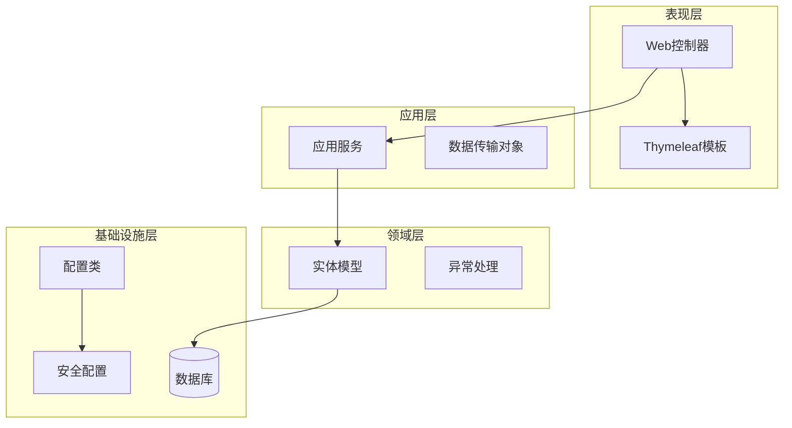
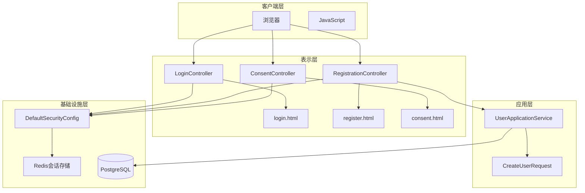
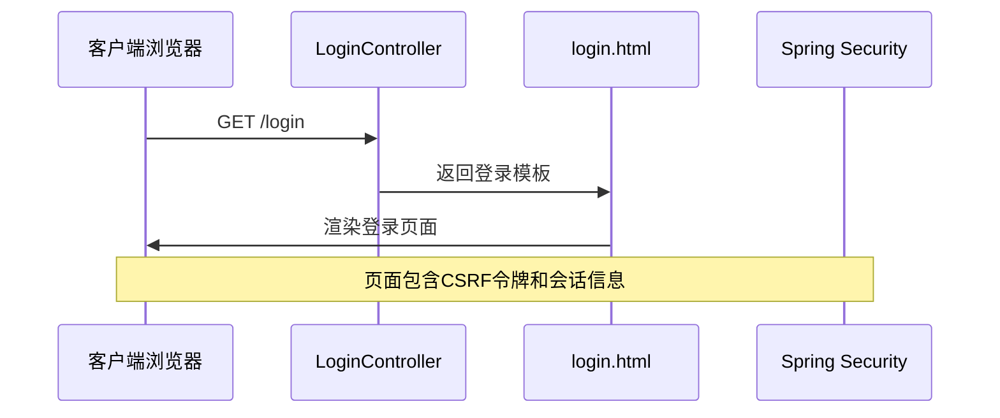
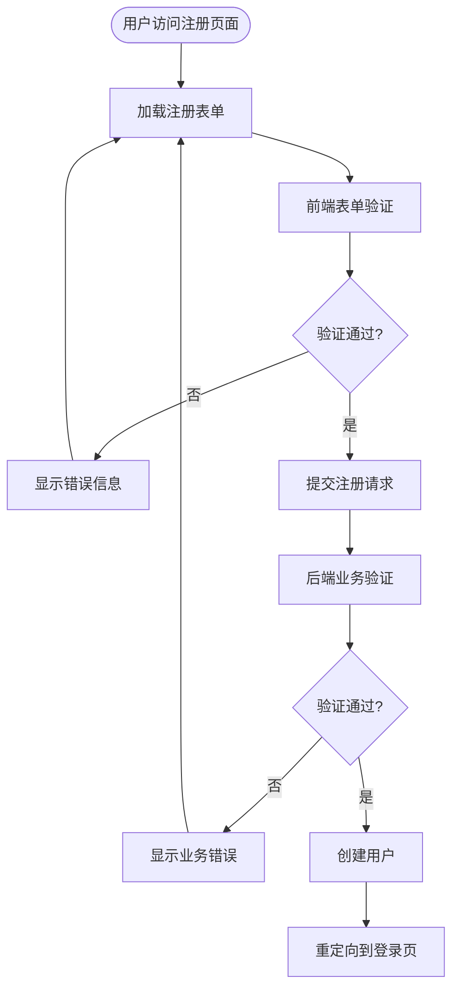
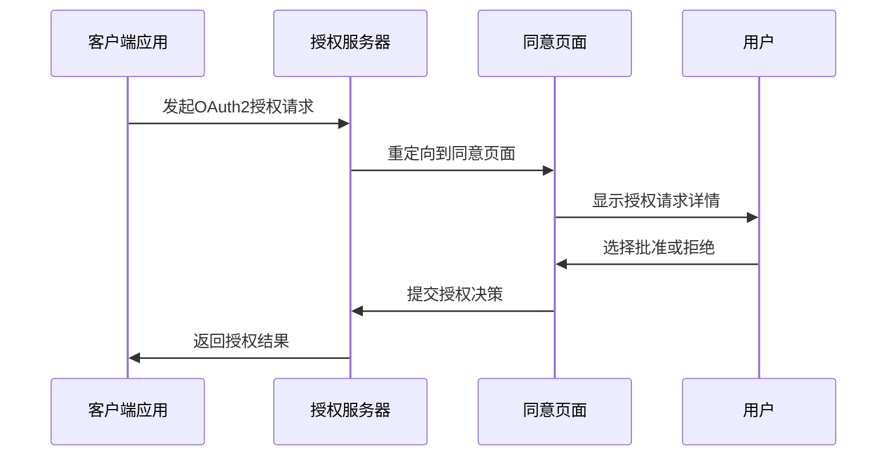
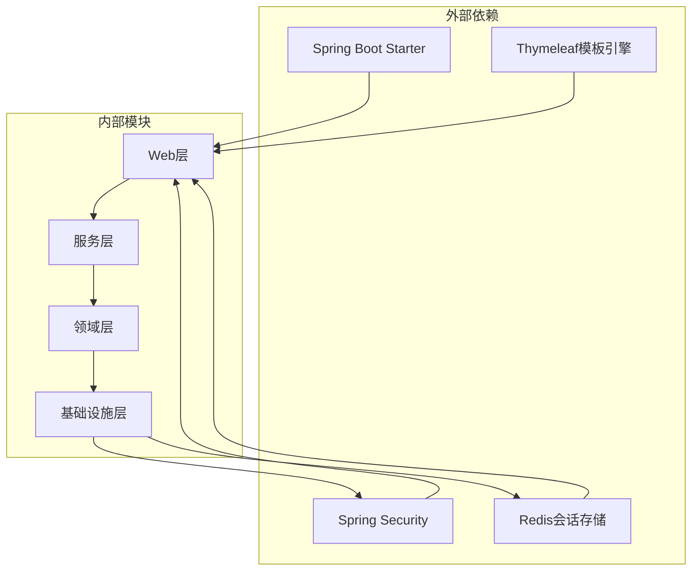

# Web界面接口

<cite>
**本文档引用的文件**
- [LoginController.java](file://src/main/java/sso/oidc/interfaces/web/LoginController.java)
- [RegistrationController.java](file://src/main/java/sso/oidc/interfaces/web/RegistrationController.java)
- [ConsentController.java](file://src/main/java/sso/oidc/interfaces/web/ConsentController.java)
- [login.html](file://src/main/resources/templates/login.html)
- [register.html](file://src/main/resources/templates/register.html)
- [consent.html](file://src/main/resources/templates/consent.html)
- [DefaultSecurityConfig.java](file://src/main/java/sso/oidc/infrastructure/config/DefaultSecurityConfig.java)
- [application.yml](file://src/main/resources/application.yml)
- [CreateUserRequest.java](file://src/main/java/sso/oidc/application/dto/request/CreateUserRequest.java)
- [UserApplicationService.java](file://src/main/java/sso/oidc/application/service/UserApplicationService.java)
- [UserAlreadyExistsException.java](file://src/main/java/sso/oidc/domain/model/exception/UserAlreadyExistsException.java)
- [style.css](file://src/main/resources/static/css/style.css)
- [pom.xml](file://pom.xml)
</cite>

## 目录
1. [简介](#简介)
2. [项目结构](#项目结构)
3. [核心组件](#核心组件)
4. [架构概览](#架构概览)
5. [详细组件分析](#详细组件分析)
6. [依赖关系分析](#依赖关系分析)
7. [性能考虑](#性能考虑)
8. [故障排除指南](#故障排除指南)
9. [结论](#结论)

## 简介

本文件详细记录了基于Thymeleaf模板的Web界面交互API，涵盖完整的用户认证和授权流程。该系统实现了标准的SSO（单点登录）和OIDC（OpenID Connect）功能，包括用户登录、注册、权限同意等核心Web界面。

系统采用Spring Boot + Spring Security + Thymeleaf技术栈构建，通过分布式会话管理支持多实例部署，并集成了完整的安全防护机制。

## 项目结构

项目采用标准的Maven分层架构，主要包含以下层次：

**图表来源**
- [LoginController.java:1-14](file://src/main/java/sso/oidc/interfaces/web/LoginController.java#L1-L14)
- [RegistrationController.java:1-43](file://src/main/java/sso/oidc/interfaces/web/RegistrationController.java#L1-L43)
- [ConsentController.java:1-21](file://src/main/java/sso/oidc/interfaces/web/ConsentController.java#L1-L21)

**章节来源**
- [LoginController.java:1-14](file://src/main/java/sso/oidc/interfaces/web/LoginController.java#L1-L14)
- [RegistrationController.java:1-43](file://src/main/java/sso/oidc/interfaces/web/RegistrationController.java#L1-L43)
- [ConsentController.java:1-21](file://src/main/java/sso/oidc/interfaces/web/ConsentController.java#L1-L21)

## 核心组件

### Web控制器层

系统包含三个核心Web控制器，分别处理不同的用户交互场景：

1. **LoginController**: 处理用户登录页面请求
2. **RegistrationController**: 处理用户注册页面和提交
3. **ConsentController**: 处理OAuth2授权同意页面

### 模板引擎层

使用Thymeleaf作为模板引擎，提供动态内容渲染和表单绑定功能。模板文件位于`src/main/resources/templates/`目录下。

### 安全配置层

通过DefaultSecurityConfig配置Spring Security，实现表单认证、会话管理和CSRF保护。

**章节来源**
- [DefaultSecurityConfig.java:1-43](file://src/main/java/sso/oidc/infrastructure/config/DefaultSecurityConfig.java#L1-L43)
- [application.yml:1-78](file://src/main/resources/application.yml#L1-L78)

## 架构概览

系统采用经典的三层架构设计，通过清晰的职责分离实现松耦合的模块化结构：

**图表来源**
- [LoginController.java:1-14](file://src/main/java/sso/oidc/interfaces/web/LoginController.java#L1-L14)
- [RegistrationController.java:1-43](file://src/main/java/sso/oidc/interfaces/web/RegistrationController.java#L1-L43)
- [ConsentController.java:1-21](file://src/main/java/sso/oidc/interfaces/web/ConsentController.java#L1-L21)
- [DefaultSecurityConfig.java:1-43](file://src/main/java/sso/oidc/infrastructure/config/DefaultSecurityConfig.java#L1-L43)

## 详细组件分析

### 登录页面接口

#### GET /login - 登录页面

**功能描述**: 返回用户登录页面，提供用户名和密码输入表单。

**表单字段**:
- `username` (文本框): 用户名，必填，自动聚焦
- `password` (密码框): 密码，必填

**模板特性**:
- 支持错误参数显示 (`param.error`)
- 支持成功注册提示 (`param.registered`)
- 支持登出确认提示 (`param.logout`)

**页面行为**:
- 自动聚焦到用户名字段
- 动态显示各种状态消息
- 集成CSS样式美化

**图表来源**
- [LoginController.java:9-12](file://src/main/java/sso/oidc/interfaces/web/LoginController.java#L9-L12)
- [login.html:26-38](file://src/main/resources/templates/login.html#L26-L38)

**章节来源**
- [LoginController.java:1-14](file://src/main/java/sso/oidc/interfaces/web/LoginController.java#L1-L14)
- [login.html:1-47](file://src/main/resources/templates/login.html#L1-L47)

#### POST /login - 登录提交

**功能描述**: 处理用户登录表单提交，执行身份验证。

**表单字段**:
- `username`: 用户名
- `password`: 密码
- CSRF令牌: 自动包含在表单中

**验证规则**:
- 基于Spring Security的表单认证
- 用户名密码组合验证
- 账户状态检查（启用状态）

**错误处理**:
- 认证失败时返回错误参数
- 重定向到登录页面显示错误消息

**章节来源**
- [DefaultSecurityConfig.java:30-33](file://src/main/java/sso/oidc/infrastructure/config/DefaultSecurityConfig.java#L30-L33)

### 注册页面接口

#### GET /register - 注册页面

**功能描述**: 返回用户注册页面，提供注册表单。

**表单字段**:
- `username`: 用户名，必填，3-50字符
- `email`: 邮箱地址，必填，有效邮箱格式
- `nickname`: 昵称，可选，最多100字符
- `password`: 密码，必填，至少8字符
- `confirmPassword`: 确认密码，必填，至少8字符

**前端验证**:
- JavaScript实时密码匹配验证
- HTML5原生验证属性
- Thymeleaf字段绑定

**图表来源**
- [RegistrationController.java:21-41](file://src/main/java/sso/oidc/interfaces/web/RegistrationController.java#L21-L41)
- [register.html:16-44](file://src/main/resources/templates/register.html#L16-L44)

**章节来源**
- [RegistrationController.java:1-43](file://src/main/java/sso/oidc/interfaces/web/RegistrationController.java#L1-L43)
- [register.html:1-64](file://src/main/resources/templates/register.html#L1-L64)

#### POST /register - 注册提交

**功能描述**: 处理用户注册表单提交，执行用户创建逻辑。

**验证流程**:
1. **前端验证**: 密码匹配、字段长度、邮箱格式
2. **后端验证**: 用户名唯一性、邮箱唯一性、密码策略
3. **业务处理**: 创建用户实体、设置默认角色、加密密码

**错误处理**:
- 用户已存在错误：显示冲突错误消息
- 验证失败：返回注册页面并显示错误
- 成功注册：重定向到登录页面并显示成功消息

**章节来源**
- [RegistrationController.java:27-41](file://src/main/java/sso/oidc/interfaces/web/RegistrationController.java#L27-L41)
- [UserApplicationService.java:36-63](file://src/main/java/sso/oidc/application/service/UserApplicationService.java#L36-L63)
- [CreateUserRequest.java:15-30](file://src/main/java/sso/oidc/application/dto/request/CreateUserRequest.java#L15-L30)

### 同意页面接口

#### GET /oauth2/consent - 同意页面

**功能描述**: OAuth2授权同意页面，展示客户端请求的权限范围。

**查询参数**:
- `clientName`: 客户端名称
- `scopes`: 请求的权限范围（逗号分隔）

**表单字段**:
- `approve`: 授权决策（true/false）
- `client_id`: 客户端标识符

**页面特性**:
- 动态显示客户端名称
- 列出所有请求的权限范围
- 提供批准和拒绝选项

**图表来源**
- [ConsentController.java:12-19](file://src/main/java/sso/oidc/interfaces/web/ConsentController.java#L12-L19)
- [consent.html:23-29](file://src/main/resources/templates/consent.html#L23-L29)

**章节来源**
- [ConsentController.java:1-21](file://src/main/java/sso/oidc/interfaces/web/ConsentController.java#L1-L21)
- [consent.html:1-34](file://src/main/resources/templates/consent.html#L1-L34)

### 表单验证机制

系统实现了多层次的表单验证机制：

#### 前端验证
- HTML5原生验证属性（required、minlength、maxlength）
- JavaScript实时验证（密码匹配）
- Thymeleaf字段绑定和错误显示

#### 后端验证
- Bean Validation注解（@NotBlank、@Size、@Email）
- 业务逻辑验证（用户名唯一性、邮箱唯一性）
- 密码策略验证

**章节来源**
- [register.html:19-40](file://src/main/resources/templates/register.html#L19-L40)
- [CreateUserRequest.java:16-29](file://src/main/java/sso/oidc/application/dto/request/CreateUserRequest.java#L16-L29)

## 依赖关系分析

系统依赖关系清晰，遵循依赖倒置原则：

**图表来源**
- [pom.xml:32-64](file://pom.xml#L32-L64)
- [DefaultSecurityConfig.java:1-43](file://src/main/java/sso/oidc/infrastructure/config/DefaultSecurityConfig.java#L1-L43)

**章节来源**
- [pom.xml:32-64](file://pom.xml#L32-L64)

## 性能考虑

### 会话管理
- 使用Redis作为分布式会话存储
- 支持多实例集群部署
- 会话超时和清理机制

### 缓存策略
- Thymeleaf模板缓存禁用（开发环境）
- 静态资源缓存优化
- 数据库连接池配置

### 安全性能
- BCrypt密码编码器
- CSRF保护机制
- XSS防护措施

## 故障排除指南

### 常见问题及解决方案

#### 登录失败
**症状**: 用户名或密码错误
**原因**: 凭证不匹配或账户被锁定
**解决**: 检查用户凭证，确认账户状态

#### 注册失败
**症状**: 用户名或邮箱已存在
**原因**: 重复的用户名或邮箱
**解决**: 使用唯一的用户名和邮箱

#### 权限不足
**症状**: 访问受保护资源被拒绝
**原因**: 用户未登录或权限不足
**解决**: 完成登录流程或联系管理员

**章节来源**
- [UserAlreadyExistsException.java:1-10](file://src/main/java/sso/oidc/domain/model/exception/UserAlreadyExistsException.java#L1-L10)

## 结论

本Web界面交互API提供了完整的用户认证和授权解决方案，具有以下特点：

1. **安全性**: 集成Spring Security，提供CSRF保护、会话管理和密码加密
2. **用户体验**: 响应式设计，实时表单验证，友好的错误提示
3. **可扩展性**: 分层架构设计，支持分布式部署
4. **合规性**: 符合OAuth2和OpenID Connect标准

系统通过清晰的职责分离和标准化的实现模式，为SSO/OIDC服务提供了可靠的Web界面基础。