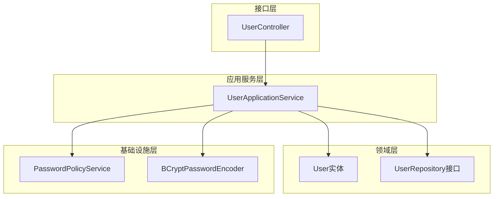
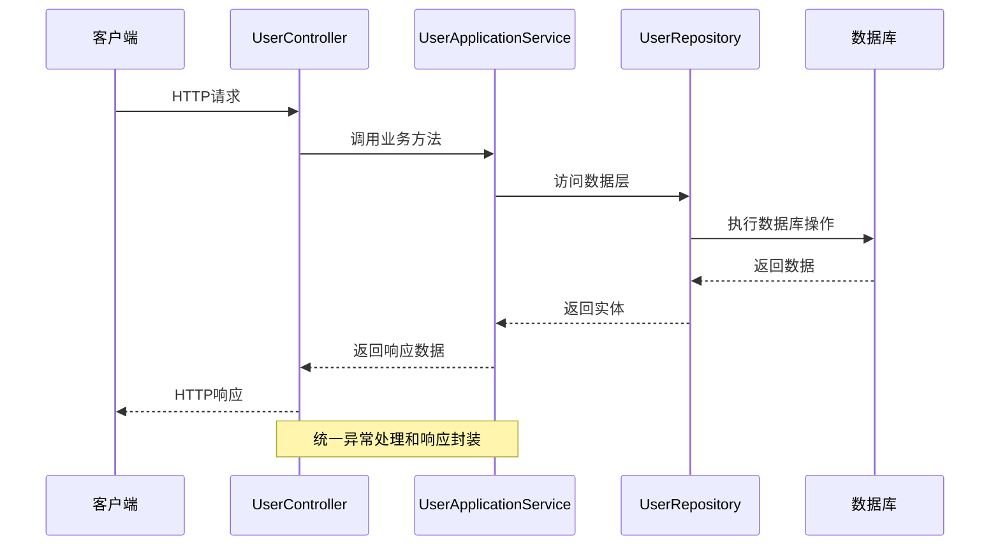
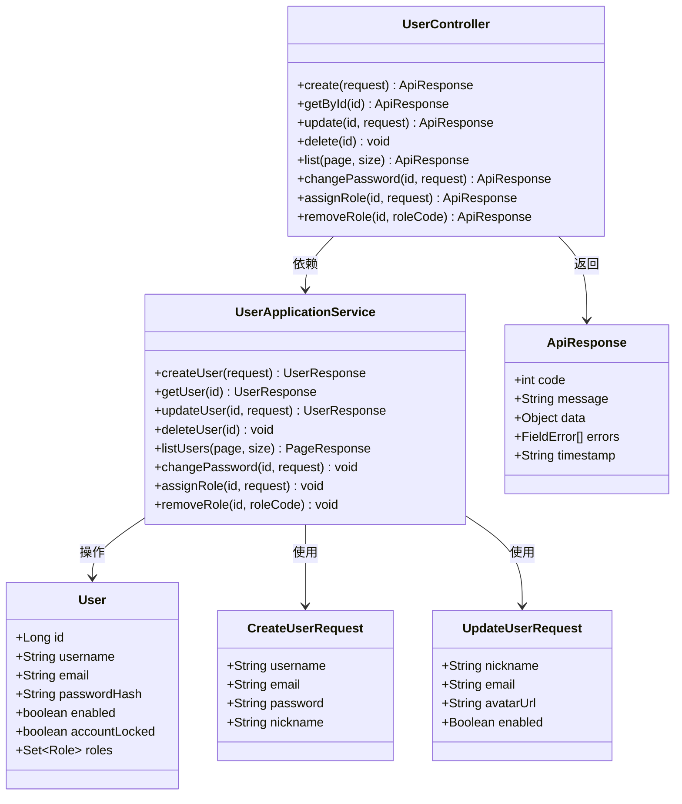
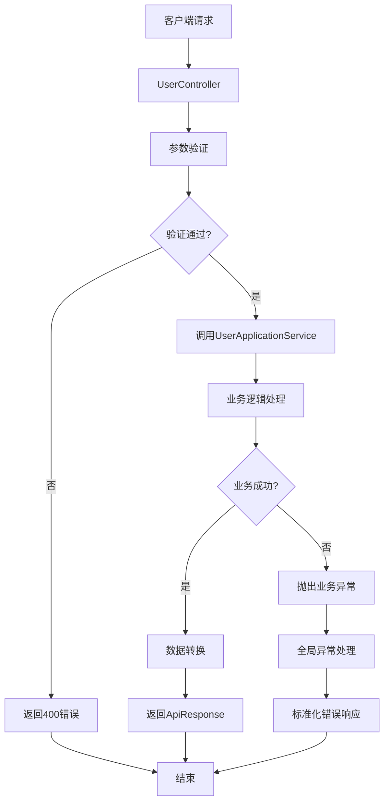

# 用户管理API

<cite>
**本文档引用的文件**
- [UserController.java](file://src/main/java/sso/oidc/interfaces/rest/UserController.java)
- [UserApplicationService.java](file://src/main/java/sso/oidc/application/service/UserApplicationService.java)
- [CreateUserRequest.java](file://src/main/java/sso/oidc/application/dto/request/CreateUserRequest.java)
- [UpdateUserRequest.java](file://src/main/java/sso/oidc/application/dto/request/UpdateUserRequest.java)
- [ChangePasswordRequest.java](file://src/main/java/sso/oidc/application/dto/request/ChangePasswordRequest.java)
- [AssignRoleRequest.java](file://src/main/java/sso/oidc/application/dto/request/AssignRoleRequest.java)
- [UserResponse.java](file://src/main/java/sso/oidc/application/dto/response/UserResponse.java)
- [User.java](file://src/main/java/sso/oidc/domain/model/entity/User.java)
- [UserRepository.java](file://src/main/java/sso/oidc/domain/repository/UserRepository.java)
- [PasswordPolicyService.java](file://src/main/java/sso/oidc/domain/service/PasswordPolicyService.java)
- [ApiResponse.java](file://src/main/java/sso/oidc/interfaces/rest/common/ApiResponse.java)
- [PageResponse.java](file://src/main/java/sso/oidc/interfaces/rest/common/PageResponse.java)
- [GlobalExceptionHandler.java](file://src/main/java/sso/oidc/interfaces/rest/common/GlobalExceptionHandler.java)
- [DefaultSecurityConfig.java](file://src/main/java/sso/oidc/infrastructure/config/DefaultSecurityConfig.java)
- [application.yml](file://src/main/resources/application.yml)
</cite>

## 目录
1. [简介](#简介)
2. [项目结构](#项目结构)
3. [核心组件](#核心组件)
4. [架构概览](#架构概览)
5. [详细组件分析](#详细组件分析)
6. [依赖关系分析](#依赖关系分析)
7. [性能考虑](#性能考虑)
8. [故障排除指南](#故障排除指南)
9. [结论](#结论)

## 简介

本文件为SSO/OIDC系统中的用户管理API详细文档。该API提供了完整的用户生命周期管理功能，包括用户创建、查询、更新、删除、密码修改、角色分配与移除等操作。系统采用Spring Boot框架构建，使用BCrypt密码加密、JWT令牌认证，并通过统一的响应格式和异常处理机制确保API的一致性和可靠性。

## 项目结构

用户管理API位于接口层的REST控制器中，通过应用服务层协调领域模型和基础设施组件。整体架构遵循分层设计原则：



**图表来源**
- [UserController.java:27-89](file://src/main/java/sso/oidc/interfaces/rest/UserController.java#L27-L89)
- [UserApplicationService.java:26-164](file://src/main/java/sso/oidc/application/service/UserApplicationService.java#L26-L164)

**章节来源**
- [UserController.java:1-90](file://src/main/java/sso/oidc/interfaces/rest/UserController.java#L1-L90)
- [UserApplicationService.java:1-165](file://src/main/java/sso/oidc/application/service/UserApplicationService.java#L1-L165)

## 核心组件

### 用户控制器 (UserController)

用户控制器提供RESTful API端点，负责处理用户相关的HTTP请求。控制器采用注解驱动的方式定义路由映射，并通过依赖注入使用应用服务层执行业务逻辑。

主要特性：
- 使用Swagger注解提供API文档元数据
- 支持多种HTTP方法：GET、POST、PUT、DELETE
- 集成参数验证和异常处理
- 统一响应格式封装

**章节来源**
- [UserController.java:27-89](file://src/main/java/sso/oidc/interfaces/rest/UserController.java#L27-L89)

### 用户应用服务 (UserApplicationService)

应用服务层作为业务逻辑的核心协调者，负责：
- 用户数据验证和业务规则检查
- 密码策略验证和加密处理
- 角色管理和权限控制
- 分页查询和数据转换

**章节来源**
- [UserApplicationService.java:26-164](file://src/main/java/sso/oidc/application/service/UserApplicationService.java#L26-L164)

### 数据传输对象 (DTO)

系统使用DTO模式进行数据传输，确保API接口的稳定性和安全性：

**请求DTO**：
- CreateUserRequest：用户注册请求
- UpdateUserRequest：用户信息更新请求  
- ChangePasswordRequest：密码修改请求
- AssignRoleRequest：角色分配请求

**响应DTO**：
- UserResponse：用户信息响应

**章节来源**
- [CreateUserRequest.java:15-30](file://src/main/java/sso/oidc/application/dto/request/CreateUserRequest.java#L15-L30)
- [UpdateUserRequest.java:13-21](file://src/main/java/sso/oidc/application/dto/request/UpdateUserRequest.java#L13-L21)
- [UserResponse.java:15-25](file://src/main/java/sso/oidc/application/dto/response/UserResponse.java#L15-L25)

## 架构概览

用户管理API采用经典的三层架构模式，各层职责清晰分离：



**图表来源**
- [UserController.java:35-67](file://src/main/java/sso/oidc/interfaces/rest/UserController.java#L35-L67)
- [UserApplicationService.java:36-101](file://src/main/java/sso/oidc/application/service/UserApplicationService.java#L36-L101)

## 详细组件分析

### 用户注册接口

#### 接口定义
- **方法**：POST
- **路径**：`/v1/users`
- **功能**：创建新用户账户

#### 请求参数
- **请求体**：CreateUserRequest对象
- **验证规则**：
  - username：必填，长度3-50字符
  - email：必填，有效邮箱格式
  - password：必填，长度8-100字符
  - nickname：可选，最大100字符

#### 响应格式
- **状态码**：201 Created
- **响应体**：包含UserResponse的ApiResponse对象

#### 密码策略
系统实施严格的密码强度要求：
- 最少8个字符
- 必须包含大写字母
- 必须包含小写字母  
- 必须包含数字

**章节来源**
- [UserController.java:35-40](file://src/main/java/sso/oidc/interfaces/rest/UserController.java#L35-L40)
- [CreateUserRequest.java:16-26](file://src/main/java/sso/oidc/application/dto/request/CreateUserRequest.java#L16-L26)
- [PasswordPolicyService.java:9-24](file://src/main/java/sso/oidc/domain/service/PasswordPolicyService.java#L9-L24)

### 获取用户详情接口

#### 接口定义
- **方法**：GET  
- **路径**：`/v1/users/{id}`
- **参数**：id (路径变量)
- **功能**：根据用户ID获取用户详细信息

#### 响应内容
- **状态码**：200 OK
- **响应体**：包含完整用户信息的UserResponse对象
- **字段**：id、username、email、nickname、avatarUrl、enabled、roles、createdAt、updatedAt

**章节来源**
- [UserController.java:42-46](file://src/main/java/sso/oidc/interfaces/rest/UserController.java#L42-L46)
- [UserResponse.java:16-24](file://src/main/java/sso/oidc/application/dto/response/UserResponse.java#L16-L24)

### 更新用户接口

#### 接口定义
- **方法**：PUT
- **路径**：`/v1/users/{id}`
- **参数**：id (路径变量)
- **功能**：更新用户信息

#### 可更新字段
- nickname：用户昵称
- email：邮箱地址（唯一性验证）
- avatarUrl：头像URL
- enabled：启用状态

#### 验证规则
- email更新时进行唯一性检查
- 支持部分字段更新（非空字段才会更新）

**章节来源**
- [UserController.java:48-52](file://src/main/java/sso/oidc/interfaces/rest/UserController.java#L48-L52)
- [UpdateUserRequest.java:14-21](file://src/main/java/sso/oidc/application/dto/request/UpdateUserRequest.java#L14-L21)

### 删除用户接口

#### 接口定义
- **方法**：DELETE
- **路径**：`/v1/users/{id}`
- **参数**：id (路径变量)
- **功能**：删除指定用户

#### 响应
- **状态码**：204 No Content
- **行为**：物理删除用户记录

**章节来源**
- [UserController.java:54-59](file://src/main/java/sso/oidc/interfaces/rest/UserController.java#L54-L59)

### 用户列表查询接口

#### 接口定义
- **方法**：GET
- **路径**：`/v1/users`
- **功能**：分页获取用户列表

#### 查询参数
- **page**：页码，默认0
- **size**：每页大小，默认20，最大100

#### 响应格式
- **状态码**：200 OK
- **响应体**：PageResponse<UserResponse>对象
- **分页信息**：content、page、size、totalElements、totalPages

**章节来源**
- [UserController.java:61-67](file://src/main/java/sso/oidc/interfaces/rest/UserController.java#L61-L67)
- [PageResponse.java:15-30](file://src/main/java/sso/oidc/interfaces/rest/common/PageResponse.java#L15-L30)

### 密码修改接口

#### 接口定义
- **方法**：PUT
- **路径**：`/v1/users/{id}/password`
- **参数**：id (路径变量)
- **功能**：修改用户密码

#### 请求参数
- **oldPassword**：旧密码
- **newPassword**：新密码（符合密码策略）

#### 验证流程
1. 验证旧密码正确性
2. 应用密码策略验证
3. 使用BCrypt加密存储

**章节来源**
- [UserController.java:69-74](file://src/main/java/sso/oidc/interfaces/rest/UserController.java#L69-L74)
- [ChangePasswordRequest.java:15-21](file://src/main/java/sso/oidc/application/dto/request/ChangePasswordRequest.java#L15-L21)

### 角色管理接口

#### 角色分配
- **方法**：POST `/v1/users/{id}/roles`
- **功能**：为用户分配角色
- **参数**：AssignRoleRequest(roleCode)

#### 角色移除  
- **方法**：DELETE `/v1/users/{id}/roles/{roleCode}`
- **功能**：移除用户指定角色

**章节来源**
- [UserController.java:76-88](file://src/main/java/sso/oidc/interfaces/rest/UserController.java#L76-L88)
- [AssignRoleRequest.java:14-15](file://src/main/java/sso/oidc/application/dto/request/AssignRoleRequest.java#L14-L15)

## 依赖关系分析

### 类关系图



**图表来源**
- [UserController.java:31-88](file://src/main/java/sso/oidc/interfaces/rest/UserController.java#L31-L88)
- [UserApplicationService.java:36-149](file://src/main/java/sso/oidc/application/service/UserApplicationService.java#L36-L149)
- [User.java:16-35](file://src/main/java/sso/oidc/domain/model/entity/User.java#L16-L35)

### 数据流图



**图表来源**
- [GlobalExceptionHandler.java:20-65](file://src/main/java/sso/oidc/interfaces/rest/common/GlobalExceptionHandler.java#L20-L65)
- [ApiResponse.java:25-50](file://src/main/java/sso/oidc/interfaces/rest/common/ApiResponse.java#L25-L50)

**章节来源**
- [UserApplicationService.java:36-149](file://src/main/java/sso/oidc/application/service/UserApplicationService.java#L36-L149)
- [GlobalExceptionHandler.java:16-66](file://src/main/java/sso/oidc/interfaces/rest/common/GlobalExceptionHandler.java#L16-L66)

## 性能考虑

### 缓存策略
- **Redis集成**：通过application.yml配置Redis缓存
- **会话存储**：使用Redis存储Spring Session
- **连接池优化**：HikariCP连接池配置最大10个连接

### 数据访问优化
- **分页查询**：默认每页20条记录，最大100条
- **延迟加载**：角色集合采用延迟初始化
- **批量操作**：支持批量角色分配和移除

### 安全配置
- **密码加密**：使用BCryptPasswordEncoder
- **会话管理**：基于Redis的分布式会话
- **安全过滤链**：区分公开资源和受保护资源

**章节来源**
- [application.yml:28-46](file://src/main/resources/application.yml#L28-L46)
- [DefaultSecurityConfig.java:39-42](file://src/main/java/sso/oidc/infrastructure/config/DefaultSecurityConfig.java#L39-L42)

## 故障排除指南

### 常见错误类型

#### 参数验证错误 (400 Bad Request)
- **触发场景**：请求参数不符合验证规则
- **处理方式**：全局异常处理器返回FieldError列表
- **典型问题**：用户名为空、邮箱格式错误、密码长度不足

#### 业务逻辑错误 (409 Conflict)
- **触发场景**：用户名或邮箱已存在
- **处理方式**：UserAlreadyExistsException
- **解决方案**：使用唯一性检查或修改输入数据

#### 认证失败 (401 Unauthorized)
- **触发场景**：密码修改时旧密码不正确
- **处理方式**：InvalidCredentialsException
- **解决方案**：确认当前密码正确性

#### 权限不足 (403 Forbidden)
- **触发场景**：账户被锁定或权限不足
- **处理方式**：AccountLockedException
- **解决方案**：联系管理员解锁账户

#### 资源不存在 (404 Not Found)
- **触发场景**：用户ID不存在
- **处理方式**：UserNotFoundException
- **解决方案**：检查用户ID是否正确

### 错误响应格式

所有错误响应遵循统一的ApiResponse格式：

```json
{
  "code": 400,
  "message": "Validation Error",
  "errors": [
    {
      "field": "username",
      "message": "用户名不能为空"
    }
  ],
  "timestamp": "2024-01-01 12:00:00"
}
```

**章节来源**
- [GlobalExceptionHandler.java:20-65](file://src/main/java/sso/oidc/interfaces/rest/common/GlobalExceptionHandler.java#L20-L65)
- [ApiResponse.java:18-50](file://src/main/java/sso/oidc/interfaces/rest/common/ApiResponse.java#L18-L50)

## 结论

用户管理API提供了完整的企业级用户生命周期管理功能，具有以下特点：

### 技术优势
- **分层架构清晰**：接口层、应用层、领域层职责明确
- **统一响应格式**：标准化的API输出格式
- **完善的异常处理**：全局异常处理器确保一致性
- **安全机制完备**：密码加密、权限控制、会话管理

### 功能完整性
- **基础CRUD操作**：完整的用户增删改查功能
- **高级功能**：密码管理、角色权限、状态控制
- **扩展性设计**：支持插件化开发和功能扩展

### 最佳实践
- **参数验证**：前端和后端双重验证机制
- **错误处理**：详细的错误信息和状态码
- **性能优化**：合理的分页策略和缓存配置
- **安全考虑**：密码策略和权限控制

该API设计充分考虑了生产环境的需求，为企业级应用提供了可靠的基础用户管理能力。