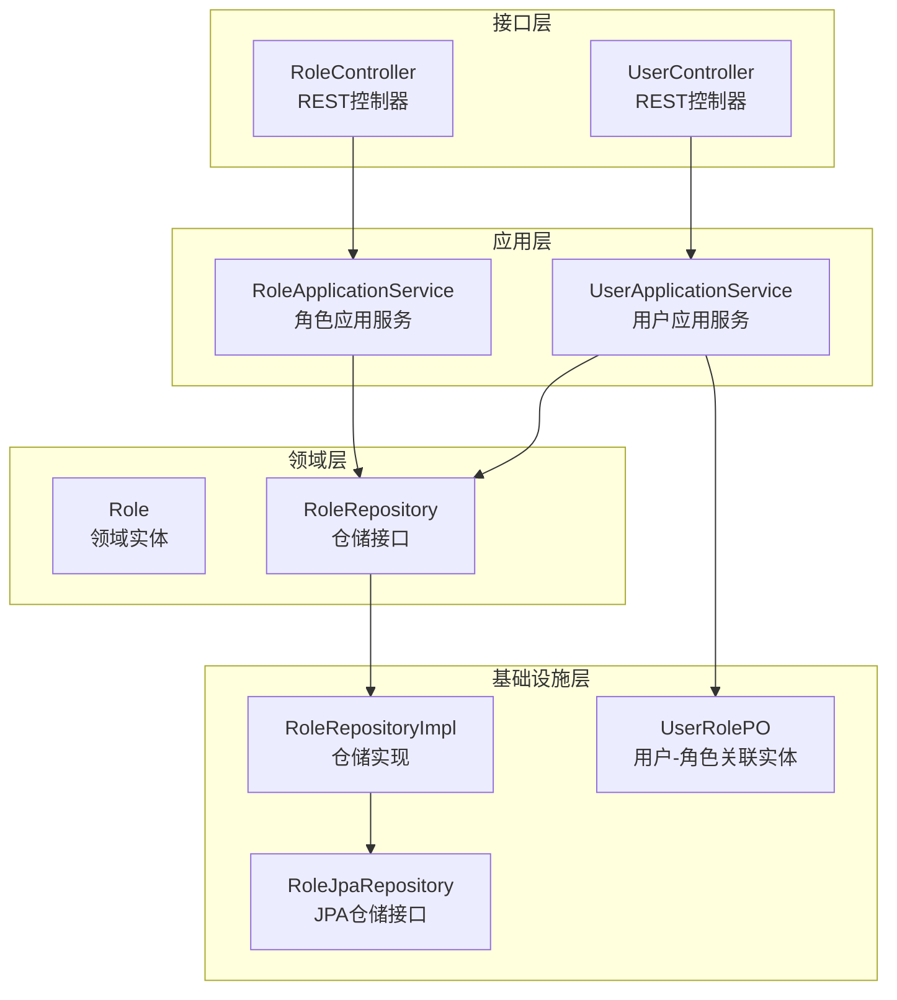
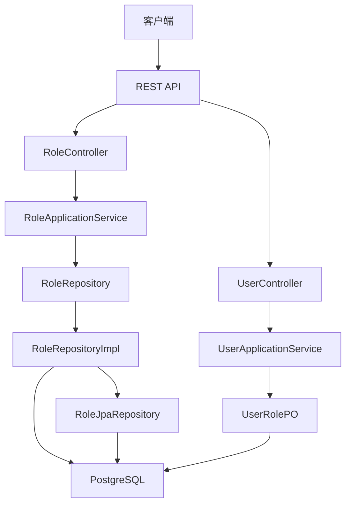
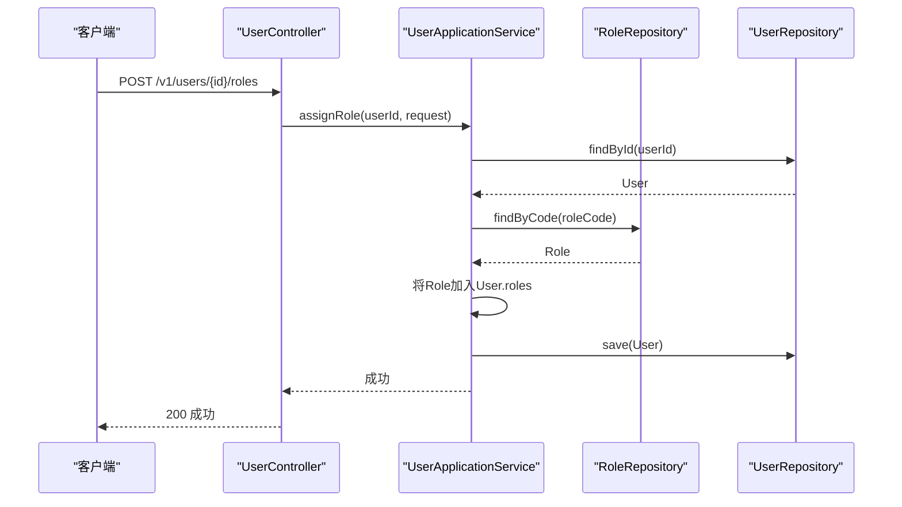
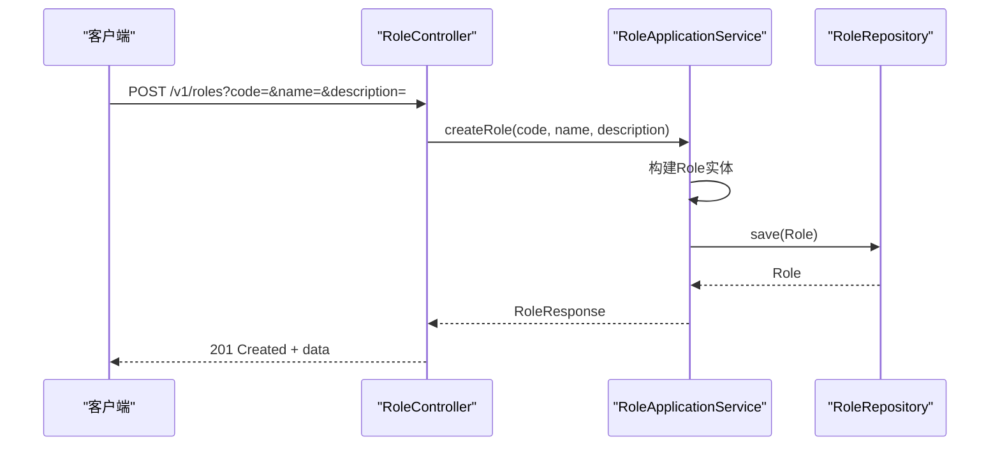
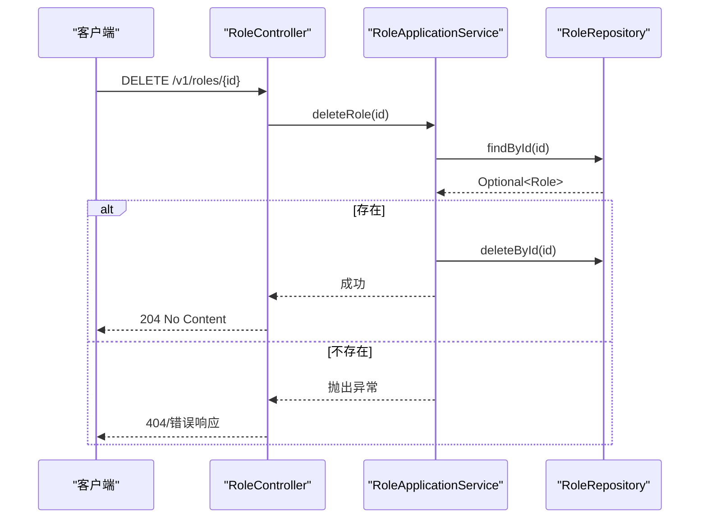
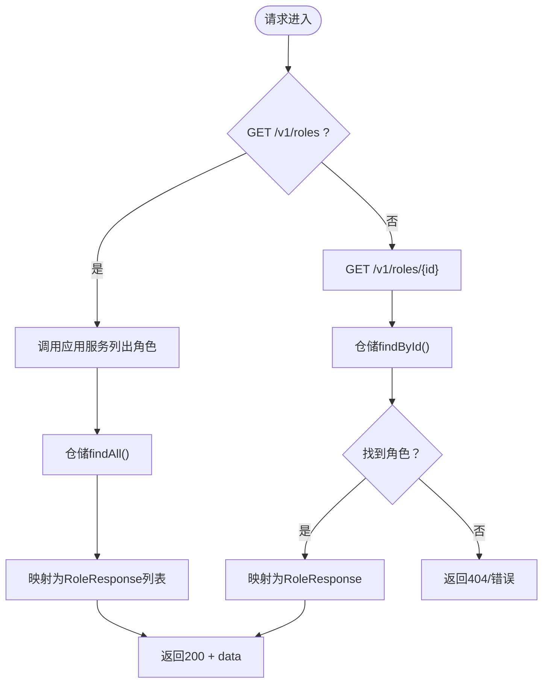
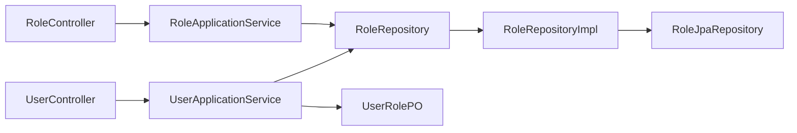

# 角色管理API

<cite>
**本文引用的文件**
- [RoleController.java](file://src/main/java/sso/oidc/interfaces/rest/RoleController.java)
- [RoleApplicationService.java](file://src/main/java/sso/oidc/application/service/RoleApplicationService.java)
- [Role.java](file://src/main/java/sso/oidc/domain/model/entity/Role.java)
- [RoleResponse.java](file://src/main/java/sso/oidc/application/dto/response/RoleResponse.java)
- [RoleRepository.java](file://src/main/java/sso/oidc/domain/repository/RoleRepository.java)
- [RoleJpaRepository.java](file://src/main/java/sso/oidc/infrastructure/persistence/repository/RoleJpaRepository.java)
- [RoleRepositoryImpl.java](file://src/main/java/sso/oidc/infrastructure/persistence/impl/RoleRepositoryImpl.java)
- [UserRolePO.java](file://src/main/java/sso/oidc/infrastructure/persistence/entity/UserRolePO.java)
- [UserController.java](file://src/main/java/sso/oidc/interfaces/rest/UserController.java)
- [UserApplicationService.java](file://src/main/java/sso/oidc/application/service/UserApplicationService.java)
- [AssignRoleRequest.java](file://src/main/java/sso/oidc/application/dto/request/AssignRoleRequest.java)
- [ApiResponse.java](file://src/main/java/sso/oidc/interfaces/rest/common/ApiResponse.java)
- [V1__init_schema.sql](file://src/main/resources/db/migration/V1__init_schema.sql)
- [V2__seed_default_roles.sql](file://src/main/resources/db/migration/V2__seed_default_roles.sql)
- [README.md](file://README.md)
</cite>

## 目录
1. [简介](#简介)
2. [项目结构](#项目结构)
3. [核心组件](#核心组件)
4. [架构总览](#架构总览)
5. [详细组件分析](#详细组件分析)
6. [依赖分析](#依赖分析)
7. [性能考虑](#性能考虑)
8. [故障排除指南](#故障排除指南)
9. [结论](#结论)
10. [附录](#附录)

## 简介
本文件面向角色权限管理API，系统性梳理角色相关的REST接口与RBAC模型实现，涵盖角色创建、查询、删除、用户角色分配等能力，并解释角色权限的层级结构与继承关系、用户角色关系的批量操作、权限验证流程与访问控制机制。读者无需深入技术背景即可理解API的使用方式与数据结构。

## 项目结构
围绕角色管理的核心模块分布于接口层、应用层、领域层与基础设施层，配合数据库迁移脚本完成角色与用户-角色关联表的初始化与默认角色种子数据。

图表来源
- [RoleController.java:21-57](file://src/main/java/sso/oidc/interfaces/rest/RoleController.java#L21-L57)
- [UserController.java:27-89](file://src/main/java/sso/oidc/interfaces/rest/UserController.java#L27-L89)
- [RoleApplicationService.java:14-62](file://src/main/java/sso/oidc/application/service/RoleApplicationService.java#L14-L62)
- [UserApplicationService.java:26-164](file://src/main/java/sso/oidc/application/service/UserApplicationService.java#L26-L164)
- [RoleRepository.java:8-18](file://src/main/java/sso/oidc/domain/repository/RoleRepository.java#L8-L18)
- [RoleRepositoryImpl.java:13-60](file://src/main/java/sso/oidc/infrastructure/persistence/impl/RoleRepositoryImpl.java#L13-L60)
- [RoleJpaRepository.java:8-10](file://src/main/java/sso/oidc/infrastructure/persistence/repository/RoleJpaRepository.java#L8-L10)
- [UserRolePO.java:13-35](file://src/main/java/sso/oidc/infrastructure/persistence/entity/UserRolePO.java#L13-L35)

章节来源
- [README.md:104-139](file://README.md#L104-L139)

## 核心组件
- 角色控制器：提供角色的创建、查询、列表与删除接口，统一返回标准响应格式。
- 角色应用服务：封装角色业务逻辑，负责持久化与领域模型转换。
- 角色仓储：抽象角色的持久化操作，支持按ID与角色编码查询。
- 用户控制器：提供用户角色分配与移除接口，支持按角色编码进行关系维护。
- 用户应用服务：处理用户与角色的关联关系，包含分配与移除操作。
- 数据模型：角色实体与用户-角色关联实体，支撑RBAC模型的数据结构。
- 数据库脚本：初始化角色表、用户表、用户-角色关联表及默认角色种子数据。

章节来源
- [RoleController.java:21-57](file://src/main/java/sso/oidc/interfaces/rest/RoleController.java#L21-L57)
- [RoleApplicationService.java:14-62](file://src/main/java/sso/oidc/application/service/RoleApplicationService.java#L14-L62)
- [RoleRepository.java:8-18](file://src/main/java/sso/oidc/domain/repository/RoleRepository.java#L8-L18)
- [UserController.java:27-89](file://src/main/java/sso/oidc/interfaces/rest/UserController.java#L27-L89)
- [UserApplicationService.java:26-164](file://src/main/java/sso/oidc/application/service/UserApplicationService.java#L26-L164)
- [Role.java:14-21](file://src/main/java/sso/oidc/domain/model/entity/Role.java#L14-L21)
- [UserRolePO.java:13-35](file://src/main/java/sso/oidc/infrastructure/persistence/entity/UserRolePO.java#L13-L35)
- [V1__init_schema.sql:17-78](file://src/main/resources/db/migration/V1__init_schema.sql#L17-L78)
- [V2__seed_default_roles.sql:5-7](file://src/main/resources/db/migration/V2__seed_default_roles.sql#L5-L7)

## 架构总览
角色管理API遵循分层架构，接口层负责HTTP协议与参数解析，应用层承载业务用例，领域层表达核心概念，基础设施层负责数据持久化与外部集成。用户-角色关联通过中间表实现多对多关系，支持角色继承与权限叠加。

图表来源
- [RoleController.java:21-57](file://src/main/java/sso/oidc/interfaces/rest/RoleController.java#L21-L57)
- [UserController.java:27-89](file://src/main/java/sso/oidc/interfaces/rest/UserController.java#L27-L89)
- [RoleApplicationService.java:14-62](file://src/main/java/sso/oidc/application/service/RoleApplicationService.java#L14-L62)
- [UserApplicationService.java:26-164](file://src/main/java/sso/oidc/application/service/UserApplicationService.java#L26-L164)
- [RoleRepositoryImpl.java:13-60](file://src/main/java/sso/oidc/infrastructure/persistence/impl/RoleRepositoryImpl.java#L13-L60)
- [RoleJpaRepository.java:8-10](file://src/main/java/sso/oidc/infrastructure/persistence/repository/RoleJpaRepository.java#L8-L10)
- [UserRolePO.java:13-35](file://src/main/java/sso/oidc/infrastructure/persistence/entity/UserRolePO.java#L13-L35)

## 详细组件分析

### 角色REST接口定义
- GET /v1/roles：获取角色列表
  - 请求参数：无
  - 响应：标准响应包装的角色列表
- POST /v1/roles：创建角色
  - 请求参数：code（角色编码）、name（角色名称）、description（可选描述）
  - 响应：标准响应包装的新建角色
- GET /v1/roles/{id}：根据ID获取角色详情
  - 路径参数：id（角色ID）
  - 响应：标准响应包装的角色详情
- DELETE /v1/roles/{id}：删除角色
  - 路径参数：id（角色ID）
  - 响应：无内容（204）

章节来源
- [RoleController.java:29-56](file://src/main/java/sso/oidc/interfaces/rest/RoleController.java#L29-L56)
- [ApiResponse.java:25-50](file://src/main/java/sso/oidc/interfaces/rest/common/ApiResponse.java#L25-L50)

### 用户角色分配接口
- POST /v1/users/{id}/roles：为用户分配角色
  - 路径参数：id（用户ID）
  - 请求体：AssignRoleRequest（包含roleCode）
  - 响应：标准响应（成功无数据）
- DELETE /v1/users/{id}/roles/{roleCode}：移除用户的角色
  - 路径参数：id（用户ID）、roleCode（角色编码）
  - 响应：标准响应（成功无数据）

章节来源
- [UserController.java:76-88](file://src/main/java/sso/oidc/interfaces/rest/UserController.java#L76-L88)
- [AssignRoleRequest.java:13-16](file://src/main/java/sso/oidc/application/dto/request/AssignRoleRequest.java#L13-L16)

### 角色数据模型与响应结构
- 角色实体包含：id、code、name、description、createdAt、updatedAt
- 角色响应结构与实体一致，用于对外输出
- 用户响应包含：id、username、email、nickname、avatarUrl、enabled、roles（角色编码列表）、createdAt、updatedAt

章节来源
- [Role.java:14-21](file://src/main/java/sso/oidc/domain/model/entity/Role.java#L14-L21)
- [RoleResponse.java:14-21](file://src/main/java/sso/oidc/application/dto/response/RoleResponse.java#L14-L21)
- [UserApplicationService.java:151-163](file://src/main/java/sso/oidc/application/service/UserApplicationService.java#L151-L163)

### 数据库模型与关系
- 角色表（t_role）：主键id、唯一角色编码code、显示名称name、描述description、时间戳created_at/updated_at
- 用户-角色关联表（t_user_role）：联合主键(user_id, role_id)，外键约束分别引用t_user与t_role，支持级联删除
- 默认角色种子：ROLE_USER（普通用户）、ROLE_ADMIN（管理员）

章节来源
- [V1__init_schema.sql:17-78](file://src/main/resources/db/migration/V1__init_schema.sql#L17-L78)
- [V2__seed_default_roles.sql:5-7](file://src/main/resources/db/migration/V2__seed_default_roles.sql#L5-L7)
- [UserRolePO.java:13-35](file://src/main/java/sso/oidc/infrastructure/persistence/entity/UserRolePO.java#L13-L35)

### 角色权限层级与继承
- 角色与用户为多对多关系，通过t_user_role中间表维护
- 权限验证通常以“角色编码”作为权限标识进行匹配；多个角色编码叠加形成用户最终权限集
- 继承关系可通过“角色编码”语义约定实现（例如ADMIN包含USER的所有权限），具体策略由上层业务与鉴权组件决定

章节来源
- [UserRolePO.java:23-29](file://src/main/java/sso/oidc/infrastructure/persistence/entity/UserRolePO.java#L23-L29)
- [UserApplicationService.java:159](file://src/main/java/sso/oidc/application/service/UserApplicationService.java#L159)

### 用户角色分配流程（序列图）

图表来源
- [UserController.java:76-80](file://src/main/java/sso/oidc/interfaces/rest/UserController.java#L76-L80)
- [UserApplicationService.java:127-139](file://src/main/java/sso/oidc/application/service/UserApplicationService.java#L127-L139)
- [RoleRepository.java:13](file://src/main/java/sso/oidc/domain/repository/RoleRepository.java#L13)
- [UserApplicationService.java:129-137](file://src/main/java/sso/oidc/application/service/UserApplicationService.java#L129-L137)

### 角色创建流程（序列图）

图表来源
- [RoleController.java:29-37](file://src/main/java/sso/oidc/interfaces/rest/RoleController.java#L29-L37)
- [RoleApplicationService.java:21-31](file://src/main/java/sso/oidc/application/service/RoleApplicationService.java#L21-L31)
- [RoleRepositoryImpl.java:19-24](file://src/main/java/sso/oidc/infrastructure/persistence/impl/RoleRepositoryImpl.java#L19-L24)

### 删除角色流程（序列图）

图表来源
- [RoleController.java:51-56](file://src/main/java/sso/oidc/interfaces/rest/RoleController.java#L51-L56)
- [RoleApplicationService.java:43-50](file://src/main/java/sso/oidc/application/service/RoleApplicationService.java#L43-L50)
- [RoleRepositoryImpl.java:26-28](file://src/main/java/sso/oidc/infrastructure/persistence/impl/RoleRepositoryImpl.java#L26-L28)

### 角色列表与详情流程（流程图）

图表来源
- [RoleController.java:45-49](file://src/main/java/sso/oidc/interfaces/rest/RoleController.java#L45-L49)
- [RoleApplicationService.java:39-41](file://src/main/java/sso/oidc/application/service/RoleApplicationService.java#L39-L41)
- [RoleApplicationService.java:33-37](file://src/main/java/sso/oidc/application/service/RoleApplicationService.java#L33-L37)

## 依赖分析
- 控制器依赖应用服务：RoleController与UserController分别注入RoleApplicationService与UserApplicationService
- 应用服务依赖仓储接口：RoleApplicationService与UserApplicationService均依赖RoleRepository与UserRepository
- 仓储实现依赖JPA仓库：RoleRepositoryImpl委托RoleJpaRepository完成持久化
- 用户-角色关联实体：UserRolePO通过多对一映射连接User与Role，支撑RBAC关系

图表来源
- [RoleController.java:27](file://src/main/java/sso/oidc/interfaces/rest/RoleController.java#L27)
- [UserController.java:33](file://src/main/java/sso/oidc/interfaces/rest/UserController.java#L33)
- [RoleApplicationService.java:19](file://src/main/java/sso/oidc/application/service/RoleApplicationService.java#L19)
- [UserApplicationService.java:31-34](file://src/main/java/sso/oidc/application/service/UserApplicationService.java#L31-L34)
- [RoleRepositoryImpl.java:17](file://src/main/java/sso/oidc/infrastructure/persistence/impl/RoleRepositoryImpl.java#L17)
- [RoleJpaRepository.java:8](file://src/main/java/sso/oidc/infrastructure/persistence/repository/RoleJpaRepository.java#L8)
- [UserRolePO.java:23-29](file://src/main/java/sso/oidc/infrastructure/persistence/entity/UserRolePO.java#L23-L29)

章节来源
- [RoleController.java:27](file://src/main/java/sso/oidc/interfaces/rest/RoleController.java#L27)
- [UserController.java:33](file://src/main/java/sso/oidc/interfaces/rest/UserController.java#L33)
- [RoleApplicationService.java:19](file://src/main/java/sso/oidc/application/service/RoleApplicationService.java#L19)
- [UserApplicationService.java:31-34](file://src/main/java/sso/oidc/application/service/UserApplicationService.java#L31-L34)
- [RoleRepositoryImpl.java:17](file://src/main/java/sso/oidc/infrastructure/persistence/impl/RoleRepositoryImpl.java#L17)
- [RoleJpaRepository.java:8](file://src/main/java/sso/oidc/infrastructure/persistence/repository/RoleJpaRepository.java#L8)
- [UserRolePO.java:23-29](file://src/main/java/sso/oidc/infrastructure/persistence/entity/UserRolePO.java#L23-L29)

## 性能考虑
- 查询优化：角色列表与用户列表均支持分页参数，建议在大数据量场景下使用分页避免一次性加载过多数据
- 索引策略：角色编码code与用户username/email具备唯一索引，有利于快速查找与去重校验
- 关联查询：用户角色分配涉及多表关联，建议在高并发场景下结合事务边界与锁策略控制一致性
- 缓存建议：对于频繁读取的角色元数据（如默认角色），可在应用层引入轻量缓存减少数据库压力

章节来源
- [V1__init_schema.sql:20-26](file://src/main/resources/db/migration/V1__init_schema.sql#L20-L26)
- [V1__init_schema.sql:42-54](file://src/main/resources/db/migration/V1__init_schema.sql#L42-L54)
- [UserApplicationService.java:127-139](file://src/main/java/sso/oidc/application/service/UserApplicationService.java#L127-L139)

## 故障排除指南
- 角色不存在：删除角色或按ID查询角色时，若未找到对应记录会触发相应异常，检查ID或角色编码是否正确
- 用户不存在：为用户分配角色或移除角色时，若用户不存在会触发异常，检查用户ID
- 角色不存在：分配角色时若角色编码无效会触发异常，检查角色编码是否存在于系统
- 参数校验：创建角色接口要求code与name必填，描述为可选；分配角色接口要求roleCode必填
- 响应格式：所有接口统一返回标准响应结构，包含code、message、data、errors与timestamp字段，便于前端统一处理

章节来源
- [RoleApplicationService.java:34-49](file://src/main/java/sso/oidc/application/service/RoleApplicationService.java#L34-L49)
- [UserApplicationService.java:128-148](file://src/main/java/sso/oidc/application/service/UserApplicationService.java#L128-L148)
- [AssignRoleRequest.java:13-16](file://src/main/java/sso/oidc/application/dto/request/AssignRoleRequest.java#L13-L16)
- [ApiResponse.java:18-50](file://src/main/java/sso/oidc/interfaces/rest/common/ApiResponse.java#L18-L50)

## 结论
本角色管理API以清晰的分层架构实现RBAC模型，提供角色的增删改查与用户角色分配能力。通过角色编码作为权限标识，结合用户-角色多对多关系，可灵活构建权限体系。建议在生产环境中配合鉴权网关或资源服务器进行统一的权限验证与访问控制。

## 附录

### API请求与响应示例（路径引用）
- 创建角色
  - 请求：POST /v1/roles?code={角色编码}&name={角色名称}&description={描述}
  - 响应：201 Created，data为角色详情
  - 参考路径：[RoleController.java:29-37](file://src/main/java/sso/oidc/interfaces/rest/RoleController.java#L29-L37)，[RoleApplicationService.java:21-31](file://src/main/java/sso/oidc/application/service/RoleApplicationService.java#L21-L31)
- 获取角色详情
  - 请求：GET /v1/roles/{id}
  - 响应：200 OK，data为角色详情
  - 参考路径：[RoleController.java:39-43](file://src/main/java/sso/oidc/interfaces/rest/RoleController.java#L39-L43)，[RoleApplicationService.java:33-37](file://src/main/java/sso/oidc/application/service/RoleApplicationService.java#L33-L37)
- 获取角色列表
  - 请求：GET /v1/roles
  - 响应：200 OK，data为角色列表
  - 参考路径：[RoleController.java:45-49](file://src/main/java/sso/oidc/interfaces/rest/RoleController.java#L45-L49)，[RoleApplicationService.java:39-41](file://src/main/java/sso/oidc/application/service/RoleApplicationService.java#L39-L41)
- 删除角色
  - 请求：DELETE /v1/roles/{id}
  - 响应：204 No Content
  - 参考路径：[RoleController.java:51-56](file://src/main/java/sso/oidc/interfaces/rest/RoleController.java#L51-L56)，[RoleApplicationService.java:43-50](file://src/main/java/sso/oidc/application/service/RoleApplicationService.java#L43-L50)
- 为用户分配角色
  - 请求：POST /v1/users/{id}/roles（请求体：roleCode）
  - 响应：200 OK
  - 参考路径：[UserController.java:76-80](file://src/main/java/sso/oidc/interfaces/rest/UserController.java#L76-L80)，[UserApplicationService.java:127-139](file://src/main/java/sso/oidc/application/service/UserApplicationService.java#L127-L139)
- 移除用户角色
  - 请求：DELETE /v1/users/{id}/roles/{roleCode}
  - 响应：200 OK
  - 参考路径：[UserController.java:83-87](file://src/main/java/sso/oidc/interfaces/rest/UserController.java#L83-L87)，[UserApplicationService.java:141-149](file://src/main/java/sso/oidc/application/service/UserApplicationService.java#L141-L149)

### 角色权限JSON表示与用户角色关系
- 角色JSON结构
  - 字段：id、code、name、description、createdAt、updatedAt
  - 参考路径：[RoleResponse.java:14-21](file://src/main/java/sso/oidc/application/dto/response/RoleResponse.java#L14-L21)
- 用户角色关系
  - 用户响应包含roles字段（字符串数组，元素为角色编码）
  - 参考路径：[UserApplicationService.java:151-163](file://src/main/java/sso/oidc/application/service/UserApplicationService.java#L151-L163)

### RBAC模型在API层面的实现要点
- 权限标识：以角色编码（code）作为权限标识，便于跨系统共享与统一管理
- 访问控制：用户登录后，资源服务器可从JWT中解析角色集合，按角色编码进行授权判断
- 扩展性：新增角色只需创建角色实体并维护用户-角色关联，无需修改鉴权逻辑

章节来源
- [UserApplicationService.java:159](file://src/main/java/sso/oidc/application/service/UserApplicationService.java#L159)
- [README.md:374-387](file://README.md#L374-L387)