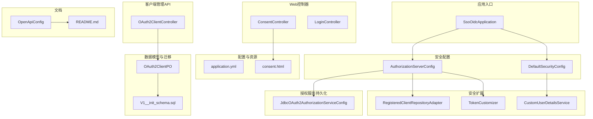
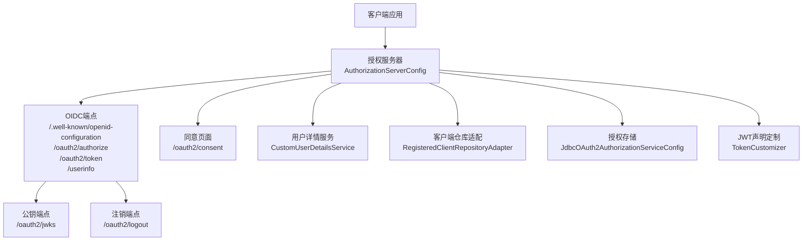
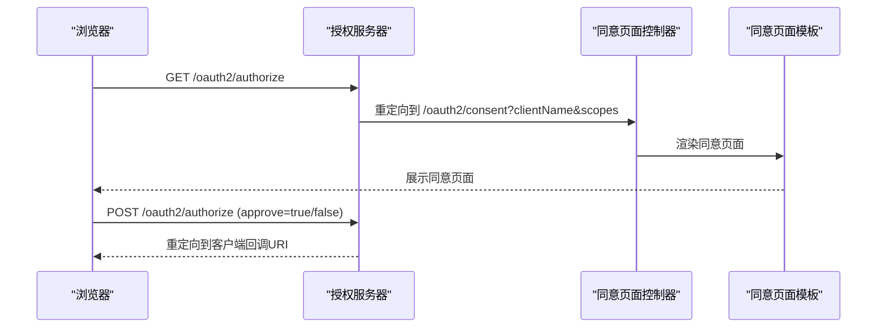
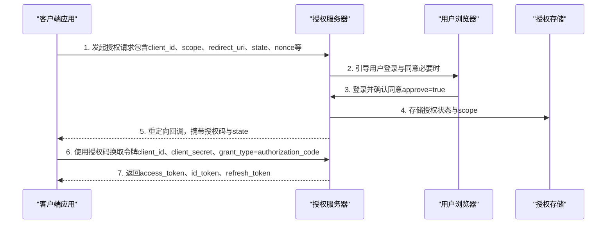
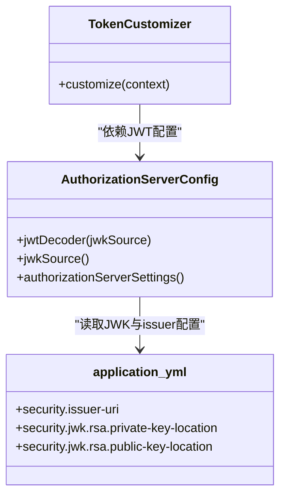
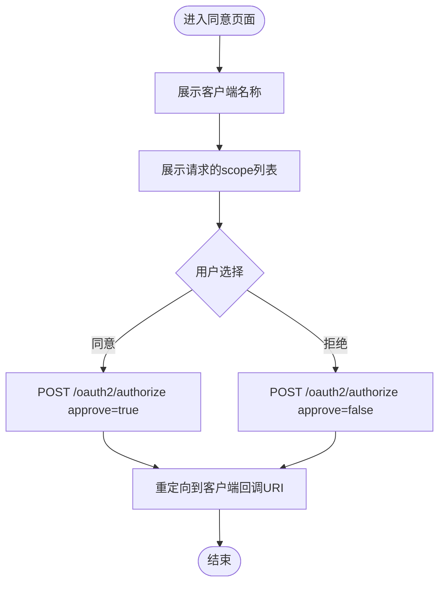
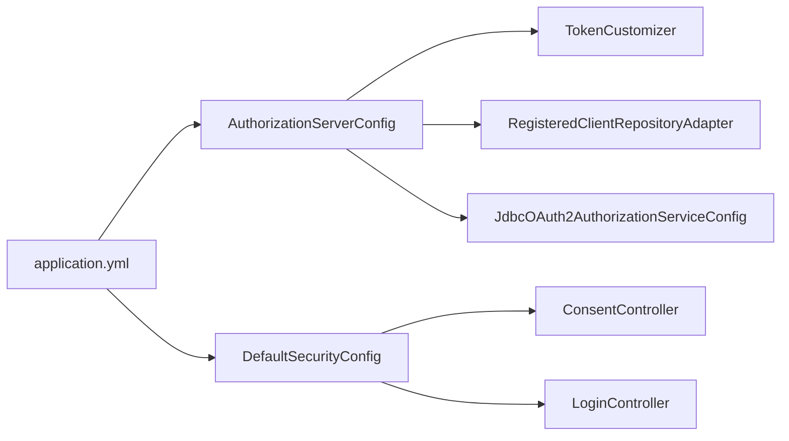

# 认证授权API

<cite>
**本文档引用的文件**
- [SsoOidcApplication.java](file://src/main/java/sso/oidc/SsoOidcApplication.java)
- [AuthorizationServerConfig.java](file://src/main/java/sso/oidc/infrastructure/config/AuthorizationServerConfig.java)
- [DefaultSecurityConfig.java](file://src/main/java/sso/oidc/infrastructure/config/DefaultSecurityConfig.java)
- [ConsentController.java](file://src/main/java/sso/oidc/interfaces/web/ConsentController.java)
- [LoginController.java](file://src/main/java/sso/oidc/interfaces/web/LoginController.java)
- [JdbcOAuth2AuthorizationServiceConfig.java](file://src/main/java/sso/oidc/infrastructure/security/JdbcOAuth2AuthorizationServiceConfig.java)
- [RegisteredClientRepositoryAdapter.java](file://src/main/java/sso/oidc/infrastructure/security/RegisteredClientRepositoryAdapter.java)
- [TokenCustomizer.java](file://src/main/java/sso/oidc/infrastructure/security/TokenCustomizer.java)
- [CustomUserDetailsService.java](file://src/main/java/sso/oidc/infrastructure/security/CustomUserDetailsService.java)
- [consent.html](file://src/main/resources/templates/consent.html)
- [application.yml](file://src/main/resources/application.yml)
- [V1__init_schema.sql](file://src/main/resources/db/migration/V1__init_schema.sql)
- [OAuth2ClientController.java](file://src/main/java/sso/oidc/interfaces/rest/OAuth2ClientController.java)
- [OpenApiConfig.java](file://src/main/java/sso/oidc/infrastructure/config/OpenApiConfig.java)
- [README.md](file://README.md)
</cite>

## 目录
1. [简介](#简介)
2. [项目结构](#项目结构)
3. [核心组件](#核心组件)
4. [架构总览](#架构总览)
5. [详细组件分析](#详细组件分析)
6. [依赖关系分析](#依赖关系分析)
7. [性能考虑](#性能考虑)
8. [故障排除指南](#故障排除指南)
9. [结论](#结论)
10. [附录](#附录)

## 简介
本文件为认证授权系统的API文档，聚焦于OIDC认证相关接口与流程，覆盖以下核心端点：
- GET /.well-known/openid-configuration（OIDC发现端点）
- GET /oauth2/authorize（授权端点）
- POST /oauth2/token（令牌端点）
- GET /userinfo（用户信息端点）
- POST /oauth2/logout（注销端点）
- GET /oauth2/consent（同意页面端点）

同时，文档详细说明OAuth2授权码流程的完整步骤、JWT令牌结构与验证方式、同意页面交互流程（scope参数、用户同意确认与授权范围处理），并提供客户端集成最佳实践与安全注意事项。

## 项目结构
该系统采用Spring Boot + Spring Security OAuth2 Authorization Server实现，核心模块划分如下：
- 应用入口：SsoOidcApplication
- 安全配置：AuthorizationServerConfig（OIDC授权服务器配置）、DefaultSecurityConfig（默认Web安全）
- Web控制器：ConsentController（同意页面）、LoginController（登录页）
- 安全扩展：RegisteredClientRepositoryAdapter（客户端仓库适配）、TokenCustomizer（JWT声明定制）、CustomUserDetailsService（用户详情服务）
- 授权服务持久化：JdbcOAuth2AuthorizationServiceConfig（授权与同意存储）
- 配置与资源：application.yml（应用配置）、consent.html（同意页面模板）
- 数据模型与迁移：OAuth2ClientPO、V1__init_schema.sql（授权服务器表结构）
- 客户端管理API：OAuth2ClientController（REST客户端管理）
- 文档：OpenApiConfig、README.md

图表来源
- [SsoOidcApplication.java:1-13](file://src/main/java/sso/oidc/SsoOidcApplication.java#L1-L13)
- [AuthorizationServerConfig.java:1-142](file://src/main/java/sso/oidc/infrastructure/config/AuthorizationServerConfig.java#L1-L142)
- [DefaultSecurityConfig.java:1-43](file://src/main/java/sso/oidc/infrastructure/config/DefaultSecurityConfig.java#L1-L43)
- [ConsentController.java:1-21](file://src/main/java/sso/oidc/interfaces/web/ConsentController.java#L1-L21)
- [LoginController.java:1-14](file://src/main/java/sso/oidc/interfaces/web/LoginController.java#L1-L14)
- [RegisteredClientRepositoryAdapter.java:1-73](file://src/main/java/sso/oidc/infrastructure/security/RegisteredClientRepositoryAdapter.java#L1-L73)
- [TokenCustomizer.java:1-31](file://src/main/java/sso/oidc/infrastructure/security/TokenCustomizer.java#L1-L31)
- [CustomUserDetailsService.java:1-35](file://src/main/java/sso/oidc/infrastructure/security/CustomUserDetailsService.java#L1-L35)
- [JdbcOAuth2AuthorizationServiceConfig.java:1-29](file://src/main/java/sso/oidc/infrastructure/security/JdbcOAuth2AuthorizationServiceConfig.java#L1-L29)
- [application.yml:1-78](file://src/main/resources/application.yml#L1-L78)
- [consent.html:1-34](file://src/main/resources/templates/consent.html#L1-L34)
- [OAuth2ClientPO.java:1-48](file://src/main/java/sso/oidc/infrastructure/persistence/entity/OAuth2ClientPO.java#L1-L48)
- [V1__init_schema.sql:93-179](file://src/main/resources/db/migration/V1__init_schema.sql#L93-L179)
- [OAuth2ClientController.java:24-74](file://src/main/java/sso/oidc/interfaces/rest/OAuth2ClientController.java#L24-L74)
- [OpenApiConfig.java:1-21](file://src/main/java/sso/oidc/infrastructure/config/OpenApiConfig.java#L1-L21)
- [README.md:349-388](file://README.md#L349-L388)

章节来源
- [SsoOidcApplication.java:1-13](file://src/main/java/sso/oidc/SsoOidcApplication.java#L1-L13)
- [AuthorizationServerConfig.java:1-142](file://src/main/java/sso/oidc/infrastructure/config/AuthorizationServerConfig.java#L1-L142)
- [DefaultSecurityConfig.java:1-43](file://src/main/java/sso/oidc/infrastructure/config/DefaultSecurityConfig.java#L1-L43)
- [application.yml:1-78](file://src/main/resources/application.yml#L1-L78)

## 核心组件
- 授权服务器配置：启用OIDC与默认安全入口点，配置JWT解码器与JWK源，设置发行者URI与客户端注册。
- 默认Web安全：定义登录页、注册页、同意页与静态资源的安全匹配规则，配置表单登录与登出。
- 同意页面控制器：接收客户端名称与scope列表，渲染同意页面模板。
- 用户详情服务：基于领域用户模型构建Spring Security UserDetails，包含角色权限。
- 客户端仓库适配：将领域实体映射为RegisteredClient，支持动态客户端配置与持久化。
- 授权服务持久化：使用JDBC存储授权状态与用户同意记录。
- JWT声明定制：在JWT中注入email、nickname与roles等自定义声明。

章节来源
- [AuthorizationServerConfig.java:43-142](file://src/main/java/sso/oidc/infrastructure/config/AuthorizationServerConfig.java#L43-L142)
- [DefaultSecurityConfig.java:14-43](file://src/main/java/sso/oidc/infrastructure/config/DefaultSecurityConfig.java#L14-L43)
- [ConsentController.java:9-21](file://src/main/java/sso/oidc/interfaces/web/ConsentController.java#L9-L21)
- [CustomUserDetailsService.java:15-35](file://src/main/java/sso/oidc/infrastructure/security/CustomUserDetailsService.java#L15-L35)
- [RegisteredClientRepositoryAdapter.java:16-73](file://src/main/java/sso/oidc/infrastructure/security/RegisteredClientRepositoryAdapter.java#L16-L73)
- [JdbcOAuth2AuthorizationServiceConfig.java:13-29](file://src/main/java/sso/oidc/infrastructure/security/JdbcOAuth2AuthorizationServiceConfig.java#L13-L29)
- [TokenCustomizer.java:12-31](file://src/main/java/sso/oidc/infrastructure/security/TokenCustomizer.java#L12-L31)

## 架构总览
系统以Spring Authorization Server为核心，结合Spring Security与JDBC存储，提供标准OIDC端点与自定义同意页面。JWT由JWK集合签发，客户端可按需启用PKCE与授权同意要求。

图表来源
- [AuthorizationServerConfig.java:50-124](file://src/main/java/sso/oidc/infrastructure/config/AuthorizationServerConfig.java#L50-L124)
- [ConsentController.java:12-19](file://src/main/java/sso/oidc/interfaces/web/ConsentController.java#L12-L19)
- [CustomUserDetailsService.java:21-34](file://src/main/java/sso/oidc/infrastructure/security/CustomUserDetailsService.java#L21-L34)
- [RegisteredClientRepositoryAdapter.java:22-71](file://src/main/java/sso/oidc/infrastructure/security/RegisteredClientRepositoryAdapter.java#L22-L71)
- [JdbcOAuth2AuthorizationServiceConfig.java:16-27](file://src/main/java/sso/oidc/infrastructure/security/JdbcOAuth2AuthorizationServiceConfig.java#L16-L27)
- [TokenCustomizer.java:18-30](file://src/main/java/sso/oidc/infrastructure/security/TokenCustomizer.java#L18-L30)

## 详细组件分析

### OIDC发现端点
- 端点：GET /.well-known/openid-configuration
- 功能：返回OIDC元数据，包含授权端点、令牌端点、用户信息端点、JWKS端点、支持的签名算法等。
- 实现：由Spring Authorization Server自动提供，配置中设置发行者URI。

章节来源
- [AuthorizationServerConfig.java:121-124](file://src/main/java/sso/oidc/infrastructure/config/AuthorizationServerConfig.java#L121-L124)
- [README.md:360-371](file://README.md#L360-L371)

### 授权端点
- 端点：GET /oauth2/authorize
- 功能：处理授权请求，若需要用户同意则重定向至同意页面；否则生成授权码并回调重定向URI。
- 关键行为：
  - 参数校验与PKCE（如启用）处理
  - 用户同意检查（根据客户端配置requireAuthorizationConsent）
  - 授权码生成与存储
  - 回调重定向到客户端指定URI

章节来源
- [AuthorizationServerConfig.java:54-67](file://src/main/java/sso/oidc/infrastructure/config/AuthorizationServerConfig.java#L54-L67)
- [JdbcOAuth2AuthorizationServiceConfig.java:16-20](file://src/main/java/sso/oidc/infrastructure/security/JdbcOAuth2AuthorizationServiceConfig.java#L16-L20)
- [RegisteredClientRepositoryAdapter.java:65-68](file://src/main/java/sso/oidc/infrastructure/security/RegisteredClientRepositoryAdapter.java#L65-L68)

### 令牌端点
- 端点：POST /oauth2/token
- 功能：使用授权码交换访问令牌、ID令牌与刷新令牌；支持客户端认证与PKCE。
- 关键行为：
  - 验证授权码与状态
  - 校验客户端身份与重定向URI
  - 发放JWT与相关令牌
  - 刷新令牌发放与轮换

章节来源
- [AuthorizationServerConfig.java:72-91](file://src/main/java/sso/oidc/infrastructure/config/AuthorizationServerConfig.java#L72-L91)
- [JdbcOAuth2AuthorizationServiceConfig.java:16-20](file://src/main/java/sso/oidc/infrastructure/security/JdbcOAuth2AuthorizationServiceConfig.java#L16-L20)

### 用户信息端点
- 端点：GET /userinfo
- 功能：返回受保护的用户信息，通常用于OIDC用户档案。
- 实现：由Spring Authorization Server提供，配合JWT中的声明。

章节来源
- [AuthorizationServerConfig.java:56-64](file://src/main/java/sso/oidc/infrastructure/config/AuthorizationServerConfig.java#L56-L64)
- [README.md:367](file://README.md#L367)

### 注销端点
- 端点：POST /oauth2/logout
- 功能：使当前会话失效，支持客户端注销后重定向。
- 实现：默认Web安全配置中定义了登出逻辑与成功跳转。

章节来源
- [DefaultSecurityConfig.java:32-33](file://src/main/java/sso/oidc/infrastructure/config/DefaultSecurityConfig.java#L32-L33)

### 同意页面端点
- 端点：GET /oauth2/consent
- 功能：展示授权范围与客户端名称，供用户确认或拒绝。
- 表单提交：POST /oauth2/authorize（approve=true/false），携带client_id等参数。
- 模板：consent.html，渲染scope列表与按钮组。

图表来源
- [ConsentController.java:12-19](file://src/main/java/sso/oidc/interfaces/web/ConsentController.java#L12-L19)
- [consent.html:23-29](file://src/main/resources/templates/consent.html#L23-L29)

章节来源
- [ConsentController.java:9-21](file://src/main/java/sso/oidc/interfaces/web/ConsentController.java#L9-L21)
- [consent.html:1-34](file://src/main/resources/templates/consent.html#L1-L34)

### OAuth2授权码流程

图表来源
- [AuthorizationServerConfig.java:72-91](file://src/main/java/sso/oidc/infrastructure/config/AuthorizationServerConfig.java#L72-L91)
- [JdbcOAuth2AuthorizationServiceConfig.java:16-20](file://src/main/java/sso/oidc/infrastructure/security/JdbcOAuth2AuthorizationServiceConfig.java#L16-L20)

章节来源
- [AuthorizationServerConfig.java:72-91](file://src/main/java/sso/oidc/infrastructure/config/AuthorizationServerConfig.java#L72-L91)
- [JdbcOAuth2AuthorizationServiceConfig.java:16-20](file://src/main/java/sso/oidc/infrastructure/security/JdbcOAuth2AuthorizationServiceConfig.java#L16-L20)

### JWT令牌结构与验证
- 结构：标准JWT（Header.Payload.Signature），Payload包含iss、sub、aud、exp、iat、scope等标准字段及自定义claims（email、nickname、roles）。
- 签名与验证：使用JWK集合（/oauth2/jwks）提供的RSA公钥验证签名。
- 自定义声明：TokenCustomizer在签发时注入email、nickname与roles。
- 配置：AuthorizationServerConfig提供JwtDecoder与JWK源；application.yml定义issuer-uri。

图表来源
- [TokenCustomizer.java:12-31](file://src/main/java/sso/oidc/infrastructure/security/TokenCustomizer.java#L12-L31)
- [AuthorizationServerConfig.java:93-124](file://src/main/java/sso/oidc/infrastructure/config/AuthorizationServerConfig.java#L93-L124)
- [application.yml:48-55](file://src/main/resources/application.yml#L48-L55)

章节来源
- [TokenCustomizer.java:12-31](file://src/main/java/sso/oidc/infrastructure/security/TokenCustomizer.java#L12-L31)
- [AuthorizationServerConfig.java:93-124](file://src/main/java/sso/oidc/infrastructure/config/AuthorizationServerConfig.java#L93-L124)
- [application.yml:48-55](file://src/main/resources/application.yml#L48-L55)

### 同意页面交互流程
- 请求参数：clientName、scopes（逗号分隔）、state（可选）
- 页面展示：显示客户端名称与请求的scope列表
- 用户操作：点击“Approve”或“Deny”，POST提交approve=true/false
- 处理逻辑：授权服务器根据用户选择决定是否发放授权码

图表来源
- [ConsentController.java:12-19](file://src/main/java/sso/oidc/interfaces/web/ConsentController.java#L12-L19)
- [consent.html:16-29](file://src/main/resources/templates/consent.html#L16-L29)

章节来源
- [ConsentController.java:9-21](file://src/main/java/sso/oidc/interfaces/web/ConsentController.java#L9-L21)
- [consent.html:1-34](file://src/main/resources/templates/consent.html#L1-L34)

### 客户端管理API
- 端点：/v1/clients（REST）
- 功能：创建、查询、更新、删除OAuth2客户端，支持轮换客户端密钥
- 安全：与授权服务器配置中的RegisteredClientRepositoryAdapter配合，支持动态客户端配置

章节来源
- [OAuth2ClientController.java:24-74](file://src/main/java/sso/oidc/interfaces/rest/OAuth2ClientController.java#L24-L74)
- [RegisteredClientRepositoryAdapter.java:16-73](file://src/main/java/sso/oidc/infrastructure/security/RegisteredClientRepositoryAdapter.java#L16-L73)

## 依赖关系分析
- 组件耦合：
  - AuthorizationServerConfig与TokenCustomizer、RegisteredClientRepositoryAdapter存在直接依赖
  - DefaultSecurityConfig与ConsentController、LoginController共同构成Web层安全边界
  - JdbcOAuth2AuthorizationServiceConfig为授权与同意提供持久化能力
- 外部依赖：
  - 数据库（PostgreSQL）与Redis（会话存储）
  - JWK密钥对（私钥/公钥PEM文件）
  - Spring Authorization Server与Spring Security

图表来源
- [AuthorizationServerConfig.java:47-91](file://src/main/java/sso/oidc/infrastructure/config/AuthorizationServerConfig.java#L47-L91)
- [TokenCustomizer.java:12-31](file://src/main/java/sso/oidc/infrastructure/security/TokenCustomizer.java#L12-L31)
- [RegisteredClientRepositoryAdapter.java:16-73](file://src/main/java/sso/oidc/infrastructure/security/RegisteredClientRepositoryAdapter.java#L16-L73)
- [JdbcOAuth2AuthorizationServiceConfig.java:13-29](file://src/main/java/sso/oidc/infrastructure/security/JdbcOAuth2AuthorizationServiceConfig.java#L13-L29)
- [DefaultSecurityConfig.java:19-36](file://src/main/java/sso/oidc/infrastructure/config/DefaultSecurityConfig.java#L19-L36)
- [ConsentController.java:9-21](file://src/main/java/sso/oidc/interfaces/web/ConsentController.java#L9-L21)
- [LoginController.java:6-13](file://src/main/java/sso/oidc/interfaces/web/LoginController.java#L6-L13)
- [application.yml:48-55](file://src/main/resources/application.yml#L48-L55)

章节来源
- [AuthorizationServerConfig.java:47-91](file://src/main/java/sso/oidc/infrastructure/config/AuthorizationServerConfig.java#L47-L91)
- [DefaultSecurityConfig.java:19-36](file://src/main/java/sso/oidc/infrastructure/config/DefaultSecurityConfig.java#L19-L36)

## 性能考虑
- 令牌有效期：access_token与refresh_token TTL在客户端配置中定义，建议按需调整以平衡安全性与性能。
- 连接池与超时：数据库连接池参数与Redis配置在application.yml中集中管理。
- 缓存与模板：Thymeleaf缓存关闭便于开发调试，生产环境建议开启缓存。
- 并发与会话：Redis会话存储提升横向扩展能力。

章节来源
- [application.yml:9-46](file://src/main/resources/application.yml#L9-L46)
- [RegisteredClientRepositoryAdapter.java:60-63](file://src/main/java/sso/oidc/infrastructure/security/RegisteredClientRepositoryAdapter.java#L60-L63)

## 故障排除指南
- 未找到用户：CustomUserDetailsService在用户不存在时抛出异常，检查用户名拼写与用户状态。
- 登录失败：确认DefaultSecurityConfig中表单登录配置与登录页路径一致。
- 授权失败：检查客户端配置（redirect_uri、grant_types、requireAuthorizationConsent）与授权存储状态。
- JWT验证失败：核对issuer-uri与JWK公钥位置，确保签名算法与密钥匹配。
- 同意页面问题：确认ConsentController参数传递与consent.html模板渲染正常。

章节来源
- [CustomUserDetailsService.java:21-25](file://src/main/java/sso/oidc/infrastructure/security/CustomUserDetailsService.java#L21-L25)
- [DefaultSecurityConfig.java:23-33](file://src/main/java/sso/oidc/infrastructure/config/DefaultSecurityConfig.java#L23-L33)
- [JdbcOAuth2AuthorizationServiceConfig.java:16-27](file://src/main/java/sso/oidc/infrastructure/security/JdbcOAuth2AuthorizationServiceConfig.java#L16-L27)
- [AuthorizationServerConfig.java:121-124](file://src/main/java/sso/oidc/infrastructure/config/AuthorizationServerConfig.java#L121-L124)
- [ConsentController.java:12-19](file://src/main/java/sso/oidc/interfaces/web/ConsentController.java#L12-L19)
- [consent.html:14-29](file://src/main/resources/templates/consent.html#L14-L29)

## 结论
本系统基于Spring Authorization Server实现了标准OIDC认证流程，提供完整的授权码流程、同意页面、JWT签发与验证、以及客户端管理能力。通过JDBC存储与自定义声明扩展，满足企业级SSO场景需求。建议在生产环境中强化密钥管理、启用HTTPS与PKCE、严格控制scope与客户端配置，并定期审计授权与同意记录。

## 附录

### OIDC端点清单
- 发现端点：/.well-known/openid-configuration
- 授权端点：/oauth2/authorize
- 令牌端点：/oauth2/token
- 用户信息端点：/userinfo
- 公钥端点：/oauth2/jwks
- 注销端点：/oauth2/logout
- 同意页面端点：/oauth2/consent

章节来源
- [README.md:360-371](file://README.md#L360-L371)

### 授权服务器表结构概览
- t_oauth2_client：客户端配置与策略
- t_oauth2_authorization：授权状态与令牌存储
- t_oauth2_authorization_consent：用户授权同意记录

章节来源
- [V1__init_schema.sql:93-179](file://src/main/resources/db/migration/V1__init_schema.sql#L93-L179)