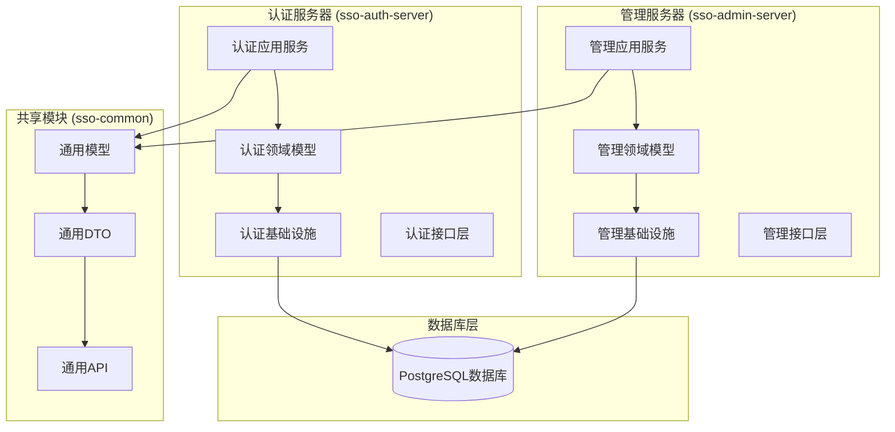
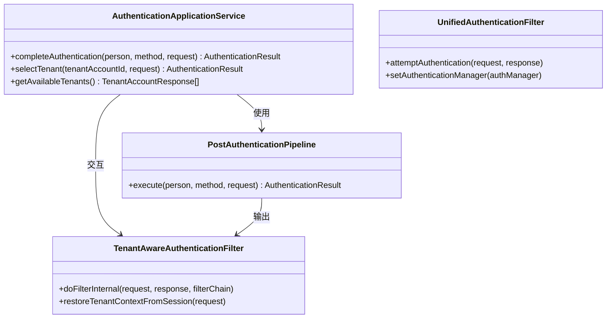
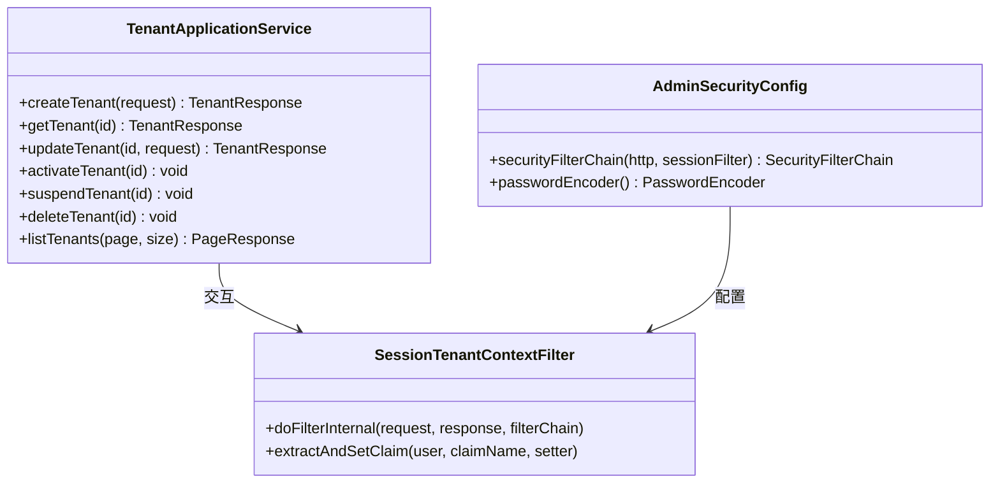
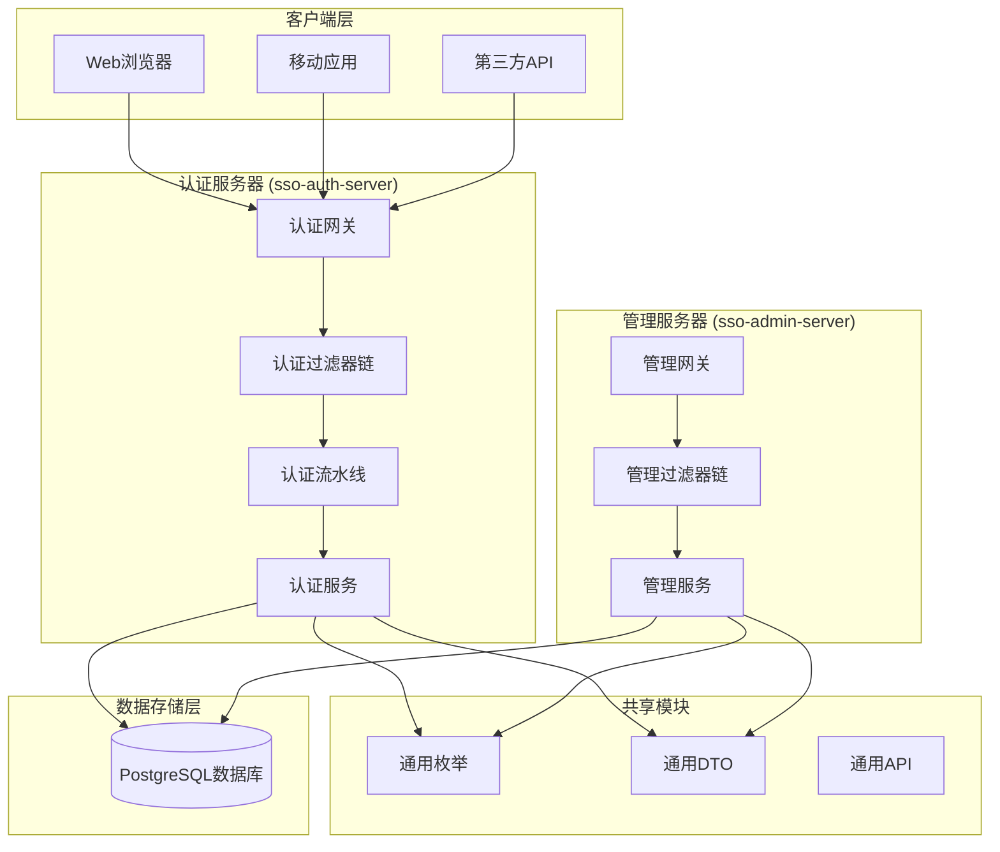
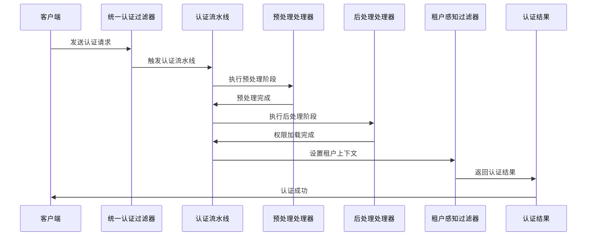
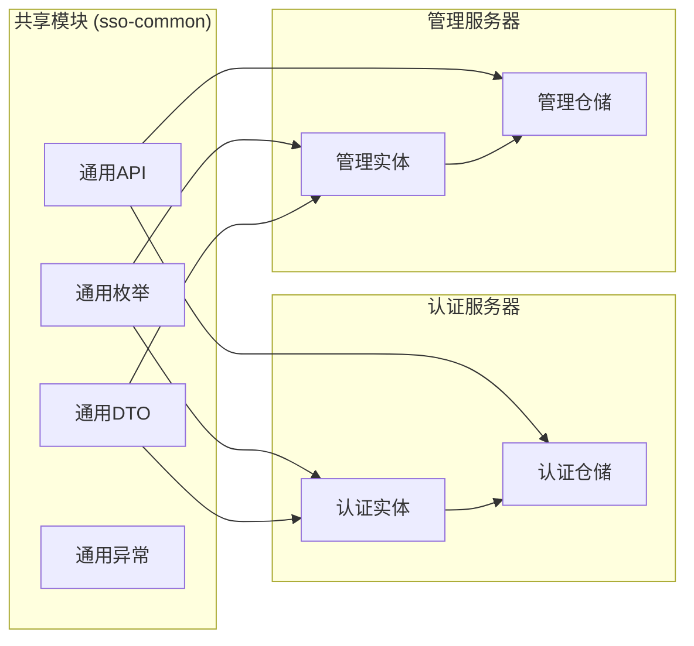
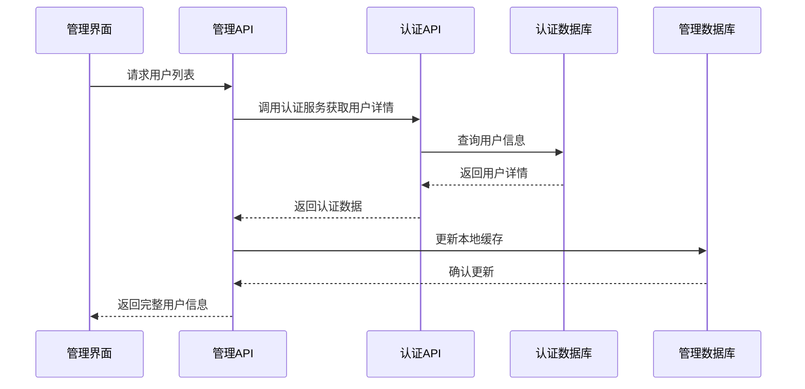
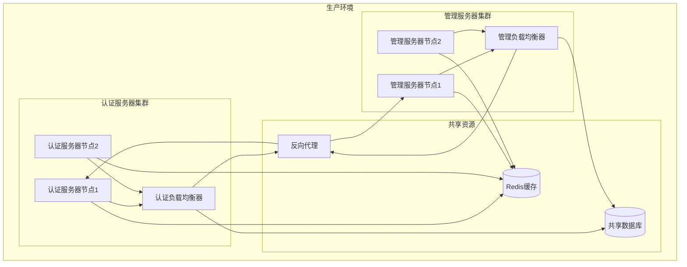

# 多租户架构

<cite>
**本文档引用的文件**
- [SsoAuthServerApplication.java](file://sso-auth-server/src/main/java/sso/oidc/auth/SsoAuthServerApplication.java)
- [SsoAdminServerApplication.java](file://sso-admin-server/src/main/java/sso/oidc/admin/SsoAdminServerApplication.java)
- [Tenant.java](file://sso-auth-server/src/main/java/sso/oidc/auth/domain/model/entity/Tenant.java)
- [Tenant.java](file://sso-admin-server/src/main/java/sso/oidc/admin/domain/model/entity/Tenant.java)
- [TenantAwareAuthenticationFilter.java](file://sso-auth-server/src/main/java/sso/oidc/auth/infrastructure/security/TenantAwareAuthenticationFilter.java)
- [DefaultSecurityConfig.java](file://sso-auth-server/src/main/java/sso/oidc/auth/infrastructure/config/DefaultSecurityConfig.java)
- [SessionTenantContextFilter.java](file://sso-admin-server/src/main/java/sso/oidc/admin/infrastructure/config/SessionTenantContextFilter.java)
- [AdminSecurityConfig.java](file://sso-admin-server/src/main/java/sso/oidc/admin/infrastructure/config/AdminSecurityConfig.java)
- [AuthenticationApplicationService.java](file://sso-auth-server/src/main/java/sso/oidc/auth/application/service/AuthenticationApplicationService.java)
- [TenantApplicationService.java](file://sso-admin-server/src/main/java/sso/oidc/admin/application/service/TenantApplicationService.java)
- [LoginController.java](file://sso-auth-server/src/main/java/sso/oidc/auth/interfaces/web/LoginController.java)
- [TenantController.java](file://sso-admin-server/src/main/java/sso/oidc/admin/interfaces/rest/TenantController.java)
- [TenantStatus.java](file://sso-common/src/main/java/sso/oidc/common/model/enums/TenantStatus.java)
</cite>

## 更新摘要
**所做更改**
- 更新架构概览以反映新的多模块架构
- 新增认证服务器和管理服务器的职责分离说明
- 更新安全过滤器链和租户上下文管理机制
- 新增模块间依赖关系分析
- 更新部署和运维指南

## 目录
1. [简介](#简介)
2. [项目结构](#项目结构)
3. [核心组件](#核心组件)
4. [架构概览](#架构概览)
5. [详细组件分析](#详细组件分析)
6. [模块间协作机制](#模块间协作机制)
7. [部署架构](#部署架构)
8. [性能考虑](#性能考虑)
9. [故障排除指南](#故障排除指南)
10. [结论](#结论)

## 简介

本项目是一个基于Spring Security和OAuth2的多租户单点登录(SSO)系统，采用了全新的多模块架构设计。系统现已拆分为两个独立的服务模块：**sso-auth-server**（认证服务器）和**sso-admin-server**（管理服务器），分别承担认证和管理职责，实现了更清晰的职责分离和更好的可维护性。

新架构的核心特点包括：
- **模块化设计**：认证和管理功能分离，职责清晰
- **统一认证框架**：通过认证服务器提供统一的身份认证服务
- **灵活的租户管理**：管理服务器专注于租户和用户管理
- **增强的安全控制**：每个模块都有独立的安全配置和过滤器链
- **可扩展的架构**：支持未来添加更多认证协议和管理功能

## 项目结构

项目现已重构为多模块Maven项目，采用清晰的模块划分：

**图表来源**
- [SsoAuthServerApplication.java:1-17](file://sso-auth-server/src/main/java/sso/oidc/auth/SsoAuthServerApplication.java#L1-L17)
- [SsoAdminServerApplication.java:1-17](file://sso-admin-server/src/main/java/sso/oidc/admin/SsoAdminServerApplication.java#L1-L17)

**章节来源**
- [SsoAuthServerApplication.java:1-17](file://sso-auth-server/src/main/java/sso/oidc/auth/SsoAuthServerApplication.java#L1-L17)
- [SsoAdminServerApplication.java:1-17](file://sso-admin-server/src/main/java/sso/oidc/admin/SsoAdminServerApplication.java#L1-L17)

## 核心组件

### 认证服务器组件

认证服务器专注于提供统一的身份认证服务，包含以下核心组件：

**图表来源**
- [AuthenticationApplicationService.java:1-139](file://sso-auth-server/src/main/java/sso/oidc/auth/application/service/AuthenticationApplicationService.java#L1-L139)
- [TenantAwareAuthenticationFilter.java:1-68](file://sso-auth-server/src/main/java/sso/oidc/auth/infrastructure/security/TenantAwareAuthenticationFilter.java#L1-L68)

### 管理服务器组件

管理服务器专注于租户和用户管理，包含以下核心组件：

**图表来源**
- [TenantApplicationService.java:1-130](file://sso-admin-server/src/main/java/sso/oidc/admin/application/service/TenantApplicationService.java#L1-L130)
- [SessionTenantContextFilter.java:1-57](file://sso-admin-server/src/main/java/sso/oidc/admin/infrastructure/config/SessionTenantContextFilter.java#L1-L57)

**章节来源**
- [AuthenticationApplicationService.java:1-139](file://sso-auth-server/src/main/java/sso/oidc/auth/application/service/AuthenticationApplicationService.java#L1-L139)
- [TenantApplicationService.java:1-130](file://sso-admin-server/src/main/java/sso/oidc/admin/application/service/TenantApplicationService.java#L1-L130)

## 架构概览

系统采用全新的多模块架构，实现了认证和管理功能的完全分离：

**图表来源**
- [DefaultSecurityConfig.java:1-96](file://sso-auth-server/src/main/java/sso/oidc/auth/infrastructure/config/DefaultSecurityConfig.java#L1-L96)
- [AdminSecurityConfig.java:1-37](file://sso-admin-server/src/main/java/sso/oidc/admin/infrastructure/config/AdminSecurityConfig.java#L1-L37)

### 安全过滤器链对比

**认证服务器安全配置**：
- 统一认证过滤器替代Spring内置表单登录
- 简化的租户感知过滤器仅恢复会话上下文
- 支持多种认证策略（密码、LDAP、OAuth2等）

**管理服务器安全配置**：
- 基于OAuth2的管理员认证
- 从OAuth2会话声明中提取租户上下文
- 独立的密码编码器配置

**章节来源**
- [DefaultSecurityConfig.java:1-96](file://sso-auth-server/src/main/java/sso/oidc/auth/infrastructure/config/DefaultSecurityConfig.java#L1-L96)
- [AdminSecurityConfig.java:1-37](file://sso-admin-server/src/main/java/sso/oidc/admin/infrastructure/config/AdminSecurityConfig.java#L1-L37)

## 详细组件分析

### 认证流水线组件

认证服务器引入了全新的认证流水线架构，将复杂的认证逻辑分解为多个处理阶段：

**图表来源**
- [AuthenticationApplicationService.java:42-45](file://sso-auth-server/src/main/java/sso/oidc/auth/application/service/AuthenticationApplicationService.java#L42-L45)

### 租户上下文管理

新架构中，租户上下文管理在两个服务器中采用不同的策略：

**认证服务器策略**：
- 登录后将租户ID和账户ID存储到会话中
- 后续请求通过租户感知过滤器恢复上下文
- 支持多租户账户切换

**管理服务器策略**：
- 从OAuth2会话声明中直接提取租户上下文
- 无需额外的会话存储机制
- 更简洁的上下文管理流程

**章节来源**
- [TenantAwareAuthenticationFilter.java:49-66](file://sso-auth-server/src/main/java/sso/oidc/auth/infrastructure/security/TenantAwareAuthenticationFilter.java#L49-L66)
- [SessionTenantContextFilter.java:28-36](file://sso-admin-server/src/main/java/sso/oidc/admin/infrastructure/config/SessionTenantContextFilter.java#L28-L36)

### 控制器层重构

两个服务器的控制器层都进行了相应的重构以适应新的架构：

**认证服务器控制器**：
- LoginController：处理登录页面和租户识别
- TenantSelectionController：处理多租户账户选择
- AuthenticationController：处理认证相关的API

**管理服务器控制器**：
- TenantController：租户管理API
- PersonController：人员管理API
- RoleController：角色管理API
- OrganizationController：组织架构管理API

**章节来源**
- [LoginController.java:1-58](file://sso-auth-server/src/main/java/sso/oidc/auth/interfaces/web/LoginController.java#L1-L58)
- [TenantController.java:1-90](file://sso-admin-server/src/main/java/sso/oidc/admin/interfaces/rest/TenantController.java#L1-L90)

## 模块间协作机制

### 数据共享机制

两个模块通过共享的sso-common模块进行数据交换：

**图表来源**
- [TenantStatus.java:1-6](file://sso-common/src/main/java/sso/oidc/common/model/enums/TenantStatus.java#L1-L6)

### API调用机制

管理服务器可以通过内部API调用认证服务器的功能：

**章节来源**
- [TenantStatus.java:1-6](file://sso-common/src/main/java/sso/oidc/common/model/enums/TenantStatus.java#L1-L6)

## 部署架构

### 独立部署策略

新架构支持独立部署认证服务器和管理服务器：

### 配置管理

每个模块都有独立的配置文件：

**认证服务器配置**：
- application.yml：认证相关的配置
- application-dev.yml：开发环境配置
- keys/：密钥文件存储

**管理服务器配置**：
- application.yml：管理相关的配置
- application-dev.yml：开发环境配置
- db/migration/：数据库迁移脚本

**章节来源**
- [SsoAuthServerApplication.java:8-10](file://sso-auth-server/src/main/java/sso/oidc/auth/SsoAuthServerApplication.java#L8-L10)
- [SsoAdminServerApplication.java:8-10](file://sso-admin-server/src/main/java/sso/oidc/admin/SsoAdminServerApplication.java#L8-L10)

## 性能考虑

### 缓存策略优化

新架构中的缓存策略更加精细化：

**认证服务器缓存**：
- 用户权限缓存（短期缓存）
- 租户配置缓存
- 认证会话缓存

**管理服务器缓存**：
- 租户元数据缓存
- 用户统计缓存
- 系统配置缓存

### 数据库优化

两个服务器可以独立优化数据库配置：

**认证服务器优化**：
- 高频查询的索引优化
- 连接池大小调整
- 读写分离配置

**管理服务器优化**：
- 复杂报表查询优化
- 分页查询优化
- 历史数据归档策略

### 微服务监控

新架构支持更精细的监控：

**独立指标收集**：
- 认证成功率和失败率
- 管理操作频率
- 用户活跃度统计

**告警机制**：
- 认证服务器异常告警
- 管理服务器操作审计
- 性能瓶颈预警

## 故障排除指南

### 模块间通信问题

**认证服务器无法访问管理数据**
1. 检查共享模块依赖配置
2. 验证数据库连接配置
3. 确认API调用权限设置

**管理服务器认证失败**
1. 检查认证服务器可用性
2. 验证OAuth2配置
3. 确认会话存储配置

### 部署相关问题

**模块启动失败**
1. 检查端口占用情况
2. 验证数据库连接
3. 确认配置文件完整性

**负载均衡问题**
1. 检查健康检查配置
2. 验证会话粘性设置
3. 确认SSL证书配置

**章节来源**
- [DefaultSecurityConfig.java:36-64](file://sso-auth-server/src/main/java/sso/oidc/auth/infrastructure/config/DefaultSecurityConfig.java#L36-L64)
- [AdminSecurityConfig.java:16-30](file://sso-admin-server/src/main/java/sso/oidc/admin/infrastructure/config/AdminSecurityConfig.java#L16-L30)

## 结论

新的多模块架构设计显著提升了系统的可维护性和可扩展性。通过将认证和管理功能分离，系统实现了更清晰的职责划分和更好的技术债务控制。

### 主要优势

1. **职责分离**：认证和管理功能完全独立，便于团队分工
2. **模块化设计**：每个模块都可以独立开发、测试和部署
3. **可扩展性**：支持未来添加更多认证协议和管理功能
4. **性能优化**：两个服务器可以独立优化资源配置
5. **技术栈灵活性**：可以根据模块特点选择最适合的技术方案

### 技术亮点

- **统一认证框架**：通过认证服务器提供一致的认证体验
- **灵活的租户管理**：管理服务器专注于业务管理功能
- **增强的安全控制**：每个模块都有独立的安全配置
- **完善的监控机制**：支持精细化的性能监控和告警
- **标准化的数据交换**：通过共享模块实现规范化的数据传输

该架构为未来的功能扩展和技术演进奠定了坚实的基础，能够更好地满足企业级多租户应用的各种需求和挑战。