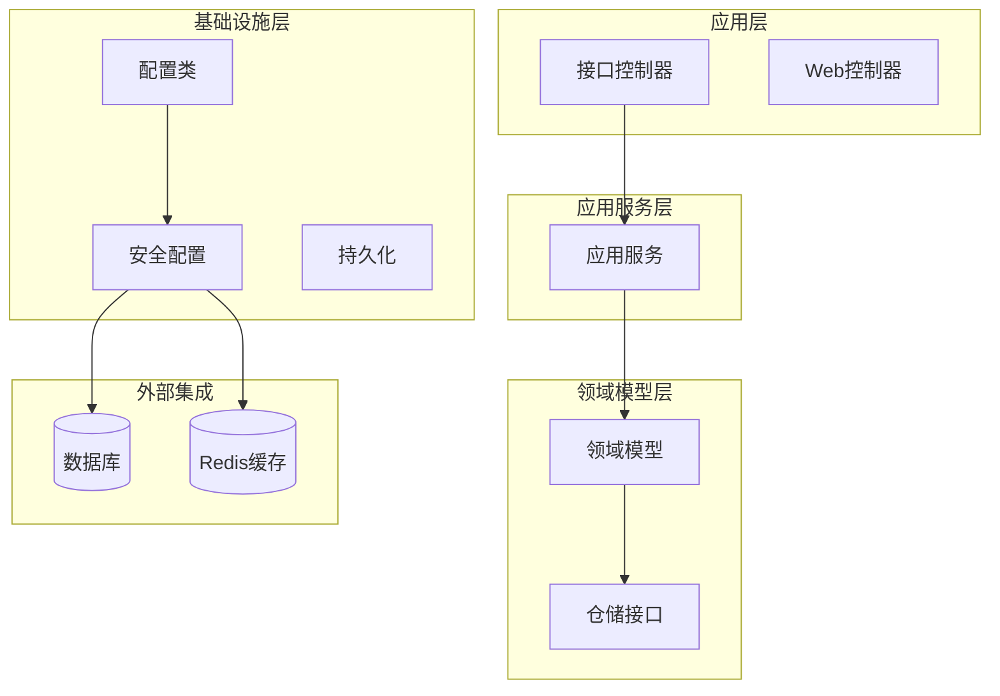
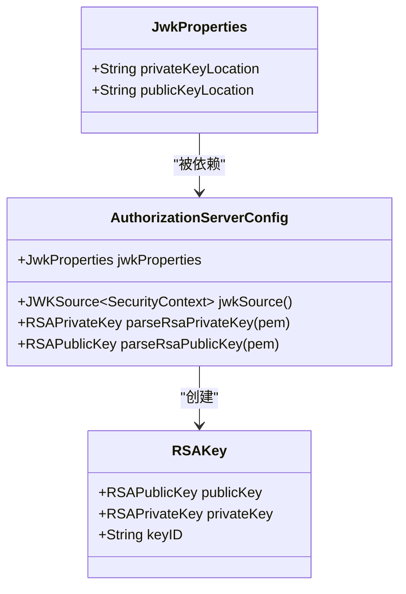
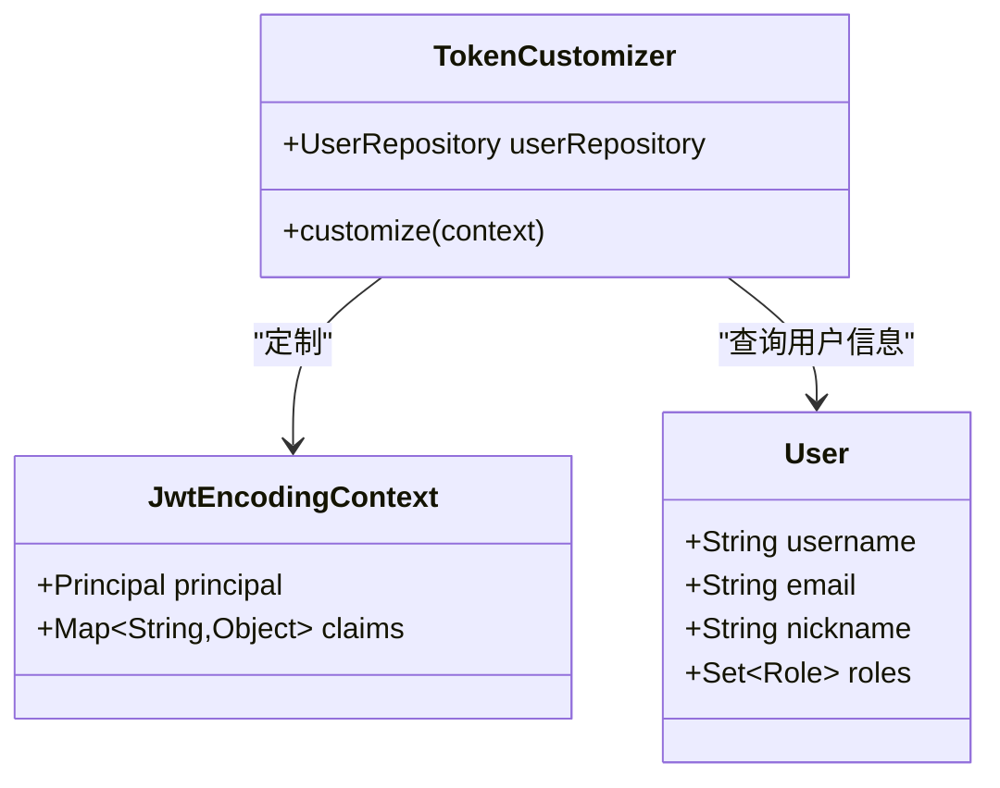
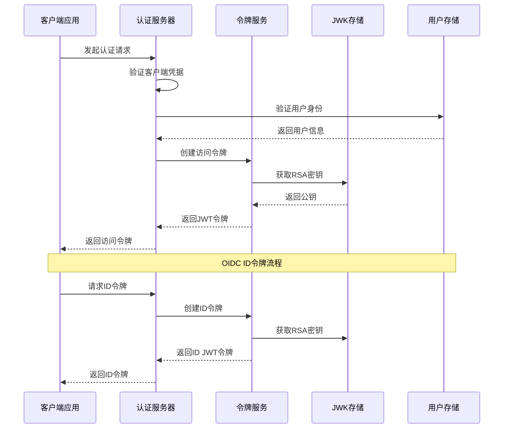
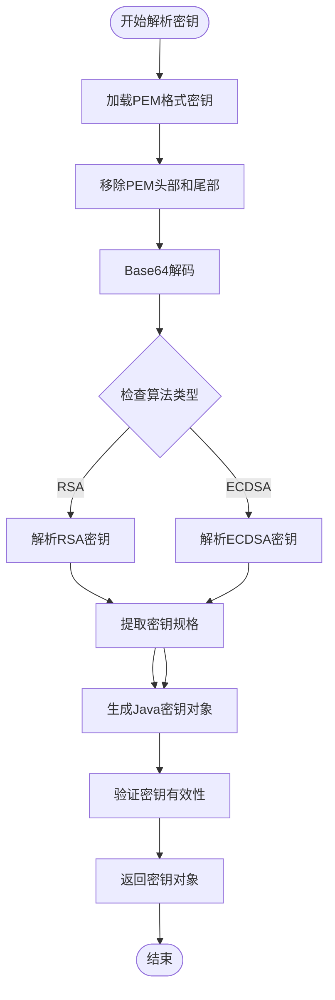
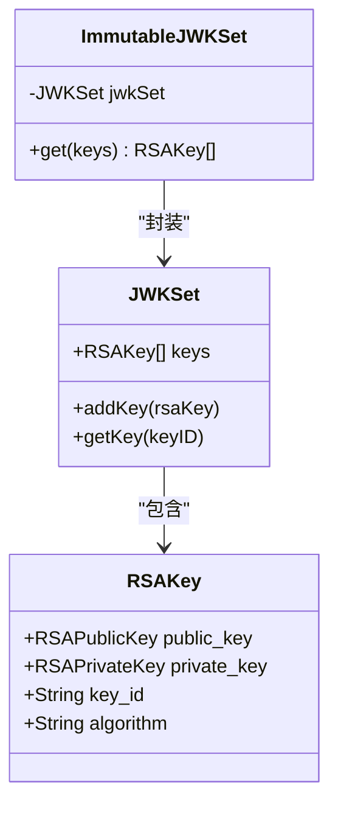
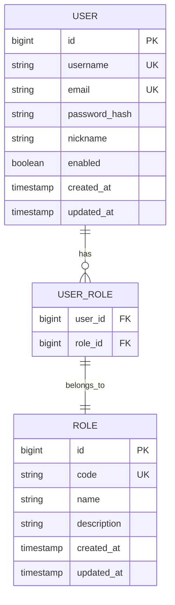
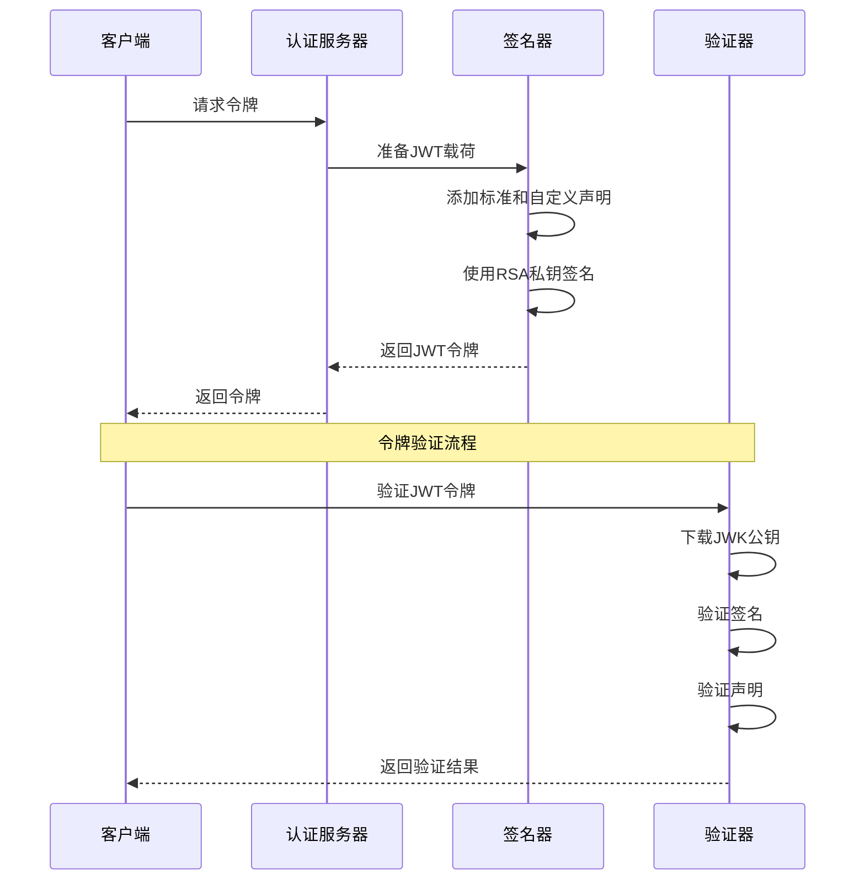
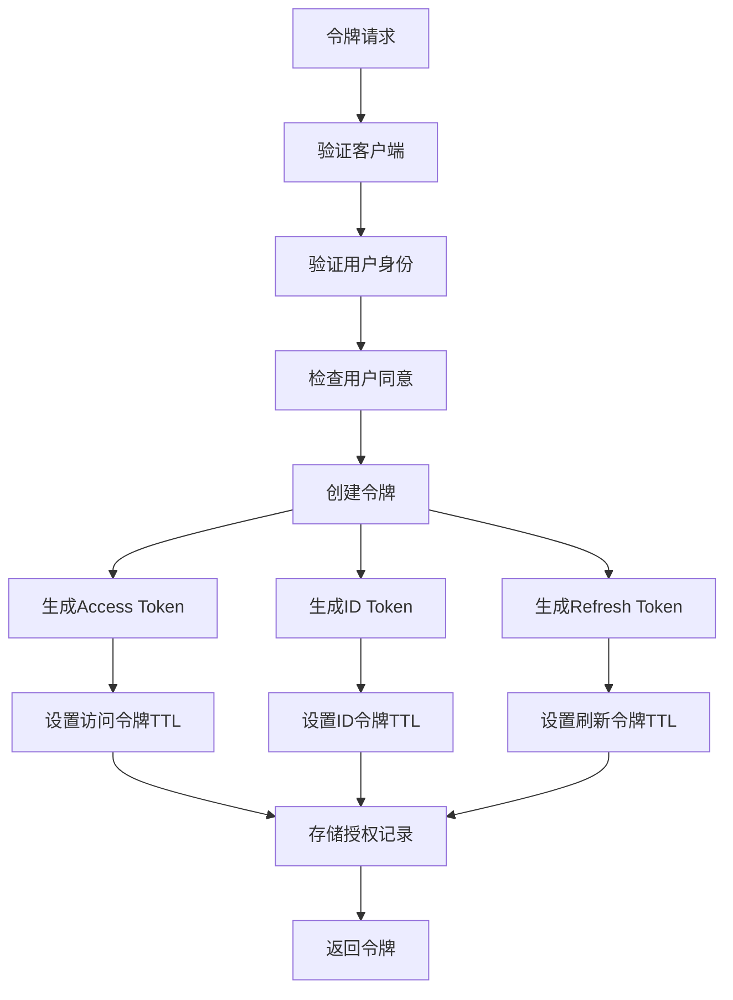
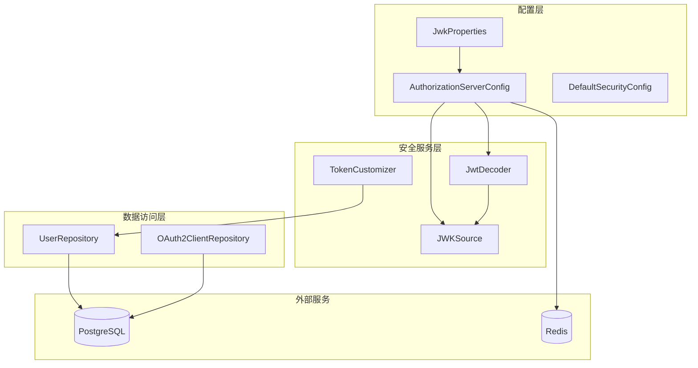

# JWT令牌配置

<cite>
**本文档引用的文件**
- [AuthorizationServerConfig.java](file://src/main/java/sso/oidc/infrastructure/config/AuthorizationServerConfig.java)
- [JwkProperties.java](file://src/main/java/sso/oidc/infrastructure/config/JwkProperties.java)
- [TokenCustomizer.java](file://src/main/java/sso/oidc/infrastructure/security/TokenCustomizer.java)
- [application.yml](file://src/main/resources/application.yml)
- [V1__init_schema.sql](file://src/main/resources/db/migration/V1__init_schema.sql)
- [OAuth2ClientController.java](file://src/main/java/sso/oidc/interfaces/rest/OAuth2ClientController.java)
- [DefaultSecurityConfig.java](file://src/main/java/sso/oidc/infrastructure/config/DefaultSecurityConfig.java)
- [SsoOidcApplication.java](file://src/main/java/sso/oidc/SsoOidcApplication.java)
</cite>

## 目录
1. [简介](#简介)
2. [项目结构](#项目结构)
3. [核心组件](#核心组件)
4. [架构概览](#架构概览)
5. [详细组件分析](#详细组件分析)
6. [依赖关系分析](#依赖关系分析)
7. [性能考虑](#性能考虑)
8. [故障排除指南](#故障排除指南)
9. [结论](#结论)

## 简介

本文件为IAM Platform认证服务的JWT令牌配置文档，基于实际代码库实现进行深入分析。该系统采用Spring Authorization Server框架，实现了完整的OAuth2/OIDC认证授权流程，重点涵盖JWT令牌的配置、JWK密钥管理、令牌声明定制以及安全最佳实践。

## 项目结构

项目采用分层架构设计，主要包含以下层次：

**图表来源**
- [SsoOidcApplication.java:1-13](file://src/main/java/sso/oidc/SsoOidcApplication.java#L1-L13)
- [AuthorizationServerConfig.java:1-142](file://src/main/java/sso/oidc/infrastructure/config/AuthorizationServerConfig.java#L1-L142)

**章节来源**
- [SsoOidcApplication.java:1-13](file://src/main/java/sso/oidc/SsoOidcApplication.java#L1-L13)
- [DefaultSecurityConfig.java:1-43](file://src/main/java/sso/oidc/infrastructure/config/DefaultSecurityConfig.java#L1-L43)

## 核心组件

### JWK密钥配置

系统通过JwkProperties类管理RSA密钥配置，支持私钥和公钥的独立配置：

**图表来源**
- [JwkProperties.java:1-16](file://src/main/java/sso/oidc/infrastructure/config/JwkProperties.java#L1-L16)
- [AuthorizationServerConfig.java:93-140](file://src/main/java/sso/oidc/infrastructure/config/AuthorizationServerConfig.java#L93-L140)

### 令牌定制器

TokenCustomizer负责向JWT令牌添加自定义声明：

**图表来源**
- [TokenCustomizer.java:1-32](file://src/main/java/sso/oidc/infrastructure/security/TokenCustomizer.java#L1-L32)

**章节来源**
- [JwkProperties.java:1-16](file://src/main/java/sso/oidc/infrastructure/config/JwkProperties.java#L1-L16)
- [AuthorizationServerConfig.java:93-140](file://src/main/java/sso/oidc/infrastructure/config/AuthorizationServerConfig.java#L93-L140)
- [TokenCustomizer.java:1-32](file://src/main/java/sso/oidc/infrastructure/security/TokenCustomizer.java#L1-L32)

## 架构概览

系统采用Spring Authorization Server实现OIDC认证，整体架构如下：

**图表来源**
- [AuthorizationServerConfig.java:50-67](file://src/main/java/sso/oidc/infrastructure/config/AuthorizationServerConfig.java#L50-L67)
- [AuthorizationServerConfig.java:115-118](file://src/main/java/sso/oidc/infrastructure/config/AuthorizationServerConfig.java#L115-L118)

## 详细组件分析

### JWT配置与密钥管理

#### 密钥生成与配置

系统支持多种密钥长度和算法配置：

| 配置项 | 默认值 | 可选范围 | 说明 |
|--------|--------|----------|------|
| 私钥位置 | classpath:keys/private.pem | 文件路径 | PEM格式私钥文件 |
| 公钥位置 | classpath:keys/public.pem | 文件路径 | PEM格式公钥文件 |
| 密钥算法 | RSA | RSA, ECDSA等 | 数字签名算法 |
| 密钥长度 | 2048位 | 1024-4096位 | RSA密钥长度 |

#### 密钥解析流程

**图表来源**
- [AuthorizationServerConfig.java:126-140](file://src/main/java/sso/oidc/infrastructure/config/AuthorizationServerConfig.java#L126-L140)

#### JWK集配置

系统使用ImmutableJWKSet管理密钥集合：

**图表来源**
- [AuthorizationServerConfig.java:108-113](file://src/main/java/sso/oidc/infrastructure/config/AuthorizationServerConfig.java#L108-L113)

**章节来源**
- [AuthorizationServerConfig.java:93-140](file://src/main/java/sso/oidc/infrastructure/config/AuthorizationServerConfig.java#L93-L140)
- [application.yml:48-55](file://src/main/resources/application.yml#L48-L55)

### 令牌声明配置

#### 标准声明

系统自动包含以下标准OIDC声明：

| 声明名称 | 类型 | 描述 | 示例值 |
|----------|------|------|--------|
| iss | String | 签发者标识 | http://localhost:9000 |
| sub | String | 主题标识 | 用户唯一标识符 |
| aud | String | 接收方 | 客户端ID |
| exp | Number | 过期时间 | Unix时间戳 |
| iat | Number | 签发时间 | Unix时间戳 |
| jti | String | 令牌ID | 唯一随机字符串 |

#### 自定义声明

TokenCustomizer添加以下自定义声明：

**图表来源**
- [TokenCustomizer.java:22-30](file://src/main/java/sso/oidc/infrastructure/security/TokenCustomizer.java#L22-L30)

**章节来源**
- [TokenCustomizer.java:18-30](file://src/main/java/sso/oidc/infrastructure/security/TokenCustomizer.java#L18-L30)

### 令牌类型与配置

#### Access Token配置

系统配置了详细的Access Token生命周期管理：

| 配置项 | 值 | 说明 |
|--------|----|------|
| 令牌类型 | Bearer | 标准OAuth2令牌类型 |
| 有效期 | 1小时 | AccessTokenTimeToLive |
| 刷新间隔 | 24小时 | RefreshTokenTimeToLive |
| 作用域 | openid, profile, email | OIDC标准作用域 |
| 签名算法 | RS256 | RSA-SHA256签名 |

#### ID Token配置

ID Token专门用于用户身份信息传递，包含：

- 标准OIDC声明
- 用户基本信息（用户名、邮箱、昵称）
- 角色权限信息
- 签名验证机制

**章节来源**
- [AuthorizationServerConfig.java:72-91](file://src/main/java/sso/oidc/infrastructure/config/AuthorizationServerConfig.java#L72-L91)
- [V1__init_schema.sql:95-96](file://src/main/resources/db/migration/V1__init_schema.sql#L95-L96)

### 令牌签名与验证

#### 签名流程

**图表来源**
- [AuthorizationServerConfig.java:108-113](file://src/main/java/sso/oidc/infrastructure/config/AuthorizationServerConfig.java#L108-L113)
- [AuthorizationServerConfig.java:115-118](file://src/main/java/sso/oidc/infrastructure/config/AuthorizationServerConfig.java#L115-L118)

#### 验证机制

系统实现多层验证确保令牌安全性：

1. **签名验证**：使用公钥验证RSA签名
2. **声明验证**：检查必需声明的存在性和有效性
3. **时间验证**：验证令牌的生效时间和过期时间
4. **受众验证**：确认令牌是否针对正确的客户端

**章节来源**
- [AuthorizationServerConfig.java:115-118](file://src/main/java/sso/oidc/infrastructure/config/AuthorizationServerConfig.java#L115-L118)

### 生命周期管理

#### 令牌有效期配置

系统在数据库层面定义了令牌的默认有效期：

**图表来源**
- [AuthorizationServerConfig.java:83-85](file://src/main/java/sso/oidc/infrastructure/config/AuthorizationServerConfig.java#L83-L85)
- [V1__init_schema.sql:135-149](file://src/main/resources/db/migration/V1__init_schema.sql#L135-L149)

**章节来源**
- [AuthorizationServerConfig.java:83-85](file://src/main/java/sso/oidc/infrastructure/config/AuthorizationServerConfig.java#L83-L85)
- [V1__init_schema.sql:95-96](file://src/main/resources/db/migration/V1__init_schema.sql#L95-L96)

## 依赖关系分析

系统各组件之间的依赖关系如下：

**图表来源**
- [AuthorizationServerConfig.java:47-48](file://src/main/java/sso/oidc/infrastructure/config/AuthorizationServerConfig.java#L47-L48)
- [TokenCustomizer.java:16](file://src/main/java/sso/oidc/infrastructure/security/TokenCustomizer.java#L16)

**章节来源**
- [AuthorizationServerConfig.java:47-48](file://src/main/java/sso/oidc/infrastructure/config/AuthorizationServerConfig.java#L47-L48)
- [TokenCustomizer.java:16](file://src/main/java/sso/oidc/infrastructure/security/TokenCustomizer.java#L16)

## 性能考虑

### 缓存策略

系统实现了多级缓存优化：

1. **Redis缓存**：用户会话和令牌状态缓存
2. **JWK缓存**：公钥信息缓存减少网络请求
3. **数据库连接池**：优化数据库访问性能

### 并发处理

- 使用线程安全的JWK集合
- 支持高并发令牌签发和验证
- 异步处理非关键操作

## 故障排除指南

### 常见问题及解决方案

#### 密钥相关问题

| 问题症状 | 可能原因 | 解决方案 |
|----------|----------|----------|
| 令牌签名失败 | 私钥格式错误 | 检查PEM格式完整性 |
| 验证失败 | 公钥不匹配 | 确认公私钥成对 |
| 加载失败 | 文件路径错误 | 验证classpath配置 |

#### 配置相关问题

| 问题症状 | 可能原因 | 解决方案 |
|----------|----------|----------|
| 令牌过期过快 | TTL配置不当 | 调整TokenSettings |
| 声明缺失 | TokenCustomizer异常 | 检查用户信息完整性 |
| 客户端认证失败 | 客户端配置错误 | 验证客户端凭据 |

**章节来源**
- [AuthorizationServerConfig.java:126-140](file://src/main/java/sso/oidc/infrastructure/config/AuthorizationServerConfig.java#L126-L140)
- [application.yml:48-55](file://src/main/resources/application.yml#L48-L55)

## 结论

本JWT令牌配置文档基于实际代码实现，涵盖了从密钥管理到令牌验证的完整流程。系统采用Spring Authorization Server框架，提供了生产级别的OAuth2/OIDC认证能力。通过合理的配置和最佳实践，可以构建安全可靠的单点登录认证服务。

关键优势包括：
- 完整的OIDC标准支持
- 灵活的令牌声明定制
- 安全的密钥管理和验证
- 可扩展的架构设计
- 生产环境友好的配置选项

建议在生产环境中重点关注密钥安全管理、令牌生命周期控制和监控告警机制的完善。