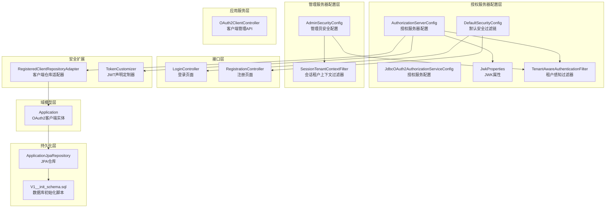
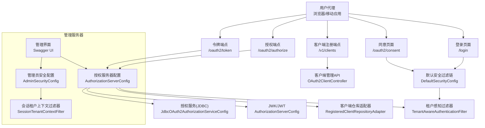
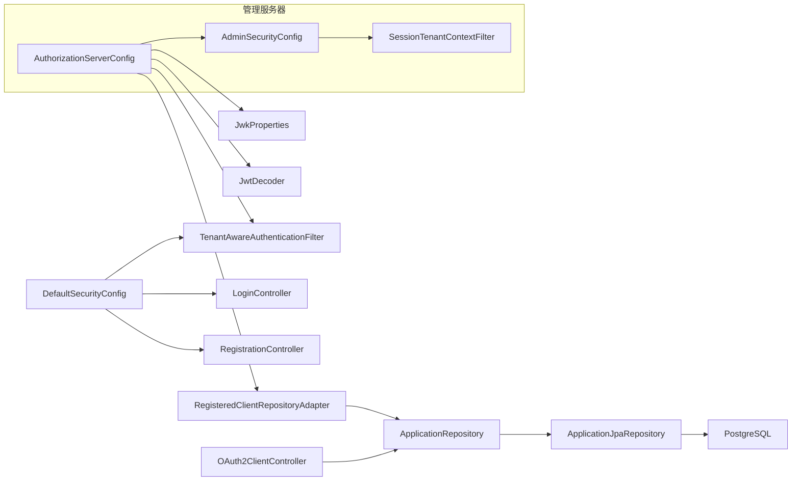

# OAuth2安全配置

<cite>
**本文引用的文件**
- [AuthorizationServerConfig.java](file://sso-auth-server/src/main/java/sso/oidc/auth/infrastructure/config/AuthorizationServerConfig.java)
- [DefaultSecurityConfig.java](file://sso-auth-server/src/main/java/sso/oidc/auth/infrastructure/config/DefaultSecurityConfig.java)
- [AdminSecurityConfig.java](file://sso-admin-server/src/main/java/sso/oidc/admin/infrastructure/config/AdminSecurityConfig.java)
- [JdbcOAuth2AuthorizationServiceConfig.java](file://sso-auth-server/src/main/java/sso/oidc/auth/infrastructure/security/JdbcOAuth2AuthorizationServiceConfig.java)
- [RegisteredClientRepositoryAdapter.java](file://sso-auth-server/src/main/java/sso/oidc/auth/infrastructure/security/RegisteredClientRepositoryAdapter.java)
- [TokenCustomizer.java](file://sso-auth-server/src/main/java/sso/oidc/auth/infrastructure/security/TokenCustomizer.java)
- [TenantAwareAuthenticationFilter.java](file://sso-auth-server/src/main/java/sso/oidc/auth/infrastructure/security/TenantAwareAuthenticationFilter.java)
- [SessionTenantContextFilter.java](file://sso-admin-server/src/main/java/sso/oidc/admin/infrastructure/config/SessionTenantContextFilter.java)
- [OAuth2Client.java](file://sso-auth-server/src/main/java/sso/oidc/auth/domain/model/entity/Application.java)
- [application.yml](file://sso-auth-server/src/main/resources/application.yml)
- [JwkProperties.java](file://sso-auth-server/src/main/java/sso/oidc/auth/infrastructure/config/JwkProperties.java)
- [OAuth2ClientController.java](file://sso-auth-server/src/main/java/sso/oidc/auth/interfaces/rest/OAuth2ClientController.java)
- [CreateOAuth2ClientRequest.java](file://sso-auth-server/src/main/java/sso/oidc/auth/application/dto/request/CreateOAuth2ClientRequest.java)
- [OAuth2ClientJpaRepository.java](file://sso-auth-server/src/main/java/sso/oidc/auth/infrastructure/persistence/repository/ApplicationJpaRepository.java)
- [V1__init_schema.sql](file://sso-auth-server/src/main/resources/db/migration/V1__init_schema.sql)
- [LoginController.java](file://sso-auth-server/src/main/java/sso/oidc/auth/interfaces/web/LoginController.java)
- [RegistrationController.java](file://sso-auth-server/src/main/java/sso/oidc/auth/interfaces/web/RegistrationController.java)
</cite>

## 更新摘要
**所做更改**
- 更新了安全配置架构，从单一DefaultSecurityConfig重构为模块化安全配置
- 新增了sso-admin-server的独立安全配置AdminSecurityConfig
- 重新组织了授权服务器和管理服务器的安全过滤链
- 更新了租户上下文处理机制，区分认证服务器和管理服务器的不同实现

## 目录
1. [简介](#简介)
2. [项目结构](#项目结构)
3. [核心组件](#核心组件)
4. [架构总览](#架构总览)
5. [详细组件分析](#详细组件分析)
6. [依赖分析](#依赖分析)
7. [性能考虑](#性能考虑)
8. [故障排查指南](#故障排查指南)
9. [结论](#结论)
10. [附录](#附录)

## 简介
本文件面向IAM Platform认证服务的OAuth2安全配置，系统性阐述授权服务器的安全设置与最佳实践，覆盖以下主题：
- 授权端点、令牌端点、客户端注册端点的安全保护
- PKCE（Proof Key for Code Exchange）的强制启用与配置
- 客户端认证机制与机密客户端保护、密钥轮换
- 授权范围（Scopes）与作用域控制、权限最小化原则
- 令牌颁发策略：类型选择、生命周期管理、权限继承
- OAuth2攻击防护：授权码劫持、令牌泄露、重放攻击
- 合规性要求与最佳实践

**更新** 项目现已采用模块化安全配置架构，sso-auth-server和sso-admin-server分别拥有独立的安全配置，提供更精细的访问控制和租户上下文管理。

## 项目结构
本项目采用分层架构，围绕Spring Security与Spring Authorization Server构建，现采用模块化安全配置：
- 授权服务器配置：授权服务器配置、默认安全过滤链、JWK与Redis缓存配置
- 管理服务器配置：独立的安全配置，专门处理管理员界面的OAuth2登录
- 域模型层：OAuth2客户端实体与领域模型
- 持久化层：JPA仓库与数据库迁移脚本
- 应用服务层：OAuth2客户端管理API
- 接口层：Web控制器（登录、注册、同意页）与REST API
- 安全扩展：自定义RegisteredClientRepository适配器、JWT声明定制器、租户上下文过滤器

**图表来源**
- [AuthorizationServerConfig.java:1-130](file://sso-auth-server/src/main/java/sso/oidc/auth/infrastructure/config/AuthorizationServerConfig.java#L1-L130)
- [DefaultSecurityConfig.java:1-96](file://sso-auth-server/src/main/java/sso/oidc/auth/infrastructure/config/DefaultSecurityConfig.java#L1-L96)
- [AdminSecurityConfig.java:1-37](file://sso-admin-server/src/main/java/sso/oidc/admin/infrastructure/config/AdminSecurityConfig.java#L1-L37)
- [JdbcOAuth2AuthorizationServiceConfig.java:1-27](file://sso-auth-server/src/main/java/sso/oidc/auth/infrastructure/security/JdbcOAuth2AuthorizationServiceConfig.java#L1-L27)
- [RegisteredClientRepositoryAdapter.java:1-101](file://sso-auth-server/src/main/java/sso/oidc/auth/infrastructure/security/RegisteredClientRepositoryAdapter.java#L1-L101)
- [TokenCustomizer.java:1-127](file://sso-auth-server/src/main/java/sso/oidc/auth/infrastructure/security/TokenCustomizer.java#L1-L127)
- [TenantAwareAuthenticationFilter.java:1-68](file://sso-auth-server/src/main/java/sso/oidc/auth/infrastructure/security/TenantAwareAuthenticationFilter.java#L1-L68)
- [SessionTenantContextFilter.java:1-57](file://sso-admin-server/src/main/java/sso/oidc/admin/infrastructure/config/SessionTenantContextFilter.java#L1-L57)

**章节来源**
- [AuthorizationServerConfig.java:1-130](file://sso-auth-server/src/main/java/sso/oidc/auth/infrastructure/config/AuthorizationServerConfig.java#L1-L130)
- [DefaultSecurityConfig.java:1-96](file://sso-auth-server/src/main/java/sso/oidc/auth/infrastructure/config/DefaultSecurityConfig.java#L1-L96)
- [AdminSecurityConfig.java:1-37](file://sso-admin-server/src/main/java/sso/oidc/admin/infrastructure/config/AdminSecurityConfig.java#L1-L37)
- [JdbcOAuth2AuthorizationServiceConfig.java:1-27](file://sso-auth-server/src/main/java/sso/oidc/auth/infrastructure/security/JdbcOAuth2AuthorizationServiceConfig.java#L1-L27)
- [RegisteredClientRepositoryAdapter.java:1-101](file://sso-auth-server/src/main/java/sso/oidc/auth/infrastructure/security/RegisteredClientRepositoryAdapter.java#L1-L101)
- [TokenCustomizer.java:1-127](file://sso-auth-server/src/main/java/sso/oidc/auth/infrastructure/security/TokenCustomizer.java#L1-L127)
- [TenantAwareAuthenticationFilter.java:1-68](file://sso-auth-server/src/main/java/sso/oidc/auth/infrastructure/security/TenantAwareAuthenticationFilter.java#L1-L68)
- [SessionTenantContextFilter.java:1-57](file://sso-admin-server/src/main/java/sso/oidc/admin/infrastructure/config/SessionTenantContextFilter.java#L1-L57)

## 核心组件
- 授权服务器配置：启用默认安全、OIDC支持、资源服务器JWT解码、入口点与过滤链
- 默认安全过滤链：登录/注册/同意页等公开路径放行，其余请求需认证，集成统一认证过滤器
- 管理员安全配置：专门处理Swagger UI和Actuator端点的OAuth2登录，支持管理员界面访问
- 客户端仓库适配器：将领域模型映射为RegisteredClient，支持PKCE与授权同意强制、令牌TTL
- 授权服务配置：基于JDBC的授权与授权同意存储
- JWT与JWK：RSA密钥加载、JWK集合、JWT解码器
- 租户上下文管理：区分认证服务器和管理服务器的不同租户上下文处理机制
- 客户端管理API：创建、查询、更新、删除、密钥轮换
- 数据模型与持久化：OAuth2客户端表、授权记录表、授权同意表

**更新** 新增了模块化安全配置，授权服务器和管理服务器各自拥有独立的安全过滤链和租户上下文处理机制。

**章节来源**
- [AuthorizationServerConfig.java:44-64](file://sso-auth-server/src/main/java/sso/oidc/auth/infrastructure/config/AuthorizationServerConfig.java#L44-L64)
- [DefaultSecurityConfig.java:36-64](file://sso-auth-server/src/main/java/sso/oidc/auth/infrastructure/config/DefaultSecurityConfig.java#L36-L64)
- [AdminSecurityConfig.java:16-30](file://sso-admin-server/src/main/java/sso/oidc/admin/infrastructure/config/AdminSecurityConfig.java#L16-L30)
- [RegisteredClientRepositoryAdapter.java:47-99](file://sso-auth-server/src/main/java/sso/oidc/auth/infrastructure/security/RegisteredClientRepositoryAdapter.java#L47-L99)
- [JdbcOAuth2AuthorizationServiceConfig.java:15-25](file://sso-auth-server/src/main/java/sso/oidc/auth/infrastructure/security/JdbcOAuth2AuthorizationServiceConfig.java#L15-L25)
- [TokenCustomizer.java:25-61](file://sso-auth-server/src/main/java/sso/oidc/auth/infrastructure/security/TokenCustomizer.java#L25-L61)
- [TenantAwareAuthenticationFilter.java:23-44](file://sso-auth-server/src/main/java/sso/oidc/auth/infrastructure/security/TenantAwareAuthenticationFilter.java#L23-L44)
- [SessionTenantContextFilter.java:22-41](file://sso-admin-server/src/main/java/sso/oidc/admin/infrastructure/config/SessionTenantContextFilter.java#L22-L41)

## 架构总览
下图展示授权服务器、管理服务器、客户端、用户代理与资源服务器之间的交互，以及模块化安全配置如何保护各端点。

**图表来源**
- [AuthorizationServerConfig.java:44-64](file://sso-auth-server/src/main/java/sso/oidc/auth/infrastructure/config/AuthorizationServerConfig.java#L44-L64)
- [DefaultSecurityConfig.java:36-64](file://sso-auth-server/src/main/java/sso/oidc/auth/infrastructure/config/DefaultSecurityConfig.java#L36-L64)
- [AdminSecurityConfig.java:16-30](file://sso-admin-server/src/main/java/sso/oidc/admin/infrastructure/config/AdminSecurityConfig.java#L16-L30)
- [JdbcOAuth2AuthorizationServiceConfig.java:15-25](file://sso-auth-server/src/main/java/sso/oidc/auth/infrastructure/security/JdbcOAuth2AuthorizationServiceConfig.java#L15-L25)
- [RegisteredClientRepositoryAdapter.java:47-99](file://sso-auth-server/src/main/java/sso/oidc/auth/infrastructure/security/RegisteredClientRepositoryAdapter.java#L47-L99)
- [TenantAwareAuthenticationFilter.java:23-44](file://sso-auth-server/src/main/java/sso/oidc/auth/infrastructure/security/TenantAwareAuthenticationFilter.java#L23-L44)
- [SessionTenantContextFilter.java:22-41](file://sso-admin-server/src/main/java/sso/oidc/admin/infrastructure/config/SessionTenantContextFilter.java#L22-L41)

## 详细组件分析

### 授权服务器安全配置
- 默认安全启用：通过授权服务器配置应用默认安全规则，开启OIDC支持，配置HTML登录入口点
- 资源服务器：启用JWT解码器，用于校验访问令牌
- 过滤链顺序：授权服务器过滤链优先级高于默认安全过滤链，确保授权端点与令牌端点受控
- 租户上下文集成：在授权服务器链中添加租户感知过滤器，支持多租户场景

**更新** 授权服务器配置现在具有更高的优先级（@Order(1)），确保OAuth2授权流程的正确执行。

**章节来源**
- [AuthorizationServerConfig.java:44-64](file://sso-auth-server/src/main/java/sso/oidc/auth/infrastructure/config/AuthorizationServerConfig.java#L44-L64)
- [AuthorizationServerConfig.java:95-99](file://sso-auth-server/src/main/java/sso/oidc/auth/infrastructure/config/AuthorizationServerConfig.java#L95-L99)

### 默认安全过滤链与公开端点
- 公开端点：登录、注册、同意页、静态资源、错误页面
- 认证策略：除公开端点外，其余请求均需认证
- 统一认证过滤器：替代传统的表单登录，提供统一的认证处理逻辑
- 登录流程：OAuth2登录与统一认证过滤器协同工作

**更新** 默认安全过滤链现在使用统一认证过滤器替代传统的表单登录，提供更灵活的认证处理。

**章节来源**
- [DefaultSecurityConfig.java:36-64](file://sso-auth-server/src/main/java/sso/oidc/auth/infrastructure/config/DefaultSecurityConfig.java#L36-L64)
- [DefaultSecurityConfig.java:66-80](file://sso-auth-server/src/main/java/sso/oidc/auth/infrastructure/config/DefaultSecurityConfig.java#L66-L80)
- [LoginController.java:1-14](file://sso-auth-server/src/main/java/sso/oidc/auth/interfaces/web/LoginController.java#L1-L14)
- [RegistrationController.java:1-43](file://sso-auth-server/src/main/java/sso/oidc/auth/interfaces/web/RegistrationController.java#L1-L43)

### 管理员安全配置
- 独立过滤链：专门为管理界面提供安全配置
- 端点放行：健康检查、API文档、错误页面无需认证
- OAuth2登录：配置默认成功URL为Swagger UI
- CSRF配置：忽略特定API端点的CSRF保护
- 租户上下文：使用会话租户上下文过滤器处理管理员的多租户访问

**新增** 管理服务器现在拥有独立的安全配置，专门处理管理员界面的访问控制和租户上下文管理。

**章节来源**
- [AdminSecurityConfig.java:16-30](file://sso-admin-server/src/main/java/sso/oidc/admin/infrastructure/config/AdminSecurityConfig.java#L16-L30)
- [SessionTenantContextFilter.java:22-41](file://sso-admin-server/src/main/java/sso/oidc/admin/infrastructure/config/SessionTenantContextFilter.java#L22-L41)

### 租户上下文管理
- 认证服务器租户过滤器：简化版本，仅从会话恢复租户上下文
- 管理服务器租户过滤器：从OAuth2会话声明中提取租户信息
- 线程本地存储：使用TenantContext管理当前租户信息
- 内存清理：请求结束后清理ThreadLocal防止内存泄漏

**更新** 租户上下文处理机制现在区分认证服务器和管理服务器的不同实现，提供更精确的租户信息管理。

**章节来源**
- [TenantAwareAuthenticationFilter.java:23-44](file://sso-auth-server/src/main/java/sso/oidc/auth/infrastructure/security/TenantAwareAuthenticationFilter.java#L23-L44)
- [SessionTenantContextFilter.java:22-41](file://sso-admin-server/src/main/java/sso/oidc/admin/infrastructure/config/SessionTenantContextFilter.java#L22-L41)

### PKCE强制启用与配置
- 领域模型字段：Application实体包含requireProofKey标志位
- 适配器映射：RegisteredClientRepositoryAdapter将requireProofKey映射到ClientSettings
- 数据库存储：t_application表包含require_proof_key列，默认值为FALSE，可在创建/更新时启用

**章节来源**
- [RegisteredClientRepositoryAdapter.java:95](file://sso-auth-server/src/main/java/sso/oidc/auth/infrastructure/security/RegisteredClientRepositoryAdapter.java#L95)
- [Application.java:1-69](file://sso-auth-server/src/main/java/sso/oidc/auth/domain/model/entity/Application.java#L1-L69)

### 客户端认证机制与机密客户端保护
- 支持方法：CLIENT_SECRET_BASIC等客户端认证方式
- 密钥存储：客户端密钥在Application中以加密形式存储
- 机密客户端：通过客户端凭证进行授权码与令牌交换，避免公有应用泄露

**章节来源**
- [RegisteredClientRepositoryAdapter.java:67-69](file://sso-auth-server/src/main/java/sso/oidc/auth/infrastructure/security/RegisteredClientRepositoryAdapter.java#L67-L69)

### 客户端密钥轮换
- API端点：POST /v1/clients/{id}/rotate-secret
- 行为：仅在创建时返回新密钥，轮换后旧密钥失效
- 最佳实践：定期轮换密钥，使用安全存储与密钥管理服务

**章节来源**
- [OAuth2ClientController.java:1-75](file://sso-auth-server/src/main/java/sso/oidc/auth/interfaces/rest/OAuth2ClientController.java#L1-L75)
- [CreateOAuth2ClientRequest.java:1-32](file://sso-auth-server/src/main/java/sso/oidc/auth/application/dto/request/CreateOAuth2ClientRequest.java#L1-L32)

### 授权范围与作用域控制
- 默认范围：示例中包含OPENID、PROFILE、EMAIL
- 动态范围：客户端可声明所需范围，授权时由用户同意或自动同意取决于requireAuthorizationConsent
- 权限最小化：建议仅授予业务必需的最小范围集

**章节来源**
- [RegisteredClientRepositoryAdapter.java:85-88](file://sso-auth-server/src/main/java/sso/oidc/auth/infrastructure/security/RegisteredClientRepositoryAdapter.java#L85-L88)

### 令牌颁发策略
- 类型选择：授权码、访问令牌、刷新令牌、ID Token（OIDC）
- 生命周期：访问令牌TTL与刷新令牌TTL可按客户端配置
- 权限继承：JWT声明中可注入角色与用户信息，供资源服务器使用

**章节来源**
- [RegisteredClientRepositoryAdapter.java:90-93](file://sso-auth-server/src/main/java/sso/oidc/auth/infrastructure/security/RegisteredClientRepositoryAdapter.java#L90-L93)
- [TokenCustomizer.java:33-61](file://sso-auth-server/src/main/java/sso/oidc/auth/infrastructure/security/TokenCustomizer.java#L33-L61)

### OAuth2攻击防护
- 授权码劫持：强制PKCE、严格回调URI校验、短生命周期令牌
- 令牌泄露：最小权限、短TTL、及时撤销与轮换
- 重放攻击：一次性授权码、唯一状态参数、刷新令牌限制与撤销

**章节来源**
- [RegisteredClientRepositoryAdapter.java:95](file://sso-auth-server/src/main/java/sso/oidc/auth/infrastructure/security/RegisteredClientRepositoryAdapter.java#L95)

### 合规性要求与最佳实践
- 合规性：遵循OAuth2.1/OIDC规范，启用PKCE、强制授权同意、最小权限
- 最佳实践：密钥轮换、令牌TTL最小化、日志审计、传输加密、会话管理

**章节来源**
- [AuthorizationServerConfig.java:48-57](file://sso-auth-server/src/main/java/sso/oidc/auth/infrastructure/config/AuthorizationServerConfig.java#L48-L57)
- [DefaultSecurityConfig.java:40-43](file://sso-auth-server/src/main/java/sso/oidc/auth/infrastructure/config/DefaultSecurityConfig.java#L40-L43)

## 依赖分析
- 组件耦合：AuthorizationServerConfig依赖JwkProperties与JwtDecoder；RegisteredClientRepositoryAdapter依赖ApplicationRepository；OAuth2ClientController依赖应用服务与DTO
- 外部依赖：Spring Authorization Server、Spring Security、JDBC存储、PostgreSQL、Redis
- 模块化架构：授权服务器和管理服务器拥有独立的安全配置，减少相互影响

**更新** 现在采用模块化架构，授权服务器和管理服务器各自维护独立的安全配置，降低模块间的耦合度。

**图表来源**
- [AuthorizationServerConfig.java:40-42](file://sso-auth-server/src/main/java/sso/oidc/auth/infrastructure/config/AuthorizationServerConfig.java#L40-L42)
- [RegisteredClientRepositoryAdapter.java:22](file://sso-auth-server/src/main/java/sso/oidc/auth/infrastructure/security/RegisteredClientRepositoryAdapter.java#L22)
- [ApplicationJpaRepository.java:1-11](file://sso-auth-server/src/main/java/sso/oidc/auth/infrastructure/persistence/repository/ApplicationJpaRepository.java#L1-L11)
- [DefaultSecurityConfig.java:30-34](file://sso-auth-server/src/main/java/sso/oidc/auth/infrastructure/config/DefaultSecurityConfig.java#L30-L34)
- [AdminSecurityConfig.java:17-27](file://sso-admin-server/src/main/java/sso/oidc/admin/infrastructure/config/AdminSecurityConfig.java#L17-L27)

## 性能考虑
- 缓存策略：Redis缓存管理用于提升读取性能，注意TTL与序列化策略
- 数据库索引：授权表对令牌值、状态等建立索引，提高查询效率
- 连接池：数据库连接池参数需结合负载调优
- 过滤链优化：模块化安全配置减少了不必要的过滤器链开销

**更新** 模块化安全配置提供了更精细的性能优化机会，不同模块可以独立优化其过滤链。

**章节来源**
- [application.yml:28-31](file://sso-auth-server/src/main/resources/application.yml#L28-L31)

## 故障排查指南
- 授权失败：检查回调URI是否匹配、PKCE是否启用且正确、授权同意是否已勾选
- 令牌无效：确认JWT解码器与JWK配置、令牌TTL、签名算法一致性
- 客户端不存在：核对客户端ID、密钥、授权类型与范围配置
- 数据库异常：检查授权表与同意表数据完整性与索引状态
- 租户上下文问题：检查会话中的租户信息是否正确传递到后续请求
- 模块间冲突：确认授权服务器和管理服务器的安全配置没有相互干扰

**更新** 新增了租户上下文和模块间冲突的故障排查指导。

**章节来源**
- [AuthorizationServerConfig.java:53-55](file://sso-auth-server/src/main/java/sso/oidc/auth/infrastructure/config/AuthorizationServerConfig.java#L53-L55)
- [JdbcOAuth2AuthorizationServiceConfig.java:15-25](file://sso-auth-server/src/main/java/sso/oidc/auth/infrastructure/security/JdbcOAuth2AuthorizationServiceConfig.java#L15-L25)

## 结论
本项目通过Spring Authorization Server与Spring Security实现了完整的OAuth2/OIDC授权服务器能力，具备PKCE强制、机密客户端保护、令牌生命周期管理与作用域控制等关键安全特性。**更新后的模块化安全配置架构**为授权服务器和管理服务器提供了独立的安全策略，增强了系统的可维护性和安全性。配合客户端管理API与数据库持久化，满足生产环境的合规与安全要求。建议在生产环境中进一步强化密钥管理、审计与监控体系，并充分利用模块化架构的优势进行独立部署和扩展。

## 附录

### OAuth2端点与安全要点
- 授权端点：/oauth2/authorize，启用PKCE与回调URI校验
- 令牌端点：/oauth2/token，仅允许机密客户端与授权码交换
- 客户端注册端点：/v1/clients，支持创建、更新、删除与密钥轮换
- 管理端点：/actuator/** 和 /v3/api-docs/**，通过OAuth2登录访问

**更新** 管理端点现在通过独立的安全配置保护，提供更精细的访问控制。

**章节来源**
- [AuthorizationServerConfig.java:48-57](file://sso-auth-server/src/main/java/sso/oidc/auth/infrastructure/config/AuthorizationServerConfig.java#L48-L57)
- [AdminSecurityConfig.java:19-23](file://sso-admin-server/src/main/java/sso/oidc/admin/infrastructure/config/AdminSecurityConfig.java#L19-L23)
- [OAuth2ClientController.java:1-75](file://sso-auth-server/src/main/java/sso/oidc/auth/interfaces/rest/OAuth2ClientController.java#L1-L75)