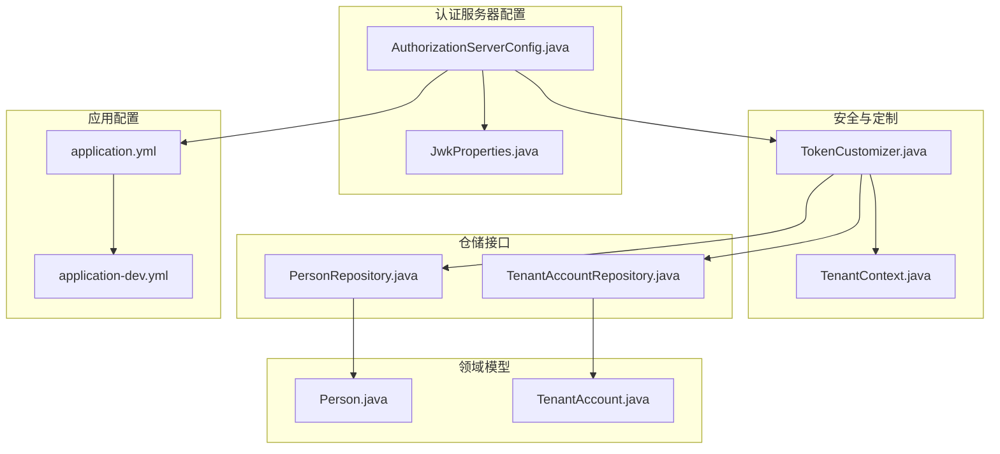
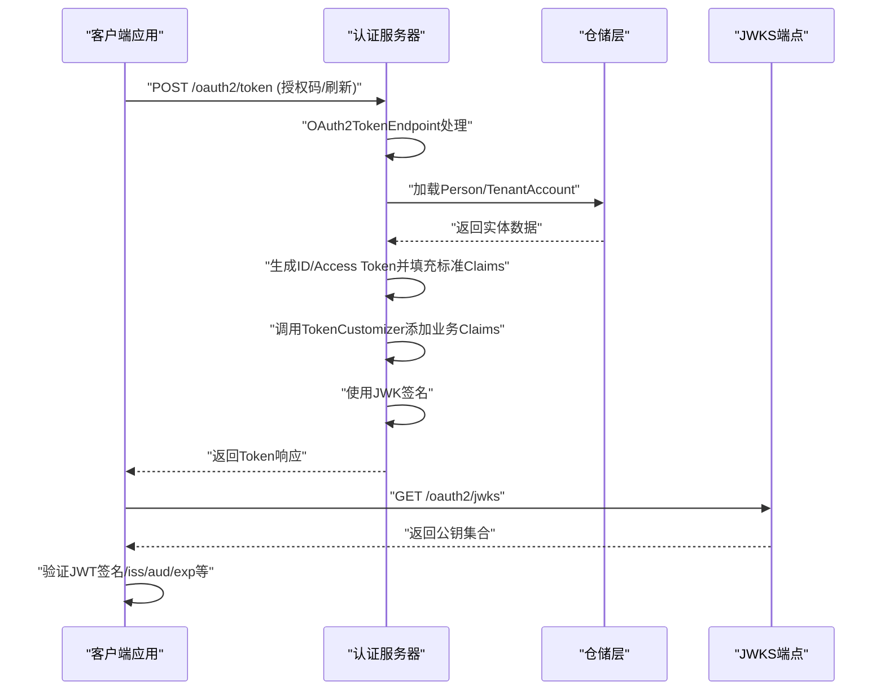
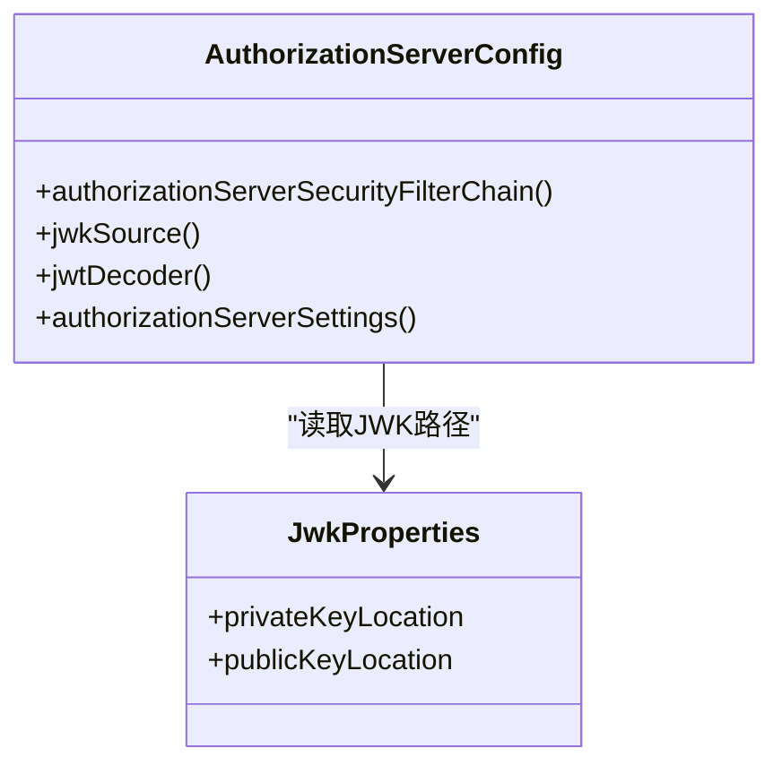
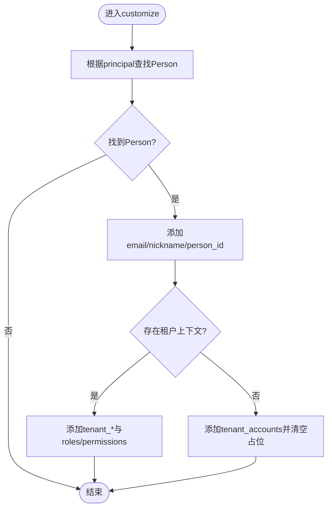
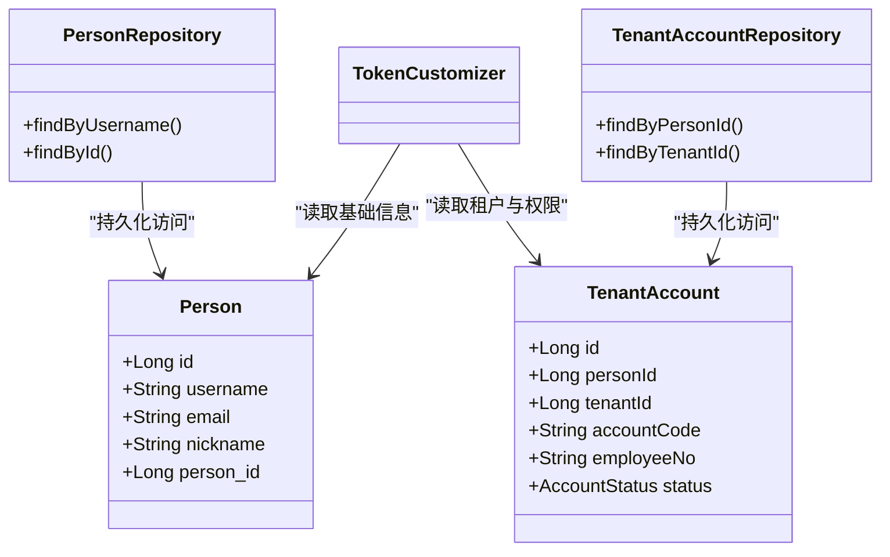
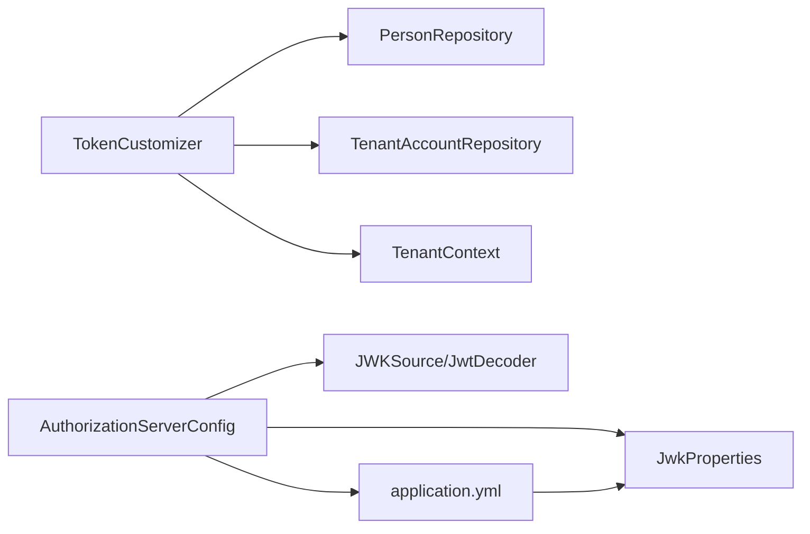

# Token机制详解

<cite>
**本文引用的文件**
- [Token机制详解.md](file://docs/Token机制详解.md)
- [AuthorizationServerConfig.java](file://sso-auth-server/src/main/java/sso/oidc/auth/infrastructure/config/AuthorizationServerConfig.java)
- [TokenCustomizer.java](file://sso-auth-server/src/main/java/sso/oidc/auth/infrastructure/security/TokenCustomizer.java)
- [application.yml](file://sso-auth-server/src/main/resources/application.yml)
- [application-dev.yml](file://sso-auth-server/src/main/resources/application-dev.yml)
- [PersonRepository.java](file://sso-auth-server/src/main/java/sso/oidc/auth/domain/repository/PersonRepository.java)
- [TenantAccountRepository.java](file://sso-auth-server/src/main/java/sso/oidc/auth/domain/repository/TenantAccountRepository.java)
- [Person.java](file://sso-auth-server/src/main/java/sso/oidc/auth/domain/model/entity/Person.java)
- [TenantAccount.java](file://sso-auth-server/src/main/java/sso/oidc/auth/domain/model/entity/TenantAccount.java)
- [TenantContext.java](file://sso-auth-server/src/main/java/sso/oidc/auth/infrastructure/security/TenantContext.java)
- [JwkProperties.java](file://sso-auth-server/src/main/java/sso/oidc/auth/infrastructure/config/JwkProperties.java)
</cite>

## 目录
1. [简介](#简介)
2. [项目结构](#项目结构)
3. [核心组件](#核心组件)
4. [架构总览](#架构总览)
5. [详细组件分析](#详细组件分析)
6. [依赖关系分析](#依赖关系分析)
7. [性能考量](#性能考量)
8. [故障排查指南](#故障排查指南)
9. [结论](#结论)
10. [附录](#附录)

## 简介
本文件系统性阐述本项目的Token机制，覆盖类型与用途、生成机制、标准与自定义Claims、Scope驱动的过滤、生命周期管理、签名与验证、Refresh Token以及最佳实践。文档以Spring Authorization Server为基础，结合项目中的TokenCustomizer实现，解释从授权码换取Token到JWT签发与验证的完整链路，并指出当前实现与OIDC规范在Claims过滤方面的差异及改进方向。

## 项目结构
围绕Token机制的关键模块分布如下：
- 配置层：认证服务器安全链与JWK配置
- 领域层：人员与租户账号实体
- 仓储层：人员与租户账号仓库接口
- 安全层：租户上下文与Token定制器
- 资源层：应用配置（issuer、JWK路径等）

图表来源
- [AuthorizationServerConfig.java:44-64](file://sso-auth-server/src/main/java/sso/oidc/auth/infrastructure/config/AuthorizationServerConfig.java#L44-L64)
- [TokenCustomizer.java:27-61](file://sso-auth-server/src/main/java/sso/oidc/auth/infrastructure/security/TokenCustomizer.java#L27-L61)
- [PersonRepository.java:9-33](file://sso-auth-server/src/main/java/sso/oidc/auth/domain/repository/PersonRepository.java#L9-L33)
- [TenantAccountRepository.java:10-32](file://sso-auth-server/src/main/java/sso/oidc/auth/domain/repository/TenantAccountRepository.java#L10-L32)
- [Person.java:17-33](file://sso-auth-server/src/main/java/sso/oidc/auth/domain/model/entity/Person.java#L17-L33)
- [TenantAccount.java:17-32](file://sso-auth-server/src/main/java/sso/oidc/auth/domain/model/entity/TenantAccount.java#L17-L32)
- [application.yml:75-82](file://sso-auth-server/src/main/resources/application.yml#L75-L82)
- [application-dev.yml:24-26](file://sso-auth-server/src/main/resources/application-dev.yml#L24-L26)

章节来源
- [AuthorizationServerConfig.java:44-64](file://sso-auth-server/src/main/java/sso/oidc/auth/infrastructure/config/AuthorizationServerConfig.java#L44-L64)
- [TokenCustomizer.java:27-61](file://sso-auth-server/src/main/java/sso/oidc/auth/infrastructure/security/TokenCustomizer.java#L27-L61)
- [application.yml:75-82](file://sso-auth-server/src/main/resources/application.yml#L75-L82)

## 核心组件
- 认证服务器安全配置：启用OIDC支持、JWT资源服务器、JWK签名源、认证入口点与租户感知过滤器。
- Token定制器：在框架生成标准Claims基础上，按租户上下文动态注入业务Claims。
- 领域模型与仓储：Person与TenantAccount实体及其仓库接口，支撑Token定制逻辑的数据来源。
- 应用配置：issuer URI、JWK路径、开发环境日志级别等。

章节来源
- [AuthorizationServerConfig.java:44-93](file://sso-auth-server/src/main/java/sso/oidc/auth/infrastructure/config/AuthorizationServerConfig.java#L44-L93)
- [TokenCustomizer.java:27-125](file://sso-auth-server/src/main/java/sso/oidc/auth/infrastructure/security/TokenCustomizer.java#L27-L125)
- [Person.java:17-33](file://sso-auth-server/src/main/java/sso/oidc/auth/domain/model/entity/Person.java#L17-L33)
- [TenantAccount.java:17-32](file://sso-auth-server/src/main/java/sso/oidc/auth/domain/model/entity/TenantAccount.java#L17-L32)
- [application.yml:75-82](file://sso-auth-server/src/main/resources/application.yml#L75-L82)

## 架构总览
下图展示从客户端请求Token到JWT签发与验证的整体流程，包括框架自动生成标准Claims、TokenCustomizer扩展业务Claims、JWK签名与资源服务器验证。

图表来源
- [AuthorizationServerConfig.java:44-93](file://sso-auth-server/src/main/java/sso/oidc/auth/infrastructure/config/AuthorizationServerConfig.java#L44-L93)
- [TokenCustomizer.java:33-61](file://sso-auth-server/src/main/java/sso/oidc/auth/infrastructure/security/TokenCustomizer.java#L33-L61)
- [PersonRepository.java](file://sso-auth-server/src/main/java/sso/oidc/auth/domain/repository/PersonRepository.java#L14)
- [TenantAccountRepository.java:15-17](file://sso-auth-server/src/main/java/sso/oidc/auth/domain/repository/TenantAccountRepository.java#L15-L17)

## 详细组件分析

### 组件A：认证服务器配置与JWK签名
- 启用OIDC与JWT资源服务器，设置认证入口点与租户感知过滤器。
- 动态加载PEM密钥，计算KeyID指纹，构建ImmutableJWKSet。
- 通过AuthorizationServerSettings暴露issuer URI，供资源服务器验证。

图表来源
- [AuthorizationServerConfig.java:44-99](file://sso-auth-server/src/main/java/sso/oidc/auth/infrastructure/config/AuthorizationServerConfig.java#L44-L99)
- [JwkProperties.java:12-15](file://sso-auth-server/src/main/java/sso/oidc/auth/infrastructure/config/JwkProperties.java#L12-L15)

章节来源
- [AuthorizationServerConfig.java:44-99](file://sso-auth-server/src/main/java/sso/oidc/auth/infrastructure/config/AuthorizationServerConfig.java#L44-L99)
- [JwkProperties.java:12-15](file://sso-auth-server/src/main/java/sso/oidc/auth/infrastructure/config/JwkProperties.java#L12-L15)

### 组件B：Token定制器（业务Claims注入）
- 依据认证主体加载Person信息，注入email、nickname、person_id等基础信息。
- 若存在租户上下文，则注入tenant_id、tenant_account_id、tenant_code、employee_no、roles、permissions。
- 若无租户上下文，则注入可选租户账号列表tenant_accounts，并清空相关占位值。
- 异常兜底：权限加载失败时写入空列表，不阻断Token生成。

图表来源
- [TokenCustomizer.java:33-125](file://sso-auth-server/src/main/java/sso/oidc/auth/infrastructure/security/TokenCustomizer.java#L33-L125)
- [PersonRepository.java](file://sso-auth-server/src/main/java/sso/oidc/auth/domain/repository/PersonRepository.java#L14)
- [TenantAccountRepository.java:15-17](file://sso-auth-server/src/main/java/sso/oidc/auth/domain/repository/TenantAccountRepository.java#L15-L17)
- [TenantContext.java:23-36](file://sso-auth-server/src/main/java/sso/oidc/auth/infrastructure/security/TenantContext.java#L23-L36)

章节来源
- [TokenCustomizer.java:27-125](file://sso-auth-server/src/main/java/sso/oidc/auth/infrastructure/security/TokenCustomizer.java#L27-L125)
- [PersonRepository.java:9-33](file://sso-auth-server/src/main/java/sso/oidc/auth/domain/repository/PersonRepository.java#L9-L33)
- [TenantAccountRepository.java:10-32](file://sso-auth-server/src/main/java/sso/oidc/auth/domain/repository/TenantAccountRepository.java#L10-L32)
- [TenantContext.java:7-44](file://sso-auth-server/src/main/java/sso/oidc/auth/infrastructure/security/TenantContext.java#L7-L44)

### 组件C：领域模型与仓储接口
- Person：提供用户名、邮箱、昵称等字段，支撑Token定制器的基础信息注入。
- TenantAccount：提供租户账号、员工号、状态等，支撑多租户上下文与权限注入。
- 仓储接口：提供按ID、按人、按租户等查询能力，支撑Token定制器的数据需求。

图表来源
- [Person.java:17-33](file://sso-auth-server/src/main/java/sso/oidc/auth/domain/model/entity/Person.java#L17-L33)
- [TenantAccount.java:17-32](file://sso-auth-server/src/main/java/sso/oidc/auth/domain/model/entity/TenantAccount.java#L17-L32)
- [PersonRepository.java:9-33](file://sso-auth-server/src/main/java/sso/oidc/auth/domain/repository/PersonRepository.java#L9-L33)
- [TenantAccountRepository.java:10-32](file://sso-auth-server/src/main/java/sso/oidc/auth/domain/repository/TenantAccountRepository.java#L10-L32)
- [TokenCustomizer.java:27-61](file://sso-auth-server/src/main/java/sso/oidc/auth/infrastructure/security/TokenCustomizer.java#L27-L61)

章节来源
- [Person.java:17-33](file://sso-auth-server/src/main/java/sso/oidc/auth/domain/model/entity/Person.java#L17-L33)
- [TenantAccount.java:17-32](file://sso-auth-server/src/main/java/sso/oidc/auth/domain/model/entity/TenantAccount.java#L17-L32)
- [PersonRepository.java:9-33](file://sso-auth-server/src/main/java/sso/oidc/auth/domain/repository/PersonRepository.java#L9-L33)
- [TenantAccountRepository.java:10-32](file://sso-auth-server/src/main/java/sso/oidc/auth/domain/repository/TenantAccountRepository.java#L10-L32)
- [TokenCustomizer.java:27-61](file://sso-auth-server/src/main/java/sso/oidc/auth/infrastructure/security/TokenCustomizer.java#L27-L61)

### 组件D：应用配置与JWK路径
- issuer-uri：用于资源服务器验证iss字段。
- security.jwk.rsa：指定PEM私钥与公钥路径，支持classpath与容器Secret注入。
- 开发环境：开启SQL日志、Spring Security与Hibernate SQL日志，便于调试。

章节来源
- [application.yml:75-82](file://sso-auth-server/src/main/resources/application.yml#L75-L82)
- [application-dev.yml:24-33](file://sso-auth-server/src/main/resources/application-dev.yml#L24-L33)
- [AuthorizationServerConfig.java:66-93](file://sso-auth-server/src/main/java/sso/oidc/auth/infrastructure/config/AuthorizationServerConfig.java#L66-L93)

## 依赖关系分析
- Token定制器依赖PersonRepository、TenantAccountRepository与租户上下文，形成“领域数据+上下文”的组合。
- 认证服务器配置依赖JwkProperties与ResourceLoader，负责JWK加载与KeyID稳定性。
- 应用配置贯穿于上述组件，提供issuer与JWK路径等关键参数。

图表来源
- [TokenCustomizer.java:27-61](file://sso-auth-server/src/main/java/sso/oidc/auth/infrastructure/security/TokenCustomizer.java#L27-L61)
- [AuthorizationServerConfig.java:44-93](file://sso-auth-server/src/main/java/sso/oidc/auth/infrastructure/config/AuthorizationServerConfig.java#L44-L93)
- [application.yml:75-82](file://sso-auth-server/src/main/resources/application.yml#L75-L82)
- [JwkProperties.java:12-15](file://sso-auth-server/src/main/java/sso/oidc/auth/infrastructure/config/JwkProperties.java#L12-L15)

章节来源
- [TokenCustomizer.java:27-61](file://sso-auth-server/src/main/java/sso/oidc/auth/infrastructure/security/TokenCustomizer.java#L27-L61)
- [AuthorizationServerConfig.java:44-93](file://sso-auth-server/src/main/java/sso/oidc/auth/infrastructure/config/AuthorizationServerConfig.java#L44-L93)
- [application.yml:75-82](file://sso-auth-server/src/main/resources/application.yml#L75-L82)
- [JwkProperties.java:12-15](file://sso-auth-server/src/main/java/sso/oidc/auth/infrastructure/config/JwkProperties.java#L12-L15)

## 性能考量
- Token生成涉及数据库查询与权限聚合，建议：
  - 对Person/TenantAccount查询结果进行缓存（短期有效）。
  - 权限加载异常时快速回退为空列表，避免阻塞Token发放。
  - KeyID基于公钥指纹生成，保证重启后JWKS缓存稳定，减少客户端刷新频率。
- 资源服务器验证阶段：
  - 使用JwtDecoder从issuer自动发现JWKS，减少硬编码依赖。
  - 合理设置令牌有效期，平衡安全与性能。

## 故障排查指南
- Token缺少期望的业务Claims
  - 检查租户上下文是否正确设置（TenantContext）。
  - 确认Person/TenantAccount数据是否存在且状态正常。
- Token签名验证失败
  - 确认资源服务器使用正确的issuer与JWKS端点。
  - 检查JWK路径与PEM文件是否正确加载。
- Claims未按scope过滤
  - 当前实现未根据scope过滤，需在TokenCustomizer中读取authorizedScopes并按需添加。
- 日志定位
  - 开启开发环境日志，观察Spring Security与Hibernate SQL输出。

章节来源
- [TokenCustomizer.java:87-96](file://sso-auth-server/src/main/java/sso/oidc/auth/infrastructure/security/TokenCustomizer.java#L87-L96)
- [AuthorizationServerConfig.java:117-128](file://sso-auth-server/src/main/java/sso/oidc/auth/infrastructure/config/AuthorizationServerConfig.java#L117-L128)
- [application-dev.yml:28-33](file://sso-auth-server/src/main/resources/application-dev.yml#L28-L33)

## 结论
本项目基于Spring Authorization Server实现了完整的OIDC Token链路：框架自动生成标准Claims，TokenCustomizer按租户上下文注入业务Claims，JWK完成签名与验证。当前实现具备良好的扩展性与可运维性；在Claims过滤方面可进一步遵循OIDC规范，按scope精细化控制输出，提升隐私与安全合规性。

## 附录
- Token解码与在线调试
  - 使用JWT.io或命令行工具解码Payload。
  - 访问JWKS端点获取公钥，访问OIDC Discovery获取元信息。
- 相关文档
  - Spring Authorization Server原理与流程
  - 第三方服务对接指南
  - OIDC与OAuth 2.0规范

章节来源
- [Token机制详解.md:747-784](file://docs/Token机制详解.md#L747-L784)