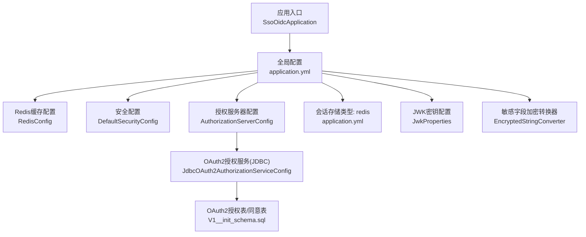
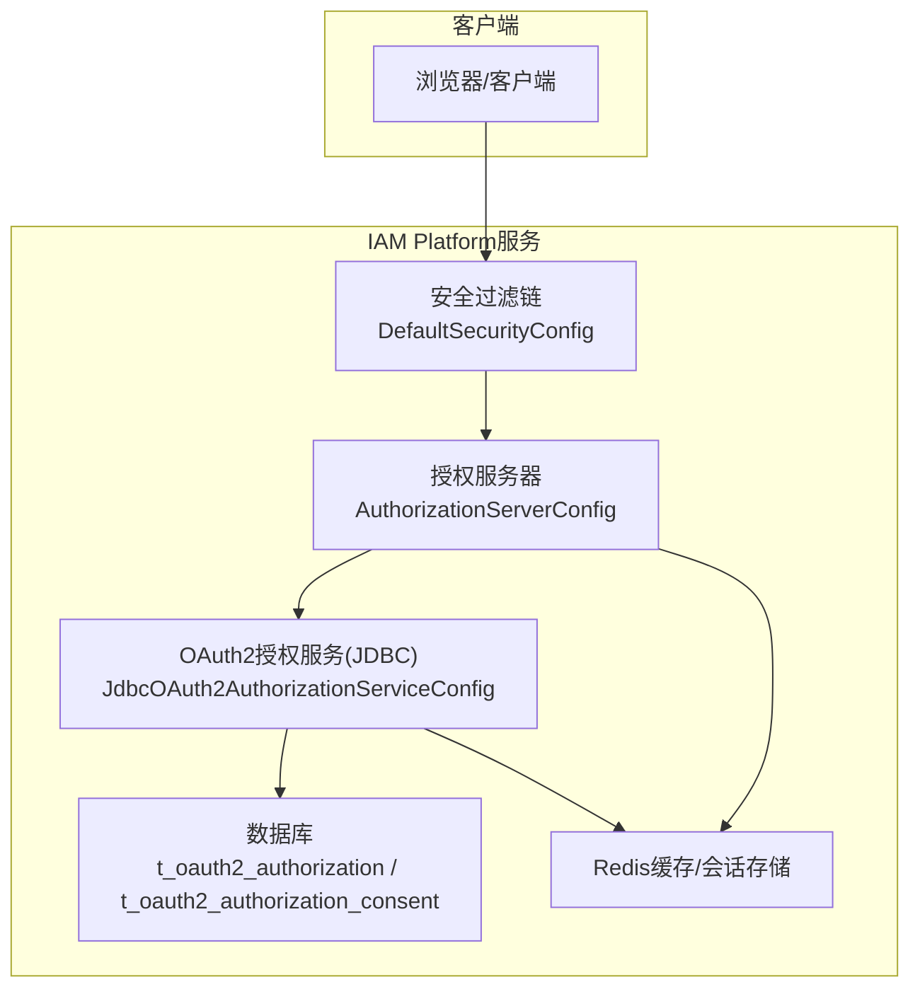
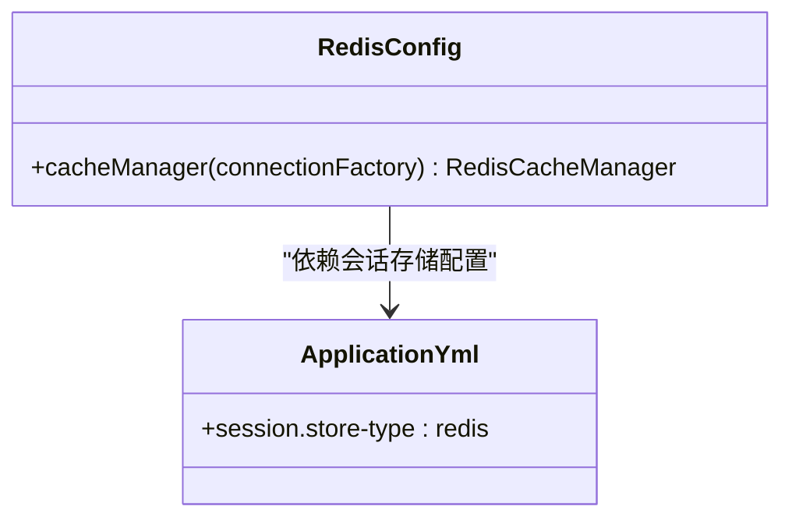
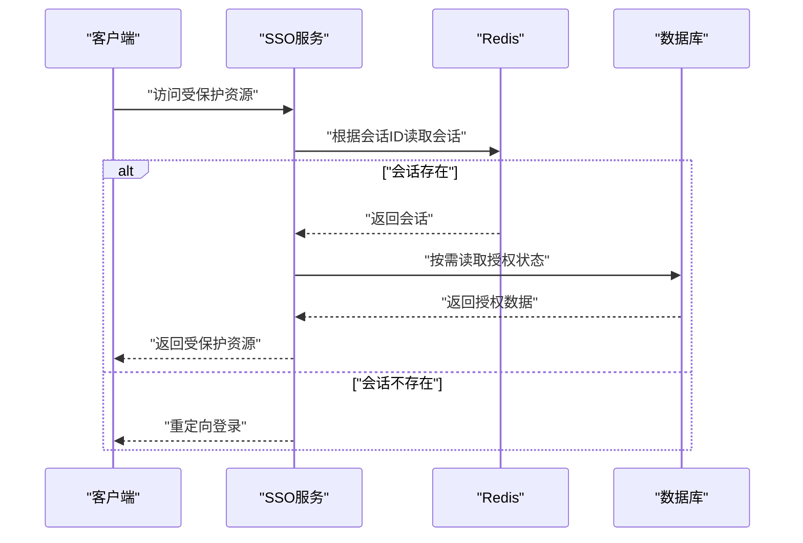
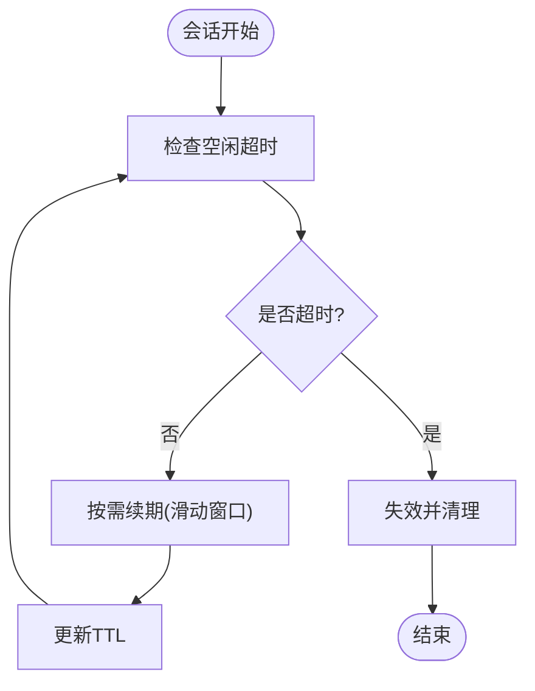
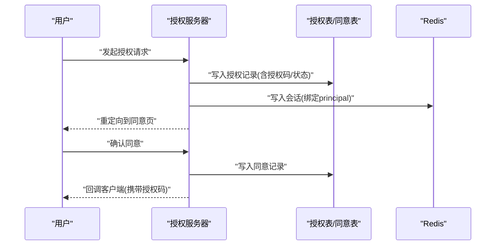
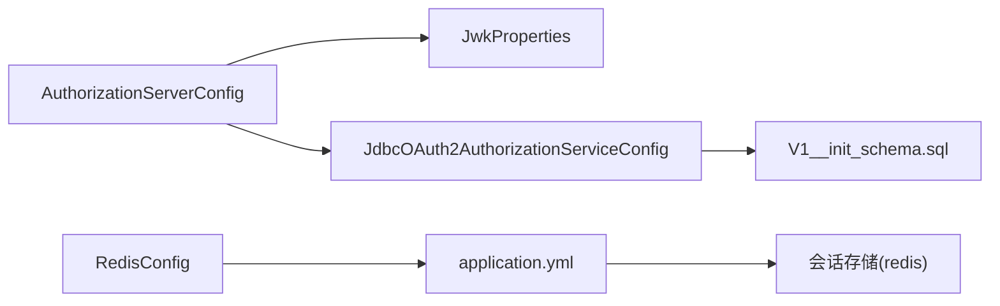

# 会话管理

<cite>
**本文引用的文件**
- [SsoOidcApplication.java](file://src/main/java/sso/oidc/SsoOidcApplication.java)
- [application.yml](file://src/main/resources/application.yml)
- [application-dev.yml](file://src/main/resources/application-dev.yml)
- [application-prod.yml](file://src/main/resources/application-prod.yml)
- [RedisConfig.java](file://src/main/java/sso/oidc/infrastructure/config/RedisConfig.java)
- [DefaultSecurityConfig.java](file://src/main/java/sso/oidc/infrastructure/config/DefaultSecurityConfig.java)
- [AuthorizationServerConfig.java](file://src/main/java/sso/oidc/infrastructure/config/AuthorizationServerConfig.java)
- [JdbcOAuth2AuthorizationServiceConfig.java](file://src/main/java/sso/oidc/infrastructure/security/JdbcOAuth2AuthorizationServiceConfig.java)
- [JwkProperties.java](file://src/main/java/sso/oidc/infrastructure/config/JwkProperties.java)
- [V1__init_schema.sql](file://src/main/resources/db/migration/V1__init_schema.sql)
- [V2__seed_default_roles.sql](file://src/main/resources/db/migration/V2__seed_default_roles.sql)
- [EncryptedStringConverter.java](file://src/main/java/sso/oidc/infrastructure/persistence/converter/EncryptedStringConverter.java)
- [LoginController.java](file://src/main/java/sso/oidc/interfaces/web/LoginController.java)
- [RegistrationController.java](file://src/main/java/sso/oidc/interfaces/web/RegistrationController.java)
- [ConsentController.java](file://src/main/java/sso/oidc/interfaces/web/ConsentController.java)
- [DEPLOYMENT.md](file://DEPLOYMENT.md)
- [secret.yaml](file://k8s/base/secret.yaml)
</cite>

## 目录
1. [简介](#简介)
2. [项目结构](#项目结构)
3. [核心组件](#核心组件)
4. [架构总览](#架构总览)
5. [详细组件分析](#详细组件分析)
6. [依赖分析](#依赖分析)
7. [性能考虑](#性能考虑)
8. [故障排查指南](#故障排查指南)
9. [结论](#结论)
10. [附录](#附录)

## 简介
本文件面向IAM Platform认证服务的会话管理，系统性梳理Redis缓存与会话存储配置、分布式一致性与同步机制、会话超时与自动续期策略、OAuth2授权服务器中的会话绑定与令牌状态管理、以及会话安全配置与监控调试方法。文档以代码为依据，结合配置文件与数据库模式，提供可操作的实践建议与可视化图示。

## 项目结构
围绕会话管理的关键模块与文件如下：
- 应用入口与配置
  - 应用启动类：[SsoOidcApplication.java](file://src/main/java/sso/oidc/SsoOidcApplication.java)
  - 全局配置：[application.yml](file://src/main/resources/application.yml)、[application-dev.yml](file://src/main/resources/application-dev.yml)、[application-prod.yml](file://src/main/resources/application-prod.yml)
- 缓存与会话
  - Redis缓存配置：[RedisConfig.java](file://src/main/java/sso/oidc/infrastructure/config/RedisConfig.java)
  - 会话存储类型：配置中启用Redis存储（session.store-type: redis）
- 安全与授权
  - 默认Web安全链路：[DefaultSecurityConfig.java](file://src/main/java/sso/oidc/infrastructure/config/DefaultSecurityConfig.java)
  - 授权服务器配置：[AuthorizationServerConfig.java](file://src/main/java/sso/oidc/infrastructure/config/AuthorizationServerConfig.java)
  - OAuth2授权服务（JDBC）：[JdbcOAuth2AuthorizationServiceConfig.java](file://src/main/java/sso/oidc/infrastructure/security/JdbcOAuth2AuthorizationServiceConfig.java)
  - JWK密钥配置：[JwkProperties.java](file://src/main/java/sso/oidc/infrastructure/config/JwkProperties.java)
- 数据模型与持久化
  - OAuth2授权表与同意表（Spring Authorization Server）：[V1__init_schema.sql](file://src/main/resources/db/migration/V1__init_schema.sql)
  - 默认角色种子数据：[V2__seed_default_roles.sql](file://src/main/resources/db/migration/V2__seed_default_roles.sql)
  - 敏感字段加密转换器（客户端密钥等）：[EncryptedStringConverter.java](file://src/main/java/sso/oidc/infrastructure/persistence/converter/EncryptedStringConverter.java)
- 控制器（登录/注册/同意页）
  - 登录控制器：[LoginController.java](file://src/main/java/sso/oidc/interfaces/web/LoginController.java)
  - 注册控制器：[RegistrationController.java](file://src/main/java/sso/oidc/interfaces/web/RegistrationController.java)
  - 同意页控制器：[ConsentController.java](file://src/main/java/sso/oidc/interfaces/web/ConsentController.java)
- 部署与密钥
  - 部署说明与多环境差异：[DEPLOYMENT.md](file://DEPLOYMENT.md)
  - Kubernetes Secret定义：[secret.yaml](file://k8s/base/secret.yaml)

**图表来源**
- [SsoOidcApplication.java](file://src/main/java/sso/oidc/SsoOidcApplication.java)
- [application.yml](file://src/main/resources/application.yml)
- [RedisConfig.java](file://src/main/java/sso/oidc/infrastructure/config/RedisConfig.java)
- [DefaultSecurityConfig.java](file://src/main/java/sso/oidc/infrastructure/config/DefaultSecurityConfig.java)
- [AuthorizationServerConfig.java](file://src/main/java/sso/oidc/infrastructure/config/AuthorizationServerConfig.java)
- [JdbcOAuth2AuthorizationServiceConfig.java](file://src/main/java/sso/oidc/infrastructure/security/JdbcOAuth2AuthorizationServiceConfig.java)
- [JwkProperties.java](file://src/main/java/sso/oidc/infrastructure/config/JwkProperties.java)
- [V1__init_schema.sql](file://src/main/resources/db/migration/V1__init_schema.sql)
- [EncryptedStringConverter.java](file://src/main/java/sso/oidc/infrastructure/persistence/converter/EncryptedStringConverter.java)

**章节来源**
- [SsoOidcApplication.java](file://src/main/java/sso/oidc/SsoOidcApplication.java)
- [application.yml](file://src/main/resources/application.yml)

## 核心组件
- Redis缓存与会话存储
  - 缓存管理器：基于Redis的缓存管理器，统一TTL、序列化策略与前缀计算。
  - 会话存储：通过配置启用Redis作为会话存储类型，实现分布式会话共享。
- OAuth2授权服务器
  - 授权服务与同意服务：基于JDBC持久化授权状态、同意记录。
  - Token设置：访问令牌与刷新令牌的TTL在客户端配置中设定。
- 安全过滤链
  - 登录、注册、静态资源与错误页面的放行策略；其他路径均需认证。
- 数据模型与加密
  - OAuth2授权表与同意表用于存储授权码、令牌、ID Token等状态。
  - 客户端密钥等敏感字段采用AES加密存储。

**章节来源**
- [RedisConfig.java](file://src/main/java/sso/oidc/infrastructure/config/RedisConfig.java)
- [application.yml](file://src/main/resources/application.yml)
- [JdbcOAuth2AuthorizationServiceConfig.java](file://src/main/java/sso/oidc/infrastructure/security/JdbcOAuth2AuthorizationServiceConfig.java)
- [AuthorizationServerConfig.java](file://src/main/java/sso/oidc/infrastructure/config/AuthorizationServerConfig.java)
- [DefaultSecurityConfig.java](file://src/main/java/sso/oidc/infrastructure/config/DefaultSecurityConfig.java)
- [V1__init_schema.sql](file://src/main/resources/db/migration/V1__init_schema.sql)
- [EncryptedStringConverter.java](file://src/main/java/sso/oidc/infrastructure/persistence/converter/EncryptedStringConverter.java)

## 架构总览
下图展示会话管理在系统中的位置与交互：浏览器发起登录/授权请求，经安全过滤链处理，授权服务器生成授权码/令牌并持久化到数据库，同时利用Redis进行会话共享与缓存；客户端通过令牌访问受保护资源。

**图表来源**
- [DefaultSecurityConfig.java](file://src/main/java/sso/oidc/infrastructure/config/DefaultSecurityConfig.java)
- [AuthorizationServerConfig.java](file://src/main/java/sso/oidc/infrastructure/config/AuthorizationServerConfig.java)
- [JdbcOAuth2AuthorizationServiceConfig.java](file://src/main/java/sso/oidc/infrastructure/security/JdbcOAuth2AuthorizationServiceConfig.java)
- [V1__init_schema.sql](file://src/main/resources/db/migration/V1__init_schema.sql)

## 详细组件分析

### Redis缓存与会话存储
- 缓存管理器
  - TTL：默认条目TTL为固定时长。
  - 序列化：值序列化采用JSON，便于跨语言读取与调试。
  - 前缀：简单前缀策略，便于区分命名空间。
  - 空值禁用：避免缓存空结果。
- 会话存储
  - 配置启用Redis会话存储类型，实现多实例间会话共享与一致性。
- 连接池配置
  - 通过Spring Data Redis连接工厂默认行为管理连接池；如需精细化配置，可在连接工厂层面扩展。

**图表来源**
- [RedisConfig.java](file://src/main/java/sso/oidc/infrastructure/config/RedisConfig.java)
- [application.yml](file://src/main/resources/application.yml)

**章节来源**
- [RedisConfig.java](file://src/main/java/sso/oidc/infrastructure/config/RedisConfig.java)
- [application.yml](file://src/main/resources/application.yml)

### 分布式会话同步与一致性
- 会话复制与故障转移
  - 通过Redis作为共享存储，实现多实例间的会话复制与故障转移。
  - 会话一致性由Redis保证，客户端通过会话标识访问服务，无需本地状态。
- 数据持久化
  - OAuth2授权状态与同意记录持久化至数据库，确保令牌生命周期与授权范围可审计。
- 缓存键设计
  - 缓存键前缀采用简单策略，便于识别与清理；实际会话键由Spring Session/框架生成。

**图表来源**
- [application.yml](file://src/main/resources/application.yml)
- [JdbcOAuth2AuthorizationServiceConfig.java](file://src/main/java/sso/oidc/infrastructure/security/JdbcOAuth2AuthorizationServiceConfig.java)
- [V1__init_schema.sql](file://src/main/resources/db/migration/V1__init_schema.sql)

**章节来源**
- [application.yml](file://src/main/resources/application.yml)
- [JdbcOAuth2AuthorizationServiceConfig.java](file://src/main/java/sso/oidc/infrastructure/security/JdbcOAuth2AuthorizationServiceConfig.java)
- [V1__init_schema.sql](file://src/main/resources/db/migration/V1__init_schema.sql)

### 会话超时与自动续期
- 空闲超时与绝对超时
  - 会话空闲超时与绝对超时由Spring Session与Redis TTL共同决定；当前配置未显式覆盖，遵循默认行为。
  - Redis缓存默认TTL用于通用缓存场景；会话级TTL通常由Spring Session管理。
- 滑动窗口策略
  - 若需要滑动窗口续期，可在会话创建/访问时更新TTL；当前配置未显式声明滑动窗口策略。
- OAuth2令牌超时
  - 访问令牌与刷新令牌TTL在客户端配置中设定，影响令牌生命周期与续期策略。

**图表来源**
- [RedisConfig.java](file://src/main/java/sso/oidc/infrastructure/config/RedisConfig.java)
- [AuthorizationServerConfig.java](file://src/main/java/sso/oidc/infrastructure/config/AuthorizationServerConfig.java)

**章节来源**
- [RedisConfig.java](file://src/main/java/sso/oidc/infrastructure/config/RedisConfig.java)
- [AuthorizationServerConfig.java](file://src/main/java/sso/oidc/infrastructure/config/AuthorizationServerConfig.java)

### OAuth2授权服务器的会话管理
- 授权码存储与会话绑定
  - 授权码、ID Token、访问令牌与刷新令牌的状态与元数据存储于授权表；会话与授权状态通过principal_name与客户端ID关联。
- 令牌状态管理
  - 访问令牌与刷新令牌的TTL在客户端配置中设定；授权表包含各令牌的 issued_at 与 expires_at，用于状态校验。
- 同意页与会话
  - 同意页控制器接收客户端名称与作用域参数，供用户确认授权范围；同意记录存储于同意表，与principal_name绑定。

**图表来源**
- [AuthorizationServerConfig.java](file://src/main/java/sso/oidc/infrastructure/config/AuthorizationServerConfig.java)
- [JdbcOAuth2AuthorizationServiceConfig.java](file://src/main/java/sso/oidc/infrastructure/security/JdbcOAuth2AuthorizationServiceConfig.java)
- [ConsentController.java](file://src/main/java/sso/oidc/interfaces/web/ConsentController.java)
- [V1__init_schema.sql](file://src/main/resources/db/migration/V1__init_schema.sql)

**章节来源**
- [AuthorizationServerConfig.java](file://src/main/java/sso/oidc/infrastructure/config/AuthorizationServerConfig.java)
- [JdbcOAuth2AuthorizationServiceConfig.java](file://src/main/java/sso/oidc/infrastructure/security/JdbcOAuth2AuthorizationServiceConfig.java)
- [ConsentController.java](file://src/main/java/sso/oidc/interfaces/web/ConsentController.java)
- [V1__init_schema.sql](file://src/main/resources/db/migration/V1__init_schema.sql)

### 会话安全配置
- HttpOnly、SameSite、Secure标志
  - 当前仓库未发现显式的Cookie安全标志配置；建议在生产环境通过Spring Session或Servlet容器配置启用HttpOnly、SameSite=Lax|Strict、Secure标志，并强制HTTPS传输。
- 密钥与加密
  - JWK密钥路径通过JwkProperties加载；敏感字段（如客户端密钥）通过AES加密转换器存储。
- 认证入口与登录页
  - 默认安全配置为登录页与静态资源放行，其余路径需认证；登录控制器提供登录页面访问。

**章节来源**
- [JwkProperties.java](file://src/main/java/sso/oidc/infrastructure/config/JwkProperties.java)
- [EncryptedStringConverter.java](file://src/main/java/sso/oidc/infrastructure/persistence/converter/EncryptedStringConverter.java)
- [DefaultSecurityConfig.java](file://src/main/java/sso/oidc/infrastructure/config/DefaultSecurityConfig.java)
- [LoginController.java](file://src/main/java/sso/oidc/interfaces/web/LoginController.java)

### 会话监控与调试
- 指标与追踪
  - 管理端点暴露健康、信息、指标与Prometheus；Zipkin追踪采样概率可调。
- 日志与开发环境
  - 开发环境开启SQL格式化与DEBUG日志，便于定位会话与授权问题。
- 多环境差异
  - 不同环境的连接池大小、日志级别、Swagger UI开关与追踪采样概率存在差异，应结合监控与日志进行会话异常排查。

**章节来源**
- [application.yml](file://src/main/resources/application.yml)
- [application-dev.yml](file://src/main/resources/application-dev.yml)
- [application-prod.yml](file://src/main/resources/application-prod.yml)
- [DEPLOYMENT.md](file://DEPLOYMENT.md)

## 依赖分析
- 组件耦合
  - 授权服务器配置依赖JWK源与客户端设置；OAuth2授权服务依赖JDBC模板与客户端仓库。
  - Redis缓存配置与会话存储类型相互独立但共同支撑分布式会话。
- 外部依赖
  - PostgreSQL用于OAuth2授权状态与同意记录持久化；Redis用于会话共享与缓存。
- 潜在循环依赖
  - 当前配置未见循环依赖迹象；若引入自定义会话监听器，请避免反向依赖。

**图表来源**
- [AuthorizationServerConfig.java](file://src/main/java/sso/oidc/infrastructure/config/AuthorizationServerConfig.java)
- [JwkProperties.java](file://src/main/java/sso/oidc/infrastructure/config/JwkProperties.java)
- [JdbcOAuth2AuthorizationServiceConfig.java](file://src/main/java/sso/oidc/infrastructure/security/JdbcOAuth2AuthorizationServiceConfig.java)
- [V1__init_schema.sql](file://src/main/resources/db/migration/V1__init_schema.sql)
- [RedisConfig.java](file://src/main/java/sso/oidc/infrastructure/config/RedisConfig.java)
- [application.yml](file://src/main/resources/application.yml)

**章节来源**
- [AuthorizationServerConfig.java](file://src/main/java/sso/oidc/infrastructure/config/AuthorizationServerConfig.java)
- [JdbcOAuth2AuthorizationServiceConfig.java](file://src/main/java/sso/oidc/infrastructure/security/JdbcOAuth2AuthorizationServiceConfig.java)
- [V1__init_schema.sql](file://src/main/resources/db/migration/V1__init_schema.sql)
- [RedisConfig.java](file://src/main/java/sso/oidc/infrastructure/config/RedisConfig.java)
- [application.yml](file://src/main/resources/application.yml)

## 性能考虑
- 连接池与TTL
  - 数据源连接池大小在不同环境有差异化配置；Redis连接池由连接工厂默认行为管理。
  - 缓存TTL与会话TTL需平衡命中率与内存占用；建议根据业务峰值与SLA调整。
- 缓存序列化
  - JSON序列化便于调试，但序列化/反序列化开销高于二进制；在高吞吐场景可评估二进制序列化。
- 监控与采样
  - 生产环境降低Zipkin采样概率以减少追踪开销；开启指标与日志以便快速定位热点。

[本节为通用性能建议，不直接分析具体文件]

## 故障排查指南
- 会话丢失/跳转登录
  - 检查Redis连通性与会话存储配置；确认浏览器Cookie域与路径正确。
- 授权失败/令牌无效
  - 核对授权表中的issued_at/expires_at与客户端TTL配置；确认JWK密钥加载正常。
- 登录/注册异常
  - 查看开发环境日志与SQL输出；确认静态资源放行与登录页路由配置。
- 生产问题定位
  - 结合Prometheus指标、Zipkin追踪与日志级别，定位会话与授权瓶颈。

**章节来源**
- [application-dev.yml](file://src/main/resources/application-dev.yml)
- [application-prod.yml](file://src/main/resources/application-prod.yml)
- [DefaultSecurityConfig.java](file://src/main/java/sso/oidc/infrastructure/config/DefaultSecurityConfig.java)
- [V1__init_schema.sql](file://src/main/resources/db/migration/V1__init_schema.sql)

## 结论
本项目通过Redis实现分布式会话共享，结合JDBC持久化OAuth2授权状态与同意记录，形成完整的会话管理闭环。当前配置在缓存与会话层面提供了基础能力，建议在生产环境补充Cookie安全标志、细化TTL策略与滑动续期逻辑，并完善监控与日志体系以保障稳定性与可观测性。

[本节为总结性内容，不直接分析具体文件]

## 附录
- 关键配置要点
  - 会话存储：session.store-type: redis
  - Redis主机/端口/密码：通过环境变量注入
  - OAuth2令牌TTL：在客户端配置中设定
  - JWK密钥路径：通过JwkProperties加载
  - 敏感字段加密：客户端密钥等通过AES转换器存储
- 多环境差异
  - 连接池大小、日志级别、Swagger UI开关与追踪采样概率存在差异，部署时需按环境覆盖。

**章节来源**
- [application.yml](file://src/main/resources/application.yml)
- [application-dev.yml](file://src/main/resources/application-dev.yml)
- [application-prod.yml](file://src/main/resources/application-prod.yml)
- [JwkProperties.java](file://src/main/java/sso/oidc/infrastructure/config/JwkProperties.java)
- [EncryptedStringConverter.java](file://src/main/java/sso/oidc/infrastructure/persistence/converter/EncryptedStringConverter.java)
- [DEPLOYMENT.md](file://DEPLOYMENT.md)
- [secret.yaml](file://k8s/base/secret.yaml)