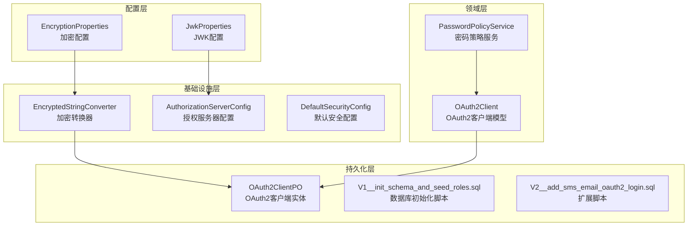
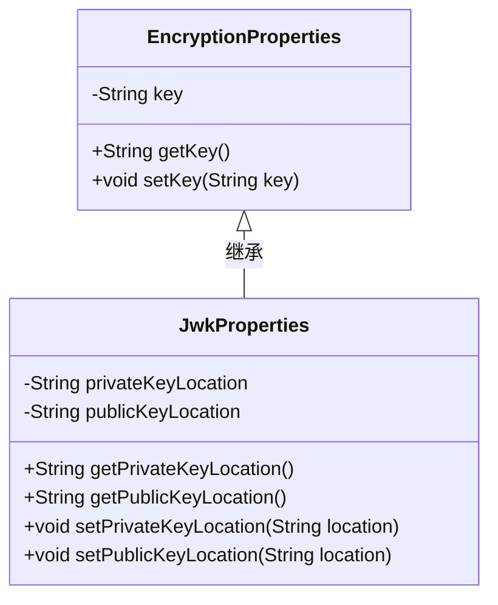
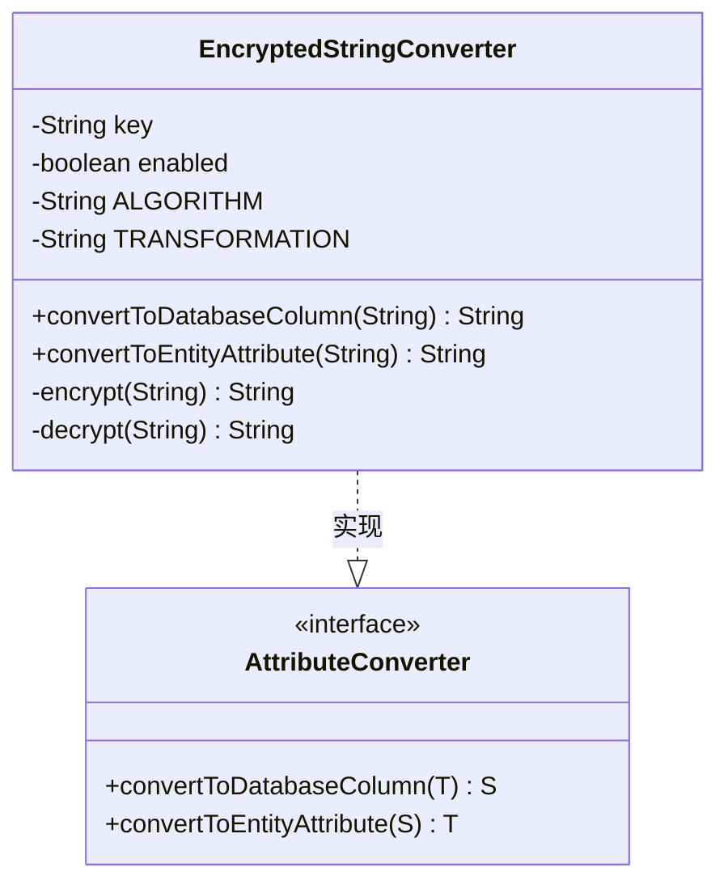
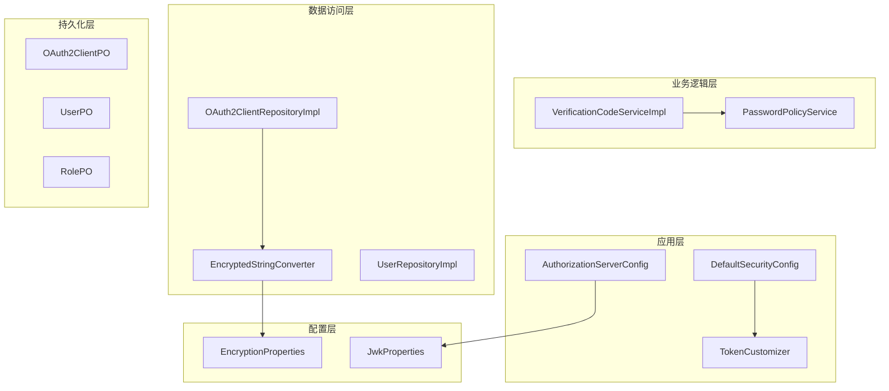
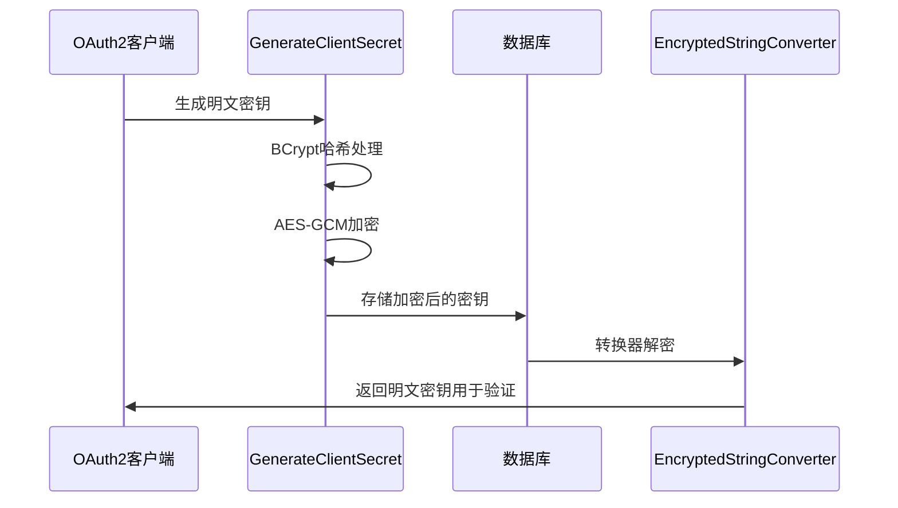
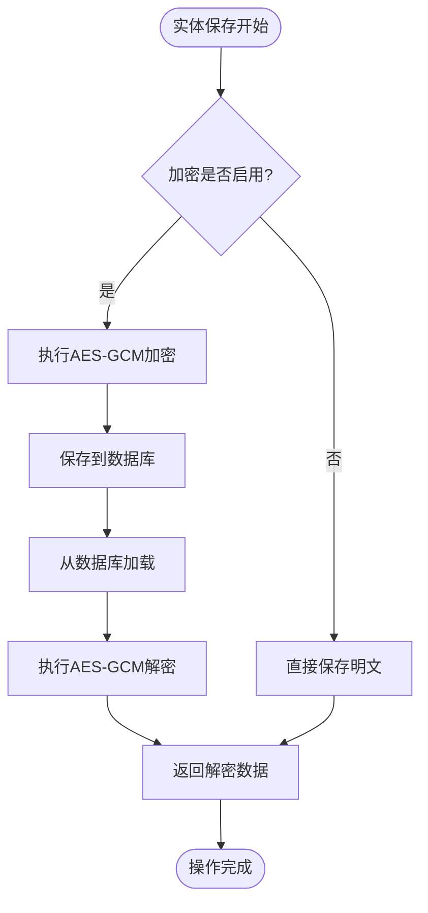
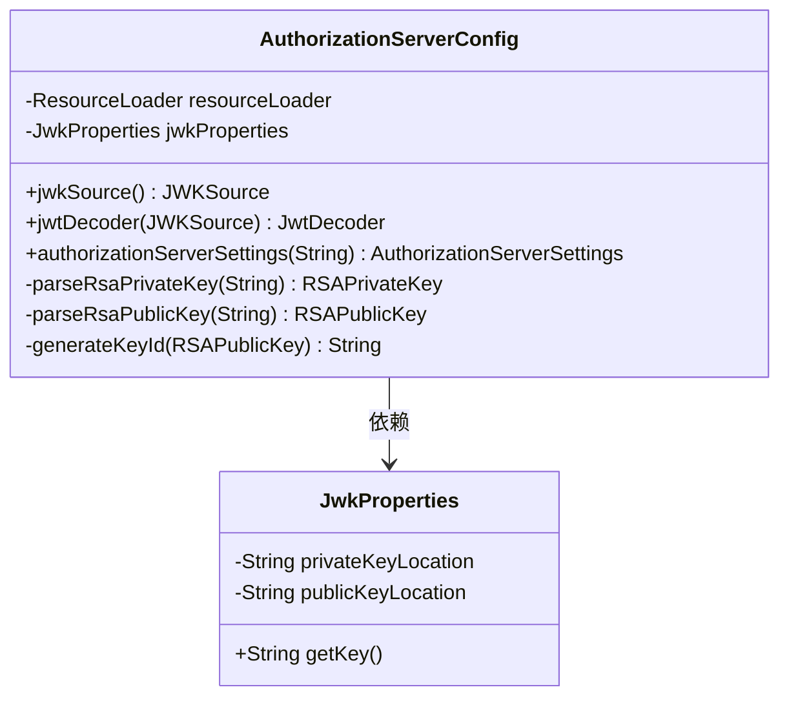
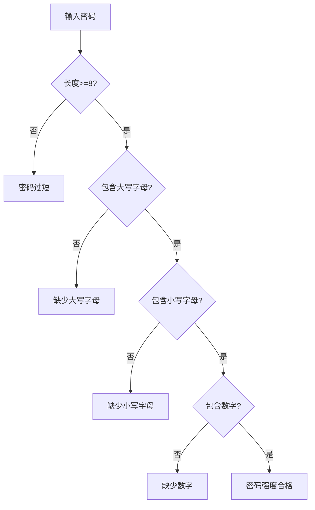
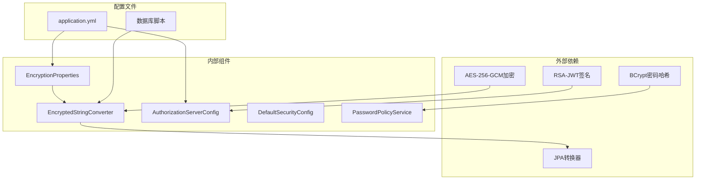

# 加密框架

<cite>
**本文档引用的文件**
- [EncryptionProperties.java](file://src/main/java/sso/oidc/infrastructure/config/EncryptionProperties.java)
- [EncryptedStringConverter.java](file://src/main/java/sso/oidc/infrastructure/persistence/converter/EncryptedStringConverter.java)
- [GenerateClientSecret.java](file://src/main/java/sso/oidc/GenerateClientSecret.java)
- [application.yml](file://src/main/resources/application.yml)
- [OAuth2Client.java](file://src/main/java/sso/oidc/domain/model/entity/OAuth2Client.java)
- [OAuth2ClientPO.java](file://src/main/java/sso/oidc/infrastructure/persistence/entity/OAuth2ClientPO.java)
- [V1__init_schema_and_seed_roles.sql](file://src/main/resources/db/migration/V1__init_schema_and_seed_roles.sql)
- [V2__add_sms_email_oauth2_login.sql](file://src/main/resources/db/migration/V2__add_sms_email_oauth2_login.sql)
- [JwkProperties.java](file://src/main/java/sso/oidc/infrastructure/config/JwkProperties.java)
- [AuthorizationServerConfig.java](file://src/main/java/sso/oidc/infrastructure/config/AuthorizationServerConfig.java)
- [DefaultSecurityConfig.java](file://src/main/java/sso/oidc/infrastructure/config/DefaultSecurityConfig.java)
- [TokenCustomizer.java](file://src/main/java/sso/oidc/infrastructure/security/TokenCustomizer.java)
- [PasswordPolicyService.java](file://src/main/java/sso/oidc/domain/service/PasswordPolicyService.java)
</cite>

## 目录
1. [简介](#简介)
2. [项目结构](#项目结构)
3. [核心组件](#核心组件)
4. [架构概览](#架构概览)
5. [详细组件分析](#详细组件分析)
6. [依赖关系分析](#依赖关系分析)
7. [性能考虑](#性能考虑)
8. [故障排除指南](#故障排除指南)
9. [结论](#结论)

## 简介

本项目实现了一个完整的加密框架，主要包含以下核心功能：

- **客户端密钥加密**：使用AES-256-GCM对OAuth2客户端密钥进行加密存储
- **密码哈希**：使用BCrypt对用户密码进行安全哈希处理
- **JWT密钥管理**：基于RSA的JWK（JSON Web Key）系统
- **数据持久化加密**：通过JPA转换器实现透明的数据加密

该加密框架采用多层安全策略，确保敏感数据在传输、存储和处理过程中的安全性。

## 项目结构

项目采用分层架构设计，加密相关的核心组件分布在以下层次：

**图表来源**
- [EncryptionProperties.java:1-15](file://src/main/java/sso/oidc/infrastructure/config/EncryptionProperties.java#L1-L15)
- [EncryptedStringConverter.java:1-109](file://src/main/java/sso/oidc/infrastructure/persistence/converter/EncryptedStringConverter.java#L1-L109)
- [AuthorizationServerConfig.java:1-123](file://src/main/java/sso/oidc/infrastructure/config/AuthorizationServerConfig.java#L1-L123)

**章节来源**
- [application.yml:1-106](file://src/main/resources/application.yml#L1-L106)
- [EncryptionProperties.java:1-15](file://src/main/java/sso/oidc/infrastructure/config/EncryptionProperties.java#L1-L15)

## 核心组件

### 加密配置组件

加密配置通过`EncryptionProperties`类管理，支持从环境变量中动态加载加密密钥：

**图表来源**
- [EncryptionProperties.java:1-15](file://src/main/java/sso/oidc/infrastructure/config/EncryptionProperties.java#L1-L15)
- [JwkProperties.java:1-16](file://src/main/java/sso/oidc/infrastructure/config/JwkProperties.java#L1-L16)

### 数据库加密转换器

`EncryptedStringConverter`实现了JPA的`AttributeConverter`接口，提供透明的数据库字段加密功能：

**图表来源**
- [EncryptedStringConverter.java:1-109](file://src/main/java/sso/oidc/infrastructure/persistence/converter/EncryptedStringConverter.java#L1-L109)

**章节来源**
- [EncryptedStringConverter.java:1-109](file://src/main/java/sso/oidc/infrastructure/persistence/converter/EncryptedStringConverter.java#L1-L109)

## 架构概览

加密框架的整体架构采用分层设计，确保各组件职责清晰且相互独立：

**图表来源**
- [AuthorizationServerConfig.java:1-123](file://src/main/java/sso/oidc/infrastructure/config/AuthorizationServerConfig.java#L1-L123)
- [DefaultSecurityConfig.java:1-54](file://src/main/java/sso/oidc/infrastructure/config/DefaultSecurityConfig.java#L1-L54)
- [EncryptedStringConverter.java:1-109](file://src/main/java/sso/oidc/infrastructure/persistence/converter/EncryptedStringConverter.java#L1-L109)

## 详细组件分析

### 客户端密钥加密系统

客户端密钥加密是整个加密框架的核心组件，采用以下流程：

**图表来源**
- [GenerateClientSecret.java:1-65](file://src/main/java/sso/oidc/GenerateClientSecret.java#L1-L65)
- [EncryptedStringConverter.java:43-65](file://src/main/java/sso/oidc/infrastructure/persistence/converter/EncryptedStringConverter.java#L43-L65)

#### 加密算法实现

系统使用AES-256-GCM模式进行对称加密，具有以下特点：

| 特性 | 描述 |
|------|------|
| 算法 | AES-256-GCM |
| 初始化向量长度 | 96位 |
| 认证标签长度 | 128位 |
| 密钥长度 | 256位 |
| 编码方式 | Base64 |

#### 数据库集成

加密功能通过JPA转换器无缝集成到数据持久化层：

**图表来源**
- [OAuth2ClientPO.java:33-35](file://src/main/java/sso/oidc/infrastructure/persistence/entity/OAuth2ClientPO.java#L33-L35)
- [EncryptedStringConverter.java:43-65](file://src/main/java/sso/oidc/infrastructure/persistence/converter/EncryptedStringConverter.java#L43-L65)

**章节来源**
- [OAuth2ClientPO.java:1-103](file://src/main/java/sso/oidc/infrastructure/persistence/entity/OAuth2ClientPO.java#L1-L103)
- [V1__init_schema_and_seed_roles.sql:113-113](file://src/main/resources/db/migration/V1__init_schema_and_seed_roles.sql#L113-L113)

### JWT密钥管理系统

JWT密钥管理系统基于RSA算法，提供安全的令牌签名和验证功能：

**图表来源**
- [AuthorizationServerConfig.java:1-123](file://src/main/java/sso/oidc/infrastructure/config/AuthorizationServerConfig.java#L1-L123)
- [JwkProperties.java:1-16](file://src/main/java/sso/oidc/infrastructure/config/JwkProperties.java#L1-L16)

#### 密钥管理特性

- **密钥ID生成**：基于公钥SHA-256指纹生成稳定KeyID
- **密钥轮换**：支持平滑的密钥更新和轮换
- **缓存优化**：KeyID稳定性避免客户端JWKS缓存失效

**章节来源**
- [AuthorizationServerConfig.java:110-121](file://src/main/java/sso/oidc/infrastructure/config/AuthorizationServerConfig.java#L110-L121)

### 密码安全策略

密码策略服务提供多层次的密码强度验证：

**图表来源**
- [PasswordPolicyService.java:11-24](file://src/main/java/sso/oidc/domain/service/PasswordPolicyService.java#L11-L24)

**章节来源**
- [PasswordPolicyService.java:1-35](file://src/main/java/sso/oidc/domain/service/PasswordPolicyService.java#L1-L35)

## 依赖关系分析

加密框架的依赖关系呈现清晰的分层结构：

**图表来源**
- [application.yml:75-82](file://src/main/resources/application.yml#L75-L82)
- [V1__init_schema_and_seed_roles.sql:88-105](file://src/main/resources/db/migration/V1__init_schema_and_seed_roles.sql#L88-L105)

**章节来源**
- [application.yml:1-106](file://src/main/resources/application.yml#L1-L106)

## 性能考虑

### 加密性能优化

1. **延迟初始化**：加密转换器仅在密钥有效时启用
2. **内存管理**：合理使用SecureRandom生成IV
3. **数据库索引**：为加密字段建立适当的数据库索引

### 安全最佳实践

1. **密钥管理**：使用环境变量存储加密密钥
2. **算法选择**：采用业界标准的AES-256-GCM和BCrypt
3. **错误处理**：优雅降级机制确保系统稳定性

## 故障排除指南

### 常见问题及解决方案

#### 加密功能异常

**问题**：客户端密钥无法正确加密或解密
**原因**：加密密钥配置错误或格式不正确
**解决方案**：
1. 检查`ENCRYPTION_KEY`环境变量长度是否为32字节
2. 验证Base64编码的密钥格式
3. 查看应用启动日志中的警告信息

#### JWT密钥加载失败

**问题**：JWT签名验证失败
**原因**：RSA密钥文件路径配置错误
**解决方案**：
1. 确认私钥和公钥文件存在且可访问
2. 检查PEM文件格式是否正确
3. 验证密钥文件权限设置

#### 数据库加密异常

**问题**：OAuth2客户端密钥存储异常
**原因**：数据库连接或表结构问题
**解决方案**：
1. 确认数据库连接配置正确
2. 检查`t_oauth2_client`表结构
3. 验证`client_secret`字段长度

**章节来源**
- [EncryptedStringConverter.java:33-41](file://src/main/java/sso/oidc/infrastructure/persistence/converter/EncryptedStringConverter.java#L33-L41)
- [V1__init_schema_and_seed_roles.sql:88-105](file://src/main/resources/db/migration/V1__init_schema_and_seed_roles.sql#L88-L105)

## 结论

本加密框架通过多层安全策略和精心设计的架构，为OAuth2授权服务器提供了全面的数据保护机制。主要特点包括：

1. **完整性保护**：客户端密钥采用AES-256-GCM加密，确保数据机密性和完整性
2. **密码安全**：使用BCrypt进行密码哈希，防止彩虹表攻击
3. **密钥管理**：基于RSA的JWK系统提供安全的令牌签名能力
4. **透明集成**：通过JPA转换器实现加密功能的无缝集成
5. **运维友好**：提供完善的配置管理和故障诊断机制

该框架为构建企业级身份认证系统奠定了坚实的加密基础，建议在生产环境中结合具体的业务需求进行进一步的安全加固和性能优化。