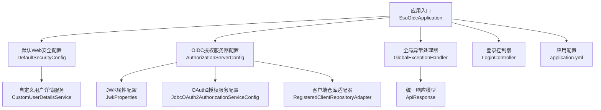
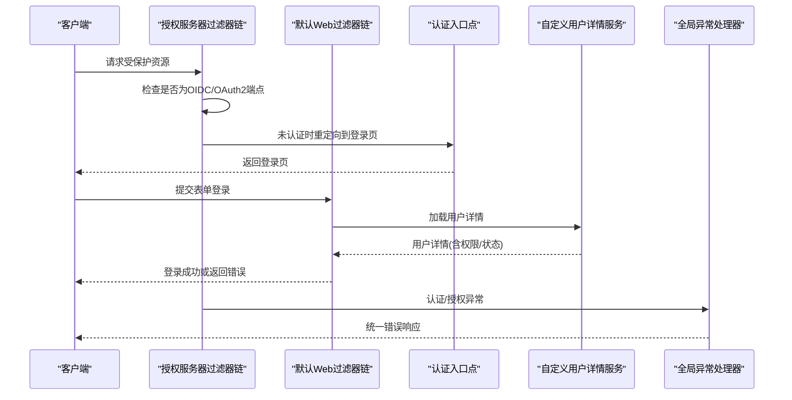
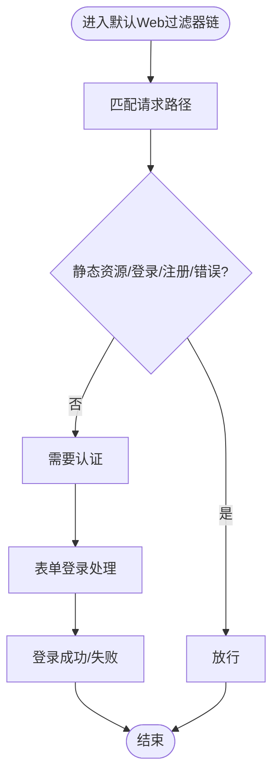
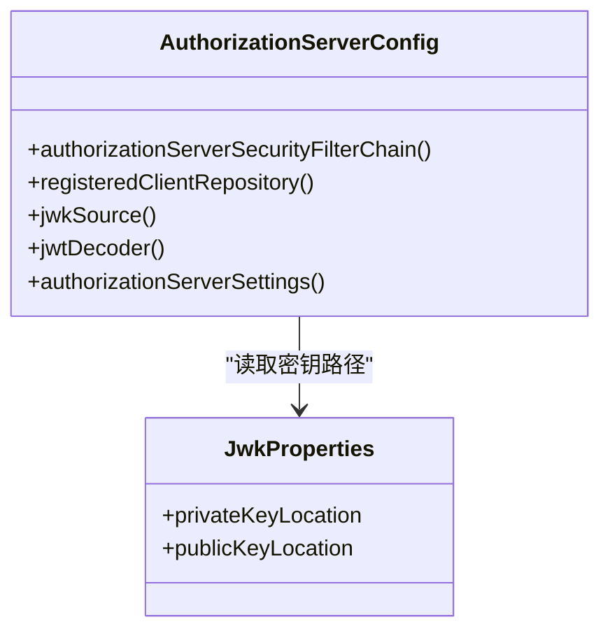
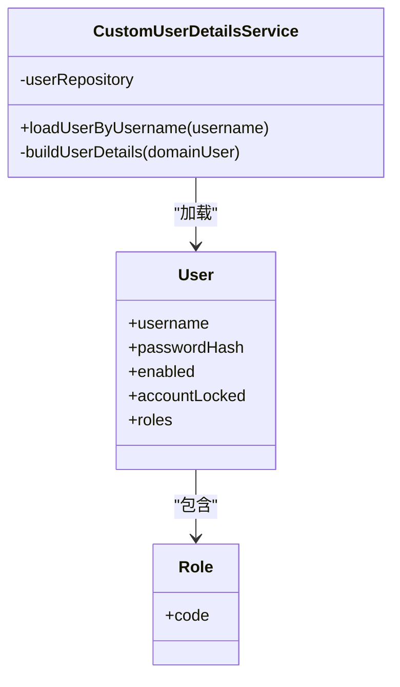
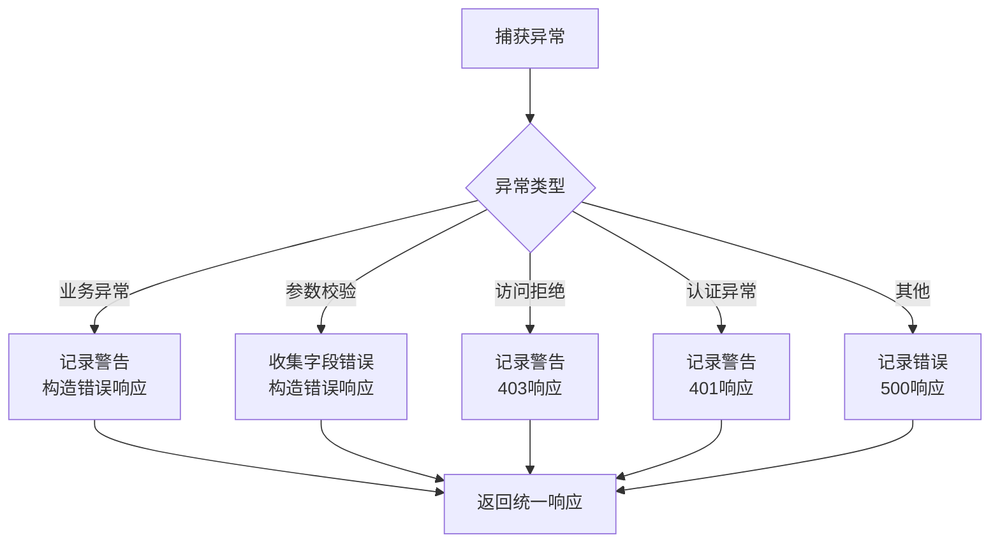
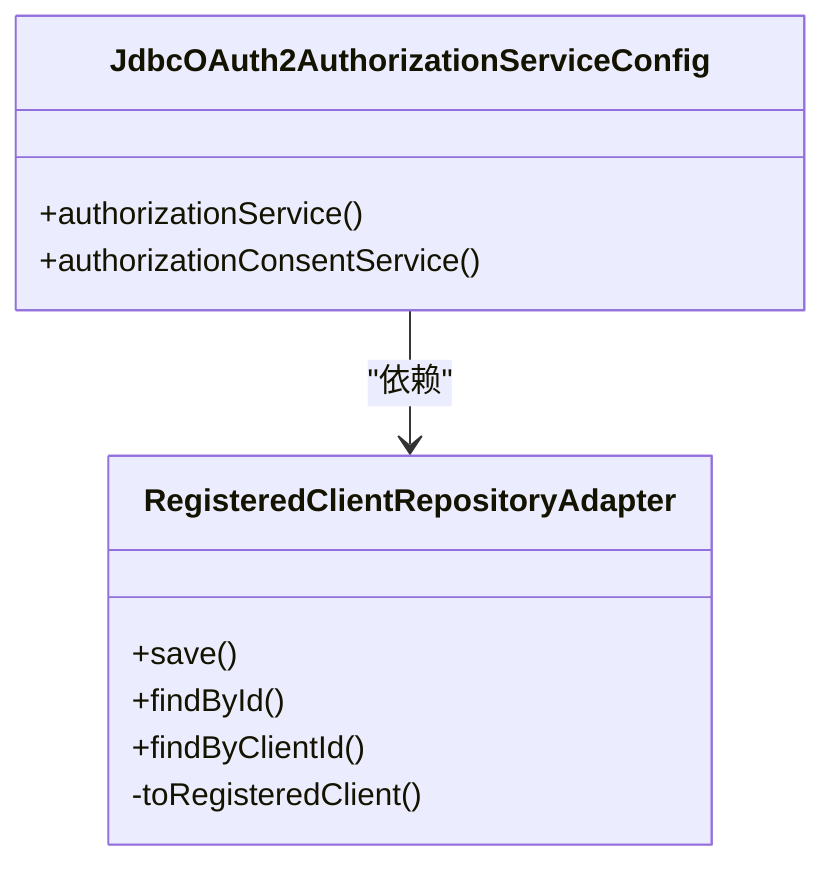
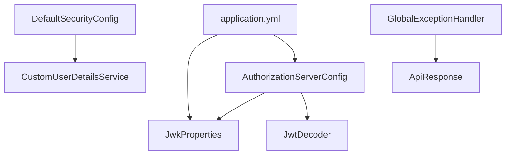

# 安全过滤器

<cite>
**本文引用的文件**
- [SsoOidcApplication.java](file://src/main/java/sso/oidc/SsoOidcApplication.java)
- [DefaultSecurityConfig.java](file://src/main/java/sso/oidc/infrastructure/config/DefaultSecurityConfig.java)
- [AuthorizationServerConfig.java](file://src/main/java/sso/oidc/infrastructure/config/AuthorizationServerConfig.java)
- [JwkProperties.java](file://src/main/java/sso/oidc/infrastructure/config/JwkProperties.java)
- [CustomUserDetailsService.java](file://src/main/java/sso/oidc/infrastructure/security/CustomUserDetailsService.java)
- [JdbcOAuth2AuthorizationServiceConfig.java](file://src/main/java/sso/oidc/infrastructure/security/JdbcOAuth2AuthorizationServiceConfig.java)
- [RegisteredClientRepositoryAdapter.java](file://src/main/java/sso/oidc/infrastructure/security/RegisteredClientRepositoryAdapter.java)
- [GlobalExceptionHandler.java](file://src/main/java/sso/oidc/interfaces/rest/common/GlobalExceptionHandler.java)
- [LoginController.java](file://src/main/java/sso/oidc/interfaces/web/LoginController.java)
- [application.yml](file://src/main/resources/application.yml)
- [ApiResponse.java](file://src/main/java/sso/oidc/interfaces/rest/common/ApiResponse.java)
- [User.java](file://src/main/java/sso/oidc/domain/model/entity/User.java)
- [Role.java](file://src/main/java/sso/oidc/domain/model/entity/Role.java)
</cite>

## 目录
1. [简介](#简介)
2. [项目结构](#项目结构)
3. [核心组件](#核心组件)
4. [架构总览](#架构总览)
5. [详细组件分析](#详细组件分析)
6. [依赖分析](#依赖分析)
7. [性能考虑](#性能考虑)
8. [故障排除指南](#故障排除指南)
9. [结论](#结论)
10. [附录](#附录)

## 简介
本文件面向IAM Platform认证服务的安全过滤器配置，系统性梳理Spring Security过滤器链的配置与执行顺序，覆盖CSRF保护、CORS配置、HTTP安全头设置；深入说明自定义用户详情服务的实现（用户加载、权限继承、账户状态验证）；阐述全局异常处理器的安全配置（异常分类、错误响应格式、敏感信息过滤）；解释认证与授权过滤器的配置（表单登录、JWT令牌验证、OAuth2资源访问控制）；并提供安全头部配置建议（如HSTS、X-Frame-Options、X-Content-Type-Options等），以及安全审计与日志记录配置要点。

## 项目结构
本项目采用分层架构：应用入口位于顶层类，安全配置分别在两个独立的配置类中定义，分别负责OIDC授权服务器与默认Web安全；用户详情服务与OAuth2相关组件位于基础设施层；全局异常处理位于接口层公共模块；配置参数集中在application.yml中。

图表来源
- [SsoOidcApplication.java:1-13](file://src/main/java/sso/oidc/SsoOidcApplication.java#L1-L13)
- [DefaultSecurityConfig.java:1-44](file://src/main/java/sso/oidc/infrastructure/config/DefaultSecurityConfig.java#L1-L44)
- [AuthorizationServerConfig.java:1-144](file://src/main/java/sso/oidc/infrastructure/config/AuthorizationServerConfig.java#L1-L144)
- [JwkProperties.java:1-16](file://src/main/java/sso/oidc/infrastructure/config/JwkProperties.java#L1-L16)
- [CustomUserDetailsService.java:1-36](file://src/main/java/sso/oidc/infrastructure/security/CustomUserDetailsService.java#L1-L36)
- [JdbcOAuth2AuthorizationServiceConfig.java:1-27](file://src/main/java/sso/oidc/infrastructure/security/JdbcOAuth2AuthorizationServiceConfig.java#L1-L27)
- [RegisteredClientRepositoryAdapter.java:1-73](file://src/main/java/sso/oidc/infrastructure/security/RegisteredClientRepositoryAdapter.java#L1-L73)
- [GlobalExceptionHandler.java:1-67](file://src/main/java/sso/oidc/interfaces/rest/common/GlobalExceptionHandler.java#L1-L67)
- [LoginController.java:1-14](file://src/main/java/sso/oidc/interfaces/web/LoginController.java#L1-L14)
- [application.yml:1-78](file://src/main/resources/application.yml#L1-L78)
- [ApiResponse.java:1-61](file://src/main/java/sso/oidc/interfaces/rest/common/ApiResponse.java#L1-L61)

章节来源
- [SsoOidcApplication.java:1-13](file://src/main/java/sso/oidc/SsoOidcApplication.java#L1-L13)
- [application.yml:1-78](file://src/main/resources/application.yml#L1-L78)

## 核心组件
- 默认Web安全过滤器链：负责静态资源放行、登录页与注册页放行、表单登录、登出、密码编码器等。
- 授权服务器安全过滤器链：启用OAuth2授权服务器默认安全、OIDC支持、JWT资源访问控制、认证入口点等。
- 自定义用户详情服务：从领域模型加载用户、映射角色为权限、处理账户启用/锁定状态。
- 全局异常处理器：对业务异常、访问拒绝、认证失败、通用异常进行统一响应与日志记录。
- OAuth2相关组件：JDBC授权服务与授权同意服务、客户端仓库适配器。
- 应用配置：JWK密钥位置、加密密钥、发行者URI等。

章节来源
- [DefaultSecurityConfig.java:18-42](file://src/main/java/sso/oidc/infrastructure/config/DefaultSecurityConfig.java#L18-L42)
- [AuthorizationServerConfig.java:49-124](file://src/main/java/sso/oidc/infrastructure/config/AuthorizationServerConfig.java#L49-L124)
- [CustomUserDetailsService.java:17-35](file://src/main/java/sso/oidc/infrastructure/security/CustomUserDetailsService.java#L17-L35)
- [GlobalExceptionHandler.java:18-66](file://src/main/java/sso/oidc/interfaces/rest/common/GlobalExceptionHandler.java#L18-L66)
- [JdbcOAuth2AuthorizationServiceConfig.java:13-26](file://src/main/java/sso/oidc/infrastructure/security/JdbcOAuth2AuthorizationServiceConfig.java#L13-L26)
- [RegisteredClientRepositoryAdapter.java:18-72](file://src/main/java/sso/oidc/infrastructure/security/RegisteredClientRepositoryAdapter.java#L18-L72)
- [JwkProperties.java:12-15](file://src/main/java/sso/oidc/infrastructure/config/JwkProperties.java#L12-L15)
- [application.yml:48-55](file://src/main/resources/application.yml#L48-L55)

## 架构总览
下图展示安全过滤器链的执行顺序与职责划分：授权服务器过滤器链优先级更高，负责OIDC/OAuth2流程；默认Web过滤器链负责静态资源与表单登录等。

图表来源
- [AuthorizationServerConfig.java:50-66](file://src/main/java/sso/oidc/infrastructure/config/AuthorizationServerConfig.java#L50-L66)
- [DefaultSecurityConfig.java:20-37](file://src/main/java/sso/oidc/infrastructure/config/DefaultSecurityConfig.java#L20-L37)
- [LoginController.java:9-12](file://src/main/java/sso/oidc/interfaces/web/LoginController.java#L9-L12)
- [CustomUserDetailsService.java:22-34](file://src/main/java/sso/oidc/infrastructure/security/CustomUserDetailsService.java#L22-L34)
- [GlobalExceptionHandler.java:50-56](file://src/main/java/sso/oidc/interfaces/rest/common/GlobalExceptionHandler.java#L50-L56)

## 详细组件分析

### 默认Web安全过滤器链（表单登录与静态资源）
- 匹配路径：登录页、注册页、授权同意页及静态资源、错误页面。
- 授权策略：静态资源与登录/注册页放行，其余请求需认证。
- 表单登录：指定登录页、成功跳转、允许所有访问。
- 登出：登出成功后跳转至登录页。
- 密码编码器：使用BCrypt。

图表来源
- [DefaultSecurityConfig.java:20-37](file://src/main/java/sso/oidc/infrastructure/config/DefaultSecurityConfig.java#L20-L37)

章节来源
- [DefaultSecurityConfig.java:18-42](file://src/main/java/sso/oidc/infrastructure/config/DefaultSecurityConfig.java#L18-L42)

### 授权服务器安全过滤器链（OIDC/OAuth2与JWT）
- 优先级：高于默认Web过滤器链。
- 启用OAuth2授权服务器默认安全。
- 启用OIDC功能。
- HTML请求的认证入口点：未认证时重定向到登录页。
- JWT资源服务器：启用JWT校验。
- JWK源：基于PEM密钥生成RSA JWK集，供JWT解码器使用。
- 发行者URI：来自配置。

图表来源
- [AuthorizationServerConfig.java:49-124](file://src/main/java/sso/oidc/infrastructure/config/AuthorizationServerConfig.java#L49-L124)
- [JwkProperties.java:12-15](file://src/main/java/sso/oidc/infrastructure/config/JwkProperties.java#L12-L15)

章节来源
- [AuthorizationServerConfig.java:49-124](file://src/main/java/sso/oidc/infrastructure/config/AuthorizationServerConfig.java#L49-L124)

### 自定义用户详情服务（用户加载、权限继承、账户状态）
- 用户加载：通过用户名查询领域用户实体。
- 权限映射：将角色编码映射为简单权限。
- 账户状态：根据启用/锁定状态设置用户禁用/锁定标志。
- 异常处理：未找到用户时抛出用户名不存在异常。

图表来源
- [CustomUserDetailsService.java:17-35](file://src/main/java/sso/oidc/infrastructure/security/CustomUserDetailsService.java#L17-L35)
- [User.java:16-35](file://src/main/java/sso/oidc/domain/model/entity/User.java#L16-L35)
- [Role.java:14-22](file://src/main/java/sso/oidc/domain/model/entity/Role.java#L14-L22)

章节来源
- [CustomUserDetailsService.java:17-35](file://src/main/java/sso/oidc/infrastructure/security/CustomUserDetailsService.java#L17-L35)
- [User.java:16-35](file://src/main/java/sso/oidc/domain/model/entity/User.java#L16-L35)
- [Role.java:14-22](file://src/main/java/sso/oidc/domain/model/entity/Role.java#L14-L22)

### 全局异常处理器（异常分类、错误响应格式、敏感信息过滤）
- 业务异常：记录警告日志，按异常状态码返回统一错误响应。
- 参数校验异常：收集字段错误，返回统一错误响应。
- 访问拒绝异常：记录警告日志，返回403。
- 认证异常：记录警告日志，返回401。
- 通用异常：记录错误日志，返回500。
- 错误响应模型：包含状态码、消息、数据、字段错误列表与时间戳，非空字段包含。

图表来源
- [GlobalExceptionHandler.java:18-66](file://src/main/java/sso/oidc/interfaces/rest/common/GlobalExceptionHandler.java#L18-L66)
- [ApiResponse.java:18-50](file://src/main/java/sso/oidc/interfaces/rest/common/ApiResponse.java#L18-L50)

章节来源
- [GlobalExceptionHandler.java:18-66](file://src/main/java/sso/oidc/interfaces/rest/common/GlobalExceptionHandler.java#L18-L66)
- [ApiResponse.java:18-50](file://src/main/java/sso/oidc/interfaces/rest/common/ApiResponse.java#L18-L50)

### OAuth2相关组件（授权服务与客户端仓库适配器）
- 授权服务：基于JDBC存储授权与授权同意信息。
- 客户端仓库适配器：将领域客户端模型转换为RegisteredClient，支持多种授权方式、范围、令牌设置与客户端设置。

图表来源
- [JdbcOAuth2AuthorizationServiceConfig.java:13-26](file://src/main/java/sso/oidc/infrastructure/security/JdbcOAuth2AuthorizationServiceConfig.java#L13-L26)
- [RegisteredClientRepositoryAdapter.java:18-72](file://src/main/java/sso/oidc/infrastructure/security/RegisteredClientRepositoryAdapter.java#L18-L72)

章节来源
- [JdbcOAuth2AuthorizationServiceConfig.java:13-26](file://src/main/java/sso/oidc/infrastructure/security/JdbcOAuth2AuthorizationServiceConfig.java#L13-L26)
- [RegisteredClientRepositoryAdapter.java:18-72](file://src/main/java/sso/oidc/infrastructure/security/RegisteredClientRepositoryAdapter.java#L18-L72)

### 登录控制器与静态资源
- 登录控制器：提供登录页GET端点。
- 默认Web过滤器链已配置静态资源放行与登录页放行。

章节来源
- [LoginController.java:9-12](file://src/main/java/sso/oidc/interfaces/web/LoginController.java#L9-L12)
- [DefaultSecurityConfig.java:20-37](file://src/main/java/sso/oidc/infrastructure/config/DefaultSecurityConfig.java#L20-L37)

## 依赖分析
- 过滤器链优先级：授权服务器过滤器链优先级高于默认Web过滤器链，确保OIDC/OAuth2流程优先处理。
- 用户详情服务依赖：通过领域仓储加载用户，映射为Spring Security用户对象。
- 异常处理器：作为@RestControllerAdvice全局生效，统一输出格式。
- 配置依赖：JWK属性与应用配置共同决定JWT密钥与发行者URI。

图表来源
- [AuthorizationServerConfig.java:47-48](file://src/main/java/sso/oidc/infrastructure/config/AuthorizationServerConfig.java#L47-L48)
- [JwkProperties.java:12-15](file://src/main/java/sso/oidc/infrastructure/config/JwkProperties.java#L12-L15)
- [DefaultSecurityConfig.java:19-42](file://src/main/java/sso/oidc/infrastructure/config/DefaultSecurityConfig.java#L19-L42)
- [CustomUserDetailsService.java:19-24](file://src/main/java/sso/oidc/infrastructure/security/CustomUserDetailsService.java#L19-L24)
- [GlobalExceptionHandler.java:18-66](file://src/main/java/sso/oidc/interfaces/rest/common/GlobalExceptionHandler.java#L18-L66)
- [ApiResponse.java:18-50](file://src/main/java/sso/oidc/interfaces/rest/common/ApiResponse.java#L18-L50)
- [application.yml:48-55](file://src/main/resources/application.yml#L48-L55)

章节来源
- [AuthorizationServerConfig.java:47-48](file://src/main/java/sso/oidc/infrastructure/config/AuthorizationServerConfig.java#L47-L48)
- [DefaultSecurityConfig.java:19-42](file://src/main/java/sso/oidc/infrastructure/config/DefaultSecurityConfig.java#L19-L42)
- [GlobalExceptionHandler.java:18-66](file://src/main/java/sso/oidc/interfaces/rest/common/GlobalExceptionHandler.java#L18-L66)
- [application.yml:48-55](file://src/main/resources/application.yml#L48-L55)

## 性能考虑
- 密码编码器：使用BCrypt，强度高但计算开销较大，建议结合合理的并发与缓存策略。
- JWT解码：JWK源一次性构建，避免频繁I/O；生产环境建议使用硬件安全模块或密钥管理服务。
- 数据库连接池：应用配置中已设置连接池参数，建议结合监控指标调整。
- 缓存与会话：Redis用于会话存储，建议开启连接池与超时配置以提升性能。

## 故障排除指南
- 认证失败：检查登录控制器映射与默认Web过滤器链的登录页配置；查看全局异常处理器对认证异常的统一响应。
- 访问被拒：确认用户权限映射与角色编码；检查授权服务器过滤器链是否正确识别请求。
- 业务异常：查看业务异常状态码与消息，核对异常处理器的日志输出。
- JWT解码失败：检查JWK密钥路径与PEM格式；确认发行者URI与客户端配置一致。
- OAuth2客户端：确认客户端仓库适配器转换逻辑与数据库中的客户端配置一致。

章节来源
- [LoginController.java:9-12](file://src/main/java/sso/oidc/interfaces/web/LoginController.java#L9-L12)
- [DefaultSecurityConfig.java:20-37](file://src/main/java/sso/oidc/infrastructure/config/DefaultSecurityConfig.java#L20-L37)
- [GlobalExceptionHandler.java:50-56](file://src/main/java/sso/oidc/interfaces/rest/common/GlobalExceptionHandler.java#L50-L56)
- [AuthorizationServerConfig.java:95-117](file://src/main/java/sso/oidc/infrastructure/config/AuthorizationServerConfig.java#L95-L117)
- [RegisteredClientRepositoryAdapter.java:41-71](file://src/main/java/sso/oidc/infrastructure/security/RegisteredClientRepositoryAdapter.java#L41-L71)

## 结论
本项目通过双过滤器链设计实现了清晰的职责分离：授权服务器过滤器链专注于OIDC/OAuth2流程与JWT资源访问控制，而默认Web过滤器链负责静态资源与表单登录。自定义用户详情服务将领域模型与Spring Security权限体系无缝衔接，并由全局异常处理器提供统一的安全响应与日志记录。配合JDBC授权服务与客户端仓库适配器，整体安全架构具备可扩展性与生产可用性。

## 附录
- 安全头部配置建议（概念性说明）
  - HSTS：在反向代理或网关层启用严格传输安全，避免降级到HTTP。
  - X-Frame-Options：防止点击劫持，建议设置为DENY或SAMEORIGIN。
  - X-Content-Type-Options：阻止MIME嗅探，建议设置为nosniff。
  - Content-Security-Policy：限制资源加载来源，降低XSS风险。
  - Referrer-Policy：控制Referrer信息泄露。
  - 以上建议为通用实践，具体实现应结合部署环境与反向代理配置。