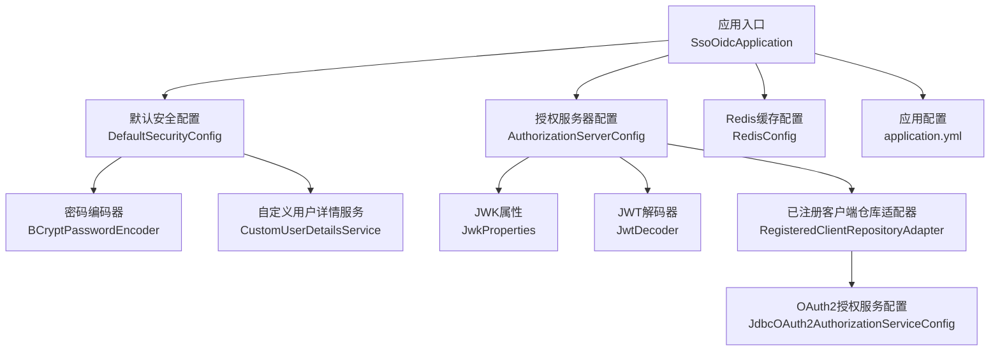
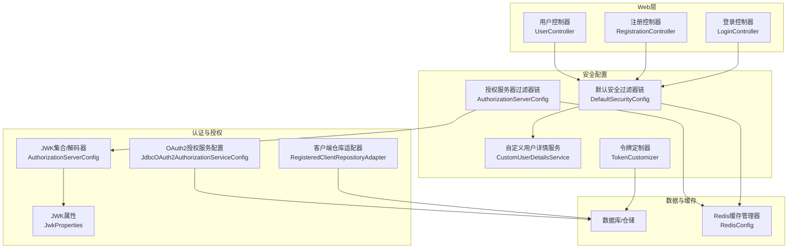
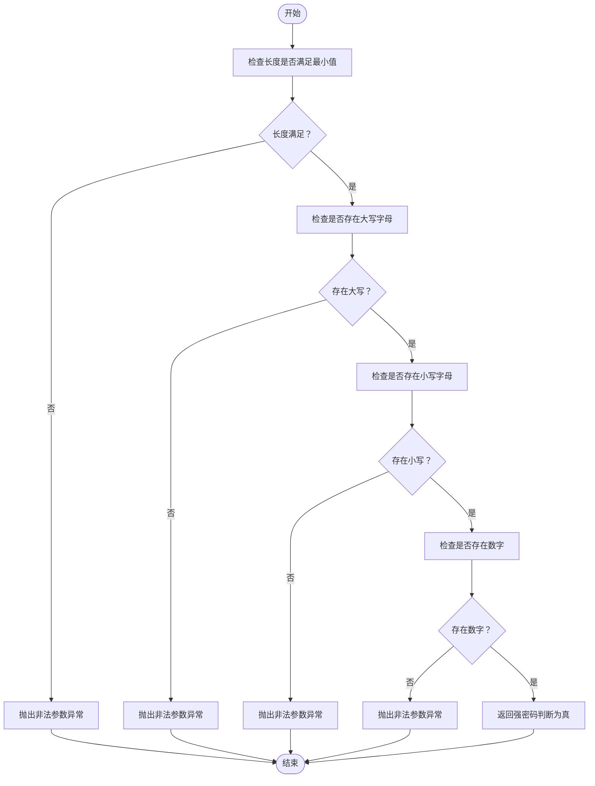
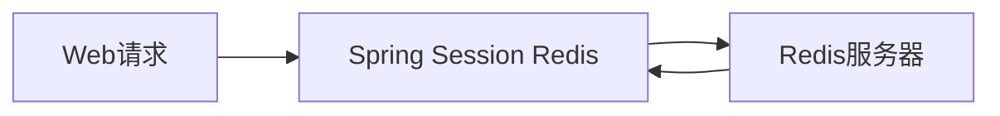
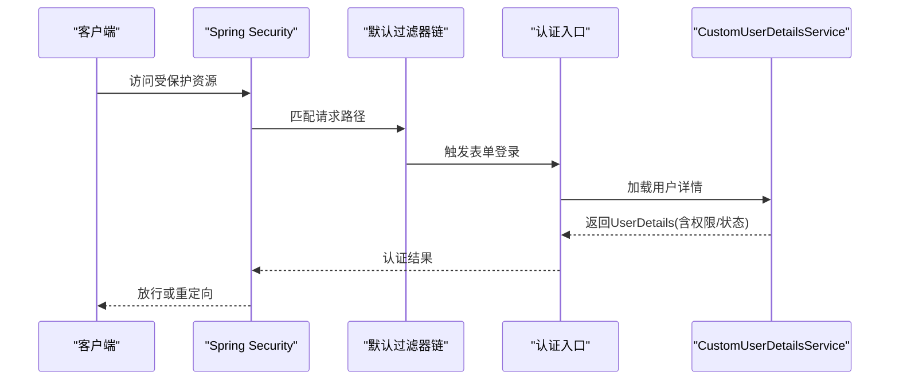
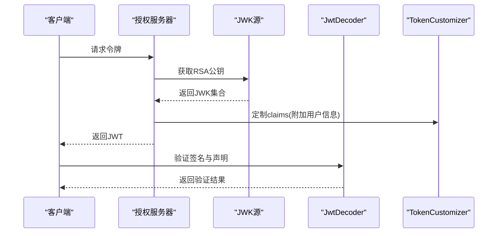
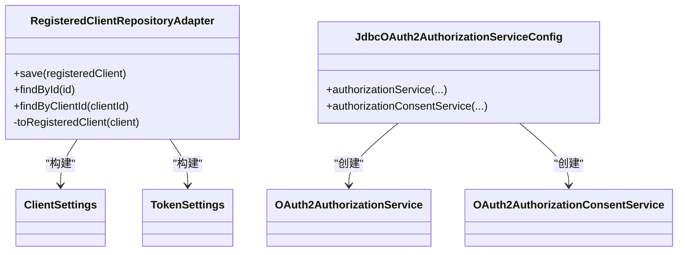
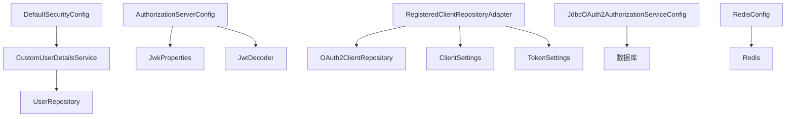

# 安全配置

<cite>
**本文引用的文件**
- [AuthorizationServerConfig.java](file://src/main/java/sso/oidc/infrastructure/config/AuthorizationServerConfig.java)
- [DefaultSecurityConfig.java](file://src/main/java/sso/oidc/infrastructure/config/DefaultSecurityConfig.java)
- [RedisConfig.java](file://src/main/java/sso/oidc/infrastructure/config/RedisConfig.java)
- [JwkProperties.java](file://src/main/java/sso/oidc/infrastructure/config/JwkProperties.java)
- [application.yml](file://src/main/resources/application.yml)
- [PasswordPolicyService.java](file://src/main/java/sso/oidc/domain/service/PasswordPolicyService.java)
- [CustomUserDetailsService.java](file://src/main/java/sso/oidc/infrastructure/security/CustomUserDetailsService.java)
- [TokenCustomizer.java](file://src/main/java/sso/oidc/infrastructure/security/TokenCustomizer.java)
- [JdbcOAuth2AuthorizationServiceConfig.java](file://src/main/java/sso/oidc/infrastructure/security/JdbcOAuth2AuthorizationServiceConfig.java)
- [RegisteredClientRepositoryAdapter.java](file://src/main/java/sso/oidc/infrastructure/security/RegisteredClientRepositoryAdapter.java)
- [UserController.java](file://src/main/java/sso/oidc/interfaces/rest/UserController.java)
- [RegistrationController.java](file://src/main/java/sso/oidc/interfaces/web/RegistrationController.java)
- [LoginController.java](file://src/main/java/sso/oidc/interfaces/web/LoginController.java)
- [SsoOidcApplication.java](file://src/main/java/sso/oidc/SsoOidcApplication.java)
</cite>

## 目录
1. [简介](#简介)
2. [项目结构](#项目结构)
3. [核心组件](#核心组件)
4. [架构总览](#架构总览)
5. [详细组件分析](#详细组件分析)
6. [依赖分析](#依赖分析)
7. [性能考虑](#性能考虑)
8. [故障排查指南](#故障排查指南)
9. [结论](#结论)
10. [附录](#附录)

## 简介
本文件面向IAM Platform认证服务的安全配置，围绕以下主题展开：密码策略（BCrypt加密、密码强度校验、密码过期策略）、会话管理（Redis缓存、会话存储与超时、分布式会话）、Spring Security过滤器链与自定义用户详情服务、JWT令牌生成与验证（RS256签名、Claims扩展）、OAuth2.0授权服务器配置（PKCE、令牌生命周期、客户端认证）、以及安全最佳实践与审计监控。文档以代码为依据，结合架构图与流程图帮助读者快速理解与落地。

## 项目结构
本项目采用分层+领域驱动设计，安全相关配置集中在基础设施层的config与security包中，并通过YAML配置文件集中管理安全参数。应用入口位于启动类，Web控制器负责登录、注册与用户管理REST接口。

图表来源
- [SsoOidcApplication.java:1-13](file://src/main/java/sso/oidc/SsoOidcApplication.java#L1-L13)
- [DefaultSecurityConfig.java:1-44](file://src/main/java/sso/oidc/infrastructure/config/DefaultSecurityConfig.java#L1-L44)
- [AuthorizationServerConfig.java:1-143](file://src/main/java/sso/oidc/infrastructure/config/AuthorizationServerConfig.java#L1-L143)
- [JwkProperties.java:1-16](file://src/main/java/sso/oidc/infrastructure/config/JwkProperties.java#L1-L16)
- [RedisConfig.java:1-34](file://src/main/java/sso/oidc/infrastructure/config/RedisConfig.java#L1-L34)
- [application.yml:1-78](file://src/main/resources/application.yml#L1-L78)

章节来源
- [SsoOidcApplication.java:1-13](file://src/main/java/sso/oidc/SsoOidcApplication.java#L1-L13)
- [application.yml:1-78](file://src/main/resources/application.yml#L1-L78)

## 核心组件
- 密码策略与BCrypt
  - 使用BCryptPasswordEncoder作为全局密码编码器，确保密码以BCrypt哈希形式存储与比对。
  - 提供PasswordPolicyService进行基础强度校验（长度、大小写、数字），可作为业务层入参校验补充。
- 会话管理
  - 启用Redis存储会话，通过application.yml中的session.store-type: redis启用；Redis缓存配置用于通用缓存场景（非会话存储）。
- Spring Security过滤器链
  - 默认过滤器链覆盖登录、注册、静态资源与错误页面；授权服务器过滤器链启用OIDC默认安全与JWT资源访问。
- JWT与JWK
  - 基于RSA密钥对生成JWK集合，使用RS256签名算法；提供JwtDecoder与AuthorizationServerSettings。
- OAuth2.0授权服务器
  - 已注册客户端在内存中初始化示例；生产环境通过RegisteredClientRepositoryAdapter从数据库读取；支持PKCE与授权同意流程；令牌生命周期可按客户端配置。
- 自定义用户详情服务
  - CustomUserDetailsService从领域仓储加载用户，构建Spring Security UserDetails，映射角色权限。

章节来源
- [DefaultSecurityConfig.java:39-42](file://src/main/java/sso/oidc/infrastructure/config/DefaultSecurityConfig.java#L39-L42)
- [PasswordPolicyService.java:1-35](file://src/main/java/sso/oidc/domain/service/PasswordPolicyService.java#L1-L35)
- [application.yml:45-46](file://src/main/resources/application.yml#L45-L46)
- [RedisConfig.java:19-32](file://src/main/java/sso/oidc/infrastructure/config/RedisConfig.java#L19-L32)
- [AuthorizationServerConfig.java:49-66](file://src/main/java/sso/oidc/infrastructure/config/AuthorizationServerConfig.java#L49-L66)
- [AuthorizationServerConfig.java:93-123](file://src/main/java/sso/oidc/infrastructure/config/AuthorizationServerConfig.java#L93-L123)
- [JwkProperties.java:1-16](file://src/main/java/sso/oidc/infrastructure/config/JwkProperties.java#L1-L16)
- [CustomUserDetailsService.java:17-39](file://src/main/java/sso/oidc/infrastructure/security/CustomUserDetailsService.java#L17-L39)

## 架构总览
下图展示安全相关组件之间的交互关系：Spring Security过滤器链、授权服务器、JWT/JWK、Redis、数据库与仓储。

图表来源
- [LoginController.java:1-14](file://src/main/java/sso/oidc/interfaces/web/LoginController.java#L1-L14)
- [RegistrationController.java:1-43](file://src/main/java/sso/oidc/interfaces/web/RegistrationController.java#L1-L43)
- [UserController.java:1-90](file://src/main/java/sso/oidc/interfaces/rest/UserController.java#L1-L90)
- [DefaultSecurityConfig.java:18-37](file://src/main/java/sso/oidc/infrastructure/config/DefaultSecurityConfig.java#L18-L37)
- [AuthorizationServerConfig.java:49-123](file://src/main/java/sso/oidc/infrastructure/config/AuthorizationServerConfig.java#L49-L123)
- [JwkProperties.java:1-16](file://src/main/java/sso/oidc/infrastructure/config/JwkProperties.java#L1-L16)
- [JdbcOAuth2AuthorizationServiceConfig.java:1-27](file://src/main/java/sso/oidc/infrastructure/security/JdbcOAuth2AuthorizationServiceConfig.java#L1-L27)
- [RegisteredClientRepositoryAdapter.java:1-73](file://src/main/java/sso/oidc/infrastructure/security/RegisteredClientRepositoryAdapter.java#L1-L73)
- [RedisConfig.java:19-32](file://src/main/java/sso/oidc/infrastructure/config/RedisConfig.java#L19-L32)

## 详细组件分析

### 密码策略与BCrypt
- 实现要点
  - 全局密码编码器：使用BCryptPasswordEncoder，确保密码入库前被哈希处理。
  - 强度校验：PasswordPolicyService提供最小长度、大小写字母、数字要求，可作为业务层入参校验。
  - 密码过期策略：当前未见专门的密码过期实现，可在User实体与仓储中扩展字段并在登录或访问控制时检查。
- 关键路径
  - 编码器Bean定义：[DefaultSecurityConfig.java:39-42](file://src/main/java/sso/oidc/infrastructure/config/DefaultSecurityConfig.java#L39-L42)
  - 强度校验服务：[PasswordPolicyService.java:1-35](file://src/main/java/sso/oidc/domain/service/PasswordPolicyService.java#L1-L35)

图表来源
- [PasswordPolicyService.java:11-24](file://src/main/java/sso/oidc/domain/service/PasswordPolicyService.java#L11-L24)

章节来源
- [DefaultSecurityConfig.java:39-42](file://src/main/java/sso/oidc/infrastructure/config/DefaultSecurityConfig.java#L39-L42)
- [PasswordPolicyService.java:1-35](file://src/main/java/sso/oidc/domain/service/PasswordPolicyService.java#L1-L35)

### 会话管理与Redis缓存
- 会话存储
  - application.yml启用session.store-type: redis，将HTTP Session存储到Redis，实现多实例间的会话共享与高可用。
- 缓存配置
  - RedisConfig提供通用缓存管理器，设置默认TTL、序列化方式与禁用空值缓存，适用于业务缓存而非会话存储。
- 分布式会话同步
  - 通过Redis实现会话跨节点同步；需确保Redis连接工厂正确配置且网络稳定。

图表来源
- [application.yml:45-46](file://src/main/resources/application.yml#L45-L46)
- [RedisConfig.java:19-32](file://src/main/java/sso/oidc/infrastructure/config/RedisConfig.java#L19-L32)

章节来源
- [application.yml:45-46](file://src/main/resources/application.yml#L45-L46)
- [RedisConfig.java:19-32](file://src/main/java/sso/oidc/infrastructure/config/RedisConfig.java#L19-L32)

### Spring Security过滤器链与自定义用户详情服务
- 过滤器链
  - 默认过滤器链匹配登录、注册、静态资源与错误端点，未认证访问将重定向至登录页。
  - 授权服务器过滤器链启用OIDC默认安全、登录入口与JWT资源服务器。
- 自定义用户详情服务
  - CustomUserDetailsService根据用户名查询领域用户，构建UserDetails并映射角色权限；账户状态（启用/锁定）也参与认证决策。

图表来源
- [DefaultSecurityConfig.java:18-37](file://src/main/java/sso/oidc/infrastructure/config/DefaultSecurityConfig.java#L18-L37)
- [CustomUserDetailsService.java:21-39](file://src/main/java/sso/oidc/infrastructure/security/CustomUserDetailsService.java#L21-L39)

章节来源
- [DefaultSecurityConfig.java:18-37](file://src/main/java/sso/oidc/infrastructure/config/DefaultSecurityConfig.java#L18-L37)
- [CustomUserDetailsService.java:17-39](file://src/main/java/sso/oidc/infrastructure/security/CustomUserDetailsService.java#L17-L39)

### JWT令牌生成、验证与Claims
- 签名算法与密钥
  - 使用RSA密钥对生成JWK集合，JwtDecoder基于JWK Source解析JWT，签名算法为RS256。
  - JwkProperties从配置文件读取私钥与公钥位置。
- Issuer与解码器
  - AuthorizationServerSettings从配置注入issuer，JwtDecoder由授权服务器配置提供。
- Claims扩展
  - TokenCustomizer在生成JWT时向claims添加email、nickname与roles，便于前端/客户端消费。

图表来源
- [AuthorizationServerConfig.java:93-123](file://src/main/java/sso/oidc/infrastructure/config/AuthorizationServerConfig.java#L93-L123)
- [JwkProperties.java:1-16](file://src/main/java/sso/oidc/infrastructure/config/JwkProperties.java#L1-L16)
- [TokenCustomizer.java:18-29](file://src/main/java/sso/oidc/infrastructure/security/TokenCustomizer.java#L18-L29)

章节来源
- [AuthorizationServerConfig.java:93-123](file://src/main/java/sso/oidc/infrastructure/config/AuthorizationServerConfig.java#L93-L123)
- [JwkProperties.java:1-16](file://src/main/java/sso/oidc/infrastructure/config/JwkProperties.java#L1-L16)
- [TokenCustomizer.java:18-29](file://src/main/java/sso/oidc/infrastructure/security/TokenCustomizer.java#L18-L29)

### OAuth2.0授权服务器配置
- 客户端与授权流程
  - 示例客户端在内存中初始化，生产环境通过RegisteredClientRepositoryAdapter从数据库读取，支持多种授权类型与作用域。
- PKCE与授权同意
  - 通过ClientSettings开启requireProofKey与requireAuthorizationConsent，增强授权安全性。
- 令牌生命周期
  - TokenSettings按客户端配置设置access/refresh token TTL；RegisteredClientRepositoryAdapter从实体读取TTL。
- 授权服务持久化
  - JdbcOAuth2AuthorizationServiceConfig使用JDBC持久化授权与授权同意记录，配合Flyway迁移脚本。

图表来源
- [RegisteredClientRepositoryAdapter.java:18-72](file://src/main/java/sso/oidc/infrastructure/security/RegisteredClientRepositoryAdapter.java#L18-L72)
- [JdbcOAuth2AuthorizationServiceConfig.java:13-26](file://src/main/java/sso/oidc/infrastructure/security/JdbcOAuth2AuthorizationServiceConfig.java#L13-L26)

章节来源
- [RegisteredClientRepositoryAdapter.java:18-72](file://src/main/java/sso/oidc/infrastructure/security/RegisteredClientRepositoryAdapter.java#L18-L72)
- [JdbcOAuth2AuthorizationServiceConfig.java:13-26](file://src/main/java/sso/oidc/infrastructure/security/JdbcOAuth2AuthorizationServiceConfig.java#L13-L26)

### 用户管理与密码变更
- 注册与登录
  - RegistrationController处理注册请求，LoginController提供登录页面；二者受默认过滤器链保护。
- 密码变更
  - UserController提供变更密码接口，结合PasswordPolicyService与BCryptPasswordEncoder完成业务校验与持久化。

章节来源
- [RegistrationController.java:27-41](file://src/main/java/sso/oidc/interfaces/web/RegistrationController.java#L27-L41)
- [LoginController.java:9-12](file://src/main/java/sso/oidc/interfaces/web/LoginController.java#L9-L12)
- [UserController.java:69-74](file://src/main/java/sso/oidc/interfaces/rest/UserController.java#L69-L74)

## 依赖分析
- 组件耦合
  - DefaultSecurityConfig与CustomUserDetailsService耦合于UserRepository，用于加载用户与权限。
  - AuthorizationServerConfig依赖JwkProperties与JwtDecoder，形成JWK与JWT解码闭环。
  - RegisteredClientRepositoryAdapter依赖OAuth2ClientRepository，将领域模型映射为RegisteredClient。
- 外部依赖
  - Redis用于会话存储与通用缓存。
  - PostgreSQL用于用户与客户端数据持久化，Flyway管理迁移。
  - Zipkin用于分布式追踪，Prometheus/Micrometer用于指标采集。

图表来源
- [DefaultSecurityConfig.java:18-37](file://src/main/java/sso/oidc/infrastructure/config/DefaultSecurityConfig.java#L18-L37)
- [CustomUserDetailsService.java:19-25](file://src/main/java/sso/oidc/infrastructure/security/CustomUserDetailsService.java#L19-L25)
- [AuthorizationServerConfig.java:49-123](file://src/main/java/sso/oidc/infrastructure/config/AuthorizationServerConfig.java#L49-L123)
- [RegisteredClientRepositoryAdapter.java:20-71](file://src/main/java/sso/oidc/infrastructure/security/RegisteredClientRepositoryAdapter.java#L20-L71)
- [JdbcOAuth2AuthorizationServiceConfig.java:15-25](file://src/main/java/sso/oidc/infrastructure/security/JdbcOAuth2AuthorizationServiceConfig.java#L15-L25)
- [RedisConfig.java:19-32](file://src/main/java/sso/oidc/infrastructure/config/RedisConfig.java#L19-L32)

章节来源
- [DefaultSecurityConfig.java:18-37](file://src/main/java/sso/oidc/infrastructure/config/DefaultSecurityConfig.java#L18-L37)
- [AuthorizationServerConfig.java:49-123](file://src/main/java/sso/oidc/infrastructure/config/AuthorizationServerConfig.java#L49-L123)
- [RegisteredClientRepositoryAdapter.java:20-71](file://src/main/java/sso/oidc/infrastructure/security/RegisteredClientRepositoryAdapter.java#L20-L71)
- [JdbcOAuth2AuthorizationServiceConfig.java:15-25](file://src/main/java/sso/oidc/infrastructure/security/JdbcOAuth2AuthorizationServiceConfig.java#L15-L25)
- [RedisConfig.java:19-32](file://src/main/java/sso/oidc/infrastructure/config/RedisConfig.java#L19-L32)

## 性能考虑
- 密码哈希成本
  - BCrypt默认迭代次数已足够安全，如需调优可通过BCrypt版本参数平衡安全与性能。
- Redis连接与序列化
  - 使用GenericJackson2JsonRedisSerializer时注意对象序列化开销；对频繁读取的用户信息可考虑本地缓存与Redis双层缓存。
- 数据库连接池
  - HikariCP参数已在application.yml中配置，建议结合慢查询日志与连接池指标进行容量评估。
- 令牌TTL
  - AccessToken与RefreshToken TTL应结合业务场景权衡，过短影响用户体验，过长增加泄露风险。

## 故障排查指南
- 登录失败
  - 检查CustomUserDetailsService是否正确加载用户与角色；确认UserRepository查询逻辑与账户状态。
- JWT验证失败
  - 核对JwkProperties中的密钥路径与内容；确认AuthorizationServerSettings的issuer与客户端一致。
- 会话丢失
  - 检查Redis连接配置与网络连通性；确认session.store-type: redis已生效。
- OAuth2授权异常
  - 校验RegisteredClientRepositoryAdapter映射的授权类型、作用域与回调地址；确认PKCE开关与授权同意流程。
- 密码策略报错
  - 调用UserController变更密码接口时，若PasswordPolicyService校验不通过，需调整密码强度。

章节来源
- [CustomUserDetailsService.java:21-39](file://src/main/java/sso/oidc/infrastructure/security/CustomUserDetailsService.java#L21-L39)
- [AuthorizationServerConfig.java:93-123](file://src/main/java/sso/oidc/infrastructure/config/AuthorizationServerConfig.java#L93-L123)
- [application.yml:45-46](file://src/main/resources/application.yml#L45-L46)
- [RegisteredClientRepositoryAdapter.java:41-71](file://src/main/java/sso/oidc/infrastructure/security/RegisteredClientRepositoryAdapter.java#L41-L71)
- [PasswordPolicyService.java:11-24](file://src/main/java/sso/oidc/domain/service/PasswordPolicyService.java#L11-L24)

## 结论
本项目在Spring Security与Spring Authorization Server基础上，实现了BCrypt密码策略、Redis会话存储、JWT RS256签名与Claims扩展、以及可扩展的OAuth2.0授权服务器配置。建议在生产环境中进一步完善密码过期策略、CSRF保护、输入验证与SQL注入/XSS防护、以及安全审计与监控体系，以满足更严格的安全合规要求。

## 附录
- 安全最佳实践建议
  - 输入验证与参数校验：使用Jakarta Validation注解与DTO绑定，避免宽泛的字符串直接进入业务逻辑。
  - 防止SQL注入：统一使用JPA/Hibernate查询与命名参数，避免原生SQL拼接；Flyway迁移脚本保持只读与版本化。
  - XSS防护：模板渲染与响应输出需进行HTML转义；后端接口返回JSON时避免内联脚本。
  - CSRF保护：启用Spring Security默认CSRF保护，AJAX请求携带CSRF令牌。
  - 审计与监控：启用Actuator与Micrometer，集成Zipkin/Prometheus/Grafana；记录登录、密码变更、授权同意等关键事件。
- 配置清单参考
  - Redis会话存储：application.yml中的spring.session.store-type与data.redis.*。
  - JWK密钥：security.jwk.rsa.private-key-location与public-key-location。
  - Issuer与指标：security.issuer-uri、management.metrics.tags.application、management.tracing.sampling.probability。