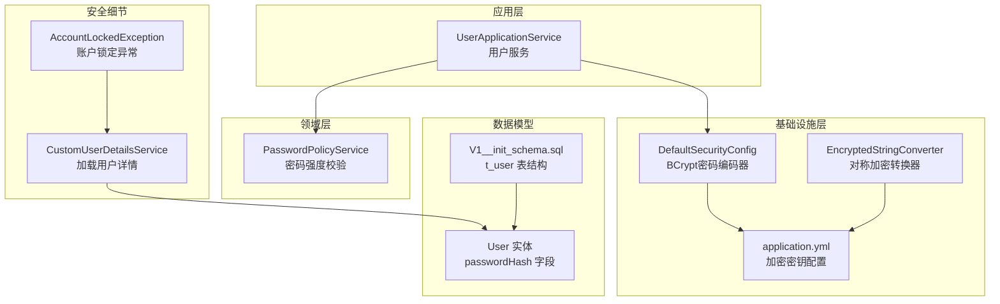
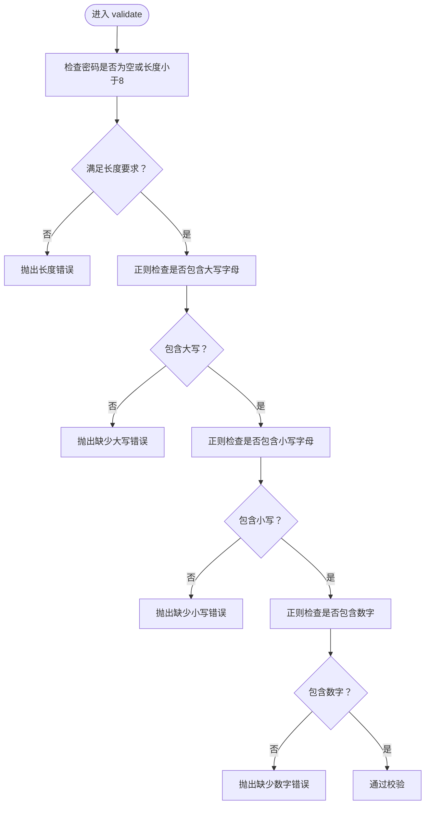
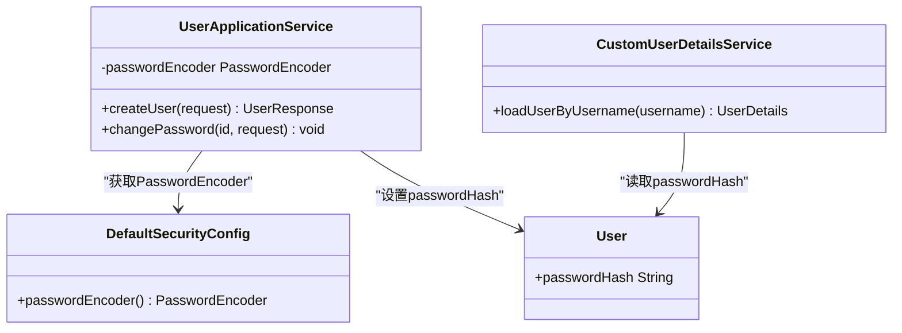
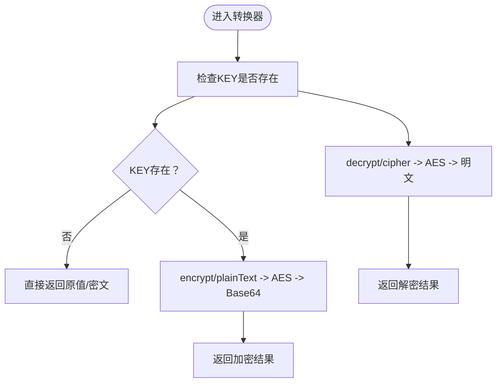
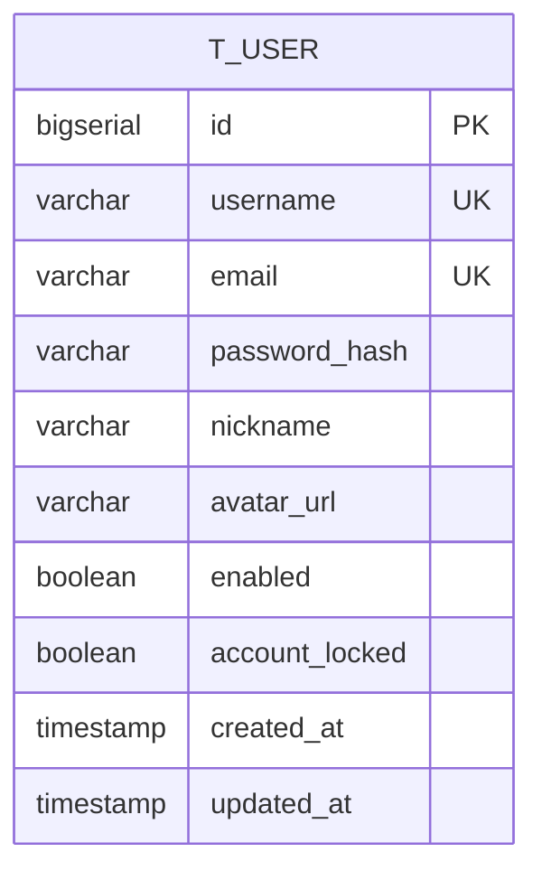
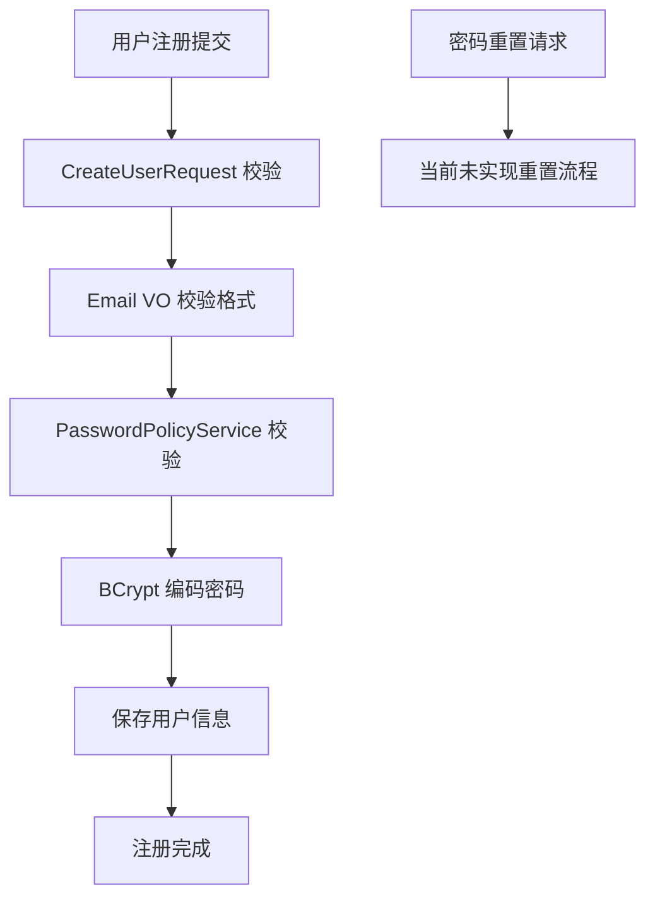
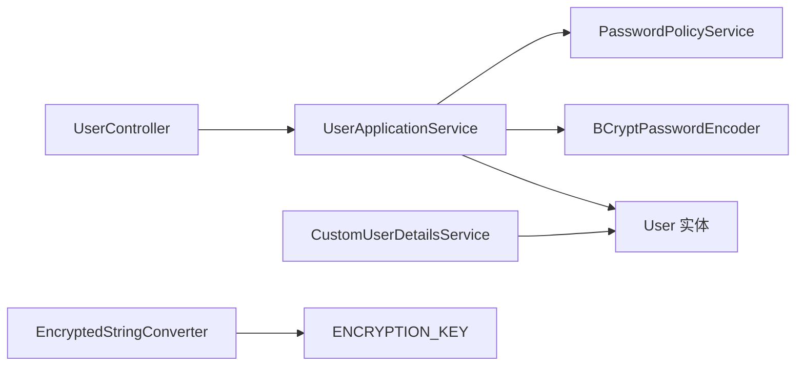

# 密码策略

<cite>
**本文引用的文件**
- [PasswordPolicyService.java](file://src/main/java/sso/oidc/domain/service/PasswordPolicyService.java)
- [UserApplicationService.java](file://src/main/java/sso/oidc/application/service/UserApplicationService.java)
- [DefaultSecurityConfig.java](file://src/main/java/sso/oidc/infrastructure/config/DefaultSecurityConfig.java)
- [application.yml](file://src/main/resources/application.yml)
- [V1__init_schema.sql](file://src/main/resources/db/migration/V1__init_schema.sql)
- [User.java](file://src/main/java/sso/oidc/domain/model/entity/User.java)
- [CustomUserDetailsService.java](file://src/main/java/sso/oidc/infrastructure/security/CustomUserDetailsService.java)
- [AccountLockedException.java](file://src/main/java/sso/oidc/domain/model/exception/AccountLockedException.java)
- [EncryptedStringConverter.java](file://src/main/java/sso/oidc/infrastructure/persistence/converter/EncryptedStringConverter.java)
- [UserController.java](file://src/main/java/sso/oidc/interfaces/rest/UserController.java)
- [CreateUserRequest.java](file://src/main/java/sso/oidc/application/dto/request/CreateUserRequest.java)
- [ChangePasswordRequest.java](file://src/main/java/sso/oidc/application/dto/request/ChangePasswordRequest.java)
- [Email.java](file://src/main/java/sso/oidc/domain/model/valueobject/Email.java)
</cite>

## 目录
1. [引言](#引言)
2. [项目结构](#项目结构)
3. [核心组件](#核心组件)
4. [架构总览](#架构总览)
5. [详细组件分析](#详细组件分析)
6. [依赖分析](#依赖分析)
7. [性能考虑](#性能考虑)
8. [故障排查指南](#故障排查指南)
9. [结论](#结论)
10. [附录](#附录)

## 引言
本文件面向IAM Platform认证服务的密码策略，系统化梳理密码加密、强度校验、过期与历史、重试与锁定、邮箱验证与密码重置等安全机制。当前代码库采用BCrypt进行密码哈希存储，并在应用层实现了基础的密码强度规则；同时数据库表结构中预留了密码过期与历史字段注释，但未在代码中实现具体逻辑。本文将结合源码逐项说明现状、潜在风险与改进建议。

## 项目结构
围绕密码策略的相关模块分布如下：
- 领域层：PasswordPolicyService负责密码强度校验
- 应用层：UserApplicationService在用户创建与修改密码时调用强度校验与BCrypt编码
- 基础设施层：DefaultSecurityConfig定义BCryptPasswordEncoder；application.yml提供加密密钥配置；EncryptedStringConverter用于其他敏感字段的对称加密
- 数据模型：User实体包含passwordHash字段；V1__init_schema.sql定义t_user表及注释
- 安全细节：CustomUserDetailsService从User读取accountLocked状态；AccountLockedException用于账户锁定异常



**图表来源**
- [PasswordPolicyService.java:1-35](file://src/main/java/sso/oidc/domain/service/PasswordPolicyService.java#L1-L35)
- [UserApplicationService.java:1-165](file://src/main/java/sso/oidc/application/service/UserApplicationService.java#L1-L165)
- [DefaultSecurityConfig.java:1-44](file://src/main/java/sso/oidc/infrastructure/config/DefaultSecurityConfig.java#L1-L44)
- [application.yml:1-78](file://src/main/resources/application.yml#L1-L78)
- [EncryptedStringConverter.java:1-52](file://src/main/java/sso/oidc/infrastructure/persistence/converter/EncryptedStringConverter.java#L1-L52)
- [User.java:1-40](file://src/main/java/sso/oidc/domain/model/entity/User.java#L1-L40)
- [V1__init_schema.sql:36-69](file://src/main/resources/db/migration/V1__init_schema.sql#L36-L69)
- [CustomUserDetailsService.java:1-41](file://src/main/java/sso/oidc/infrastructure/security/CustomUserDetailsService.java#L1-L41)
- [AccountLockedException.java:1-9](file://src/main/java/sso/oidc/domain/model/exception/AccountLockedException.java#L1-L9)

**章节来源**
- [PasswordPolicyService.java:1-35](file://src/main/java/sso/oidc/domain/service/PasswordPolicyService.java#L1-L35)
- [UserApplicationService.java:1-165](file://src/main/java/sso/oidc/application/service/UserApplicationService.java#L1-L165)
- [DefaultSecurityConfig.java:1-44](file://src/main/java/sso/oidc/infrastructure/config/DefaultSecurityConfig.java#L1-L44)
- [application.yml:1-78](file://src/main/resources/application.yml#L1-L78)
- [EncryptedStringConverter.java:1-52](file://src/main/java/sso/oidc/infrastructure/persistence/converter/EncryptedStringConverter.java#L1-L52)
- [User.java:1-40](file://src/main/java/sso/oidc/domain/model/entity/User.java#L1-L40)
- [V1__init_schema.sql:36-69](file://src/main/resources/db/migration/V1__init_schema.sql#L36-L69)
- [CustomUserDetailsService.java:1-41](file://src/main/java/sso/oidc/infrastructure/security/CustomUserDetailsService.java#L1-L41)
- [AccountLockedException.java:1-9](file://src/main/java/sso/oidc/domain/model/exception/AccountLockedException.java#L1-L9)

## 核心组件
- 密码强度校验：PasswordPolicyService提供最小长度、大小写字母、数字等基础规则校验
- 密码编码与匹配：DefaultSecurityConfig提供BCryptPasswordEncoder；UserApplicationService在创建/修改密码时使用matches与encode
- 账户锁定：User实体含accountLocked字段；CustomUserDetailsService在构建UserDetails时读取该状态；AccountLockedException用于业务异常
- 对称加密：EncryptedStringConverter基于AES对指定字段进行加解密；application.yml提供ENCRYPTION_KEY环境变量
- 数据模型：t_user表定义password_hash字段，注释明确为“BCrypt哈希密码”，并预留密码过期与历史字段注释

**章节来源**
- [PasswordPolicyService.java:9-24](file://src/main/java/sso/oidc/domain/service/PasswordPolicyService.java#L9-L24)
- [DefaultSecurityConfig.java:39-42](file://src/main/java/sso/oidc/infrastructure/config/DefaultSecurityConfig.java#L39-L42)
- [UserApplicationService.java:45-50](file://src/main/java/sso/oidc/application/service/UserApplicationService.java#L45-L50)
- [UserApplicationService.java:117-122](file://src/main/java/sso/oidc/application/service/UserApplicationService.java#L117-L122)
- [User.java:24](file://src/main/java/sso/oidc/domain/model/entity/User.java#L24)
- [CustomUserDetailsService.java:28-38](file://src/main/java/sso/oidc/infrastructure/security/CustomUserDetailsService.java#L28-L38)
- [AccountLockedException.java:5-8](file://src/main/java/sso/oidc/domain/model/exception/AccountLockedException.java#L5-L8)
- [EncryptedStringConverter.java:9](file://src/main/java/sso/oidc/infrastructure/persistence/converter/EncryptedStringConverter.java#L9)
- [application.yml:54](file://src/main/resources/application.yml#L54)
- [V1__init_schema.sql:63](file://src/main/resources/db/migration/V1__init_schema.sql#L63)

## 架构总览
下图展示密码策略相关组件之间的交互关系，包括密码创建、修改、登录匹配与账户锁定控制流。

```mermaid
sequenceDiagram
participant Client as "客户端"
participant Controller as "UserController"
participant Service as "UserApplicationService"
participant Policy as "PasswordPolicyService"
participant Encoder as "BCryptPasswordEncoder"
participant Repo as "UserRepository"
participant Model as "User 实体"
participant Details as "CustomUserDetailsService"
Client->>Controller : "POST /v1/users"
Controller->>Service : "createUser(request)"
Service->>Policy : "validate(password)"
Policy-->>Service : "通过/抛出异常"
Service->>Encoder : "encode(password)"
Encoder-->>Service : "passwordHash"
Service->>Repo : "save(user)"
Repo-->>Model : "持久化"
Client->>Details : "loadUserByUsername(username)"
Details->>Repo : "findByUsername(username)"
Repo-->>Details : "User"
Details-->>Client : "UserDetails(accountLocked)"
Client->>Controller : "PUT /v1/users/{id}/password"
Controller->>Service : "changePassword(id, request)"
Service->>Encoder : "matches(oldPassword, passwordHash)"
Encoder-->>Service : "true/false"
Service->>Policy : "validate(newPassword)"
Policy-->>Service : "通过/抛出异常"
Service->>Encoder : "encode(newPassword)"
Encoder-->>Service : "newHash"
Service->>Repo : "save(user)"
```

**图表来源**
- [UserController.java:35-74](file://src/main/java/sso/oidc/interfaces/rest/UserController.java#L35-L74)
- [UserApplicationService.java:36-63](file://src/main/java/sso/oidc/application/service/UserApplicationService.java#L36-L63)
- [UserApplicationService.java:112-125](file://src/main/java/sso/oidc/application/service/UserApplicationService.java#L112-L125)
- [PasswordPolicyService.java:11-24](file://src/main/java/sso/oidc/domain/service/PasswordPolicyService.java#L11-L24)
- [DefaultSecurityConfig.java:40-42](file://src/main/java/sso/oidc/infrastructure/config/DefaultSecurityConfig.java#L40-L42)
- [CustomUserDetailsService.java:21-38](file://src/main/java/sso/oidc/infrastructure/security/CustomUserDetailsService.java#L21-L38)

## 详细组件分析

### 密码强度校验（PasswordPolicyService）
- 最小长度：8位
- 复杂度要求：至少包含一个大写字母、一个小写字母、一个数字
- 返回值：提供isStrong方法返回布尔值以判断强度是否满足



**图表来源**
- [PasswordPolicyService.java:11-24](file://src/main/java/sso/oidc/domain/service/PasswordPolicyService.java#L11-L24)

**章节来源**
- [PasswordPolicyService.java:9-24](file://src/main/java/sso/oidc/domain/service/PasswordPolicyService.java#L9-L24)

### 密码加密与匹配（BCrypt）
- 编码器：DefaultSecurityConfig定义BCryptPasswordEncoder Bean
- 创建用户：UserApplicationService在保存前对明文密码进行encode，并将passwordHash存入User实体
- 修改密码：先用matches校验旧密码，再对新密码进行encode并保存
- 登录匹配：CustomUserDetailsService从User.passwordHash加载到UserDetails，由Spring Security完成后续认证



**图表来源**
- [DefaultSecurityConfig.java:40-42](file://src/main/java/sso/oidc/infrastructure/config/DefaultSecurityConfig.java#L40-L42)
- [UserApplicationService.java:45-50](file://src/main/java/sso/oidc/application/service/UserApplicationService.java#L45-L50)
- [UserApplicationService.java:117-122](file://src/main/java/sso/oidc/application/service/UserApplicationService.java#L117-L122)
- [User.java:24](file://src/main/java/sso/oidc/domain/model/entity/User.java#L24)
- [CustomUserDetailsService.java:28-31](file://src/main/java/sso/oidc/infrastructure/security/CustomUserDetailsService.java#L28-L31)

**章节来源**
- [DefaultSecurityConfig.java:39-42](file://src/main/java/sso/oidc/infrastructure/config/DefaultSecurityConfig.java#L39-L42)
- [UserApplicationService.java:45-50](file://src/main/java/sso/oidc/application/service/UserApplicationService.java#L45-L50)
- [UserApplicationService.java:117-122](file://src/main/java/sso/oidc/application/service/UserApplicationService.java#L117-L122)
- [CustomUserDetailsService.java:28-31](file://src/main/java/sso/oidc/infrastructure/security/CustomUserDetailsService.java#L28-L31)

### 账户锁定与异常处理
- User实体包含accountLocked布尔字段
- CustomUserDetailsService在构建UserDetails时读取accountLocked并标记为锁定
- AccountLockedException为业务异常类型，便于上层统一处理

```mermaid
sequenceDiagram
participant Sec as "Spring Security"
participant Details as "CustomUserDetailsService"
participant Repo as "UserRepository"
participant Model as "User"
participant Ex as "AccountLockedException"
Sec->>Details : "loadUserByUsername(username)"
Details->>Repo : "findByUsername(username)"
Repo-->>Details : "User"
Details->>Model : "读取accountLocked"
alt 账户被锁定
Details-->>Sec : "UserDetails(accountLocked=true)"
Sec-->>Ex : "触发锁定处理"
else 正常
Details-->>Sec : "UserDetails(accountLocked=false)"
end
```

**图表来源**
- [CustomUserDetailsService.java:28-38](file://src/main/java/sso/oidc/infrastructure/security/CustomUserDetailsService.java#L28-L38)
- [User.java:28](file://src/main/java/sso/oidc/domain/model/entity/User.java#L28)
- [AccountLockedException.java:5-8](file://src/main/java/sso/oidc/domain/model/exception/AccountLockedException.java#L5-L8)

**章节来源**
- [CustomUserDetailsService.java:28-38](file://src/main/java/sso/oidc/infrastructure/security/CustomUserDetailsService.java#L28-L38)
- [User.java:28](file://src/main/java/sso/oidc/domain/model/entity/User.java#L28)
- [AccountLockedException.java:5-8](file://src/main/java/sso/oidc/domain/model/exception/AccountLockedException.java#L5-L8)

### 对称加密与密钥管理
- EncryptedStringConverter基于AES对指定属性进行加解密
- 密钥来自环境变量ENCRYPTION_KEY，若缺失则不加密直接透传
- application.yml提供默认占位符，建议生产环境务必替换



**图表来源**
- [EncryptedStringConverter.java:9](file://src/main/java/sso/oidc/infrastructure/persistence/converter/EncryptedStringConverter.java#L9)
- [EncryptedStringConverter.java:35-50](file://src/main/java/sso/oidc/infrastructure/persistence/converter/EncryptedStringConverter.java#L35-L50)
- [application.yml:54](file://src/main/resources/application.yml#L54)

**章节来源**
- [EncryptedStringConverter.java:9](file://src/main/java/sso/oidc/infrastructure/persistence/converter/EncryptedStringConverter.java#L9)
- [EncryptedStringConverter.java:35-50](file://src/main/java/sso/oidc/infrastructure/persistence/converter/EncryptedStringConverter.java#L35-L50)
- [application.yml:54](file://src/main/resources/application.yml#L54)

### 数据模型与密码存储
- t_user表的password_hash字段用于存储BCrypt哈希后的密码
- 注释明确“BCrypt哈希密码”，符合安全存储要求
- 表结构预留密码过期与历史字段注释，当前未在代码中实现



**图表来源**
- [V1__init_schema.sql:40-51](file://src/main/resources/db/migration/V1__init_schema.sql#L40-L51)

**章节来源**
- [V1__init_schema.sql:40-51](file://src/main/resources/db/migration/V1__init_schema.sql#L40-L51)
- [V1__init_schema.sql:63](file://src/main/resources/db/migration/V1__init_schema.sql#L63)

### 邮箱验证与密码重置流程
- 邮箱格式校验：Email VO使用正则校验邮箱格式
- 用户注册：CreateUserRequest对邮箱进行@校验；前端register.html提示至少8字符且需包含大小写与数字
- 密码重置：当前代码库未实现密码重置接口与邮件发送逻辑；建议新增控制器、服务与模板，结合验证码与一次性令牌实现安全重置



**图表来源**
- [CreateUserRequest.java:20-26](file://src/main/java/sso/oidc/application/dto/request/CreateUserRequest.java#L20-L26)
- [Email.java:14-24](file://src/main/java/sso/oidc/domain/model/valueobject/Email.java#L14-L24)
- [PasswordPolicyService.java:11-24](file://src/main/java/sso/oidc/domain/service/PasswordPolicyService.java#L11-L24)
- [DefaultSecurityConfig.java:40-42](file://src/main/java/sso/oidc/infrastructure/config/DefaultSecurityConfig.java#L40-L42)
- [UserController.java:35-74](file://src/main/java/sso/oidc/interfaces/rest/UserController.java#L35-L74)

**章节来源**
- [CreateUserRequest.java:20-26](file://src/main/java/sso/oidc/application/dto/request/CreateUserRequest.java#L20-L26)
- [Email.java:14-24](file://src/main/java/sso/oidc/domain/model/valueobject/Email.java#L14-L24)
- [PasswordPolicyService.java:11-24](file://src/main/java/sso/oidc/domain/service/PasswordPolicyService.java#L11-L24)
- [DefaultSecurityConfig.java:40-42](file://src/main/java/sso/oidc/infrastructure/config/DefaultSecurityConfig.java#L40-L42)
- [UserController.java:35-74](file://src/main/java/sso/oidc/interfaces/rest/UserController.java#L35-L74)

## 依赖分析
- 密码策略依赖链：UserController → UserApplicationService → PasswordPolicyService/BCryptPasswordEncoder → User实体
- 账户锁定依赖链：CustomUserDetailsService → User → Spring Security
- 对称加密依赖链：EncryptedStringConverter → 环境变量ENCRYPTION_KEY → AES/CBC/NoPadding（代码中未显式指定，建议明确）



**图表来源**
- [UserController.java:35-74](file://src/main/java/sso/oidc/interfaces/rest/UserController.java#L35-L74)
- [UserApplicationService.java:36-63](file://src/main/java/sso/oidc/application/service/UserApplicationService.java#L36-L63)
- [PasswordPolicyService.java:1-35](file://src/main/java/sso/oidc/domain/service/PasswordPolicyService.java#L1-L35)
- [DefaultSecurityConfig.java:40-42](file://src/main/java/sso/oidc/infrastructure/config/DefaultSecurityConfig.java#L40-L42)
- [User.java:24](file://src/main/java/sso/oidc/domain/model/entity/User.java#L24)
- [CustomUserDetailsService.java:28-38](file://src/main/java/sso/oidc/infrastructure/security/CustomUserDetailsService.java#L28-L38)
- [EncryptedStringConverter.java:9](file://src/main/java/sso/oidc/infrastructure/persistence/converter/EncryptedStringConverter.java#L9)

**章节来源**
- [UserController.java:35-74](file://src/main/java/sso/oidc/interfaces/rest/UserController.java#L35-L74)
- [UserApplicationService.java:36-63](file://src/main/java/sso/oidc/application/service/UserApplicationService.java#L36-L63)
- [PasswordPolicyService.java:1-35](file://src/main/java/sso/oidc/domain/service/PasswordPolicyService.java#L1-L35)
- [DefaultSecurityConfig.java:40-42](file://src/main/java/sso/oidc/infrastructure/config/DefaultSecurityConfig.java#L40-L42)
- [User.java:24](file://src/main/java/sso/oidc/domain/model/entity/User.java#L24)
- [CustomUserDetailsService.java:28-38](file://src/main/java/sso/oidc/infrastructure/security/CustomUserDetailsService.java#L28-L38)
- [EncryptedStringConverter.java:9](file://src/main/java/sso/oidc/infrastructure/persistence/converter/EncryptedStringConverter.java#L9)

## 性能考虑
- BCrypt成本因子：当前未显式配置BCrypt成本因子，建议在生产环境通过PasswordEncoder构造函数参数调整，平衡安全与性能
- 密码强度校验：正则表达式开销极低；建议避免在高频路径重复实例化校验器
- 对称加密：AES加解密在高并发场景可能成为瓶颈，建议：
  - 使用连接池与合理的密钥轮换策略
  - 将敏感字段范围最小化，仅对必要字段启用加密
  - 在缓存层避免频繁加解密

[本节为通用指导，无需特定文件引用]

## 故障排查指南
- 密码创建失败（强度不足）：检查PasswordPolicyService的最小长度与复杂度规则
- 登录失败（账户锁定）：确认User.accountLocked状态；CustomUserDetailsService会将其映射为UserDetails.accountLocked
- 密钥问题导致加密失败：检查ENCRYPTION_KEY环境变量是否正确设置
- BCrypt匹配失败：确认旧密码与存储的passwordHash一致；检查PasswordEncoder版本兼容性

**章节来源**
- [PasswordPolicyService.java:11-24](file://src/main/java/sso/oidc/domain/service/PasswordPolicyService.java#L11-L24)
- [CustomUserDetailsService.java:32-33](file://src/main/java/sso/oidc/infrastructure/security/CustomUserDetailsService.java#L32-L33)
- [EncryptedStringConverter.java:13-20](file://src/main/java/sso/oidc/infrastructure/persistence/converter/EncryptedStringConverter.java#L13-L20)
- [UserApplicationService.java:117-119](file://src/main/java/sso/oidc/application/service/UserApplicationService.java#L117-L119)

## 结论
当前实现已具备基础密码安全能力：BCrypt哈希存储、简单强度校验、账户锁定支持与对称加密工具。建议在生产环境中补充以下内容以完善密码策略：
- 明确BCrypt成本因子配置
- 实现密码过期策略与历史记录（基于数据库字段扩展）
- 实现密码重置流程（验证码/一次性令牌）
- 增强密码重试限制与自动解锁策略
- 加强密钥管理与轮换机制

[本节为总结性内容，无需特定文件引用]

## 附录

### 密码策略配置清单
- BCrypt成本因子：建议在生产环境显式配置
- 密钥管理：ENCRYPTION_KEY必须在生产环境设置为32字节
- 密码强度：最小长度8位，需包含大小写字母与数字
- 账户锁定：基于User.accountLocked字段控制
- 密码过期与历史：数据库已预留字段，需在应用层实现

**章节来源**
- [DefaultSecurityConfig.java:40-42](file://src/main/java/sso/oidc/infrastructure/config/DefaultSecurityConfig.java#L40-L42)
- [application.yml:54](file://src/main/resources/application.yml#L54)
- [PasswordPolicyService.java:9-24](file://src/main/java/sso/oidc/domain/service/PasswordPolicyService.java#L9-L24)
- [User.java:28](file://src/main/java/sso/oidc/domain/model/entity/User.java#L28)
- [V1__init_schema.sql:40-51](file://src/main/resources/db/migration/V1__init_schema.sql#L40-L51)