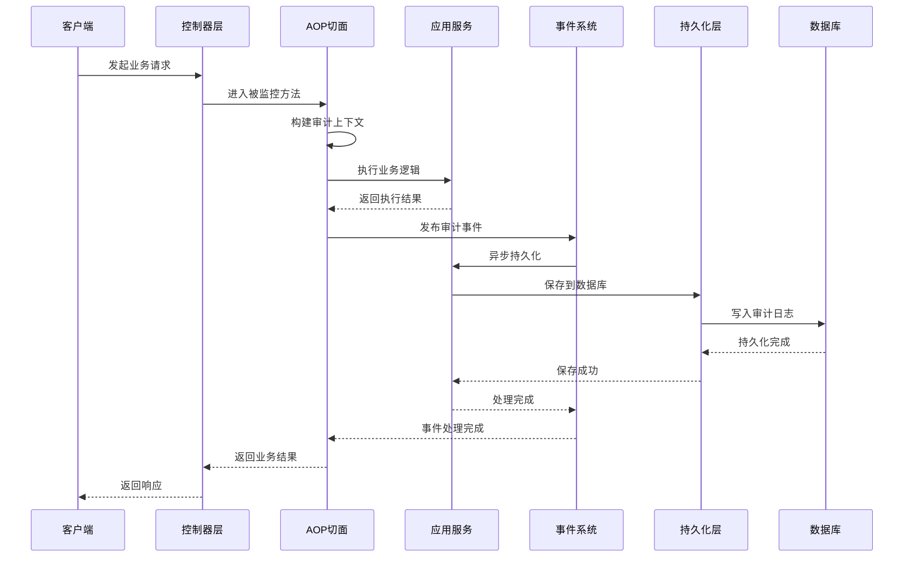
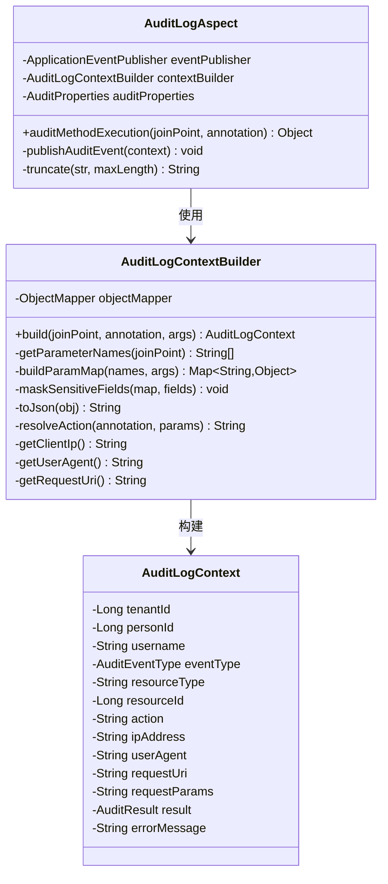
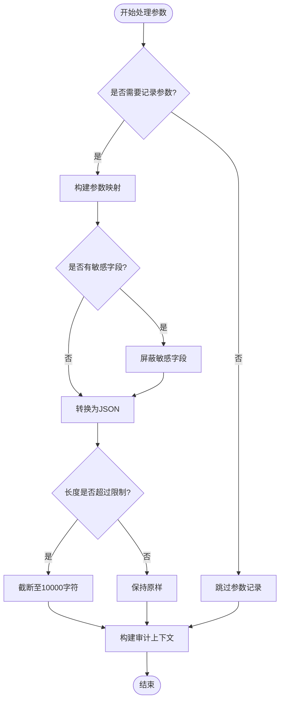
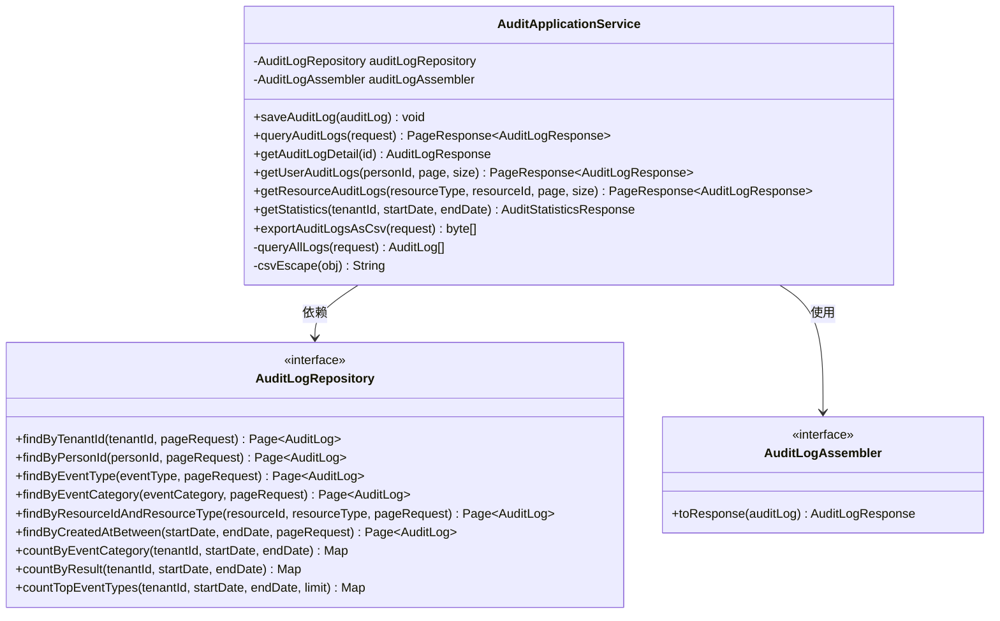
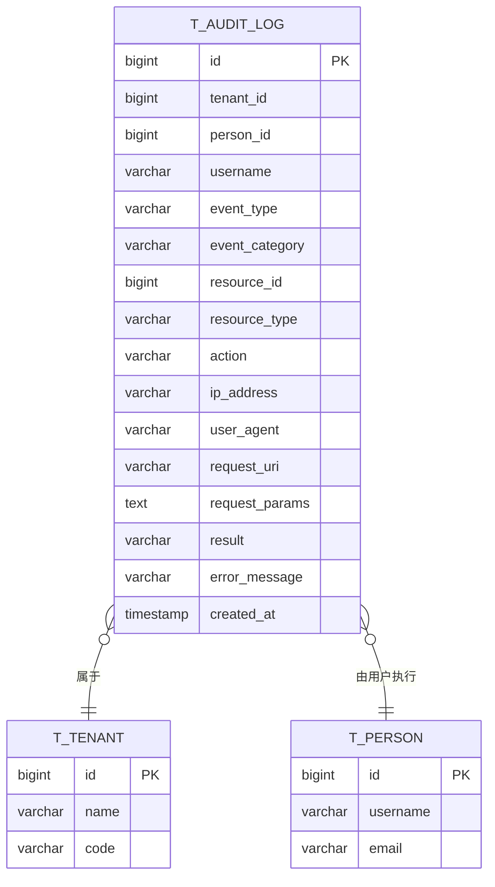
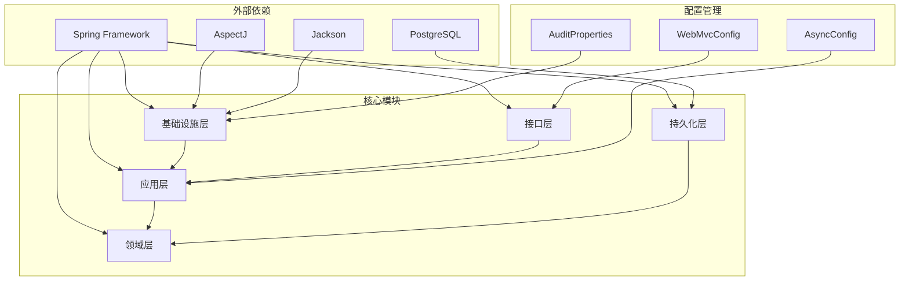

# 审计日志系统

<cite>
**本文档引用的文件**
- [AuditLog.java](file://src/main/java/sso/oidc/domain/model/entity/AuditLog.java)
- [AuditLogEvent.java](file://src/main/java/sso/oidc/application/event/AuditLogEvent.java)
- [AuditLogEventListener.java](file://src/main/java/sso/oidc/application/event/AuditLogEventListener.java)
- [AuditApplicationService.java](file://src/main/java/sso/oidc/application/service/AuditApplicationService.java)
- [AuditLogAspect.java](file://src/main/java/sso/oidc/infrastructure/aspect/AuditLogAspect.java)
- [AuditLog.java](file://src/main/java/sso/oidc/domain/model/annotation/AuditLog.java)
- [AuditLogContext.java](file://src/main/java/sso/oidc/infrastructure/aspect/AuditLogContext.java)
- [AuditLogContextBuilder.java](file://src/main/java/sso/oidc/infrastructure/aspect/AuditLogContextBuilder.java)
- [AuditController.java](file://src/main/java/sso/oidc/interfaces/rest/AuditController.java)
- [AuditLogPO.java](file://src/main/java/sso/oidc/infrastructure/persistence/entity/AuditLogPO.java)
- [AuditEventType.java](file://src/main/java/sso/oidc/domain/model/enums/AuditEventType.java)
- [EventCategory.java](file://src/main/java/sso/oidc/domain/model/enums/EventCategory.java)
- [AuditResult.java](file://src/main/java/sso/oidc/domain/model/enums/AuditResult.java)
- [AuditProperties.java](file://src/main/java/sso/oidc/infrastructure/config/AuditProperties.java)
- [V6__add_audit_log_support.sql](file://src/main/resources/db/migration/V6__add_audit_log_support.sql)
</cite>

## 目录
1. [简介](#简介)
2. [项目结构](#项目结构)
3. [核心组件](#核心组件)
4. [架构概览](#架构概览)
5. [详细组件分析](#详细组件分析)
6. [依赖关系分析](#依赖关系分析)
7. [性能考虑](#性能考虑)
8. [故障排除指南](#故障排除指南)
9. [结论](#结论)

## 简介

本项目实现了完整的审计日志系统，用于记录和追踪所有关键操作事件。该系统采用AOP（面向切面编程）技术，在方法执行前后自动捕获审计信息，支持异步持久化、统计分析和CSV导出功能。

审计日志系统主要记录以下类型的事件：
- 认证事件：登录、登出、令牌刷新等
- 授权事件：角色分配、权限变更等
- 账户事件：用户创建、更新、删除等
- 管理事件：租户、应用、组织管理等
- 会话事件：租户选择、会话过期等

## 项目结构

审计日志系统在项目中的组织结构如下：

```mermaid
graph TB
subgraph "领域层"
DL1[AuditLog 实体]
DL2[AuditEventType 枚举]
DL3[EventCategory 枚举]
DL4[AuditResult 枚举]
DL5[@AuditLog 注解]
end
subgraph "应用层"
AL1[AuditApplicationService]
AL2[AuditLogEvent]
AL3[AuditLogEventListener]
end
subgraph "基础设施层"
IL1[AuditLogAspect]
IL2[AuditLogContext]
IL3[AuditLogContextBuilder]
IL4[AuditProperties]
end
subgraph "接口层"
RL1[AuditController]
end
subgraph "持久化层"
PL1[AuditLogPO]
end
subgraph "数据库"
DB1[t_audit_log 表]
end
RL1 --> AL1
AL1 --> AL2
AL2 --> AL3
AL3 --> AL1
AL1 --> PL1
PL1 --> DB1
IL1 --> IL2
IL2 --> IL3
IL3 --> IL4
IL1 --> AL2
AL1 --> DL1
DL1 --> DL2
DL2 --> DL3
```

**图表来源**
- [AuditLog.java:1-118](file://src/main/java/sso/oidc/domain/model/entity/AuditLog.java#L1-L118)
- [AuditApplicationService.java:1-217](file://src/main/java/sso/oidc/application/service/AuditApplicationService.java#L1-L217)
- [AuditLogAspect.java:1-66](file://src/main/java/sso/oidc/infrastructure/aspect/AuditLogAspect.java#L1-L66)

**章节来源**
- [AuditLog.java:1-118](file://src/main/java/sso/oidc/domain/model/entity/AuditLog.java#L1-L118)
- [AuditApplicationService.java:1-217](file://src/main/java/sso/oidc/application/service/AuditApplicationService.java#L1-L217)
- [AuditLogAspect.java:1-66](file://src/main/java/sso/oidc/infrastructure/aspect/AuditLogAspect.java#L1-L66)

## 核心组件

### 领域模型

审计日志系统的核心领域模型包括：

#### AuditLog 实体
- **不可变性设计**：一旦创建，审计日志不应被修改
- **完整信息记录**：包含事件类型、结果、时间戳、IP地址等
- **工厂方法**：提供从上下文构建和直接创建两种方式

#### 事件类型枚举
- **认证事件**：LOGIN_SUCCESS、LOGIN_FAILURE、LOGOUT、TOKEN_REFRESH等
- **授权事件**：ROLE_ASSIGN、ROLE_REVOKE、PERMISSION_CHANGE等
- **账户事件**：PERSON_CREATED、PERSON_UPDATED、PASSWORD_CHANGED等
- **管理事件**：TENANT_CREATED、APPLICATION_CREATED、ORGANIZATION_CREATED等
- **会话事件**：TENANT_SELECTED、SESSION_EXPIRED等

#### 事件结果枚举
- **SUCCESS**：操作成功
- **FAILURE**：操作失败

**章节来源**
- [AuditLog.java:1-118](file://src/main/java/sso/oidc/domain/model/entity/AuditLog.java#L1-L118)
- [AuditEventType.java:1-59](file://src/main/java/sso/oidc/domain/model/enums/AuditEventType.java#L1-L59)
- [AuditResult.java:1-9](file://src/main/java/sso/oidc/domain/model/enums/AuditResult.java#L1-L9)

### 应用服务

#### AuditApplicationService
- **异步持久化**：通过事件机制异步保存审计日志
- **查询功能**：支持按多种条件查询审计日志
- **统计分析**：提供事件分类统计和TOP事件类型分析
- **数据导出**：支持CSV格式的数据导出

#### 审计事件处理
- **AuditLogEvent**：Spring应用事件封装
- **AuditLogEventListener**：异步事件监听器，负责持久化

**章节来源**
- [AuditApplicationService.java:1-217](file://src/main/java/sso/oidc/application/service/AuditApplicationService.java#L1-L217)
- [AuditLogEvent.java:1-21](file://src/main/java/sso/oidc/application/event/AuditLogEvent.java#L1-L21)
- [AuditLogEventListener.java:1-31](file://src/main/java/sso/oidc/application/event/AuditLogEventListener.java#L1-L31)

### 基础设施组件

#### AOP切面
- **AuditLogAspect**：拦截标注了@AuditLog注解的方法
- **AuditLogContextBuilder**：构建审计上下文信息
- **AuditLogContext**：审计上下文数据传输对象

#### 配置属性
- **AuditProperties**：审计系统配置，包括启用状态、保留天数、异步线程池配置

**章节来源**
- [AuditLogAspect.java:1-66](file://src/main/java/sso/oidc/infrastructure/aspect/AuditLogAspect.java#L1-L66)
- [AuditLogContextBuilder.java:1-183](file://src/main/java/sso/oidc/infrastructure/aspect/AuditLogContextBuilder.java#L1-L183)
- [AuditLogContext.java:1-32](file://src/main/java/sso/oidc/infrastructure/aspect/AuditLogContext.java#L1-L32)
- [AuditProperties.java:1-37](file://src/main/java/sso/oidc/infrastructure/config/AuditProperties.java#L1-L37)

## 架构概览

审计日志系统采用分层架构设计，实现了横切关注点的分离：



**图表来源**
- [AuditLogAspect.java:27-48](file://src/main/java/sso/oidc/infrastructure/aspect/AuditLogAspect.java#L27-L48)
- [AuditLogEventListener.java:22-29](file://src/main/java/sso/oidc/application/event/AuditLogEventListener.java#L22-L29)
- [AuditApplicationService.java:41-48](file://src/main/java/sso/oidc/application/service/AuditApplicationService.java#L41-L48)

## 详细组件分析

### AOP审计切面

#### AuditLogAspect 分析



**图表来源**
- [AuditLogAspect.java:21-66](file://src/main/java/sso/oidc/infrastructure/aspect/AuditLogAspect.java#L21-L66)
- [AuditLogContextBuilder.java:23-183](file://src/main/java/sso/oidc/infrastructure/aspect/AuditLogContextBuilder.java#L23-L183)
- [AuditLogContext.java:13-32](file://src/main/java/sso/oidc/infrastructure/aspect/AuditLogContext.java#L13-L32)

#### 敏感信息处理流程



**图表来源**
- [AuditLogContextBuilder.java:33-58](file://src/main/java/sso/oidc/infrastructure/aspect/AuditLogContextBuilder.java#L33-L58)
- [AuditLogContextBuilder.java:87-112](file://src/main/java/sso/oidc/infrastructure/aspect/AuditLogContextBuilder.java#L87-L112)

**章节来源**
- [AuditLogAspect.java:1-66](file://src/main/java/sso/oidc/infrastructure/aspect/AuditLogAspect.java#L1-L66)
- [AuditLogContextBuilder.java:1-183](file://src/main/java/sso/oidc/infrastructure/aspect/AuditLogContextBuilder.java#L1-L183)

### 应用服务层

#### AuditApplicationService 功能分析



**图表来源**
- [AuditApplicationService.java:30-217](file://src/main/java/sso/oidc/application/service/AuditApplicationService.java#L30-L217)

#### 查询策略分析

系统支持多种查询模式：

| 查询类型 | 条件 | 索引使用 | 性能特点 |
|---------|------|----------|----------|
| 租户查询 | tenantId | idx_audit_tenant_id | 高效，适合多租户场景 |
| 用户查询 | personId | idx_audit_person_id | 快速定位用户操作历史 |
| 事件类型查询 | eventType | idx_audit_event_type | 支持事件类型统计分析 |
| 事件分类查询 | eventCategory | idx_audit_event_category | 支持分类统计 |
| 资源查询 | resourceType + resourceId | idx_audit_resource | 复合索引优化 |
| 时间范围查询 | created_at | idx_audit_created_at | 时间序列分析 |

**章节来源**
- [AuditApplicationService.java:52-85](file://src/main/java/sso/oidc/application/service/AuditApplicationService.java#L52-L85)
- [AuditApplicationService.java:128-158](file://src/main/java/sso/oidc/application/service/AuditApplicationService.java#L128-L158)

### 接口控制器

#### AuditController API 设计

```mermaid
graph LR
subgraph "REST API"
C1[/v1/audit/logs] --> Q1[查询审计日志]
C2[/v1/audit/logs/{id}] --> Q2[获取日志详情]
C3[/v1/audit/users/{userId}/logs] --> Q3[按用户查询]
C4[/v1/audit/resources/{resourceType}/{resourceId}/logs] --> Q4[按资源查询]
C5[/v1/audit/statistics] --> Q5[获取统计信息]
C6[/v1/audit/logs/export] --> Q6[导出CSV]
end
subgraph "请求参数"
P1[AuditLogQueryRequest]
P2[分页参数 page, size]
P3[过滤参数 tenantId, personId, eventType, ...]
P4[时间范围 startDate, endDate]
end
subgraph "响应格式"
R1[PageResponse<AuditLogResponse>]
R2[AuditLogResponse]
R3[AuditStatisticsResponse]
R4[CSV数据流]
end
Q1 --> P1
Q3 --> P2
Q4 --> P2
Q5 --> P4
Q6 --> P1
Q1 --> R1
Q2 --> R2
Q5 --> R3
Q6 --> R4
```

**图表来源**
- [AuditController.java:34-87](file://src/main/java/sso/oidc/interfaces/rest/AuditController.java#L34-L87)

**章节来源**
- [AuditController.java:1-89](file://src/main/java/sso/oidc/interfaces/rest/AuditController.java#L1-L89)

### 持久化层

#### 数据模型设计



**图表来源**
- [AuditLogPO.java:17-85](file://src/main/java/sso/oidc/infrastructure/persistence/entity/AuditLogPO.java#L17-L85)
- [V6__add_audit_log_support.sql:9-26](file://src/main/resources/db/migration/V6__add_audit_log_support.sql#L9-L26)

#### 索引策略

系统建立了完善的索引策略来优化查询性能：

| 索引名称 | 列组合 | 查询场景 | 性能优化 |
|---------|--------|----------|----------|
| idx_audit_tenant_id | tenant_id | 租户维度查询 | 单列索引，高效 |
| idx_audit_person_id | person_id | 用户操作历史 | 单列索引，快速 |
| idx_audit_event_type | event_type | 事件类型统计 | 单列索引，分析友好 |
| idx_audit_event_category | event_category | 分类统计分析 | 单列索引，聚合高效 |
| idx_audit_resource | resource_type, resource_id | 资源关联查询 | 复合索引，精确匹配 |
| idx_audit_result | result | 成功/失败统计 | 单列索引，过滤高效 |
| idx_audit_created_at | created_at | 时间序列查询 | 单列索引，范围扫描 |
| idx_audit_tenant_category_time | tenant_id, event_category, created_at | 多维分析 | 复合索引，最优化 |

**章节来源**
- [AuditLogPO.java:18-27](file://src/main/java/sso/oidc/infrastructure/persistence/entity/AuditLogPO.java#L18-L27)
- [V6__add_audit_log_support.sql:32-54](file://src/main/resources/db/migration/V6__add_audit_log_support.sql#L32-L54)

## 依赖关系分析

审计日志系统的依赖关系呈现清晰的分层结构：



**图表来源**
- [AuditProperties.java:10-37](file://src/main/java/sso/oidc/infrastructure/config/AuditProperties.java#L10-L37)
- [AuditLogAspect.java:1-66](file://src/main/java/sso/oidc/infrastructure/aspect/AuditLogAspect.java#L1-L66)

### 关键依赖特性

#### 异步处理机制
- **线程池配置**：核心线程2个，最大5个，队列容量500
- **任务隔离**：审计写入不影响主业务流程
- **异常容错**：持久化失败不影响业务执行

#### 安全考虑
- **敏感信息屏蔽**：默认屏蔽password、secret、token字段
- **参数长度限制**：请求参数截断至10000字符
- **错误信息限制**：错误消息截断至2000字符

**章节来源**
- [AuditProperties.java:28-35](file://src/main/java/sso/oidc/infrastructure/config/AuditProperties.java#L28-L35)
- [AuditLogContextBuilder.java:38-50](file://src/main/java/sso/oidc/infrastructure/aspect/AuditLogContextBuilder.java#L38-L50)
- [AuditLogAspect.java:60-64](file://src/main/java/sso/oidc/infrastructure/aspect/AuditLogAspect.java#L60-L64)

## 性能考虑

### 查询性能优化

#### 索引使用策略
- **高选择性列优先**：tenant_id、event_type等具有高区分度的列优先建立索引
- **复合索引设计**：针对常见查询模式设计复合索引
- **分区策略**：建议按时间分区存储历史数据

#### 缓存策略
- **热点数据缓存**：最近活跃用户的审计日志可考虑缓存
- **统计结果缓存**：常用统计查询结果可缓存一段时间

### 存储优化

#### 数据保留策略
- **自动清理**：默认180天保留期，可通过函数清理过期数据
- **分层存储**：近期数据存储在高性能磁盘，历史数据迁移至低成本存储

#### 导出性能
- **分批处理**：CSV导出限制最多10000条记录
- **流式输出**：避免内存溢出，支持大文件导出

## 故障排除指南

### 常见问题及解决方案

#### 审计日志未记录
**可能原因**：
- 审计系统未启用
- 方法未标注@AuditLog注解
- 异步事件发布失败

**解决步骤**：
1. 检查配置文件中`sso.audit.enabled`设置
2. 确认目标方法已添加@AuditLog注解
3. 查看异步事件发布日志

#### 审计日志查询性能差
**可能原因**：
- 缺少必要的索引
- 查询条件不匹配索引
- 数据量过大

**优化方案**：
1. 添加缺失的索引
2. 使用合适的查询条件
3. 考虑数据归档策略

#### 敏感信息泄露风险
**防护措施**：
1. 确保敏感字段被正确屏蔽
2. 定期审查日志内容
3. 限制日志访问权限

**章节来源**
- [AuditProperties.java:15-23](file://src/main/java/sso/oidc/infrastructure/config/AuditProperties.java#L15-L23)
- [AuditLogContextBuilder.java:87-112](file://src/main/java/sso/oidc/infrastructure/aspect/AuditLogContextBuilder.java#L87-L112)

## 结论

本审计日志系统实现了以下核心价值：

### 技术优势
- **自动化程度高**：通过AOP实现零侵入式审计
- **性能优化完善**：异步处理、索引优化、缓存策略
- **扩展性强**：支持自定义事件类型和查询条件
- **安全可靠**：敏感信息处理、异常容错机制

### 业务价值
- **合规要求满足**：完整记录所有关键操作
- **运维支持增强**：提供强大的查询和分析能力
- **安全监控提升**：及时发现异常操作行为
- **审计工作简化**：支持CSV导出和统计分析

### 最佳实践建议
1. **合理配置**：根据业务规模调整异步线程池大小
2. **定期维护**：监控磁盘使用情况，及时清理过期数据
3. **权限控制**：严格控制审计日志的访问权限
4. **性能监控**：定期检查查询性能和系统负载

该系统为SSO/OIDC平台提供了全面的审计能力，既满足了合规要求，又保证了系统的高性能运行。