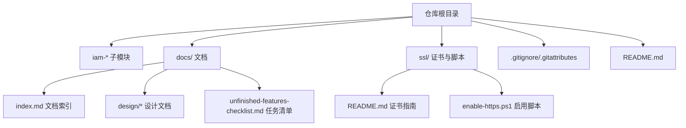
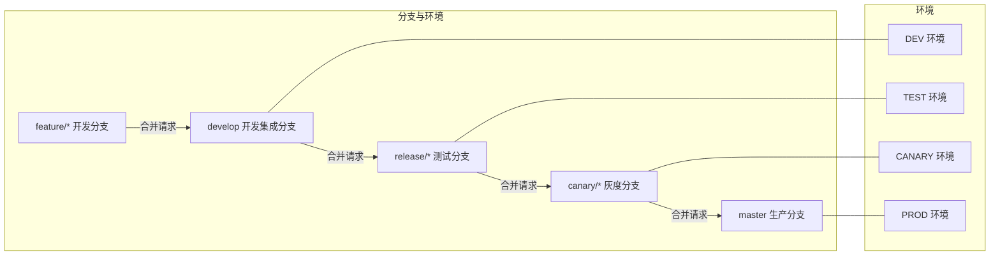
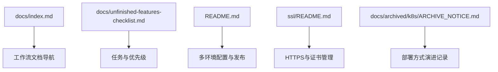

# Git工作流

<cite>
**本文引用的文件**
- [README.md](file://README.md)
- [.gitignore](file://.gitignore)
- [.gitattributes](file://.gitattributes)
- [docs/index.md](file://docs/index.md)
- [docs/unfinished-features-checklist.md](file://docs/unfinished-features-checklist.md)
- [ssl/README.md](file://ssl/README.md)
- [docs/archived/k8s/ARCHIVE_NOTICE.md](file://docs/archived/k8s/ARCHIVE_NOTICE.md)
</cite>

## 目录
1. [简介](#简介)
2. [项目结构](#项目结构)
3. [核心组件](#核心组件)
4. [架构总览](#架构总览)
5. [详细组件分析](#详细组件分析)
6. [依赖分析](#依赖分析)
7. [性能考虑](#性能考虑)
8. [故障排查指南](#故障排查指南)
9. [结论](#结论)
10. [附录](#附录)

## 简介
本文件面向IAM平台的Git工作流，系统化阐述Git Flow分支模型在本项目中的落地方式，覆盖feature/*、develop、release/*、canary/*、master分支的使用场景与合并策略；明确分支命名规范与分支保护规则；制定提交消息规范（type、scope、subject）；给出Pull Request（PR）创建、审查与合并流程；提供冲突解决策略与最佳实践；说明版本标签管理与发布流程；并介绍Git钩子与自动化检查的配置思路。

## 项目结构
IAM平台采用多模块Maven工程，配合文档与脚本资源，形成“代码+文档+部署”的一体化仓库形态。与Git工作流直接相关的仓库元数据包括：
- 顶层README.md：明确采用Git Flow分支模型与多环境配置
- .gitignore/.gitattributes：统一文本换行与敏感文件排除策略
- docs/：文档索引与设计文档，支撑规范与流程说明
- ssl/：SSL证书与HTTPS启用脚本，保障安全基线
- docs/archived/k8s/：K8s部署归档说明，体现部署方式演进

**图表来源**
- [README.md](file://README.md)
- [docs/index.md](file://docs/index.md)
- [ssl/README.md](file://ssl/README.md)

**章节来源**
- [README.md](file://README.md)
- [.gitignore](file://.gitignore)
- [.gitattributes](file://.gitattributes)
- [docs/index.md](file://docs/index.md)
- [ssl/README.md](file://ssl/README.md)

## 核心组件
- 分支模型：采用Git Flow，路径为 feature/* → develop → release/* → canary/* → master，对应DEV/TEST/CANARY/PROD环境
- 提交规范：建议遵循约定式提交（conventional commits），包含type、scope、subject
- PR流程：建议通过PR驱动变更，强制审查与自动化检查
- 版本与标签：建议以语义化版本（SemVer）打标签，配合发布说明
- 钩子与自动化：建议在CI中执行lint、测试、安全扫描与合规检查

**章节来源**
- [README.md](file://README.md)

## 架构总览
下图展示IAM平台在Git工作流中的分支与环境映射关系，以及从feature到master的发布路径。

**图表来源**
- [README.md](file://README.md)

## 详细组件分析

### 分支模型与命名规范
- feature/*：用于新功能开发，命名建议使用动词短语，如feature/user-login
- develop：用于集成feature/*，合并前需通过CI与审查
- release/*：用于预发布测试，命名建议使用语义化版本号，如release/v1.2.3
- canary/*：用于灰度验证，命名建议release/v1.2.3-canary
- master：用于生产发布，仅允许来自canary/*的合并

分支保护规则建议：
- develop：禁止直接推送，必须通过PR合并
- release/*：开启状态检查与审查要求
- canary/*：开启状态检查与审查要求
- master：开启状态检查、审查要求与保护性推送限制

**章节来源**
- [README.md](file://README.md)

### 提交消息规范
建议采用约定式提交，格式为：
- type：feat、fix、docs、style、refactor、perf、test、build、ci、chore、revert
- scope：可选，表示变更的作用域（模块或子系统）
- subject：简短描述变更内容，首字母小写，不以点结尾

示例：
- feat(auth): 添加用户注册接口
- fix(common): 修复空指针异常
- chore(ci): 更新构建脚本

说明：
- 本节为通用规范建议，便于与CI/CD工具链协同（如自动生成变更日志）

**章节来源**
- [README.md](file://README.md)

### Pull Request（PR）流程
建议流程如下：
1. 创建feature分支并提交变更
2. 在上游推送后创建PR，填写描述与关联任务
3. CI执行：代码检查、单元测试、安全扫描
4. 代码审查：至少一名维护者批准
5. 合并策略：squash合并或rebase合并，保持提交历史整洁
6. 合并后删除feature分支

最佳实践：
- PR标题与描述清晰，引用相关issue
- 小步快跑，避免大体积PR
- 通过CI后再请求审查

**章节来源**
- [README.md](file://README.md)

### 冲突解决策略与最佳实践
- 频繁从develop同步更新，减少长分支漂移
- 使用rebase保持线性历史，必要时进行交互式rebase整理提交
- 冲突集中在develop层面解决，避免在feature分支上积累
- 代码审查阶段发现的冲突应在PR合并前解决
- 对于复杂冲突，建议拆分为更小的PR或引入设计讨论

**章节来源**
- [README.md](file://README.md)

### 版本标签管理与发布流程
- 版本策略：采用语义化版本（SemVer），主/次/修订版本号
- 标签规范：使用vX.Y.Z格式，如v1.2.3
- 发布流程：
  1. 在release/*完成测试后，合并到canary/*
  2. 在canary/*完成灰度验证后，合并到master
  3. 在master打上版本标签并生成发布说明
  4. 同步更新各环境配置与部署脚本

**章节来源**
- [README.md](file://README.md)

### Git钩子与自动化检查（配置思路）
- 预提交钩子（pre-commit）：执行代码格式化、静态检查、单元测试
- 提交后钩子（post-commit）：触发CI流水线（如GitHub Actions/GitLab CI）
- CI流水线建议包含：
  - 代码风格检查
  - 单元测试与覆盖率
  - 依赖漏洞扫描
  - 合规性检查（如许可证、密钥泄露检测）
- 与仓库现有脚本协同：
  - 可参考ssl/README.md中的脚本化启用HTTPS流程，将类似思路用于CI检查项的自动化

**章节来源**
- [ssl/README.md](file://ssl/README.md)

## 依赖分析
本节从仓库层面梳理与Git工作流相关的关键依赖与约束：
- 文档与规范：docs/index.md提供文档导航与结构，docs/unfinished-features-checklist.md提供任务与优先级，二者共同支撑工作流的可追溯性
- 部署与环境：README.md明确多环境配置与部署方式，ssl/README.md提供HTTPS启用与证书管理，二者影响发布与灰度策略
- 归档与演进：docs/archived/k8s/ARCHIVE_NOTICE.md说明部署方式的历史演进，提示发布流程的稳定性与可追溯性

**图表来源**
- [docs/index.md](file://docs/index.md)
- [docs/unfinished-features-checklist.md](file://docs/unfinished-features-checklist.md)
- [README.md](file://README.md)
- [ssl/README.md](file://ssl/README.md)
- [docs/archived/k8s/ARCHIVE_NOTICE.md](file://docs/archived/k8s/ARCHIVE_NOTICE.md)

**章节来源**
- [docs/index.md](file://docs/index.md)
- [docs/unfinished-features-checklist.md](file://docs/unfinished-features-checklist.md)
- [README.md](file://README.md)
- [ssl/README.md](file://ssl/README.md)
- [docs/archived/k8s/ARCHIVE_NOTICE.md](file://docs/archived/k8s/ARCHIVE_NOTICE.md)

## 性能考虑
- 分支粒度：feature分支不宜长期存在，建议按功能点拆分，缩短合并周期
- CI效率：将耗时任务（如集成测试）拆分到并行流水线，减少排队等待
- 历史管理：定期清理已合并的feature分支，保持仓库整洁
- 合并策略：在保证质量的前提下，尽量采用squash合并，减少提交历史冗余

## 故障排查指南
- 提交被拒绝：检查.gitignore与.gitattributes是否正确配置，避免误提交敏感文件
- CI失败：根据CI日志定位问题，优先修复语法与测试错误
- 合并与冲突：使用rebase或merge解决冲突，必要时拆分PR
- 灰度发布异常：核对canary/*与master的差异，确认标签与环境配置

**章节来源**
- [.gitignore](file://.gitignore)
- [.gitattributes](file://.gitattributes)
- [ssl/README.md](file://ssl/README.md)

## 结论
IAM平台的Git工作流以Git Flow为核心，结合约定式提交、严格的PR审查与CI自动化，确保从feature到master的高质量交付。配合语义化版本与标签管理，形成可追溯、可审计的发布闭环。建议持续优化CI流水线与文档规范，提升团队协作效率与发布稳定性。

## 附录
- 术语
  - PR：Pull Request
  - CI：持续集成
  - SemVer：语义化版本
- 参考
  - README.md中的多环境配置与工作流说明
  - docs/index.md中的文档导航与结构
  - ssl/README.md中的HTTPS与证书管理

**章节来源**
- [README.md](file://README.md)
- [docs/index.md](file://docs/index.md)
- [ssl/README.md](file://ssl/README.md)