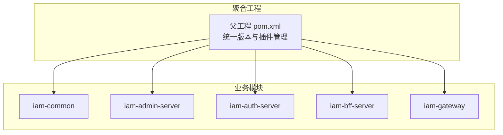
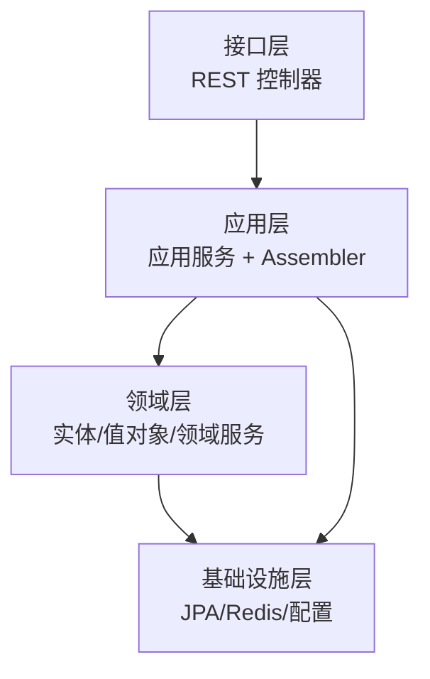
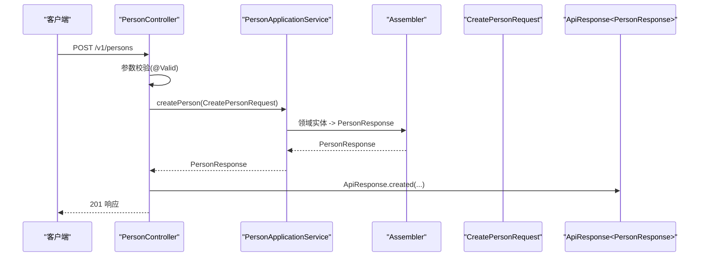
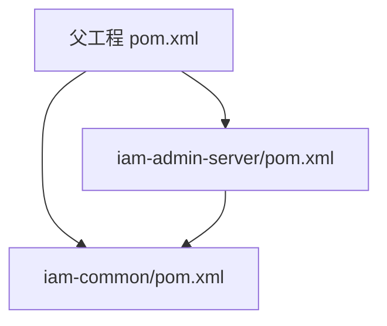

# 代码规范

<cite>
**本文引用的文件**
- [README.md](file://README.md)
- [pom.xml](file://pom.xml)
- [iam-admin-server/pom.xml](file://iam-admin-server/pom.xml)
- [iam-admin-server/src/main/java/iam/platform/admin/domain/model/entity/Application.java](file://iam-admin-server/src/main/java/iam/platform/admin/domain/model/entity/Application.java)
- [iam-admin-server/src/main/java/iam/platform/admin/domain/model/entity/Person.java](file://iam-admin-server/src/main/java/iam/platform/admin/domain/model/entity/Person.java)
- [iam-admin-server/src/main/java/iam/platform/admin/application/assembler/AuditLogAssembler.java](file://iam-admin-server/src/main/java/iam/platform/admin/application/assembler/AuditLogAssembler.java)
- [iam-admin-server/src/main/java/iam/platform/admin/infrastructure/persistence/entity/ApplicationPO.java](file://iam-admin-server/src/main/java/iam/platform/admin/infrastructure/persistence/entity/ApplicationPO.java)
- [iam-admin-server/src/main/java/iam/platform/admin/interfaces/rest/PersonController.java](file://iam-admin-server/src/main/java/iam/platform/admin/interfaces/rest/PersonController.java)
- [iam-common/src/main/java/iam/platform/common/dto/request/CreatePersonRequest.java](file://iam-common/src/main/java/iam/platform/common/dto/request/CreatePersonRequest.java)
- [iam-common/src/main/java/iam/platform/common/dto/response/PersonResponse.java](file://iam-common/src/main/java/iam/platform/common/dto/response/PersonResponse.java)
- [iam-common/src/main/java/iam/platform/common/api/ApiResponse.java](file://iam-common/src/main/java/iam/platform/common/api/ApiResponse.java)
- [iam-common/src/main/java/iam/platform/common/util/Guard.java](file://iam-common/src/main/java/iam/platform/common/util/Guard.java)
- [iam-common/src/main/java/iam/platform/common/model/enums/AppStatus.java](file://iam-common/src/main/java/iam/platform/common/model/enums/AppStatus.java)
</cite>

## 目录
1. [简介](#简介)
2. [项目结构](#项目结构)
3. [核心组件](#核心组件)
4. [架构总览](#架构总览)
5. [详细组件分析](#详细组件分析)
6. [依赖分析](#依赖分析)
7. [性能考虑](#性能考虑)
8. [故障排查指南](#故障排查指南)
9. [结论](#结论)
10. [附录](#附录)

## 简介
本文件为 IAM 平台的代码规范文档，面向 Java 开发者，系统性阐述命名约定、代码格式化、注释规范、Lombok 使用最佳实践、方法与类长度限制、DTO/Entity/Assembler 的命名与使用场景，并提供代码审查清单、常见问题与解决方案以及静态代码分析工具的配置与使用建议。内容以仓库现有实现为依据，结合父工程与模块配置，确保规范可落地、可执行。

## 项目结构
IAM 平台采用多模块聚合工程，核心模块包括：
- iam-common：公共 DTO、枚举、异常、工具与通用响应封装
- iam-admin-server：管理员业务服务，包含应用、组织、人员、审计等业务域
- iam-auth-server：认证授权服务（OIDC Provider）
- iam-bff-server：前端网关服务
- iam-gateway：路由网关

图表来源
- [pom.xml:21-27](file://pom.xml#L21-L27)

章节来源
- [README.md:95-108](file://README.md#L95-L108)
- [pom.xml:21-27](file://pom.xml#L21-L27)

## 核心组件
- Lombok 注解使用
  - 在实体与 DTO 上广泛使用 @Data、@Builder、@NoArgsConstructor、@AllArgsConstructor，减少样板代码，提升可读性与维护性。
  - 示例：Application、Person、CreatePersonRequest、PersonResponse、ApiResponse 等均采用上述注解组合。
- MapStruct 映射
  - 通过 @Mapper 组件模型在领域实体与响应 DTO 之间进行类型转换，保证数据传输一致性。
  - 示例：AuditLogAssembler 将领域实体映射为响应 DTO。
- 领域断言 Guard
  - 提供 notNull、notBlank、state、positive 等断言方法，统一前置条件与不变量校验，避免分散的异常处理逻辑。
- 响应封装 ApiResponse
  - 统一 API 响应结构，包含状态码、消息、数据、错误列表与时间戳，便于前后端交互与可观测性。

章节来源
- [iam-admin-server/src/main/java/iam/platform/admin/domain/model/entity/Application.java:17-21](file://iam-admin-server/src/main/java/iam/platform/admin/domain/model/entity/Application.java#L17-L21)
- [iam-admin-server/src/main/java/iam/platform/admin/domain/model/entity/Person.java:13-17](file://iam-admin-server/src/main/java/iam/platform/admin/domain/model/entity/Person.java#L13-L17)
- [iam-common/src/main/java/iam/platform/common/dto/request/CreatePersonRequest.java:11-14](file://iam-common/src/main/java/iam/platform/common/dto/request/CreatePersonRequest.java#L11-L14)
- [iam-common/src/main/java/iam/platform/common/dto/response/PersonResponse.java:10-14](file://iam-common/src/main/java/iam/platform/common/dto/response/PersonResponse.java#L10-L14)
- [iam-common/src/main/java/iam/platform/common/api/ApiResponse.java:13-17](file://iam-common/src/main/java/iam/platform/common/api/ApiResponse.java#L13-L17)
- [iam-admin-server/src/main/java/iam/platform/admin/application/assembler/AuditLogAssembler.java:10-22](file://iam-admin-server/src/main/java/iam/platform/admin/application/assembler/AuditLogAssembler.java#L10-L22)
- [iam-common/src/main/java/iam/platform/common/util/Guard.java:13-29](file://iam-common/src/main/java/iam/platform/common/util/Guard.java#L13-L29)

## 架构总览
IAM 平台遵循 Clean Architecture + DDD 思想，分层清晰：
- 接口层：REST 控制器负责请求接入与响应封装
- 应用层：应用服务编排业务用例，装配 DTO 与领域实体
- 领域层：实体、值对象、领域服务与仓储接口
- 基础设施层：持久化、安全、配置与外部集成

图表来源
- [README.md:97-106](file://README.md#L97-L106)
- [iam-admin-server/src/main/java/iam/platform/admin/interfaces/rest/PersonController.java:25-29](file://iam-admin-server/src/main/java/iam/platform/admin/interfaces/rest/PersonController.java#L25-L29)
- [iam-admin-server/src/main/java/iam/platform/admin/application/assembler/AuditLogAssembler.java:10-22](file://iam-admin-server/src/main/java/iam/platform/admin/application/assembler/AuditLogAssembler.java#L10-L22)

## 详细组件分析

### Lombok 使用规范与最佳实践
- 基本原则
  - 在不可变或只读场景优先使用 @Getter；在需要构造时设置字段时使用 @Builder。
  - 所有 POJO 建议保留 @NoArgsConstructor 与 @AllArgsConstructor，便于序列化与反射使用。
  - @Data 含 @Getter、@Setter、@ToString、@EqualsAndHashCode，适用于 DTO/Entity；若存在复杂 setter 语义，建议拆分为 @Getter/@Setter 以明确职责。
- 与 MapStruct 的配合
  - 当需要在领域实体与 DTO 间进行复杂映射时，优先使用 @Mapper，避免手写重复映射逻辑。
- 可读性与可维护性
  - 避免过度使用 @Data，对于有状态机或行为丰富的实体，建议显式声明方法，增强意图表达。
  - 对于仅承载数据的 DTO，@Data + @Builder 是推荐组合。

章节来源
- [iam-admin-server/src/main/java/iam/platform/admin/domain/model/entity/Application.java:17-21](file://iam-admin-server/src/main/java/iam/platform/admin/domain/model/entity/Application.java#L17-L21)
- [iam-admin-server/src/main/java/iam/platform/admin/domain/model/entity/Person.java:13-17](file://iam-admin-server/src/main/java/iam/platform/admin/domain/model/entity/Person.java#L13-L17)
- [iam-common/src/main/java/iam/platform/common/dto/request/CreatePersonRequest.java:11-14](file://iam-common/src/main/java/iam/platform/common/dto/request/CreatePersonRequest.java#L11-L14)
- [iam-common/src/main/java/iam/platform/common/dto/response/PersonResponse.java:10-14](file://iam-common/src/main/java/iam/platform/common/dto/response/PersonResponse.java#L10-L14)
- [iam-admin-server/src/main/java/iam/platform/admin/application/assembler/AuditLogAssembler.java:10-22](file://iam-admin-server/src/main/java/iam/platform/admin/application/assembler/AuditLogAssembler.java#L10-L22)

### 方法长度限制（≤50行）与类长度限制（≤500行）
- 目标
  - 降低认知负担，提升可读性与可测试性；便于定位问题与重构。
- 实施要点
  - 将长方法拆分为多个职责单一的小方法，必要时引入领域服务或值对象承载复杂逻辑。
  - 类内按功能分组（工厂方法、行为方法、查询方法、生命周期钩子等），保持逻辑簇聚。
- 依据
  - 项目在 README 中明确“方法长度 ≤ 50 行，类长度 ≤ 500 行”。

章节来源
- [README.md:115-115](file://README.md#L115-L115)

### DTO、Entity、Assembler 命名规范与使用场景
- 命名规范
  - DTO：请求 DTO 以 Request 结尾，响应 DTO 以 Response 结尾；如 CreatePersonRequest、PersonResponse。
  - 领域实体：使用名词短语，如 Application、Person、Tenant 等。
  - 持久化对象：使用 PO 后缀，如 ApplicationPO、PersonPO。
  - Assembler：使用 Assembler 后缀，如 AuditLogAssembler。
- 使用场景
  - DTO：接口层与应用层之间的数据载体，用于接收请求参数与返回响应。
  - Entity：领域模型，承载业务行为与状态。
  - PO：数据库映射对象，包含字段与 JPA 注解。
  - Assembler：负责领域实体与 DTO 之间的映射，避免在控制器或服务中混入映射逻辑。

章节来源
- [iam-common/src/main/java/iam/platform/common/dto/request/CreatePersonRequest.java:1-37](file://iam-common/src/main/java/iam/platform/common/dto/request/CreatePersonRequest.java#L1-L37)
- [iam-common/src/main/java/iam/platform/common/dto/response/PersonResponse.java:1-30](file://iam-common/src/main/java/iam/platform/common/dto/response/PersonResponse.java#L1-L30)
- [iam-admin-server/src/main/java/iam/platform/admin/domain/model/entity/Application.java:1-211](file://iam-admin-server/src/main/java/iam/platform/admin/domain/model/entity/Application.java#L1-L211)
- [iam-admin-server/src/main/java/iam/platform/admin/infrastructure/persistence/entity/ApplicationPO.java:1-118](file://iam-admin-server/src/main/java/iam/platform/admin/infrastructure/persistence/entity/ApplicationPO.java#L1-L118)
- [iam-admin-server/src/main/java/iam/platform/admin/application/assembler/AuditLogAssembler.java:1-23](file://iam-admin-server/src/main/java/iam/platform/admin/application/assembler/AuditLogAssembler.java#L1-L23)

### 接口层（Controller）与应用层（Service）协作流程

图表来源
- [iam-admin-server/src/main/java/iam/platform/admin/interfaces/rest/PersonController.java:33-38](file://iam-admin-server/src/main/java/iam/platform/admin/interfaces/rest/PersonController.java#L33-L38)
- [iam-common/src/main/java/iam/platform/common/dto/request/CreatePersonRequest.java:1-37](file://iam-common/src/main/java/iam/platform/common/dto/request/CreatePersonRequest.java#L1-L37)
- [iam-common/src/main/java/iam/platform/common/api/ApiResponse.java:25-41](file://iam-common/src/main/java/iam/platform/common/api/ApiResponse.java#L25-L41)
- [iam-admin-server/src/main/java/iam/platform/admin/application/assembler/AuditLogAssembler.java:10-22](file://iam-admin-server/src/main/java/iam/platform/admin/application/assembler/AuditLogAssembler.java#L10-L22)

### 领域断言 Guard 的使用
- 适用场景
  - 预条件校验（非空、非空白）、状态约束（状态机合法性）、数值范围（正数）。
- 最佳实践
  - 将断言集中在 Guard 中，避免散落在各处；异常类型区分非法参数与无效状态，便于上层捕获与处理。

章节来源
- [iam-common/src/main/java/iam/platform/common/util/Guard.java:13-29](file://iam-common/src/main/java/iam/platform/common/util/Guard.java#L13-L29)

### 枚举与状态机
- 枚举用于表达离散状态与取值，如 AppStatus，有助于在编译期约束状态流转。
- 状态机方法（如 Application 的 activate/deactivate/block）通过 Guard 保证状态合法性。

章节来源
- [iam-common/src/main/java/iam/platform/common/model/enums/AppStatus.java:1-6](file://iam-common/src/main/java/iam/platform/common/model/enums/AppStatus.java#L1-L6)
- [iam-admin-server/src/main/java/iam/platform/admin/domain/model/entity/Application.java:96-125](file://iam-admin-server/src/main/java/iam/platform/admin/domain/model/entity/Application.java#L96-L125)

## 依赖分析
- 父工程统一管理版本与插件，启用编译告警与注解处理器（Lombok、MapStruct）。
- 模块依赖清晰：admin-server 依赖 common；各模块独立构建与打包。

图表来源
- [pom.xml:124-175](file://pom.xml#L124-L175)
- [iam-admin-server/pom.xml:18-136](file://iam-admin-server/pom.xml#L18-L136)

章节来源
- [pom.xml:29-41](file://pom.xml#L29-L41)
- [pom.xml:124-175](file://pom.xml#L124-L175)
- [iam-admin-server/pom.xml:18-136](file://iam-admin-server/pom.xml#L18-L136)

## 性能考虑
- DTO/Entity/Assembler 分层设计降低耦合，有利于缓存与懒加载策略实施。
- MapStruct 编译期生成映射代码，运行时开销低，适合高频转换场景。
- Lombok 简化 getter/setter，减少样板代码带来的解析与序列化成本。
- 建议对热点接口开启必要的缓存与限流策略，避免过度依赖注解导致的反射性能问题。

## 故障排查指南
- 常见问题与解决
  - 参数校验失败：检查 @Valid 与 Jakarta Bean Validation 注解是否正确配置，确保错误信息可读。
  - 状态机异常：当状态流转不合法时，抛出 InvalidStateException，需在上层统一捕获并返回明确错误。
  - 映射异常：确认 Assembler 的 @Mapping 是否覆盖所有字段，必要时添加表达式映射。
  - 时间戳未更新：检查实体是否在更新时设置 updatedAt，或在 PO 层使用 @PrePersist/@PreUpdate。
- 审查清单
  - 是否使用 Lombok 简化样板代码且不破坏可读性？
  - 方法与类长度是否满足 ≤50 行与 ≤500 行的要求？
  - DTO/Entity/Assembler 命名与职责是否清晰？
  - 是否使用 Guard 进行前置条件与状态约束校验？
  - 是否使用 MapStruct 进行领域与 DTO 的映射？
  - 是否统一使用 ApiResponse 封装响应？

章节来源
- [iam-common/src/main/java/iam/platform/common/util/Guard.java:13-29](file://iam-common/src/main/java/iam/platform/common/util/Guard.java#L13-L29)
- [iam-admin-server/src/main/java/iam/platform/admin/infrastructure/persistence/entity/ApplicationPO.java:107-116](file://iam-admin-server/src/main/java/iam/platform/admin/infrastructure/persistence/entity/ApplicationPO.java#L107-L116)
- [iam-common/src/main/java/iam/platform/common/api/ApiResponse.java:25-50](file://iam-common/src/main/java/iam/platform/common/api/ApiResponse.java#L25-L50)

## 结论
本规范以仓库现有实现为基础，明确了命名、注解、映射、断言与响应封装等关键实践，并给出方法与类长度限制的依据与理由。建议在日常开发中严格遵循，持续通过代码审查与静态分析工具保障质量。

## 附录

### Java 编码标准（基于仓库实践）
- 命名约定
  - 包名：iam.platform.{模块}
  - 类名：帕斯卡命名，如 Application、PersonController
  - 方法名：驼峰命名，如 createPerson、activate
  - 常量：全大写下划线，如 MAX_USERS
- 代码格式化
  - 统一使用 UTF-8 编码与缩进；保持空行与括号对齐，避免过长行
- 注释规范
  - 公共 API 使用 Swagger 注解标注摘要与标签
  - 关键方法与状态机方法添加简要说明，解释前置条件与副作用

章节来源
- [iam-admin-server/src/main/java/iam/platform/admin/interfaces/rest/PersonController.java:3-28](file://iam-admin-server/src/main/java/iam/platform/admin/interfaces/rest/PersonController.java#L3-L28)

### Lombok 使用最佳实践（基于仓库实践）
- 实体与 DTO：@Data + @Builder + @NoArgsConstructor + @AllArgsConstructor
- 仅读取场景：@Getter
- 复杂映射：配合 @Mapper 使用 MapStruct

章节来源
- [iam-admin-server/src/main/java/iam/platform/admin/domain/model/entity/Application.java:17-21](file://iam-admin-server/src/main/java/iam/platform/admin/domain/model/entity/Application.java#L17-L21)
- [iam-admin-server/src/main/java/iam/platform/admin/domain/model/entity/Person.java:13-17](file://iam-admin-server/src/main/java/iam/platform/admin/domain/model/entity/Person.java#L13-L17)
- [iam-common/src/main/java/iam/platform/common/dto/request/CreatePersonRequest.java:11-14](file://iam-common/src/main/java/iam/platform/common/dto/request/CreatePersonRequest.java#L11-L14)
- [iam-admin-server/src/main/java/iam/platform/admin/application/assembler/AuditLogAssembler.java:10-22](file://iam-admin-server/src/main/java/iam/platform/admin/application/assembler/AuditLogAssembler.java#L10-L22)

### 方法与类长度限制（基于仓库实践）
- 方法长度：≤50 行
- 类长度：≤500 行
- 依据：README 中的“开发与规范”条目

章节来源
- [README.md:115-115](file://README.md#L115-L115)

### DTO、Entity、Assembler 命名与使用场景（基于仓库实践）
- DTO：CreatePersonRequest、PersonResponse
- Entity：Application、Person
- PO：ApplicationPO
- Assembler：AuditLogAssembler

章节来源
- [iam-common/src/main/java/iam/platform/common/dto/request/CreatePersonRequest.java:1-37](file://iam-common/src/main/java/iam/platform/common/dto/request/CreatePersonRequest.java#L1-L37)
- [iam-common/src/main/java/iam/platform/common/dto/response/PersonResponse.java:1-30](file://iam-common/src/main/java/iam/platform/common/dto/response/PersonResponse.java#L1-L30)
- [iam-admin-server/src/main/java/iam/platform/admin/domain/model/entity/Application.java:1-211](file://iam-admin-server/src/main/java/iam/platform/admin/domain/model/entity/Application.java#L1-L211)
- [iam-admin-server/src/main/java/iam/platform/admin/infrastructure/persistence/entity/ApplicationPO.java:1-118](file://iam-admin-server/src/main/java/iam/platform/admin/infrastructure/persistence/entity/ApplicationPO.java#L1-L118)
- [iam-admin-server/src/main/java/iam/platform/admin/application/assembler/AuditLogAssembler.java:1-23](file://iam-admin-server/src/main/java/iam/platform/admin/application/assembler/AuditLogAssembler.java#L1-L23)

### 代码审查清单（基于仓库实践）
- 是否使用 Lombok 简化样板代码且不破坏可读性？
- 方法与类长度是否满足 ≤50 行与 ≤500 行？
- DTO/Entity/Assembler 命名与职责是否清晰？
- 是否使用 Guard 进行前置条件与状态约束校验？
- 是否使用 MapStruct 进行领域与 DTO 的映射？
- 是否统一使用 ApiResponse 封装响应？

章节来源
- [iam-common/src/main/java/iam/platform/common/util/Guard.java:13-29](file://iam-common/src/main/java/iam/platform/common/util/Guard.java#L13-L29)
- [iam-admin-server/src/main/java/iam/platform/admin/application/assembler/AuditLogAssembler.java:10-22](file://iam-admin-server/src/main/java/iam/platform/admin/application/assembler/AuditLogAssembler.java#L10-L22)
- [iam-common/src/main/java/iam/platform/common/api/ApiResponse.java:25-50](file://iam-common/src/main/java/iam/platform/common/api/ApiResponse.java#L25-L50)

### 静态代码分析工具配置与使用（基于仓库实践）
- 父工程已启用编译告警与注解处理器（Lombok、MapStruct），建议在 CI 中开启严格模式
- 建议在本地 IDE 中启用对应检查规则，确保提交前发现潜在问题
- 插件配置位置
  - 编译器与注解处理器：[pom.xml:149-171](file://pom.xml#L149-L171)
  - 依赖管理与版本：[pom.xml:43-122](file://pom.xml#L43-L122)

章节来源
- [pom.xml:149-171](file://pom.xml#L149-L171)
- [pom.xml:43-122](file://pom.xml#L43-L122)