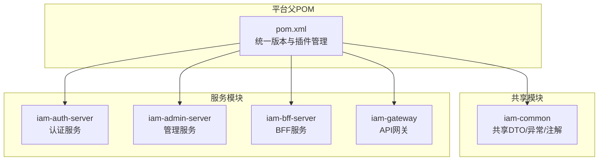
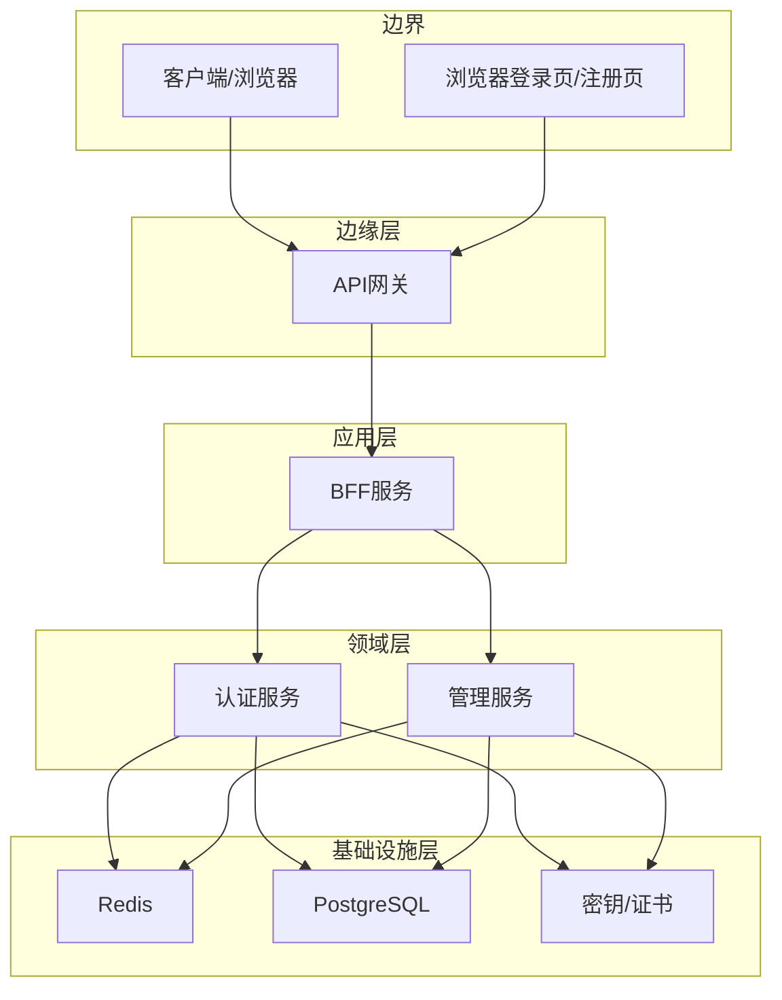
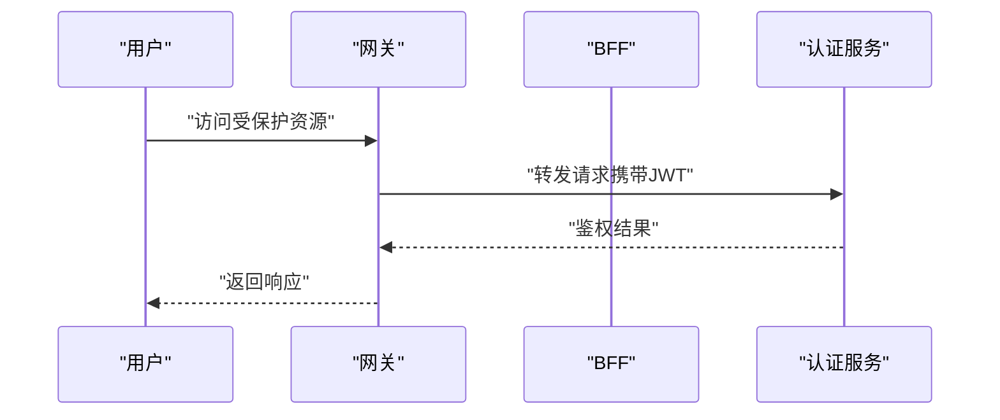
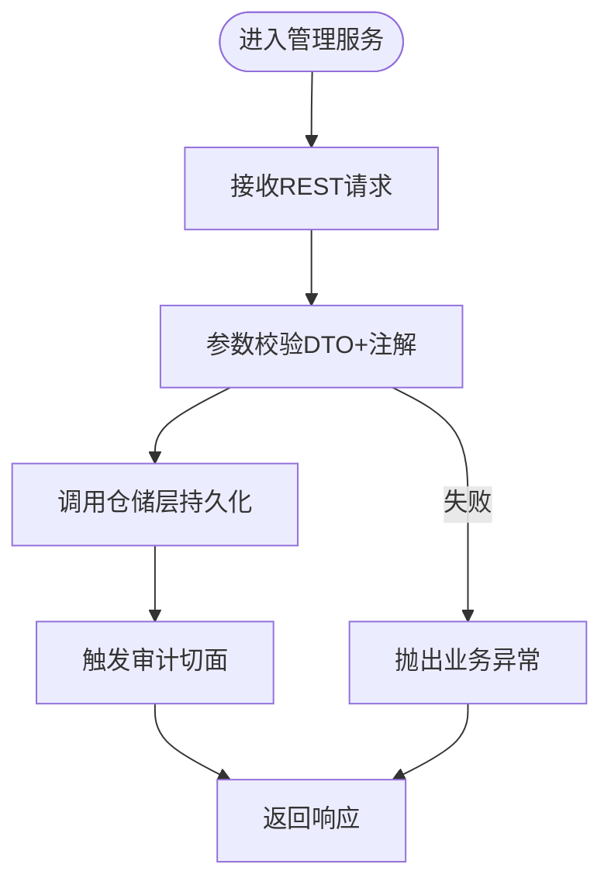
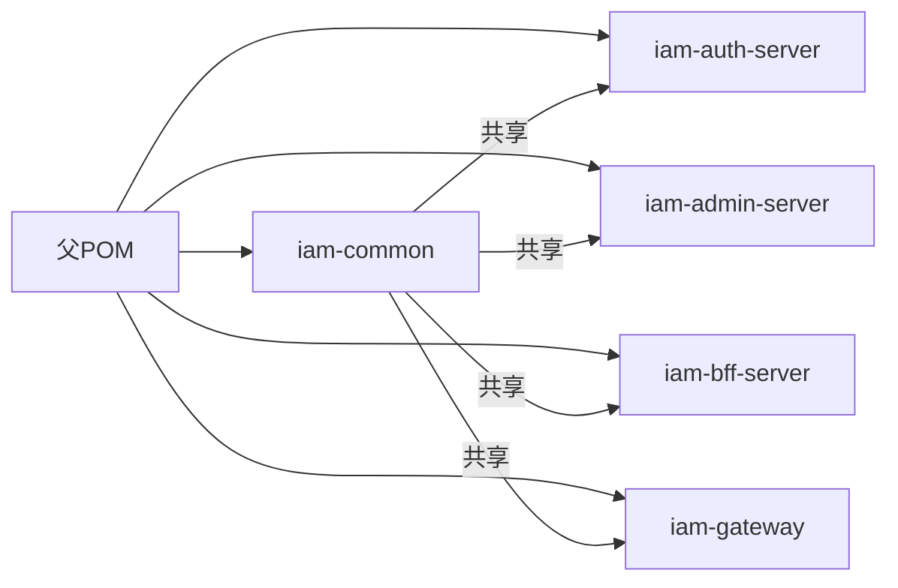

# 开发指南

<cite>
**本文引用的文件**
- [pom.xml](file://pom.xml)
- [iam-common\pom.xml](file://iam-common\pom.xml)
- [iam-auth-server\pom.xml](file://iam-auth-server\pom.xml)
- [iam-admin-server\pom.xml](file://iam-admin-server\pom.xml)
- [iam-bff-server\pom.xml](file://iam-bff-server\pom.xml)
- [iam-gateway\pom.xml](file://iam-gateway\pom.xml)
- [iam-common\src\main\java\iam\platform\common\model\exception\BusinessException.java](file://iam-common\src\main\java\iam\platform\common\model\exception\BusinessException.java)
- [iam-common\src\main\java\iam\platform\common\dto\request\CreatePersonRequest.java](file://iam-common\src\main\java\iam\platform\common\dto\request\CreatePersonRequest.java)
- [iam-admin-server\src\main\java\iam\platform\admin\SsoAdminServerApplication.java](file://iam-admin-server\src\main\java\iam\platform\admin\SsoAdminServerApplication.java)
- [iam-auth-server\src\main\java\iam\platform\auth\SsoAuthServerApplication.java](file://iam-auth-server\src\main\java\iam\platform\auth\SsoAuthServerApplication.java)
- [iam-bff-server\src\main\java\iam\platform\bff\IamBffServerApplication.java](file://iam-bff-server\src\main\java\iam\platform\bff\IamBffServerApplication.java)
- [iam-gateway\src\main\java\iam\platform\gateway\IamGatewayApplication.java](file://iam-gateway\src\main\java\iam\platform\gateway\IamGatewayApplication.java)
- [iam-admin-server\src\main\resources\application.yml](file://iam-admin-server\src\main\resources\application.yml)
- [iam-auth-server\src\main\resources\application.yml](file://iam-auth-server\src\main\resources\application.yml)
- [iam-bff-server\src\main\resources\application.yml](file://iam-bff-server\src\main\resources\application.yml)
- [iam-gateway\src\main\resources\application.yml](file://iam-gateway\src\main\resources\application.yml)
- [README.md](file://README.md)
</cite>

## 目录
1. [简介](#简介)
2. [项目结构](#项目结构)
3. [核心组件](#核心组件)
4. [架构总览](#架构总览)
5. [详细组件分析](#详细组件分析)
6. [依赖分析](#依赖分析)
7. [性能考虑](#性能考虑)
8. [故障排查指南](#故障排查指南)
9. [结论](#结论)
10. [附录](#附录)

## 简介
本指南面向IAM平台新老开发者，系统性阐述代码规范与最佳实践、开发环境搭建、Git工作流、测试策略、代码质量保障机制、扩展开发指南、性能优化与并发实践，以及学习路径与技能要求。平台采用多模块Maven聚合工程，结合Spring Boot 3与Spring Cloud生态，提供统一认证与授权能力，覆盖OIDC、CAS、SAML等多种协议。

## 项目结构
项目采用分层清晰的多模块架构，核心模块包括：
- iam-common：共享DTO、枚举、异常、注解与工具
- iam-auth-server：认证服务（OIDC Provider、CAS、SAML、LDAP等）
- iam-admin-server：管理服务（组织、人员、角色、权限等业务CRUD）
- iam-bff-server：前端后端（BFF）聚合服务
- iam-gateway：API网关（路由、鉴权、限流、可观测）

图表来源
- [pom.xml:1-226](file://pom.xml#L1-L226)
- [iam-common\pom.xml:1-47](file://iam-common\pom.xml#L1-L47)
- [iam-auth-server\pom.xml:1-180](file://iam-auth-server\pom.xml#L1-L180)
- [iam-admin-server\pom.xml:1-150](file://iam-admin-server\pom.xml#L1-L150)
- [iam-bff-server\pom.xml:1-107](file://iam-bff-server\pom.xml#L1-L107)
- [iam-gateway\pom.xml:1-106](file://iam-gateway\pom.xml#L1-L106)

章节来源
- [pom.xml:21-27](file://pom.xml#L21-L27)
- [README.md:95-108](file://README.md#L95-L108)

## 核心组件
- 统一异常体系：在共享模块中定义抽象业务异常基类，便于全局捕获与标准化响应。
- 请求DTO校验：使用Jakarta Validation注解与Lombok简化请求对象定义。
- 启动入口：各模块通过@SpringBootApplication扫描配置、JPA仓库与Feign客户端，确保模块内聚。

章节来源
- [iam-common\src\main\java\iam\platform\common\model\exception\BusinessException.java:1-17](file://iam-common\src\main\java\iam\platform\common\model\exception\BusinessException.java#L1-L17)
- [iam-common\src\main\java\iam\platform\common\dto\request\CreatePersonRequest.java:1-37](file://iam-common\src\main\java\iam\platform\common\dto\request\CreatePersonRequest.java#L1-L37)
- [iam-admin-server\src\main\java\iam\platform\admin\SsoAdminServerApplication.java:1-17](file://iam-admin-server\src\main\java\iam\platform\admin\SsoAdminServerApplication.java#L1-L17)
- [iam-auth-server\src\main\java\iam\platform\auth\SsoAuthServerApplication.java:1-19](file://iam-auth-server\src\main\java\iam\platform\auth\SsoAuthServerApplication.java#L1-L19)
- [iam-bff-server\src\main\java\iam\platform\bff\IamBffServerApplication.java:1-17](file://iam-bff-server\src\main\java\iam\platform\bff\IamBffServerApplication.java#L1-L17)
- [iam-gateway\src\main\java\iam\platform\gateway\IamGatewayApplication.java:1-15](file://iam-gateway\src\main\java\iam\platform\gateway\IamGatewayApplication.java#L1-L15)

## 架构总览
平台采用Clean Architecture + DDD分层，配合Spring Cloud实现服务发现、网关路由与限流、分布式会话与Redis缓存、可观测性（Prometheus + Zipkin）。

图表来源
- [iam-gateway\src\main\resources\application.yml:14-54](file://iam-gateway\src\main\resources\application.yml#L14-L54)
- [iam-bff-server\src\main\resources\application.yml:10-23](file://iam-bff-server\src\main\resources\application.yml#L10-L23)
- [iam-auth-server\src\main\resources\application.yml:10-37](file://iam-auth-server\src\main\resources\application.yml#L10-L37)
- [iam-admin-server\src\main\resources\application.yml:10-37](file://iam-admin-server\src\main\resources\application.yml#L10-L37)

## 详细组件分析

### 认证服务（iam-auth-server）
- 功能要点：OIDC Provider、CAS单点登出、SAML断言、LDAP目录集成、验证码登录、速率限制与账户锁定策略。
- 关键配置：数据库连接、Redis会话、JWK密钥、安全策略（速率限制、IP黑白名单）、LDAP与CAS参数。
- 启动类：启用Feign客户端扫描与JPA仓库，加载配置包。

图表来源
- [iam-gateway\src\main\resources\application.yml:70-91](file://iam-gateway\src\main\resources\application.yml#L70-L91)
- [iam-auth-server\src\main\resources\application.yml:10-44](file://iam-auth-server\src\main\resources\application.yml#L10-L44)

章节来源
- [iam-auth-server\src\main\java\iam\platform\auth\SsoAuthServerApplication.java:1-19](file://iam-auth-server\src\main\java\iam\platform\auth\SsoAuthServerApplication.java#L1-L19)
- [iam-auth-server\src\main\resources\application.yml:90-127](file://iam-auth-server\src\main\resources\application.yml#L90-L127)

### 管理服务（iam-admin-server）
- 功能要点：组织、人员、角色、权限、审计日志、仪表盘统计。
- 关键配置：数据库连接、Redis会话、Flyway迁移、OpenAPI文档、审计异步线程池。
- 启动类：扫描配置包与JPA仓库，启用AOP审计切面。

图表来源
- [iam-common\src\main\java\iam\platform\common\dto\request\CreatePersonRequest.java:1-37](file://iam-common\src\main\java\iam\platform\common\dto\request\CreatePersonRequest.java#L1-L37)
- [iam-common\src\main\java\iam\platform\common\model\exception\BusinessException.java:1-17](file://iam-common\src\main\java\iam\platform\common\model\exception\BusinessException.java#L1-L17)
- [iam-admin-server\src\main\resources\application.yml:94-102](file://iam-admin-server\src\main\resources\application.yml#L94-L102)

章节来源
- [iam-admin-server\src\main\java\iam\platform\admin\SsoAdminServerApplication.java:1-17](file://iam-admin-server\src\main\java\iam\platform\admin\SsoAdminServerApplication.java#L1-L17)
- [iam-admin-server\src\main\resources\application.yml:10-51](file://iam-admin-server\src\main\resources\application.yml#L10-L51)

### BFF服务（iam-bff-server）
- 功能要点：聚合后端服务、模板渲染（Thymeleaf）、前端交互。
- 关键配置：Thymeleaf模板路径、Jackson时区与格式、Feign超时配置、管理端点。

章节来源
- [iam-bff-server\src\main\java\iam\platform\bff\IamBffServerApplication.java:1-17](file://iam-bff-server\src\main\java\iam\platform\bff\IamBffServerApplication.java#L1-L17)
- [iam-bff-server\src\main\resources\application.yml:10-23](file://iam-bff-server\src\main\resources\application.yml#L10-L23)

### 网关（iam-gateway）
- 功能要点：基于路径与域名的路由、全局CORS、JWT资源服务器、Redis限流。
- 关键配置：路由规则、Host匹配、跨域配置、JWT issuer、Redis限流参数。

章节来源
- [iam-gateway\src\main\java\iam\platform\gateway\IamGatewayApplication.java:1-15](file://iam-gateway\src\main\java\iam\platform\gateway\IamGatewayApplication.java#L1-L15)
- [iam-gateway\src\main\resources\application.yml:14-68](file://iam-gateway\src\main\resources\application.yml#L14-L68)

## 依赖分析
- 父POM统一管理Spring Cloud与Spring Cloud Alibaba版本、MapStruct、Testcontainers、OpenSAML等依赖，并提供编译插件与Lombok、MapStruct注解处理器配置。
- 各子模块按需引入starter与第三方依赖，如认证服务引入Spring Authorization Server、OpenSAML、LDAP；网关引入Gateway、Reactive Redis；BFF引入OpenFeign与LoadBalancer。

图表来源
- [pom.xml:43-122](file://pom.xml#L43-L122)
- [iam-common\pom.xml:18-37](file://iam-common\pom.xml#L18-L37)
- [iam-auth-server\pom.xml:18-166](file://iam-auth-server\pom.xml#L18-L166)
- [iam-admin-server\pom.xml:18-136](file://iam-admin-server\pom.xml#L18-L136)
- [iam-bff-server\pom.xml:18-88](file://iam-bff-server\pom.xml#L18-L88)
- [iam-gateway\pom.xml:17-95](file://iam-gateway\pom.xml#L17-L95)

章节来源
- [pom.xml:124-175](file://pom.xml#L124-L175)

## 性能考虑
- 并发与线程池：审计日志异步线程池参数可调，避免阻塞主业务线程。
- 缓存与会话：Redis用于分布式会话与限流，合理设置连接池与超时。
- 数据库：Hikari连接池参数已配置，Flyway迁移确保Schema一致性。
- 观测性：Actuator + Prometheus + Zipkin采样率100%，便于定位热点与慢调用。
- 网关限流：基于Redis的令牌桶限流，按路由粒度配置不同速率与容量。

章节来源
- [iam-admin-server\src\main\resources\application.yml:94-102](file://iam-admin-server\src\main\resources\application.yml#L94-L102)
- [iam-auth-server\src\main\resources\application.yml:19-24](file://iam-auth-server\src\main\resources\application.yml#L19-L24)
- [iam-gateway\src\main\resources\application.yml:25-29](file://iam-gateway\src\main\resources\application.yml#L25-L29)

## 故障排查指南
- 启动失败：检查各模块application.yml中的数据库、Redis、SSL与密钥路径是否正确。
- 认证异常：确认OIDC issuer、JWK私钥/公钥位置、CAS/SAML配置项是否齐全。
- 网关路由：核对Host与Path断言、限流参数、CORS配置。
- 审计日志：关注异步线程池大小与队列容量，避免积压导致延迟。
- 日志级别：根据需要调整gateway与gateway包的日志级别以辅助定位。

章节来源
- [iam-auth-server\src\main\resources\application.yml:81-127](file://iam-auth-server\src\main\resources\application.yml#L81-L127)
- [iam-gateway\src\main\resources\application.yml:55-68](file://iam-gateway\src\main\resources\application.yml#L55-L68)
- [iam-admin-server\src\main\resources\application.yml:94-102](file://iam-admin-server\src\main\resources\application.yml#L94-L102)

## 结论
本指南提供了从代码规范、开发环境、Git工作流、测试策略到质量保障与扩展开发的完整实践路径。建议团队在日常开发中严格遵循Lombok使用、方法长度与类长度限制、单元测试覆盖率目标，配合统一的多环境配置与可观测性体系，持续提升系统的稳定性与可维护性。

## 附录

### 代码规范与最佳实践
- Lombok使用：在共享模块与各服务模块均引入Lombok，减少样板代码；注意在父POM中排除Lombok在某些插件中的打包。
- 方法长度限制：单方法不超过50行，单类不超过500行，保持高内聚低耦合。
- 单元测试覆盖率：目标≥80%，优先覆盖核心业务逻辑与异常分支。
- DTO校验：使用Jakarta Validation注解，结合Lombok注解提升可读性与简洁性。
- 统一异常：通过BusinessException抽象类统一错误码与HTTP状态。

章节来源
- [README.md:112-118](file://README.md#L112-L118)
- [iam-common\pom.xml:19-30](file://iam-common\pom.xml#L19-L30)
- [pom.xml:128-137](file://pom.xml#L128-L137)
- [iam-common\src\main\java\iam\platform\common\model\exception\BusinessException.java:1-17](file://iam-common\src\main\java\iam\platform\common\model\exception\BusinessException.java#L1-L17)
- [iam-common\src\main\java\iam\platform\common\dto\request\CreatePersonRequest.java:1-37](file://iam-common\src\main\java\iam\platform\common\dto\request\CreatePersonRequest.java#L1-L37)

### 开发环境搭建
- JDK 21、PostgreSQL 14+、Redis 7+、Maven 3.8+、Docker。
- 默认启动：在根目录执行Maven命令启动所有服务或单模块服务。
- SSL：可通过环境变量启用HTTPS与指定密钥库路径。
- IDE建议：启用Lombok注解处理、MapStruct注解处理器；配置Maven自动导入与编码UTF-8。

章节来源
- [README.md:67-82](file://README.md#L67-L82)
- [iam-auth-server\src\main\resources\application.yml:3-8](file://iam-auth-server\src\main\resources\application.yml#L3-L8)
- [iam-admin-server\src\main\resources\application.yml:3-8](file://iam-admin-server\src\main\resources\application.yml#L3-L8)
- [pom.xml:149-171](file://pom.xml#L149-L171)

### Git工作流
- 分支策略：feature/* → develop → release/* → canary/* → master，对应DEV/TEST/CANARY/PROD环境。
- 提交规范：遵循团队约定（详见README链接文档）。
- 代码审查：PR至少一名Reviewer，涉及敏感变更（DDL、密钥）需多人确认。

章节来源
- [README.md:119-128](file://README.md#L119-L128)

### 测试策略
- 单元测试：使用JUnit与Spring Boot Test，覆盖核心业务与边界条件。
- 集成测试：使用Testcontainers启动PostgreSQL容器，验证数据库迁移与服务连通性。
- 端到端测试：结合Swagger UI与浏览器登录页，验证OIDC/CAS/SAML流程。

章节来源
- [iam-auth-server\pom.xml:148-166](file://iam-auth-server\pom.xml#L148-L166)
- [iam-admin-server\pom.xml:118-136](file://iam-admin-server\pom.xml#L118-L136)
- [pom.xml:91-103](file://pom.xml#L91-L103)

### 代码质量保证机制
- 静态代码分析：启用编译警告与-Xlint，统一编码与注解处理器。
- 代码覆盖率：结合单元测试与集成测试，目标覆盖率≥80%。
- 持续集成：通过多环境Profile与Docker镜像标签实现自动化构建与部署。

章节来源
- [pom.xml:149-171](file://pom.xml#L149-L171)
- [README.md:116](file://README.md#L116)

### 扩展开发指南
- 插件开发：在各自模块内新增领域实体与仓储实现，遵循Clean Architecture分层。
- 自定义认证处理器：在认证服务中扩展Pre/Post认证管道与适配器。
- 协议扩展：新增协议适配器（如CAS/SAML/OIDC）时，完善配置类与控制器，并补充测试。

章节来源
- [iam-auth-server\src\main\java\iam\platform\auth\SsoAuthServerApplication.java:1-19](file://iam-auth-server\src\main\java\iam\platform\auth\SsoAuthServerApplication.java#L1-L19)

### 性能优化与并发最佳实践
- 线程池：审计日志异步线程池参数需结合QPS与延迟目标调优。
- 缓存：合理利用Redis缓存热点数据与分布式会话，避免热点Key。
- 数据库：Hikari连接池参数与Flyway迁移策略需与业务峰值匹配。
- 网关：按路由维度设置不同限流参数，避免单路由成为瓶颈。

章节来源
- [iam-admin-server\src\main\resources\application.yml:94-102](file://iam-admin-server\src\main\resources\application.yml#L94-L102)
- [iam-gateway\src\main\resources\application.yml:25-29](file://iam-gateway\src\main\resources\application.yml#L25-L29)

### 学习路径与技能要求
- 必备技能：Java 21、Spring Boot 3、Spring Cloud、JPA/Hibernate、Redis、PostgreSQL、Maven、Docker。
- 进阶方向：OIDC/CAS/SAML协议原理与实现、分布式限流与熔断、可观测性（Prometheus/Zipkin）、安全策略（JWT、加密、白名单）。
- 新人入门：先熟悉模块结构与启动类，再阅读各模块application.yml与关键配置类，最后参与单元/集成测试编写。

章节来源
- [README.md:16-33](file://README.md#L16-L33)
- [README.md:110-118](file://README.md#L110-L118)