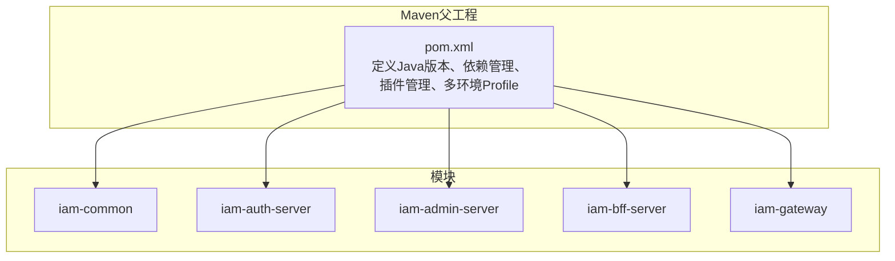
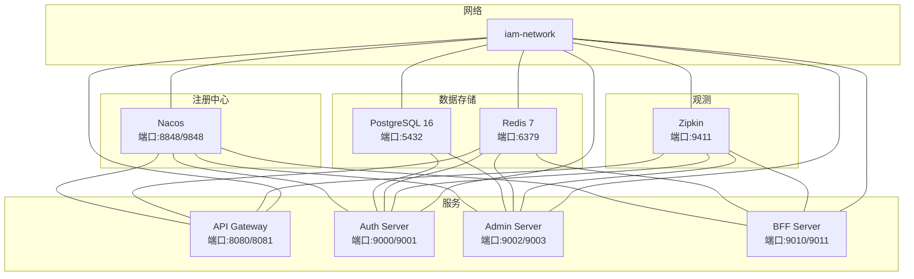
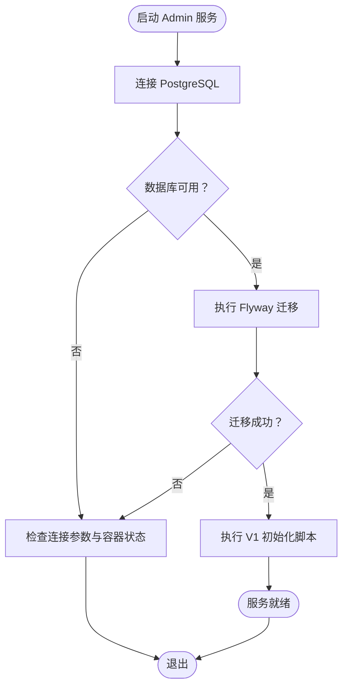
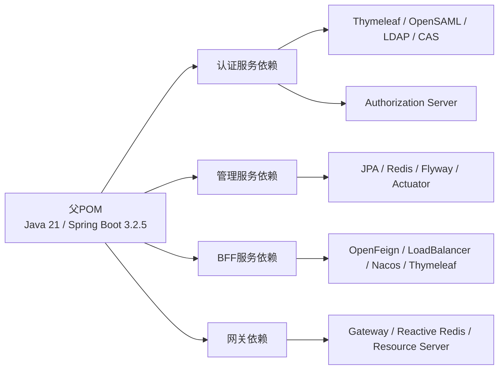

# 开发环境搭建

<cite>
**本文引用的文件**
- [README.md](file://README.md)
- [pom.xml](file://pom.xml)
- [.mvn/wrapper/maven-wrapper.properties](file://.mvn/wrapper/maven-wrapper.properties)
- [iam-admin-server/pom.xml](file://iam-admin-server/pom.xml)
- [iam-auth-server/pom.xml](file://iam-auth-server/pom.xml)
- [iam-bff-server/pom.xml](file://iam-bff-server/pom.xml)
- [iam-gateway/pom.xml](file://iam-gateway/pom.xml)
- [docker-compose.yml](file://docker-compose.yml)
- [iam-admin-server/src/main/resources/application-dev.yml](file://iam-admin-server/src/main/resources/application-dev.yml)
- [iam-auth-server/src/main/resources/application-dev.yml](file://iam-auth-server/src/main/resources/application-dev.yml)
- [iam-bff-server/src/main/resources/application-dev.yml](file://iam-bff-server/src/main/resources/application-dev.yml)
- [iam-gateway/src/main/resources/application-dev.yml](file://iam-gateway/src/main/resources/application-dev.yml)
- [iam-admin-server/bootstrap.yml](file://iam-admin-server/bootstrap.yml)
- [iam-auth-server/bootstrap.yml](file://iam-auth-server/bootstrap.yml)
- [iam-bff-server/bootstrap.yml](file://iam-bff-server/bootstrap.yml)
- [iam-gateway/bootstrap.yml](file://iam-gateway/bootstrap.yml)
- [iam-admin-server/src/main/resources/db/migration/V1__complete_schema_initialization.sql](file://iam-admin-server/src/main/resources/db/migration/V1__complete_schema_initialization.sql)
</cite>

## 目录
1. [简介](#简介)
2. [项目结构](#项目结构)
3. [核心组件](#核心组件)
4. [架构总览](#架构总览)
5. [详细组件分析](#详细组件分析)
6. [依赖分析](#依赖分析)
7. [性能考虑](#性能考虑)
8. [故障排查指南](#故障排查指南)
9. [结论](#结论)
10. [附录](#附录)

## 简介
本文件面向IAM平台的本地开发环境搭建，覆盖硬件与软件要求、IDE配置、Maven构建与依赖管理、数据库初始化与Flyway迁移、Docker容器编排、开发工具推荐以及常见问题排查。目标是帮助开发者在本地快速拉起完整的开发环境，并理解各模块的职责与交互。

## 项目结构
项目采用多模块Maven聚合工程，包含通用模块与四个业务/基础设施模块：
- iam-common：公共API、DTO、异常与通用模型
- iam-auth-server：OAuth2/OIDC认证服务（授权服务器）
- iam-admin-server：管理后台（业务CRUD + Flyway迁移）
- iam-bff-server：前端后端（聚合与路由）
- iam-gateway：API网关（路由、鉴权、限流）

图表来源
- [pom.xml:1-226](file://pom.xml#L1-L226)
- [iam-admin-server/pom.xml:1-150](file://iam-admin-server/pom.xml#L1-L150)
- [iam-auth-server/pom.xml:1-180](file://iam-auth-server/pom.xml#L1-L180)
- [iam-bff-server/pom.xml:1-107](file://iam-bff-server/pom.xml#L1-L107)
- [iam-gateway/pom.xml:1-106](file://iam-gateway/pom.xml#L1-L106)

章节来源
- [pom.xml:1-226](file://pom.xml#L1-L226)

## 核心组件
- JDK 21：所有模块统一使用Java 21；Maven编译插件与属性已锁定。
- Spring Boot 3.2.5：统一框架版本，确保兼容性。
- PostgreSQL 14+：主数据库，使用PostgreSQL 16镜像进行本地开发。
- Redis 7+：缓存、分布式会话、限流。
- Flyway：数据库迁移，V1脚本初始化完整Schema。
- Maven 3.8+：内置包装器，简化构建。
- Docker：一键编排Nacos、PostgreSQL、Redis、Zipkin及各服务。

章节来源
- [README.md:16-32](file://README.md#L16-L32)
- [pom.xml:29-41](file://pom.xml#L29-L41)
- [docker-compose.yml:1-190](file://docker-compose.yml#L1-L190)

## 架构总览
本地开发采用Docker Compose编排，服务通过Nacos注册发现，数据库与缓存由容器提供，服务间通过Nacos命名空间隔离。

图表来源
- [docker-compose.yml:1-190](file://docker-compose.yml#L1-L190)

章节来源
- [docker-compose.yml:1-190](file://docker-compose.yml#L1-L190)

## 详细组件分析

### 数据库与迁移（PostgreSQL + Flyway）
- 迁移引擎：Flyway
- 迁移脚本位置：classpath:db/migration
- 初始Schema：V1__complete_schema_initialization.sql，包含角色、人员、租户、组织、应用、权限、审计日志等表及默认数据
- 开发环境配置：application-dev.yml启用SQL输出、关闭模板缓存、开启Swagger UI

图表来源
- [iam-admin-server/src/main/resources/application-dev.yml:1-26](file://iam-admin-server/src/main/resources/application-dev.yml#L1-L26)
- [iam-admin-server/src/main/resources/db/migration/V1__complete_schema_initialization.sql:1-720](file://iam-admin-server/src/main/resources/db/migration/V1__complete_schema_initialization.sql#L1-L720)

章节来源
- [iam-admin-server/src/main/resources/application-dev.yml:1-26](file://iam-admin-server/src/main/resources/application-dev.yml#L1-L26)
- [iam-admin-server/src/main/resources/db/migration/V1__complete_schema_initialization.sql:1-720](file://iam-admin-server/src/main/resources/db/migration/V1__complete_schema_initialization.sql#L1-L720)

### 缓存与会话（Redis）
- 用途：分布式会话、缓存、限流
- 默认密码：iam59!z$
- 端口：6379
- 网络：与各服务共享iam-network

章节来源
- [docker-compose.yml:43-56](file://docker-compose.yml#L43-L56)

### 注册中心（Nacos）
- 用途：服务注册与发现
- 端口：8848/9848
- 命名空间：iam-platform-dev
- 各服务通过bootstrap.yml读取NACOS_ADDR与NACOS_NAMESPACE

章节来源
- [docker-compose.yml:4-21](file://docker-compose.yml#L4-L21)
- [iam-admin-server/bootstrap.yml:1-10](file://iam-admin-server/bootstrap.yml#L1-L10)
- [iam-auth-server/bootstrap.yml:1-10](file://iam-auth-server/bootstrap.yml#L1-L10)
- [iam-bff-server/bootstrap.yml:1-10](file://iam-bff-server/bootstrap.yml#L1-L10)
- [iam-gateway/bootstrap.yml:1-10](file://iam-gateway/bootstrap.yml#L1-L10)

### 网关（API Gateway）
- 功能：路由到认证服务、请求限流（基于Redis）
- 开发配置：启用DEBUG日志、开启路由规则（/auth/** -> lb://iam-auth-service）、限流参数

章节来源
- [iam-gateway/src/main/resources/application-dev.yml:1-22](file://iam-gateway/src/main/resources/application-dev.yml#L1-L22)

### 认证服务（Auth Server）
- 功能：OIDC Provider、Thymeleaf登录页、外部登录（如钉钉）、验证码开关
- 开发配置：开启SQL输出、Thymeleaf不缓存、日志级别、加密密钥来自环境变量

章节来源
- [iam-auth-server/src/main/resources/application-dev.yml:1-34](file://iam-auth-server/src/main/resources/application-dev.yml#L1-L34)

### 管理服务（Admin Server）
- 功能：业务CRUD、审计日志、Flyway迁移
- 开发配置：开启SQL输出、Thymeleaf不缓存、日志级别、加密密钥来自环境变量、启用Swagger UI

章节来源
- [iam-admin-server/src/main/resources/application-dev.yml:1-26](file://iam-admin-server/src/main/resources/application-dev.yml#L1-L26)

### BFF服务
- 功能：前端后端聚合、模板渲染
- 开发配置：开启DEBUG日志、Thymeleaf不缓存

章节来源
- [iam-bff-server/src/main/resources/application-dev.yml:1-10](file://iam-bff-server/src/main/resources/application-dev.yml#L1-L10)

## 依赖分析
- Java版本：统一为21
- Spring Boot版本：3.2.5（父POM锁定）
- Spring Authorization Server：1.2.5（OIDC Provider）
- MapStruct：1.5.5.Final
- Springdoc OpenAPI：2.3.0
- Testcontainers：1.19.7
- OpenSAML：4.3.2（SAML支持）
- Spring Cloud与Spring Cloud Alibaba：通过BOM统一管理
- 各模块依赖差异：
  - 认证服务：Thymeleaf、OpenSAML、LDAP、CAS、Authorization Server
  - 管理服务：JPA、Redis、Actuator、Prometheus、Tracing、Flyway
  - BFF服务：OpenFeign、LoadBalancer、Nacos、Thymeleaf
  - 网关：Spring Cloud Gateway、Reactive Redis、OAuth2 Resource Server

图表来源
- [pom.xml:43-121](file://pom.xml#L43-L121)
- [iam-auth-server/pom.xml:18-94](file://iam-auth-server/pom.xml#L18-L94)
- [iam-admin-server/pom.xml:18-81](file://iam-admin-server/pom.xml#L18-L81)
- [iam-bff-server/pom.xml:18-80](file://iam-bff-server/pom.xml#L18-L80)
- [iam-gateway/pom.xml:17-81](file://iam-gateway/pom.xml#L17-L81)

章节来源
- [pom.xml:29-121](file://pom.xml#L29-L121)
- [iam-auth-server/pom.xml:18-166](file://iam-auth-server/pom.xml#L18-L166)
- [iam-admin-server/pom.xml:18-136](file://iam-admin-server/pom.xml#L18-L136)
- [iam-bff-server/pom.xml:18-106](file://iam-bff-server/pom.xml#L18-L106)
- [iam-gateway/pom.xml:17-95](file://iam-gateway/pom.xml#L17-L95)

## 性能考虑
- 日志级别：开发环境开启DEBUG有助于定位问题，但会增加I/O开销；生产建议调整为INFO/ERROR。
- SQL输出：开发环境show-sql与format_sql便于调试，生产应关闭以减少日志量。
- 模板缓存：Thymeleaf在开发关闭缓存提升迭代效率，生产建议开启。
- Redis限流：网关基于Redis限流，注意Redis性能与容量规划。
- 观测性：Actuator + Prometheus + Zipkin链路追踪，建议在本地仅启用必要组件。

## 故障排查指南
- 数据库无法连接
  - 检查PostgreSQL容器健康状态与端口映射
  - 核对连接参数（DB_HOST/DB_PORT/DB_NAME/DB_USERNAME/DB_PASSWORD）
  - 参考：[docker-compose.yml:23-41](file://docker-compose.yml#L23-L41)
- Redis无法连接或认证失败
  - 检查Redis容器健康状态与密码
  - 参考：[docker-compose.yml:43-56](file://docker-compose.yml#L43-L56)
- Nacos不可用
  - 检查端口8848/9848映射与健康检查
  - 参考：[docker-compose.yml:4-21](file://docker-compose.yml#L4-L21)
- Flyway迁移失败
  - 查看Admin服务日志中SQL错误
  - 确认classpath:db/migration路径存在且脚本无语法错误
  - 参考：[application-dev.yml:7-8](file://iam-admin-server/src/main/resources/application-dev.yml#L7-L8)
- 服务启动后无法访问
  - 确认各服务端口映射与容器健康状态
  - 网关路由是否正确指向认证服务
  - 参考：[docker-compose.yml:67-92](file://docker-compose.yml#L67-L92)、[application-dev.yml:11-21](file://iam-gateway/src/main/resources/application-dev.yml#L11-L21)
- 环境变量缺失
  - ENCRYPTION_KEY、NACOS_ADDR、NACOS_NAMESPACE、REDIS_PASSWORD等
  - 参考：[application-dev.yml:13-14](file://iam-admin-server/src/main/resources/application-dev.yml#L13-L14)、[bootstrap.yml:5-6](file://iam-auth-server/bootstrap.yml#L5-L6)

章节来源
- [docker-compose.yml:1-190](file://docker-compose.yml#L1-L190)
- [iam-admin-server/src/main/resources/application-dev.yml:1-26](file://iam-admin-server/src/main/resources/application-dev.yml#L1-L26)
- [iam-gateway/src/main/resources/application-dev.yml:1-22](file://iam-gateway/src/main/resources/application-dev.yml#L1-L22)
- [iam-auth-server/bootstrap.yml:1-10](file://iam-auth-server/bootstrap.yml#L1-L10)

## 结论
通过Docker Compose可快速搭建包含注册中心、数据库、缓存与观测系统的本地开发环境。结合Maven多模块工程与Flyway迁移，开发者可以高效完成认证、管理、网关与BFF服务的本地联调与测试。建议在开发阶段保持DEBUG日志与模板缓存关闭，在生产阶段按需优化性能与安全配置。

## 附录

### 硬件与软件要求
- JDK 21+
- PostgreSQL 14+（本地使用16镜像）
- Redis 7+
- Maven 3.8+
- Docker

章节来源
- [README.md:67-72](file://README.md#L67-L72)
- [docker-compose.yml:24-46](file://docker-compose.yml#L24-L46)

### IDE配置指南（IntelliJ IDEA/Eclipse）
- 导入项目
  - IntelliJ IDEA：打开根目录的pom.xml，选择“Add as Maven Project”
  - Eclipse：File -> Import -> Maven -> Existing Maven Projects，选择根目录
- 插件安装
  - Lombok（减少样板代码）
  - MapStruct Processor（对象映射）
  - Spring Boot插件（运行与调试）
- 代码风格
  - 统一编码：UTF-8
  - 编译版本：Java 21
  - 方法长度≤50行，类长度≤500行
- 运行配置
  - 使用Maven Wrapper：./mvnw
  - 默认激活dev环境，端口见下节

章节来源
- [pom.xml:124-174](file://pom.xml#L124-L174)
- [README.md:110-117](file://README.md#L110-L117)

### Maven构建与依赖管理
- 父POM统一管理版本与依赖范围
- 多环境Profile：dev/test/canary/prod
- 内置Maven Wrapper（3.8+）
- 各模块独立构建与打包

章节来源
- [pom.xml:177-216](file://pom.xml#L177-L216)
- [.mvn/wrapper/maven-wrapper.properties:1-4](file://.mvn/wrapper/maven-wrapper.properties#L1-L4)

### 数据库初始化与Flyway迁移
- 迁移脚本：classpath:db/migration
- 初始脚本：V1__complete_schema_initialization.sql
- 执行时机：Admin服务启动时自动执行（Flyway自动迁移）
- 开发建议：首次启动前确保PostgreSQL与Redis容器健康

章节来源
- [iam-admin-server/src/main/resources/application-dev.yml:7-8](file://iam-admin-server/src/main/resources/application-dev.yml#L7-L8)
- [iam-admin-server/src/main/resources/db/migration/V1__complete_schema_initialization.sql:1-720](file://iam-admin-server/src/main/resources/db/migration/V1__complete_schema_initialization.sql#L1-L720)

### Docker环境搭建与容器编排
- 编排文件：docker-compose.yml
- 服务清单：Nacos、PostgreSQL、Redis、Zipkin、Gateway、Auth、Admin、BFF
- 网络：iam-network桥接
- 健康检查：Nacos、PostgreSQL、Redis均配置健康检查

章节来源
- [docker-compose.yml:1-190](file://docker-compose.yml#L1-L190)

### 开发工具推荐
- Postman：API测试与自动化
- pgAdmin：PostgreSQL可视化管理
- Redis Desktop Manager：Redis键值管理
- IntelliJ IDEA/Eclipse：代码编辑与调试
- Docker Desktop：容器编排与日志查看

章节来源
- [README.md:1-201](file://README.md#L1-L201)

### 访问端点（默认开发环境）
- Swagger UI：http://localhost:9000/swagger-ui.html
- OIDC元数据：http://localhost:9000/.well-known/openid-configuration
- 登录页面：http://localhost:9000/login
- 健康检查：http://localhost:9001/actuator/health

章节来源
- [README.md:84-94](file://README.md#L84-L94)