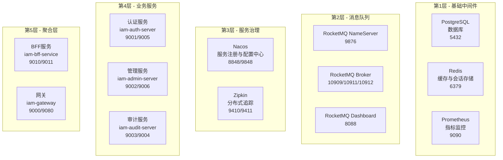
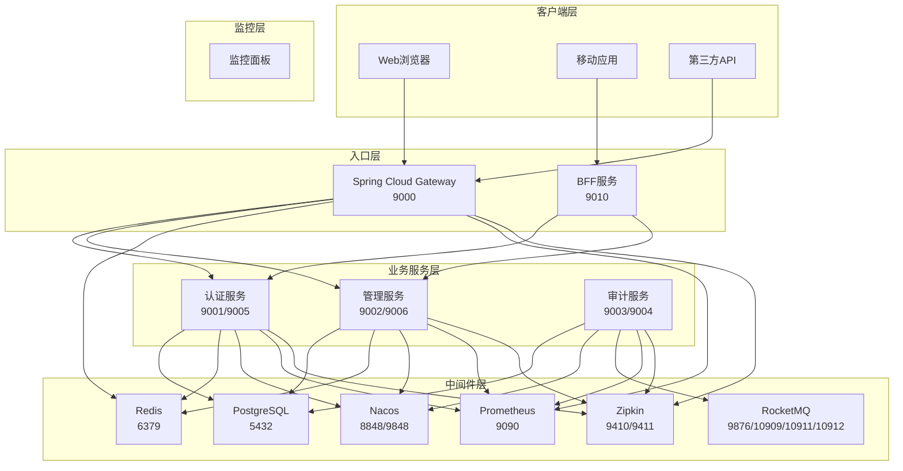
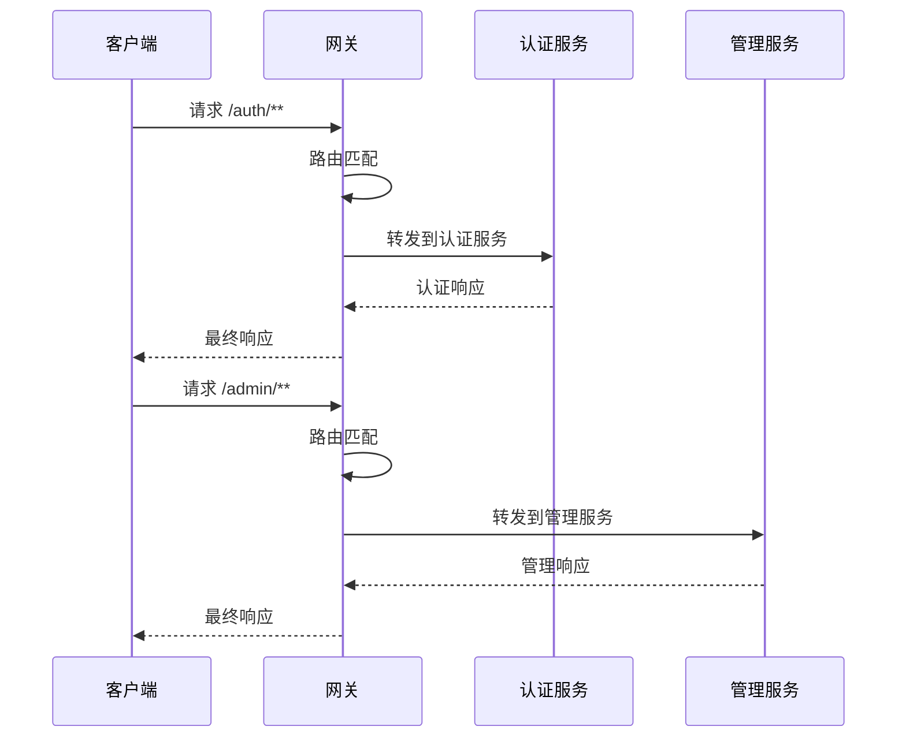

# 中间件环境配置指南

<cite>
**本文档引用的文件**
- [docker-compose.yml](file://docker-compose.yml)
- [docker-compose.middleware.yml](file://docker-compose.middleware.yml)
- [docker-compose.app.yml](file://docker-compose.app.yml)
- [DOCKER-COMPOSE-USAGE.md](file://DOCKER-COMPOSE-USAGE.md)
- [application.yml (认证服务)](file://iam-auth-server/src/main/resources/application.yml)
- [application.yml (管理服务)](file://iam-admin-server/src/main/resources/application.yml)
- [application.yml (审计服务)](file://iam-audit-server/src/main/resources/application.yml)
- [application.yml (网关)](file://iam-gateway/src/main/resources/application.yml)
- [pom.xml (父项目)](file://pom.xml)
</cite>

## 更新摘要
**所做更改**
- 删除了原有的MIDDLEWARE_SETUP.md引用和相关内容
- 将中间件配置整合到DOCKER-COMPOSE-USAGE.md的现有结构中
- 更新了章节组织，使中间件配置与Docker Compose使用指南保持一致
- 重新整理了架构图和配置示例，确保与当前的分层架构相匹配

## 目录
1. [简介](#简介)
2. [项目结构概览](#项目结构概览)
3. [核心组件配置](#核心组件配置)
4. [架构概览](#架构概览)
5. [详细组件分析](#详细组件分析)
6. [依赖关系分析](#依赖关系分析)
7. [性能考虑](#性能考虑)
8. [故障排除指南](#故障排除指南)
9. [结论](#结论)

## 简介

本指南详细介绍了IAM平台的中间件环境配置，包括本地开发环境的完整部署方案。该平台采用微服务架构，集成了多个中间件组件，为开发者提供了一个完整的认证授权基础设施。

平台支持多种认证协议，包括OAuth2/OIDC、CAS、SAML等，并提供了完善的监控、追踪和审计功能。通过Docker容器化部署，确保了开发环境的一致性和可移植性。

**章节来源**
- [DOCKER-COMPOSE-USAGE.md:1-244](file://DOCKER-COMPOSE-USAGE.md#L1-L244)

## 项目结构概览

IAM平台采用分层Docker Compose配置架构，将中间件和应用服务分离管理：



**图表来源**
- [docker-compose.middleware.yml:17-163](file://docker-compose.middleware.yml#L17-L163)
- [docker-compose.app.yml:1-121](file://docker-compose.app.yml#L1-L121)

**章节来源**
- [docker-compose.middleware.yml:17-163](file://docker-compose.middleware.yml#L17-L163)
- [docker-compose.app.yml:1-121](file://docker-compose.app.yml#L1-L121)

## 核心组件配置

### 基础中间件层

#### PostgreSQL数据库

提供关系型数据存储，支持完整的SQL功能：

- **版本**: dhi.io/postgres:18-alpine3.23-dev
- **端口**: 5432
- **认证**: postgres/STPass123!
- **数据库**: iam_platform
- **数据目录**: /var/lib/postgresql/18/data
- **健康检查**: 每10秒检查一次，最多重试5次

#### Redis缓存系统

分布式缓存和会话存储解决方案：

- **版本**: redis:8.6
- **端口**: 6379
- **认证**: iam59!z$
- **配置**: AOF持久化，密码认证
- **健康检查**: 每10秒检查一次，最多重试5次

#### Prometheus监控系统

指标监控和可视化工具：

- **版本**: ubuntu/prometheus:3.11-24.04_stable
- **端口**: 9090
- **配置**: 外部挂载prometheus.yml配置文件
- **数据持久化**: /prometheus目录

**章节来源**
- [docker-compose.middleware.yml:22-57](file://docker-compose.middleware.yml#L22-L57)
- [docker-compose.middleware.yml:59-68](file://docker-compose.middleware.yml#L59-L68)

### 消息队列层

#### RocketMQ消息中间件

高性能消息中间件：

- **NameServer**: 端口9876，依赖关系：先启动
- **Broker**: 端口10909/10911/10912，依赖NameServer
- **Dashboard**: 端口8088，管理界面
- **内存**: 256MB JVM配置
- **存储**: 外部挂载broker.conf、logs、store目录

**章节来源**
- [docker-compose.middleware.yml:74-120](file://docker-compose.middleware.yml#L74-L120)

### 服务治理层

#### Nacos服务注册与配置中心

- **版本**: nacos/nacos-server:v2.3.2
- **端口**: 8848 (HTTP), 9848 (gRPC)
- **模式**: 单机模式 (MODE=standalone)
- **JVM配置**: XMS/XMX=1g, XMN=512m
- **健康检查**: 每30秒检查一次，最多重试3次

#### Zipkin分布式追踪

- **版本**: openzipkin/zipkin:3
- **端口**: 9410, 9411
- **健康检查**: 每30秒检查一次，最多重试3次

**章节来源**
- [docker-compose.middleware.yml:126-162](file://docker-compose.middleware.yml#L126-L162)

## 架构概览

平台采用分层架构设计，实现了清晰的职责分离：



**图表来源**
- [docker-compose.yml:10-83](file://docker-compose.yml#L10-L83)
- [DOCKER-COMPOSE-USAGE.md:13-36](file://DOCKER-COMPOSE-USAGE.md#L13-L36)

## 详细组件分析

### 认证服务配置

认证服务是整个平台的核心，提供了完整的身份认证和授权功能：

```mermaid
classDiagram
class AuthServerConfig {
+server.port : 9001
+ssl.enabled : ${SSL_ENABLED : false}
+datasource.url : jdbc : postgresql : //host.docker.internal : 5432/iam_platform
+redis.host : host.docker.internal
+session.store-type : redis
+management.port : 9005
}
class SecurityConfig {
+oauth2.client.registration.dingtalk
+security.oauth2.resourceserver.jwt.issuer-uri
+jwk.rsa.private-key-location
+jwk.rsa.public-key-location
}
class FeatureConfig {
+cas.server-url : ${CAS_SERVER_URL : https : //localhost : 9001/cas}
+ldap.enabled : ${LDAP_ENABLED : false}
+rate-limit.enabled : true
+account-lockout.enabled : true
}
AuthServerConfig --> SecurityConfig
AuthServerConfig --> FeatureConfig
```

**图表来源**
- [application.yml (认证服务):1-169](file://iam-auth-server/src/main/resources/application.yml#L1-L169)

#### 关键配置要点

1. **数据库连接**: 使用PostgreSQL作为主数据存储，支持环境变量配置
2. **Redis集成**: 支持分布式会话和缓存，使用密码认证
3. **SSL配置**: 支持HTTPS，密钥库位于ssl/keystore.p12
4. **OAuth2/OIDC**: 完整的OpenID Connect Provider实现
5. **CAS支持**: 集成CAS单点登录协议
6. **LDAP集成**: 支持企业AD目录认证
7. **限流保护**: 内置防暴力破解机制
8. **RocketMQ集成**: 实时审计事件处理

**章节来源**
- [application.yml (认证服务):1-169](file://iam-auth-server/src/main/resources/application.yml#L1-L169)

### 管理服务配置

管理服务提供业务管理和CRUD操作功能：

```mermaid
classDiagram
class AdminServerConfig {
+server.port : 9002
+datasource.url : jdbc : postgresql : //host.docker.internal : 5432/iam_platform
+redis.password : iam59!z$
+session.namespace : sso-admin
+management.port : 9006
}
class AuditConfig {
+audit.enabled : true
+audit.retention-days : 180
+audit.async.core-pool-size : 2
}
class SecurityConfig {
+encryption.key : ${ENCRYPTION_KEY : }
}
AdminServerConfig --> AuditConfig
AdminServerConfig --> SecurityConfig
```

**图表来源**
- [application.yml (管理服务):1-90](file://iam-admin-server/src/main/resources/application.yml#L1-L90)

#### 核心特性

1. **审计日志**: 异步审计系统，支持180天数据保留
2. **加密支持**: 可配置的敏感数据加密
3. **API文档**: 自动生成Swagger UI文档
4. **会话管理**: Redis分布式会话支持
5. **监控集成**: Prometheus指标收集

**章节来源**
- [application.yml (管理服务):1-90](file://iam-admin-server/src/main/resources/application.yml#L1-L90)

### 审计服务配置

审计服务专注于集中式审计日志管理和合规性：

```mermaid
classDiagram
class AuditServerConfig {
+server.port : 9003
+datasource.url : jdbc : postgresql : //host.docker.internal : 5432/iam_platform
+rocketmq.name-server : host.docker.internal : 9876
+management.port : 9004
}
class AuditFeatureConfig {
+audit.encryption.key : ${ENCRYPTION_KEY : }
+audit.alert.evaluation-interval-ms : 1000
+audit.siem.export-interval-seconds : 30
+audit.compliance.report-storage-path : ${REPORT_STORAGE_PATH : /tmp/audit-reports}
}
class AlertConfig {
+alert.notification.email.enabled : ${ALERT_EMAIL_ENABLED : false}
+alert.webhook.enabled : ${ALERT_WEBHOOK_ENABLED : false}
}
AuditServerConfig --> AuditFeatureConfig
AuditFeatureConfig --> AlertConfig
```

**图表来源**
- [application.yml (审计服务):1-87](file://iam-audit-server/src/main/resources/application.yml#L1-L87)

#### 审计功能

1. **实时审计**: 基于RocketMQ的实时事件处理
2. **敏感数据保护**: 可配置字段的加密存储
3. **告警系统**: 邮件和Webhook告警通知
4. **SIEM集成**: 安全信息和事件管理
5. **合规报告**: 自动化的合规性报告生成

**章节来源**
- [application.yml (审计服务):1-87](file://iam-audit-server/src/main/resources/application.yml#L1-L87)

### 网关配置

网关作为系统的统一入口，提供路由、限流和安全控制：



**图表来源**
- [application.yml (网关):18-65](file://iam-gateway/src/main/resources/application.yml#L18-L65)

#### 网关特性

1. **智能路由**: 基于路径和域名的双重路由规则
2. **请求限流**: 基于Redis的分布式限流
3. **跨域支持**: 全局CORS配置
4. **OAuth2集成**: JWT令牌验证和转换
5. **监控集成**: Prometheus指标收集

**章节来源**
- [application.yml (网关):1-65](file://iam-gateway/src/main/resources/application.yml#L1-L65)

## 依赖关系分析

平台的依赖关系体现了清晰的模块化设计：

```mermaid
graph LR
subgraph "外部依赖"
SPRING[Spring Boot 3.2.5]
CLOUD[Spring Cloud 2023.0.1]
ALIBABA[Spring Cloud Alibaba 2023.0.1.0]
OIDC[Spring Authorization Server 1.2.5]
OPENAPI[SpringDoc OpenAPI 2.3.0]
ROCKETMQ[Apache RocketMQ 5.3.1]
OPENSAML[OpenSAML 4.3.2]
END
subgraph "内部模块"
COMMON[iam-common]
AUTH[iam-auth-server]
ADMIN[iam-admin-server]
AUDIT[iam-audit-server]
BFF[iam-bff-server]
GATEWAY[iam-gateway]
end
COMMON --> AUTH
COMMON --> ADMIN
COMMON --> AUDIT
COMMON --> BFF
COMMON --> GATEWAY
SPRING --> COMMON
CLOUD --> AUTH
CLOUD --> ADMIN
CLOUD --> AUDIT
CLOUD --> BFF
CLOUD --> GATEWAY
ALIBABA --> AUTH
ALIBABA --> ADMIN
ALIBABA --> AUDIT
ALIBABA --> BFF
ALIBABA --> GATEWAY
OIDC --> AUTH
OPENAPI --> AUTH
OPENAPI --> ADMIN
ROCKETMQ --> AUTH
ROCKETMQ --> AUDIT
OPENSAML --> AUTH
```

**图表来源**
- [pom.xml:45-153](file://pom.xml#L45-L153)

### 核心依赖特性

1. **版本管理**: 通过dependencyManagement统一管理版本
2. **模块化**: 每个服务独立的POM配置
3. **云原生**: 完整的Spring Cloud生态系统集成
4. **安全性**: Spring Security和OAuth2的深度集成
5. **可观测性**: Micrometer和Zipkin的全面支持

**章节来源**
- [pom.xml:45-153](file://pom.xml#L45-L153)

## 性能考虑

### 资源配置优化

平台在资源配置方面采用了多项优化措施：

1. **内存分配**: 各服务JVM堆大小控制在合理范围内
2. **连接池**: 数据库连接池参数经过调优
3. **缓存策略**: Redis配置针对开发环境优化
4. **监控开销**: 指标收集频率适中，不影响性能

### 并发处理

- **线程池**: 审计服务异步处理线程池配置
- **限流机制**: 网关和认证服务的请求限流
- **会话管理**: Redis分布式会话支持高并发

### 存储优化

- **数据库索引**: 合理的索引策略提升查询性能
- **缓存命中**: Redis缓存策略优化热点数据访问
- **日志轮转**: 审计日志的生命周期管理

## 故障排除指南

### 常见问题诊断

#### 服务启动失败

```bash
# 查看具体服务日志
docker-compose logs [服务名]

# 检查端口占用情况
netstat -ano | findstr [端口号]

# 验证Docker网络连接
docker network ls
```

#### 数据库连接问题

```bash
# 测试PostgreSQL连接
docker exec postgres pg_isready -U postgres

# 进入数据库交互环境
docker exec -it postgres psql -U postgres

# 检查数据库状态
docker-compose ps postgres
```

#### Redis连接问题

```bash
# 测试Redis连接
docker exec redis redis-cli -a 'iam59!z$' ping

# 查看Redis配置
docker exec redis cat /etc/redis/redis.conf

# 检查Redis数据卷
docker volume ls | grep redis
```

#### Nacos服务问题

```bash
# 检查Nacos健康状态
curl http://localhost:8848/nacos/v1/cs/ops/website

# 查看Nacos日志
docker-compose logs nacos

# 验证服务注册
curl http://localhost:8848/nacos/v1/ns/instance/list?serviceName=iam-auth-service
```

### 环境清理

```bash
# 停止并删除所有容器（谨慎使用）
docker-compose down -v

# 清理未使用的镜像和网络
docker system prune -a

# 清理Docker磁盘空间
docker system df
```

**章节来源**
- [DOCKER-COMPOSE-USAGE.md:136-244](file://DOCKER-COMPOSE-USAGE.md#L136-L244)

## 结论

IAM平台的中间件环境配置提供了一个完整、可扩展的微服务基础设施。通过精心设计的分层架构和配置，平台能够满足现代企业级应用的身份认证和授权需求。

### 主要优势

1. **完整的认证体系**: 支持多种认证协议，满足不同场景需求
2. **可观测性完善**: Prometheus和Zipkin提供全面的监控能力
3. **开发友好**: Docker容器化简化了环境搭建和维护
4. **扩展性强**: 模块化设计便于功能扩展和定制
5. **生产就绪**: 配置经过优化，适合生产环境部署

### 最佳实践建议

1. **环境隔离**: 使用不同的命名空间区分开发、测试、生产环境
2. **安全加固**: 在生产环境中启用SSL和强密码策略
3. **监控告警**: 配置适当的告警阈值和通知机制
4. **备份策略**: 建立定期的数据备份和恢复流程
5. **性能调优**: 根据实际负载调整资源配置和连接池参数

通过遵循本指南的配置和最佳实践，开发者可以快速搭建稳定可靠的IAM中间件环境，为后续的应用开发奠定坚实基础。