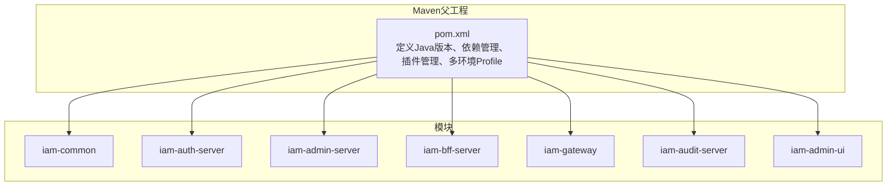
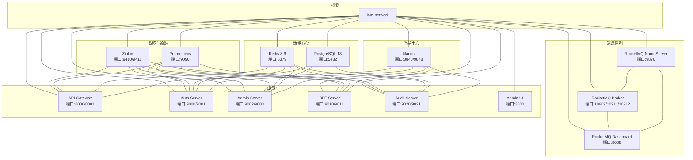
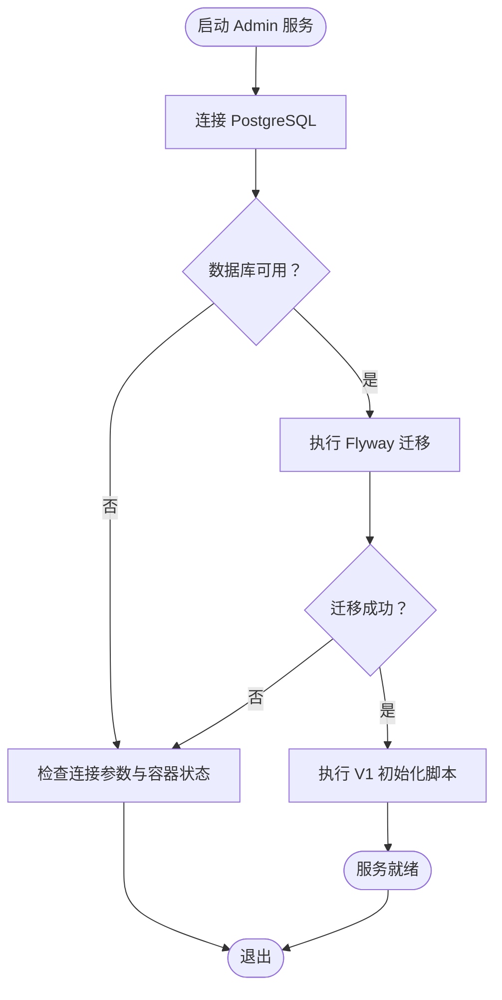
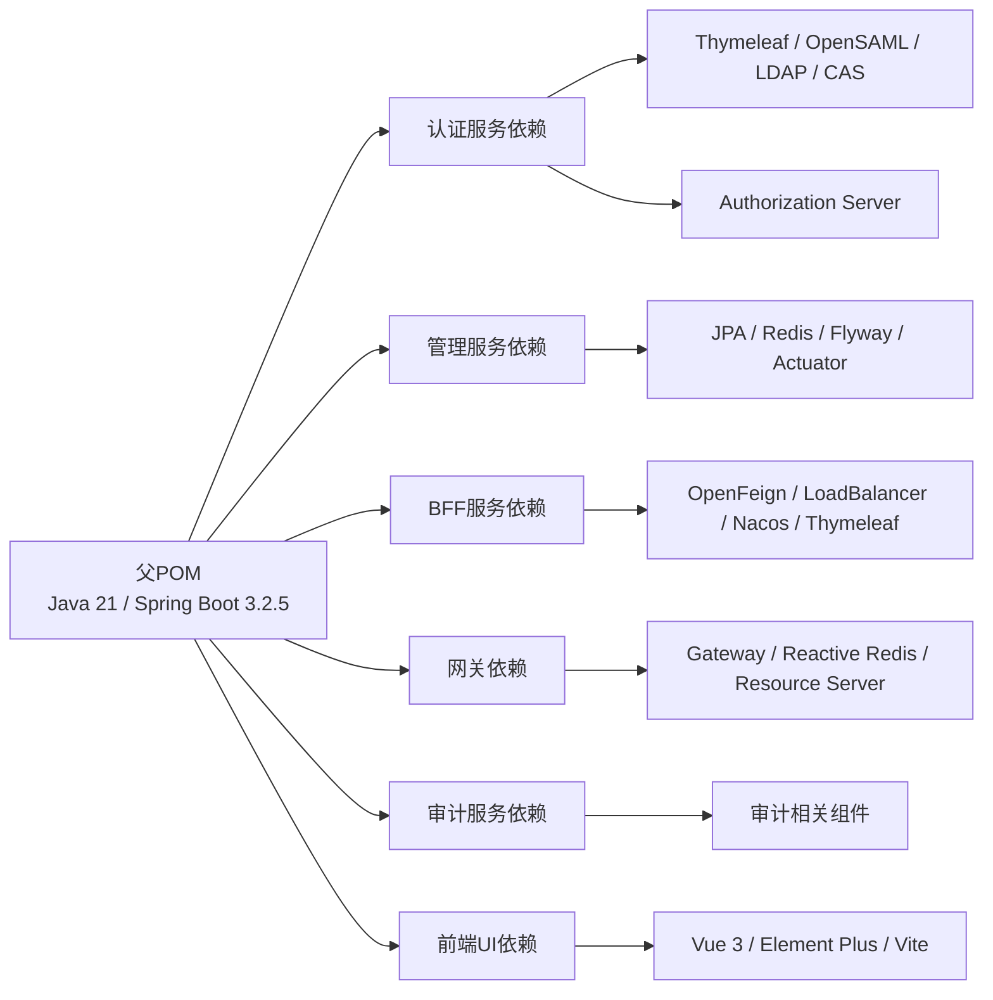

# 开发环境搭建

<cite>
**本文引用的文件**
- [README.md](file://README.md)
- [pom.xml](file://pom.xml)
- [.mvn/wrapper/maven-wrapper.properties](file://.mvn/wrapper/maven-wrapper.properties)
- [iam-admin-server/pom.xml](file://iam-admin-server/pom.xml)
- [iam-auth-server/pom.xml](file://iam-auth-server/pom.xml)
- [iam-bff-server/pom.xml](file://iam-bff-server/pom.xml)
- [iam-gateway/pom.xml](file://iam-gateway/pom.xml)
- [iam-audit-server/pom.xml](file://iam-audit-server/pom.xml)
- [docker-compose.yml](file://docker-compose.yml)
- [docker-compose.app.yml](file://docker-compose.app.yml)
- [docker-compose.middleware.yml](file://docker-compose.middleware.yml)
- [docker-compose.ui.yml](file://docker-compose.ui.yml)
- [iam-admin-server/src/main/resources/application-dev.yml](file://iam-admin-server/src/main/resources/application-dev.yml)
- [iam-auth-server/src/main/resources/application-dev.yml](file://iam-auth-server/src/main/resources/application-dev.yml)
- [iam-bff-server/src/main/resources/application-dev.yml](file://iam-bff-server/src/main/resources/application-dev.yml)
- [iam-gateway/src/main/resources/application-dev.yml](file://iam-gateway/src/main/resources/application-dev.yml)
- [iam-admin-server/bootstrap.yml](file://iam-admin-server/bootstrap.yml)
- [iam-auth-server/bootstrap.yml](file://iam-auth-server/bootstrap.yml)
- [iam-bff-server/bootstrap.yml](file://iam-bff-server/bootstrap.yml)
- [iam-gateway/bootstrap.yml](file://iam-gateway/bootstrap.yml)
- [iam-admin-server/src/main/resources/db/migration/V1__complete_schema_initialization.sql](file://iam-admin-server/src/main/resources/db/migration/V1__complete_schema_initialization.sql)
- [iam-admin-ui/Dockerfile](file://iam-admin-ui/Dockerfile)
- [iam-admin-ui/package.json](file://iam-admin-ui/package.json)
- [iam-admin-ui/vite.config.js](file://iam-admin-ui/vite.config.js)
- [iam-admin-ui/index.html](file://iam-admin-ui/index.html)
- [iam-admin-server/Dockerfile](file://iam-admin-server/Dockerfile)
- [iam-auth-server/Dockerfile](file://iam-auth-server/Dockerfile)
- [iam-bff-server/Dockerfile](file://iam-bff-server/Dockerfile)
</cite>

## 更新摘要
**所做更改**
- 更新Docker Compose架构，反映从多服务应用架构到纯中间件架构的转变
- 移除了不再存在的应用服务配置，新增了RocketMQ消息队列中间件
- 更新核心组件说明，包含Prometheus监控和Zipkin分布式追踪
- 修正了服务端口映射和网络配置
- 更新了开发环境配置和访问端点
- **更新Docker-based构建流程**：移除build-admin-ui.sh和build-admin-ui.bat脚本，采用Docker原生构建方式

## 目录
1. [简介](#简介)
2. [项目结构](#项目结构)
3. [核心组件](#核心组件)
4. [架构总览](#架构总览)
5. [详细组件分析](#详细组件分析)
6. [依赖分析](#依赖分析)
7. [性能考虑](#性能考虑)
8. [故障排查指南](#故障排查指南)
9. [结论](#结论)
10. [附录](#附录)

## 简介
本文件面向IAM平台的本地开发环境搭建，覆盖硬件与软件要求、IDE配置、Maven构建与依赖管理、数据库初始化与Flyway迁移、Docker容器编排、开发工具推荐以及常见问题排查。目标是帮助开发者在本地快速拉起完整的开发环境，并理解各模块的职责与交互。

**更新** 本版本反映了Docker原生构建流程的更新，移除了传统的build-admin-ui.sh和build-admin-ui.bat脚本，采用现代化的Docker多阶段构建方式。

## 项目结构
项目采用多模块Maven聚合工程，包含通用模块与七个业务/基础设施模块：
- iam-common：公共API、DTO、异常与通用模型
- iam-auth-server：OAuth2/OIDC认证服务（授权服务器）
- iam-admin-server：管理后台（业务CRUD + Flyway迁移）
- iam-bff-server：前端后端（聚合与路由）
- iam-gateway：API网关（路由、鉴权、限流）
- iam-audit-server：审计服务（日志收集与告警）
- iam-admin-ui：Vue 3管理前端（独立UI服务）

**图表来源**
- [pom.xml:21-27](file://pom.xml#L21-L27)
- [iam-admin-server/pom.xml:1-150](file://iam-admin-server/pom.xml#L1-L150)
- [iam-auth-server/pom.xml:1-180](file://iam-auth-server/pom.xml#L1-L180)
- [iam-bff-server/pom.xml:1-107](file://iam-bff-server/pom.xml#L1-L107)
- [iam-gateway/pom.xml:1-106](file://iam-gateway/pom.xml#L1-L106)
- [iam-audit-server/pom.xml:1-100](file://iam-audit-server/pom.xml#L1-L100)
- [iam-admin-ui/package.json:1-28](file://iam-admin-ui/package.json#L1-L28)

**章节来源**
- [pom.xml:21-27](file://pom.xml#L21-L27)

## 核心组件
- JDK 21：所有模块统一使用Java 21；Maven编译插件与属性已锁定。
- Spring Boot 3.2.5：统一框架版本，确保兼容性。
- PostgreSQL 14+：主数据库，使用PostgreSQL 18镜像进行本地开发。
- Redis 7+：缓存、分布式会话、限流。
- Prometheus：系统监控指标收集。
- Zipkin：分布式链路追踪。
- RocketMQ：消息队列中间件，包含NameServer和Broker。
- Flyway：数据库迁移，V1脚本初始化完整Schema。
- Maven 3.8+：内置包装器，简化构建。
- Docker：一键编排Nacos、PostgreSQL、Redis、Prometheus、Zipkin、RocketMQ及各服务。
- **Docker原生构建**：采用多阶段构建，前端UI独立部署，后端服务容器化。

**章节来源**
- [README.md:16-33](file://README.md#L16-L33)
- [pom.xml:30-43](file://pom.xml#L30-L43)
- [docker-compose.yml:1-83](file://docker-compose.yml#L1-L83)
- [iam-admin-ui/Dockerfile:1-15](file://iam-admin-ui/Dockerfile#L1-L15)

## 架构总览
本地开发采用Docker Compose编排，服务通过Nacos注册发现，数据库与缓存由容器提供，服务间通过Nacos命名空间隔离。新增Prometheus监控和Zipkin分布式追踪，以及RocketMQ消息队列中间件。前端UI采用独立容器部署，与后端服务解耦。

**图表来源**
- [docker-compose.yml:1-83](file://docker-compose.yml#L1-L83)
- [docker-compose.ui.yml:1-18](file://docker-compose.ui.yml#L1-L18)

**章节来源**
- [docker-compose.yml:1-83](file://docker-compose.yml#L1-L83)
- [docker-compose.ui.yml:1-18](file://docker-compose.ui.yml#L1-L18)

## 详细组件分析

### 数据库与迁移（PostgreSQL + Flyway）
- 迁移引擎：Flyway
- 迁移脚本位置：classpath:db/migration
- 初始Schema：V1__complete_schema_initialization.sql，包含角色、人员、租户、组织、应用、权限、审计日志等表及默认数据
- 开发环境配置：application-dev.yml启用SQL输出、关闭模板缓存、开启Swagger UI

**图表来源**
- [iam-admin-server/src/main/resources/application-dev.yml:1-26](file://iam-admin-server/src/main/resources/application-dev.yml#L1-L26)
- [iam-admin-server/src/main/resources/db/migration/V1__complete_schema_initialization.sql:1-720](file://iam-admin-server/src/main/resources/db/migration/V1__complete_schema_initialization.sql#L1-L720)

**章节来源**
- [iam-admin-server/src/main/resources/application-dev.yml:1-26](file://iam-admin-server/src/main/resources/application-dev.yml#L1-L26)
- [iam-admin-server/src/main/resources/db/migration/V1__complete_schema_initialization.sql:1-720](file://iam-admin-server/src/main/resources/db/migration/V1__complete_schema_initialization.sql#L1-L720)

### 缓存与会话（Redis）
- 用途：分布式会话、缓存、限流
- 默认密码：iam59!z$
- 端口：6379
- 网络：与各服务共享iam-network

**章节来源**
- [docker-compose.middleware.yml:43-57](file://docker-compose.middleware.yml#L43-L57)

### 注册中心（Nacos）
- 用途：服务注册与发现
- 端口：8848/9848
- 命名空间：iam-platform-dev
- 各服务通过bootstrap.yml读取NACOS_ADDR与NACOS_NAMESPACE

**章节来源**
- [docker-compose.middleware.yml:126-148](file://docker-compose.middleware.yml#L126-L148)
- [iam-admin-server/bootstrap.yml:1-10](file://iam-admin-server/bootstrap.yml#L1-L10)
- [iam-auth-server/bootstrap.yml:1-10](file://iam-auth-server/bootstrap.yml#L1-L10)
- [iam-bff-server/bootstrap.yml:1-10](file://iam-bff-server/bootstrap.yml#L1-L10)
- [iam-gateway/bootstrap.yml:1-10](file://iam-gateway/bootstrap.yml#L1-L10)

### 监控系统（Prometheus）
- 用途：系统指标收集与展示
- 端口：9090
- 配置：挂载prometheus.yml配置文件
- 数据持久化：挂载数据卷到/prometheus

**章节来源**
- [docker-compose.middleware.yml:59-68](file://docker-compose.middleware.yml#L59-L68)

### 分布式追踪（Zipkin）
- 用途：分布式链路追踪
- 端口：9410/9411
- 健康检查：/health端点
- 网络：与各服务共享iam-network

**章节来源**
- [docker-compose.middleware.yml:150-162](file://docker-compose.middleware.yml#L150-L162)

### 消息队列（RocketMQ）
- NameServer：9876端口，负责路由管理
- Broker：10909/10911/10912端口，负责消息存储与转发
- Dashboard：8088端口，提供Web管理界面
- 配置：挂载配置文件和日志目录
- 依赖关系：Broker依赖NameServer启动

**章节来源**
- [docker-compose.middleware.yml:74-120](file://docker-compose.middleware.yml#L74-L120)

### 网关（API Gateway）
- 功能：路由到认证服务、请求限流（基于Redis）
- 开发配置：启用TRACE日志、开启路由规则（/auth/** -> lb://iam-auth-service）、限流参数

**章节来源**
- [iam-gateway/src/main/resources/application-dev.yml:1-22](file://iam-gateway/src/main/resources/application-dev.yml#L1-L22)

### 认证服务（Auth Server）
- 功能：OIDC Provider、Thymeleaf登录页、外部登录（如钉钉）、验证码开关
- 开发配置：开启SQL输出、Thymeleaf不缓存、日志级别、加密密钥来自环境变量

**章节来源**
- [iam-auth-server/src/main/resources/application-dev.yml:1-34](file://iam-auth-server/src/main/resources/application-dev.yml#L1-L34)

### 管理服务（Admin Server）
- 功能：业务CRUD、审计日志、Flyway迁移
- 开发配置：开启SQL输出、Thymeleaf不缓存、日志级别、加密密钥来自环境变量、启用Swagger UI

**章节来源**
- [iam-admin-server/src/main/resources/application-dev.yml:1-26](file://iam-admin-server/src/main/resources/application-dev.yml#L1-L26)

### BFF服务
- 功能：前端后端聚合、模板渲染
- 开发配置：开启DEBUG日志、Thymeleaf不缓存

**章节来源**
- [iam-bff-server/src/main/resources/application-dev.yml:1-10](file://iam-bff-server/src/main/resources/application-dev.yml#L1-L10)

### 审计服务（Audit Server）
- 功能：日志收集、告警规则、SIEM集成
- 开发配置：基础日志配置、审计事件处理

**章节来源**
- [iam-audit-server/pom.xml:1-100](file://iam-audit-server/pom.xml#L1-L100)

### 前端UI服务（Admin UI）
- 构建方式：Docker多阶段构建
- 第一阶段：Node.js Alpine镜像，安装npm依赖，执行npm run build
- 第二阶段：Nginx Alpine镜像，提供静态文件服务
- 端口映射：3000:80
- 开发代理：Vite开发服务器，代理/api和/bff到网关

**更新** 前端UI采用Docker原生构建，移除了传统的build-admin-ui.sh和build-admin-ui.bat脚本，通过iam-admin-ui/Dockerfile实现完整的构建流程。

**章节来源**
- [iam-admin-ui/Dockerfile:1-15](file://iam-admin-ui/Dockerfile#L1-L15)
- [iam-admin-ui/package.json:1-28](file://iam-admin-ui/package.json#L1-L28)
- [iam-admin-ui/vite.config.js:1-26](file://iam-admin-ui/vite.config.js#L1-L26)
- [docker-compose.ui.yml:1-18](file://docker-compose.ui.yml#L1-L18)

## 依赖分析
- Java版本：统一为21
- Spring Boot版本：3.2.5（父POM锁定）
- Spring Authorization Server：1.2.5（OIDC Provider）
- MapStruct：1.5.5.Final
- Springdoc OpenAPI：2.3.0
- Testcontainers：1.19.7
- OpenSAML：4.3.2（SAML支持）
- RocketMQ Spring Boot Starter：2.3.1（消息队列支持）
- Spring Cloud与Spring Cloud Alibaba：通过BOM统一管理
- 各模块依赖差异：
  - 认证服务：Thymeleaf、OpenSAML、LDAP、CAS、Authorization Server
  - 管理服务：JPA、Redis、Actuator、Prometheus、Tracing、Flyway
  - BFF服务：OpenFeign、LoadBalancer、Nacos、Thymeleaf
  - 网关：Spring Cloud Gateway、Reactive Redis、OAuth2 Resource Server
  - 审计服务：基础依赖、审计相关组件
  - **前端UI**：Vue 3、Element Plus、Axios、Vite构建工具

**图表来源**
- [pom.xml:45-131](file://pom.xml#L45-L131)
- [iam-auth-server/pom.xml:18-94](file://iam-auth-server/pom.xml#L18-L94)
- [iam-admin-server/pom.xml:18-81](file://iam-admin-server/pom.xml#L18-L81)
- [iam-bff-server/pom.xml:18-80](file://iam-bff-server/pom.xml#L18-L80)
- [iam-gateway/pom.xml:17-81](file://iam-gateway/pom.xml#L17-L81)
- [iam-audit-server/pom.xml:18-80](file://iam-audit-server/pom.xml#L18-L80)
- [iam-admin-ui/package.json:12-26](file://iam-admin-ui/package.json#L12-L26)

**章节来源**
- [pom.xml:30-131](file://pom.xml#L30-L131)
- [iam-auth-server/pom.xml:18-166](file://iam-auth-server/pom.xml#L18-L166)
- [iam-admin-server/pom.xml:18-136](file://iam-admin-server/pom.xml#L18-L136)
- [iam-bff-server/pom.xml:18-106](file://iam-bff-server/pom.xml#L18-L106)
- [iam-gateway/pom.xml:17-95](file://iam-gateway/pom.xml#L17-L95)
- [iam-audit-server/pom.xml:18-100](file://iam-audit-server/pom.xml#L18-L100)
- [iam-admin-ui/package.json:1-28](file://iam-admin-ui/package.json#L1-L28)

## 性能考虑
- 日志级别：开发环境开启DEBUG/TRACE有助于定位问题，但会增加I/O开销；生产建议调整为INFO/ERROR。
- SQL输出：开发环境show-sql与format_sql便于调试，生产应关闭以减少日志量。
- 模板缓存：Thymeleaf在开发关闭缓存提升迭代效率，生产建议开启。
- Redis限流：网关基于Redis限流，注意Redis性能与容量规划。
- 监控与追踪：Prometheus + Zipkin链路追踪，建议在本地仅启用必要组件。
- RocketMQ：消息队列需要合理配置内存和存储空间，避免消息堆积。
- **Docker构建优化**：多阶段构建减少最终镜像大小，前端UI独立部署降低耦合度。

## 故障排查指南
- 数据库无法连接
  - 检查PostgreSQL容器健康状态与端口映射
  - 核对连接参数（POSTGRES_USER/POSTGRES_PASSWORD/PGDATA）
  - 参考：[docker-compose.middleware.yml:22-41](file://docker-compose.middleware.yml#L22-L41)
- Redis无法连接或认证失败
  - 检查Redis容器健康状态与密码
  - 参考：[docker-compose.middleware.yml:43-57](file://docker-compose.middleware.yml#L43-L57)
- Nacos不可用
  - 检查端口8848/9848映射与健康检查
  - 参考：[docker-compose.middleware.yml:126-148](file://docker-compose.middleware.yml#L126-L148)
- Prometheus监控异常
  - 检查端口9090映射与配置文件挂载
  - 参考：[docker-compose.middleware.yml:59-68](file://docker-compose.middleware.yml#L59-L68)
- Zipkin追踪失败
  - 检查端口9410/9411映射与健康检查
  - 参考：[docker-compose.middleware.yml:150-162](file://docker-compose.middleware.yml#L150-L162)
- RocketMQ服务异常
  - 检查NameServer和Broker的依赖关系
  - 确认9876端口可用且Broker正确启动
  - 参考：[docker-compose.middleware.yml:74-120](file://docker-compose.middleware.yml#L74-L120)
- Flyway迁移失败
  - 查看Admin服务日志中SQL错误
  - 确认classpath:db/migration路径存在且脚本无语法错误
  - 参考：[application-dev.yml:7-8](file://iam-admin-server/src/main/resources/application-dev.yml#L7-L8)
- 服务启动后无法访问
  - 确认各服务端口映射与容器健康状态
  - 网关路由是否正确指向认证服务
  - 参考：[docker-compose.yml:1-83](file://docker-compose.yml#L1-L83)、[application-dev.yml:11-21](file://iam-gateway/src/main/resources/application-dev.yml#L11-L21)
- 环境变量缺失
  - ENCRYPTION_KEY、NACOS_ADDR、NACOS_NAMESPACE、REDIS_PASSWORD等
  - 参考：[application-dev.yml:13-14](file://iam-admin-server/src/main/resources/application-dev.yml#L13-L14)、[bootstrap.yml:5-6](file://iam-auth-server/bootstrap.yml#L5-L6)
- **前端UI构建失败**
  - 检查Node.js依赖安装和构建过程
  - 确认Dockerfile中的多阶段构建步骤
  - 参考：[iam-admin-ui/Dockerfile:1-15](file://iam-admin-ui/Dockerfile#L1-L15)、[iam-admin-ui/package.json:6-11](file://iam-admin-ui/package.json#L6-L11)

**章节来源**
- [docker-compose.yml:1-83](file://docker-compose.yml#L1-L83)
- [iam-admin-server/src/main/resources/application-dev.yml:1-26](file://iam-admin-server/src/main/resources/application-dev.yml#L1-L26)
- [iam-gateway/src/main/resources/application-dev.yml:1-22](file://iam-gateway/src/main/resources/application-dev.yml#L1-L22)
- [iam-auth-server/bootstrap.yml:1-10](file://iam-auth-server/bootstrap.yml#L1-L10)
- [iam-admin-ui/Dockerfile:1-15](file://iam-admin-ui/Dockerfile#L1-L15)

## 结论
通过Docker Compose可快速搭建包含注册中心、数据库、缓存、监控、追踪和消息队列的完整中间件开发环境。结合Maven多模块工程与Flyway迁移，开发者可以高效完成认证、管理、网关、BFF和审计服务的本地联调与测试。**新的Docker原生构建流程**进一步简化了开发环境搭建，移除了传统构建脚本，采用现代化的容器化开发方式。建议在开发阶段保持适当的日志级别与模板缓存配置，在生产阶段按需优化性能与安全配置。

## 附录

### 硬件与软件要求
- JDK 21+
- PostgreSQL 14+（本地使用18镜像）
- Redis 7+
- Prometheus 2.0+
- Zipkin 2.0+
- RocketMQ 5.0+
- Maven 3.8+
- Docker
- **Node.js 20+**（用于前端开发，生产环境由Docker镜像提供）

**章节来源**
- [README.md:63-69](file://README.md#L63-L69)
- [docker-compose.middleware.yml:22-162](file://docker-compose.middleware.yml#L22-L162)
- [iam-admin-ui/Dockerfile:2](file://iam-admin-ui/Dockerfile#L2)

### IDE配置指南（IntelliJ IDEA/Eclipse）
- 导入项目
  - IntelliJ IDEA：打开根目录的pom.xml，选择"Add as Maven Project"
  - Eclipse：File -> Import -> Maven -> Existing Maven Projects，选择根目录
- 插件安装
  - Lombok（减少样板代码）
  - MapStruct Processor（对象映射）
  - Spring Boot插件（运行与调试）
  - **Vue.js插件**（前端开发支持）
- 代码风格
  - 统一编码：UTF-8
  - 编译版本：Java 21
  - 方法长度≤50行，类长度≤500行
- 运行配置
  - 使用Maven Wrapper：./mvnw
  - 默认激活dev环境，端口见下节
  - **前端开发**：使用Vite开发服务器，端口3000

**章节来源**
- [pom.xml:133-183](file://pom.xml#L133-L183)
- [README.md:110-117](file://README.md#L110-L117)
- [iam-admin-ui/vite.config.js:12-24](file://iam-admin-ui/vite.config.js#L12-L24)

### Maven构建与依赖管理
- 父POM统一管理版本与依赖范围
- 多环境Profile：dev/test/canary/prod
- 内置Maven Wrapper（3.8+）
- 各模块独立构建与打包
- **前端UI构建**：通过Dockerfile实现多阶段构建，无需本地Node.js环境

**章节来源**
- [pom.xml:186-200](file://pom.xml#L186-L200)
- [.mvn/wrapper/maven-wrapper.properties:1-4](file://.mvn/wrapper/maven-wrapper.properties#L1-L4)
- [iam-admin-ui/Dockerfile:1-15](file://iam-admin-ui/Dockerfile#L1-L15)

### 数据库初始化与Flyway迁移
- 迁移脚本：classpath:db/migration
- 初始脚本：V1__complete_schema_initialization.sql
- 执行时机：Admin服务启动时自动执行（Flyway自动迁移）
- 开发建议：首次启动前确保PostgreSQL与Redis容器健康

**章节来源**
- [iam-admin-server/src/main/resources/application-dev.yml:7-8](file://iam-admin-server/src/main/resources/application-dev.yml#L7-L8)
- [iam-admin-server/src/main/resources/db/migration/V1__complete_schema_initialization.sql:1-720](file://iam-admin-server/src/main/resources/db/migration/V1__complete_schema_initialization.sql#L1-L720)

### Docker环境搭建与容器编排
- 编排文件：docker-compose.yml、docker-compose.app.yml、docker-compose.middleware.yml、docker-compose.ui.yml
- 服务清单：Nacos、PostgreSQL、Redis、Prometheus、Zipkin、RocketMQ、Gateway、Auth、Admin、BFF、Audit、Admin UI
- 网络：iam-network桥接
- 健康检查：Nacos、PostgreSQL、Redis、Zipkin均配置健康检查
- RocketMQ依赖：Broker依赖NameServer启动
- **前端UI独立部署**：通过docker-compose.ui.yml单独启动，端口3000

**章节来源**
- [docker-compose.yml:1-83](file://docker-compose.yml#L1-L83)
- [docker-compose.app.yml:1-121](file://docker-compose.app.yml#L1-L121)
- [docker-compose.middleware.yml:1-163](file://docker-compose.middleware.yml#L1-L163)
- [docker-compose.ui.yml:1-18](file://docker-compose.ui.yml#L1-L18)

### 开发工具推荐
- Postman：API测试与自动化
- pgAdmin：PostgreSQL可视化管理
- Redis Desktop Manager：Redis键值管理
- IntelliJ IDEA/Eclipse：代码编辑与调试
- Docker Desktop：容器编排与日志查看
- Prometheus Browser：监控数据可视化
- Zipkin UI：链路追踪可视化
- **Vite Dev Server**：前端开发热重载（端口3000）

**章节来源**
- [README.md:1-210](file://README.md#L1-L210)
- [iam-admin-ui/vite.config.js:12-24](file://iam-admin-ui/vite.config.js#L12-L24)

### 访问端点（默认开发环境）
- Swagger UI：http://localhost:9000/swagger-ui.html
- OIDC元数据：http://localhost:9000/.well-known/openid-configuration
- 登录页面：http://localhost:9000/login
- 健康检查：http://localhost:9001/actuator/health
- Prometheus：http://localhost:9090
- Zipkin：http://localhost:9411
- RocketMQ Dashboard：http://localhost:8088
- **Admin UI**：http://localhost:3000（前端管理界面）

**章节来源**
- [README.md:80-90](file://README.md#L80-L90)
- [docker-compose.middleware.yml:59-162](file://docker-compose.middleware.yml#L59-L162)
- [docker-compose.ui.yml:15-16](file://docker-compose.ui.yml#L15-L16)

### Docker构建流程更新说明
**更新** 本节详细介绍新的Docker原生构建流程变化：

#### 传统构建方式（已废弃）
- build-admin-ui.sh：Shell脚本，执行npm install和npm run build
- build-admin-ui.bat：Windows批处理，功能相同
- 依赖本地Node.js环境

#### 新的Docker原生构建方式
- **iam-admin-ui/Dockerfile**：多阶段构建，第一阶段使用node:20-alpine安装依赖并构建，第二阶段使用nginx:alpine提供静态服务
- **独立UI服务**：通过docker-compose.ui.yml单独部署，端口3000映射到80
- **开发模式**：前端使用Vite开发服务器，支持热重载，代理/api和/bff到网关
- **生产模式**：完全容器化，无需本地Node.js环境

**构建流程优势**：
1. 标准化：所有依赖通过Docker镜像提供
2. 一致性：开发和生产环境使用相同的构建流程
3. 简化：移除对本地Node.js环境的依赖
4. 安全：构建过程在受控的容器环境中进行

**章节来源**
- [iam-admin-ui/Dockerfile:1-15](file://iam-admin-ui/Dockerfile#L1-L15)
- [iam-admin-ui/package.json:6-11](file://iam-admin-ui/package.json#L6-L11)
- [iam-admin-ui/vite.config.js:12-24](file://iam-admin-ui/vite.config.js#L12-L24)
- [docker-compose.ui.yml:10-17](file://docker-compose.ui.yml#L10-L17)