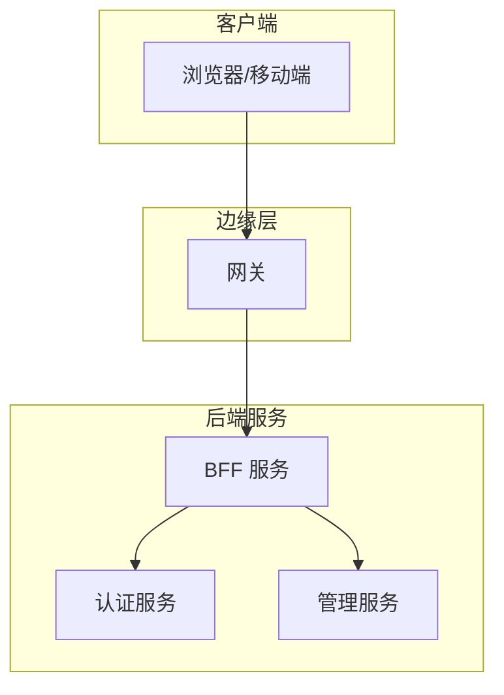
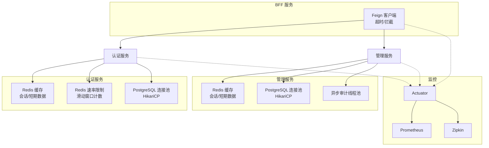
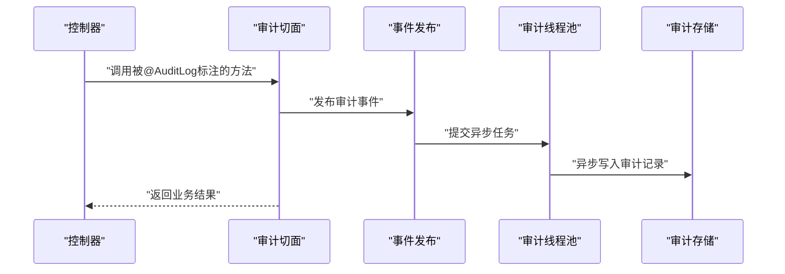
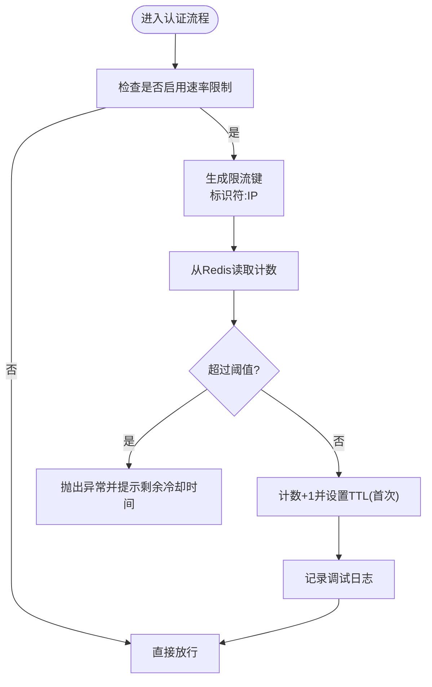
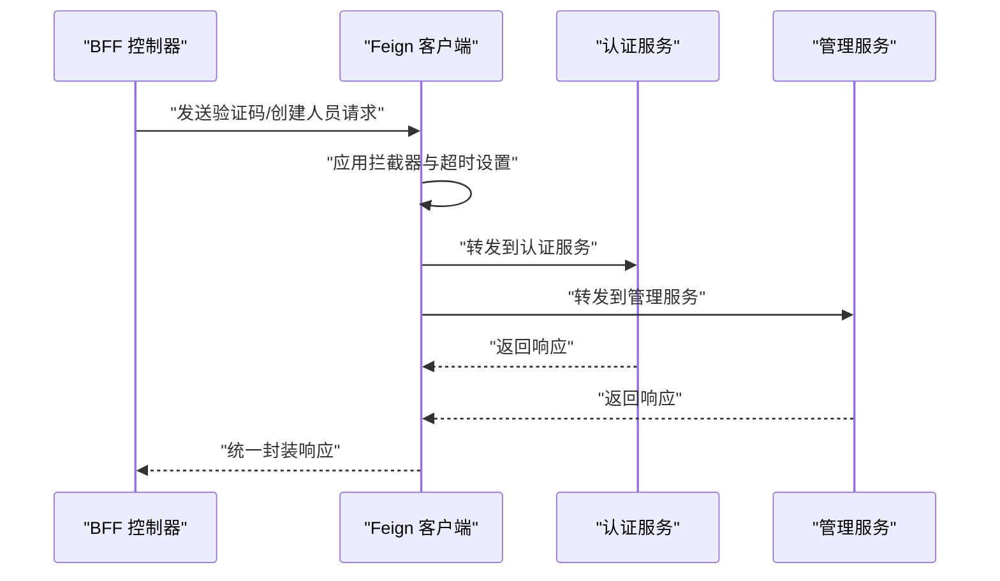
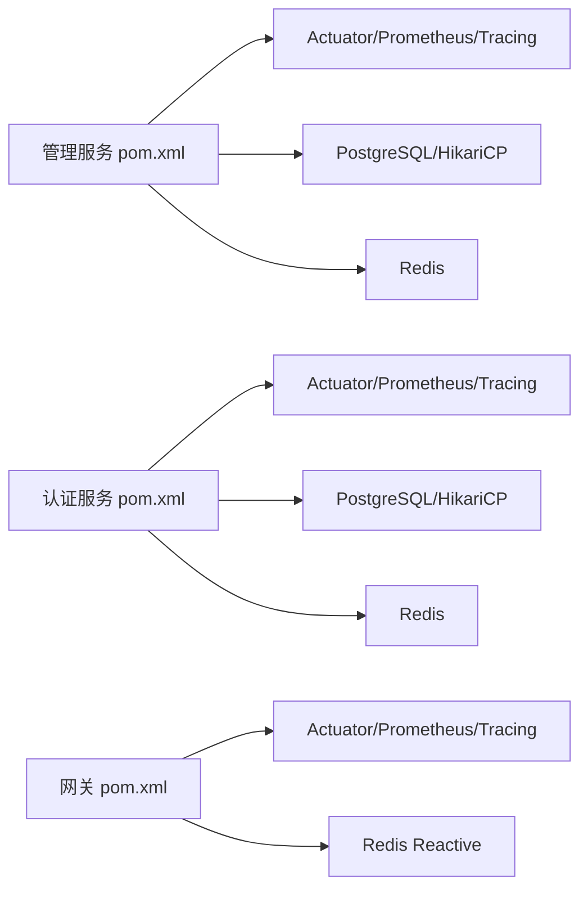

# 性能优化

<cite>
**本文引用的文件**
- [application.yml（管理服务）](file://iam-admin-server/src/main/resources/application.yml)
- [application.yml（认证服务）](file://iam-auth-server/src/main/resources/application.yml)
- [application.yml（BFF 服务）](file://iam-bff-server/src/main/resources/application.yml)
- [AsyncConfig（管理服务）](file://iam-admin-server/src/main/java/iam/platform/admin/infrastructure/config/AsyncConfig.java)
- [AuditProperties（管理服务）](file://iam-admin-server/src/main/java/iam/platform/admin/infrastructure/config/AuditProperties.java)
- [AuditLogAspect（管理服务）](file://iam-admin-server/src/main/java/iam/platform/admin/infrastructure/aspect/AuditLogAspect.java)
- [RedisConfig（认证服务）](file://iam-auth-server/src/main/java/iam/platform/auth/infrastructure/config/RedisConfig.java)
- [RedisConfig（管理服务）](file://iam-admin-server/src/main/java/iam/platform/admin/infrastructure/config/RedisConfig.java)
- [RedisBasedRateLimiter（认证服务）](file://iam-auth-server/src/main/java/iam/platform/auth/infrastructure/security/RedisBasedRateLimiter.java)
- [SecurityPolicyProperties（认证服务）](file://iam-auth-server/src/main/java/iam/platform/auth/infrastructure/config/SecurityPolicyProperties.java)
- [FeignClientConfig（BFF 服务）](file://iam-bff-server/src/main/java/iam/platform/bff/infrastructure/config/FeignClientConfig.java)
- [AdminFeignClient（BFF 服务）](file://iam-bff-server/src/main/java/iam/platform/bff/infrastructure/client/AdminFeignClient.java)
- [AuthFeignClient（BFF 服务）](file://iam-bff-server/src/main/java/iam/platform/bff/infrastructure/client/AuthFeignClient.java)
- [pom.xml（管理服务）](file://iam-admin-server/pom.xml)
- [pom.xml（认证服务）](file://iam-auth-server/pom.xml)
- [pom.xml（网关）](file://iam-gateway/pom.xml)
</cite>

## 目录
1. [简介](#简介)
2. [项目结构](#项目结构)
3. [核心组件](#核心组件)
4. [架构总览](#架构总览)
5. [详细组件分析](#详细组件分析)
6. [依赖分析](#依赖分析)
7. [性能考虑](#性能考虑)
8. [故障排查指南](#故障排查指南)
9. [结论](#结论)
10. [附录](#附录)

## 简介
本文件面向 IAM 平台的性能优化，聚焦以下方面：
- 内存管理：对象池化、缓存策略、垃圾回收调优建议
- 并发处理：线程池配置、异步处理、锁优化
- 数据库查询：索引设计、查询计划分析、批量操作
- Redis 缓存：命中率提升与内存使用优化
- 网络 I/O：连接池与超时设置
- 性能监控与指标采集
- 性能测试与基准测试

本优化文档基于仓库中现有配置与实现进行分析，并给出可落地的优化建议。

## 项目结构
IAM 平台由多个子模块组成，围绕统一认证与授权展开：
- 认证服务（iam-auth-server）：负责 OIDC/CAS/SAML 协议适配、用户认证、会话与速率限制等
- 管理服务（iam-admin-server）：负责组织、人员、权限、审计日志等管理能力
- BFF 服务（iam-bff-server）：前端代理层，聚合后端服务接口
- 网关（iam-gateway）：统一入口与安全过滤

图表来源
- [application.yml（BFF 服务）:1-54](file://iam-bff-server/src/main/resources/application.yml#L1-L54)
- [application.yml（认证服务）:1-144](file://iam-auth-server/src/main/resources/application.yml#L1-L144)
- [application.yml（管理服务）:1-102](file://iam-admin-server/src/main/resources/application.yml#L1-L102)

章节来源
- [application.yml（BFF 服务）:1-54](file://iam-bff-server/src/main/resources/application.yml#L1-L54)
- [application.yml（认证服务）:1-144](file://iam-auth-server/src/main/resources/application.yml#L1-L144)
- [application.yml（管理服务）:1-102](file://iam-admin-server/src/main/resources/application.yml#L1-L102)

## 核心组件
- 异步审计日志执行器（管理服务）
  - 通过线程池异步写入审计日志，避免阻塞主业务路径
  - 可配置核心线程数、最大线程数与队列容量
- Redis 缓存与速率限制（认证服务）
  - 使用 Redis 缓存管理会话与短期数据
  - 基于滑动窗口计数的速率限制，降低暴力破解风险
- Feign 客户端配置（BFF 服务）
  - 统一请求拦截与错误解码，设置连接与读取超时
- 指标与可观测性
  - Actuator + Micrometer + Prometheus + Zipkin 集成，暴露健康、指标与链路追踪

章节来源
- [AsyncConfig（管理服务）:1-31](file://iam-admin-server/src/main/java/iam/platform/admin/infrastructure/config/AsyncConfig.java#L1-L31)
- [AuditProperties（管理服务）:1-37](file://iam-admin-server/src/main/java/iam/platform/admin/infrastructure/config/AuditProperties.java#L1-L37)
- [AuditLogAspect（管理服务）:1-66](file://iam-admin-server/src/main/java/iam/platform/admin/infrastructure/aspect/AuditLogAspect.java#L1-L66)
- [RedisConfig（认证服务）:1-36](file://iam-auth-server/src/main/java/iam/platform/auth/infrastructure/config/RedisConfig.java#L1-L36)
- [RedisBasedRateLimiter（认证服务）:1-124](file://iam-auth-server/src/main/java/iam/platform/auth/infrastructure/security/RedisBasedRateLimiter.java#L1-L124)
- [SecurityPolicyProperties（认证服务）:1-37](file://iam-auth-server/src/main/java/iam/platform/auth/infrastructure/config/SecurityPolicyProperties.java#L1-L37)
- [FeignClientConfig（BFF 服务）:1-52](file://iam-bff-server/src/main/java/iam/platform/bff/infrastructure/config/FeignClientConfig.java#L1-L52)
- [AdminFeignClient（BFF 服务）:1-26](file://iam-bff-server/src/main/java/iam/platform/bff/infrastructure/client/AdminFeignClient.java#L1-L26)
- [AuthFeignClient（BFF 服务）:1-31](file://iam-bff-server/src/main/java/iam/platform/bff/infrastructure/client/AuthFeignClient.java#L1-L31)
- [pom.xml（管理服务）:88-104](file://iam-admin-server/pom.xml#L88-L104)
- [pom.xml（认证服务）:118-134](file://iam-auth-server/pom.xml#L118-L134)
- [pom.xml（网关）:37-80](file://iam-gateway/pom.xml#L37-L80)

## 架构总览
下图展示认证与管理服务在性能方面的关键交互点：Redis 用于会话与速率限制；数据库连接池用于持久化；BFF 通过 Feign 调用后端服务；监控体系提供指标与链路追踪。

图表来源
- [application.yml（认证服务）:10-52](file://iam-auth-server/src/main/resources/application.yml#L10-L52)
- [application.yml（管理服务）:10-51](file://iam-admin-server/src/main/resources/application.yml#L10-L51)
- [application.yml（BFF 服务）:25-48](file://iam-bff-server/src/main/resources/application.yml#L25-L48)
- [AsyncConfig（管理服务）:18-29](file://iam-admin-server/src/main/java/iam/platform/admin/infrastructure/config/AsyncConfig.java#L18-L29)
- [RedisBasedRateLimiter（认证服务）:24-67](file://iam-auth-server/src/main/java/iam/platform/auth/infrastructure/security/RedisBasedRateLimiter.java#L24-L67)
- [RedisConfig（认证服务）:20-29](file://iam-auth-server/src/main/java/iam/platform/auth/infrastructure/config/RedisConfig.java#L20-L29)
- [RedisConfig（管理服务）:19-28](file://iam-admin-server/src/main/java/iam/platform/admin/infrastructure/config/RedisConfig.java#L19-L28)
- [FeignClientConfig（BFF 服务）:17-31](file://iam-bff-server/src/main/java/iam/platform/bff/infrastructure/config/FeignClientConfig.java#L17-L31)
- [pom.xml（管理服务）:88-104](file://iam-admin-server/pom.xml#L88-L104)
- [pom.xml（认证服务）:118-134](file://iam-auth-server/pom.xml#L118-L134)

## 详细组件分析

### 异步审计日志（管理服务）
- 设计要点
  - 使用线程池异步发布审计事件，避免同步写入阻塞主业务
  - 拒绝策略采用“调用者运行”以保护系统在高负载下的稳定性
- 关键参数
  - 核心线程数、最大线程数、队列容量来自配置属性
- 影响范围
  - 提升接口响应时间稳定性，降低审计写入对业务的影响

图表来源
- [AuditLogAspect（管理服务）:27-58](file://iam-admin-server/src/main/java/iam/platform/admin/infrastructure/aspect/AuditLogAspect.java#L27-L58)
- [AsyncConfig（管理服务）:18-29](file://iam-admin-server/src/main/java/iam/platform/admin/infrastructure/config/AsyncConfig.java#L18-L29)
- [AuditProperties（管理服务）:30-35](file://iam-admin-server/src/main/java/iam/platform/admin/infrastructure/config/AuditProperties.java#L30-L35)

章节来源
- [AsyncConfig（管理服务）:1-31](file://iam-admin-server/src/main/java/iam/platform/admin/infrastructure/config/AsyncConfig.java#L1-L31)
- [AuditProperties（管理服务）:1-37](file://iam-admin-server/src/main/java/iam/platform/admin/infrastructure/config/AuditProperties.java#L1-L37)
- [AuditLogAspect（管理服务）:1-66](file://iam-admin-server/src/main/java/iam/platform/admin/infrastructure/aspect/AuditLogAspect.java#L1-L66)

### Redis 缓存与速率限制（认证服务）
- 缓存策略
  - 默认缓存 TTL 为分钟级，禁用空值缓存，使用 JSON 序列化
  - 会话存储使用 Redis，命名空间区分
- 速率限制
  - 滑动窗口计数，按标识符+IP 维度限流
  - Redis 不可用时“放行”，保证可用性
- 配置项
  - 最大尝试次数、时间窗口、是否启用

图表来源
- [RedisBasedRateLimiter（认证服务）:32-67](file://iam-auth-server/src/main/java/iam/platform/auth/infrastructure/security/RedisBasedRateLimiter.java#L32-L67)
- [SecurityPolicyProperties（认证服务）:24-28](file://iam-auth-server/src/main/java/iam/platform/auth/infrastructure/config/SecurityPolicyProperties.java#L24-L28)

章节来源
- [RedisConfig（认证服务）:1-36](file://iam-auth-server/src/main/java/iam/platform/auth/infrastructure/config/RedisConfig.java#L1-L36)
- [RedisConfig（管理服务）:1-30](file://iam-admin-server/src/main/java/iam/platform/admin/infrastructure/config/RedisConfig.java#L1-L30)
- [RedisBasedRateLimiter（认证服务）:1-124](file://iam-auth-server/src/main/java/iam/platform/auth/infrastructure/security/RedisBasedRateLimiter.java#L1-L124)
- [SecurityPolicyProperties（认证服务）:1-37](file://iam-auth-server/src/main/java/iam/platform/auth/infrastructure/config/SecurityPolicyProperties.java#L1-L37)

### Feign 客户端与网络 I/O（BFF 服务）
- 统一请求拦截器：添加来源标识等通用头部
- 自定义错误解码：根据状态码分类客户端/服务端错误
- 超时配置：连接超时与读取超时
- 接口示例：调用认证与管理服务的验证码发送与人员创建

图表来源
- [FeignClientConfig（BFF 服务）:17-50](file://iam-bff-server/src/main/java/iam/platform/bff/infrastructure/config/FeignClientConfig.java#L17-L50)
- [AdminFeignClient（BFF 服务）:13-24](file://iam-bff-server/src/main/java/iam/platform/bff/infrastructure/client/AdminFeignClient.java#L13-L24)
- [AuthFeignClient（BFF 服务）:12-29](file://iam-bff-server/src/main/java/iam/platform/bff/infrastructure/client/AuthFeignClient.java#L12-L29)
- [application.yml（BFF 服务）:25-48](file://iam-bff-server/src/main/resources/application.yml#L25-L48)

章节来源
- [FeignClientConfig（BFF 服务）:1-52](file://iam-bff-server/src/main/java/iam/platform/bff/infrastructure/config/FeignClientConfig.java#L1-L52)
- [AdminFeignClient（BFF 服务）:1-26](file://iam-bff-server/src/main/java/iam/platform/bff/infrastructure/client/AdminFeignClient.java#L1-L26)
- [AuthFeignClient（BFF 服务）:1-31](file://iam-bff-server/src/main/java/iam/platform/bff/infrastructure/client/AuthFeignClient.java#L1-L31)
- [application.yml（BFF 服务）:1-54](file://iam-bff-server/src/main/resources/application.yml#L1-L54)

## 依赖分析
- 观测性依赖
  - Actuator、Micrometer Prometheus、Tracing + Zipkin 已集成，便于暴露指标与链路追踪
- 数据访问依赖
  - 认证与管理服务均使用 PostgreSQL + HikariCP，默认连接池参数已配置
- 缓存与会话
  - 认证/管理服务使用 Redis 缓存与会话存储，BFF 通过 Feign 调用后端

图表来源
- [pom.xml（管理服务）:88-104](file://iam-admin-server/pom.xml#L88-L104)
- [pom.xml（认证服务）:118-134](file://iam-auth-server/pom.xml#L118-L134)
- [pom.xml（网关）:37-80](file://iam-gateway/pom.xml#L37-L80)

章节来源
- [pom.xml（管理服务）:88-104](file://iam-admin-server/pom.xml#L88-L104)
- [pom.xml（认证服务）:118-134](file://iam-auth-server/pom.xml#L118-L134)
- [pom.xml（网关）:37-80](file://iam-gateway/pom.xml#L37-L80)

## 性能考虑

### 内存管理最佳实践
- 对象池化
  - 对高频创建的对象（如字符串拼接、临时缓冲区）进行复用，减少 GC 压力
  - 在 Feign 客户端侧避免重复构造请求模板，复用拦截器中的静态常量
- 缓存策略
  - 合理设置缓存 TTL，避免过期不一致与内存膨胀
  - 使用二八定律：热点数据短 TTL，非热点长 TTL 或禁用缓存
  - 对大对象采用压缩或分片缓存，降低内存占用
- 垃圾回收调优
  - 使用 G1GC 或 ZGC（JDK 11+），结合堆大小与晋升阈值调优
  - 开启逃逸分析与标量替换，减少堆分配
  - 定期观察 GC 日志，识别长时间停顿与碎片化

### 并发处理优化
- 线程池配置
  - CPU 密集型任务：线程数 ≈ CPU 核数；IO 密集型任务：适当放大
  - 为不同业务场景设置独立线程池，避免相互影响
  - 设置合理的拒绝策略：快速失败、调用者运行或有界队列
- 异步处理
  - 将非关键路径（如审计、通知）异步化，降低主路径延迟
  - 使用事件驱动模型，解耦生产与消费
- 锁优化
  - 减少锁粒度，优先使用无锁容器（如原子类、并发集合）
  - 使用读写锁分离热点读写，避免全局互斥

### 数据库查询优化
- 索引设计
  - 为高频查询字段建立合适索引（如登录名、租户标识、时间范围）
  - 避免冗余索引，定期清理未使用索引
- 查询计划分析
  - 使用 EXPLAIN/ANALYZE 分析慢查询，关注全表扫描与排序
  - 识别隐式转换与函数索引失效
- 批量操作
  - 使用批量插入/更新（JDBC 批处理或 ORM 批处理）
  - 合理控制批次大小，避免事务过大导致锁竞争

### Redis 缓存优化
- 命中率提升
  - 热点数据预热，合理设置 TTL 与淘汰策略
  - 使用多级缓存（本地缓存 + 远程缓存），降低远程调用
- 内存使用优化
  - 选择合适序列化器（JSON/压缩），控制键长度与前缀
  - 使用过期回调与定期清理，避免内存泄漏
- 速率限制
  - 滑动窗口计数法适合细粒度限流；可选令牌桶/漏桶算法应对突发
  - Redis 不可用时“放行”策略需配合熔断与告警

### 网络 I/O 优化
- 连接池配置
  - Feign 客户端设置合理的连接与读取超时，避免线程阻塞
  - 启用 Keep-Alive，减少握手开销
- 超时设置
  - 将超时与重试策略与 SLA 对齐，避免雪崩效应
- 负载均衡与熔断
  - 结合网关与服务发现，实现就近访问与故障隔离

### 性能监控与指标采集
- 指标维度
  - 响应时间、吞吐量、错误率、线程池队列长度、数据库连接池利用率
  - Redis 命中率、内存使用、命令耗时
- 采集与可视化
  - 使用 Micrometer + Prometheus 暴露指标，Grafana 可视化
  - Zipkin 链路追踪定位慢调用与跨服务瓶颈
- 告警策略
  - 基于阈值与趋势的智能告警，避免误报与漏报

### 性能测试与基准测试
- 工具选择
  - JMeter、Gatling、Loader.io 等进行负载测试
  - wrk、ab 等进行简单压测
- 测试场景
  - 登录/注册、权限校验、审计写入、缓存命中、数据库查询
- 基准测试
  - 固定环境与数据集，对比不同配置的性能差异
  - 关注 P95/P99 延迟与资源使用情况

## 故障排查指南
- 审计日志积压
  - 检查异步线程池配置与队列容量，必要时扩容或降级
  - 关注拒绝策略触发频率
- Redis 限流异常
  - 核查键空间与 TTL 设置，确认 Redis 可用性
  - 观察失败记录与成功重置逻辑
- Feign 调用超时
  - 检查连接与读取超时配置，评估下游服务性能
  - 查看错误解码输出，定位客户端/服务端错误
- 指标缺失
  - 确认 Actuator 暴露端点与 Micrometer 注册器配置
  - 核查 Prometheus 抓取与 Zipkin 上报

章节来源
- [AsyncConfig（管理服务）:18-29](file://iam-admin-server/src/main/java/iam/platform/admin/infrastructure/config/AsyncConfig.java#L18-L29)
- [AuditLogAspect（管理服务）:50-58](file://iam-admin-server/src/main/java/iam/platform/admin/infrastructure/aspect/AuditLogAspect.java#L50-L58)
- [RedisBasedRateLimiter（认证服务）:63-67](file://iam-auth-server/src/main/java/iam/platform/auth/infrastructure/security/RedisBasedRateLimiter.java#L63-L67)
- [FeignClientConfig（BFF 服务）:39-50](file://iam-bff-server/src/main/java/iam/platform/bff/infrastructure/config/FeignClientConfig.java#L39-L50)
- [pom.xml（管理服务）:88-104](file://iam-admin-server/pom.xml#L88-L104)
- [pom.xml（认证服务）:118-134](file://iam-auth-server/pom.xml#L118-L134)

## 结论
本优化文档基于现有配置与实现，提出了内存管理、并发处理、数据库查询、Redis 缓存、网络 I/O、监控与测试等方面的优化建议。建议在生产环境中结合实际流量与资源情况，逐步调整线程池、缓存 TTL、数据库索引与连接池参数，并持续通过指标与链路追踪发现问题，形成闭环优化。

## 附录
- 关键配置参考
  - 认证服务：数据库连接池、Redis、会话存储、速率限制策略
  - 管理服务：数据库连接池、Redis、会话存储、异步审计线程池
  - BFF 服务：Feign 超时与拦截器、模板缓存
- 依赖与可观测性
  - Actuator、Micrometer、Prometheus、Zipkin 已集成，便于指标与链路追踪

章节来源
- [application.yml（认证服务）:10-52](file://iam-auth-server/src/main/resources/application.yml#L10-L52)
- [application.yml（管理服务）:10-51](file://iam-admin-server/src/main/resources/application.yml#L10-L51)
- [application.yml（BFF 服务）:10-48](file://iam-bff-server/src/main/resources/application.yml#L10-L48)
- [pom.xml（管理服务）:88-104](file://iam-admin-server/pom.xml#L88-L104)
- [pom.xml（认证服务）:118-134](file://iam-auth-server/pom.xml#L118-L134)
- [pom.xml（网关）:37-80](file://iam-gateway/pom.xml#L37-L80)