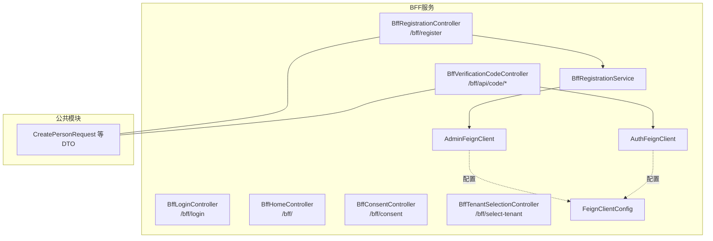
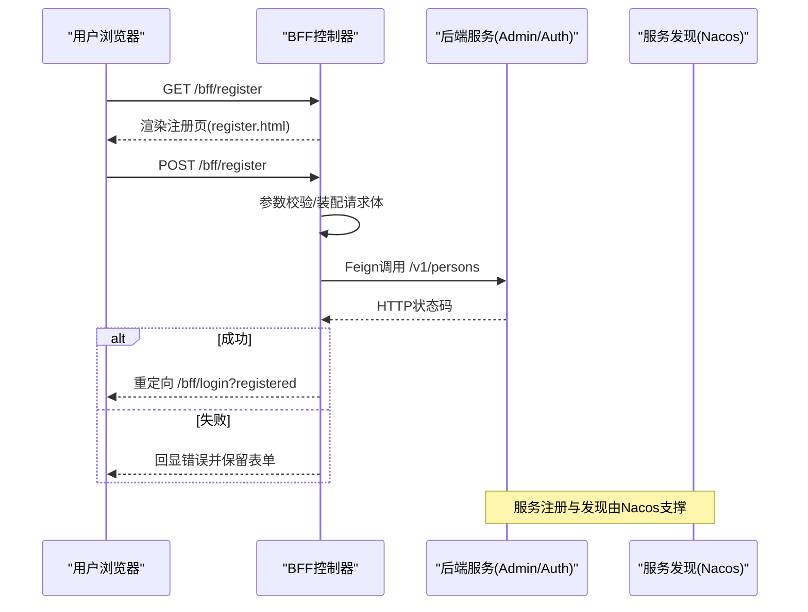
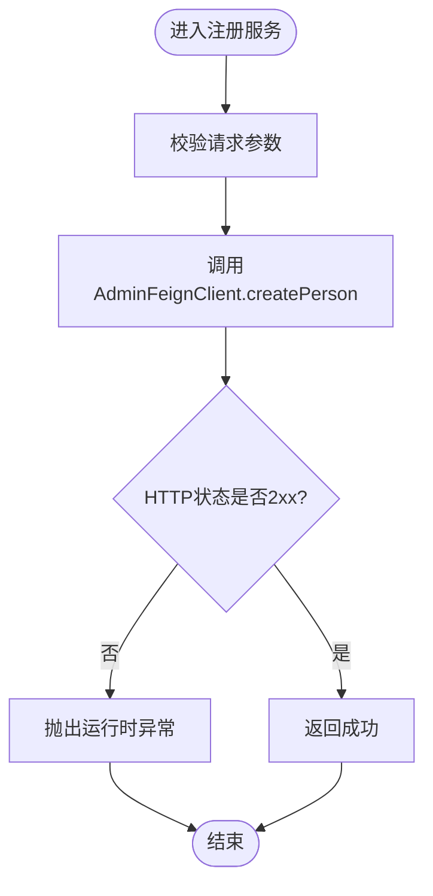
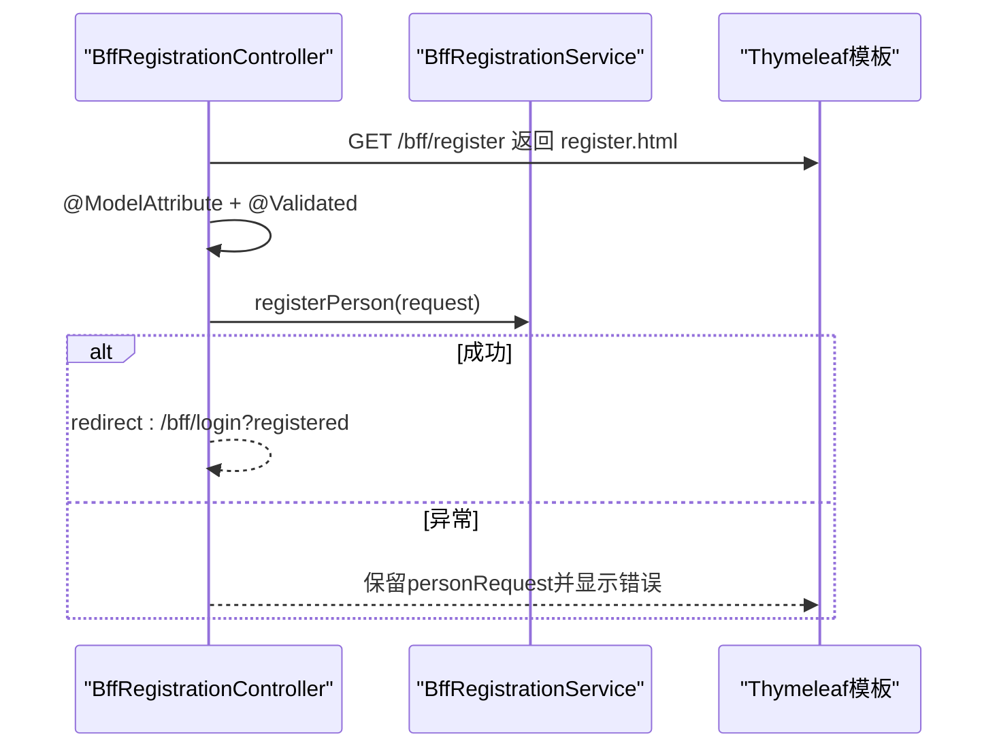
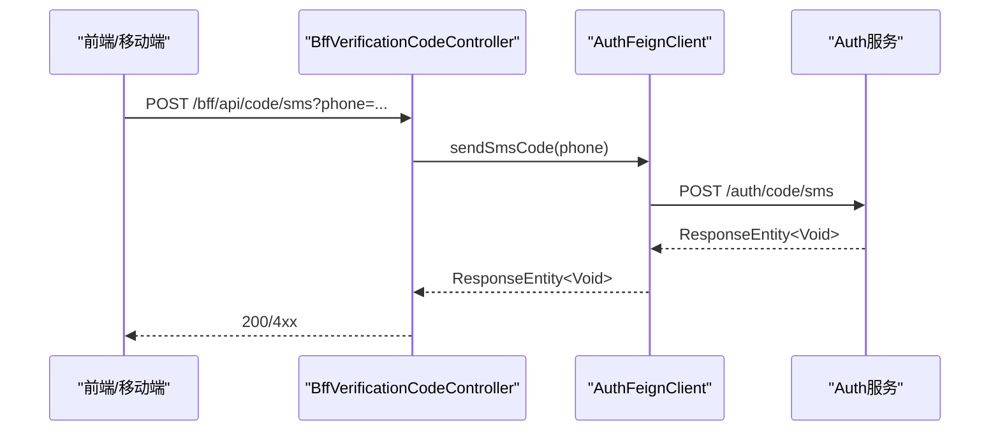
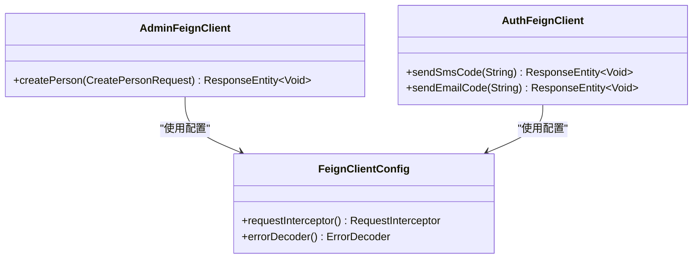
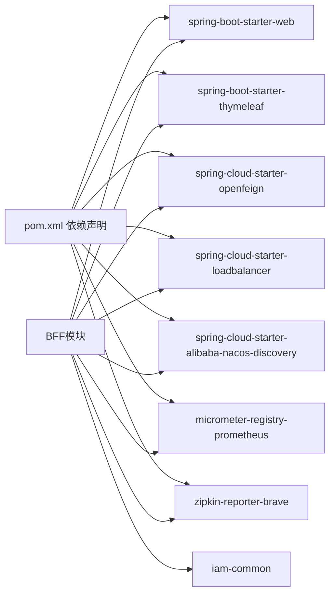
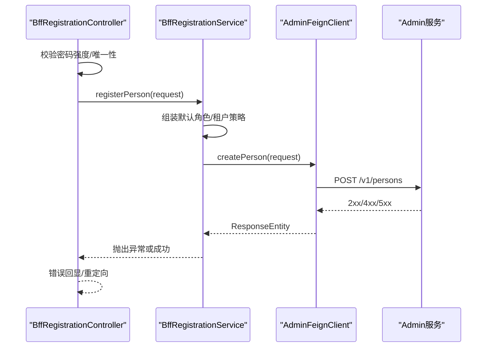

# BFF服务扩展

<cite>
**本文引用的文件**
- [BffRegistrationService.java](file://iam-bff-server/src/main/java/iam/platform/bff/application/service/BffRegistrationService.java)
- [BffRegistrationController.java](file://iam-bff-server/src/main/java/iam/platform/bff/interfaces/web/BffRegistrationController.java)
- [BffVerificationCodeController.java](file://iam-bff-server/src/main/java/iam/platform/bff/interfaces/rest/BffVerificationCodeController.java)
- [BffLoginController.java](file://iam-bff-server/src/main/java/iam/platform/bff/interfaces/web/BffLoginController.java)
- [BffHomeController.java](file://iam-bff-server/src/main/java/iam/platform/bff/interfaces/web/BffHomeController.java)
- [BffConsentController.java](file://iam-bff-server/src/main/java/iam/platform/bff/interfaces/web/BffConsentController.java)
- [BffTenantSelectionController.java](file://iam-bff-server/src/main/java/iam/platform/bff/interfaces/web/BffTenantSelectionController.java)
- [AdminFeignClient.java](file://iam-bff-server/src/main/java/iam/platform/bff/infrastructure/client/AdminFeignClient.java)
- [AuthFeignClient.java](file://iam-bff-server/src/main/java/iam/platform/bff/infrastructure/client/AuthFeignClient.java)
- [FeignClientConfig.java](file://iam-bff-server/src/main/java/iam/platform/bff/infrastructure/config/FeignClientConfig.java)
- [application.yml](file://iam-bff-server/src/main/resources/application.yml)
- [bootstrap.yml](file://iam-bff-server/bootstrap.yml)
- [pom.xml](file://iam-bff-server/pom.xml)
</cite>

## 目录
1. [简介](#简介)
2. [项目结构](#项目结构)
3. [核心组件](#核心组件)
4. [架构总览](#架构总览)
5. [详细组件分析](#详细组件分析)
6. [依赖分析](#依赖分析)
7. [性能考虑](#性能考虑)
8. [故障排查指南](#故障排查指南)
9. [结论](#结论)
10. [附录：扩展开发示例与测试验证](#附录扩展开发示例与测试验证)

## 简介
本指南面向需要在IAM平台中扩展BFF（Backend for Frontend）服务的开发者，系统讲解BFF设计理念、扩展方法与最佳实践。重点覆盖以下方面：
- 扩展BffRegistrationService等核心服务，定制用户注册流程与业务逻辑
- BFF控制器开发模式：请求处理、响应转换与错误处理
- Feign Client扩展：服务调用封装、负载均衡与熔断机制
- 配置管理、安全控制与性能优化策略
- BFF与后端服务的集成模式、API聚合与数据转换方法
- 完整的扩展开发示例与测试验证方法

## 项目结构
BFF模块采用分层架构：接口层（web/rest）、应用服务层、基础设施层（Feign客户端、配置），并共享公共DTO与模型。

图表来源
- [BffRegistrationController.java:1-40](file://iam-bff-server/src/main/java/iam/platform/bff/interfaces/web/BffRegistrationController.java#L1-L40)
- [BffVerificationCodeController.java:1-39](file://iam-bff-server/src/main/java/iam/platform/bff/interfaces/rest/BffVerificationCodeController.java#L1-L39)
- [BffRegistrationService.java:1-31](file://iam-bff-server/src/main/java/iam/platform/bff/application/service/BffRegistrationService.java#L1-L31)
- [AdminFeignClient.java:1-26](file://iam-bff-server/src/main/java/iam/platform/bff/infrastructure/client/AdminFeignClient.java#L1-L26)
- [AuthFeignClient.java:1-31](file://iam-bff-server/src/main/java/iam/platform/bff/infrastructure/client/AuthFeignClient.java#L1-L31)
- [FeignClientConfig.java:1-52](file://iam-bff-server/src/main/java/iam/platform/bff/infrastructure/config/FeignClientConfig.java#L1-L52)

章节来源
- [pom.xml:18-88](file://iam-bff-server/pom.xml#L18-L88)

## 核心组件
- 应用服务：BffRegistrationService负责调用Admin服务完成用户创建，封装跨服务调用与错误处理。
- 控制器：BffRegistrationController处理注册页面渲染与提交；BffVerificationCodeController转发验证码发送请求至Auth服务。
- Feign客户端：AdminFeignClient、AuthFeignClient分别封装对admin与auth服务的REST调用。
- 配置：FeignClientConfig统一注入请求头与自定义错误解码器。

章节来源
- [BffRegistrationService.java:1-31](file://iam-bff-server/src/main/java/iam/platform/bff/application/service/BffRegistrationService.java#L1-L31)
- [BffRegistrationController.java:1-40](file://iam-bff-server/src/main/java/iam/platform/bff/interfaces/web/BffRegistrationController.java#L1-L40)
- [BffVerificationCodeController.java:1-39](file://iam-bff-server/src/main/java/iam/platform/bff/interfaces/rest/BffVerificationCodeController.java#L1-L39)
- [AdminFeignClient.java:1-26](file://iam-bff-server/src/main/java/iam/platform/bff/infrastructure/client/AdminFeignClient.java#L1-L26)
- [AuthFeignClient.java:1-31](file://iam-bff-server/src/main/java/iam/platform/bff/infrastructure/client/AuthFeignClient.java#L1-L31)
- [FeignClientConfig.java:1-52](file://iam-bff-server/src/main/java/iam/platform/bff/infrastructure/config/FeignClientConfig.java#L1-L52)

## 架构总览
BFF作为前端的后端，聚合与适配后端服务，提供统一的入口与用户体验。典型交互链路如下：

图表来源
- [BffRegistrationController.java:27-38](file://iam-bff-server/src/main/java/iam/platform/bff/interfaces/web/BffRegistrationController.java#L27-L38)
- [BffRegistrationService.java:23-29](file://iam-bff-server/src/main/java/iam/platform/bff/application/service/BffRegistrationService.java#L23-L29)
- [AdminFeignClient.java:23-24](file://iam-bff-server/src/main/java/iam/platform/bff/infrastructure/client/AdminFeignClient.java#L23-L24)
- [bootstrap.yml:4-6](file://iam-bff-server/bootstrap.yml#L4-L6)

## 详细组件分析

### 用户注册流程扩展（BffRegistrationService）
- 职责：接收前端注册请求，调用Admin服务创建人员，处理非2xx响应并抛出异常。
- 可扩展点：
  - 注册前置校验：手机号/邮箱唯一性、密码强度策略、租户选择策略
  - 注册后动作：发送欢迎邮件/短信、初始化默认角色/组织映射
  - 错误映射：将HTTP状态映射为领域异常，便于上层统一处理
  - 追踪与审计：记录注册事件、埋点上报

图表来源
- [BffRegistrationService.java:23-29](file://iam-bff-server/src/main/java/iam/platform/bff/application/service/BffRegistrationService.java#L23-L29)

章节来源
- [BffRegistrationService.java:1-31](file://iam-bff-server/src/main/java/iam/platform/bff/application/service/BffRegistrationService.java#L1-L31)

### 注册控制器（BffRegistrationController）
- 职责：渲染注册页面、接收POST提交、调用应用服务、错误回显与重定向。
- 开发要点：
  - 使用Model传递表单对象与错误信息
  - 对异常进行捕获并回显到视图
  - 成功后重定向至登录页并携带提示参数

图表来源
- [BffRegistrationController.java:21-38](file://iam-bff-server/src/main/java/iam/platform/bff/interfaces/web/BffRegistrationController.java#L21-L38)

章节来源
- [BffRegistrationController.java:1-40](file://iam-bff-server/src/main/java/iam/platform/bff/interfaces/web/BffRegistrationController.java#L1-L40)

### 验证码API（BffVerificationCodeController）
- 职责：对外暴露REST接口，转发短信/邮箱验证码发送请求至Auth服务。
- 设计建议：
  - 在BFF侧增加频率限制与白名单
  - 对外接口返回标准化响应，内部通过Feign透传

图表来源
- [BffVerificationCodeController.java:24-28](file://iam-bff-server/src/main/java/iam/platform/bff/interfaces/rest/BffVerificationCodeController.java#L24-L28)
- [AuthFeignClient.java:22-23](file://iam-bff-server/src/main/java/iam/platform/bff/infrastructure/client/AuthFeignClient.java#L22-L23)

章节来源
- [BffVerificationCodeController.java:1-39](file://iam-bff-server/src/main/java/iam/platform/bff/interfaces/rest/BffVerificationCodeController.java#L1-L39)
- [AuthFeignClient.java:1-31](file://iam-bff-server/src/main/java/iam/platform/bff/infrastructure/client/AuthFeignClient.java#L1-L31)

### 登录页与主页（BffLoginController、BffHomeController）
- BffLoginController：渲染登录页，支持tenant、error、logout、registered等参数驱动的UI提示。
- BffHomeController：根路径重定向至登录页，未来可扩展为已认证用户的仪表盘或欢迎页。

章节来源
- [BffLoginController.java:1-50](file://iam-bff-server/src/main/java/iam/platform/bff/interfaces/web/BffLoginController.java#L1-L50)
- [BffHomeController.java:1-22](file://iam-bff-server/src/main/java/iam/platform/bff/interfaces/web/BffHomeController.java#L1-L22)

### 同意页与租户选择（BffConsentController、BffTenantSelectionController）
- BffConsentController：展示OAuth2授权同意页，接收clientName/scopes/clientId参数。
- BffTenantSelectionController：租户选择页占位，预留后续通过Feign拉取可用租户列表。

章节来源
- [BffConsentController.java:1-35](file://iam-bff-server/src/main/java/iam/platform/bff/interfaces/web/BffConsentController.java#L1-L35)
- [BffTenantSelectionController.java:1-22](file://iam-bff-server/src/main/java/iam/platform/bff/interfaces/web/BffTenantSelectionController.java#L1-L22)

### Feign客户端与配置
- AdminFeignClient：定义对Admin服务/v1/persons的POST调用。
- AuthFeignClient：定义对Auth服务/auth/code/sms与/auth/code/email的POST调用。
- FeignClientConfig：统一注入请求头（如X-Source），自定义ErrorDecoder按4xx/5xx分类处理。

图表来源
- [AdminFeignClient.java:13-24](file://iam-bff-server/src/main/java/iam/platform/bff/infrastructure/client/AdminFeignClient.java#L13-L24)
- [AuthFeignClient.java:12-29](file://iam-bff-server/src/main/java/iam/platform/bff/infrastructure/client/AuthFeignClient.java#L12-L29)
- [FeignClientConfig.java:17-50](file://iam-bff-server/src/main/java/iam/platform/bff/infrastructure/config/FeignClientConfig.java#L17-L50)

章节来源
- [AdminFeignClient.java:1-26](file://iam-bff-server/src/main/java/iam/platform/bff/infrastructure/client/AdminFeignClient.java#L1-L26)
- [AuthFeignClient.java:1-31](file://iam-bff-server/src/main/java/iam/platform/bff/infrastructure/client/AuthFeignClient.java#L1-L31)
- [FeignClientConfig.java:1-52](file://iam-bff-server/src/main/java/iam/platform/bff/infrastructure/config/FeignClientConfig.java#L1-L52)

## 依赖分析
- 内部依赖：BFF依赖iam-common提供DTO与通用模型。
- 外部依赖：Spring Web、Thymeleaf、OpenFeign、LoadBalancer、Nacos Discovery、Micrometer+Prometheus、Zipkin。
- 关键耦合：控制器依赖应用服务；应用服务依赖Feign客户端；Feign客户端依赖配置。

图表来源
- [pom.xml:18-88](file://iam-bff-server/pom.xml#L18-L88)

章节来源
- [pom.xml:18-88](file://iam-bff-server/pom.xml#L18-L88)

## 性能考虑
- 超时与重试：通过Feign默认配置设置连接与读取超时，避免阻塞；结合负载均衡提升可用性。
- 指标与追踪：启用Actuator、Prometheus指标与Zipkin链路追踪，定位慢调用与失败热点。
- 缓存与降级：在BFF层对高频只读数据进行缓存；对下游不可用时提供优雅降级。
- SSL与网络：生产环境开启SSL，合理设置证书路径与别名，确保传输安全。

章节来源
- [application.yml:25-48](file://iam-bff-server/src/main/resources/application.yml#L25-L48)
- [bootstrap.yml:1-10](file://iam-bff-server/bootstrap.yml#L1-L10)

## 故障排查指南
- Feign错误处理：自定义ErrorDecoder根据HTTP状态分类处理，便于快速定位客户端/服务端错误。
- 日志级别：调整BFF包日志级别以获取更细粒度的调用日志。
- 健康检查：通过Actuator健康端点与指标监控服务可用性与延迟。

章节来源
- [FeignClientConfig.java:36-50](file://iam-bff-server/src/main/java/iam/platform/bff/infrastructure/config/FeignClientConfig.java#L36-L50)
- [application.yml:50-54](file://iam-bff-server/src/main/resources/application.yml#L50-L54)

## 结论
BFF作为统一入口，承担了前端体验、协议适配与后端聚合职责。通过本文档的扩展方法与最佳实践，可在不侵入后端服务的前提下，灵活定制注册流程、增强API能力、完善安全与性能策略，并保持良好的可观测性与可维护性。

## 附录：扩展开发示例与测试验证

### 示例一：扩展注册流程（新增密码强度策略与默认角色分配）
- 在BffRegistrationController中增加参数校验与业务参数组装
- 在BffRegistrationService中引入密码策略校验与角色映射逻辑
- 通过AdminFeignClient调用后端创建人员接口
- 使用全局异常处理器统一返回错误信息

图表来源
- [BffRegistrationController.java:27-38](file://iam-bff-server/src/main/java/iam/platform/bff/interfaces/web/BffRegistrationController.java#L27-L38)
- [BffRegistrationService.java:23-29](file://iam-bff-server/src/main/java/iam/platform/bff/application/service/BffRegistrationService.java#L23-L29)
- [AdminFeignClient.java:23-24](file://iam-bff-server/src/main/java/iam/platform/bff/infrastructure/client/AdminFeignClient.java#L23-L24)

### 示例二：新增验证码类型（如图形验证码）
- 在AuthFeignClient中新增图形验证码接口
- 在BffVerificationCodeController中新增路由与转发
- 在BFF侧增加频率限制与IP白名单策略

章节来源
- [AuthFeignClient.java:1-31](file://iam-bff-server/src/main/java/iam/platform/bff/infrastructure/client/AuthFeignClient.java#L1-L31)
- [BffVerificationCodeController.java:1-39](file://iam-bff-server/src/main/java/iam/platform/bff/interfaces/rest/BffVerificationCodeController.java#L1-L39)

### 示例三：租户选择页的数据加载
- 在BffTenantSelectionController中预留通过Feign获取可用租户列表
- 将租户列表注入Thymeleaf模型，供前端渲染

章节来源
- [BffTenantSelectionController.java:15-20](file://iam-bff-server/src/main/java/iam/platform/bff/interfaces/web/BffTenantSelectionController.java#L15-L20)

### 测试验证方法
- 单元测试：针对BffRegistrationService的注册流程与异常分支进行断言
- 集成测试：通过Mock Feign客户端模拟Admin/Auth服务，验证控制器与服务协作
- 端到端测试：使用浏览器或Postman验证注册页面、验证码接口与登录跳转流程
- 性能压测：对注册与验证码接口进行并发压测，观察超时与错误率

章节来源
- [BffRegistrationService.java:1-31](file://iam-bff-server/src/main/java/iam/platform/bff/application/service/BffRegistrationService.java#L1-L31)
- [BffRegistrationController.java:1-40](file://iam-bff-server/src/main/java/iam/platform/bff/interfaces/web/BffRegistrationController.java#L1-L40)
- [BffVerificationCodeController.java:1-39](file://iam-bff-server/src/main/java/iam/platform/bff/interfaces/rest/BffVerificationCodeController.java#L1-L39)