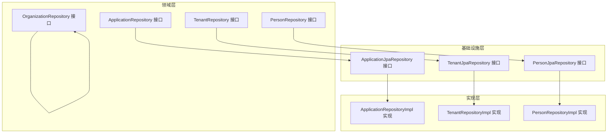
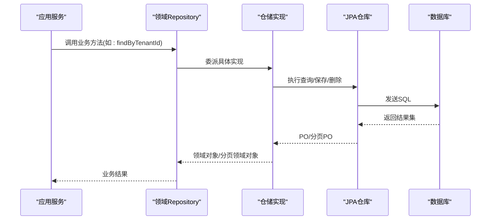
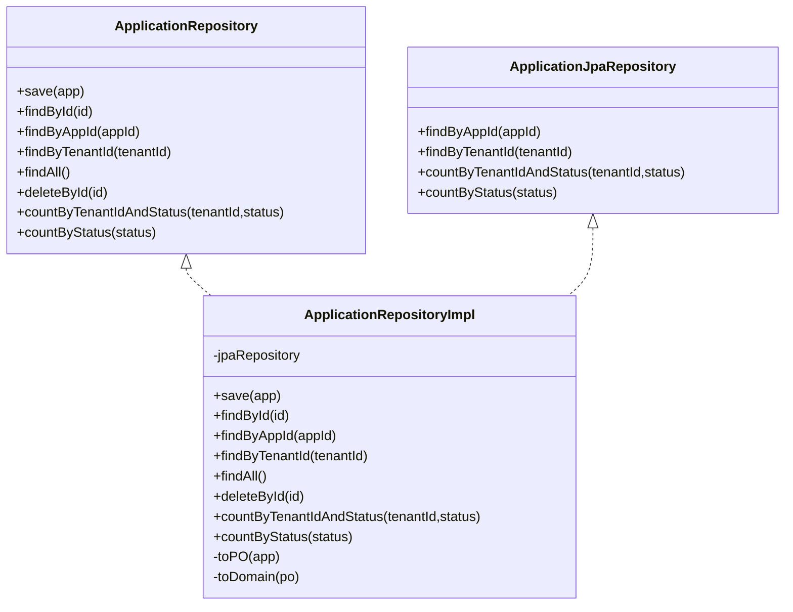
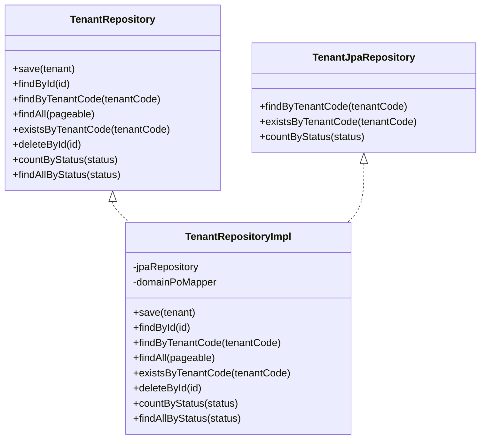
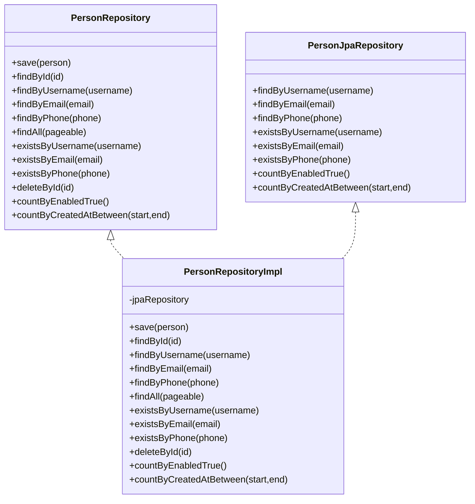
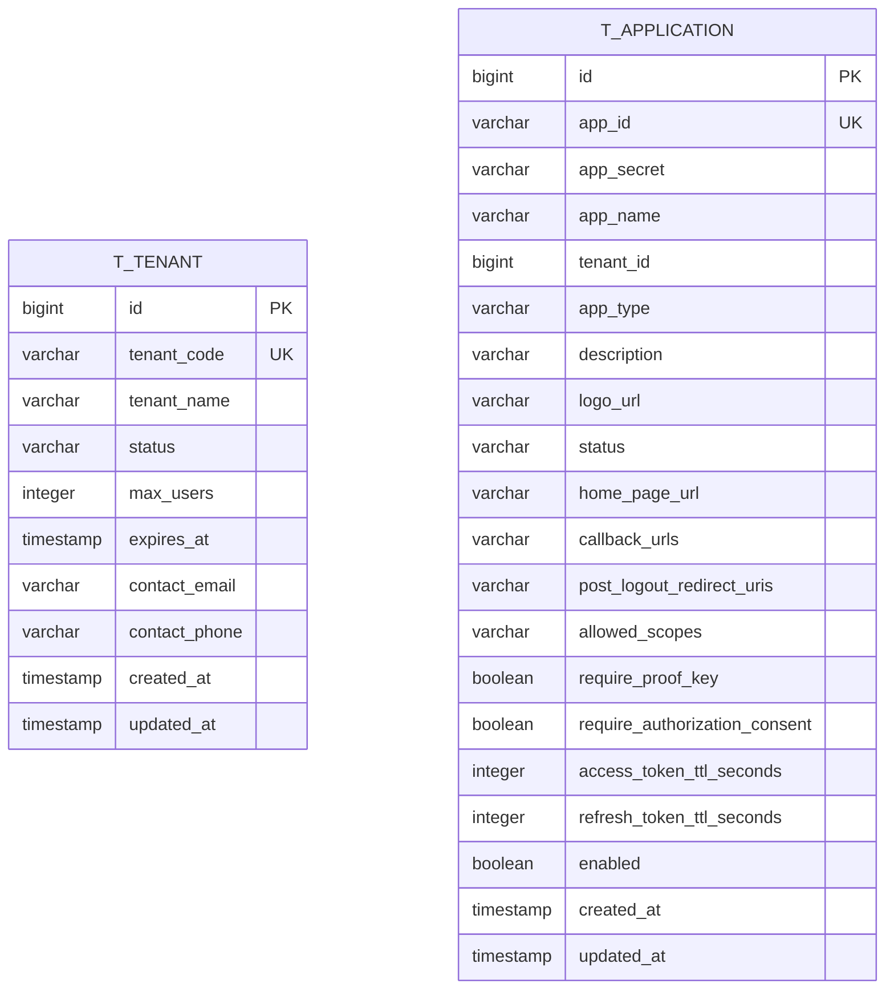
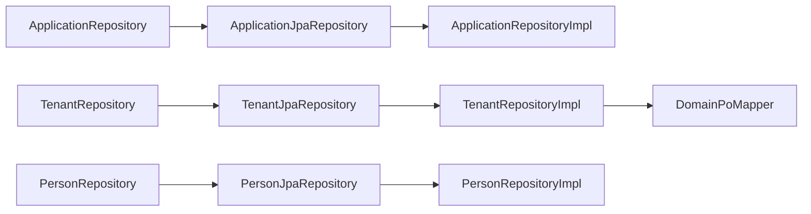
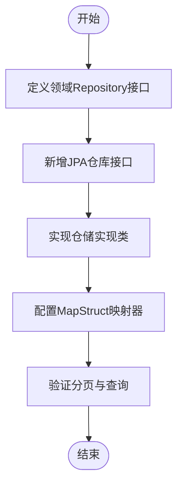

# 仓储层扩展

<cite>
**本文引用的文件**
- [ApplicationRepository.java](file://iam-admin-server/src/main/java/iam/platform/admin/domain/repository/ApplicationRepository.java)
- [ApplicationJpaRepository.java](file://iam-admin-server/src/main/java/iam/platform/admin/infrastructure/persistence/repository/ApplicationJpaRepository.java)
- [ApplicationRepositoryImpl.java](file://iam-admin-server/src/main/java/iam/platform/admin/infrastructure/persistence/impl/ApplicationRepositoryImpl.java)
- [TenantRepository.java](file://iam-admin-server/src/main/java/iam/platform/admin/domain/repository/TenantRepository.java)
- [TenantJpaRepository.java](file://iam-admin-server/src/main/java/iam/platform/admin/infrastructure/persistence/repository/TenantJpaRepository.java)
- [TenantRepositoryImpl.java](file://iam-admin-server/src/main/java/iam/platform/admin/infrastructure/persistence/impl/TenantRepositoryImpl.java)
- [PersonRepository.java](file://iam-admin-server/src/main/java/iam/platform/admin/domain/repository/PersonRepository.java)
- [PersonJpaRepository.java](file://iam-admin-server/src/main/java/iam/platform/admin/infrastructure/persistence/repository/PersonJpaRepository.java)
- [PersonRepositoryImpl.java](file://iam-admin-server/src/main/java/iam/platform/admin/infrastructure/persistence/impl/PersonRepositoryImpl.java)
- [OrganizationRepository.java](file://iam-admin-server/src/main/java/iam/platform/admin/domain/repository/OrganizationRepository.java)
- [DomainPoMapper.java](file://iam-admin-server/src/main/java/iam/platform/admin/infrastructure/persistence/converter/DomainPoMapper.java)
- [RedisConfig.java](file://iam-admin-server/src/main/java/iam/platform/admin/infrastructure/config/RedisConfig.java)
- [ApplicationPO.java](file://iam-admin-server/src/main/java/iam/platform/admin/infrastructure/persistence/entity/ApplicationPO.java)
- [TenantPO.java](file://iam-admin-server/src/main/java/iam/platform/admin/infrastructure/persistence/entity/TenantPO.java)
- [application.yml](file://iam-admin-server/src/main/resources/application.yml)
</cite>

## 目录
1. [引言](#引言)
2. [项目结构](#项目结构)
3. [核心组件](#核心组件)
4. [架构总览](#架构总览)
5. [详细组件分析](#详细组件分析)
6. [依赖分析](#依赖分析)
7. [性能考虑](#性能考虑)
8. [故障排查指南](#故障排查指南)
9. [结论](#结论)
10. [附录：扩展开发示例与最佳实践](#附录扩展开发示例与最佳实践)

## 引言
本指南面向需要在IAM平台中进行仓储层扩展的开发者，系统阐述Domain Repository与Infrastructure Repository的分层设计、JpaRepository扩展模式、自定义查询与分页处理、数据访问优化、缓存与连接池配置、异常处理策略，以及单元测试、集成测试与性能测试的方法论。文档以实际代码为依据，提供可操作的扩展路径与最佳实践。

## 项目结构
IAM平台采用多模块结构，仓储层位于“管理服务”子模块（iam-admin-server）中，遵循“领域模型-基础设施-持久化”的分层组织方式：
- 领域层：定义Repository接口，描述业务能力边界
- 基础设施层：定义JPA仓库接口，暴露数据库访问能力
- 实现层：编写Repository实现类，负责领域对象与PO之间的转换、调用JPA仓库并返回领域对象

图表来源
- [ApplicationRepository.java:8-24](file://iam-admin-server/src/main/java/iam/platform/admin/domain/repository/ApplicationRepository.java#L8-L24)
- [ApplicationJpaRepository.java:9-17](file://iam-admin-server/src/main/java/iam/platform/admin/infrastructure/persistence/repository/ApplicationJpaRepository.java#L9-L17)
- [ApplicationRepositoryImpl.java:21-66](file://iam-admin-server/src/main/java/iam/platform/admin/infrastructure/persistence/impl/ApplicationRepositoryImpl.java#L21-L66)
- [TenantRepository.java:10-26](file://iam-admin-server/src/main/java/iam/platform/admin/domain/repository/TenantRepository.java#L10-L26)
- [TenantJpaRepository.java:8-14](file://iam-admin-server/src/main/java/iam/platform/admin/infrastructure/persistence/repository/TenantJpaRepository.java#L8-L14)
- [TenantRepositoryImpl.java:19-65](file://iam-admin-server/src/main/java/iam/platform/admin/infrastructure/persistence/impl/TenantRepositoryImpl.java#L19-L65)
- [PersonRepository.java:9-33](file://iam-admin-server/src/main/java/iam/platform/admin/domain/repository/PersonRepository.java#L9-L33)
- [PersonJpaRepository.java:8-24](file://iam-admin-server/src/main/java/iam/platform/admin/infrastructure/persistence/repository/PersonJpaRepository.java#L8-L24)
- [PersonRepositoryImpl.java:16-81](file://iam-admin-server/src/main/java/iam/platform/admin/infrastructure/persistence/impl/PersonRepositoryImpl.java#L16-L81)

章节来源
- [ApplicationRepository.java:1-25](file://iam-admin-server/src/main/java/iam/platform/admin/domain/repository/ApplicationRepository.java#L1-L25)
- [TenantRepository.java:1-27](file://iam-admin-server/src/main/java/iam/platform/admin/domain/repository/TenantRepository.java#L1-L27)
- [PersonRepository.java:1-34](file://iam-admin-server/src/main/java/iam/platform/admin/domain/repository/PersonRepository.java#L1-L34)
- [OrganizationRepository.java:1-25](file://iam-admin-server/src/main/java/iam/platform/admin/domain/repository/OrganizationRepository.java#L1-L25)

## 核心组件
- 领域Repository接口：定义业务所需的查询与操作契约，如按主键查找、按条件查询、分页查询、计数等。
- JPA仓库接口：继承Spring Data JPA的JpaRepository，声明原生SQL或派生查询方法，如按字段匹配、存在性检查、范围计数等。
- 仓储实现类：持有JPA仓库实例，完成领域对象与PO之间的双向映射，并对外暴露领域对象。

典型职责划分
- 领域Repository：不关心数据源细节，只暴露业务语义明确的方法签名
- JPA仓库：聚焦数据库访问，提供高效查询与分页能力
- 仓储实现：负责对象转换、空值处理、默认值回退与简单业务规则

章节来源
- [ApplicationRepository.java:8-24](file://iam-admin-server/src/main/java/iam/platform/admin/domain/repository/ApplicationRepository.java#L8-L24)
- [ApplicationJpaRepository.java:9-17](file://iam-admin-server/src/main/java/iam/platform/admin/infrastructure/persistence/repository/ApplicationJpaRepository.java#L9-L17)
- [ApplicationRepositoryImpl.java:21-106](file://iam-admin-server/src/main/java/iam/platform/admin/infrastructure/persistence/impl/ApplicationRepositoryImpl.java#L21-L106)
- [TenantRepository.java:10-26](file://iam-admin-server/src/main/java/iam/platform/admin/domain/repository/TenantRepository.java#L10-L26)
- [TenantJpaRepository.java:8-14](file://iam-admin-server/src/main/java/iam/platform/admin/infrastructure/persistence/repository/TenantJpaRepository.java#L8-L14)
- [TenantRepositoryImpl.java:19-65](file://iam-admin-server/src/main/java/iam/platform/admin/infrastructure/persistence/impl/TenantRepositoryImpl.java#L19-L65)
- [PersonRepository.java:9-33](file://iam-admin-server/src/main/java/iam/platform/admin/domain/repository/PersonRepository.java#L9-L33)
- [PersonJpaRepository.java:8-24](file://iam-admin-server/src/main/java/iam/platform/admin/infrastructure/persistence/repository/PersonJpaRepository.java#L8-L24)
- [PersonRepositoryImpl.java:16-111](file://iam-admin-server/src/main/java/iam/platform/admin/infrastructure/persistence/impl/PersonRepositoryImpl.java#L16-L111)

## 架构总览
下图展示仓储层的端到端交互：应用服务通过领域Repository发起业务请求，仓储实现调用JPA仓库执行数据库操作，再将结果映射为领域对象返回。

图表来源
- [ApplicationRepository.java:8-24](file://iam-admin-server/src/main/java/iam/platform/admin/domain/repository/ApplicationRepository.java#L8-L24)
- [ApplicationRepositoryImpl.java:43-50](file://iam-admin-server/src/main/java/iam/platform/admin/infrastructure/persistence/impl/ApplicationRepositoryImpl.java#L43-L50)
- [ApplicationJpaRepository.java:12-12](file://iam-admin-server/src/main/java/iam/platform/admin/infrastructure/persistence/repository/ApplicationJpaRepository.java#L12-L12)
- [TenantRepository.java:17-17](file://iam-admin-server/src/main/java/iam/platform/admin/domain/repository/TenantRepository.java#L17-L17)
- [TenantRepositoryImpl.java:42-43](file://iam-admin-server/src/main/java/iam/platform/admin/infrastructure/persistence/impl/TenantRepositoryImpl.java#L42-L43)
- [TenantJpaRepository.java:8-14](file://iam-admin-server/src/main/java/iam/platform/admin/infrastructure/persistence/repository/TenantJpaRepository.java#L8-L14)
- [PersonRepository.java:20-20](file://iam-admin-server/src/main/java/iam/platform/admin/domain/repository/PersonRepository.java#L20-L20)
- [PersonRepositoryImpl.java:48-49](file://iam-admin-server/src/main/java/iam/platform/admin/infrastructure/persistence/impl/PersonRepositoryImpl.java#L48-L49)
- [PersonJpaRepository.java:8-24](file://iam-admin-server/src/main/java/iam/platform/admin/infrastructure/persistence/repository/PersonJpaRepository.java#L8-L24)

## 详细组件分析

### 应用仓储（Application）
- 领域接口能力：保存、按主键/应用标识查询、按租户查询列表、全量查询、删除、按条件计数
- JPA接口能力：按应用标识查询、按租户查询、按条件计数
- 实现要点：统一使用PO转换器完成领域对象与PO的映射；对枚举类型提供默认值兜底；集合字段采用逗号拼接存储与拆分读取

图表来源
- [ApplicationRepository.java:8-24](file://iam-admin-server/src/main/java/iam/platform/admin/domain/repository/ApplicationRepository.java#L8-L24)
- [ApplicationJpaRepository.java:9-17](file://iam-admin-server/src/main/java/iam/platform/admin/infrastructure/persistence/repository/ApplicationJpaRepository.java#L9-L17)
- [ApplicationRepositoryImpl.java:21-106](file://iam-admin-server/src/main/java/iam/platform/admin/infrastructure/persistence/impl/ApplicationRepositoryImpl.java#L21-L106)

章节来源
- [ApplicationRepository.java:8-24](file://iam-admin-server/src/main/java/iam/platform/admin/domain/repository/ApplicationRepository.java#L8-L24)
- [ApplicationJpaRepository.java:9-17](file://iam-admin-server/src/main/java/iam/platform/admin/infrastructure/persistence/repository/ApplicationJpaRepository.java#L9-L17)
- [ApplicationRepositoryImpl.java:21-106](file://iam-admin-server/src/main/java/iam/platform/admin/infrastructure/persistence/impl/ApplicationRepositoryImpl.java#L21-L106)

### 租户仓储（Tenant）
- 领域接口能力：保存、按主键/编码查询、分页查询、存在性检查、删除、按状态计数、按状态查询列表
- JPA接口能力：按编码查询、存在性检查、按状态计数
- 实现要点：引入统一的DomainPoMapper进行PO映射，减少重复转换逻辑；分页场景直接使用Pageable并映射为领域分页对象

图表来源
- [TenantRepository.java:10-26](file://iam-admin-server/src/main/java/iam/platform/admin/domain/repository/TenantRepository.java#L10-L26)
- [TenantJpaRepository.java:8-14](file://iam-admin-server/src/main/java/iam/platform/admin/infrastructure/persistence/repository/TenantJpaRepository.java#L8-L14)
- [TenantRepositoryImpl.java:19-65](file://iam-admin-server/src/main/java/iam/platform/admin/infrastructure/persistence/impl/TenantRepositoryImpl.java#L19-L65)

章节来源
- [TenantRepository.java:10-26](file://iam-admin-server/src/main/java/iam/platform/admin/domain/repository/TenantRepository.java#L10-L26)
- [TenantJpaRepository.java:8-14](file://iam-admin-server/src/main/java/iam/platform/admin/infrastructure/persistence/repository/TenantJpaRepository.java#L8-L14)
- [TenantRepositoryImpl.java:19-65](file://iam-admin-server/src/main/java/iam/platform/admin/infrastructure/persistence/impl/TenantRepositoryImpl.java#L19-L65)

### 人员仓储（Person）
- 领域接口能力：保存、按主键/用户名/邮箱/电话查询、分页查询、存在性检查、删除、启用计数、时间区间计数
- JPA接口能力：按用户名/邮箱/电话查询、存在性检查、启用计数、时间区间计数
- 实现要点：保持与领域接口一致的查询语义；分页查询直接委托给JPA并映射为领域分页对象

图表来源
- [PersonRepository.java:9-33](file://iam-admin-server/src/main/java/iam/platform/admin/domain/repository/PersonRepository.java#L9-L33)
- [PersonJpaRepository.java:8-24](file://iam-admin-server/src/main/java/iam/platform/admin/infrastructure/persistence/repository/PersonJpaRepository.java#L8-L24)
- [PersonRepositoryImpl.java:16-111](file://iam-admin-server/src/main/java/iam/platform/admin/infrastructure/persistence/impl/PersonRepositoryImpl.java#L16-L111)

章节来源
- [PersonRepository.java:9-33](file://iam-admin-server/src/main/java/iam/platform/admin/domain/repository/PersonRepository.java#L9-L33)
- [PersonJpaRepository.java:8-24](file://iam-admin-server/src/main/java/iam/platform/admin/infrastructure/persistence/repository/PersonJpaRepository.java#L8-L24)
- [PersonRepositoryImpl.java:16-111](file://iam-admin-server/src/main/java/iam/platform/admin/infrastructure/persistence/impl/PersonRepositoryImpl.java#L16-L111)

### 组织仓储（Organization）
- 领域接口能力：保存、按主键查询、按租户查询、按父节点查询、按路径前缀查询、存在性检查、删除、按租户计数
- JPA接口能力：未在当前文件中提供对应JPA接口，建议新增OrganizationJpaRepository以支持派生查询

章节来源
- [OrganizationRepository.java:8-24](file://iam-admin-server/src/main/java/iam/platform/admin/domain/repository/OrganizationRepository.java#L8-L24)

### 数据模型与转换
- ApplicationPO：承载应用实体的持久化字段，含加密列、集合字段逗号拼接、自动时间戳
- TenantPO：承载租户实体的持久化字段，含默认状态、最大用户数、过期时间等
- DomainPoMapper：MapStruct映射器，统一完成领域对象与PO之间的转换，减少重复样板代码

图表来源
- [ApplicationPO.java:19-117](file://iam-admin-server/src/main/java/iam/platform/admin/infrastructure/persistence/entity/ApplicationPO.java#L19-L117)
- [TenantPO.java:17-71](file://iam-admin-server/src/main/java/iam/platform/admin/infrastructure/persistence/entity/TenantPO.java#L17-L71)

章节来源
- [ApplicationPO.java:19-117](file://iam-admin-server/src/main/java/iam/platform/admin/infrastructure/persistence/entity/ApplicationPO.java#L19-L117)
- [TenantPO.java:17-71](file://iam-admin-server/src/main/java/iam/platform/admin/infrastructure/persistence/entity/TenantPO.java#L17-L71)
- [DomainPoMapper.java:22-66](file://iam-admin-server/src/main/java/iam/platform/admin/infrastructure/persistence/converter/DomainPoMapper.java#L22-L66)

## 依赖分析
- 耦合关系：各领域Repository仅依赖对应的JPA仓库接口；仓储实现依赖JPA仓库与映射器；避免跨模块耦合
- 可能的循环依赖：当前结构清晰，未发现循环依赖迹象
- 外部依赖：Spring Data JPA、Hibernate、MapStruct、Redis缓存、Flyway迁移

图表来源
- [ApplicationRepository.java:8-24](file://iam-admin-server/src/main/java/iam/platform/admin/domain/repository/ApplicationRepository.java#L8-L24)
- [ApplicationJpaRepository.java:9-17](file://iam-admin-server/src/main/java/iam/platform/admin/infrastructure/persistence/repository/ApplicationJpaRepository.java#L9-L17)
- [ApplicationRepositoryImpl.java:21-30](file://iam-admin-server/src/main/java/iam/platform/admin/infrastructure/persistence/impl/ApplicationRepositoryImpl.java#L21-L30)
- [TenantRepository.java:10-26](file://iam-admin-server/src/main/java/iam/platform/admin/domain/repository/TenantRepository.java#L10-L26)
- [TenantJpaRepository.java:8-14](file://iam-admin-server/src/main/java/iam/platform/admin/infrastructure/persistence/repository/TenantJpaRepository.java#L8-L14)
- [TenantRepositoryImpl.java:19-29](file://iam-admin-server/src/main/java/iam/platform/admin/infrastructure/persistence/impl/TenantRepositoryImpl.java#L19-L29)
- [PersonRepository.java:9-33](file://iam-admin-server/src/main/java/iam/platform/admin/domain/repository/PersonRepository.java#L9-L33)
- [PersonJpaRepository.java:8-24](file://iam-admin-server/src/main/java/iam/platform/admin/infrastructure/persistence/repository/PersonJpaRepository.java#L8-L24)
- [PersonRepositoryImpl.java:16-25](file://iam-admin-server/src/main/java/iam/platform/admin/infrastructure/persistence/impl/PersonRepositoryImpl.java#L16-L25)
- [DomainPoMapper.java:22-66](file://iam-admin-server/src/main/java/iam/platform/admin/infrastructure/persistence/converter/DomainPoMapper.java#L22-L66)

章节来源
- [DomainPoMapper.java:22-66](file://iam-admin-server/src/main/java/iam/platform/admin/infrastructure/persistence/converter/DomainPoMapper.java#L22-L66)

## 性能考虑
- 连接池配置：通过HikariCP参数控制最大池大小、最小空闲、连接超时、空闲超时与最大生命周期，平衡吞吐与资源占用
- SQL日志与诊断：生产环境关闭show-sql，避免频繁I/O；必要时开启慢查询监控
- 分页与N+1：优先使用JPA分页接口；避免在循环中逐条加载关联对象
- 缓存策略：启用Redis缓存管理器，设置合理的TTL与序列化策略，降低热点查询压力
- Flyway迁移：使用版本化迁移脚本，确保Schema一致性，减少运行时DDL开销

章节来源
- [application.yml:15-32](file://iam-admin-server/src/main/resources/application.yml#L15-L32)
- [application.yml:33-50](file://iam-admin-server/src/main/resources/application.yml#L33-L50)
- [RedisConfig.java:19-28](file://iam-admin-server/src/main/java/iam/platform/admin/infrastructure/config/RedisConfig.java#L19-L28)

## 故障排查指南
- 查询结果为空：确认JPA派生方法命名是否正确；检查PO字段映射与默认值回退逻辑
- 分页异常：确保传入Pageable参数有效；核对JPA分页接口返回类型
- 映射错误：检查DomainPoMapper的映射注解与目标字段；关注枚举转换与集合拆分
- 缓存失效：核对Redis连接配置与TTL设置；验证Key前缀与序列化器
- 迁移失败：查看Flyway迁移日志与目标版本；确认数据库权限与网络连通性

章节来源
- [ApplicationRepositoryImpl.java:68-106](file://iam-admin-server/src/main/java/iam/platform/admin/infrastructure/persistence/impl/ApplicationRepositoryImpl.java#L68-L106)
- [TenantRepositoryImpl.java:25-29](file://iam-admin-server/src/main/java/iam/platform/admin/infrastructure/persistence/impl/TenantRepositoryImpl.java#L25-L29)
- [PersonRepositoryImpl.java:21-25](file://iam-admin-server/src/main/java/iam/platform/admin/infrastructure/persistence/impl/PersonRepositoryImpl.java#L21-L25)
- [RedisConfig.java:19-28](file://iam-admin-server/src/main/java/iam/platform/admin/infrastructure/config/RedisConfig.java#L19-L28)
- [application.yml:38-41](file://iam-admin-server/src/main/resources/application.yml#L38-L41)

## 结论
该仓储层通过清晰的分层与标准化的实现模式，实现了领域抽象与数据访问解耦。基于现有模式，可稳定地扩展新的实体与查询，同时借助缓存与连接池优化整体性能。建议在新增仓储时遵循统一的映射与分页约定，确保一致性与可维护性。

## 附录：扩展开发示例与最佳实践

### 自定义仓储接口扩展步骤
- 定义领域Repository接口：声明业务方法签名，避免暴露数据源细节
- 新增JPA仓库接口：继承JpaRepository并添加派生查询方法
- 实现仓储实现类：注入JPA仓库与映射器，完成PO与领域对象的双向转换
- 配置映射器：使用MapStruct生成映射代码，减少重复逻辑
- 验证分页与查询：确保分页查询返回正确的Page对象

### 查询方法定义与事务管理
- 查询方法：优先使用派生查询与@Query注解，结合Pageable实现分页
- 事务管理：在应用服务层使用@Transactional标注业务事务边界；仓储层保持只读查询的无状态特性
- 事务传播：避免在同一个事务内执行大量写操作，必要时拆分为多个小事务

### 数据访问优化
- 使用索引：为高频查询字段建立数据库索引；避免全表扫描
- 预编译语句：利用JPA/Hibernate的预编译能力，减少SQL解析开销
- 批量操作：对批量插入/更新使用JDBC批处理或JPA批量刷新策略
- 连接池调优：根据QPS与并发度调整HikariCP参数，避免连接争用

### 缓存策略与连接池管理
- 缓存策略：针对热点读取启用Redis缓存，设置合理TTL与Key前缀；对写操作采用失效策略
- 连接池：根据峰值并发与平均响应时间调优最大池大小与空闲超时；启用连接泄漏检测

章节来源
- [ApplicationRepository.java:8-24](file://iam-admin-server/src/main/java/iam/platform/admin/domain/repository/ApplicationRepository.java#L8-L24)
- [ApplicationJpaRepository.java:9-17](file://iam-admin-server/src/main/java/iam/platform/admin/infrastructure/persistence/repository/ApplicationJpaRepository.java#L9-L17)
- [ApplicationRepositoryImpl.java:21-106](file://iam-admin-server/src/main/java/iam/platform/admin/infrastructure/persistence/impl/ApplicationRepositoryImpl.java#L21-L106)
- [TenantRepository.java:10-26](file://iam-admin-server/src/main/java/iam/platform/admin/domain/repository/TenantRepository.java#L10-L26)
- [TenantJpaRepository.java:8-14](file://iam-admin-server/src/main/java/iam/platform/admin/infrastructure/persistence/repository/TenantJpaRepository.java#L8-L14)
- [TenantRepositoryImpl.java:19-65](file://iam-admin-server/src/main/java/iam/platform/admin/infrastructure/persistence/impl/TenantRepositoryImpl.java#L19-L65)
- [PersonRepository.java:9-33](file://iam-admin-server/src/main/java/iam/platform/admin/domain/repository/PersonRepository.java#L9-L33)
- [PersonJpaRepository.java:8-24](file://iam-admin-server/src/main/java/iam/platform/admin/infrastructure/persistence/repository/PersonJpaRepository.java#L8-L24)
- [PersonRepositoryImpl.java:16-111](file://iam-admin-server/src/main/java/iam/platform/admin/infrastructure/persistence/impl/PersonRepositoryImpl.java#L16-L111)
- [DomainPoMapper.java:22-66](file://iam-admin-server/src/main/java/iam/platform/admin/infrastructure/persistence/converter/DomainPoMapper.java#L22-L66)
- [RedisConfig.java:19-28](file://iam-admin-server/src/main/java/iam/platform/admin/infrastructure/config/RedisConfig.java#L19-L28)
- [application.yml:15-32](file://iam-admin-server/src/main/resources/application.yml#L15-L32)
- [application.yml:33-50](file://iam-admin-server/src/main/resources/application.yml#L33-L50)