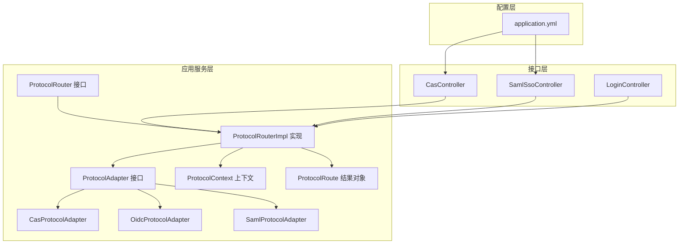
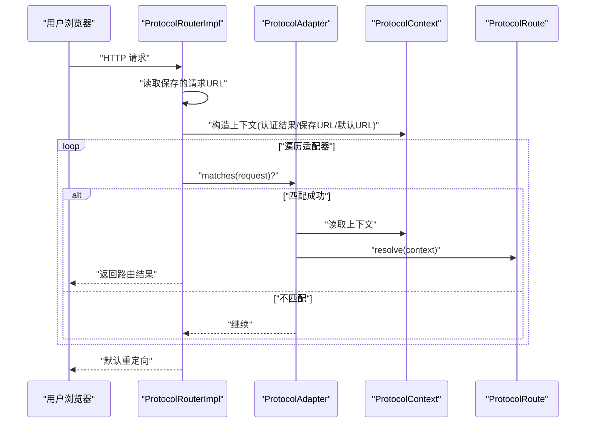
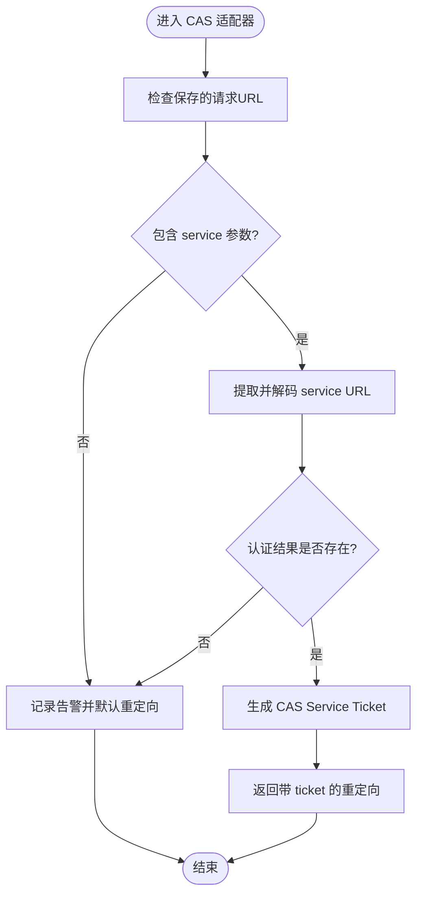
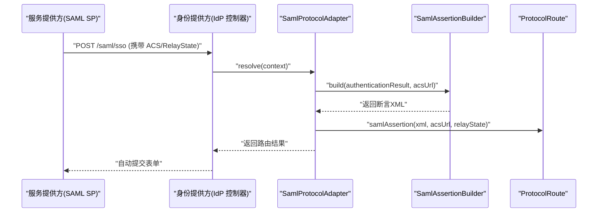
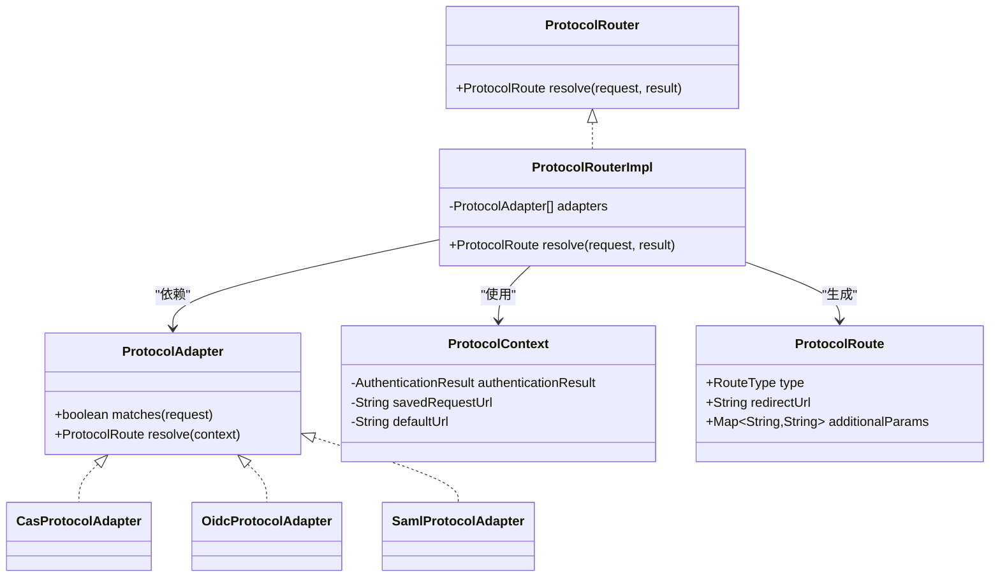

# 协议适配器开发

<cite>
**本文引用的文件**
- [ProtocolAdapter.java](file://iam-auth-server/src/main/java/iam/platform/auth/application/service/routing/ProtocolAdapter.java)
- [ProtocolRouter.java](file://iam-auth-server/src/main/java/iam/platform/auth/application/service/routing/ProtocolRouter.java)
- [ProtocolRouterImpl.java](file://iam-auth-server/src/main/java/iam/platform/auth/application/service/routing/ProtocolRouterImpl.java)
- [ProtocolContext.java](file://iam-auth-server/src/main/java/iam/platform/auth/application/service/routing/ProtocolContext.java)
- [ProtocolRoute.java](file://iam-auth-server/src/main/java/iam/platform/auth/application/service/routing/ProtocolRoute.java)
- [CasProtocolAdapter.java](file://iam-auth-server/src/main/java/iam/platform/auth/application/service/routing/CasProtocolAdapter.java)
- [OidcProtocolAdapter.java](file://iam-auth-server/src/main/java/iam/platform/auth/application/service/routing/OidcProtocolAdapter.java)
- [SamlProtocolAdapter.java](file://iam-auth-server/src/main/java/iam/platform/auth/application/service/routing/SamlProtocolAdapter.java)
- [CasController.java](file://iam-auth-server/src/main/java/iam/platform/auth/interfaces/web/CasController.java)
- [SamlSsoController.java](file://iam-auth-server/src/main/java/iam/platform/auth/interfaces/web/SamlSsoController.java)
- [LoginController.java](file://iam-auth-server/src/main/java/iam/platform/auth/interfaces/web/LoginController.java)
- [application.yml](file://iam-auth-server/src/main/resources/application.yml)
</cite>

## 目录
1. [简介](#简介)
2. [项目结构](#项目结构)
3. [核心组件](#核心组件)
4. [架构总览](#架构总览)
5. [详细组件分析](#详细组件分析)
6. [依赖分析](#依赖分析)
7. [性能考量](#性能考量)
8. [故障排查指南](#故障排查指南)
9. [结论](#结论)
10. [附录](#附录)

## 简介
本指南面向需要在统一认证平台中开发“协议适配器”的工程师，系统阐述 ProtocolAdapter 接口的设计原理与实现规范，覆盖协议路由、上下文管理、错误处理等关键主题；并以现有实现（CasProtocolAdapter、OidcProtocolAdapter、SamlProtocolAdapter）为例，给出可复用的开发范式与最佳实践。文档同时提供新协议适配器的开发步骤、配置方法、运行时管理策略、兼容性与性能优化建议，以及集成测试思路。

## 项目结构
协议适配器位于认证服务模块中，采用按职责分层的组织方式：
- 应用服务层：路由与适配逻辑（routing 包）
- 接口层：控制器暴露协议端点（interfaces/web 包）
- 配置层：通过 application.yml 提供协议相关参数（如 CAS/OIDC/SAML）

图表来源
- [ProtocolAdapter.java:1-20](file://iam-auth-server/src/main/java/iam/platform/auth/application/service/routing/ProtocolAdapter.java#L1-L20)
- [ProtocolRouter.java:1-19](file://iam-auth-server/src/main/java/iam/platform/auth/application/service/routing/ProtocolRouter.java#L1-L19)
- [ProtocolRouterImpl.java:1-52](file://iam-auth-server/src/main/java/iam/platform/auth/application/service/routing/ProtocolRouterImpl.java#L1-L52)
- [ProtocolContext.java:1-21](file://iam-auth-server/src/main/java/iam/platform/auth/application/service/routing/ProtocolContext.java#L1-L21)
- [ProtocolRoute.java:1-74](file://iam-auth-server/src/main/java/iam/platform/auth/application/service/routing/ProtocolRoute.java#L1-L74)
- [CasProtocolAdapter.java:1-80](file://iam-auth-server/src/main/java/iam/platform/auth/application/service/routing/CasProtocolAdapter.java#L1-L80)
- [OidcProtocolAdapter.java:1-40](file://iam-auth-server/src/main/java/iam/platform/auth/application/service/routing/OidcProtocolAdapter.java#L1-L40)
- [SamlProtocolAdapter.java:1-47](file://iam-auth-server/src/main/java/iam/platform/auth/application/service/routing/SamlProtocolAdapter.java#L1-L47)
- [CasController.java:1-170](file://iam-auth-server/src/main/java/iam/platform/auth/interfaces/web/CasController.java#L1-L170)
- [SamlSsoController.java:1-151](file://iam-auth-server/src/main/java/iam/platform/auth/interfaces/web/SamlSsoController.java#L1-L151)
- [LoginController.java:1-58](file://iam-auth-server/src/main/java/iam/platform/auth/interfaces/web/LoginController.java#L1-L58)
- [application.yml:115-127](file://iam-auth-server/src/main/resources/application.yml#L115-L127)

章节来源
- [ProtocolAdapter.java:1-20](file://iam-auth-server/src/main/java/iam/platform/auth/application/service/routing/ProtocolAdapter.java#L1-L20)
- [ProtocolRouterImpl.java:1-52](file://iam-auth-server/src/main/java/iam/platform/auth/application/service/routing/ProtocolRouterImpl.java#L1-L52)
- [application.yml:115-127](file://iam-auth-server/src/main/resources/application.yml#L115-L127)

## 核心组件
- ProtocolAdapter：协议适配器接口，定义两个关键方法：匹配当前请求与解析协议路由。
- ProtocolRouter/Impl：路由决策器，基于保存的请求与适配器集合进行匹配与分发。
- ProtocolContext：路由上下文，封装认证结果、保存的请求URL与默认URL。
- ProtocolRoute：路由结果对象，承载目标类型、重定向URL及附加参数，并提供多种静态工厂方法。
- 具体适配器：CasProtocolAdapter、OidcProtocolAdapter、SamlProtocolAdapter 分别实现不同协议的握手与回跳逻辑。

章节来源
- [ProtocolAdapter.java:1-20](file://iam-auth-server/src/main/java/iam/platform/auth/application/service/routing/ProtocolAdapter.java#L1-L20)
- [ProtocolRouter.java:1-19](file://iam-auth-server/src/main/java/iam/platform/auth/application/service/routing/ProtocolRouter.java#L1-L19)
- [ProtocolRouterImpl.java:1-52](file://iam-auth-server/src/main/java/iam/platform/auth/application/service/routing/ProtocolRouterImpl.java#L1-L52)
- [ProtocolContext.java:1-21](file://iam-auth-server/src/main/java/iam/platform/auth/application/service/routing/ProtocolContext.java#L1-L21)
- [ProtocolRoute.java:1-74](file://iam-auth-server/src/main/java/iam/platform/auth/application/service/routing/ProtocolRoute.java#L1-L74)

## 架构总览
协议适配器体系围绕“请求匹配—上下文构建—路由决策—结果返回”展开。路由器从会话缓存中读取保存的请求，结合适配器集合逐个尝试匹配，最终生成协议特定的路由结果。

图表来源
- [ProtocolRouterImpl.java:24-50](file://iam-auth-server/src/main/java/iam/platform/auth/application/service/routing/ProtocolRouterImpl.java#L24-L50)
- [ProtocolAdapter.java:9-19](file://iam-auth-server/src/main/java/iam/platform/auth/application/service/routing/ProtocolAdapter.java#L9-L19)
- [ProtocolContext.java:10-19](file://iam-auth-server/src/main/java/iam/platform/auth/application/service/routing/ProtocolContext.java#L10-L19)
- [ProtocolRoute.java:8-26](file://iam-auth-server/src/main/java/iam/platform/auth/application/service/routing/ProtocolRoute.java#L8-L26)

## 详细组件分析

### ProtocolAdapter 接口设计
- 设计要点
  - matches：基于请求路径或头信息判断是否属于该协议。
  - resolve：根据上下文生成协议特定的路由结果。
- 耦合与内聚
  - 与具体协议实现解耦，仅依赖通用上下文与结果对象。
- 错误处理
  - 当上下文缺失或认证结果为空时，应降级为默认重定向，避免异常传播。

章节来源
- [ProtocolAdapter.java:9-19](file://iam-auth-server/src/main/java/iam/platform/auth/application/service/routing/ProtocolAdapter.java#L9-L19)

### ProtocolRouter/Impl 路由决策
- 决策流程
  - 若认证结果要求租户选择，则直接返回租户选择路由。
  - 否则从会话缓存读取保存的请求URL，构造上下文，依次调用各适配器的 matches。
  - 返回首个匹配适配器的 resolve 结果；若无匹配，返回默认重定向。
- 性能与扩展性
  - 适配器列表注入，便于新增协议时无需修改路由器。
  - 通过日志记录匹配过程，便于排障。

章节来源
- [ProtocolRouterImpl.java:24-50](file://iam-auth-server/src/main/java/iam/platform/auth/application/service/routing/ProtocolRouterImpl.java#L24-L50)

### ProtocolContext 与 ProtocolRoute
- ProtocolContext
  - 封装认证结果、保存的请求URL与默认URL，作为适配器解析的输入。
- ProtocolRoute
  - 定义多种路由类型（OIDC_CODE、SAML_ASSERTION、CAS_TICKET、API_TOKEN、TENANT_SELECTION、DEFAULT_REDIRECT）。
  - 提供静态工厂方法，确保路由结果的一致性与可读性。

章节来源
- [ProtocolContext.java:10-19](file://iam-auth-server/src/main/java/iam/platform/auth/application/service/routing/ProtocolContext.java#L10-L19)
- [ProtocolRoute.java:8-73](file://iam-auth-server/src/main/java/iam/platform/auth/application/service/routing/ProtocolRoute.java#L8-L73)

### CasProtocolAdapter（CAS）
- 匹配规则
  - URI 包含 “/cas/” 的请求视为 CAS。
- 解析逻辑
  - 从保存请求中提取 service 参数；若缺失则回退到默认URL。
  - 认证结果为空时回退默认重定向。
  - 成功时调用票据服务生成 ST，并返回带 ticket 的重定向。
- 边界处理
  - URL 解码失败时记录告警并回退。
  - 未找到 service 时记录告警并回退。

图表来源
- [CasProtocolAdapter.java:22-50](file://iam-auth-server/src/main/java/iam/platform/auth/application/service/routing/CasProtocolAdapter.java#L22-L50)
- [CasProtocolAdapter.java:56-78](file://iam-auth-server/src/main/java/iam/platform/auth/application/service/routing/CasProtocolAdapter.java#L56-L78)

章节来源
- [CasProtocolAdapter.java:1-80](file://iam-auth-server/src/main/java/iam/platform/auth/application/service/routing/CasProtocolAdapter.java#L1-L80)

### OidcProtocolAdapter（OIDC/OAuth2）
- 匹配规则
  - 来自 “/oauth2/authorize” 的 Referer 或回调路径（/oauth2/callback 或 /login/oauth2/code/）。
- 解析逻辑
  - 若保存URL指向授权端点，恢复原始授权请求（authorization code flow）。
  - 否则回退默认重定向。
- 适用场景
  - 适用于标准 OAuth2/OIDC 授权码流程的回跳。

章节来源
- [OidcProtocolAdapter.java:14-38](file://iam-auth-server/src/main/java/iam/platform/auth/application/service/routing/OidcProtocolAdapter.java#L14-L38)

### SamlProtocolAdapter（SAML 2.0）
- 匹配规则
  - URI 包含 “/saml/” 或 “/sso/saml”。
- 解析逻辑
  - 从上下文读取 ACS URL；若缺失回退默认重定向。
  - 从认证结果提取 RelayState（示例中使用人员编码），生成断言并返回 SAML 断言路由。
- 与控制器协作
  - 断言生成依赖 SamlAssertionBuilder；控制器负责接收 SAML AuthnRequest 并返回自动提交表单。

图表来源
- [SamlProtocolAdapter.java:25-45](file://iam-auth-server/src/main/java/iam/platform/auth/application/service/routing/SamlProtocolAdapter.java#L25-L45)
- [SamlSsoController.java:58-93](file://iam-auth-server/src/main/java/iam/platform/auth/interfaces/web/SamlSsoController.java#L58-L93)

章节来源
- [SamlProtocolAdapter.java:1-47](file://iam-auth-server/src/main/java/iam/platform/auth/application/service/routing/SamlProtocolAdapter.java#L1-L47)
- [SamlSsoController.java:1-151](file://iam-auth-server/src/main/java/iam/platform/auth/interfaces/web/SamlSsoController.java#L1-L151)

### 控制器与协议端点
- CasController
  - 暴露 /cas/login、/cas/serviceTicket、/cas/health 等端点，支持登录、票据校验与健康检查。
  - 登录成功后可直接生成 ST 并重定向至 service。
- SamlSsoController
  - 暴露 /saml/sso、/saml/metadata 等端点，支持 SAML SSO 登录与元数据导出。
  - 生成自动提交表单，向 SP 的 ACS 回传 SAMLResponse。
- LoginController
  - 支持多租户识别与错误提示，为协议适配器提供统一入口页面。

章节来源
- [CasController.java:44-107](file://iam-auth-server/src/main/java/iam/platform/auth/interfaces/web/CasController.java#L44-L107)
- [SamlSsoController.java:42-93](file://iam-auth-server/src/main/java/iam/platform/auth/interfaces/web/SamlSsoController.java#L42-L93)
- [LoginController.java:19-47](file://iam-auth-server/src/main/java/iam/platform/auth/interfaces/web/LoginController.java#L19-L47)

## 依赖分析
- 组件内聚与耦合
  - ProtocolAdapter 与具体协议实现强内聚，但与路由器弱耦合，便于扩展。
  - ProtocolRouterImpl 通过构造函数注入多个适配器，形成可插拔的路由体系。
- 外部依赖
  - 会话缓存用于读取保存的请求URL。
  - 协议控制器负责协议握手与回跳，与适配器共同完成最终路由。

图表来源
- [ProtocolAdapter.java:9-19](file://iam-auth-server/src/main/java/iam/platform/auth/application/service/routing/ProtocolAdapter.java#L9-L19)
- [ProtocolRouter.java:9-18](file://iam-auth-server/src/main/java/iam/platform/auth/application/service/routing/ProtocolRouter.java#L9-L18)
- [ProtocolRouterImpl.java:20-22](file://iam-auth-server/src/main/java/iam/platform/auth/application/service/routing/ProtocolRouterImpl.java#L20-L22)
- [ProtocolContext.java:10-19](file://iam-auth-server/src/main/java/iam/platform/auth/application/service/routing/ProtocolContext.java#L10-L19)
- [ProtocolRoute.java:8-26](file://iam-auth-server/src/main/java/iam/platform/auth/application/service/routing/ProtocolRoute.java#L8-L26)
- [CasProtocolAdapter.java:17-17](file://iam-auth-server/src/main/java/iam/platform/auth/application/service/routing/CasProtocolAdapter.java#L17-L17)
- [OidcProtocolAdapter.java:12-12](file://iam-auth-server/src/main/java/iam/platform/auth/application/service/routing/OidcProtocolAdapter.java#L12-L12)
- [SamlProtocolAdapter.java:15-15](file://iam-auth-server/src/main/java/iam/platform/auth/application/service/routing/SamlProtocolAdapter.java#L15-L15)

## 性能考量
- 路由器匹配顺序
  - 适配器列表顺序影响性能；将最可能命中的协议置于前列。
- 会话缓存访问
  - 使用会话缓存读取保存请求URL，避免重复解析与网络开销。
- 日志与可观测性
  - 在匹配与回退路径中添加日志，便于定位性能瓶颈。
- 缓存与短路
  - 对于高并发场景，可在适配器内部引入轻量缓存（如基于请求特征的快速判定）。

## 故障排查指南
- 常见问题与定位
  - 未匹配到适配器：检查请求URI是否符合各适配器的匹配规则；查看路由器日志输出。
  - 认证结果为空：确认登录流程是否正确设置认证结果；检查上下文构建逻辑。
  - CAS service 参数缺失：确认客户端是否传递 service；查看适配器的回退逻辑。
  - SAML ACS URL 缺失：确认控制器是否正确接收并保存 ACS/RelayState。
- 关键日志位置
  - 路由器：匹配适配器与默认重定向分支。
  - CAS 适配器：service 提取与票据生成。
  - SAML 适配器：ACS URL 与断言生成。
- 配置核对
  - application.yml 中的 CAS/OIDC/SAML 相关参数是否正确加载。

章节来源
- [ProtocolRouterImpl.java:40-45](file://iam-auth-server/src/main/java/iam/platform/auth/application/service/routing/ProtocolRouterImpl.java#L40-L45)
- [CasProtocolAdapter.java:35-43](file://iam-auth-server/src/main/java/iam/platform/auth/application/service/routing/CasProtocolAdapter.java#L35-L43)
- [SamlProtocolAdapter.java:30-33](file://iam-auth-server/src/main/java/iam/platform/auth/application/service/routing/SamlProtocolAdapter.java#L30-L33)
- [application.yml:115-127](file://iam-auth-server/src/main/resources/application.yml#L115-L127)

## 结论
协议适配器体系通过清晰的接口与可插拔的实现，实现了对 OIDC、SAML、CAS 等多种协议的统一路由与回跳。遵循本文的设计原则与实现范式，即可高效地开发新的协议适配器，并在生产环境中获得良好的稳定性与可维护性。

## 附录

### 开发新协议适配器步骤
- 步骤清单
  - 实现 ProtocolAdapter 接口：定义 matches 与 resolve。
  - 在 resolve 中读取 ProtocolContext，按协议语义生成 ProtocolRoute。
  - 在控制器中实现协议握手与回跳端点（如需）。
  - 在路由器中注册适配器 Bean，确保被注入到 ProtocolRouterImpl。
  - 编写集成测试：覆盖匹配条件、上下文缺失、认证结果缺失等边界场景。
- 参考实现
  - OIDC：参考 OidcProtocolAdapter 的匹配与恢复授权请求逻辑。
  - SAML：参考 SamlProtocolAdapter 的 ACS/RelayState 处理与断言生成。
  - CAS：参考 CasProtocolAdapter 的 service 提取与票据生成。

章节来源
- [OidcProtocolAdapter.java:14-38](file://iam-auth-server/src/main/java/iam/platform/auth/application/service/routing/OidcProtocolAdapter.java#L14-L38)
- [SamlProtocolAdapter.java:25-45](file://iam-auth-server/src/main/java/iam/platform/auth/application/service/routing/SamlProtocolAdapter.java#L25-L45)
- [CasProtocolAdapter.java:27-50](file://iam-auth-server/src/main/java/iam/platform/auth/application/service/routing/CasProtocolAdapter.java#L27-L50)

### 配置方法与运行时管理
- 配置项
  - CAS：server-url、ticket-validity-seconds、single-sign-out 等。
  - OIDC：issuer-uri、JWK 密钥等。
  - SAML：元数据生成与控制器端点。
- 运行时管理
  - 通过 application.yml 注入环境变量，支持多环境切换。
  - 使用健康检查端点监控服务状态。

章节来源
- [application.yml:81-127](file://iam-auth-server/src/main/resources/application.yml#L81-L127)

### 协议兼容性与安全最佳实践
- 兼容性
  - 保持路由类型与控制器端点的契约一致（如 SAML 的 ACS、RelayState，CAS 的 service/ticket）。
  - 对历史版本协议（如 CAS 3.0）提供兼容的响应格式。
- 安全
  - 强制 HTTPS 传输，启用会话存储于 Redis。
  - 严格校验与解码外部输入（如 service、ACS、RelayState）。
  - 限制重定向域白名单，防止开放重定向风险。
  - 启用速率限制与账户锁定策略。

章节来源
- [application.yml:1-144](file://iam-auth-server/src/main/resources/application.yml#L1-L144)

### 集成测试方法
- 测试维度
  - 匹配规则：构造不同 URI 与 Referer，验证适配器是否正确匹配。
  - 上下文缺失：模拟保存请求为空、认证结果为空，验证回退逻辑。
  - 协议握手：通过控制器端点触发登录与回跳，验证路由结果。
- 示例路径
  - OIDC：构造来自授权端点的保存请求，验证恢复授权请求。
  - SAML：构造包含 ACS/RelayState 的保存请求，验证断言生成与回跳。
  - CAS：构造包含 service 的保存请求，验证票据生成与重定向。

章节来源
- [OidcProtocolAdapter.java:31-34](file://iam-auth-server/src/main/java/iam/platform/auth/application/service/routing/OidcProtocolAdapter.java#L31-L34)
- [SamlProtocolAdapter.java:26-45](file://iam-auth-server/src/main/java/iam/platform/auth/application/service/routing/SamlProtocolAdapter.java#L26-L45)
- [CasProtocolAdapter.java:28-50](file://iam-auth-server/src/main/java/iam/platform/auth/application/service/routing/CasProtocolAdapter.java#L28-L50)