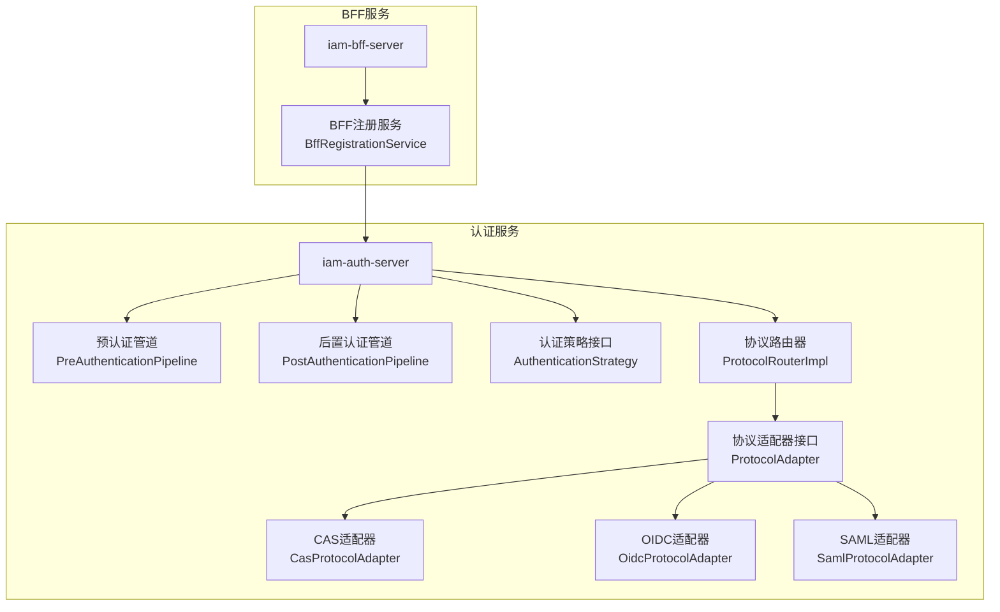
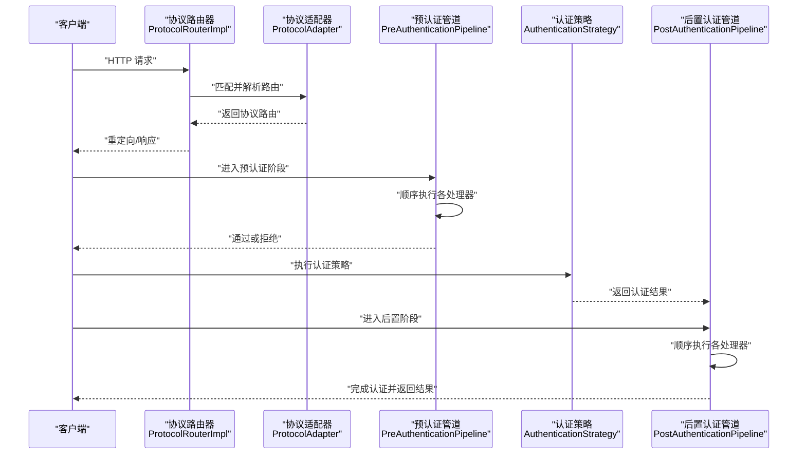
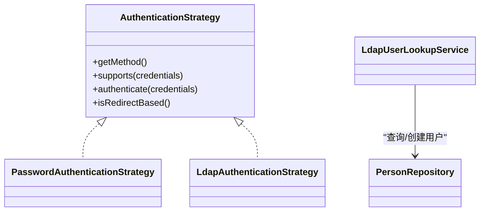
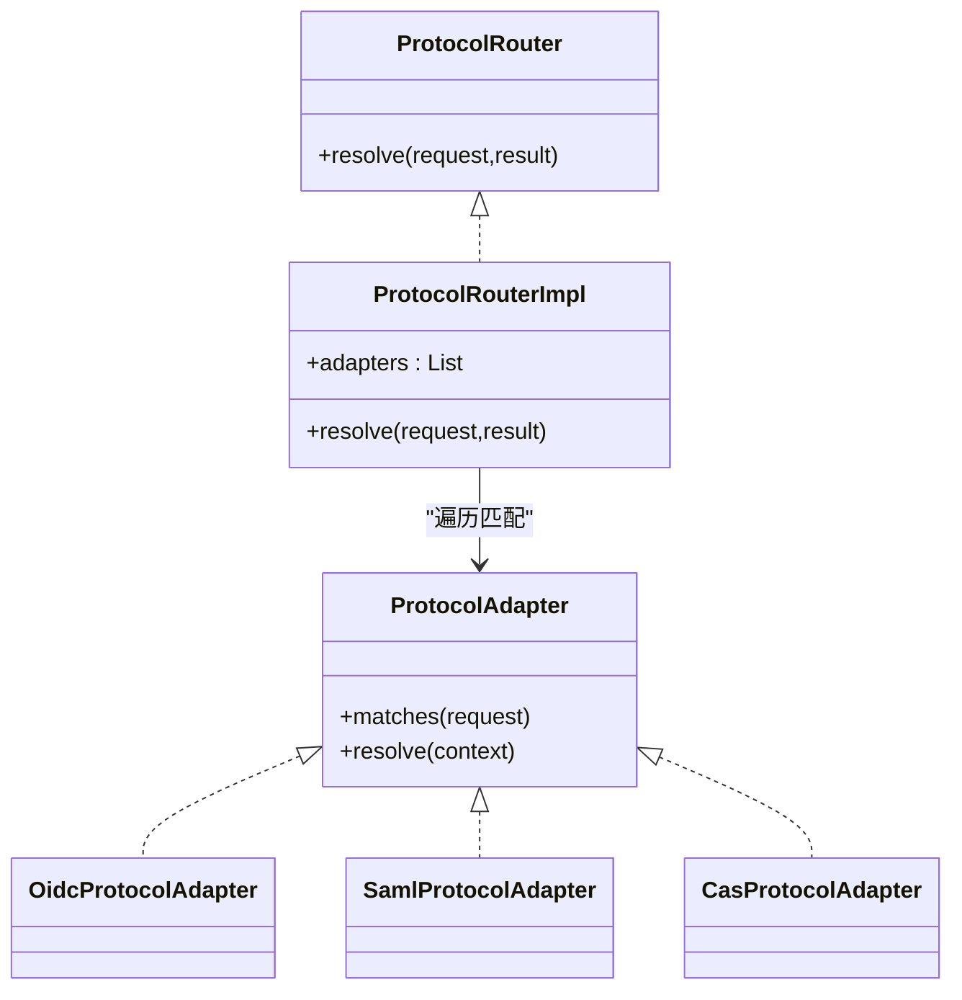
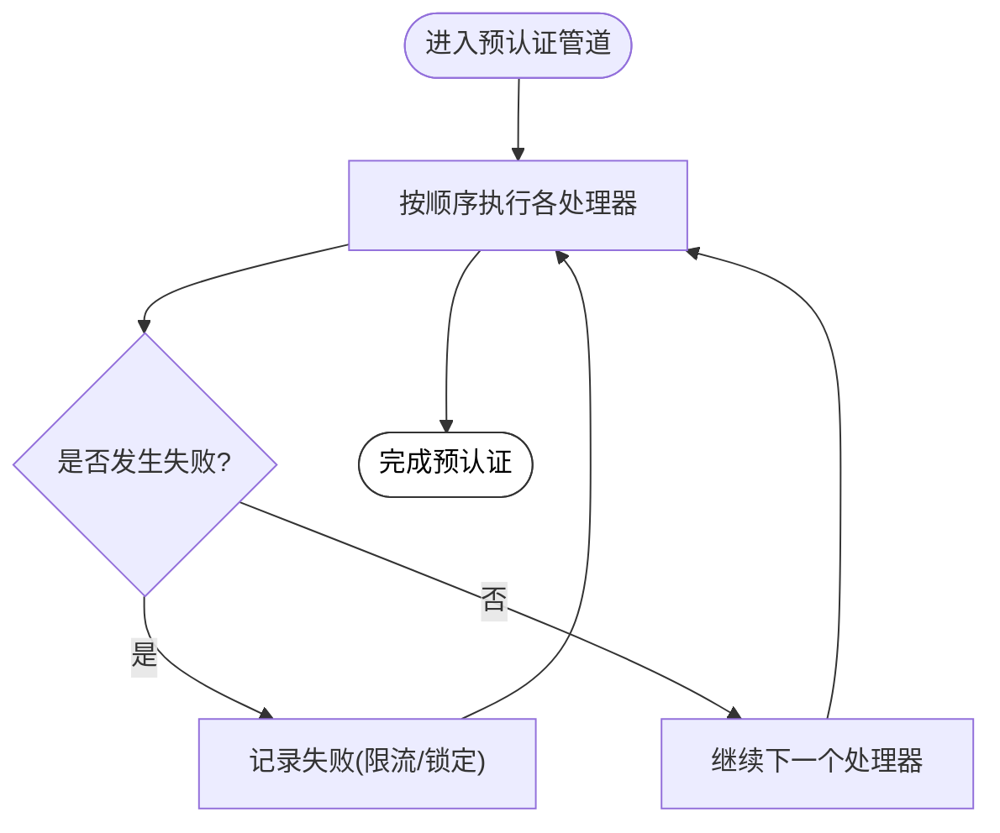
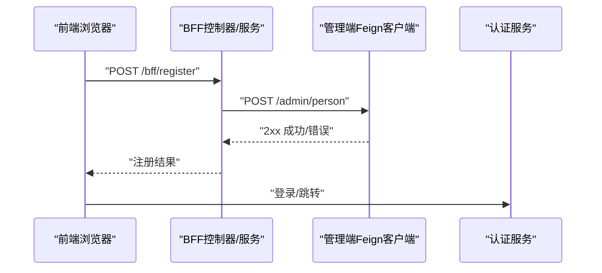
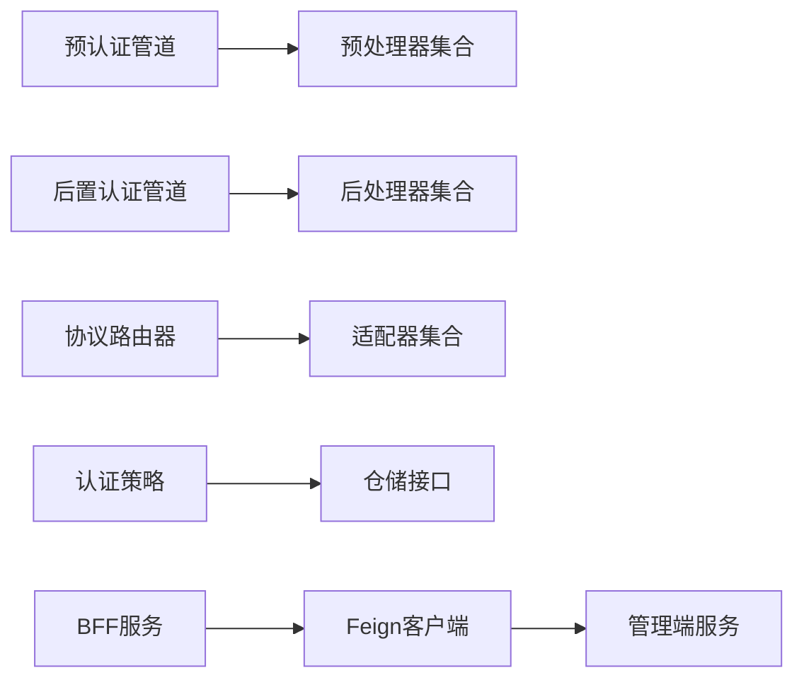

# 扩展开发

<cite>
**本文引用的文件**
- [PreAuthHandler.java](file://iam-auth-server/src/main/java/iam/platform/auth/application/service/pipeline/PreAuthHandler.java)
- [PostAuthHandler.java](file://iam-auth-server/src/main/java/iam/platform/auth/application/service/pipeline/PostAuthHandler.java)
- [PreAuthenticationPipeline.java](file://iam-auth-server/src/main/java/iam/platform/auth/application/service/pipeline/PreAuthenticationPipeline.java)
- [PostAuthenticationPipeline.java](file://iam-auth-server/src/main/java/iam/platform/auth/application/service/pipeline/PostAuthenticationPipeline.java)
- [AuthenticationStrategy.java](file://iam-auth-server/src/main/java/iam/platform/auth/domain/service/AuthenticationStrategy.java)
- [LdapUserLookupService.java](file://iam-auth-server/src/main/java/iam/platform/auth/application/service/LdapUserLookupService.java)
- [ProtocolAdapter.java](file://iam-auth-server/src/main/java/iam/platform/auth/application/service/routing/ProtocolAdapter.java)
- [ProtocolRouter.java](file://iam-auth-server/src/main/java/iam/platform/auth/application/service/routing/ProtocolRouter.java)
- [ProtocolRouterImpl.java](file://iam-auth-server/src/main/java/iam/platform/auth/application/service/routing/ProtocolRouterImpl.java)
- [CasProtocolAdapter.java](file://iam-auth-server/src/main/java/iam/platform/auth/application/service/routing/CasProtocolAdapter.java)
- [OidcProtocolAdapter.java](file://iam-auth-server/src/main/java/iam/platform/auth/application/service/routing/OidcProtocolAdapter.java)
- [SamlProtocolAdapter.java](file://iam-auth-server/src/main/java/iam/platform/auth/application/service/routing/SamlProtocolAdapter.java)
- [BffRegistrationService.java](file://iam-bff-server/src/main/java/iam/platform/bff/application/service/BffRegistrationService.java)
</cite>

## 目录
1. [简介](#简介)
2. [项目结构](#项目结构)
3. [核心组件](#核心组件)
4. [架构总览](#架构总览)
5. [详细组件分析](#详细组件分析)
6. [依赖分析](#依赖分析)
7. [性能考虑](#性能考虑)
8. [故障排查指南](#故障排查指南)
9. [结论](#结论)
10. [附录](#附录)

## 简介
本文件面向IAM平台扩展开发者，系统性阐述插件化扩展体系：认证处理器（PreAuthHandler/PostAuthHandler）、协议适配器（ProtocolAdapter）与认证策略（AuthenticationStrategy）的扩展方法；提供自定义认证策略（如PasswordAuthenticationStrategy、LdapAuthenticationStrategy）的实现要点；给出新增认证协议的扩展步骤；说明管道处理器的开发模式；介绍仓储接口的扩展与实现；并提供BFF服务扩展开发指南以及扩展模块的打包、部署与版本管理策略。

## 项目结构
IAM平台采用多模块分层架构：
- iam-auth-server：认证与授权核心服务，包含认证策略、协议路由、预/后置管道处理、安全配置与控制器。
- iam-bff-server：前端代理/网关服务，负责注册、登录、同意页等前端交互，并通过Feign调用后台服务。
- iam-admin-server：管理端应用，提供组织、人员、权限、审计等管理能力。
- iam-common：通用模型、DTO、异常与工具类，供各模块共享。
- iam-gateway：网关模块（当前未在本文深入展开）。

图表来源
- [PreAuthenticationPipeline.java:1-61](file://iam-auth-server/src/main/java/iam/platform/auth/application/service/pipeline/PreAuthenticationPipeline.java#L1-L61)
- [PostAuthenticationPipeline.java:1-31](file://iam-auth-server/src/main/java/iam/platform/auth/application/service/pipeline/PostAuthenticationPipeline.java#L1-L31)
- [AuthenticationStrategy.java:1-41](file://iam-auth-server/src/main/java/iam/platform/auth/domain/service/AuthenticationStrategy.java#L1-L41)
- [ProtocolRouterImpl.java:1-52](file://iam-auth-server/src/main/java/iam/platform/auth/application/service/routing/ProtocolRouterImpl.java#L1-L52)
- [ProtocolAdapter.java:1-20](file://iam-auth-server/src/main/java/iam/platform/auth/application/service/routing/ProtocolAdapter.java#L1-L20)
- [CasProtocolAdapter.java:1-80](file://iam-auth-server/src/main/java/iam/platform/auth/application/service/routing/CasProtocolAdapter.java#L1-L80)
- [OidcProtocolAdapter.java:1-40](file://iam-auth-server/src/main/java/iam/platform/auth/application/service/routing/OidcProtocolAdapter.java#L1-L40)
- [SamlProtocolAdapter.java:1-47](file://iam-auth-server/src/main/java/iam/platform/auth/application/service/routing/SamlProtocolAdapter.java#L1-L47)
- [BffRegistrationService.java:1-31](file://iam-bff-server/src/main/java/iam/platform/bff/application/service/BffRegistrationService.java#L1-L31)

章节来源
- [PreAuthenticationPipeline.java:1-61](file://iam-auth-server/src/main/java/iam/platform/auth/application/service/pipeline/PreAuthenticationPipeline.java#L1-L61)
- [PostAuthenticationPipeline.java:1-31](file://iam-auth-server/src/main/java/iam/platform/auth/application/service/pipeline/PostAuthenticationPipeline.java#L1-L31)
- [AuthenticationStrategy.java:1-41](file://iam-auth-server/src/main/java/iam/platform/auth/domain/service/AuthenticationStrategy.java#L1-L41)
- [ProtocolRouterImpl.java:1-52](file://iam-auth-server/src/main/java/iam/platform/auth/application/service/routing/ProtocolRouterImpl.java#L1-L52)
- [ProtocolAdapter.java:1-20](file://iam-auth-server/src/main/java/iam/platform/auth/application/service/routing/ProtocolAdapter.java#L1-L20)
- [BffRegistrationService.java:1-31](file://iam-bff-server/src/main/java/iam/platform/bff/application/service/BffRegistrationService.java#L1-L31)

## 核心组件
- 认证策略接口（AuthenticationStrategy）
  - 定义认证方法类型、凭证支持判断、认证执行与是否基于重定向的判定。
  - 典型实现：PasswordAuthenticationStrategy、LdapAuthenticationStrategy、OAuth2AuthenticationStrategy、SmsCodeAuthenticationStrategy、EmailCodeAuthenticationStrategy。
- 预认证处理器（PreAuthHandler）
  - 在实际认证前执行，统一实现Ordered以便排序执行。
- 后置认证处理器（PostAuthHandler）
  - 在认证完成后按序执行，完成审计、会话建立、权限加载等收尾工作。
- 协议适配器（ProtocolAdapter）
  - 针对不同协议（OIDC、SAML、CAS）实现匹配与路由解析。
- 协议路由器（ProtocolRouter/Impl）
  - 基于保存请求与适配器集合解析最终路由。

章节来源
- [AuthenticationStrategy.java:1-41](file://iam-auth-server/src/main/java/iam/platform/auth/domain/service/AuthenticationStrategy.java#L1-L41)
- [PreAuthHandler.java:1-18](file://iam-auth-server/src/main/java/iam/platform/auth/application/service/pipeline/PreAuthHandler.java#L1-L18)
- [PostAuthHandler.java:1-12](file://iam-auth-server/src/main/java/iam/platform/auth/application/service/pipeline/PostAuthHandler.java#L1-L12)
- [ProtocolAdapter.java:1-20](file://iam-auth-server/src/main/java/iam/platform/auth/application/service/routing/ProtocolAdapter.java#L1-L20)
- [ProtocolRouter.java:1-19](file://iam-auth-server/src/main/java/iam/platform/auth/application/service/routing/ProtocolRouter.java#L1-L19)
- [ProtocolRouterImpl.java:1-52](file://iam-auth-server/src/main/java/iam/platform/auth/application/service/routing/ProtocolRouterImpl.java#L1-L52)

## 架构总览
认证扩展遵循“策略+管道+适配器”的分层设计：
- 策略层：根据凭证类型选择具体认证策略。
- 管道层：预认证阶段执行风控、限流、白名单等前置检查；后置阶段执行审计、权限加载、会话建立等收尾。
- 适配器层：根据来源协议（OIDC/SAML/CAS）生成对应路由或断言/票据。

图表来源
- [ProtocolRouterImpl.java:24-50](file://iam-auth-server/src/main/java/iam/platform/auth/application/service/routing/ProtocolRouterImpl.java#L24-L50)
- [ProtocolAdapter.java:9-19](file://iam-auth-server/src/main/java/iam/platform/auth/application/service/routing/ProtocolAdapter.java#L9-L19)
- [PreAuthenticationPipeline.java:26-31](file://iam-auth-server/src/main/java/iam/platform/auth/application/service/pipeline/PreAuthenticationPipeline.java#L26-L31)
- [PostAuthenticationPipeline.java:22-29](file://iam-auth-server/src/main/java/iam/platform/auth/application/service/pipeline/PostAuthenticationPipeline.java#L22-L29)
- [AuthenticationStrategy.java:11-31](file://iam-auth-server/src/main/java/iam/platform/auth/domain/service/AuthenticationStrategy.java#L11-L31)

## 详细组件分析

### 认证策略扩展指南（以PasswordAuthenticationStrategy、LdapAuthenticationStrategy为例）
- 实现目标
  - 实现AuthenticationStrategy接口，提供getMethod、supports、authenticate等方法。
  - 可选覆盖isRedirectBased以声明是否涉及外部重定向。
- 关键实现要点
  - 凭证校验：从AuthenticationCredentials中提取用户名/密码等信息，进行本地或外部验证。
  - 用户解析：返回已认证的Person实体，用于后续权限与会话建立。
  - 异常处理：认证失败抛出Spring Security常见异常或平台自定义异常。
- 扩展建议
  - 将策略注册为Spring组件，确保被自动发现。
  - 与仓储接口PersonRepository配合，完成用户查询/创建（参考LDAP用户查找与创建流程）。

图表来源
- [AuthenticationStrategy.java:11-40](file://iam-auth-server/src/main/java/iam/platform/auth/domain/service/AuthenticationStrategy.java#L11-L40)
- [LdapUserLookupService.java:63-85](file://iam-auth-server/src/main/java/iam/platform/auth/application/service/LdapUserLookupService.java#L63-L85)

章节来源
- [AuthenticationStrategy.java:1-41](file://iam-auth-server/src/main/java/iam/platform/auth/domain/service/AuthenticationStrategy.java#L1-L41)
- [LdapUserLookupService.java:1-87](file://iam-auth-server/src/main/java/iam/platform/auth/application/service/LdapUserLookupService.java#L1-L87)

### 协议适配器扩展指南（新增认证协议支持）
- 设计原则
  - 每个协议实现ProtocolAdapter接口，提供matches与resolve方法。
  - matches用于识别请求来源（如OIDC回调、SAML断言消费者、CAS服务URL）。
  - resolve根据上下文生成协议特定路由（重定向URL、票据、断言XML等）。
- 扩展步骤
  1) 新建适配器类，实现ProtocolAdapter。
  2) 在resolve中读取ProtocolContext中的认证结果与保存请求URL。
  3) 通过ProtocolRoute工厂方法返回路由对象。
  4) 将适配器注册为Spring组件，由ProtocolRouterImpl自动发现并执行。
- 参考实现
  - OIDC：基于Referer与回调路径识别，恢复授权码流程或默认重定向。
  - SAML：从上下文中获取ACS与RelayState，构建断言XML。
  - CAS：从保存URL提取service参数，生成Service Ticket。

图表来源
- [ProtocolAdapter.java:9-19](file://iam-auth-server/src/main/java/iam/platform/auth/application/service/routing/ProtocolAdapter.java#L9-L19)
- [ProtocolRouter.java:9-18](file://iam-auth-server/src/main/java/iam/platform/auth/application/service/routing/ProtocolRouter.java#L9-L18)
- [ProtocolRouterImpl.java:24-50](file://iam-auth-server/src/main/java/iam/platform/auth/application/service/routing/ProtocolRouterImpl.java#L24-L50)
- [OidcProtocolAdapter.java:14-38](file://iam-auth-server/src/main/java/iam/platform/auth/application/service/routing/OidcProtocolAdapter.java#L14-L38)
- [SamlProtocolAdapter.java:19-45](file://iam-auth-server/src/main/java/iam/platform/auth/application/service/routing/SamlProtocolAdapter.java#L19-L45)
- [CasProtocolAdapter.java:21-50](file://iam-auth-server/src/main/java/iam/platform/auth/application/service/routing/CasProtocolAdapter.java#L21-L50)

章节来源
- [ProtocolAdapter.java:1-20](file://iam-auth-server/src/main/java/iam/platform/auth/application/service/routing/ProtocolAdapter.java#L1-L20)
- [ProtocolRouterImpl.java:1-52](file://iam-auth-server/src/main/java/iam/platform/auth/application/service/routing/ProtocolRouterImpl.java#L1-L52)
- [OidcProtocolAdapter.java:1-40](file://iam-auth-server/src/main/java/iam/platform/auth/application/service/routing/OidcProtocolAdapter.java#L1-L40)
- [SamlProtocolAdapter.java:1-47](file://iam-auth-server/src/main/java/iam/platform/auth/application/service/routing/SamlProtocolAdapter.java#L1-L47)
- [CasProtocolAdapter.java:1-80](file://iam-auth-server/src/main/java/iam/platform/auth/application/service/routing/CasProtocolAdapter.java#L1-L80)

### 管道处理器开发（PreAuthHandler与PostAuthHandler）
- 预认证管道（PreAuthenticationPipeline）
  - 职责：在认证前执行一系列检查（如IP白名单、速率限制、账户状态校验、登录记录等）。
  - 执行顺序：按Ordered排序，逐个调用handle。
  - 失败/成功记录：针对限流与锁定处理器，提供recordFailure/recordSuccess以更新状态。
- 后置认证管道（PostAuthenticationPipeline）
  - 职责：在认证完成后执行审计、权限加载、会话建立、租户选择等。
  - 执行顺序：按Ordered排序，逐个调用handle。
  - 结果封装：将PostAuthContext转换为AuthenticationResult返回。
- 开发模式
  - 实现PreAuthHandler或PostAuthHandler接口，注入所需依赖（仓储、缓存、审计等）。
  - 在handle中读取上下文，执行业务逻辑，必要时抛出PreAuthenticationException或认证相关异常。
  - 使用@Order注解控制执行顺序。

图表来源
- [PreAuthenticationPipeline.java:26-60](file://iam-auth-server/src/main/java/iam/platform/auth/application/service/pipeline/PreAuthenticationPipeline.java#L26-L60)

章节来源
- [PreAuthHandler.java:1-18](file://iam-auth-server/src/main/java/iam/platform/auth/application/service/pipeline/PreAuthHandler.java#L1-L18)
- [PostAuthHandler.java:1-12](file://iam-auth-server/src/main/java/iam/platform/auth/application/service/pipeline/PostAuthHandler.java#L1-L12)
- [PreAuthenticationPipeline.java:1-61](file://iam-auth-server/src/main/java/iam/platform/auth/application/service/pipeline/PreAuthenticationPipeline.java#L1-L61)
- [PostAuthenticationPipeline.java:1-31](file://iam-auth-server/src/main/java/iam/platform/auth/application/service/pipeline/PostAuthenticationPipeline.java#L1-L31)

### 仓储接口扩展与实现
- 扩展场景
  - 新增领域实体或查询维度时，需要扩展对应的Repository接口与实现。
  - 与认证策略联动（如LDAP用户查找与创建），需结合PersonRepository进行用户映射。
- 实现要点
  - 接口定义：在domain/repository下定义Repository接口，声明查询/操作方法。
  - Spring Data实现：在infrastructure/persistence/repository下提供JpaRepository实现。
  - 自定义持久化：在infrastructure/persistence/impl中提供自定义实现，注入实体映射与SQL模板。
- 示例参考
  - LdapUserLookupService通过PersonRepository完成LDAP用户的本地映射与创建。

章节来源
- [LdapUserLookupService.java:63-85](file://iam-auth-server/src/main/java/iam/platform/auth/application/service/LdapUserLookupService.java#L63-L85)

### BFF服务扩展开发指南
- 角色定位
  - BFF作为前端代理，负责注册、登录、同意页等前端交互，并通过Feign调用后台服务。
- 扩展模式
  - 控制器：在interfaces/web或interfaces/rest中新增控制器，承接前端请求。
  - 应用服务：在application/service中新增应用服务，编排后台客户端调用。
  - 客户端：在infrastructure/client中新增Feign客户端，声明后台服务接口。
- 示例参考
  - BffRegistrationService通过AdminFeignClient调用管理端创建人员接口，实现BFF侧注册流程。

图表来源
- [BffRegistrationService.java:23-29](file://iam-bff-server/src/main/java/iam/platform/bff/application/service/BffRegistrationService.java#L23-L29)

章节来源
- [BffRegistrationService.java:1-31](file://iam-bff-server/src/main/java/iam/platform/bff/application/service/BffRegistrationService.java#L1-L31)

## 依赖分析
- 组件耦合
  - 预/后置管道依赖处理器列表，通过Spring自动装配实现松耦合。
  - 协议路由器依赖适配器列表，按匹配规则动态选择。
  - 认证策略与仓储接口解耦，便于替换与扩展。
- 外部依赖
  - LDAP模板、Redis、数据库、Feign客户端等通过配置类注入。
- 循环依赖规避
  - 通过接口与抽象类隔离具体实现，避免循环引用。

图表来源
- [PreAuthenticationPipeline.java:18-31](file://iam-auth-server/src/main/java/iam/platform/auth/application/service/pipeline/PreAuthenticationPipeline.java#L18-L31)
- [PostAuthenticationPipeline.java:20-29](file://iam-auth-server/src/main/java/iam/platform/auth/application/service/pipeline/PostAuthenticationPipeline.java#L20-L29)
- [ProtocolRouterImpl.java:22-45](file://iam-auth-server/src/main/java/iam/platform/auth/application/service/routing/ProtocolRouterImpl.java#L22-L45)
- [BffRegistrationService.java:18-29](file://iam-bff-server/src/main/java/iam/platform/bff/application/service/BffRegistrationService.java#L18-L29)

## 性能考虑
- 管道执行顺序
  - 将耗时检查（如网络访问、数据库查询）置于靠后位置，减少快速失败带来的开销。
- 缓存与降级
  - 对频繁查询（如用户状态、权限）引入缓存；对外部服务增加超时与熔断。
- 并发与线程池
  - 异步任务与定时任务使用独立线程池，避免阻塞认证主流程。
- 日志与监控
  - 对关键节点埋点，结合链路追踪与指标监控，定位瓶颈。

## 故障排查指南
- 预认证失败
  - 检查PreAuthenticationPipeline的recordFailure/recordSuccess调用是否正确触发限流/锁定处理器。
  - 核对处理器顺序与异常传播路径。
- 认证策略异常
  - 确认supports方法对凭证类型的判断与实际输入一致。
  - 捕获并记录认证异常，区分凭据无效、账户锁定、状态异常等情况。
- 协议路由异常
  - 检查ProtocolRouterImpl是否正确读取保存请求与默认URL。
  - 确认适配器matches逻辑覆盖所有来源路径。
- BFF调用失败
  - 检查Feign客户端配置与超时设置，确认后台服务可达性与鉴权配置。

章节来源
- [PreAuthenticationPipeline.java:36-60](file://iam-auth-server/src/main/java/iam/platform/auth/application/service/pipeline/PreAuthenticationPipeline.java#L36-L60)
- [PostAuthenticationPipeline.java:22-29](file://iam-auth-server/src/main/java/iam/platform/auth/application/service/pipeline/PostAuthenticationPipeline.java#L22-L29)
- [ProtocolRouterImpl.java:24-50](file://iam-auth-server/src/main/java/iam/platform/auth/application/service/routing/ProtocolRouterImpl.java#L24-L50)
- [BffRegistrationService.java:23-29](file://iam-bff-server/src/main/java/iam/platform/bff/application/service/BffRegistrationService.java#L23-L29)

## 结论
IAM平台通过策略、管道与适配器三层扩展机制，提供了高内聚、低耦合的认证扩展能力。开发者可按本文指南快速实现自定义认证策略、新增协议适配器、扩展管道处理器、完善仓储接口与BFF服务，同时结合性能优化与故障排查实践，保障扩展质量与运行稳定性。

## 附录
- 扩展模块打包与部署
  - 使用Maven多模块构建，确保各模块依赖清晰、版本统一。
  - Docker镜像化部署，结合Kubernetes Kustomize进行环境差异化管理。
- 版本管理策略
  - 语义化版本号，变更日志记录重大改动；发布前进行集成测试与回归测试。
- 最佳实践
  - 明确职责边界，单一职责优先；充分利用Spring DI与Ordered保证执行顺序；对关键路径进行可观测性建设。