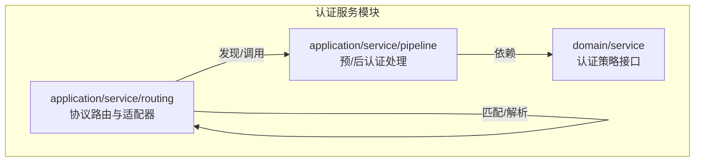
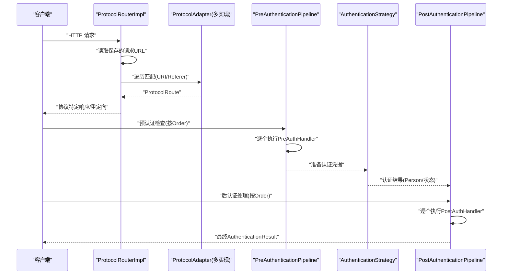
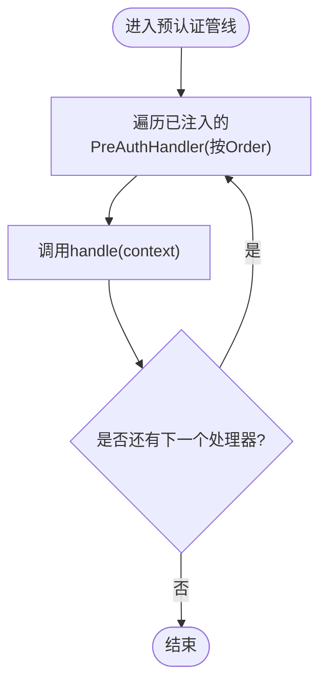
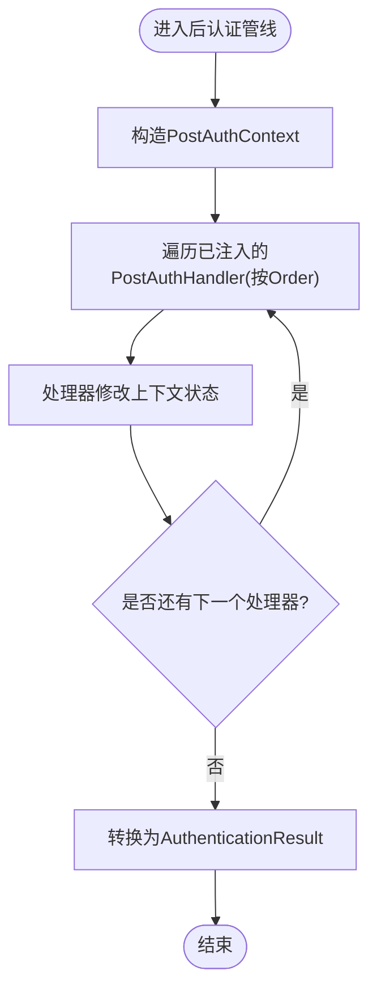
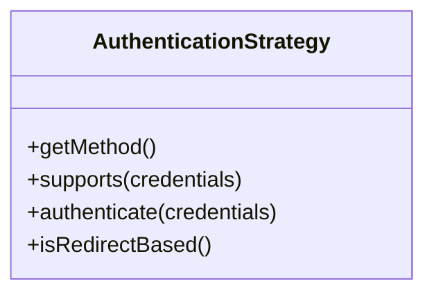
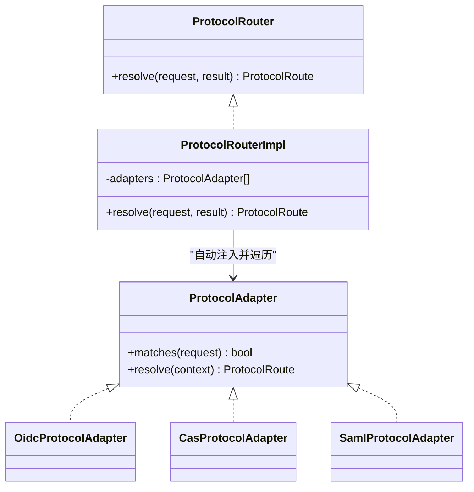
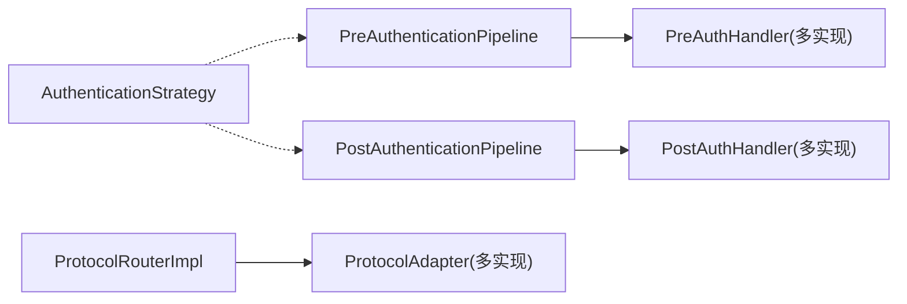

# 插件系统架构

<cite>
**本文引用的文件**
- [PreAuthHandler.java](file://iam-auth-server/src/main/java/iam/platform/auth/application/service/pipeline/PreAuthHandler.java)
- [PostAuthHandler.java](file://iam-auth-server/src/main/java/iam/platform/auth/application/service/pipeline/PostAuthHandler.java)
- [PreAuthenticationPipeline.java](file://iam-auth-server/src/main/java/iam/platform/auth/application/service/pipeline/PreAuthenticationPipeline.java)
- [PostAuthenticationPipeline.java](file://iam-auth-server/src/main/java/iam/platform/auth/application/service/pipeline/PostAuthenticationPipeline.java)
- [PreAuthContext.java](file://iam-auth-server/src/main/java/iam/platform/auth/application/service/pipeline/PreAuthContext.java)
- [PostAuthContext.java](file://iam-auth-server/src/main/java/iam/platform/auth/application/service/pipeline/PostAuthContext.java)
- [AuthenticationStrategy.java](file://iam-auth-server/src/main/java/iam/platform/auth/domain/service/AuthenticationStrategy.java)
- [ProtocolAdapter.java](file://iam-auth-server/src/main/java/iam/platform/auth/application/service/routing/ProtocolAdapter.java)
- [ProtocolRouter.java](file://iam-auth-server/src/main/java/iam/platform/auth/application/service/routing/ProtocolRouter.java)
- [ProtocolRouterImpl.java](file://iam-auth-server/src/main/java/iam/platform/auth/application/service/routing/ProtocolRouterImpl.java)
- [CasProtocolAdapter.java](file://iam-auth-server/src/main/java/iam/platform/auth/application/service/routing/CasProtocolAdapter.java)
- [OidcProtocolAdapter.java](file://iam-auth-server/src/main/java/iam/platform/auth/application/service/routing/OidcProtocolAdapter.java)
- [SamlProtocolAdapter.java](file://iam-auth-server/src/main/java/iam/platform/auth/application/service/routing/SamlProtocolAdapter.java)
- [ProtocolContext.java](file://iam-auth-server/src/main/java/iam/platform/auth/application/service/routing/ProtocolContext.java)
</cite>

## 目录
1. [引言](#引言)
2. [项目结构](#项目结构)
3. [核心组件](#核心组件)
4. [架构总览](#架构总览)
5. [详细组件分析](#详细组件分析)
6. [依赖分析](#依赖分析)
7. [性能考虑](#性能考虑)
8. [故障排查指南](#故障排查指南)
9. [结论](#结论)
10. [附录](#附录)

## 引言
本文件系统性阐述 IAM 平台的插件化架构设计，重点覆盖以下方面：
- 预认证与后认证处理管线（PreAuthHandler、PostAuthHandler）及其基于 Ordered 的优先级机制
- 协议适配器模式（ProtocolAdapter）如何统一支持 OIDC、SAML、CAS 等多协议路由
- 认证策略接口（AuthenticationStrategy）的扩展机制
- 插件注册、发现与加载的实现细节
- 插件开发最佳实践与注意事项

该设计以“接口+可插拔实现”的方式解耦认证流程中的不同阶段与协议差异，确保扩展性与可维护性。

## 项目结构
IAM 平台采用多模块架构，认证相关的核心代码集中在 iam-auth-server 模块中。插件系统主要分布在 application/service 下的 pipeline 与 routing 子包，分别承载“认证前/后处理”和“协议路由”。

图示来源
- [PreAuthenticationPipeline.java:1-61](file://iam-auth-server/src/main/java/iam/platform/auth/application/service/pipeline/PreAuthenticationPipeline.java#L1-L61)
- [PostAuthenticationPipeline.java:1-31](file://iam-auth-server/src/main/java/iam/platform/auth/application/service/pipeline/PostAuthenticationPipeline.java#L1-L31)
- [ProtocolRouterImpl.java:1-52](file://iam-auth-server/src/main/java/iam/platform/auth/application/service/routing/ProtocolRouterImpl.java#L1-L52)
- [AuthenticationStrategy.java:1-41](file://iam-auth-server/src/main/java/iam/platform/auth/domain/service/AuthenticationStrategy.java#L1-L41)

章节来源
- [PreAuthHandler.java:1-18](file://iam-auth-server/src/main/java/iam/platform/auth/application/service/pipeline/PreAuthHandler.java#L1-L18)
- [PostAuthHandler.java:1-12](file://iam-auth-server/src/main/java/iam/platform/auth/application/service/pipeline/PostAuthHandler.java#L1-L12)
- [PreAuthenticationPipeline.java:1-61](file://iam-auth-server/src/main/java/iam/platform/auth/application/service/pipeline/PreAuthenticationPipeline.java#L1-L61)
- [PostAuthenticationPipeline.java:1-31](file://iam-auth-server/src/main/java/iam/platform/auth/application/service/pipeline/PostAuthenticationPipeline.java#L1-L31)
- [ProtocolAdapter.java:1-20](file://iam-auth-server/src/main/java/iam/platform/auth/application/service/routing/ProtocolAdapter.java#L1-L20)
- [ProtocolRouter.java:1-19](file://iam-auth-server/src/main/java/iam/platform/auth/application/service/routing/ProtocolRouter.java#L1-L19)
- [ProtocolRouterImpl.java:1-52](file://iam-auth-server/src/main/java/iam/platform/auth/application/service/routing/ProtocolRouterImpl.java#L1-L52)
- [AuthenticationStrategy.java:1-41](file://iam-auth-server/src/main/java/iam/platform/auth/domain/service/AuthenticationStrategy.java#L1-L41)

## 核心组件
- 预认证处理接口与管线
  - PreAuthHandler：认证前检查的插件化扩展点，实现需同时实现 Ordered 接口以声明执行顺序
  - PreAuthenticationPipeline：自动注入所有 PreAuthHandler 实现，按顺序执行，并提供失败/成功记录能力
  - PreAuthContext：贯穿预认证管线的可变上下文，用于传递凭据、请求、客户端 IP、共享属性与标识键
- 后认证处理接口与管线
  - PostAuthHandler：认证完成后处理的插件化扩展点，同样实现 Ordered 接口
  - PostAuthenticationPipeline：自动注入所有 PostAuthHandler 实现，按顺序执行并最终生成不可变的 AuthenticationResult
  - PostAuthContext：贯穿后认证管线的可变上下文，承载用户、认证方式、租户选择、权限集合、结果令牌等
- 认证策略接口
  - AuthenticationStrategy：抽象具体认证方法（如密码、短信、LDAP 等），定义方法类型、凭据支持判断与认证执行
- 协议适配器与路由
  - ProtocolAdapter：协议适配器接口，定义请求匹配与路由解析
  - ProtocolRouter/ProtocolRouterImpl：根据保存的请求与认证结果选择合适的适配器，返回协议特定的路由
  - OIDC/CAS/SAML 适配器：针对各自协议的匹配规则与路由决策

章节来源
- [PreAuthHandler.java:1-18](file://iam-auth-server/src/main/java/iam/platform/auth/application/service/pipeline/PreAuthHandler.java#L1-L18)
- [PostAuthHandler.java:1-12](file://iam-auth-server/src/main/java/iam/platform/auth/application/service/pipeline/PostAuthHandler.java#L1-L12)
- [PreAuthenticationPipeline.java:1-61](file://iam-auth-server/src/main/java/iam/platform/auth/application/service/pipeline/PreAuthenticationPipeline.java#L1-L61)
- [PostAuthenticationPipeline.java:1-31](file://iam-auth-server/src/main/java/iam/platform/auth/application/service/pipeline/PostAuthenticationPipeline.java#L1-L31)
- [PreAuthContext.java:1-75](file://iam-auth-server/src/main/java/iam/platform/auth/application/service/pipeline/PreAuthContext.java#L1-L75)
- [PostAuthContext.java:1-71](file://iam-auth-server/src/main/java/iam/platform/auth/application/service/pipeline/PostAuthContext.java#L1-L71)
- [AuthenticationStrategy.java:1-41](file://iam-auth-server/src/main/java/iam/platform/auth/domain/service/AuthenticationStrategy.java#L1-L41)
- [ProtocolAdapter.java:1-20](file://iam-auth-server/src/main/java/iam/platform/auth/application/service/routing/ProtocolAdapter.java#L1-L20)
- [ProtocolRouter.java:1-19](file://iam-auth-server/src/main/java/iam/platform/auth/application/service/routing/ProtocolRouter.java#L1-L19)
- [ProtocolRouterImpl.java:1-52](file://iam-auth-server/src/main/java/iam/platform/auth/application/service/routing/ProtocolRouterImpl.java#L1-L52)
- [OidcProtocolAdapter.java:1-40](file://iam-auth-server/src/main/java/iam/platform/auth/application/service/routing/OidcProtocolAdapter.java#L1-L40)
- [CasProtocolAdapter.java:1-80](file://iam-auth-server/src/main/java/iam/platform/auth/application/service/routing/CasProtocolAdapter.java#L1-L80)
- [SamlProtocolAdapter.java:1-47](file://iam-auth-server/src/main/java/iam/platform/auth/application/service/routing/SamlProtocolAdapter.java#L1-L47)

## 架构总览
下图展示了从请求进入认证流程到协议路由输出的端到端交互，体现插件化扩展点与适配器模式的协作关系。

图示来源
- [ProtocolRouterImpl.java:24-50](file://iam-auth-server/src/main/java/iam/platform/auth/application/service/routing/ProtocolRouterImpl.java#L24-L50)
- [ProtocolAdapter.java:9-19](file://iam-auth-server/src/main/java/iam/platform/auth/application/service/routing/ProtocolAdapter.java#L9-L19)
- [PreAuthenticationPipeline.java:26-31](file://iam-auth-server/src/main/java/iam/platform/auth/application/service/pipeline/PreAuthenticationPipeline.java#L26-L31)
- [PostAuthenticationPipeline.java:22-29](file://iam-auth-server/src/main/java/iam/platform/auth/application/service/pipeline/PostAuthenticationPipeline.java#L22-L29)
- [AuthenticationStrategy.java:11-40](file://iam-auth-server/src/main/java/iam/platform/auth/domain/service/AuthenticationStrategy.java#L11-L40)

## 详细组件分析

### 预认证处理管线（PreAuthHandler 与 PreAuthenticationPipeline）
- 设计要点
  - PreAuthHandler 扩展点：每个预认证步骤（如 IP 白名单、凭证校验、租户解析、限流/锁账号等）实现该接口
  - 有序执行：通过实现 Ordered 接口控制执行顺序；Pipeline 按顺序遍历并调用
  - 失败/成功记录：Pipeline 提供专门方法，将失败或成功事件分发给需要的处理器（如限流、锁账号）
  - 上下文 PreAuthContext：携带凭据、请求、客户端 IP、共享属性与标识键，便于跨处理器共享数据
- 生命周期
  - 入口：由认证入口在实际认证策略执行前调用
  - 中间：按序执行各处理器，任一处理器可抛出预认证异常中断流程
  - 结束：全部通过后进入认证策略执行阶段

图示来源
- [PreAuthenticationPipeline.java:26-31](file://iam-auth-server/src/main/java/iam/platform/auth/application/service/pipeline/PreAuthenticationPipeline.java#L26-L31)
- [PreAuthHandler.java:9-16](file://iam-auth-server/src/main/java/iam/platform/auth/application/service/pipeline/PreAuthHandler.java#L9-L16)
- [PreAuthContext.java:14-25](file://iam-auth-server/src/main/java/iam/platform/auth/application/service/pipeline/PreAuthContext.java#L14-L25)

章节来源
- [PreAuthHandler.java:1-18](file://iam-auth-server/src/main/java/iam/platform/auth/application/service/pipeline/PreAuthHandler.java#L1-L18)
- [PreAuthenticationPipeline.java:1-61](file://iam-auth-server/src/main/java/iam/platform/auth/application/service/pipeline/PreAuthenticationPipeline.java#L1-L61)
- [PreAuthContext.java:1-75](file://iam-auth-server/src/main/java/iam/platform/auth/application/service/pipeline/PreAuthContext.java#L1-L75)

### 后认证处理管线（PostAuthHandler 与 PostAuthenticationPipeline）
- 设计要点
  - PostAuthHandler 扩展点：负责认证完成后的后续处理（如审计、登录记录、权限加载、租户选择、安全上下文建立等）
  - 有序执行：同样基于 Ordered 接口保证执行顺序
  - 上下文 PostAuthContext：在各处理器间累积状态（如选中的租户账户、可用租户列表、权限集合、是否需要租户选择、最终认证令牌等）
  - 结果生成：Pipeline 将上下文转换为不可变的 AuthenticationResult 返回
- 生命周期
  - 入口：认证策略返回 Person 后进入
  - 中间：按序执行各处理器，逐步构建最终结果
  - 结束：生成 AuthenticationResult 并返回

图示来源
- [PostAuthenticationPipeline.java:22-29](file://iam-auth-server/src/main/java/iam/platform/auth/application/service/pipeline/PostAuthenticationPipeline.java#L22-L29)
- [PostAuthHandler.java:9-10](file://iam-auth-server/src/main/java/iam/platform/auth/application/service/pipeline/PostAuthHandler.java#L9-L10)
- [PostAuthContext.java:20-35](file://iam-auth-server/src/main/java/iam/platform/auth/application/service/pipeline/PostAuthContext.java#L20-L35)

章节来源
- [PostAuthHandler.java:1-12](file://iam-auth-server/src/main/java/iam/platform/auth/application/service/pipeline/PostAuthHandler.java#L1-L12)
- [PostAuthenticationPipeline.java:1-31](file://iam-auth-server/src/main/java/iam/platform/auth/application/service/pipeline/PostAuthenticationPipeline.java#L1-L31)
- [PostAuthContext.java:1-71](file://iam-auth-server/src/main/java/iam/platform/auth/application/service/pipeline/PostAuthContext.java#L1-L71)

### 认证策略接口（AuthenticationStrategy）
- 设计要点
  - 方法类型：getMethod() 明确该策略处理的认证方式
  - 凭据支持：supports() 判断凭据类型是否受支持
  - 认证执行：authenticate() 完成凭据验证并返回解析后的 Person
  - 外部重定向：isRedirectBased() 标识是否涉及外部重定向（如 OAuth2 提供商）
- 扩展机制
  - 新增认证方式时，新增一个实现类并通过 Spring 自动发现
  - 与预/后认证管线配合，形成完整的认证链路

图示来源
- [AuthenticationStrategy.java:11-40](file://iam-auth-server/src/main/java/iam/platform/auth/domain/service/AuthenticationStrategy.java#L11-L40)

章节来源
- [AuthenticationStrategy.java:1-41](file://iam-auth-server/src/main/java/iam/platform/auth/domain/service/AuthenticationStrategy.java#L1-L41)

### 协议适配器模式（ProtocolAdapter 与路由）
- 设计要点
  - ProtocolAdapter：定义 matches() 与 resolve()，用于识别当前请求所属协议并生成协议特定路由
  - ProtocolRouter/ProtocolRouterImpl：读取保存的请求 URL，结合 AuthenticationResult 决定目标协议
  - 适配器实现：OIDC、CAS、SAML 分别实现自身匹配逻辑与路由决策
- 生命周期
  - 入口：认证完成后，ProtocolRouterImpl 根据保存请求与结果进行路由
  - 匹配：遍历已注入的 ProtocolAdapter，调用 matches() 进行判定
  - 解析：匹配成功后调用 resolve() 生成 ProtocolRoute
  - 默认：若无匹配则回退到默认重定向

图示来源
- [ProtocolAdapter.java:9-19](file://iam-auth-server/src/main/java/iam/platform/auth/application/service/routing/ProtocolAdapter.java#L9-L19)
- [ProtocolRouter.java:9-18](file://iam-auth-server/src/main/java/iam/platform/auth/application/service/routing/ProtocolRouter.java#L9-L18)
- [ProtocolRouterImpl.java:22-50](file://iam-auth-server/src/main/java/iam/platform/auth/application/service/routing/ProtocolRouterImpl.java#L22-L50)
- [OidcProtocolAdapter.java:12-39](file://iam-auth-server/src/main/java/iam/platform/auth/application/service/routing/OidcProtocolAdapter.java#L12-L39)
- [CasProtocolAdapter.java:17-50](file://iam-auth-server/src/main/java/iam/platform/auth/application/service/routing/CasProtocolAdapter.java#L17-L50)
- [SamlProtocolAdapter.java:15-46](file://iam-auth-server/src/main/java/iam/platform/auth/application/service/routing/SamlProtocolAdapter.java#L15-L46)

章节来源
- [ProtocolAdapter.java:1-20](file://iam-auth-server/src/main/java/iam/platform/auth/application/service/routing/ProtocolAdapter.java#L1-L20)
- [ProtocolRouter.java:1-19](file://iam-auth-server/src/main/java/iam/platform/auth/application/service/routing/ProtocolRouter.java#L1-L19)
- [ProtocolRouterImpl.java:1-52](file://iam-auth-server/src/main/java/iam/platform/auth/application/service/routing/ProtocolRouterImpl.java#L1-L52)
- [OidcProtocolAdapter.java:1-40](file://iam-auth-server/src/main/java/iam/platform/auth/application/service/routing/OidcProtocolAdapter.java#L1-L40)
- [CasProtocolAdapter.java:1-80](file://iam-auth-server/src/main/java/iam/platform/auth/application/service/routing/CasProtocolAdapter.java#L1-L80)
- [SamlProtocolAdapter.java:1-47](file://iam-auth-server/src/main/java/iam/platform/auth/application/service/routing/SamlProtocolAdapter.java#L1-L47)
- [ProtocolContext.java:1-21](file://iam-auth-server/src/main/java/iam/platform/auth/application/service/routing/ProtocolContext.java#L1-L21)

### 插件注册、发现与加载
- Spring 自动发现
  - PreAuthHandler/PostAuthHandler：通过接口注入到 Pipeline；Spring 自动收集实现并按 Order 排序
  - ProtocolAdapter：通过接口注入到 ProtocolRouterImpl；Spring 自动收集实现并遍历匹配
- 优先级机制（Ordered）
  - PreAuthHandler/PostAuthHandler 实现需实现 Ordered 接口以声明执行顺序
  - Pipeline 在执行前会按顺序遍历处理器，确保先执行高优先级再执行低优先级
- 加载时机
  - 预认证：在实际认证策略执行前
  - 后认证：在认证策略返回 Person 后
  - 协议路由：在认证完成后，根据保存请求与结果进行路由

章节来源
- [PreAuthenticationPipeline.java:18-31](file://iam-auth-server/src/main/java/iam/platform/auth/application/service/pipeline/PreAuthenticationPipeline.java#L18-L31)
- [PostAuthenticationPipeline.java:20-29](file://iam-auth-server/src/main/java/iam/platform/auth/application/service/pipeline/PostAuthenticationPipeline.java#L20-L29)
- [ProtocolRouterImpl.java:22-50](file://iam-auth-server/src/main/java/iam/platform/auth/application/service/routing/ProtocolRouterImpl.java#L22-L50)
- [PreAuthHandler.java:9-16](file://iam-auth-server/src/main/java/iam/platform/auth/application/service/pipeline/PreAuthHandler.java#L9-L16)
- [PostAuthHandler.java:9-10](file://iam-auth-server/src/main/java/iam/platform/auth/application/service/pipeline/PostAuthHandler.java#L9-L10)

## 依赖分析
- 组件内聚与耦合
  - PreAuthenticationPipeline 与 PostAuthenticationPipeline 对处理器实现保持低耦合，仅依赖接口
  - ProtocolRouterImpl 与 ProtocolAdapter 之间为“轮询匹配”，避免集中式分支
  - AuthenticationStrategy 与 Pipeline 解耦，通过方法类型与凭据支持进行协作
- 外部依赖
  - Spring Ordered：用于声明执行顺序
  - Spring DI：自动注入处理器与适配器实现
- 循环依赖风险
  - 当前结构未见循环依赖迹象；若自定义处理器内部再次触发认证流程，需谨慎避免递归

图示来源
- [PreAuthenticationPipeline.java:18-31](file://iam-auth-server/src/main/java/iam/platform/auth/application/service/pipeline/PreAuthenticationPipeline.java#L18-L31)
- [PostAuthenticationPipeline.java:20-29](file://iam-auth-server/src/main/java/iam/platform/auth/application/service/pipeline/PostAuthenticationPipeline.java#L20-L29)
- [ProtocolRouterImpl.java:22-50](file://iam-auth-server/src/main/java/iam/platform/auth/application/service/routing/ProtocolRouterImpl.java#L22-L50)

章节来源
- [PreAuthenticationPipeline.java:1-61](file://iam-auth-server/src/main/java/iam/platform/auth/application/service/pipeline/PreAuthenticationPipeline.java#L1-L61)
- [PostAuthenticationPipeline.java:1-31](file://iam-auth-server/src/main/java/iam/platform/auth/application/service/pipeline/PostAuthenticationPipeline.java#L1-L31)
- [ProtocolRouterImpl.java:1-52](file://iam-auth-server/src/main/java/iam/platform/auth/application/service/routing/ProtocolRouterImpl.java#L1-L52)

## 性能考虑
- 处理器数量与顺序
  - 预/后认证处理器越多，整体延迟越高；应合理拆分职责并利用 Ordered 控制关键路径前置
- 匹配复杂度
  - ProtocolAdapter 的匹配逻辑应尽量轻量（如基于 URI 片段或简单头信息），避免昂贵计算
- 缓存与去重
  - 可在处理器中引入缓存（如速率限制、账户状态）减少重复查询
- 异步与并发
  - 若存在耗时操作（如远程校验），建议异步化并设置超时与熔断

## 故障排查指南
- 预认证失败
  - 检查 PreAuthHandler 的实现是否正确设置 PreAuthContext 的标识键与共享属性
  - 关注 PreAuthenticationPipeline 的失败/成功记录方法是否被正确调用
- 后认证结果异常
  - 检查 PostAuthHandler 是否正确更新 PostAuthContext 的字段（如租户选择、权限集合）
  - 确认最终转换为 AuthenticationResult 的字段是否完整
- 协议路由错误
  - 检查 ProtocolAdapter 的 matches() 逻辑是否覆盖了正确的请求路径
  - 确认 ProtocolRouterImpl 能正确读取保存的请求 URL 并选择适配器
- 优先级问题
  - 若处理器执行顺序不符合预期，检查实现类的 Ordered 值是否正确设置

章节来源
- [PreAuthenticationPipeline.java:36-59](file://iam-auth-server/src/main/java/iam/platform/auth/application/service/pipeline/PreAuthenticationPipeline.java#L36-L59)
- [PostAuthenticationPipeline.java:22-29](file://iam-auth-server/src/main/java/iam/platform/auth/application/service/pipeline/PostAuthenticationPipeline.java#L22-L29)
- [ProtocolRouterImpl.java:24-50](file://iam-auth-server/src/main/java/iam/platform/auth/application/service/routing/ProtocolRouterImpl.java#L24-L50)

## 结论
IAM 平台的插件系统通过“接口 + Spring 自动发现 + Ordered 优先级”的组合，实现了高度可扩展的认证与路由能力。预/后认证管线与协议适配器模式分别覆盖了认证流程的“前置检查/后置处理”和“多协议适配”，配合认证策略接口，形成了清晰、稳定且易于演进的架构。遵循本文的最佳实践与注意事项，可有效提升插件开发效率与系统稳定性。

## 附录
- 开发最佳实践
  - 明确职责边界：每个处理器只做一件事，避免过度耦合
  - 正确使用上下文：PreAuthContext/PostAuthContext 作为数据载体，避免硬编码
  - 合理设置优先级：关键处理器（如限流、审计）置于高优先级
  - 单元测试：为每个处理器编写独立测试，覆盖正常与异常路径
  - 文档与注释：为新插件补充必要的接口文档与行为说明
- 注意事项
  - 避免在处理器中直接发起新的认证请求，防止递归与死循环
  - 匹配逻辑应尽量简洁，避免正则或昂贵 IO
  - 对外暴露的路由与参数需严格校验，防止注入与越权