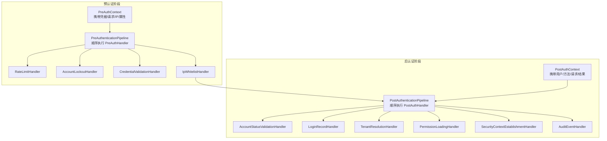
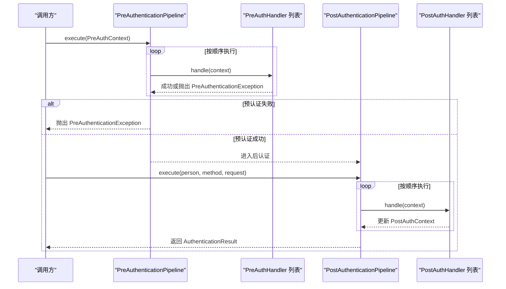
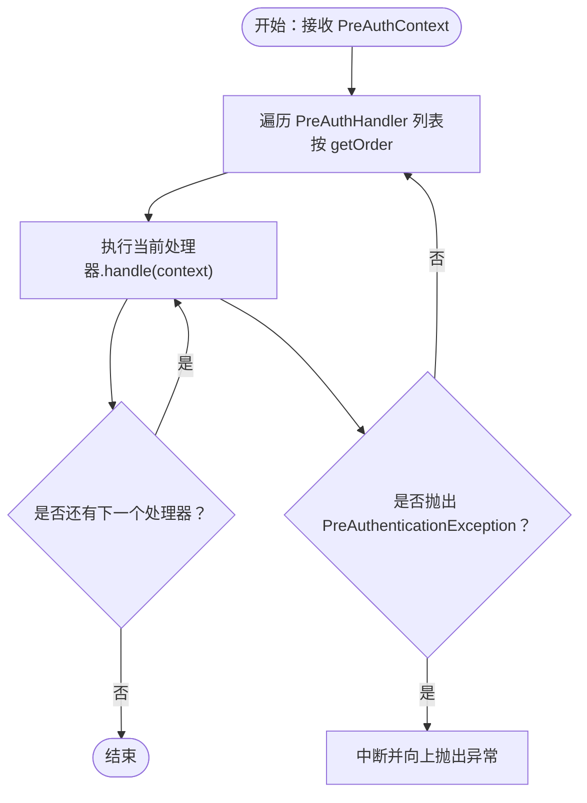
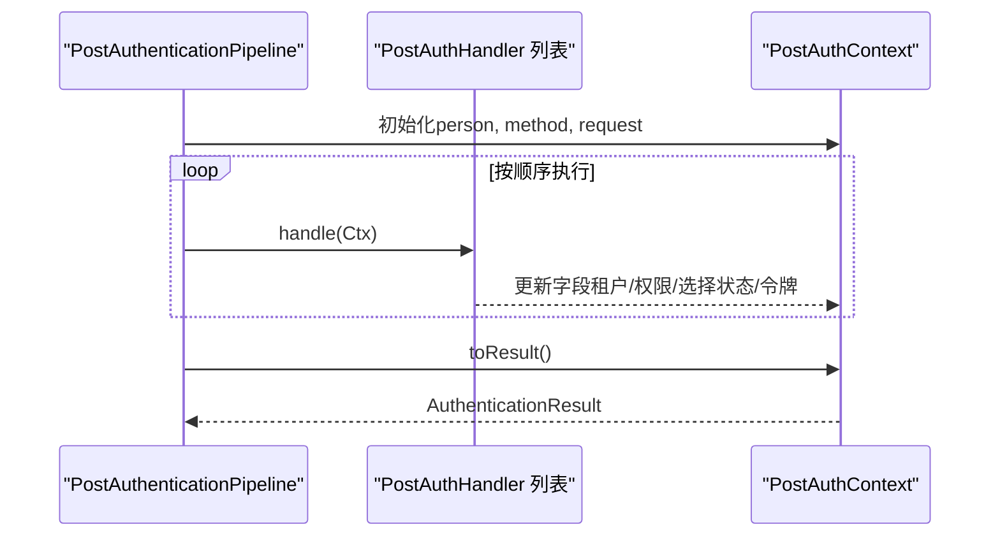
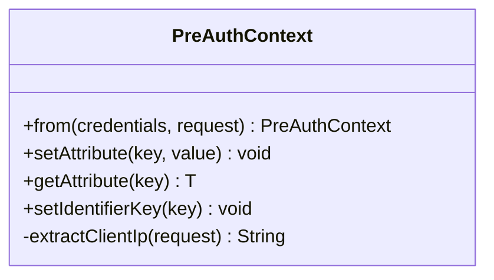
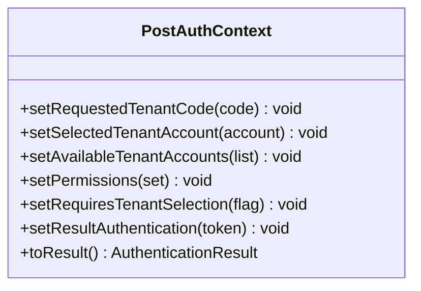
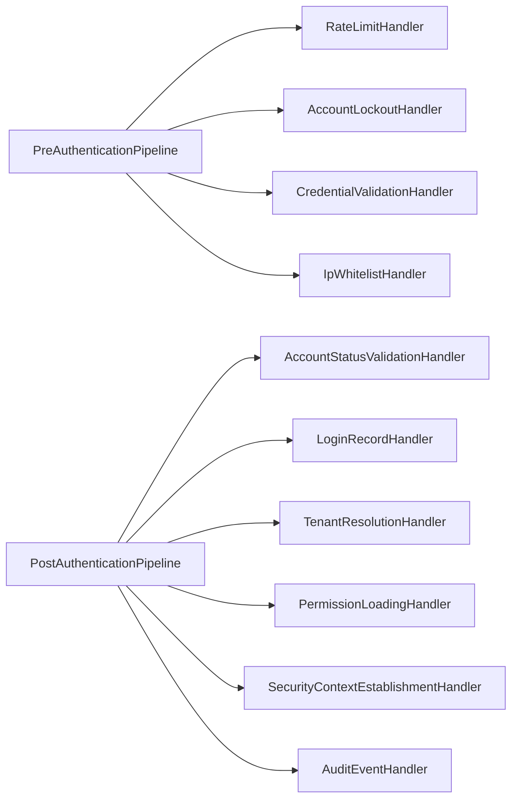

# 管道处理器扩展

<cite>
**本文引用的文件**
- [PreAuthHandler.java](file://iam-auth-server/src/main/java/iam/platform/auth/application/service/pipeline/PreAuthHandler.java)
- [PostAuthHandler.java](file://iam-auth-server/src/main/java/iam/platform/auth/application/service/pipeline/PostAuthHandler.java)
- [PreAuthContext.java](file://iam-auth-server/src/main/java/iam/platform/auth/application/service/pipeline/PreAuthContext.java)
- [PostAuthContext.java](file://iam-auth-server/src/main/java/iam/platform/auth/application/service/pipeline/PostAuthContext.java)
- [PreAuthenticationPipeline.java](file://iam-auth-server/src/main/java/iam/platform/auth/application/service/pipeline/PreAuthenticationPipeline.java)
- [PostAuthenticationPipeline.java](file://iam-auth-server/src/main/java/iam/platform/auth/application/service/pipeline/PostAuthenticationPipeline.java)
- [IpWhitelistHandler.java](file://iam-auth-server/src/main/java/iam/platform/auth/application/service/pipeline/IpWhitelistHandler.java)
- [RateLimitHandler.java](file://iam-auth-server/src/main/java/iam/platform/auth/application/service/pipeline/RateLimitHandler.java)
- [AccountLockoutHandler.java](file://iam-auth-server/src/main/java/iam/platform/auth/application/service/pipeline/AccountLockoutHandler.java)
- [CredentialValidationHandler.java](file://iam-auth-server/src/main/java/iam/platform/auth/application/service/pipeline/CredentialValidationHandler.java)
- [TenantResolutionHandler.java](file://iam-auth-server/src/main/java/iam/platform/auth/application/service/pipeline/TenantResolutionHandler.java)
- [SecurityContextEstablishmentHandler.java](file://iam-auth-server/src/main/java/iam/platform/auth/application/service/pipeline/SecurityContextEstablishmentHandler.java)
- [PermissionLoadingHandler.java](file://iam-auth-server/src/main/java/iam/platform/auth/application/service/pipeline/PermissionLoadingHandler.java)
- [LoginRecordHandler.java](file://iam-auth-server/src/main/java/iam/platform/auth/application/service/pipeline/LoginRecordHandler.java)
- [AuditEventHandler.java](file://iam-auth-server/src/main/java/iam/platform/auth/application/service/pipeline/AuditEventHandler.java)
- [AccountStatusValidationHandler.java](file://iam-auth-server/src/main/java/iam/platform/auth/application/service/pipeline/AccountStatusValidationHandler.java)
- [PreAuthenticationException.java](file://iam-auth-server/src/main/java/iam/platform/auth/application/service/pipeline/PreAuthenticationException.java)
</cite>

## 目录
1. [简介](#简介)
2. [项目结构](#项目结构)
3. [核心组件](#核心组件)
4. [架构总览](#架构总览)
5. [详细组件分析](#详细组件分析)
6. [依赖分析](#依赖分析)
7. [性能考虑](#性能考虑)
8. [故障排查指南](#故障排查指南)
9. [结论](#结论)
10. [附录：开发与测试指南](#附录开发与测试指南)

## 简介
本文件面向需要扩展 IAM 平台认证管道的开发者，系统性阐述“预认证管道”和“后认证管道”的设计与实现，覆盖以下主题：
- 预认证与后认证的职责边界与执行顺序
- PreAuthHandler 与 PostAuthHandler 接口的实现规范
- PreAuthContext 与 PostAuthContext 的上下文传递机制
- 异常处理与失败记录（含限流与账户锁定）
- 可扩展功能示例：IP 白名单、速率限制、账户锁定、权限加载、租户解析、安全上下文建立、审计事件、登录记录
- 配置管理与动态加载（基于 Spring Ordered 与自动发现）
- 性能优化、监控与调试建议
- 完整的开发与测试策略

## 项目结构
IAM 认证服务器中的管道处理器位于应用层服务包内，按“预认证”和“后认证”两条流水线组织，分别在实际认证前与认证完成后执行一系列可插拔的处理器。

图表来源
- [PreAuthenticationPipeline.java:1-61](file://iam-auth-server/src/main/java/iam/platform/auth/application/service/pipeline/PreAuthenticationPipeline.java#L1-L61)
- [PostAuthenticationPipeline.java:1-31](file://iam-auth-server/src/main/java/iam/platform/auth/application/service/pipeline/PostAuthenticationPipeline.java#L1-L31)
- [PreAuthContext.java:1-75](file://iam-auth-server/src/main/java/iam/platform/auth/application/service/pipeline/PreAuthContext.java#L1-L75)
- [PostAuthContext.java:1-71](file://iam-auth-server/src/main/java/iam/platform/auth/application/service/pipeline/PostAuthContext.java#L1-L71)

章节来源
- [PreAuthHandler.java:1-18](file://iam-auth-server/src/main/java/iam/platform/auth/application/service/pipeline/PreAuthHandler.java#L1-L18)
- [PostAuthHandler.java:1-12](file://iam-auth-server/src/main/java/iam/platform/auth/application/service/pipeline/PostAuthHandler.java#L1-L12)
- [PreAuthContext.java:1-75](file://iam-auth-server/src/main/java/iam/platform/auth/application/service/pipeline/PreAuthContext.java#L1-L75)
- [PostAuthContext.java:1-71](file://iam-auth-server/src/main/java/iam/platform/auth/application/service/pipeline/PostAuthContext.java#L1-L71)

## 核心组件
- 预认证处理器接口：PreAuthHandler
  - 职责：在真实认证策略执行前进行前置校验（如限流、锁定、凭据格式校验、IP 白名单等）
  - 关键点：实现 Ordered 以定义执行顺序；handle(PreAuthContext) 抛出 PreAuthenticationException 即中止流程
- 后认证处理器接口：PostAuthHandler
  - 职责：在认证完成后构建最终结果（状态校验、租户解析、权限加载、安全上下文建立、审计、登录记录等）
  - 关键点：handle(PostAuthContext) 通过上下文累积结果；最终由 PostAuthContext.toResult() 生成不可变结果对象
- 上下文对象：
  - PreAuthContext：携带 AuthenticationCredentials、HttpServletRequest、客户端 IP、可扩展属性、identifierKey（用于限流/锁定标识）
  - PostAuthContext：携带 Person、认证方式、请求、目标租户选择状态、可用租户列表、权限集合、最终认证令牌等

章节来源
- [PreAuthHandler.java:1-18](file://iam-auth-server/src/main/java/iam/platform/auth/application/service/pipeline/PreAuthHandler.java#L1-L18)
- [PostAuthHandler.java:1-12](file://iam-auth-server/src/main/java/iam/platform/auth/application/service/pipeline/PostAuthHandler.java#L1-L12)
- [PreAuthContext.java:1-75](file://iam-auth-server/src/main/java/iam/platform/auth/application/service/pipeline/PreAuthContext.java#L1-L75)
- [PostAuthContext.java:1-71](file://iam-auth-server/src/main/java/iam/platform/auth/application/service/pipeline/PostAuthContext.java#L1-L71)

## 架构总览
预认证与后认证两条流水线通过 Spring 自动发现处理器 Bean 并按 getOrder() 顺序执行。预认证失败会抛出 PreAuthenticationException 中断流程；成功则进入后认证流水线，逐步构建 AuthenticationResult。

图表来源
- [PreAuthenticationPipeline.java:26-31](file://iam-auth-server/src/main/java/iam/platform/auth/application/service/pipeline/PreAuthenticationPipeline.java#L26-L31)
- [PostAuthenticationPipeline.java:22-29](file://iam-auth-server/src/main/java/iam/platform/auth/application/service/pipeline/PostAuthenticationPipeline.java#L22-L29)

## 详细组件分析

### 预认证流水线（PreAuthenticationPipeline）
- 执行顺序：按处理器 getOrder() 升序执行
- 失败记录与成功记录：提供 recordFailure()/recordSuccess() 方法，内部通过类型判断调用对应处理器的记录方法（如 RateLimitHandler、AccountLockoutHandler）
- 典型处理器职责：
  - RateLimitHandler：基于 Redis 的限流检查
  - AccountLockoutHandler：账户锁定检查与计数记录
  - CredentialValidationHandler：凭据格式校验并设置 identifierKey
  - IpWhitelistHandler：IP 黑/白名单检查

图表来源
- [PreAuthenticationPipeline.java:26-31](file://iam-auth-server/src/main/java/iam/platform/auth/application/service/pipeline/PreAuthenticationPipeline.java#L26-L31)

章节来源
- [PreAuthenticationPipeline.java:1-61](file://iam-auth-server/src/main/java/iam/platform/auth/application/service/pipeline/PreAuthenticationPipeline.java#L1-L61)

### 后认证流水线（PostAuthenticationPipeline）
- 输入：Person、AuthenticationMethod、HttpServletRequest
- 输出：AuthenticationResult（由 PostAuthContext.toResult() 生成）
- 典型处理器职责：
  - AccountStatusValidationHandler：校验用户/账户状态
  - LoginRecordHandler：记录最近登录时间
  - TenantResolutionHandler：解析目标租户账号（自动选择或需用户选择）
  - PermissionLoadingHandler：加载权限集合
  - SecurityContextEstablishmentHandler：建立安全上下文与租户上下文
  - AuditEventHandler：发布审计事件（预留）

图表来源
- [PostAuthenticationPipeline.java:22-29](file://iam-auth-server/src/main/java/iam/platform/auth/application/service/pipeline/PostAuthenticationPipeline.java#L22-L29)
- [PostAuthContext.java:64-69](file://iam-auth-server/src/main/java/iam/platform/auth/application/service/pipeline/PostAuthContext.java#L64-L69)

章节来源
- [PostAuthenticationPipeline.java:1-31](file://iam-auth-server/src/main/java/iam/platform/auth/application/service/pipeline/PostAuthenticationPipeline.java#L1-L31)
- [PostAuthContext.java:1-71](file://iam-auth-server/src/main/java/iam/platform/auth/application/service/pipeline/PostAuthContext.java#L1-L71)

### 上下文对象详解

#### PreAuthContext
- 关键字段：credentials、request、clientIp、attributes、identifierKey
- 工具方法：setAttribute/getAttribute、setIdentifierKey、from(...) 工厂方法
- IP 提取：优先 X-Forwarded-For（取首个），其次 X-Real-IP，最后 request.getRemoteAddr()

图表来源
- [PreAuthContext.java:30-33](file://iam-auth-server/src/main/java/iam/platform/auth/application/service/pipeline/PreAuthContext.java#L30-L33)
- [PreAuthContext.java:38-48](file://iam-auth-server/src/main/java/iam/platform/auth/application/service/pipeline/PreAuthContext.java#L38-L48)
- [PreAuthContext.java:53-55](file://iam-auth-server/src/main/java/iam/platform/auth/application/service/pipeline/PreAuthContext.java#L53-L55)
- [PreAuthContext.java:60-73](file://iam-auth-server/src/main/java/iam/platform/auth/application/service/pipeline/PreAuthContext.java#L60-L73)

章节来源
- [PreAuthContext.java:1-75](file://iam-auth-server/src/main/java/iam/platform/auth/application/service/pipeline/PreAuthContext.java#L1-L75)

#### PostAuthContext
- 关键字段：person、method、request、requestedTenantCode、selectedTenantAccount、availableTenantAccounts、permissions、requiresTenantSelection、resultAuthentication
- 工具方法：setter、toResult() 生成不可变 AuthenticationResult

图表来源
- [PostAuthContext.java:37-59](file://iam-auth-server/src/main/java/iam/platform/auth/application/service/pipeline/PostAuthContext.java#L37-L59)
- [PostAuthContext.java:64-69](file://iam-auth-server/src/main/java/iam/platform/auth/application/service/pipeline/PostAuthContext.java#L64-L69)

章节来源
- [PostAuthContext.java:1-71](file://iam-auth-server/src/main/java/iam/platform/auth/application/service/pipeline/PostAuthContext.java#L1-L71)

### 处理器实现规范与示例

#### 实现 PreAuthHandler 的要求
- 必须实现 handle(PreAuthContext) 与 getOrder()
- 在 handle 中完成校验逻辑，失败时抛出 PreAuthenticationException
- 可通过 context.setIdentifierKey(...) 设置限流/锁定的标识键
- 可通过 context.setAttribute/getAttribute 在处理器间共享数据

章节来源
- [PreAuthHandler.java:9-16](file://iam-auth-server/src/main/java/iam/platform/auth/application/service/pipeline/PreAuthHandler.java#L9-L16)
- [PreAuthContext.java:38-48](file://iam-auth-server/src/main/java/iam/platform/auth/application/service/pipeline/PreAuthContext.java#L38-L48)
- [PreAuthContext.java:53-55](file://iam-auth-server/src/main/java/iam/platform/auth/application/service/pipeline/PreAuthContext.java#L53-L55)

#### 实现 PostAuthHandler 的要求
- 必须实现 handle(PostAuthContext) 与 getOrder()
- 在 handle 中读取/更新 PostAuthContext 字段，逐步构建最终结果
- 最终由 PostAuthContext.toResult() 生成不可变结果

章节来源
- [PostAuthHandler.java:9-11](file://iam-auth-server/src/main/java/iam/platform/auth/application/service/pipeline/PostAuthHandler.java#L9-L11)
- [PostAuthContext.java:64-69](file://iam-auth-server/src/main/java/iam/platform/auth/application/service/pipeline/PostAuthContext.java#L64-L69)

#### 典型处理器实现要点

- 限流处理器（RateLimitHandler）
  - 依赖 RedisBasedRateLimiter，负责检查与记录成功/失败
  - getOrder() 建议较低值（先于其他处理器），以便尽早阻断

- 账户锁定处理器（AccountLockoutHandler）
  - 依赖 AccountLockoutManager，负责检查锁定与记录
  - 与限流配合，共同抵御暴力破解

- 凭据校验处理器（CredentialValidationHandler）
  - 根据不同凭据类型校验必填项与格式
  - 为后续限流/锁定设置 identifierKey

- IP 白名单处理器（IpWhitelistHandler）
  - 支持黑名单优先、白名单可选，支持 CIDR
  - 未配置时不生效

- 租户解析处理器（TenantResolutionHandler）
  - 从请求头或参数提取租户编码，委托策略解析
  - 结果可能自动选择或要求用户选择

- 权限加载处理器（PermissionLoadingHandler）
  - 仅在已选择租户账户后加载权限
  - 未选择时清空权限集合

- 安全上下文建立处理器（SecurityContextEstablishmentHandler）
  - 构建 TenantAwareAuthenticationToken 并注册到 SecurityContext
  - 同步设置 TenantContext，并将租户信息写入 Session

- 登录记录处理器（LoginRecordHandler）
  - 记录最近登录时间并持久化

- 审计事件处理器（AuditEventHandler）
  - 当前为占位，未来集成审计系统

章节来源
- [RateLimitHandler.java:1-42](file://iam-auth-server/src/main/java/iam/platform/auth/application/service/pipeline/RateLimitHandler.java#L1-L42)
- [AccountLockoutHandler.java:1-42](file://iam-auth-server/src/main/java/iam/platform/auth/application/service/pipeline/AccountLockoutHandler.java#L1-L42)
- [CredentialValidationHandler.java:1-97](file://iam-auth-server/src/main/java/iam/platform/auth/application/service/pipeline/CredentialValidationHandler.java#L1-L97)
- [IpWhitelistHandler.java:1-107](file://iam-auth-server/src/main/java/iam/platform/auth/application/service/pipeline/IpWhitelistHandler.java#L1-L107)
- [TenantResolutionHandler.java:1-66](file://iam-auth-server/src/main/java/iam/platform/auth/application/service/pipeline/TenantResolutionHandler.java#L1-L66)
- [PermissionLoadingHandler.java:1-40](file://iam-auth-server/src/main/java/iam/platform/auth/application/service/pipeline/PermissionLoadingHandler.java#L1-L40)
- [SecurityContextEstablishmentHandler.java:1-86](file://iam-auth-server/src/main/java/iam/platform/auth/application/service/pipeline/SecurityContextEstablishmentHandler.java#L1-L86)
- [LoginRecordHandler.java:1-29](file://iam-auth-server/src/main/java/iam/platform/auth/application/service/pipeline/LoginRecordHandler.java#L1-L29)
- [AuditEventHandler.java:1-42](file://iam-auth-server/src/main/java/iam/platform/auth/application/service/pipeline/AuditEventHandler.java#L1-L42)

## 依赖分析
- 处理器通过 Spring 自动注入 List<PreAuthHandler>/List<PostAuthHandler>，执行顺序由 getOrder() 决定
- 预认证失败路径：PreAuthenticationPipeline 捕获异常并向上抛出 PreAuthenticationException
- 失败/成功记录：PreAuthenticationPipeline 对特定处理器类型进行分支调用（限流/锁定）

图表来源
- [PreAuthenticationPipeline.java:36-59](file://iam-auth-server/src/main/java/iam/platform/auth/application/service/pipeline/PreAuthenticationPipeline.java#L36-L59)
- [PostAuthenticationPipeline.java:20-29](file://iam-auth-server/src/main/java/iam/platform/auth/application/service/pipeline/PostAuthenticationPipeline.java#L20-L29)

章节来源
- [PreAuthenticationPipeline.java:1-61](file://iam-auth-server/src/main/java/iam/platform/auth/application/service/pipeline/PreAuthenticationPipeline.java#L1-L61)
- [PostAuthenticationPipeline.java:1-31](file://iam-auth-server/src/main/java/iam/platform/auth/application/service/pipeline/PostAuthenticationPipeline.java#L1-L31)

## 性能考虑
- 处理器顺序优化
  - 将高成本但易短路的处理器（如限流、IP 白名单）置于靠前位置，减少后续处理器开销
  - 将低延迟处理器（如凭据格式校验）置于更前位置，快速失败
- 缓存与外部依赖
  - 限流与锁定依赖 Redis，确保连接池与超时合理配置
  - 权限加载与租户解析涉及数据库查询，建议结合缓存与批量加载
- 日志与监控
  - 使用结构化日志记录关键指标（耗时、命中率、失败原因）
  - 对每个处理器增加独立的监控埋点（如 Micrometer 指标）
- 并发与线程安全
  - 上下文对象为单次请求生命周期内的可变对象，避免跨线程共享
  - 安全上下文建立与会话写入应保证幂等

## 故障排查指南
- 预认证失败
  - 现象：抛出 PreAuthenticationException
  - 排查：确认处理器顺序与异常抛出点；查看 PreAuthenticationPipeline 的执行日志
  - 相关文件
    - [PreAuthenticationException.java:1-18](file://iam-auth-server/src/main/java/iam/platform/auth/application/service/pipeline/PreAuthenticationException.java#L1-L18)
    - [PreAuthenticationPipeline.java:26-31](file://iam-auth-server/src/main/java/iam/platform/auth/application/service/pipeline/PreAuthenticationPipeline.java#L26-L31)
- 限流/锁定误判
  - 现象：频繁被限流或锁定
  - 排查：核对 identifierKey 设置、Redis 计数器、策略阈值
  - 相关文件
    - [RateLimitHandler.java:18-21](file://iam-auth-server/src/main/java/iam/platform/auth/application/service/pipeline/RateLimitHandler.java#L18-L21)
    - [AccountLockoutHandler.java:18-21](file://iam-auth-server/src/main/java/iam/platform/auth/application/service/pipeline/AccountLockoutHandler.java#L18-L21)
- IP 白名单不生效
  - 现象：未正确识别代理链或 CIDR 解析失败
  - 排查：确认 X-Forwarded-For/X-Real-IP 是否正确透传；CIDR 格式是否合法
  - 相关文件
    - [PreAuthContext.java:60-73](file://iam-auth-server/src/main/java/iam/platform/auth/application/service/pipeline/PreAuthContext.java#L60-L73)
    - [IpWhitelistHandler.java:51-100](file://iam-auth-server/src/main/java/iam/platform/auth/application/service/pipeline/IpWhitelistHandler.java#L51-L100)
- 后认证结果异常
  - 现象：缺少权限、未建立安全上下文、租户未选择
  - 排查：逐个检查处理器的 setter 调用与条件分支
  - 相关文件
    - [PostAuthContext.java:37-59](file://iam-auth-server/src/main/java/iam/platform/auth/application/service/pipeline/PostAuthContext.java#L37-L59)
    - [SecurityContextEstablishmentHandler.java:33-79](file://iam-auth-server/src/main/java/iam/platform/auth/application/service/pipeline/SecurityContextEstablishmentHandler.java#L33-L79)

章节来源
- [PreAuthenticationException.java:1-18](file://iam-auth-server/src/main/java/iam/platform/auth/application/service/pipeline/PreAuthenticationException.java#L1-L18)
- [PreAuthContext.java:60-73](file://iam-auth-server/src/main/java/iam/platform/auth/application/service/pipeline/PreAuthContext.java#L60-L73)
- [IpWhitelistHandler.java:51-100](file://iam-auth-server/src/main/java/iam/platform/auth/application/service/pipeline/IpWhitelistHandler.java#L51-L100)
- [PostAuthContext.java:37-59](file://iam-auth-server/src/main/java/iam/platform/auth/application/service/pipeline/PostAuthContext.java#L37-L59)
- [SecurityContextEstablishmentHandler.java:33-79](file://iam-auth-server/src/main/java/iam/platform/auth/application/service/pipeline/SecurityContextEstablishmentHandler.java#L33-L79)

## 结论
该管道处理器体系通过清晰的预/后认证分层、可插拔的处理器与强类型的上下文对象，提供了高度可扩展的认证扩展能力。遵循 getOrder() 顺序与上下文传递规范，即可快速实现新的安全控制点，同时保持系统的可观测性与可维护性。

## 附录：开发与测试指南

### 开发步骤
- 新增处理器
  - 实现 PreAuthHandler 或 PostAuthHandler 接口
  - 通过 getOrder() 指定执行顺序
  - 在 handle 中读取/更新上下文，必要时抛出 PreAuthenticationException
- 上下文使用
  - 预认证：使用 PreAuthContext.setIdentifierKey(...) 为限流/锁定提供标识
  - 后认证：使用 PostAuthContext.setter(...) 逐步构建结果
- 配置与动态加载
  - 处理器通过 Spring 自动发现，无需额外注册
  - 通过 getOrder() 控制顺序；通过配置类/属性控制行为（如 IP 白名单、限流阈值）

章节来源
- [PreAuthHandler.java:9-16](file://iam-auth-server/src/main/java/iam/platform/auth/application/service/pipeline/PreAuthHandler.java#L9-L16)
- [PostAuthHandler.java:9-11](file://iam-auth-server/src/main/java/iam/platform/auth/application/service/pipeline/PostAuthHandler.java#L9-L11)
- [PreAuthContext.java:53-55](file://iam-auth-server/src/main/java/iam/platform/auth/application/service/pipeline/PreAuthContext.java#L53-L55)
- [PostAuthContext.java:37-59](file://iam-auth-server/src/main/java/iam/platform/auth/application/service/pipeline/PostAuthContext.java#L37-L59)

### 功能扩展示例

- IP 白名单检查
  - 参考实现：[IpWhitelistHandler.java:24-46](file://iam-auth-server/src/main/java/iam/platform/auth/application/service/pipeline/IpWhitelistHandler.java#L24-L46)
  - 配置要点：支持黑名单优先与白名单可选，支持 CIDR 表达式
- 速率限制
  - 参考实现：[RateLimitHandler.java:18-21](file://iam-auth-server/src/main/java/iam/platform/auth/application/service/pipeline/RateLimitHandler.java#L18-L21)
  - 记录方法：[PreAuthenticationPipeline.java:36-59](file://iam-auth-server/src/main/java/iam/platform/auth/application/service/pipeline/PreAuthenticationPipeline.java#L36-L59)
- 账户锁定处理
  - 参考实现：[AccountLockoutHandler.java:18-21](file://iam-auth-server/src/main/java/iam/platform/auth/application/service/pipeline/AccountLockoutHandler.java#L18-L21)
  - 记录方法：同上
- 凭据格式校验
  - 参考实现：[CredentialValidationHandler.java:23-36](file://iam-auth-server/src/main/java/iam/platform/auth/application/service/pipeline/CredentialValidationHandler.java#L23-L36)
  - 标识键设置：[CredentialValidationHandler.java:47](file://iam-auth-server/src/main/java/iam/platform/auth/application/service/pipeline/CredentialValidationHandler.java#L47)
- 租户解析与权限加载
  - 参考实现：[TenantResolutionHandler.java:24-46](file://iam-auth-server/src/main/java/iam/platform/auth/application/service/pipeline/TenantResolutionHandler.java#L24-L46)、[PermissionLoadingHandler.java:21-33](file://iam-auth-server/src/main/java/iam/platform/auth/application/service/pipeline/PermissionLoadingHandler.java#L21-L33)
- 安全上下文建立
  - 参考实现：[SecurityContextEstablishmentHandler.java:33-79](file://iam-auth-server/src/main/java/iam/platform/auth/application/service/pipeline/SecurityContextEstablishmentHandler.java#L33-L79)
- 登录记录与审计
  - 参考实现：[LoginRecordHandler.java:17-22](file://iam-auth-server/src/main/java/iam/platform/auth/application/service/pipeline/LoginRecordHandler.java#L17-L22)、[AuditEventHandler.java:24-35](file://iam-auth-server/src/main/java/iam/platform/auth/application/service/pipeline/AuditEventHandler.java#L24-L35)

### 测试策略
- 单元测试
  - 针对每个处理器编写 handle 的正反用例，覆盖异常路径与边界条件
  - 使用 Mock 对 Redis、AccountLockoutManager、TenantResolutionPolicy、PersonRepository 等依赖进行隔离
- 集成测试
  - 模拟完整预/后认证流程，验证顺序与结果一致性
  - 验证 PreAuthenticationPipeline 的失败记录与成功记录分支
- 性能测试
  - 在高并发场景下评估处理器链路耗时，重点观察限流/锁定与权限加载的瓶颈
- 监控与日志
  - 为每个处理器埋点关键指标（耗时、失败数、命中率）
  - 使用结构化日志定位问题，结合链路追踪定位慢节点