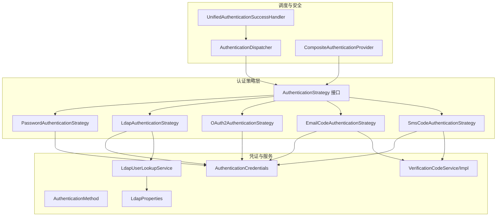
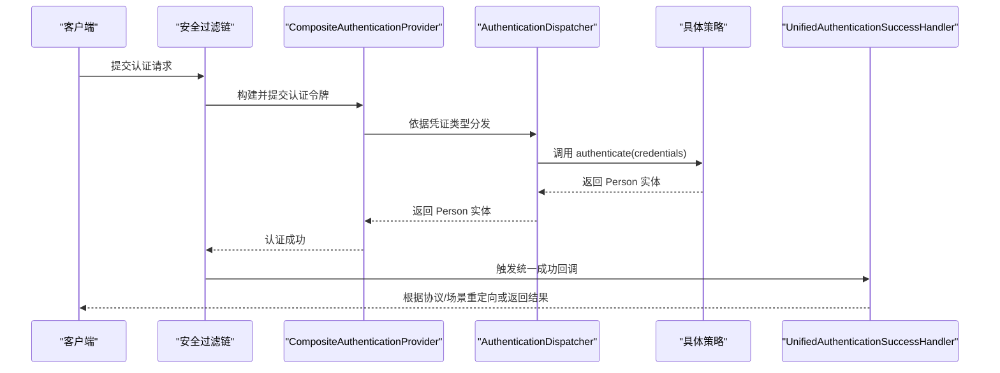
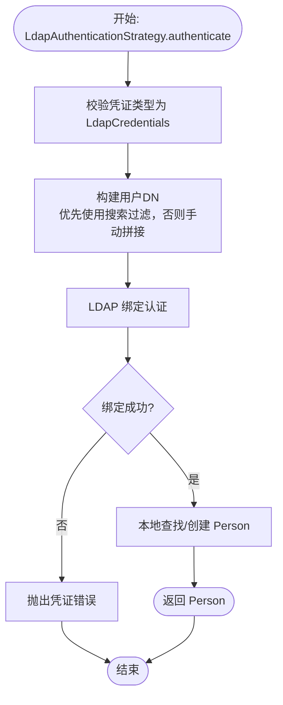
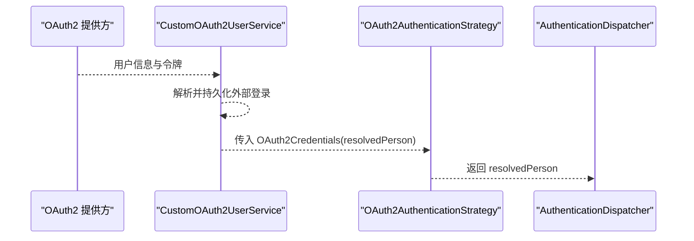
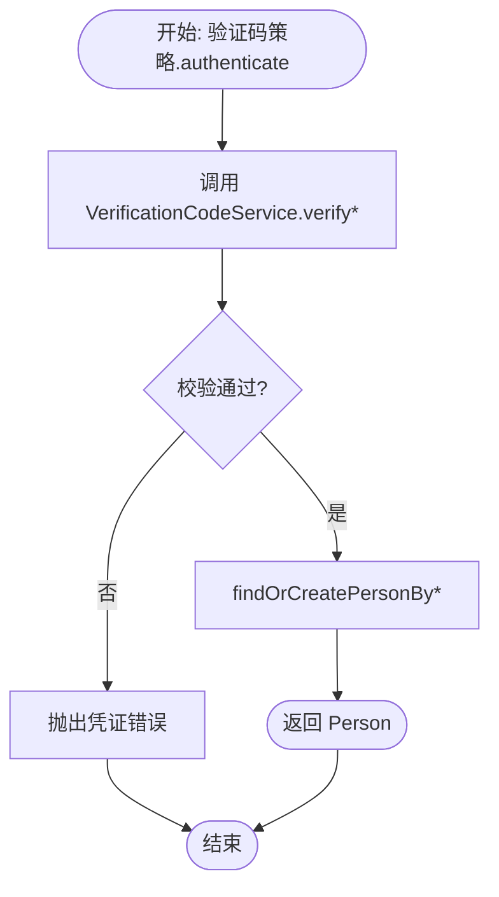
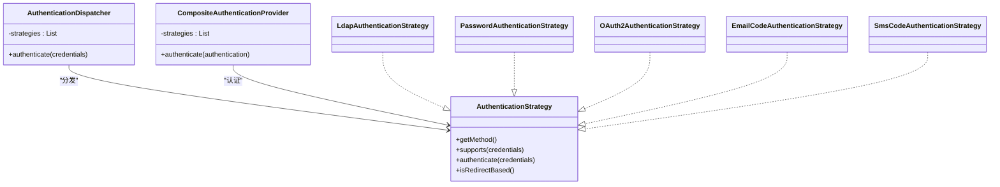

# 认证策略扩展

<cite>
**本文引用的文件**
- [AuthenticationStrategy.java](file://iam-auth-server/src/main/java/iam/platform/auth/domain/service/AuthenticationStrategy.java)
- [AuthenticationDispatcher.java](file://iam-auth-server/src/main/java/iam/platform/auth/domain/service/AuthenticationDispatcher.java)
- [PasswordAuthenticationStrategy.java](file://iam-auth-server/src/main/java/iam/platform/auth/domain/service/impl/PasswordAuthenticationStrategy.java)
- [LdapAuthenticationStrategy.java](file://iam-auth-server/src/main/java/iam/platform/auth/domain/service/impl/LdapAuthenticationStrategy.java)
- [OAuth2AuthenticationStrategy.java](file://iam-auth-server/src/main/java/iam/platform/auth/domain/service/impl/OAuth2AuthenticationStrategy.java)
- [EmailCodeAuthenticationStrategy.java](file://iam-auth-server/src/main/java/iam/platform/auth/domain/service/impl/EmailCodeAuthenticationStrategy.java)
- [SmsCodeAuthenticationStrategy.java](file://iam-auth-server/src/main/java/iam/platform/auth/domain/service/impl/SmsCodeAuthenticationStrategy.java)
- [VerificationCodeService.java](file://iam-auth-server/src/main/java/iam/platform/auth/domain/service/VerificationCodeService.java)
- [VerificationCodeServiceImpl.java](file://iam-auth-server/src/main/java/iam/platform/auth/domain/service/impl/VerificationCodeServiceImpl.java)
- [AuthenticationCredentials.java](file://iam-auth-server/src/main/java/iam/platform/auth/domain/model/valueobject/AuthenticationCredentials.java)
- [AuthenticationMethod.java](file://iam-auth-server/src/main/java/iam/platform/auth/domain/model/enums/AuthenticationMethod.java)
- [application.yml](file://iam-auth-server/src/main/resources/application.yml)
- [DefaultSecurityConfig.java](file://iam-auth-server/src/main/java/iam/platform/auth/infrastructure/config/DefaultSecurityConfig.java)
- [CompositeAuthenticationProvider.java](file://iam-auth-server/src/main/java/iam/platform/auth/infrastructure/security/CompositeAuthenticationProvider.java)
- [CustomOAuth2UserService.java](file://iam-auth-server/src/main/java/iam/platform/auth/infrastructure/security/CustomOAuth2UserService.java)
- [UnifiedAuthenticationSuccessHandler.java](file://iam-auth-server/src/main/java/iam/platform/auth/infrastructure/security/UnifiedAuthenticationSuccessHandler.java)
- [LdapConfig.java](file://iam-auth-server/src/main/java/iam/platform/auth/infrastructure/config/LdapConfig.java)
- [LdapProperties.java](file://iam-auth-server/src/main/java/iam/platform/auth/infrastructure/config/LdapProperties.java)
- [LdapUserLookupService.java](file://iam-auth-server/src/main/java/iam/platform/auth/application/service/LdapUserLookupService.java)
- [VerificationCodeRequestController.java](file://iam-auth-server/src/main/java/iam/platform/auth/interfaces/rest/VerificationCodeRequestController.java)
- [统一认证框架.md](file://docs/design/统一认证框架.md)
</cite>

## 目录
1. [简介](#简介)
2. [项目结构](#项目结构)
3. [核心组件](#核心组件)
4. [架构总览](#架构总览)
5. [详细组件分析](#详细组件分析)
6. [依赖分析](#依赖分析)
7. [性能考量](#性能考量)
8. [故障排查指南](#故障排查指南)
9. [结论](#结论)
10. [附录](#附录)

## 简介
本指南面向需要在IAM平台中扩展认证策略的开发者，系统讲解如何实现自定义认证策略，覆盖现有策略的实现模式与最佳实践，并提供OAuth2、短信/邮箱验证码、LDAP等策略的集成示例。文档同时涵盖策略接口实现要求、参数处理、结果返回与异常处理规范、配置管理、性能优化与安全考虑，以及扩展示例与测试方法。

## 项目结构
认证策略位于认证服务模块中，采用“策略接口 + 具体策略实现 + 调度器 + 前置/后置处理”的分层设计。核心文件分布如下：
- 策略接口与调度器：AuthenticationStrategy、AuthenticationDispatcher
- 具体策略：PasswordAuthenticationStrategy、LdapAuthenticationStrategy、OAuth2AuthenticationStrategy、EmailCodeAuthenticationStrategy、SmsCodeAuthenticationStrategy
- 凭证模型与枚举：AuthenticationCredentials、AuthenticationMethod
- 验证码服务：VerificationCodeService、VerificationCodeServiceImpl
- OAuth2与LDAP配置：DefaultSecurityConfig、LdapConfig、LdapProperties、LdapUserLookupService
- 统一成功处理器：UnifiedAuthenticationSuccessHandler
- 配置文件：application.yml

图表来源
- [AuthenticationStrategy.java:11-40](file://iam-auth-server/src/main/java/iam/platform/auth/domain/service/AuthenticationStrategy.java#L11-L40)
- [AuthenticationDispatcher.java:25-54](file://iam-auth-server/src/main/java/iam/platform/auth/domain/service/AuthenticationDispatcher.java#L25-L54)
- [PasswordAuthenticationStrategy.java:26-64](file://iam-auth-server/src/main/java/iam/platform/auth/domain/service/impl/PasswordAuthenticationStrategy.java#L26-L64)
- [LdapAuthenticationStrategy.java:30-136](file://iam-auth-server/src/main/java/iam/platform/auth/domain/service/impl/LdapAuthenticationStrategy.java#L30-L136)
- [OAuth2AuthenticationStrategy.java:17-55](file://iam-auth-server/src/main/java/iam/platform/auth/domain/service/impl/OAuth2AuthenticationStrategy.java#L17-L55)
- [EmailCodeAuthenticationStrategy.java:14-39](file://iam-auth-server/src/main/java/iam/platform/auth/domain/service/impl/EmailCodeAuthenticationStrategy.java#L14-L39)
- [SmsCodeAuthenticationStrategy.java:13-39](file://iam-auth-server/src/main/java/iam/platform/auth/domain/service/impl/SmsCodeAuthenticationStrategy.java#L13-L39)
- [VerificationCodeService.java:5-21](file://iam-auth-server/src/main/java/iam/platform/auth/domain/service/VerificationCodeService.java#L5-L21)
- [VerificationCodeServiceImpl.java:17-71](file://iam-auth-server/src/main/java/iam/platform/auth/domain/service/impl/VerificationCodeServiceImpl.java#L17-L71)
- [AuthenticationCredentials.java:9-59](file://iam-auth-server/src/main/java/iam/platform/auth/domain/model/valueobject/AuthenticationCredentials.java#L9-L59)
- [AuthenticationMethod.java:6-9](file://iam-auth-server/src/main/java/iam/platform/auth/domain/model/enums/AuthenticationMethod.java#L6-L9)
- [LdapUserLookupService.java:22-38](file://iam-auth-server/src/main/java/iam/platform/auth/application/service/LdapUserLookupService.java#L22-L38)
- [LdapProperties.java:13-33](file://iam-auth-server/src/main/java/iam/platform/auth/infrastructure/config/LdapProperties.java#L13-L33)
- [CompositeAuthenticationProvider.java:26-31](file://iam-auth-server/src/main/java/iam/platform/auth/infrastructure/security/CompositeAuthenticationProvider.java#L26-L31)
- [UnifiedAuthenticationSuccessHandler.java:28-29](file://iam-auth-server/src/main/java/iam/platform/auth/infrastructure/security/UnifiedAuthenticationSuccessHandler.java#L28-L29)

章节来源
- [AuthenticationStrategy.java:11-40](file://iam-auth-server/src/main/java/iam/platform/auth/domain/service/AuthenticationStrategy.java#L11-L40)
- [AuthenticationDispatcher.java:25-54](file://iam-auth-server/src/main/java/iam/platform/auth/domain/service/AuthenticationDispatcher.java#L25-L54)
- [application.yml:72-127](file://iam-auth-server/src/main/resources/application.yml#L72-L127)

## 核心组件
- AuthenticationStrategy：认证策略接口，定义方法标识、支持性判断、认证执行与是否外链跳转。
- AuthenticationDispatcher：根据凭证类型选择具体策略并执行。
- AuthenticationCredentials：密封接口，定义各认证方法的凭证数据结构。
- AuthenticationMethod：枚举所有受支持的认证方式。
- VerificationCodeService/Impl：验证码发送、校验与用户查找/创建。
- OAuth2与LDAP相关组件：OAuth2用户解析、LDAP连接模板与属性配置、LDAP用户查找服务。

章节来源
- [AuthenticationStrategy.java:11-40](file://iam-auth-server/src/main/java/iam/platform/auth/domain/service/AuthenticationStrategy.java#L11-L40)
- [AuthenticationDispatcher.java:25-54](file://iam-auth-server/src/main/java/iam/platform/auth/domain/service/AuthenticationDispatcher.java#L25-L54)
- [AuthenticationCredentials.java:9-59](file://iam-auth-server/src/main/java/iam/platform/auth/domain/model/valueobject/AuthenticationCredentials.java#L9-L59)
- [AuthenticationMethod.java:6-9](file://iam-auth-server/src/main/java/iam/platform/auth/domain/model/enums/AuthenticationMethod.java#L6-L9)
- [VerificationCodeService.java:5-21](file://iam-auth-server/src/main/java/iam/platform/auth/domain/service/VerificationCodeService.java#L5-L21)
- [VerificationCodeServiceImpl.java:17-71](file://iam-auth-server/src/main/java/iam/platform/auth/domain/service/impl/VerificationCodeServiceImpl.java#L17-L71)

## 架构总览
下图展示了认证从请求进入、策略分发、前置处理、策略执行到统一结果处理的整体流程。

图表来源
- [CompositeAuthenticationProvider.java:26-31](file://iam-auth-server/src/main/java/iam/platform/auth/infrastructure/security/CompositeAuthenticationProvider.java#L26-L31)
- [AuthenticationDispatcher.java:36-53](file://iam-auth-server/src/main/java/iam/platform/auth/domain/service/AuthenticationDispatcher.java#L36-L53)
- [UnifiedAuthenticationSuccessHandler.java:28-29](file://iam-auth-server/src/main/java/iam/platform/auth/infrastructure/security/UnifiedAuthenticationSuccessHandler.java#L28-L29)

章节来源
- [统一认证框架.md:140-233](file://docs/design/统一认证框架.md#L140-L233)
- [DefaultSecurityConfig.java:35-94](file://iam-auth-server/src/main/java/iam/platform/auth/infrastructure/config/DefaultSecurityConfig.java#L35-L94)

## 详细组件分析

### AuthenticationStrategy 接口实现要求
- 方法标识：getMethod() 返回该策略对应的 AuthenticationMethod。
- 支持性判断：supports(AuthenticationCredentials) 判断凭证类型是否由该策略处理。
- 认证执行：authenticate(AuthenticationCredentials) 返回已解析的 Person；失败抛出 BadCredentialsException；账户状态异常抛出 InvalidStateException。
- 外链跳转：isRedirectBased() 默认返回 false，OAuth2 类型策略需返回 true。

章节来源
- [AuthenticationStrategy.java:11-40](file://iam-auth-server/src/main/java/iam/platform/auth/domain/service/AuthenticationStrategy.java#L11-L40)

### PasswordAuthenticationStrategy 实现要点
- 凭证类型：PasswordCredentials。
- 流程：按用户名查询用户，校验密码哈希，成功返回 Person。
- 安全建议：仅对高信任客户端启用；OAuth2密码模式推荐授权码+PKCE。

章节来源
- [PasswordAuthenticationStrategy.java:26-64](file://iam-auth-server/src/main/java/iam/platform/auth/domain/service/impl/PasswordAuthenticationStrategy.java#L26-L64)
- [AuthenticationCredentials.java:11-19](file://iam-auth-server/src/main/java/iam/platform/auth/domain/model/valueobject/AuthenticationCredentials.java#L11-L19)

### LdapAuthenticationStrategy 实现要点
- 凭证类型：LdapCredentials。
- 流程：构建用户DN，通过LDAP绑定认证，再在本地查找或创建 Person。
- 配置：LdapProperties 与 LdapConfig 提供连接URL、基础DN、绑定凭据、搜索过滤、SSL开关与连接池设置；LdapUserLookupService 负责LDAP查询与DN解析。
- 安全建议：生产环境必须使用LDAPS；遵循AD账户锁定策略。

图表来源
- [LdapAuthenticationStrategy.java:46-136](file://iam-auth-server/src/main/java/iam/platform/auth/domain/service/impl/LdapAuthenticationStrategy.java#L46-L136)
- [LdapUserLookupService.java:22-38](file://iam-auth-server/src/main/java/iam/platform/auth/application/service/LdapUserLookupService.java#L22-L38)
- [LdapProperties.java:13-33](file://iam-auth-server/src/main/java/iam/platform/auth/infrastructure/config/LdapProperties.java#L13-L33)
- [LdapConfig.java:20-38](file://iam-auth-server/src/main/java/iam/platform/auth/infrastructure/config/LdapConfig.java#L20-L38)

章节来源
- [LdapAuthenticationStrategy.java:30-136](file://iam-auth-server/src/main/java/iam/platform/auth/domain/service/impl/LdapAuthenticationStrategy.java#L30-L136)
- [LdapUserLookupService.java:22-38](file://iam-auth-server/src/main/java/iam/platform/auth/application/service/LdapUserLookupService.java#L22-L38)
- [LdapProperties.java:13-33](file://iam-auth-server/src/main/java/iam/platform/auth/infrastructure/config/LdapProperties.java#L13-L33)
- [LdapConfig.java:12-38](file://iam-auth-server/src/main/java/iam/platform/auth/infrastructure/config/LdapConfig.java#L12-L38)

### OAuth2AuthenticationStrategy 实现要点
- 凭证类型：OAuth2Credentials，包含提供商标识与已解析的 Person。
- 流程：外部OAuth2提供方已完成凭证校验，此处直接返回已解析用户。
- 外链跳转：isRedirectBased() 返回 true，用于协议适配层识别。
- 映射：fromProvider() 将提供商注册ID映射到 AuthenticationMethod。

图表来源
- [OAuth2AuthenticationStrategy.java:17-55](file://iam-auth-server/src/main/java/iam/platform/auth/domain/service/impl/OAuth2AuthenticationStrategy.java#L17-L55)
- [CustomOAuth2UserService.java:22-32](file://iam-auth-server/src/main/java/iam/platform/auth/infrastructure/security/CustomOAuth2UserService.java#L22-L32)
- [AuthenticationDispatcher.java:36-53](file://iam-auth-server/src/main/java/iam/platform/auth/domain/service/AuthenticationDispatcher.java#L36-L53)

章节来源
- [OAuth2AuthenticationStrategy.java:17-55](file://iam-auth-server/src/main/java/iam/platform/auth/domain/service/impl/OAuth2AuthenticationStrategy.java#L17-L55)
- [CustomOAuth2UserService.java:22-32](file://iam-auth-server/src/main/java/iam/platform/auth/infrastructure/security/CustomOAuth2UserService.java#L22-L32)
- [DefaultSecurityConfig.java:35-94](file://iam-auth-server/src/main/java/iam/platform/auth/infrastructure/config/DefaultSecurityConfig.java#L35-L94)

### EmailCodeAuthenticationStrategy 与 SmsCodeAuthenticationStrategy 实现要点
- 凭证类型：EmailCodeCredentials、SmsCodeCredentials。
- 流程：调用 VerificationCodeService 校验验证码，校验通过后查找或创建 Person。
- 配置：application.yml 中开启短信/邮箱验证码功能与SMTP配置。

图表来源
- [EmailCodeAuthenticationStrategy.java:14-39](file://iam-auth-server/src/main/java/iam/platform/auth/domain/service/impl/EmailCodeAuthenticationStrategy.java#L14-L39)
- [SmsCodeAuthenticationStrategy.java:13-39](file://iam-auth-server/src/main/java/iam/platform/auth/domain/service/impl/SmsCodeAuthenticationStrategy.java#L13-L39)
- [VerificationCodeService.java:5-21](file://iam-auth-server/src/main/java/iam/platform/auth/domain/service/VerificationCodeService.java#L5-L21)
- [VerificationCodeServiceImpl.java:17-71](file://iam-auth-server/src/main/java/iam/platform/auth/domain/service/impl/VerificationCodeServiceImpl.java#L17-L71)

章节来源
- [EmailCodeAuthenticationStrategy.java:14-39](file://iam-auth-server/src/main/java/iam/platform/auth/domain/service/impl/EmailCodeAuthenticationStrategy.java#L14-L39)
- [SmsCodeAuthenticationStrategy.java:13-39](file://iam-auth-server/src/main/java/iam/platform/auth/domain/service/impl/SmsCodeAuthenticationStrategy.java#L13-L39)
- [VerificationCodeService.java:5-21](file://iam-auth-server/src/main/java/iam/platform/auth/domain/service/VerificationCodeService.java#L5-L21)
- [VerificationCodeServiceImpl.java:17-71](file://iam-auth-server/src/main/java/iam/platform/auth/domain/service/impl/VerificationCodeServiceImpl.java#L17-L71)
- [VerificationCodeRequestController.java:15-30](file://iam-auth-server/src/main/java/iam/platform/auth/interfaces/rest/VerificationCodeRequestController.java#L15-L30)

### 凭证模型与方法枚举
- AuthenticationCredentials：密封接口，定义 PasswordCredentials、SmsCodeCredentials、EmailCodeCredentials、OAuth2Credentials、LdapCredentials 的构造参数校验。
- AuthenticationMethod：枚举 PASSWORD、SMS_CODE、EMAIL_CODE、OAUTH2_DINGTALK、OAUTH2_WECOM、LDAP。

章节来源
- [AuthenticationCredentials.java:9-59](file://iam-auth-server/src/main/java/iam/platform/auth/domain/model/valueobject/AuthenticationCredentials.java#L9-L59)
- [AuthenticationMethod.java:6-9](file://iam-auth-server/src/main/java/iam/platform/auth/domain/model/enums/AuthenticationMethod.java#L6-L9)

## 依赖分析
- 策略与调度：AuthenticationDispatcher 通过构造注入收集所有 AuthenticationStrategy Bean，按 supports() 过滤并调用 authenticate()。
- 安全集成：CompositeAuthenticationProvider 在认证流程中被 DefaultSecurityConfig 注册为 AuthenticationManager 的 Provider，实现统一认证入口。
- OAuth2：DefaultSecurityConfig 配置 oauth2Login，userInfoEndpoint 使用 CustomOAuth2UserService 解析第三方用户，随后进入统一成功处理器。
- LDAP：LdapConfig 提供 LdapContextSource 与 LdapTemplate，LdapProperties 提供连接参数，LdapUserLookupService 执行LDAP查询与DN解析。

图表来源
- [AuthenticationDispatcher.java:25-54](file://iam-auth-server/src/main/java/iam/platform/auth/domain/service/AuthenticationDispatcher.java#L25-L54)
- [CompositeAuthenticationProvider.java:26-31](file://iam-auth-server/src/main/java/iam/platform/auth/infrastructure/security/CompositeAuthenticationProvider.java#L26-L31)
- [AuthenticationStrategy.java:11-40](file://iam-auth-server/src/main/java/iam/platform/auth/domain/service/AuthenticationStrategy.java#L11-L40)
- [LdapAuthenticationStrategy.java:30-136](file://iam-auth-server/src/main/java/iam/platform/auth/domain/service/impl/LdapAuthenticationStrategy.java#L30-L136)
- [PasswordAuthenticationStrategy.java:26-64](file://iam-auth-server/src/main/java/iam/platform/auth/domain/service/impl/PasswordAuthenticationStrategy.java#L26-L64)
- [OAuth2AuthenticationStrategy.java:17-55](file://iam-auth-server/src/main/java/iam/platform/auth/domain/service/impl/OAuth2AuthenticationStrategy.java#L17-L55)
- [EmailCodeAuthenticationStrategy.java:14-39](file://iam-auth-server/src/main/java/iam/platform/auth/domain/service/impl/EmailCodeAuthenticationStrategy.java#L14-L39)
- [SmsCodeAuthenticationStrategy.java:13-39](file://iam-auth-server/src/main/java/iam/platform/auth/domain/service/impl/SmsCodeAuthenticationStrategy.java#L13-L39)

章节来源
- [DefaultSecurityConfig.java:35-94](file://iam-auth-server/src/main/java/iam/platform/auth/infrastructure/config/DefaultSecurityConfig.java#L35-L94)
- [LdapConfig.java:20-38](file://iam-auth-server/src/main/java/iam/platform/auth/infrastructure/config/LdapConfig.java#L20-L38)
- [LdapProperties.java:13-33](file://iam-auth-server/src/main/java/iam/platform/auth/infrastructure/config/LdapProperties.java#L13-L33)

## 性能考量
- 策略选择：AuthenticationDispatcher 使用流式筛选，策略数量较多时建议控制策略数量并确保 supports() 判断高效。
- LDAP：启用连接池（LdapConfig），合理设置最大活跃数与空闲数；使用LDAPS避免明文传输。
- 验证码：验证码存储于Redis，注意过期时间与键命名规范；发送频率限制与每日上限可防止滥用。
- OAuth2：第三方用户信息拉取建议缓存，减少重复网络请求。
- 安全策略：速率限制、账户锁定与IP白名单在全局安全配置中启用，降低暴力破解风险。

章节来源
- [LdapConfig.java:20-38](file://iam-auth-server/src/main/java/iam/platform/auth/infrastructure/config/LdapConfig.java#L20-L38)
- [LdapProperties.java:13-33](file://iam-auth-server/src/main/java/iam/platform/auth/infrastructure/config/LdapProperties.java#L13-L33)
- [VerificationCodeServiceImpl.java:17-71](file://iam-auth-server/src/main/java/iam/platform/auth/domain/service/impl/VerificationCodeServiceImpl.java#L17-L71)
- [application.yml:90-127](file://iam-auth-server/src/main/resources/application.yml#L90-L127)

## 故障排查指南
- 凭证类型不匹配：若 supports() 返回 false 或 credentials 类型不符，AuthenticationDispatcher 将抛出凭证错误。请确认凭证封装与策略支持范围一致。
- LDAP 认证失败：检查 LdapProperties 的URL、基础DN、绑定凭据与SSL设置；查看绑定异常与连接超时日志。
- OAuth2 登录异常：确认 CustomOAuth2UserService 已正确解析第三方用户并持久化外部登录；检查 userInfoEndpoint 配置与提供商返回字段。
- 验证码无效或过期：确认验证码键前缀与过期时间；检查Redis连接与键空间；关注发送频率限制。
- 统一成功处理器：若重定向目标不符合预期，检查协议路由与统一成功处理器逻辑。

章节来源
- [AuthenticationDispatcher.java:48-53](file://iam-auth-server/src/main/java/iam/platform/auth/domain/service/AuthenticationDispatcher.java#L48-L53)
- [LdapAuthenticationStrategy.java:106-130](file://iam-auth-server/src/main/java/iam/platform/auth/domain/service/impl/LdapAuthenticationStrategy.java#L106-L130)
- [CustomOAuth2UserService.java:27-32](file://iam-auth-server/src/main/java/iam/platform/auth/infrastructure/security/CustomOAuth2UserService.java#L27-L32)
- [VerificationCodeServiceImpl.java:58-71](file://iam-auth-server/src/main/java/iam/platform/auth/domain/service/impl/VerificationCodeServiceImpl.java#L58-L71)
- [UnifiedAuthenticationSuccessHandler.java:28-29](file://iam-auth-server/src/main/java/iam/platform/auth/infrastructure/security/UnifiedAuthenticationSuccessHandler.java#L28-L29)

## 结论
通过策略接口与调度器的解耦设计，平台能够以最小侵入方式扩展新的认证方式。现有策略覆盖密码、短信/邮箱验证码、OAuth2与LDAP等主流场景。扩展新策略时，请严格遵循接口契约、凭证模型与异常处理规范，并结合配置文件与安全策略进行性能与安全加固。

## 附录

### 扩展新认证策略步骤
- 新建策略类实现 AuthenticationStrategy，定义 getMethod() 与 supports()。
- 在 authenticate() 中完成凭证校验与用户解析，失败抛出 BadCredentialsException。
- 若涉及外链跳转（如OAuth2），覆写 isRedirectBased() 返回 true。
- 在应用启动时自动发现策略（Spring 自动装配）。
- 如需前置/后置处理，可在统一成功处理器或管道中扩展。

章节来源
- [AuthenticationStrategy.java:11-40](file://iam-auth-server/src/main/java/iam/platform/auth/domain/service/AuthenticationStrategy.java#L11-L40)
- [AuthenticationDispatcher.java:25-54](file://iam-auth-server/src/main/java/iam/platform/auth/domain/service/AuthenticationDispatcher.java#L25-L54)

### 配置管理清单
- OAuth2 客户端注册与提供商信息：application.yml 中 sso.security.oauth2.client.registration.* 与 provider.*
- 验证码功能开关与SMTP配置：verification-code.sms.enabled/email.from
- 安全策略：sso.security.rate-limit、account-lockout、ip-whitelist/blacklist
- LDAP：sso.ldap.* 与 LdapProperties 对应项
- SSL/TLS：server.ssl.* 与 LDAP SSL

章节来源
- [application.yml:54-127](file://iam-auth-server/src/main/resources/application.yml#L54-L127)

### 测试方法建议
- 单元测试：针对策略 authenticate() 输入不同凭证组合，断言返回 Person 或异常类型。
- 集成测试：使用内存数据库与Redis，模拟验证码发送/校验、LDAP绑定与OAuth2用户解析。
- 场景测试：验证统一成功处理器在不同协议下的重定向行为与结果格式。

章节来源
- [VerificationCodeRequestController.java:15-30](file://iam-auth-server/src/main/java/iam/platform/auth/interfaces/rest/VerificationCodeRequestController.java#L15-L30)
- [SamlMetadataGeneratorTest.java:14-51](file://iam-auth-server/src/test/java/iam/platform/auth/application/service/SamlMetadataGeneratorTest.java#L14-L51)