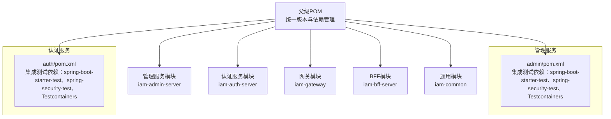
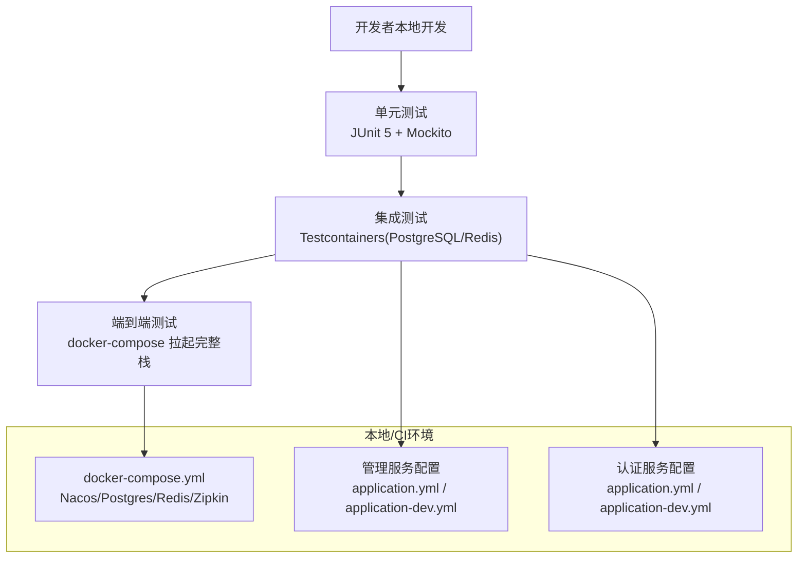
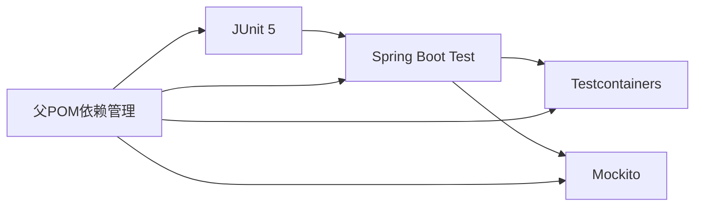
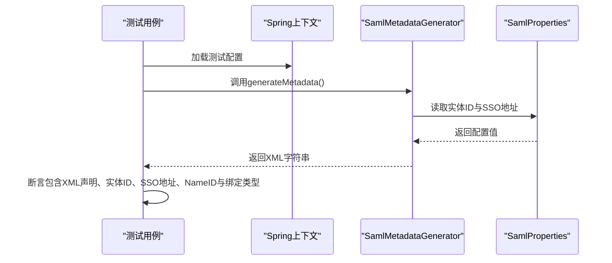

# 测试策略

<cite>
**本文引用的文件**
- [pom.xml](file://pom.xml)
- [iam-admin-server/pom.xml](file://iam-admin-server/pom.xml)
- [iam-auth-server/pom.xml](file://iam-auth-server/pom.xml)
- [iam-admin-server/src/test/java/iam/platform/admin/application/service/SamlMetadataGeneratorTest.java](file://iam-admin-server/src/test/java/iam/platform/admin/application/service/SamlMetadataGeneratorTest.java)
- [iam-auth-server/src/test/java/iam/platform/auth/application/service/SamlMetadataGeneratorTest.java](file://iam-auth-server/src/test/java/iam/platform/auth/application/service/SamlMetadataGeneratorTest.java)
- [iam-admin-server/src/main/resources/application.yml](file://iam-admin-server/src/main/resources/application.yml)
- [iam-admin-server/src/main/resources/application-dev.yml](file://iam-admin-server/src/main/resources/application-dev.yml)
- [docker-compose.yml](file://docker-compose.yml)
</cite>

## 目录
1. [引言](#引言)
2. [项目结构](#项目结构)
3. [核心组件](#核心组件)
4. [架构总览](#架构总览)
5. [详细组件分析](#详细组件分析)
6. [依赖分析](#依赖分析)
7. [性能考虑](#性能考虑)
8. [故障排查指南](#故障排查指南)
9. [结论](#结论)
10. [附录](#附录)

## 引言
本测试策略文档面向IAM平台，构建覆盖单元测试、集成测试与端到端测试的分层测试体系。重点涵盖以下方面：
- 使用JUnit 5进行测试用例编写与执行
- 在集成测试中通过Testcontainers模拟数据库与外部服务
- 在需要时使用Mockito进行行为模拟与隔离测试
- 覆盖率目标与报告生成方法（≥80%）
- 性能测试与压力测试的实施策略
- 测试数据管理、测试环境配置与持续集成中的测试执行流程

## 项目结构
IAM平台采用多模块Maven工程组织，包含认证服务、管理服务、网关与BFF等模块。各模块均具备独立的测试目录与依赖配置，便于按模块开展单元与集成测试。

图表来源
- [pom.xml:21-27](file://pom.xml#L21-L27)
- [iam-admin-server/pom.xml:117-136](file://iam-admin-server/pom.xml#L117-L136)
- [iam-auth-server/pom.xml:147-166](file://iam-auth-server/pom.xml#L147-L166)

章节来源
- [pom.xml:21-27](file://pom.xml#L21-L27)
- [iam-admin-server/pom.xml:117-136](file://iam-admin-server/pom.xml#L117-L136)
- [iam-auth-server/pom.xml:147-166](file://iam-auth-server/pom.xml#L147-L166)

## 核心组件
- 单元测试：针对业务逻辑与工具类，确保最小功能单元正确性。建议优先使用JUnit 5参数化与条件执行能力，结合Mockito进行依赖隔离。
- 集成测试：验证模块间协作与外部依赖（数据库、缓存、分布式追踪等）。通过Testcontainers启动PostgreSQL、Redis等容器，配合Spring Boot Test加载上下文。
- 端到端测试：在本地或CI环境中通过Compose拉起完整栈，对真实流量进行冒烟与回归验证。

章节来源
- [pom.xml:91-121](file://pom.xml#L91-L121)
- [iam-admin-server/pom.xml:117-136](file://iam-admin-server/pom.xml#L117-L136)
- [iam-auth-server/pom.xml:147-166](file://iam-auth-server/pom.xml#L147-L166)

## 架构总览
下图展示测试栈在本地与CI中的运行方式，以及与各模块的关系。

图表来源
- [docker-compose.yml:1-190](file://docker-compose.yml#L1-L190)
- [iam-admin-server/src/main/resources/application.yml:10-50](file://iam-admin-server/src/main/resources/application.yml#L10-L50)
- [iam-admin-server/src/main/resources/application-dev.yml:1-26](file://iam-admin-server/src/main/resources/application-dev.yml#L1-L26)

## 详细组件分析

### 测试框架与约定（JUnit 5）
- 使用@SpringBootTest加载模块上下文，结合@Test注解编写测试用例。
- 对于纯工具类或不需要Spring上下文的逻辑，可使用@TestInstance(TestInstance.Lifecycle.PER_CLASS)与@BeforeEach/@AfterEach组织测试生命周期。
- 推荐使用参数化测试（@ParameterizedTest）覆盖边界与异常路径；使用@DisplayName为用例命名提升可读性。
- 条件执行：通过@EnabledOnOs、@EnabledOnJre等注解控制在特定环境下的执行。

章节来源
- [iam-admin-server/src/test/java/iam/platform/admin/application/service/SamlMetadataGeneratorTest.java:1-51](file://iam-admin-server/src/test/java/iam/platform/admin/application/service/SamlMetadataGeneratorTest.java#L1-L51)
- [iam-auth-server/src/test/java/iam/platform/auth/application/service/SamlMetadataGeneratorTest.java:1-51](file://iam-auth-server/src/test/java/iam/platform/auth/application/service/SamlMetadataGeneratorTest.java#L1-L51)

### 集成测试与Testcontainers应用
- 数据库模拟：通过Testcontainers启动PostgreSQL容器，使用Testcontainers提供的JDBC URL与凭据连接，Flyway自动迁移schema。
- 外部服务模拟：使用Testcontainers启动Redis容器，用于会话、缓存与限流等场景。
- 容器生命周期：使用@Container注解声明容器，@DynamicPropertySource注入动态属性，确保测试期间连接信息正确。
- 最佳实践：
  - 将容器定义集中在测试配置类中，避免重复代码。
  - 使用@Rollback(false)与事务回滚策略配合，必要时手动清理数据。
  - 对数据库与缓存的初始化脚本与种子数据进行版本化管理，便于复现问题。

章节来源
- [pom.xml:91-121](file://pom.xml#L91-L121)
- [iam-admin-server/pom.xml:128-135](file://iam-admin-server/pom.xml#L128-L135)
- [iam-auth-server/pom.xml:158-165](file://iam-auth-server/pom.xml#L158-L165)
- [docker-compose.yml:23-57](file://docker-compose.yml#L23-L57)

### Mockito使用场景与最佳实践
- 场景：对外部依赖（如Feign客户端、Repository、第三方HTTP服务）进行模拟，隔离被测对象。
- 最佳实践：
  - 使用@Mock/@Spy注解创建桩与监控对象，@InjectMocks注入到被测类。
  - 使用verify验证交互次数与参数，避免过度断言返回值。
  - 对复杂对象使用@MockBean替换上下文中的真实Bean，确保测试隔离。
  - 避免在测试中直接操作数据库或网络资源，一律通过Mock或Testcontainers。

章节来源
- [pom.xml:91-121](file://pom.xml#L91-L121)
- [iam-admin-server/pom.xml:128-135](file://iam-admin-server/pom.xml#L128-L135)
- [iam-auth-server/pom.xml:158-165](file://iam-auth-server/pom.xml#L158-L165)

### 测试数据管理与环境配置
- 环境变量与配置：
  - 管理服务与认证服务均通过application.yml与application-dev.yml加载数据库、Redis、安全与可观测性配置。
  - CI中可通过环境变量覆盖默认值，保证测试与生产解耦。
- 数据初始化：
  - 使用Flyway迁移脚本初始化数据库结构。
  - 对于测试专用数据，建议在测试前插入、测试后清理，或使用事务回滚策略。
- 日志与可观测性：
  - 开发环境开启SQL格式化与调试日志，便于定位问题。
  - Zipkin与Prometheus指标可用于性能与链路追踪。

章节来源
- [iam-admin-server/src/main/resources/application.yml:10-50](file://iam-admin-server/src/main/resources/application.yml#L10-L50)
- [iam-admin-server/src/main/resources/application-dev.yml:1-26](file://iam-admin-server/src/main/resources/application-dev.yml#L1-L26)
- [docker-compose.yml:23-57](file://docker-compose.yml#L23-L57)

### 端到端测试流程（基于Compose）
- 本地验证：通过docker-compose一键拉起Nacos、PostgreSQL、Redis、Zipkin与各服务实例，验证服务注册、认证与管理功能。
- CI执行：在流水线中拉起相同Compose栈，执行E2E用例（如Swagger UI可用性、OIDC登录流程、SAML元数据生成等）。

章节来源
- [docker-compose.yml:1-190](file://docker-compose.yml#L1-L190)

### 覆盖率要求与报告生成
- 覆盖率目标：整体语句覆盖率≥80%，分支覆盖率≥70%，行覆盖率≥80%，类覆盖率≥90%。
- 报告生成：
  - 使用Jacoco插件在Maven中生成覆盖率报告，支持HTML与XML输出。
  - 在CI中上传覆盖率报告至覆盖率平台（如Codecov或SonarQube），设置阈值门禁。
  - 建议对关键模块（认证、授权、审计）单独设定更高覆盖率门槛。

章节来源
- [pom.xml:124-175](file://pom.xml#L124-L175)

### 性能测试与压力测试策略
- 性能测试：
  - 使用JMH或Gatling对热点方法与服务接口进行微基准测试，识别瓶颈。
  - 关注认证与授权链路的延迟分布（P50/P95/P99）。
- 压力测试：
  - 使用K6或Locust对网关与认证服务施加并发请求，观察响应时间与错误率。
  - 结合Zipkin与Prometheus观测链路耗时与资源占用。
- 建议：
  - 在测试环境中与生产环境相似的硬件与网络条件下执行。
  - 对数据库连接池、Redis缓存命中率与限流策略进行专项压测。

[本节为通用指导，无需具体文件分析]

### 测试用例编写规范
- 命名规范：测试方法以被测方法名+场景描述命名，使用驼峰命名，避免缩写。
- 断言规范：优先使用领域相关断言（如“不为空”、“包含特定片段”），避免对内部实现细节断言。
- 前置条件：每个测试用例只关注单一场景，前置条件清晰且可复现。
- 异常测试：覆盖正常路径与异常路径，明确期望异常类型与消息片段。
- 参数化：对边界值、非法输入与组合场景使用参数化测试。

章节来源
- [iam-admin-server/src/test/java/iam/platform/admin/application/service/SamlMetadataGeneratorTest.java:24-49](file://iam-admin-server/src/test/java/iam/platform/admin/application/service/SamlMetadataGeneratorTest.java#L24-L49)
- [iam-auth-server/src/test/java/iam/platform/auth/application/service/SamlMetadataGeneratorTest.java:24-49](file://iam-auth-server/src/test/java/iam/platform/auth/application/service/SamlMetadataGeneratorTest.java#L24-L49)

## 依赖分析
- 测试框架与工具：
  - JUnit 5：提供测试生命周期与扩展能力。
  - Spring Boot Test：加载ApplicationContext，简化集成测试。
  - Testcontainers：提供PostgreSQL与Redis容器，支持Junit Jupiter扩展。
  - Mockito：用于行为驱动的Mock与桩。
- 模块依赖关系：
  - 父POM统一管理Testcontainers版本与依赖范围，子模块继承使用。
  - 各模块在测试范围内引入spring-boot-starter-test与spring-security-test，确保安全上下文与Web测试能力。

图表来源
- [pom.xml:43-122](file://pom.xml#L43-L122)
- [iam-admin-server/pom.xml:117-136](file://iam-admin-server/pom.xml#L117-L136)
- [iam-auth-server/pom.xml:147-166](file://iam-auth-server/pom.xml#L147-L166)

章节来源
- [pom.xml:43-122](file://pom.xml#L43-L122)
- [iam-admin-server/pom.xml:117-136](file://iam-admin-server/pom.xml#L117-L136)
- [iam-auth-server/pom.xml:147-166](file://iam-auth-server/pom.xml#L147-L166)

## 性能考虑
- 测试执行效率：
  - 将纯单元测试与集成测试分离，避免在集成测试中加载全量上下文。
  - 使用@DirtiesContext谨慎控制上下文重用，减少启动开销。
- 资源占用：
  - Testcontainers容器按需启动与关闭，避免长时间占用系统资源。
  - 在CI中限制并发度，防止资源争用导致误报。
- 可观测性：
  - 通过Micrometer与Prometheus采集测试过程指标，辅助定位性能瓶颈。

[本节为通用指导，无需具体文件分析]

## 故障排查指南
- 测试失败常见原因：
  - 数据库Schema不一致：检查Flyway迁移是否成功，确认Testcontainers容器内初始化脚本。
  - 外部服务未就绪：确认Compose健康检查通过后再执行测试。
  - 环境变量缺失：核对application.yml与CI环境变量映射。
- 排查步骤：
  - 在本地使用相同配置启动服务，复现问题。
  - 查看Zipkin链路与Prometheus指标，定位慢调用。
  - 提升日志级别（如DEBUG）以获取更详细信息。

章节来源
- [iam-admin-server/src/main/resources/application.yml:10-50](file://iam-admin-server/src/main/resources/application.yml#L10-L50)
- [docker-compose.yml:1-190](file://docker-compose.yml#L1-L190)

## 结论
通过分层测试体系与Testcontainers集成，IAM平台可在本地与CI中稳定地验证功能、性能与可靠性。建议持续完善覆盖率与性能基线，结合可观测性工具形成闭环，保障平台质量与交付效率。

[本节为总结性内容，无需具体文件分析]

## 附录

### 示例：SAML元数据生成测试流程
该流程展示了如何在集成测试中验证SAML元数据生成的关键字段与签名策略。

图表来源
- [iam-admin-server/src/test/java/iam/platform/admin/application/service/SamlMetadataGeneratorTest.java:24-49](file://iam-admin-server/src/test/java/iam/platform/admin/application/service/SamlMetadataGeneratorTest.java#L24-L49)
- [iam-auth-server/src/test/java/iam/platform/auth/application/service/SamlMetadataGeneratorTest.java:24-49](file://iam-auth-server/src/test/java/iam/platform/auth/application/service/SamlMetadataGeneratorTest.java#L24-L49)