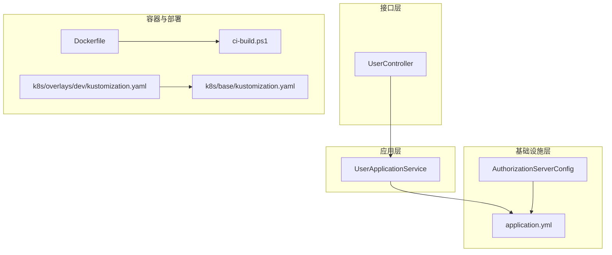
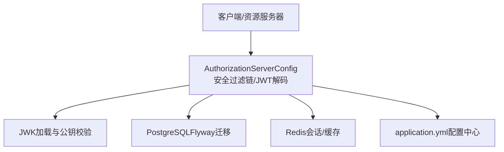
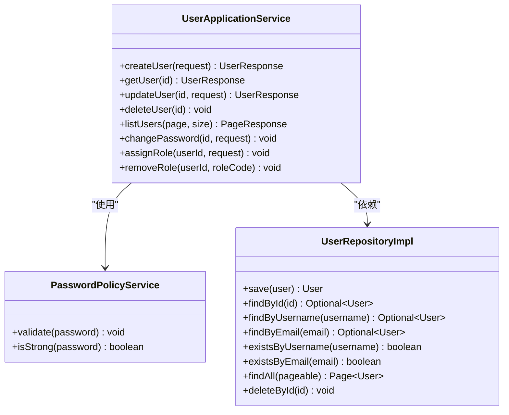
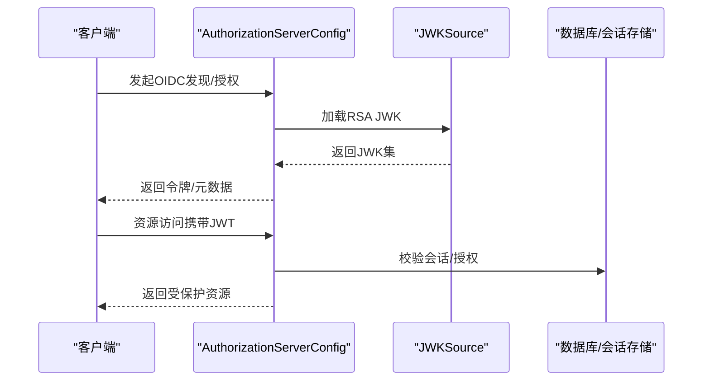
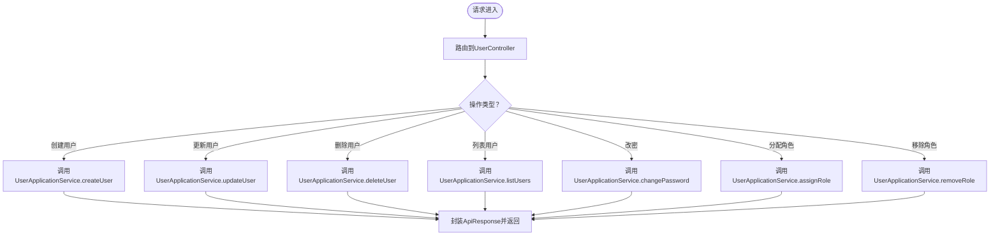
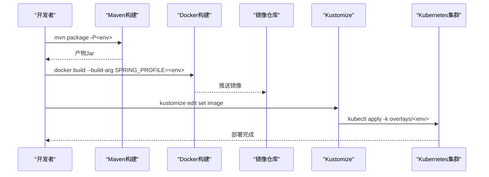
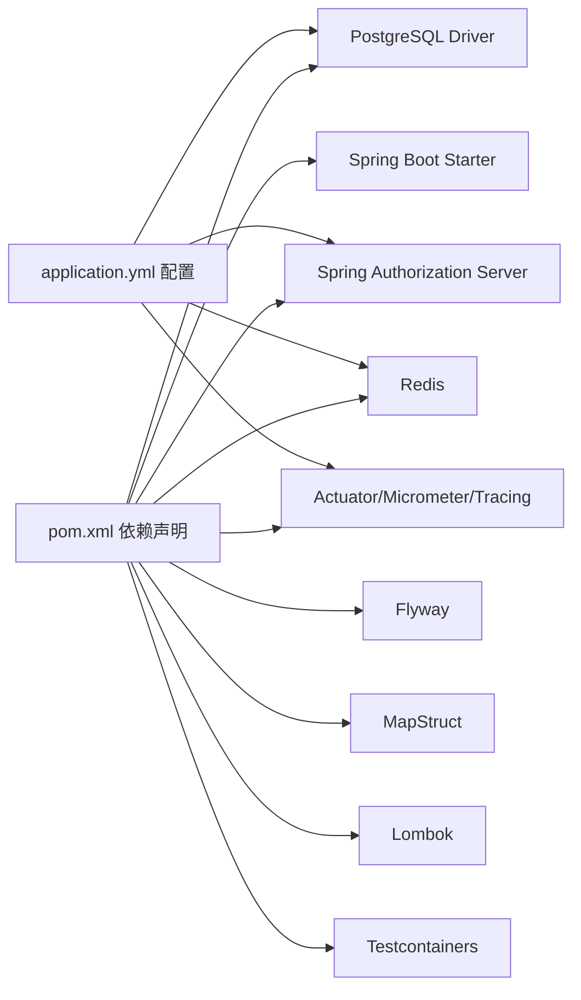

# AI协作规范

<cite>
**本文引用的文件**
- [README.md](file://README.md)
- [DEPLOYMENT.md](file://DEPLOYMENT.md)
- [pom.xml](file://pom.xml)
- [Dockerfile](file://Dockerfile)
- [ci-build.ps1](file://ci-build.ps1)
- [application.yml](file://src/main/resources/application.yml)
- [AuthorizationServerConfig.java](file://src/main/java/sso/oidc/infrastructure/config/AuthorizationServerConfig.java)
- [UserApplicationService.java](file://src/main/java/sso/oidc/application/service/UserApplicationService.java)
- [UserController.java](file://src/main/java/sso/oidc/interfaces/rest/UserController.java)
- [PasswordPolicyService.java](file://src/main/java/sso/oidc/domain/service/PasswordPolicyService.java)
- [UserRepositoryImpl.java](file://src/main/java/sso/oidc/infrastructure/persistence/impl/UserRepositoryImpl.java)
- [kustomization.yaml（base）](file://k8s/base/kustomization.yaml)
- [kustomization.yaml（dev）](file://k8s/overlays/dev/kustomization.yaml)
</cite>

## 目录
1. [引言](#引言)
2. [项目结构](#项目结构)
3. [核心组件](#核心组件)
4. [架构总览](#架构总览)
5. [详细组件分析](#详细组件分析)
6. [依赖分析](#依赖分析)
7. [性能考虑](#性能考虑)
8. [故障排查指南](#故障排查指南)
9. [结论](#结论)
10. [附录](#附录)

## 引言
本规范面向在IAM Platform认证服务项目中引入AI协作的团队，旨在建立“AI辅助开发”的最佳实践与边界约束，确保安全、可控、可追溯的交付过程。重点涵盖：
- AI生成代码的人工审核流程
- 敏感操作的二次确认机制
- AI使用的边界与限制（如禁止直接访问生产环境、禁止生成真实密码与密钥）
- 引入第三方依赖的审核流程
- 生成代码的后续处理要求（重构、注释完善、测试补充）
- AI协作工具的使用指南与最佳实践

本规范以项目现有文档与代码为依据，结合实际开发与运维流程，形成可执行的协作准则。

## 项目结构
项目采用分层架构（应用层、领域层、基础设施层、接口层），并以Spring Boot + Spring Authorization Server实现OIDC Provider能力；同时提供Docker与Kubernetes部署方案，支持多环境（DEV/TEST/CANARY/PROD）隔离与灰度发布。

图表来源
- [UserApplicationService.java:1-165](file://src/main/java/sso/oidc/application/service/UserApplicationService.java#L1-L165)
- [UserController.java:1-90](file://src/main/java/sso/oidc/interfaces/rest/UserController.java#L1-L90)
- [AuthorizationServerConfig.java:1-142](file://src/main/java/sso/oidc/infrastructure/config/AuthorizationServerConfig.java#L1-L142)
- [application.yml:1-78](file://src/main/resources/application.yml#L1-L78)
- [Dockerfile:1-60](file://Dockerfile#L1-L60)
- [kustomization.yaml（base）:1-11](file://k8s/base/kustomization.yaml#L1-L11)
- [kustomization.yaml（dev）:1-23](file://k8s/overlays/dev/kustomization.yaml#L1-L23)
- [ci-build.ps1:1-227](file://ci-build.ps1#L1-L227)

章节来源
- [README.md:104-139](file://README.md#L104-L139)
- [DEPLOYMENT.md:96-123](file://DEPLOYMENT.md#L96-L123)

## 核心组件
- 应用服务层：负责用户管理、角色分配、密码变更等业务编排，包含输入校验、密码策略校验与事务控制。
- 接口层：REST控制器暴露用户管理API，统一返回结构与状态码。
- 基础设施层：OIDC授权服务器配置、JWK加载、安全过滤链与JWT解码器。
- 配置与部署：Spring Profile驱动的多环境配置、Docker镜像构建、Kustomize多环境覆盖与CI/CD脚本。

章节来源
- [UserApplicationService.java:1-165](file://src/main/java/sso/oidc/application/service/UserApplicationService.java#L1-L165)
- [UserController.java:1-90](file://src/main/java/sso/oidc/interfaces/rest/UserController.java#L1-L90)
- [AuthorizationServerConfig.java:1-142](file://src/main/java/sso/oidc/infrastructure/config/AuthorizationServerConfig.java#L1-L142)
- [application.yml:1-78](file://src/main/resources/application.yml#L1-L78)

## 架构总览
下图展示从客户端到OIDC授权服务器的关键交互路径，以及与数据库、Redis、JWK密钥的集成关系。

图表来源
- [AuthorizationServerConfig.java:43-142](file://src/main/java/sso/oidc/infrastructure/config/AuthorizationServerConfig.java#L43-L142)
- [application.yml:9-55](file://src/main/resources/application.yml#L9-L55)

## 详细组件分析

### 用户管理应用服务（UserApplicationService）
职责与要点：
- 用户创建：重复性校验、密码策略校验、默认角色赋权、持久化与日志记录。
- 用户更新：邮箱唯一性校验、字段选择性更新。
- 密码变更：旧密码匹配校验、新密码策略校验、哈希更新。
- 角色分配/移除：基于角色编码的增删操作。

图表来源
- [UserApplicationService.java:26-165](file://src/main/java/sso/oidc/application/service/UserApplicationService.java#L26-L165)
- [PasswordPolicyService.java:1-35](file://src/main/java/sso/oidc/domain/service/PasswordPolicyService.java#L1-L35)
- [UserRepositoryImpl.java:14-92](file://src/main/java/sso/oidc/infrastructure/persistence/impl/UserRepositoryImpl.java#L14-L92)

章节来源
- [UserApplicationService.java:36-125](file://src/main/java/sso/oidc/application/service/UserApplicationService.java#L36-L125)
- [PasswordPolicyService.java:11-24](file://src/main/java/sso/oidc/domain/service/PasswordPolicyService.java#L11-L24)

### OIDC授权服务器配置（AuthorizationServerConfig）
职责与要点：
- 安全过滤链：默认安全配置、HTML登录入口、JWT资源访问。
- 客户端注册：内存注册示例、授权模式、作用域、令牌有效期。
- JWK加载：从资源加载私钥/公钥，生成RSA JWK并暴露给JWKS端点。
- 授权服务器设置：Issuer URI动态配置。

图表来源
- [AuthorizationServerConfig.java:50-118](file://src/main/java/sso/oidc/infrastructure/config/AuthorizationServerConfig.java#L50-L118)

章节来源
- [AuthorizationServerConfig.java:69-118](file://src/main/java/sso/oidc/infrastructure/config/AuthorizationServerConfig.java#L69-L118)

### REST控制器（UserController）
职责与要点：
- 统一API路径与HTTP方法语义，返回标准化响应结构。
- 参数校验与异常处理由全局异常处理器配合完成。

图表来源
- [UserController.java:35-88](file://src/main/java/sso/oidc/interfaces/rest/UserController.java#L35-L88)

章节来源
- [UserController.java:27-89](file://src/main/java/sso/oidc/interfaces/rest/UserController.java#L27-L89)

### 部署与多环境（Docker/Kubernetes/CI）
职责与要点：
- Dockerfile：多阶段构建、容器内健康检查、JRE运行时、Spring Profile注入。
- Kustomize：Base模板与Overlay覆盖，按环境设置镜像标签与命名空间。
- CI/CD脚本：根据环境构建镜像、推送、动态更新Kustomize并部署。

图表来源
- [Dockerfile:34-59](file://Dockerfile#L34-L59)
- [ci-build.ps1:129-215](file://ci-build.ps1#L129-L215)
- [kustomization.yaml（dev）:11-23](file://k8s/overlays/dev/kustomization.yaml#L11-L23)

章节来源
- [Dockerfile:1-60](file://Dockerfile#L1-L60)
- [ci-build.ps1:1-227](file://ci-build.ps1#L1-L227)
- [kustomization.yaml（base）:1-11](file://k8s/base/kustomization.yaml#L1-L11)
- [kustomization.yaml（dev）:1-23](file://k8s/overlays/dev/kustomization.yaml#L1-L23)

## 依赖分析
- 运行时依赖：Spring Boot Starter、Spring Authorization Server、PostgreSQL驱动、Flyway、Redis、Actuator/Prometheus/Tracing、MapStruct、Lombok、Testcontainers等。
- 构建期依赖：Spring Boot Maven Plugin、MapStruct编译器、Lombok注解处理器。
- 环境配置：application.yml通过环境变量注入数据库、Redis、JWK、加密密钥、OIDC Issuer等。

图表来源
- [pom.xml:29-140](file://pom.xml#L29-L140)
- [application.yml:9-55](file://src/main/resources/application.yml#L9-L55)

章节来源
- [pom.xml:1-225](file://pom.xml#L1-L225)
- [application.yml:1-78](file://src/main/resources/application.yml#L1-L78)

## 性能考虑
- 连接池与SQL：HikariCP连接池参数、SQL显示开关按环境区分，避免生产开启。
- 缓存与会话：Redis作为分布式会话与缓存，降低数据库压力。
- 指标与追踪：Prometheus指标、Zipkin链路追踪，便于定位性能瓶颈。
- 容器资源：容器内存百分比限制、健康检查策略，保障稳定性。

章节来源
- [application.yml:13-26](file://src/main/resources/application.yml#L13-L26)
- [application.yml:63-78](file://src/main/resources/application.yml#L63-L78)
- [Dockerfile:55-58](file://Dockerfile#L55-L58)

## 故障排查指南
常见问题与定位思路：
- OIDC鉴权失败：检查授权服务器配置、JWK加载、Issuer URI、客户端注册与作用域。
- 数据库连接异常：核对环境变量、连接池参数、SSL与网络连通性。
- Redis会话异常：确认Redis可达、密码配置、序列化与键空间。
- 部署失败：查看CI/CD脚本输出、Kustomize镜像替换、命名空间与RBAC权限。
- 健康检查：通过Actuator健康端点与日志定位问题根因。

章节来源
- [AuthorizationServerConfig.java:121-124](file://src/main/java/sso/oidc/infrastructure/config/AuthorizationServerConfig.java#L121-L124)
- [application.yml:9-31](file://src/main/resources/application.yml#L9-L31)
- [DEPLOYMENT.md:244-288](file://DEPLOYMENT.md#L244-L288)
- [ci-build.ps1:191-211](file://ci-build.ps1#L191-L211)

## 结论
本规范明确了在IAM Platform项目中引入AI协作的边界与流程，强调“AI生成内容必须经人工审核、敏感操作必须二次确认、禁止AI直接访问生产环境、禁止生成真实凭据”。同时，结合现有代码与部署体系，建立了从代码生成到容器化与多环境发布的闭环质量保障机制。建议在团队内固化流程与工具链，持续优化AI协作效率与安全性。

## 附录

### AI协作规范（面向本项目的实施细则）
- 代码生成与审核
  - AI生成的代码必须通过人工代码评审，重点关注安全、性能与一致性。
  - 新增业务逻辑需与现有应用服务/控制器/配置保持一致的风格与命名。
- 敏感操作的二次确认
  - 数据库DDL变更、密钥/密码生成、生产环境配置修改必须二次确认。
  - 使用占位符或示例值，严禁直接生成真实密钥/密码。
- AI使用的边界与限制
  - 禁止AI直接访问生产环境，所有变更必须通过CI/CD流水线。
  - 禁止生成真实密码、密钥、证书等敏感材料，使用占位符或示例。
- 第三方依赖引入审核
  - 引入新依赖前，必须评估安全性、兼容性与维护成本。
  - 在pom.xml中统一声明与版本锁定，避免供应链风险。
- 生成代码的后续处理
  - 重构：遵循现有分层与命名规范，拆分长函数、消除重复。
  - 注释：补充必要的业务说明与边界条件注释。
  - 测试：补充单元测试与集成测试，确保覆盖率达标。
- AI协作工具使用指南
  - 明确提示词工程，限定上下文范围，避免越权生成。
  - 使用版本化与沙箱环境进行实验，再纳入正式流程。
  - 建立“AI生成清单”与“人工审核清单”，确保可追溯。

章节来源
- [README.md:313-321](file://README.md#L313-L321)