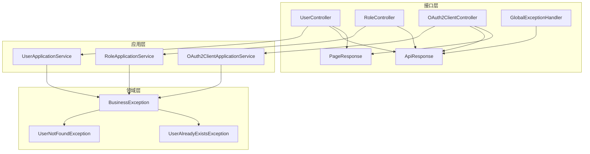
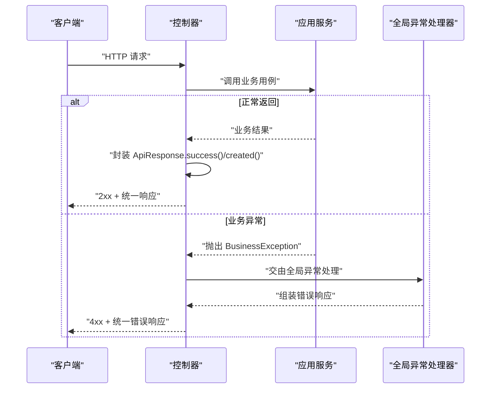
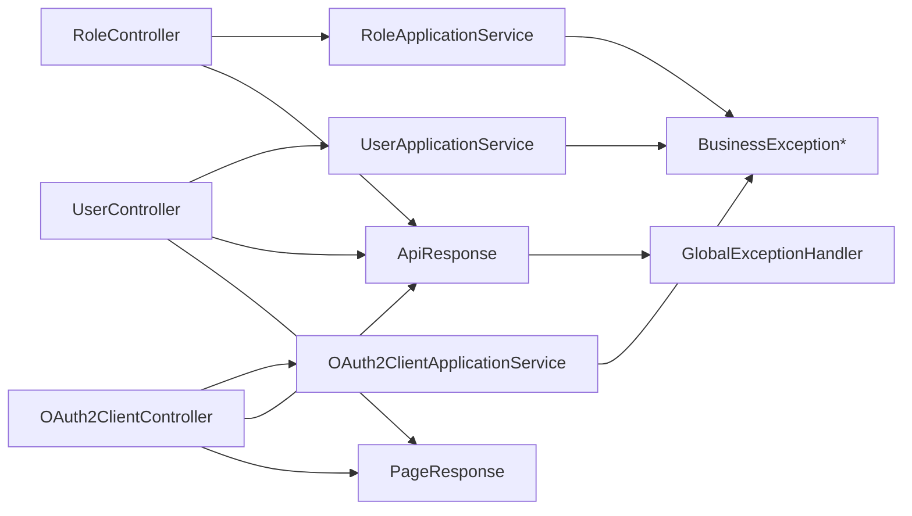

# API设计规范

<cite>
**本文引用的文件**
- [README.md](file://README.md)
- [application.yml](file://src/main/resources/application.yml)
- [ApiResponse.java](file://src/main/java/sso/oidc/interfaces/rest/common/ApiResponse.java)
- [PageResponse.java](file://src/main/java/sso/oidc/interfaces/rest/common/PageResponse.java)
- [GlobalExceptionHandler.java](file://src/main/java/sso/oidc/interfaces/rest/common/GlobalExceptionHandler.java)
- [UserController.java](file://src/main/java/sso/oidc/interfaces/rest/UserController.java)
- [RoleController.java](file://src/main/java/sso/oidc/interfaces/rest/RoleController.java)
- [OAuth2ClientController.java](file://src/main/java/sso/oidc/interfaces/rest/OAuth2ClientController.java)
- [CreateUserRequest.java](file://src/main/java/sso/oidc/application/dto/request/CreateUserRequest.java)
- [UpdateUserRequest.java](file://src/main/java/sso/oidc/application/dto/request/UpdateUserRequest.java)
- [UserResponse.java](file://src/main/java/sso/oidc/application/dto/response/UserResponse.java)
- [RoleResponse.java](file://src/main/java/sso/oidc/application/dto/response/RoleResponse.java)
- [OAuth2ClientResponse.java](file://src/main/java/sso/oidc/application/dto/response/OAuth2ClientResponse.java)
- [BusinessException.java](file://src/main/java/sso/oidc/domain/model/exception/BusinessException.java)
- [UserNotFoundException.java](file://src/main/java/sso/oidc/domain/model/exception/UserNotFoundException.java)
- [UserAlreadyExistsException.java](file://src/main/java/sso/oidc/domain/model/exception/UserAlreadyExistsException.java)
</cite>

## 目录
1. [简介](#简介)
2. [项目结构](#项目结构)
3. [核心组件](#核心组件)
4. [架构总览](#架构总览)
5. [详细组件分析](#详细组件分析)
6. [依赖分析](#依赖分析)
7. [性能考虑](#性能考虑)
8. [故障排查指南](#故障排查指南)
9. [结论](#结论)
10. [附录](#附录)

## 简介
本规范面向IAM Platform认证服务的REST API设计，基于现有代码库中的控制器、统一响应封装、分页模型与全局异常处理机制，总结并固化API设计原则与实现约定，确保资源命名、HTTP方法语义化、URL设计最佳实践、统一响应格式、状态码使用以及版本控制策略的一致性与可维护性。

## 项目结构
本项目采用分层架构，接口层（REST API）位于 interfaces/rest 下，包含通用响应封装与全局异常处理，以及各资源控制器（用户、角色、客户端）。应用层负责用例编排，领域层负责业务规则与异常模型，基础设施层负责配置、持久化与安全组件。

图表来源
- [UserController.java:1-90](file://src/main/java/sso/oidc/interfaces/rest/UserController.java#L1-L90)
- [RoleController.java:1-58](file://src/main/java/sso/oidc/interfaces/rest/RoleController.java#L1-L58)
- [OAuth2ClientController.java:1-75](file://src/main/java/sso/oidc/interfaces/rest/OAuth2ClientController.java#L1-L75)
- [ApiResponse.java:1-61](file://src/main/java/sso/oidc/interfaces/rest/common/ApiResponse.java#L1-L61)
- [PageResponse.java:1-32](file://src/main/java/sso/oidc/interfaces/rest/common/PageResponse.java#L1-L32)
- [GlobalExceptionHandler.java:1-67](file://src/main/java/sso/oidc/interfaces/rest/common/GlobalExceptionHandler.java#L1-L67)
- [BusinessException.java:1-17](file://src/main/java/sso/oidc/domain/model/exception/BusinessException.java#L1-L17)
- [UserNotFoundException.java:1-10](file://src/main/java/sso/oidc/domain/model/exception/UserNotFoundException.java#L1-L10)
- [UserAlreadyExistsException.java:1-10](file://src/main/java/sso/oidc/domain/model/exception/UserAlreadyExistsException.java#L1-L10)

章节来源
- [README.md:104-139](file://README.md#L104-L139)

## 核心组件
- 统一响应封装： ApiResponse<T> 提供成功、创建、错误三类静态工厂方法，统一返回结构（code、message、data、errors、timestamp），并支持空字段剔除。
- 分页响应封装： PageResponse<T> 提供分页内容与统计信息（content、page、size、totalElements、totalPages）。
- 全局异常处理： GlobalExceptionHandler 将业务异常、参数校验异常、鉴权/授权异常与通用异常映射为统一响应与标准HTTP状态码。
- 控制器层：UserController、RoleController、OAuth2ClientController 均以“/v1/{resource}”为版本化路径前缀，遵循REST资源命名与HTTP方法语义化。

章节来源
- [ApiResponse.java:18-61](file://src/main/java/sso/oidc/interfaces/rest/common/ApiResponse.java#L18-L61)
- [PageResponse.java:14-32](file://src/main/java/sso/oidc/interfaces/rest/common/PageResponse.java#L14-L32)
- [GlobalExceptionHandler.java:16-67](file://src/main/java/sso/oidc/interfaces/rest/common/GlobalExceptionHandler.java#L16-L67)
- [UserController.java:27-90](file://src/main/java/sso/oidc/interfaces/rest/UserController.java#L27-L90)
- [RoleController.java:21-58](file://src/main/java/sso/oidc/interfaces/rest/RoleController.java#L21-L58)
- [OAuth2ClientController.java:26-75](file://src/main/java/sso/oidc/interfaces/rest/OAuth2ClientController.java#L26-L75)

## 架构总览
下图展示API请求在控制器、应用服务与异常处理之间的交互流程，体现统一响应与状态码的落地实现。

图表来源
- [UserController.java:35-88](file://src/main/java/sso/oidc/interfaces/rest/UserController.java#L35-L88)
- [RoleController.java:29-56](file://src/main/java/sso/oidc/interfaces/rest/RoleController.java#L29-L56)
- [OAuth2ClientController.java:34-73](file://src/main/java/sso/oidc/interfaces/rest/OAuth2ClientController.java#L34-L73)
- [GlobalExceptionHandler.java:20-65](file://src/main/java/sso/oidc/interfaces/rest/common/GlobalExceptionHandler.java#L20-L65)
- [BusinessException.java:6-16](file://src/main/java/sso/oidc/domain/model/exception/BusinessException.java#L6-L16)

## 详细组件分析

### 统一响应与错误模型
- 成功响应：包含 code（200/201）、message、data、timestamp；当无数据时data可为空。
- 错误响应：包含 code、message、errors（字段级校验错误数组）、timestamp；errors为空时由后端控制。
- 时间戳格式：统一使用 yyyy-MM-dd HH:mm:ss 的本地时间字符串。

章节来源
- [ApiResponse.java:18-61](file://src/main/java/sso/oidc/interfaces/rest/common/ApiResponse.java#L18-L61)

### 分页模型
- PageResponse<T> 提供 content、page、size、totalElements、totalPages 字段，便于前端进行分页渲染与导航。
- totalPages 由 totalElements 与 size 计算得出，避免重复计算。

章节来源
- [PageResponse.java:14-32](file://src/main/java/sso/oidc/interfaces/rest/common/PageResponse.java#L14-L32)

### 全局异常处理
- 业务异常 BusinessException：读取异常的 httpStatus 与 errorCode，返回对应状态码与消息。
- 参数校验异常 MethodArgumentNotValidException：收集字段级错误，返回 400 与错误列表。
- 认证/授权异常：AuthenticationException 返回 401，AccessDeniedException 返回 403。
- 通用异常 Exception：返回 500 与统一错误消息。

章节来源
- [GlobalExceptionHandler.java:16-67](file://src/main/java/sso/oidc/interfaces/rest/common/GlobalExceptionHandler.java#L16-L67)
- [BusinessException.java:6-16](file://src/main/java/sso/oidc/domain/model/exception/BusinessException.java#L6-L16)
- [UserNotFoundException.java:5-9](file://src/main/java/sso/oidc/domain/model/exception/UserNotFoundException.java#L5-L9)
- [UserAlreadyExistsException.java:5-9](file://src/main/java/sso/oidc/domain/model/exception/UserAlreadyExistsException.java#L5-L9)

### 用户管理API（UserController）
- 资源命名：/v1/users（集合），按ID访问单个资源。
- HTTP方法语义化：
  - POST /v1/users：创建用户，返回 201 + ApiResponse.created(data)
  - GET /v1/users/{id}：按ID获取用户，返回 200 + ApiResponse.success(data)
  - PUT /v1/users/{id}：更新用户，返回 200 + ApiResponse.success(data)
  - DELETE /v1/users/{id}：删除用户，返回 204 + 无正文
  - GET /v1/users：分页列出用户，返回 200 + ApiResponse.success(PageResponse)
  - PUT /v1/users/{id}/password：修改密码，返回 200 + ApiResponse.success(null)
  - POST /v1/users/{id}/roles：分配角色，返回 200 + ApiResponse.success(null)
  - DELETE /v1/users/{id}/roles/{roleCode}：移除角色，返回 200 + ApiResponse.success(null)

章节来源
- [UserController.java:27-90](file://src/main/java/sso/oidc/interfaces/rest/UserController.java#L27-L90)
- [CreateUserRequest.java:15-30](file://src/main/java/sso/oidc/application/dto/request/CreateUserRequest.java#L15-L30)
- [UpdateUserRequest.java:13-21](file://src/main/java/sso/oidc/application/dto/request/UpdateUserRequest.java#L13-L21)
- [UserResponse.java:15-25](file://src/main/java/sso/oidc/application/dto/response/UserResponse.java#L15-L25)

### 角色管理API（RoleController）
- 资源命名：/v1/roles（集合），按ID访问单个资源。
- HTTP方法语义化：
  - POST /v1/roles：创建角色，参数通过查询参数传入，返回 201 + ApiResponse.created(data)
  - GET /v1/roles/{id}：按ID获取角色，返回 200 + ApiResponse.success(data)
  - GET /v1/roles：列出所有角色，返回 200 + ApiResponse.success(List)
  - DELETE /v1/roles/{id}：删除角色，返回 204 + 无正文

章节来源
- [RoleController.java:21-58](file://src/main/java/sso/oidc/interfaces/rest/RoleController.java#L21-L58)
- [RoleResponse.java:14-21](file://src/main/java/sso/oidc/application/dto/response/RoleResponse.java#L14-L21)

### OAuth2客户端管理API（OAuth2ClientController）
- 资源命名：/v1/clients（集合），按ID访问单个客户端。
- HTTP方法语义化：
  - POST /v1/clients：注册客户端，返回 201 + ApiResponse.created(data)
  - GET /v1/clients/{id}：按ID获取客户端，返回 200 + ApiResponse.success(data)
  - PUT /v1/clients/{id}：更新客户端，返回 200 + ApiResponse.success(data)
  - DELETE /v1/clients/{id}：删除客户端，返回 204 + 无正文
  - GET /v1/clients：分页列出客户端，返回 200 + ApiResponse.success(PageResponse)
  - POST /v1/clients/{id}/rotate-secret：轮换客户端密钥，返回 200 + ApiResponse.success(data)

章节来源
- [OAuth2ClientController.java:26-75](file://src/main/java/sso/oidc/interfaces/rest/OAuth2ClientController.java#L26-L75)
- [OAuth2ClientResponse.java:15-26](file://src/main/java/sso/oidc/application/dto/response/OAuth2ClientResponse.java#L15-L26)

### 请求与响应DTO
- 请求DTO：CreateUserRequest、UpdateUserRequest 等，用于参数校验与入参约束。
- 响应DTO：UserResponse、RoleResponse、OAuth2ClientResponse 等，承载业务实体的序列化输出。

章节来源
- [CreateUserRequest.java:15-30](file://src/main/java/sso/oidc/application/dto/request/CreateUserRequest.java#L15-L30)
- [UpdateUserRequest.java:13-21](file://src/main/java/sso/oidc/application/dto/request/UpdateUserRequest.java#L13-L21)
- [UserResponse.java:15-25](file://src/main/java/sso/oidc/application/dto/response/UserResponse.java#L15-L25)
- [RoleResponse.java:14-21](file://src/main/java/sso/oidc/application/dto/response/RoleResponse.java#L14-L21)
- [OAuth2ClientResponse.java:15-26](file://src/main/java/sso/oidc/application/dto/response/OAuth2ClientResponse.java#L15-L26)

## 依赖分析
- 控制器依赖应用服务完成业务编排，应用服务依赖领域异常模型进行错误传播。
- 全局异常处理器统一拦截异常并转换为统一响应，避免控制器中重复的状态码与响应封装逻辑。
- 统一响应与分页模型被所有控制器共享，降低耦合度并提升一致性。

图表来源
- [UserController.java:33-88](file://src/main/java/sso/oidc/interfaces/rest/UserController.java#L33-L88)
- [RoleController.java:27-56](file://src/main/java/sso/oidc/interfaces/rest/RoleController.java#L27-L56)
- [OAuth2ClientController.java:32-73](file://src/main/java/sso/oidc/interfaces/rest/OAuth2ClientController.java#L32-L73)
- [ApiResponse.java:18-61](file://src/main/java/sso/oidc/interfaces/rest/common/ApiResponse.java#L18-L61)
- [PageResponse.java:14-32](file://src/main/java/sso/oidc/interfaces/rest/common/PageResponse.java#L14-L32)
- [GlobalExceptionHandler.java:16-67](file://src/main/java/sso/oidc/interfaces/rest/common/GlobalExceptionHandler.java#L16-L67)
- [BusinessException.java:6-16](file://src/main/java/sso/oidc/domain/model/exception/BusinessException.java#L6-L16)

## 性能考虑
- 统一响应封装与分页模型减少重复序列化开销，建议在高频接口中保持一致的字段集与层级深度。
- 全局异常处理避免在控制器中进行条件判断与状态码硬编码，有助于降低分支复杂度与提升可维护性。
- 对于大列表分页查询，建议结合数据库索引与LIMIT/OFFSET优化，避免一次性加载过多数据。

## 故障排查指南
- 400错误：检查请求DTO的校验注解与参数格式，查看错误响应中的errors字段定位具体字段问题。
- 401/403错误：确认认证与授权上下文，核对客户端凭据与权限范围。
- 404错误：确认资源ID是否存在，核对控制器路径参数与业务逻辑。
- 409错误：关注资源冲突场景（如重复创建），根据业务异常的errorCode进行定位。
- 500错误：查看全局异常日志，定位未捕获异常或系统级错误。

章节来源
- [GlobalExceptionHandler.java:16-67](file://src/main/java/sso/oidc/interfaces/rest/common/GlobalExceptionHandler.java#L16-L67)
- [UserNotFoundException.java:5-9](file://src/main/java/sso/oidc/domain/model/exception/UserNotFoundException.java#L5-L9)
- [UserAlreadyExistsException.java:5-9](file://src/main/java/sso/oidc/domain/model/exception/UserAlreadyExistsException.java#L5-L9)

## 结论
本规范以现有代码库为基础，明确了资源命名、HTTP方法语义化、统一响应格式、错误模型与状态码使用规范，并通过全局异常处理与分页模型保障了API的一致性与可维护性。建议在后续迭代中持续遵循该规范，确保版本演进过程中的向后兼容与稳定性。

## 附录

### RESTful API设计原则与URL设计最佳实践
- 资源命名：使用名词复数表示资源集合，控制器路径以“/v1/{resource}”形式组织。
- HTTP方法语义化：GET/POST/PUT/DELETE分别对应读取、创建、更新、删除。
- URL设计：路径参数用于唯一标识资源，查询参数用于过滤与分页，表单参数用于简单创建场景。

章节来源
- [UserController.java:27-90](file://src/main/java/sso/oidc/interfaces/rest/UserController.java#L27-L90)
- [RoleController.java:21-58](file://src/main/java/sso/oidc/interfaces/rest/RoleController.java#L21-L58)
- [OAuth2ClientController.java:26-75](file://src/main/java/sso/oidc/interfaces/rest/OAuth2ClientController.java#L26-L75)

### 统一响应格式标准
- 成功响应：code（200/201）、message、data、timestamp；当无数据时data可为空。
- 错误响应：code、message、errors（字段级校验错误数组）、timestamp；errors为空时由后端控制。
- 时间戳格式：yyyy-MM-dd HH:mm:ss。

章节来源
- [ApiResponse.java:18-61](file://src/main/java/sso/oidc/interfaces/rest/common/ApiResponse.java#L18-L61)

### HTTP状态码使用规范
- 2xx：200（成功）、201（创建成功）、204（删除成功且无响应体）
- 4xx：400（参数校验失败）、401（未认证）、403（无权限）、404（资源不存在）、409（资源冲突）
- 5xx：500（服务器内部错误）

章节来源
- [GlobalExceptionHandler.java:20-65](file://src/main/java/sso/oidc/interfaces/rest/common/GlobalExceptionHandler.java#L20-L65)
- [UserNotFoundException.java:5-9](file://src/main/java/sso/oidc/domain/model/exception/UserNotFoundException.java#L5-L9)
- [UserAlreadyExistsException.java:5-9](file://src/main/java/sso/oidc/domain/model/exception/UserAlreadyExistsException.java#L5-L9)

### API版本控制策略与向后兼容性
- 版本控制：控制器路径以“/v1/{resource}”显式版本化，便于未来引入/v2等新版本。
- 向后兼容：新增字段采用非必填策略，避免破坏既有客户端；删除字段时保留但标记废弃并在未来版本移除；变更语义时通过新版本路径区分。

章节来源
- [application.yml:57-61](file://src/main/resources/application.yml#L57-L61)
- [README.md:90-96](file://README.md#L90-L96)