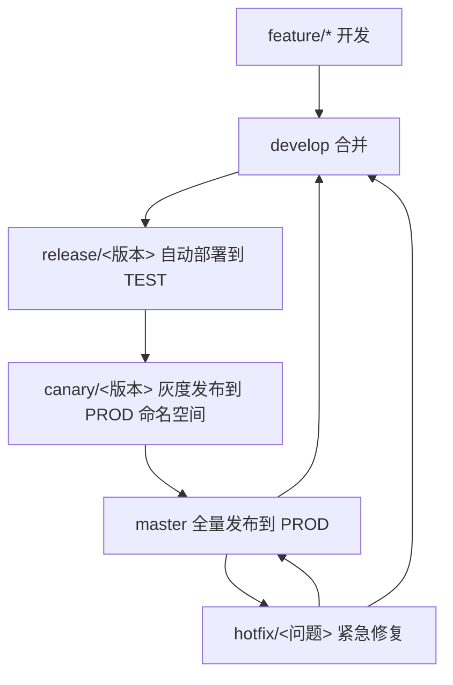
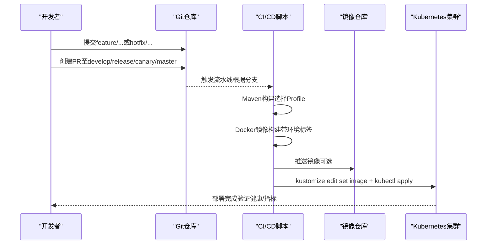
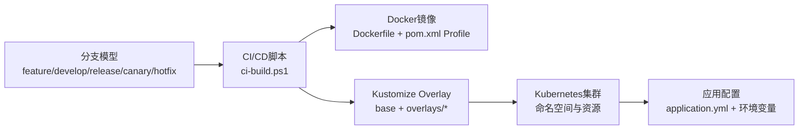

# Git工作流

<cite>
**本文引用的文件**
- [README.md](file://README.md)
- [DEPLOYMENT.md](file://DEPLOYMENT.md)
- [Dockerfile](file://Dockerfile)
- [pom.xml](file://pom.xml)
- [ci-build.ps1](file://ci-build.ps1)
- [k8s/base/kustomization.yaml](file://k8s/base/kustomization.yaml)
- [k8s/base/deployment.yaml](file://k8s/base/deployment.yaml)
- [k8s/base/configmap.yaml](file://k8s/base/configmap.yaml)
- [k8s/base/secret.yaml](file://k8s/base/secret.yaml)
- [k8s/overlays/dev/kustomization.yaml](file://k8s/overlays/dev/kustomization.yaml)
- [k8s/overlays/test/kustomization.yaml](file://k8s/overlays/test/kustomization.yaml)
- [k8s/overlays/canary/kustomization.yaml](file://k8s/overlays/canary/kustomization.yaml)
- [k8s/overlays/prod/kustomization.yaml](file://k8s/overlays/prod/kustomization.yaml)
- [src/main/resources/application.yml](file://src/main/resources/application.yml)
- [.gitignore](file://.gitignore)
</cite>

## 目录
1. [简介](#简介)
2. [项目结构](#项目结构)
3. [核心组件](#核心组件)
4. [架构总览](#架构总览)
5. [详细组件分析](#详细组件分析)
6. [依赖分析](#依赖分析)
7. [性能考虑](#性能考虑)
8. [故障排查指南](#故障排查指南)
9. [结论](#结论)
10. [附录](#附录)

## 简介
本文件面向IAM Platform认证服务项目，制定Git工作流规范，明确Git Flow分支模型在本项目中的落地方式，涵盖分支类型、命名规范、分支保护策略、发布流程（含灰度发布）、紧急修复流程、提交信息规范以及版本历史可读性保障措施。同时结合项目现有的Docker镜像构建、Kustomize多环境部署与CI/CD脚本，给出可执行的操作步骤与最佳实践。

## 项目结构
本项目采用多环境配置与容器化部署，核心工作流与部署链路如下：
- 分支模型：采用Git Flow，包含master、develop、release、feature、hotfix五类分支，分别对应PROD、DEV、TEST、开发/预览、紧急修复场景。
- 环境映射：通过Spring Profile与Kustomize Overlay实现四环境（DEV/TEST/CANARY/PROD）隔离与差异化配置。
- 构建与部署：使用Maven构建、Docker镜像化、CI/CD脚本自动化更新Kustomize镜像标签并应用至Kubernetes集群。

图表来源
- [README.md:241-267](file://README.md#L241-L267)
- [DEPLOYMENT.md:134-183](file://DEPLOYMENT.md#L134-L183)

章节来源
- [README.md:228-290](file://README.md#L228-L290)
- [DEPLOYMENT.md:96-123](file://DEPLOYMENT.md#L96-L123)

## 核心组件
- 分支模型与命名规范
  - master：生产分支，禁止直推，必须经PR合并；代表当前线上稳定版本。
  - develop：主开发分支，自动部署到DEV环境，用于联调与集成。
  - release/<版本>：测试分支，自动部署到TEST环境，仅允许缺陷修复，禁止引入新功能。
  - feature/<名称>：功能开发分支，本地开发与PR预览使用，完成后合并回develop。
  - hotfix/<名称>：紧急修复分支，从master创建，修复后同步合并至master与develop。
- 分支保护策略
  - master：禁止直推，必须通过PR合并，至少1人审批。
  - develop：禁止直推，必须通过PR合并。
  - release/*：仅接受缺陷修复提交，不接受新功能。
  - canary/*：仅接受灰度配置调整，不接受功能变更。
- 发布流程
  - feature/* → develop → release/<版本> → canary/<版本> → master
  - QA通过后进入灰度，按5%→20%→50%→100%逐步扩量，观察30分钟以上，无异常则全量发布。
- 紧急修复流程
  - 从master创建hotfix/<名称>，修复并通过验证后，合并到master（PROD）与develop（DEV）；如需灰度，先走canary再全量。
- 提交信息规范
  - 格式：<类型>(<作用域>): <主题>
  - 类型：feat、fix、docs、style、refactor、test、chore
  - 示例：feat(user): add user registration endpoint；fix(auth): resolve PKCE verification failure；chore(deps): upgrade spring boot to 3.2.5

章节来源
- [README.md:228-290](file://README.md#L228-L290)

## 架构总览
下图展示从代码提交到多环境部署的关键路径，体现Git工作流与CI/CD脚本、Kustomize Overlay及Kubernetes之间的关系。

图表来源
- [ci-build.ps1:129-215](file://ci-build.ps1#L129-L215)
- [pom.xml:184-223](file://pom.xml#L184-L223)
- [Dockerfile:37-39](file://Dockerfile#L37-L39)
- [k8s/overlays/dev/kustomization.yaml:11-22](file://k8s/overlays/dev/kustomization.yaml#L11-L22)
- [k8s/overlays/prod/kustomization.yaml:14-49](file://k8s/overlays/prod/kustomization.yaml#L14-L49)

## 详细组件分析

### 分支模型与命名规范
- 分支类型与职责
  - master：生产基线，承载当前线上版本。
  - develop：集成与联调，自动部署至DEV。
  - release/<版本>：QA测试，自动部署至TEST，仅允许缺陷修复。
  - feature/<名称>：功能开发，完成后合并至develop。
  - hotfix/<名称>：紧急修复，从master创建，修复后同步合并至master与develop。
- 命名规范
  - feature与hotfix使用语义化名称，避免过长；release使用语义化版本号。
- 合并与保护
  - 除master/develop外，其他分支均通过PR合并；master/develop禁止直推。
  - release/*与canary/*严格限制变更内容，防止功能漂移。

章节来源
- [README.md:230-274](file://README.md#L230-L274)

### 灰度发布流程
- 步骤
  - 在release/<版本>通过QA后，创建canary/<版本>分支并部署至PROD命名空间（复用prod命名空间，使用canary-前缀区分）。
  - 按5%→20%→50%→100%逐步扩量，每阶段观察至少30分钟，监控错误率、延迟与资源使用。
  - 若发现问题，立即回滚至上一稳定版本；若全量通过，删除canary资源。
- 环境与配置
  - canary环境使用独立镜像标签（<版本>-canary），并为Deployment添加canary=true标签以便分流。
  - 生产命名空间（iam-platform-prod）中，PROD副本数与资源请求/限制在Overlay中配置。

章节来源
- [README.md:255-261](file://README.md#L255-L261)
- [DEPLOYMENT.md:169-183](file://DEPLOYMENT.md#L169-L183)
- [k8s/overlays/canary/kustomization.yaml:14-29](file://k8s/overlays/canary/kustomization.yaml#L14-L29)
- [k8s/overlays/prod/kustomization.yaml:32-49](file://k8s/overlays/prod/kustomization.yaml#L32-L49)

### 紧急修复流程
- 步骤
  - 从master创建hotfix/<名称>，修复并通过验证。
  - 合并至master（PROD）与develop（DEV）；如需灰度，先走canary再全量。
- 合并策略
  - hotfix完成后同步合并回develop，保证后续release基于最新修复版本。

章节来源
- [README.md:262-267](file://README.md#L262-L267)

### 提交信息规范与版本历史可读性
- 规范
  - 格式：<类型>(<作用域>): <主题>
  - 类型：feat、fix、docs、style、refactor、test、chore
- 价值
  - 便于生成CHANGELOG与版本号语义化（配合CI/CD自动打标签）。
  - 便于回溯问题与审计，提升协作效率。

章节来源
- [README.md:275-289](file://README.md#L275-L289)

### CI/CD与多环境部署
- CI/CD脚本（ci-build.ps1）
  - 支持dev/test/canary/prod四个环境，自动解析版本（Git tag或pom版本），构建镜像并可选推送与部署。
  - 使用kustomize edit set image动态更新Overlay中的镜像标签，然后kubectl apply应用。
- Docker镜像与Spring Profile
  - Dockerfile通过ARG SPRING_PROFILE传入环境，pom.xml中各Profile映射不同镜像标签后缀。
- Kustomize Overlay
  - base定义通用资源；overlays/dev/test/canary/prod分别覆盖命名空间、镜像标签与特定配置（如PROD副本数与资源限制）。
- 应用配置
  - application.yml通过环境变量注入数据库、Redis、JWK、加密密钥、OIDC Issuer等配置，Actuator暴露健康/指标端点。

章节来源
- [ci-build.ps1:77-92](file://ci-build.ps1#L77-L92)
- [ci-build.ps1:110-115](file://ci-build.ps1#L110-L115)
- [ci-build.ps1:129-144](file://ci-build.ps1#L129-L144)
- [ci-build.ps1:155-160](file://ci-build.ps1#L155-L160)
- [ci-build.ps1:184-211](file://ci-build.ps1#L184-L211)
- [Dockerfile:37-39](file://Dockerfile#L37-L39)
- [pom.xml:184-223](file://pom.xml#L184-L223)
- [k8s/base/kustomization.yaml:1-11](file://k8s/base/kustomization.yaml#L1-L11)
- [k8s/overlays/dev/kustomization.yaml:4-22](file://k8s/overlays/dev/kustomization.yaml#L4-L22)
- [k8s/overlays/prod/kustomization.yaml:4-49](file://k8s/overlays/prod/kustomization.yaml#L4-L49)
- [src/main/resources/application.yml:1-78](file://src/main/resources/application.yml#L1-L78)

## 依赖分析
- 组件耦合
  - 分支模型与CI/CD脚本耦合：脚本依据分支选择Profile与Overlay，驱动镜像标签与部署目标。
  - CI/CD与Kustomize耦合：脚本通过kustomize edit set image更新镜像，再kubectl apply。
  - 配置与环境耦合：application.yml通过环境变量注入，Kustomize Overlay覆盖关键配置。
- 外部依赖
  - Docker镜像仓库：用于推送/拉取镜像。
  - Kubernetes集群：承载四环境部署与滚动更新/回滚。
- 潜在风险
  - 灰度与生产配置差异导致的回归；分支保护缺失引发的直推风险；提交信息不规范导致的版本历史混乱。

图表来源
- [ci-build.ps1:129-215](file://ci-build.ps1#L129-L215)
- [Dockerfile:37-39](file://Dockerfile#L37-L39)
- [pom.xml:184-223](file://pom.xml#L184-L223)
- [k8s/base/kustomization.yaml:1-11](file://k8s/base/kustomization.yaml#L1-L11)
- [k8s/overlays/dev/kustomization.yaml:4-22](file://k8s/overlays/dev/kustomization.yaml#L4-L22)
- [k8s/overlays/prod/kustomization.yaml:4-49](file://k8s/overlays/prod/kustomization.yaml#L4-L49)
- [src/main/resources/application.yml:1-78](file://src/main/resources/application.yml#L1-L78)

章节来源
- [ci-build.ps1:129-215](file://ci-build.ps1#L129-L215)
- [pom.xml:184-223](file://pom.xml#L184-L223)
- [k8s/overlays/dev/kustomization.yaml:4-22](file://k8s/overlays/dev/kustomization.yaml#L4-L22)
- [k8s/overlays/prod/kustomization.yaml:4-49](file://k8s/overlays/prod/kustomization.yaml#L4-L49)
- [src/main/resources/application.yml:1-78](file://src/main/resources/application.yml#L1-L78)

## 性能考虑
- 构建性能
  - 使用Maven离线下载与缓存目录，减少依赖下载时间。
  - Docker BuildKit缓存Maven本地仓库，避免重复编译。
- 部署性能
  - PROD环境副本数与资源限制在Overlay中集中配置，便于弹性伸缩与资源隔离。
  - 健康探针与启动探针降低冷启动与滚动更新失败概率。
- 观测性
  - Actuator暴露健康、指标与Prometheus端点，便于灰度阶段监控与回滚决策。

章节来源
- [Dockerfile:24-31](file://Dockerfile#L24-L31)
- [k8s/base/deployment.yaml:37-54](file://k8s/base/deployment.yaml#L37-L54)
- [k8s/overlays/prod/kustomization.yaml:32-49](file://k8s/overlays/prod/kustomization.yaml#L32-L49)
- [src/main/resources/application.yml:63-78](file://src/main/resources/application.yml#L63-L78)

## 故障排查指南
- 常见问题定位
  - 部署失败：检查CI/CD脚本输出、Kustomize镜像更新是否成功、kubectl apply返回状态。
  - 健康检查失败：查看Pod日志、健康端点返回、数据库/Redis连接信息。
  - 灰度异常：核对canary标签与流量分流配置、监控错误率与延迟。
- 回滚策略
  - Kubernetes回滚：使用kubectl rollout undo恢复到上一或指定版本。
  - 重新部署指定版本：通过Kustomize Overlay设置目标镜像版本并应用。
- 配置校验
  - 确认环境变量（DB/Redis/JWK/Encryption/OIDC Issuer）在对应Overlay中正确注入。
  - 确认Secret与ConfigMap在目标命名空间中存在且值正确。

章节来源
- [DEPLOYMENT.md:185-198](file://DEPLOYMENT.md#L185-L198)
- [k8s/base/secret.yaml:1-11](file://k8s/base/secret.yaml#L1-L11)
- [k8s/base/configmap.yaml:1-14](file://k8s/base/configmap.yaml#L1-L14)
- [src/main/resources/application.yml:1-78](file://src/main/resources/application.yml#L1-L78)

## 结论
本规范以Git Flow为核心，结合CI/CD脚本与Kustomize多环境部署，形成从feature开发到master发布的完整闭环，并提供灰度发布与紧急修复的标准化流程。通过严格的分支保护、提交信息规范与配置分离，确保版本历史清晰、发布可控、运维可观测。

## 附录
- 环境与镜像标签映射
  - DEV：镜像标签为<版本>-dev；Overlay命名空间为iam-platform-dev。
  - TEST：镜像标签为<版本>-test；自动部署至iam-platform-test。
  - CANARY：镜像标签为<版本>-canary；命名空间复用iam-platform-prod，使用canary-前缀区分。
  - PROD：镜像标签为<版本>；副本数与资源在Overlay中配置。
- 提交信息示例
  - feat(user): add user registration endpoint
  - fix(auth): resolve PKCE verification failure
  - chore(deps): upgrade spring boot to 3.2.5

章节来源
- [README.md:322-332](file://README.md#L322-L332)
- [README.md:275-289](file://README.md#L275-L289)
- [k8s/overlays/dev/kustomization.yaml:4-13](file://k8s/overlays/dev/kustomization.yaml#L4-L13)
- [k8s/overlays/canary/kustomization.yaml:4-12](file://k8s/overlays/canary/kustomization.yaml#L4-L12)
- [k8s/overlays/prod/kustomization.yaml:4-12](file://k8s/overlays/prod/kustomization.yaml#L4-L12)