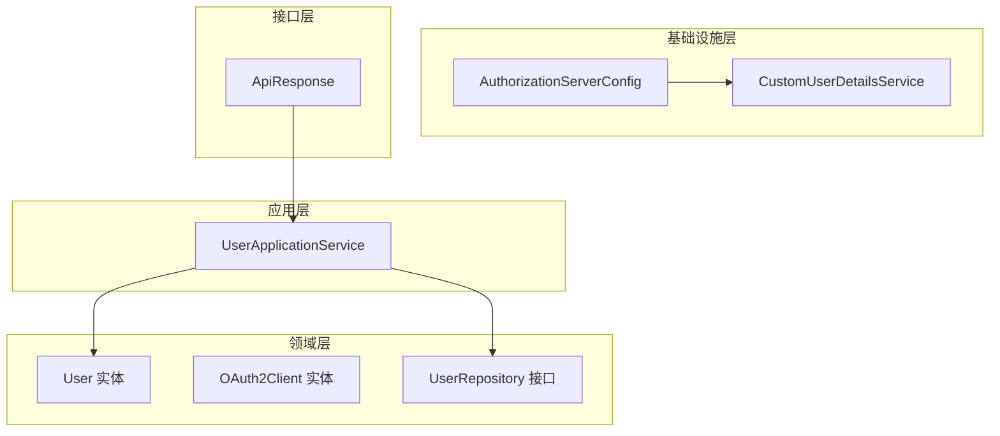
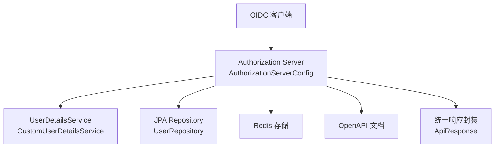
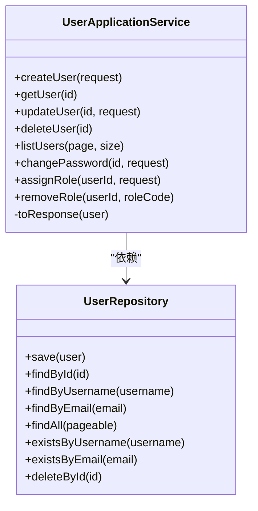
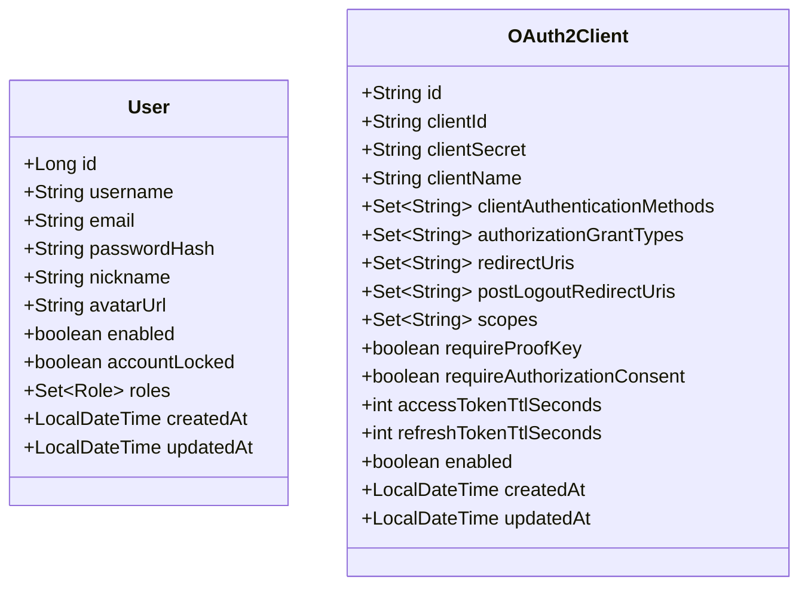
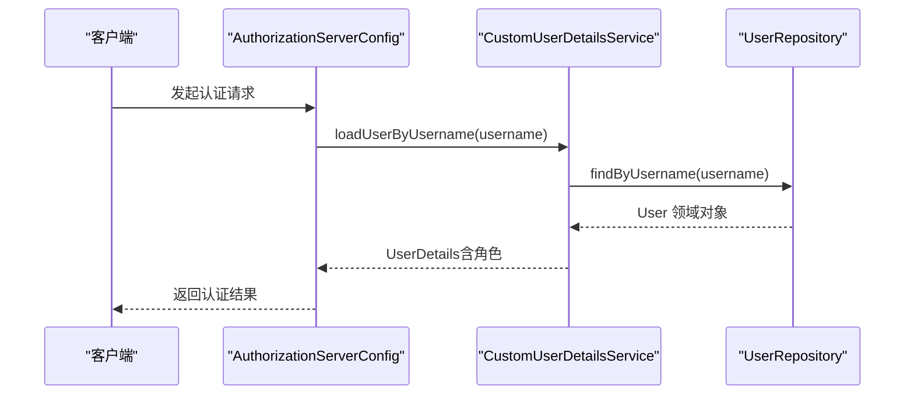
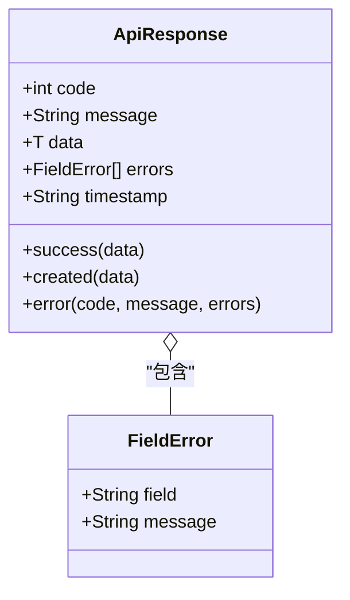
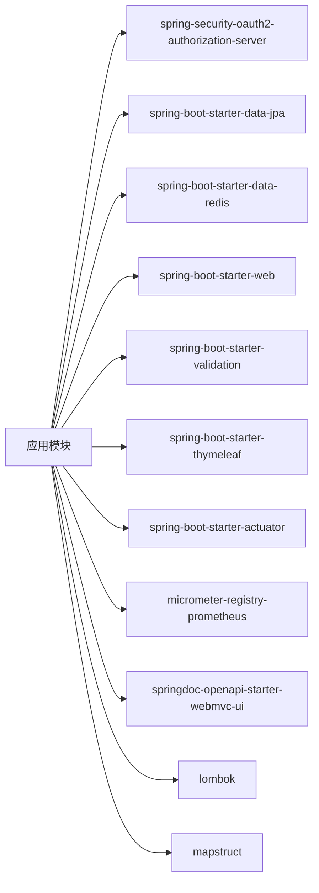

# 代码规范

<cite>
**本文引用的文件**
- [SsoOidcApplication.java](file://src/main/java/sso/oidc/SsoOidcApplication.java)
- [pom.xml](file://pom.xml)
- [README.md](file://README.md)
- [UserApplicationService.java](file://src/main/java/sso/oidc/application/service/UserApplicationService.java)
- [User.java](file://src/main/java/sso/oidc/domain/model/entity/User.java)
- [OAuth2Client.java](file://src/main/java/sso/oidc/domain/model/entity/OAuth2Client.java)
- [CustomUserDetailsService.java](file://src/main/java/sso/oidc/infrastructure/security/CustomUserDetailsService.java)
- [ApiResponse.java](file://src/main/java/sso/oidc/interfaces/rest/common/ApiResponse.java)
- [CreateUserRequest.java](file://src/main/java/sso/oidc/application/dto/request/CreateUserRequest.java)
- [UserRepository.java](file://src/main/java/sso/oidc/domain/repository/UserRepository.java)
- [AuthorizationServerConfig.java](file://src/main/java/sso/oidc/infrastructure/config/AuthorizationServerConfig.java)
- [application.yml](file://src/main/resources/application.yml)
</cite>

## 目录
1. [引言](#引言)
2. [项目结构](#项目结构)
3. [核心组件](#核心组件)
4. [架构总览](#架构总览)
5. [详细组件分析](#详细组件分析)
6. [依赖分析](#依赖分析)
7. [性能考虑](#性能考虑)
8. [故障排查指南](#故障排查指南)
9. [结论](#结论)
10. [附录](#附录)

## 引言
本文件面向IAM Platform认证服务的Java代码编写，旨在建立统一的代码规范，涵盖命名规范、代码风格、注释规范、Lombok注解最佳实践、代码格式化与IDE配置建议，以提升团队协作效率与代码质量。

## 项目结构
项目采用分层架构（应用层、领域层、基础设施层、接口层），结合Spring Authorization Server实现OIDC Provider能力，并通过Spring Security、Redis、PostgreSQL、Flyway等技术栈支撑用户管理、OAuth2客户端管理、角色管理与安全控制。

图表来源
- [UserApplicationService.java:1-165](file://src/main/java/sso/oidc/application/service/UserApplicationService.java#L1-L165)
- [User.java:1-40](file://src/main/java/sso/oidc/domain/model/entity/User.java#L1-L40)
- [OAuth2Client.java:1-73](file://src/main/java/sso/oidc/domain/model/entity/OAuth2Client.java#L1-L73)
- [UserRepository.java:1-26](file://src/main/java/sso/oidc/domain/repository/UserRepository.java#L1-L26)
- [AuthorizationServerConfig.java:1-144](file://src/main/java/sso/oidc/infrastructure/config/AuthorizationServerConfig.java#L1-L144)
- [CustomUserDetailsService.java:1-41](file://src/main/java/sso/oidc/infrastructure/security/CustomUserDetailsService.java#L1-L41)
- [ApiResponse.java:1-61](file://src/main/java/sso/oidc/interfaces/rest/common/ApiResponse.java#L1-L61)

章节来源
- [README.md:104-139](file://README.md#L104-L139)

## 核心组件
- 命名规范
  - 类名：PascalCase（例如：UserApplicationService）
  - 方法名：camelCase（例如：createUser）
  - 变量名：camelCase（例如：userId）
  - 常量名：UPPER_SNAKE_CASE（例如：MAX_LOGIN_ATTEMPTS）
- 代码风格
  - 方法长度不超过50行；类长度不超过500行
  - 使用Lombok减少样板代码（@RequiredArgsConstructor、@Getter等）
- 注释规范
  - 类注释、方法注释、参数注释遵循标准格式
- API设计
  - 统一返回标准响应结构（成功/创建/错误），包含code、message、data、errors、timestamp等字段

章节来源
- [README.md:141-185](file://README.md#L141-L185)
- [UserApplicationService.java:1-165](file://src/main/java/sso/oidc/application/service/UserApplicationService.java#L1-L165)
- [ApiResponse.java:1-61](file://src/main/java/sso/oidc/interfaces/rest/common/ApiResponse.java#L1-L61)

## 架构总览
系统围绕Spring Authorization Server构建OIDC Provider，结合自定义UserDetailsService完成用户认证，使用JPA与Redis支撑持久化与会话管理，通过OpenAPI提供接口文档。

图表来源
- [AuthorizationServerConfig.java:1-144](file://src/main/java/sso/oidc/infrastructure/config/AuthorizationServerConfig.java#L1-L144)
- [CustomUserDetailsService.java:1-41](file://src/main/java/sso/oidc/infrastructure/security/CustomUserDetailsService.java#L1-L41)
- [UserRepository.java:1-26](file://src/main/java/sso/oidc/domain/repository/UserRepository.java#L1-L26)
- [ApiResponse.java:1-61](file://src/main/java/sso/oidc/interfaces/rest/common/ApiResponse.java#L1-L61)
- [application.yml:1-78](file://src/main/resources/application.yml#L1-L78)

## 详细组件分析

### 应用服务：UserApplicationService
- 职责
  - 用户创建、查询、更新、删除、分页列表、密码修改、角色分配与移除
  - 事务边界与日志记录
- 关键点
  - 使用@RequiredArgsConstructor注入依赖
  - 方法长度控制在50行以内，便于维护
  - 通过领域异常与业务策略（密码策略）保证数据一致性

图表来源
- [UserApplicationService.java:1-165](file://src/main/java/sso/oidc/application/service/UserApplicationService.java#L1-L165)
- [UserRepository.java:1-26](file://src/main/java/sso/oidc/domain/repository/UserRepository.java#L1-L26)

章节来源
- [UserApplicationService.java:1-165](file://src/main/java/sso/oidc/application/service/UserApplicationService.java#L1-L165)
- [UserRepository.java:1-26](file://src/main/java/sso/oidc/domain/repository/UserRepository.java#L1-L26)

### 领域模型：User 与 OAuth2Client
- User
  - 使用@Data/@Builder/@NoArgsConstructor/@AllArgsConstructor简化对象构造与访问器
  - 对空集合进行惰性初始化，避免NPE
- OAuth2Client
  - 同样采用Lombok注解，对集合属性提供默认空集行为

图表来源
- [User.java:1-40](file://src/main/java/sso/oidc/domain/model/entity/User.java#L1-L40)
- [OAuth2Client.java:1-73](file://src/main/java/sso/oidc/domain/model/entity/OAuth2Client.java#L1-L73)

章节来源
- [User.java:1-40](file://src/main/java/sso/oidc/domain/model/entity/User.java#L1-L40)
- [OAuth2Client.java:1-73](file://src/main/java/sso/oidc/domain/model/entity/OAuth2Client.java#L1-L73)

### 安全配置：AuthorizationServerConfig 与 CustomUserDetailsService
- AuthorizationServerConfig
  - 配置OIDC Provider安全链路、JWT解码器、JWK源、授权设置
  - 提供内存注册客户端示例，便于演示与测试
- CustomUserDetailsService
  - 实现UserDetailsService，按用户名加载用户并构建Spring Security UserDetails

图表来源
- [AuthorizationServerConfig.java:1-144](file://src/main/java/sso/oidc/infrastructure/config/AuthorizationServerConfig.java#L1-L144)
- [CustomUserDetailsService.java:1-41](file://src/main/java/sso/oidc/infrastructure/security/CustomUserDetailsService.java#L1-L41)
- [UserRepository.java:1-26](file://src/main/java/sso/oidc/domain/repository/UserRepository.java#L1-L26)

章节来源
- [AuthorizationServerConfig.java:1-144](file://src/main/java/sso/oidc/infrastructure/config/AuthorizationServerConfig.java#L1-L144)
- [CustomUserDetailsService.java:1-41](file://src/main/java/sso/oidc/infrastructure/security/CustomUserDetailsService.java#L1-L41)
- [UserRepository.java:1-26](file://src/main/java/sso/oidc/domain/repository/UserRepository.java#L1-L26)

### 统一响应：ApiResponse
- 提供success、created、error静态工厂方法
- 支持时间戳、错误字段集合、JSON序列化控制（非空字段）

图表来源
- [ApiResponse.java:1-61](file://src/main/java/sso/oidc/interfaces/rest/common/ApiResponse.java#L1-L61)

章节来源
- [ApiResponse.java:1-61](file://src/main/java/sso/oidc/interfaces/rest/common/ApiResponse.java#L1-L61)

### 请求对象：CreateUserRequest
- 使用Jakarta Validation注解进行参数校验
- 与应用服务配合完成输入约束与错误提示

章节来源
- [CreateUserRequest.java:1-31](file://src/main/java/sso/oidc/application/dto/request/CreateUserRequest.java#L1-L31)

## 依赖分析
- 构建与编译
  - Java 21、Spring Boot 3.2.5、Lombok、MapStruct、Maven编译插件配置
- 运行时依赖
  - Spring Security OAuth2 Authorization Server、PostgreSQL、Redis、Flyway、Actuator/Micrometer、Springdoc OpenAPI
- 依赖关系图

图表来源
- [pom.xml:1-225](file://pom.xml#L1-L225)

章节来源
- [pom.xml:1-225](file://pom.xml#L1-L225)

## 性能考虑
- 事务边界明确，避免长事务占用数据库连接
- 使用分页查询（PageRequest）处理大数据量列表
- Redis缓存会话与短期令牌，降低数据库压力
- 合理设置连接池参数（最大连接数、空闲超时、最大生命周期）
- 启用Prometheus指标与Zipkin链路追踪，便于性能观测

章节来源
- [UserApplicationService.java:103-110](file://src/main/java/sso/oidc/application/service/UserApplicationService.java#L103-L110)
- [application.yml:13-18](file://src/main/resources/application.yml#L13-L18)
- [application.yml:63-78](file://src/main/resources/application.yml#L63-L78)

## 故障排查指南
- 认证失败
  - 检查UserDetailsService是否正确加载用户与角色
  - 核对JWT解码器与JWK源配置
- 参数校验失败
  - 查看CreateUserRequest等请求对象的校验注解与错误消息
- 统一响应异常
  - 确认错误响应结构与状态码映射
- 数据库与会话问题
  - 检查DataSource、Redis连接配置与Flyway迁移脚本

章节来源
- [CustomUserDetailsService.java:22-39](file://src/main/java/sso/oidc/infrastructure/security/CustomUserDetailsService.java#L22-L39)
- [AuthorizationServerConfig.java:93-117](file://src/main/java/sso/oidc/infrastructure/config/AuthorizationServerConfig.java#L93-L117)
- [CreateUserRequest.java:16-26](file://src/main/java/sso/oidc/application/dto/request/CreateUserRequest.java#L16-L26)
- [ApiResponse.java:43-50](file://src/main/java/sso/oidc/interfaces/rest/common/ApiResponse.java#L43-L50)
- [application.yml:9-31](file://src/main/resources/application.yml#L9-L31)

## 结论
本规范以现有代码库为基础，明确了命名、风格、注释与Lombok使用标准，并结合实际组件与配置给出落地建议。建议在团队内推广并持续演进，确保代码一致性与可维护性。

## 附录

### 命名规范与代码风格清单
- 类名：PascalCase（如：UserApplicationService）
- 方法名：camelCase（如：createUser）
- 变量名：camelCase（如：userId）
- 常量名：UPPER_SNAKE_CASE（如：MAX_LOGIN_ATTEMPTS）
- 方法长度：≤50行
- 类长度：≤500行
- 注释：类注释、方法注释、参数注释遵循标准格式
- Lombok：优先使用@RequiredArgsConstructor、@Data、@Builder、@NoArgsConstructor、@AllArgsConstructor

章节来源
- [README.md:141-185](file://README.md#L141-L185)
- [UserApplicationService.java:26-28](file://src/main/java/sso/oidc/application/service/UserApplicationService.java#L26-L28)
- [User.java:13-16](file://src/main/java/sso/oidc/domain/model/entity/User.java#L13-L16)
- [OAuth2Client.java:13-16](file://src/main/java/sso/oidc/domain/model/entity/OAuth2Client.java#L13-L16)

### Lombok注解最佳实践
- @RequiredArgsConstructor：为不可变依赖生成构造函数，减少样板代码
- @Data：生成getter/setter/equals/hashCode/toString，适用于DTO与实体
- @Builder：支持链式构建，便于测试与装配
- @NoArgsConstructor/@AllArgsConstructor：满足JPA/序列化需求
- 注意：避免过度使用，保持可读性与职责清晰

章节来源
- [UserApplicationService.java:3-28](file://src/main/java/sso/oidc/application/service/UserApplicationService.java#L3-L28)
- [User.java:13-16](file://src/main/java/sso/oidc/domain/model/entity/User.java#L13-L16)
- [OAuth2Client.java:13-16](file://src/main/java/sso/oidc/domain/model/entity/OAuth2Client.java#L13-L16)
- [CustomUserDetailsService.java:3-16](file://src/main/java/sso/oidc/infrastructure/security/CustomUserDetailsService.java#L3-L16)
- [ApiResponse.java:13-17](file://src/main/java/sso/oidc/interfaces/rest/common/ApiResponse.java#L13-L17)

### 代码格式化与IDE配置建议
- IDE推荐
  - IntelliJ IDEA：启用Lombok插件、MapStruct支持
  - VS Code：安装Java扩展包、Save Actions插件
- 格式化规则
  - 统一缩进（4空格）、行宽120字符
  - 导入排序：标准库优先、空行分组
  - 注释风格：类/方法顶部Javadoc、参数与返回值说明
- 构建与编译
  - Maven编译插件开启-Xlint警告与注解处理器路径配置
  - Lombok在spring-boot-maven-plugin中排除，避免打包携带

章节来源
- [pom.xml:156-180](file://pom.xml#L156-L180)
- [SsoOidcApplication.java:1-13](file://src/main/java/sso/oidc/SsoOidcApplication.java#L1-L13)