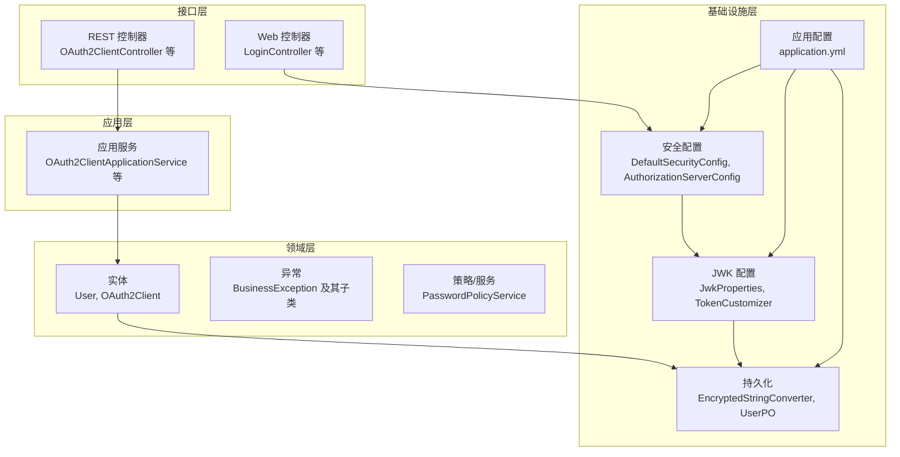
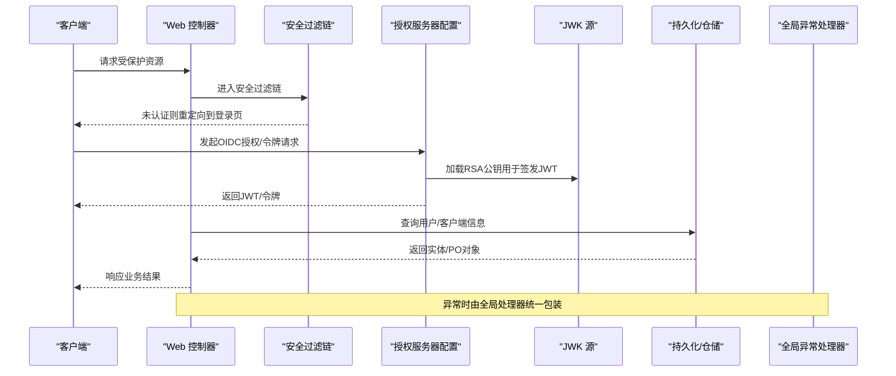
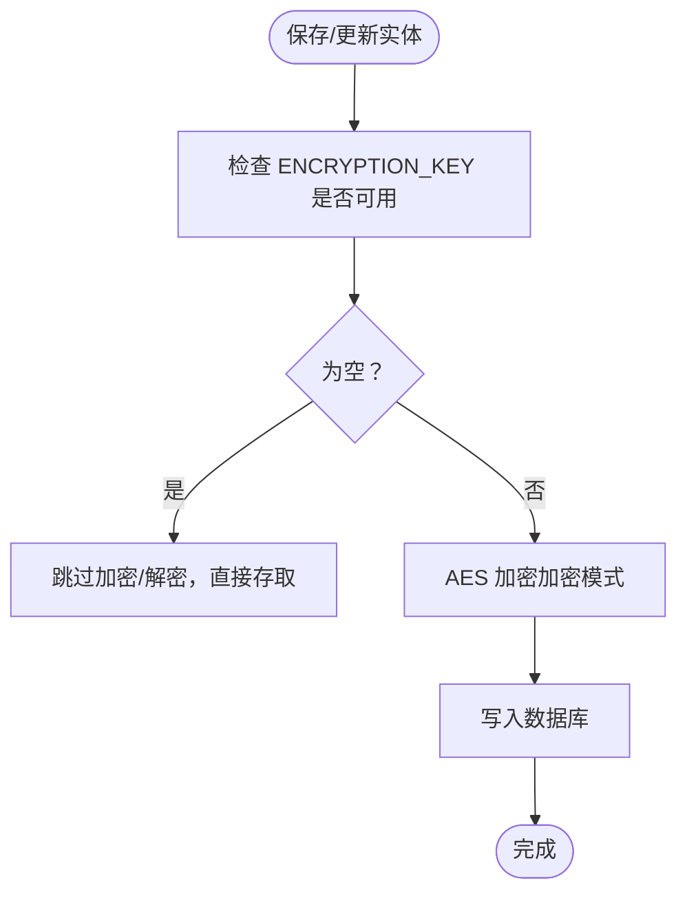
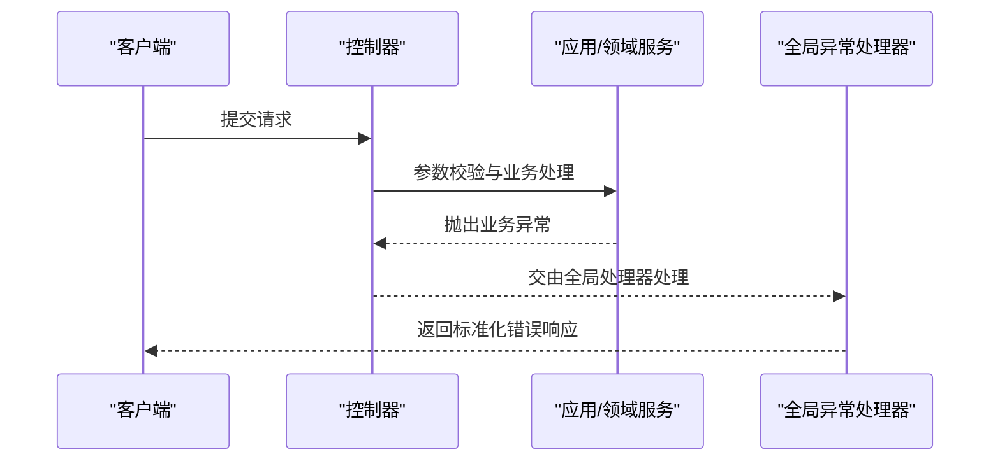
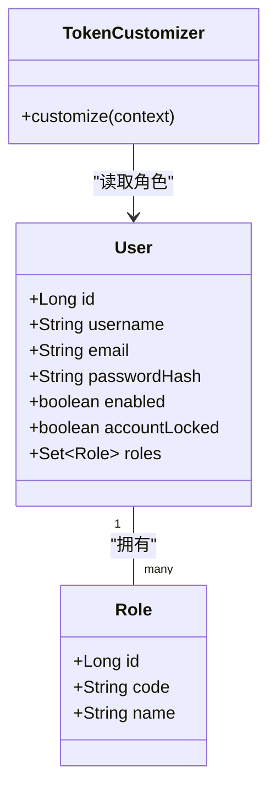
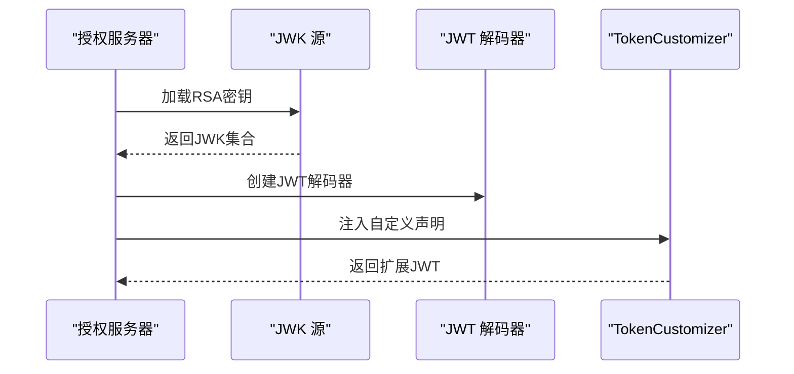
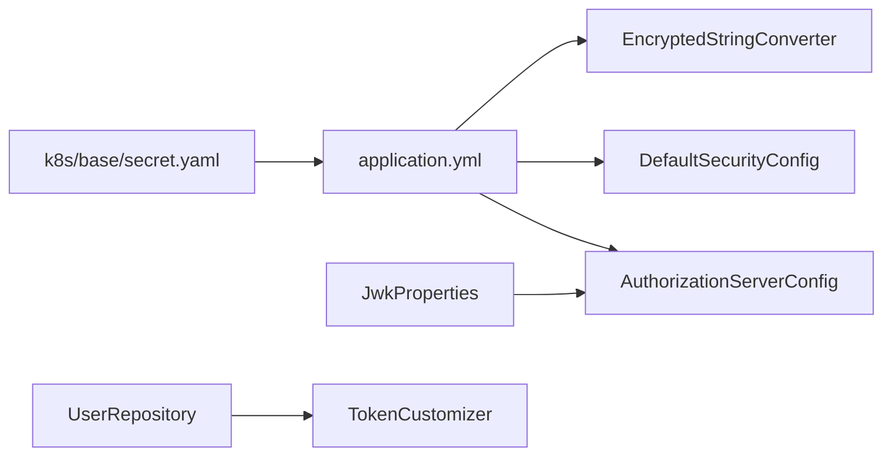

# 安全规范

<cite>
**本文引用的文件**
- [DefaultSecurityConfig.java](file://src/main/java/sso/oidc/infrastructure/config/DefaultSecurityConfig.java)
- [AuthorizationServerConfig.java](file://src/main/java/sso/oidc/infrastructure/config/AuthorizationServerConfig.java)
- [JwkProperties.java](file://src/main/java/sso/oidc/infrastructure/config/JwkProperties.java)
- [EncryptedStringConverter.java](file://src/main/java/sso/oidc/infrastructure/persistence/converter/EncryptedStringConverter.java)
- [application.yml](file://src/main/resources/application.yml)
- [V1__init_schema.sql](file://src/main/resources/db/migration/V1__init_schema.sql)
- [GlobalExceptionHandler.java](file://src/main/java/sso/oidc/interfaces/rest/common/GlobalExceptionHandler.java)
- [BusinessException.java](file://src/main/java/sso/oidc/domain/model/exception/BusinessException.java)
- [PasswordPolicyService.java](file://src/main/java/sso/oidc/domain/service/PasswordPolicyService.java)
- [TokenCustomizer.java](file://src/main/java/sso/oidc/infrastructure/security/TokenCustomizer.java)
- [User.java](file://src/main/java/sso/oidc/domain/model/entity/User.java)
- [OAuth2Client.java](file://src/main/java/sso/oidc/domain/model/entity/OAuth2Client.java)
- [UserPO.java](file://src/main/java/sso/oidc/infrastructure/persistence/entity/UserPO.java)
- [LoginController.java](file://src/main/java/sso/oidc/interfaces/web/LoginController.java)
- [secret.yaml](file://k8s/base/secret.yaml)
</cite>

## 目录
1. 引言
2. 项目结构
3. 核心组件
4. 架构总览
5. 详细组件分析
6. 依赖分析
7. 性能考虑
8. 故障排查指南
9. 结论
10. 附录

## 引言
本安全规范面向IAM Platform认证服务，聚焦于敏感数据保护、OWASP Top 10防护、输入验证与错误处理、访问控制与权限管理、JWT安全配置等关键领域。通过对代码库中实际实现的梳理，形成可落地的安全实践与检查清单，帮助在开发、测试与生产环境中持续遵循最佳安全实践。

## 项目结构
系统采用分层架构：接口层（web/rest）、应用层（DTO/Service）、领域层（实体/仓储/异常）、基础设施层（配置/持久化/安全）。安全相关的关键位置包括：
- 安全配置：Spring Security过滤链、OAuth2授权服务器配置、JWK加载与JWT解码器
- 数据持久化：属性转换器对敏感字段进行AES加解密；数据库表结构定义敏感列
- 错误处理：全局异常处理器统一返回结构，避免泄漏内部细节
- 访问控制：基于路径的放行策略、登录入口与会话存储

图表来源
- [DefaultSecurityConfig.java:1-43](file://src/main/java/sso/oidc/infrastructure/config/DefaultSecurityConfig.java#L1-L43)
- [AuthorizationServerConfig.java:1-142](file://src/main/java/sso/oidc/infrastructure/config/AuthorizationServerConfig.java#L1-L142)
- [EncryptedStringConverter.java:1-52](file://src/main/java/sso/oidc/infrastructure/persistence/converter/EncryptedStringConverter.java#L1-L52)
- [application.yml:1-78](file://src/main/resources/application.yml#L1-L78)

章节来源
- [DefaultSecurityConfig.java:1-43](file://src/main/java/sso/oidc/infrastructure/config/DefaultSecurityConfig.java#L1-L43)
- [AuthorizationServerConfig.java:1-142](file://src/main/java/sso/oidc/infrastructure/config/AuthorizationServerConfig.java#L1-L142)
- [application.yml:1-78](file://src/main/resources/application.yml#L1-L78)

## 核心组件
- 密码编码与校验：使用BCryptPasswordEncoder进行密码哈希存储与比对，保障不可逆性与抗彩虹表能力
- OAuth2客户端密钥保护：通过属性转换器对client_secret进行AES加解密存储，密钥由环境变量提供
- JWT与JWK：基于RSA密钥对生成JWK集合，使用RS256算法签发与验证JWT
- 全局异常处理：统一封装错误响应，避免泄露堆栈或内部细节
- 数据库连接：通过配置文件设置数据源参数，建议结合SSL连接与凭证管理

章节来源
- [DefaultSecurityConfig.java:38-41](file://src/main/java/sso/oidc/infrastructure/config/DefaultSecurityConfig.java#L38-L41)
- [EncryptedStringConverter.java:6-52](file://src/main/java/sso/oidc/infrastructure/persistence/converter/EncryptedStringConverter.java#L1-L52)
- [AuthorizationServerConfig.java:93-118](file://src/main/java/sso/oidc/infrastructure/config/AuthorizationServerConfig.java#L93-L118)
- [GlobalExceptionHandler.java:16-67](file://src/main/java/sso/oidc/interfaces/rest/common/GlobalExceptionHandler.java#L1-L67)
- [application.yml:9-18](file://src/main/resources/application.yml#L9-L18)

## 架构总览
下图展示安全相关组件之间的交互关系：安全过滤链负责路径级访问控制与登录流程；授权服务器配置负责OIDC端点、令牌设置与JWK；持久化层对敏感字段进行AES加解密；全局异常处理器统一输出。

图表来源
- [DefaultSecurityConfig.java:19-36](file://src/main/java/sso/oidc/infrastructure/config/DefaultSecurityConfig.java#L19-L36)
- [AuthorizationServerConfig.java:50-67](file://src/main/java/sso/oidc/infrastructure/config/AuthorizationServerConfig.java#L50-L67)
- [TokenCustomizer.java:14-34](file://src/main/java/sso/oidc/infrastructure/security/TokenCustomizer.java#L1-L34)
- [GlobalExceptionHandler.java:16-67](file://src/main/java/sso/oidc/interfaces/rest/common/GlobalExceptionHandler.java#L1-L67)

## 详细组件分析

### 敏感数据保护
- OAuth2 Client Secret的AES加密存储
  - 实现方式：属性转换器在持久化前加密、读取后解密
  - 存储列注释：明确标记client_secret为“AES加密”
  - 环境密钥：ENCRYPTION_KEY来自环境变量，需在部署时替换
- 用户密码的BCrypt单向加密
  - 存储字段：t_user.password_hash
  - 编码器：BCryptPasswordEncoder
- 数据库连接
  - 数据源参数：URL、用户名、密码
  - 建议：启用SSL连接与只读账户、最小权限

图表来源
- [EncryptedStringConverter.java:11-33](file://src/main/java/sso/oidc/infrastructure/persistence/converter/EncryptedStringConverter.java#L11-L33)
- [V1__init_schema.sql:108](file://src/main/resources/db/migration/V1__init_schema.sql#L108)
- [application.yml:53-55](file://src/main/resources/application.yml#L53-L55)

章节来源
- [EncryptedStringConverter.java:1-52](file://src/main/java/sso/oidc/infrastructure/persistence/converter/EncryptedStringConverter.java#L1-L52)
- [V1__init_schema.sql:108](file://src/main/resources/db/migration/V1__init_schema.sql#L108)
- [application.yml:53-55](file://src/main/resources/application.yml#L53-L55)

### OWASP Top 10防护措施
- SQL注入
  - ORM映射与枚举类型约束：通过实体与PO映射减少原生SQL拼接风险
  - Flyway迁移脚本：集中管理DDL，避免运行时动态构造SQL
- XSS攻击
  - 模板引擎：Thymeleaf模板渲染，建议配合内容安全策略（CSP）
  - 静态资源：/css/**、/js/**、/static/** 明确放行，避免在模板中内联危险内容
- CSRF攻击
  - 表单登录：Spring Security默认提供CSRF保护
  - 资源访问：/login、/register、/oauth2/consent等端点按需放行，避免跨站请求滥用

章节来源
- [DefaultSecurityConfig.java:23-33](file://src/main/java/sso/oidc/infrastructure/config/DefaultSecurityConfig.java#L23-L33)
- [application.yml:41-44](file://src/main/resources/application.yml#L41-L44)
- [V1__init_schema.sql:1-180](file://src/main/resources/db/migration/V1__init_schema.sql#L1-L180)

### 输入验证与错误处理规范
- 输入验证
  - DTO校验：使用Bean Validation在应用层进行参数校验
  - 密码策略：长度与字符集要求由领域服务校验
- 错误处理
  - 统一响应：全局异常处理器封装错误码、HTTP状态与消息
  - 保密性：不向客户端暴露内部异常细节；记录日志但不回显敏感信息
  - 业务异常：继承抽象业务异常类，携带错误码与HTTP状态

图表来源
- [GlobalExceptionHandler.java:16-67](file://src/main/java/sso/oidc/interfaces/rest/common/GlobalExceptionHandler.java#L1-L67)
- [BusinessException.java:1-17](file://src/main/java/sso/oidc/domain/model/exception/BusinessException.java#L1-L17)
- [PasswordPolicyService.java:11-24](file://src/main/java/sso/oidc/domain/service/PasswordPolicyService.java#L1-L35)

章节来源
- [GlobalExceptionHandler.java:16-67](file://src/main/java/sso/oidc/interfaces/rest/common/GlobalExceptionHandler.java#L1-L67)
- [BusinessException.java:1-17](file://src/main/java/sso/oidc/domain/model/exception/BusinessException.java#L1-L17)
- [PasswordPolicyService.java:11-24](file://src/main/java/sso/oidc/domain/service/PasswordPolicyService.java#L1-L35)

### 访问控制与权限管理
- 最小权限原则
  - 登录与注册端点：仅允许匿名访问
  - 其他端点：必须经过身份认证
- RBAC模型
  - 用户角色：User实体包含角色集合
  - JWT声明：TokenCustomizer将角色列表写入JWT
  - 授权决策：可在资源服务器或业务层基于角色进行授权

图表来源
- [User.java:16-36](file://src/main/java/sso/oidc/domain/model/entity/User.java#L1-L36)
- [TokenCustomizer.java:14-34](file://src/main/java/sso/oidc/infrastructure/security/TokenCustomizer.java#L1-L34)

章节来源
- [DefaultSecurityConfig.java:23-33](file://src/main/java/sso/oidc/infrastructure/config/DefaultSecurityConfig.java#L23-L33)
- [User.java:16-36](file://src/main/java/sso/oidc/domain/model/entity/User.java#L1-L36)
- [TokenCustomizer.java:14-34](file://src/main/java/sso/oidc/infrastructure/security/TokenCustomizer.java#L1-L34)

### JWT安全配置标准
- RS256签名算法
  - 使用RSA密钥对生成JWK集合，配置JwtDecoder
  - 私钥/公钥位置由配置项提供，支持classpath与外部文件
- Token生命周期控制
  - 访问令牌与刷新令牌TTL在注册客户端时配置
  - 授权服务器设置issuer
- 声明扩展
  - TokenCustomizer将email、nickname（可选）、roles写入JWT

图表来源
- [AuthorizationServerConfig.java:93-124](file://src/main/java/sso/oidc/infrastructure/config/AuthorizationServerConfig.java#L93-L124)
- [JwkProperties.java:12-15](file://src/main/java/sso/oidc/infrastructure/config/JwkProperties.java#L1-L16)
- [TokenCustomizer.java:14-34](file://src/main/java/sso/oidc/infrastructure/security/TokenCustomizer.java#L1-L34)

章节来源
- [AuthorizationServerConfig.java:72-88](file://src/main/java/sso/oidc/infrastructure/config/AuthorizationServerConfig.java#L72-L88)
- [AuthorizationServerConfig.java:121-124](file://src/main/java/sso/oidc/infrastructure/config/AuthorizationServerConfig.java#L121-L124)
- [JwkProperties.java:12-15](file://src/main/java/sso/oidc/infrastructure/config/JwkProperties.java#L1-L16)
- [TokenCustomizer.java:14-34](file://src/main/java/sso/oidc/infrastructure/security/TokenCustomizer.java#L1-L34)

## 依赖分析
- 配置依赖
  - application.yml提供数据库、Redis、JWK、加密密钥等关键参数
  - Kubernetes Secret用于注入敏感值（数据库凭据、加密密钥）
- 组件耦合
  - AuthorizationServerConfig依赖JwkProperties与ResourceLoader
  - TokenCustomizer依赖UserRepository以读取角色信息
  - EncryptedStringConverter依赖系统环境变量ENCRYPTION_KEY

图表来源
- [application.yml:48-55](file://src/main/resources/application.yml#L48-L55)
- [AuthorizationServerConfig.java:47-48](file://src/main/java/sso/oidc/infrastructure/config/AuthorizationServerConfig.java#L47-L48)
- [TokenCustomizer.java:18](file://src/main/java/sso/oidc/infrastructure/security/TokenCustomizer.java#L18)
- [EncryptedStringConverter.java:9](file://src/main/java/sso/oidc/infrastructure/persistence/converter/EncryptedStringConverter.java#L9)
- [secret.yaml:6-11](file://k8s/base/secret.yaml#L1-L11)

章节来源
- [application.yml:48-55](file://src/main/resources/application.yml#L48-L55)
- [AuthorizationServerConfig.java:47-48](file://src/main/java/sso/oidc/infrastructure/config/AuthorizationServerConfig.java#L47-L48)
- [TokenCustomizer.java:18](file://src/main/java/sso/oidc/infrastructure/security/TokenCustomizer.java#L18)
- [EncryptedStringConverter.java:9](file://src/main/java/sso/oidc/infrastructure/persistence/converter/EncryptedStringConverter.java#L9)
- [secret.yaml:6-11](file://k8s/base/secret.yaml#L1-L11)

## 性能考虑
- 数据库连接池：合理设置最大连接数、空闲超时与生命周期，避免连接泄漏
- 日志与监控：开启必要的指标与追踪，注意避免在日志中输出敏感信息
- 缓存与会话：使用Redis存储会话，降低数据库压力

## 故障排查指南
- 认证失败
  - 检查登录页面与安全过滤链配置是否正确
  - 查看全局异常处理器对认证异常的统一响应
- 授权失败
  - 校验用户角色与权限声明是否正确写入JWT
  - 确认资源服务器是否正确配置JWT解码器
- 加密异常
  - 确认ENCRYPTION_KEY已正确注入且长度满足AES要求
  - 检查数据库中client_secret是否为加密格式

章节来源
- [DefaultSecurityConfig.java:23-33](file://src/main/java/sso/oidc/infrastructure/config/DefaultSecurityConfig.java#L23-L33)
- [GlobalExceptionHandler.java:50-56](file://src/main/java/sso/oidc/interfaces/rest/common/GlobalExceptionHandler.java#L1-L67)
- [TokenCustomizer.java:20-32](file://src/main/java/sso/oidc/infrastructure/security/TokenCustomizer.java#L1-L34)
- [EncryptedStringConverter.java:11-33](file://src/main/java/sso/oidc/infrastructure/persistence/converter/EncryptedStringConverter.java#L1-L52)

## 结论
本项目在安全方面已具备较为完善的基线：BCrypt密码哈希、AES加密存储、RS256 JWT、统一异常处理与基础的访问控制。建议在生产环境中进一步强化数据库SSL连接、密钥轮换与审计日志，并完善CSP与CSRF防护策略，确保符合企业级安全合规要求。

## 附录
- 部署与运维要点
  - 在Kubernetes中使用Secret管理敏感配置，避免硬编码
  - 生产环境替换默认ENCRYPTION_KEY与数据库凭据
  - 启用数据库SSL连接与只读账户，限制网络访问范围

章节来源
- [secret.yaml:6-11](file://k8s/base/secret.yaml#L1-L11)
- [application.yml:9-18](file://src/main/resources/application.yml#L9-L18)