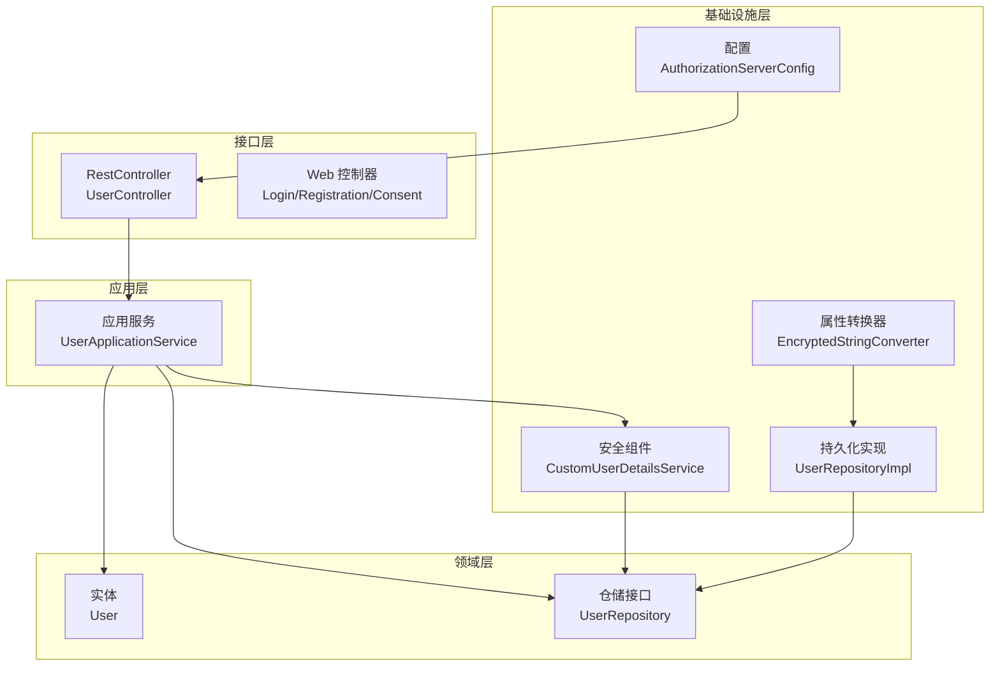
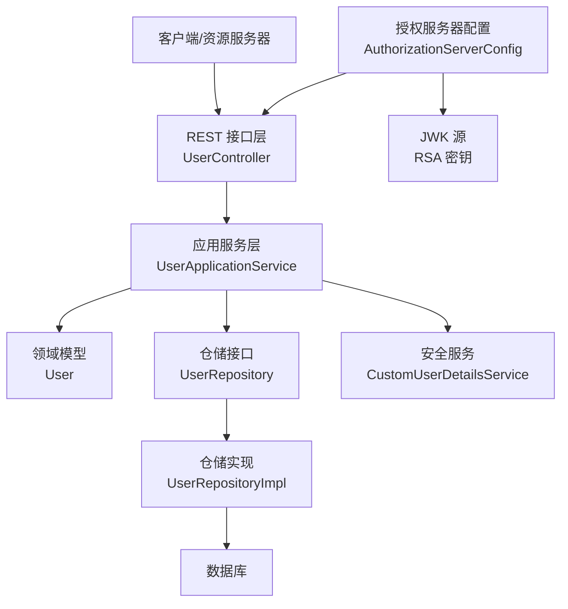
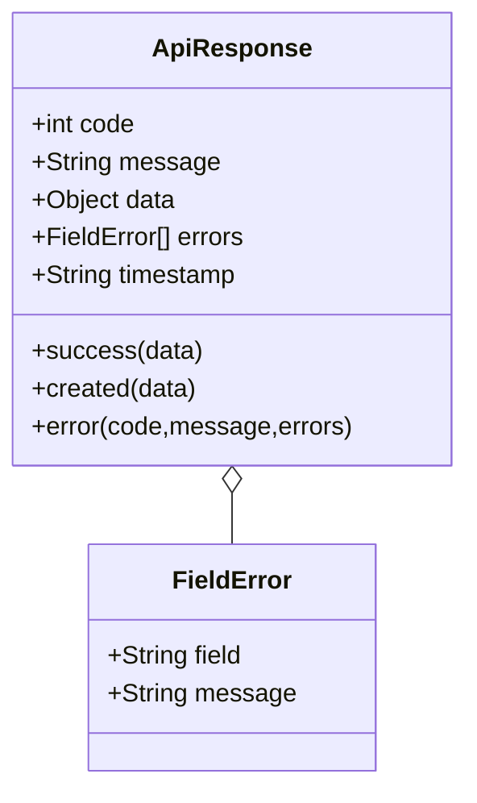
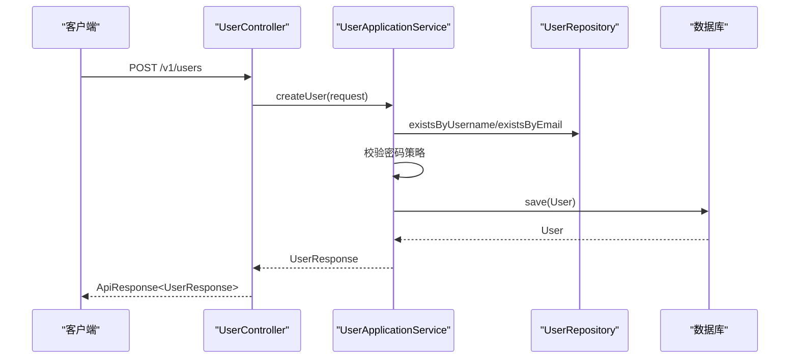
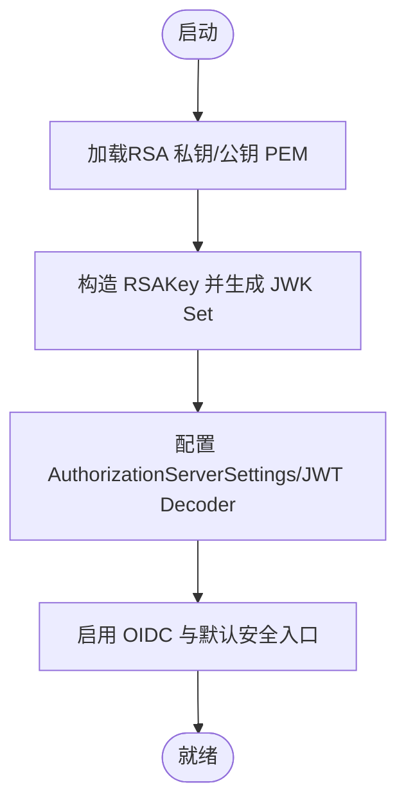
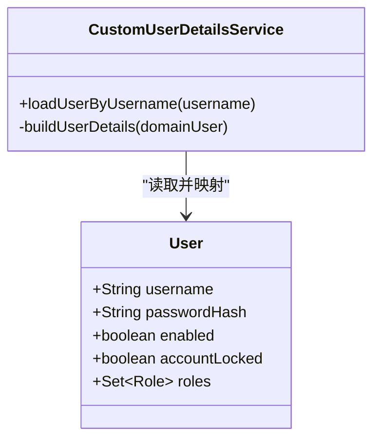
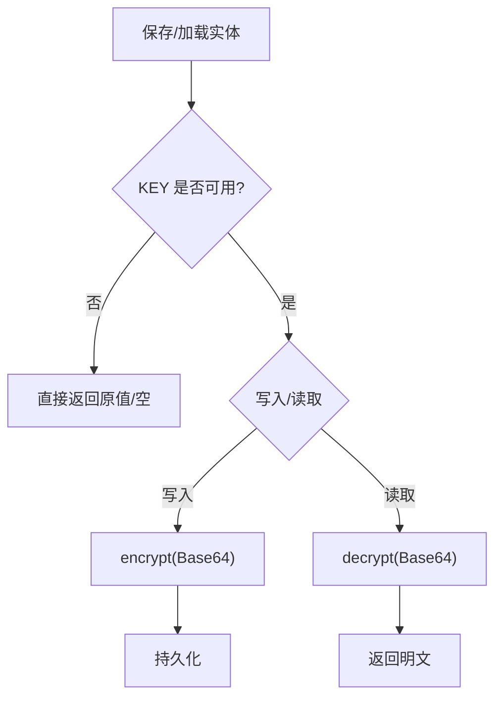
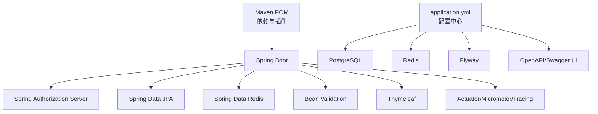

# 开发规范

<cite>
**本文引用的文件**
- [README.md](file://README.md)
- [pom.xml](file://pom.xml)
- [SsoOidcApplication.java](file://src/main/java/sso/oidc/SsoOidcApplication.java)
- [application.yml](file://src/main/resources/application.yml)
- [DEPLOYMENT.md](file://DEPLOYMENT.md)
- [ApiResponse.java](file://src/main/java/sso/oidc/interfaces/rest/common/ApiResponse.java)
- [UserController.java](file://src/main/java/sso/oidc/interfaces/rest/UserController.java)
- [UserApplicationService.java](file://src/main/java/sso/oidc/application/service/UserApplicationService.java)
- [User.java](file://src/main/java/sso/oidc/domain/model/entity/User.java)
- [CustomUserDetailsService.java](file://src/main/java/sso/oidc/infrastructure/security/CustomUserDetailsService.java)
- [AuthorizationServerConfig.java](file://src/main/java/sso/oidc/infrastructure/config/AuthorizationServerConfig.java)
- [EncryptedStringConverter.java](file://src/main/java/sso/oidc/infrastructure/persistence/converter/EncryptedStringConverter.java)
- [.gitignore](file://.gitignore)
- [build.ps1](file://build.ps1)
- [ci-build.ps1](file://ci-build.ps1)
</cite>

## 目录
1. [简介](#简介)
2. [项目结构](#项目结构)
3. [核心组件](#核心组件)
4. [架构总览](#架构总览)
5. [详细组件分析](#详细组件分析)
6. [依赖关系分析](#依赖关系分析)
7. [性能考虑](#性能考虑)
8. [故障排查指南](#故障排查指南)
9. [结论](#结论)
10. [附录](#附录)

## 简介
本开发规范面向IAM Platform认证服务项目，旨在统一团队在命名规范、代码风格、API设计、Git工作流、测试与覆盖率、代码审查、安全与性能等方面的开发标准与质量要求。项目采用分层架构（应用层、领域层、基础设施层、接口层），结合Spring Authorization Server实现OIDC Provider能力，并通过Kubernetes与Docker完成多环境部署。

## 项目结构
项目采用按“关注点”分层的组织方式，便于职责分离与演进：
- application：应用服务、DTO、Assembler
- domain：领域模型、值对象、异常、仓储接口
- infrastructure：配置、持久化实现、安全组件
- interfaces：REST API与Web页面控制器
- resources：配置、数据库迁移、静态模板与密钥

图表来源
- [UserController.java:1-90](file://src/main/java/sso/oidc/interfaces/rest/UserController.java#L1-L90)
- [UserApplicationService.java:1-165](file://src/main/java/sso/oidc/application/service/UserApplicationService.java#L1-L165)
- [User.java:1-36](file://src/main/java/sso/oidc/domain/model/entity/User.java#L1-L36)
- [AuthorizationServerConfig.java:1-143](file://src/main/java/sso/oidc/infrastructure/config/AuthorizationServerConfig.java#L1-L143)
- [CustomUserDetailsService.java:1-41](file://src/main/java/sso/oidc/infrastructure/security/CustomUserDetailsService.java#L1-L41)
- [EncryptedStringConverter.java:1-52](file://src/main/java/sso/oidc/infrastructure/persistence/converter/EncryptedStringConverter.java#L1-L52)

章节来源
- [README.md:104-139](file://README.md#L104-L139)

## 核心组件
- 应用服务：封装业务用例，协调领域模型与仓储，负责事务边界与跨领域协作。
- 领域实体：承载核心业务不变量与行为，如用户实体及其角色集合。
- 安全配置：基于Spring Authorization Server的OIDC Provider配置，包含JWK、Token设置、授权设置。
- REST响应模型：统一响应结构，支持成功、创建、错误与字段级校验错误。
- 加密转换器：对敏感字段（如OAuth2 Client Secret）进行透明加解密。

章节来源
- [UserApplicationService.java:1-165](file://src/main/java/sso/oidc/application/service/UserApplicationService.java#L1-L165)
- [User.java:1-36](file://src/main/java/sso/oidc/domain/model/entity/User.java#L1-L36)
- [AuthorizationServerConfig.java:1-143](file://src/main/java/sso/oidc/infrastructure/config/AuthorizationServerConfig.java#L1-L143)
- [ApiResponse.java:1-61](file://src/main/java/sso/oidc/interfaces/rest/common/ApiResponse.java#L1-L61)
- [EncryptedStringConverter.java:1-52](file://src/main/java/sso/oidc/infrastructure/persistence/converter/EncryptedStringConverter.java#L1-L52)

## 架构总览
系统围绕“接口层-应用层-领域层-基础设施层”的分层展开，接口层通过应用服务编排领域用例；基础设施层提供安全、持久化与配置能力；应用层负责业务编排与事务控制。

图表来源
- [AuthorizationServerConfig.java:1-143](file://src/main/java/sso/oidc/infrastructure/config/AuthorizationServerConfig.java#L1-L143)
- [CustomUserDetailsService.java:1-41](file://src/main/java/sso/oidc/infrastructure/security/CustomUserDetailsService.java#L1-L41)
- [UserApplicationService.java:1-165](file://src/main/java/sso/oidc/application/service/UserApplicationService.java#L1-L165)
- [UserController.java:1-90](file://src/main/java/sso/oidc/interfaces/rest/UserController.java#L1-L90)

## 详细组件分析

### 统一响应模型与API设计
- 统一响应结构包含状态码、消息、数据、字段级错误与时间戳，便于前端与下游系统一致处理。
- 成功/创建/错误三类工厂方法，保证响应格式一致性。
- REST控制器返回统一包装，避免裸数据暴露。

图表来源
- [ApiResponse.java:1-61](file://src/main/java/sso/oidc/interfaces/rest/common/ApiResponse.java#L1-L61)

章节来源
- [ApiResponse.java:1-61](file://src/main/java/sso/oidc/interfaces/rest/common/ApiResponse.java#L1-L61)
- [UserController.java:1-90](file://src/main/java/sso/oidc/interfaces/rest/UserController.java#L1-L90)

### 用户管理用例与控制器
- 控制器提供用户增删改查、分页列表、密码修改、角色分配/移除等REST接口。
- 应用服务执行业务规则（唯一性校验、密码策略、默认角色赋权、日志记录）。
- 领域实体承载用户不变量与角色集合，必要时懒初始化。

图表来源
- [UserController.java:1-90](file://src/main/java/sso/oidc/interfaces/rest/UserController.java#L1-L90)
- [UserApplicationService.java:1-165](file://src/main/java/sso/oidc/application/service/UserApplicationService.java#L1-L165)

章节来源
- [UserController.java:1-90](file://src/main/java/sso/oidc/interfaces/rest/UserController.java#L1-L90)
- [UserApplicationService.java:1-165](file://src/main/java/sso/oidc/application/service/UserApplicationService.java#L1-L165)
- [User.java:1-36](file://src/main/java/sso/oidc/domain/model/entity/User.java#L1-L36)

### 安全与认证配置
- 基于Spring Authorization Server的OIDC Provider配置，启用默认安全入口、HTML登录入口、JWT资源服务器。
- JWK使用RSA密钥对，支持动态加载公私钥PEM文件，生成JWK Set。
- Token设置包含访问令牌与刷新令牌生命周期，客户端设置包含授权同意策略。

图表来源
- [AuthorizationServerConfig.java:1-143](file://src/main/java/sso/oidc/infrastructure/config/AuthorizationServerConfig.java#L1-L143)

章节来源
- [AuthorizationServerConfig.java:1-143](file://src/main/java/sso/oidc/infrastructure/config/AuthorizationServerConfig.java#L1-L143)

### 用户详情服务与权限映射
- 自定义UserDetailsService根据领域用户构建Spring Security UserDetails，映射角色为SimpleGrantedAuthority。
- 支持账户启用/锁定状态与角色集合。

图表来源
- [CustomUserDetailsService.java:1-41](file://src/main/java/sso/oidc/infrastructure/security/CustomUserDetailsService.java#L1-L41)
- [User.java:1-36](file://src/main/java/sso/oidc/domain/model/entity/User.java#L1-L36)

章节来源
- [CustomUserDetailsService.java:1-41](file://src/main/java/sso/oidc/infrastructure/security/CustomUserDetailsService.java#L1-L41)
- [User.java:1-36](file://src/main/java/sso/oidc/domain/model/entity/User.java#L1-L36)

### 敏感字段加解密
- JPA Converter对敏感字符串进行透明加解密，依赖环境变量ENCRYPTION_KEY。
- 加解密失败抛出运行时异常，避免静默失败。

图表来源
- [EncryptedStringConverter.java:1-52](file://src/main/java/sso/oidc/infrastructure/persistence/converter/EncryptedStringConverter.java#L1-L52)

章节来源
- [EncryptedStringConverter.java:1-52](file://src/main/java/sso/oidc/infrastructure/persistence/converter/EncryptedStringConverter.java#L1-L52)

## 依赖关系分析
- 构建与运行：Maven管理依赖与编译插件，Java 21，Spring Boot 3.2.5，Spring Authorization Server 1.2.5。
- 运行时配置：application.yml集中管理数据库、Redis、Flyway、JWK、加密密钥、OpenAPI、Actuator与Tracing。
- 多环境：通过Spring Profile与Kustomize Overlay实现环境隔离与差异化配置。

图表来源
- [pom.xml:1-225](file://pom.xml#L1-L225)
- [application.yml:1-78](file://src/main/resources/application.yml#L1-L78)

章节来源
- [pom.xml:1-225](file://pom.xml#L1-L225)
- [application.yml:1-78](file://src/main/resources/application.yml#L1-L78)

## 性能考虑
- 连接池与SQL：HikariCP连接池参数已配置，生产环境建议结合数据库性能与负载评估调整最大连接数与超时。
- 缓存与会话：Redis用于缓存与分布式会话，建议对热点用户信息与令牌元数据做缓存。
- 观测性：Actuator集成Prometheus与Zipkin链路追踪，建议在生产开启采样并配置告警。
- OIDC令牌：合理设置访问令牌与刷新令牌有效期，平衡安全性与用户体验。
- 分页与批量：用户列表使用分页，建议对大列表场景增加索引与查询优化。

## 故障排查指南
- 健康检查：通过Actuator健康端点查看应用、数据库与Redis状态。
- 日志：Kubernetes中定位Pod日志，按时间范围过滤，定位异常堆栈。
- 指标：Prometheus端点采集CPU、内存、连接池等指标，辅助容量规划。
- OIDC问题：核对Issuer URI、JWK公钥加载、客户端重定向URI与授权同意策略。

章节来源
- [DEPLOYMENT.md:242-289](file://DEPLOYMENT.md#L242-L289)

## 结论
本规范以项目现有实现为基础，明确了命名、风格、API、Git工作流、测试与安全等开发标准。建议团队在日常迭代中严格遵循，持续改进质量与交付效率。

## 附录

### 命名规范
- 类名：PascalCase（例如UserService）
- 方法名：camelCase（例如createUser）
- 变量名：camelCase（例如userName）
- 常量名：UPPER_SNAKE_CASE（例如MAX_LOGIN_ATTEMPTS）

章节来源
- [README.md:143-151](file://README.md#L143-L151)

### 代码风格
- 使用Lombok减少样板代码（@RequiredArgsConstructor、@Getter等）
- 方法长度不超过50行
- 类长度不超过500行
- 单元测试覆盖率不低于80%

章节来源
- [README.md:152-157](file://README.md#L152-L157)

### API设计规范
- 资源命名：使用名词复数（/users、/roles、/clients）
- HTTP方法：GET/POST/PUT/DELETE对应不同操作
- 成功响应：统一包含code、message、data、timestamp
- 错误响应：统一包含code、message、errors（字段级）
- 状态码：200/201/400/401/403/404/409/500

章节来源
- [README.md:187-227](file://README.md#L187-L227)
- [ApiResponse.java:1-61](file://src/main/java/sso/oidc/interfaces/rest/common/ApiResponse.java#L1-L61)

### Git工作流（Git Flow）
- 分支模型：master、develop、release/*、feature/*、hotfix/*
- 环境映射：master→PROD、canary/*→CANARY、release/*→TEST、develop→DEV
- 发布流程：feature/* → develop → release/* → canary/* → master
- 提交信息格式：<type>(<scope>): <subject>，类型包括feat/fix/docs/style/refactor/test/chore

章节来源
- [README.md:228-290](file://README.md#L228-L290)

### 测试规范与覆盖率
- 核心业务逻辑：100%
- 重要功能：90%+
- 一般功能：80%+
- 边缘功能：70%+

章节来源
- [README.md:291-299](file://README.md#L291-L299)

### 代码审查标准与最佳实践
- 代码可读性：命名清晰、函数短小、单一职责
- 安全性：输入校验、最小权限、敏感信息加密
- 可维护性：注释与文档、模块解耦、异常处理
- 质量门禁：构建脚本开启编译警告，CI执行测试与构建

章节来源
- [build.ps1:1-14](file://build.ps1#L1-L14)
- [ci-build.ps1:1-227](file://ci-build.ps1#L1-L227)

### 安全编码规范
- 敏感数据加密存储（OAuth2 Client Secret使用AES）
- 用户密码BCrypt存储
- 数据库连接SSL
- 防SQL注入、XSS、CSRF
- 最小权限原则与访问控制
- Public Client强制PKCE
- JWT签名RS256
- Token生命周期合理控制

章节来源
- [README.md:300-312](file://README.md#L300-L312)
- [EncryptedStringConverter.java:1-52](file://src/main/java/sso/oidc/infrastructure/persistence/converter/EncryptedStringConverter.java#L1-L52)

### 部署与环境配置
- 多环境：DEV/TEST/CANARY/PROD，通过Spring Profile与Kustomize Overlay
- Docker镜像：按环境打tag，支持本地与CI/CD构建
- Kubernetes：命名空间隔离，灰度部署策略与回滚

章节来源
- [DEPLOYMENT.md:1-289](file://DEPLOYMENT.md#L1-L289)
- [application.yml:1-78](file://src/main/resources/application.yml#L1-L78)

### 构建与运行要点
- 入口类：SsoOidcApplication
- 本地运行：./mvnw spring-boot:run，或使用ci-build.ps1一键构建部署
- 环境变量：DB/REDIS/JWK/ENCRYPTION_KEY/ISSUER_URI等

章节来源
- [SsoOidcApplication.java:1-13](file://src/main/java/sso/oidc/SsoOidcApplication.java#L1-L13)
- [ci-build.ps1:1-227](file://ci-build.ps1#L1-L227)
- [application.yml:1-78](file://src/main/resources/application.yml#L1-L78)