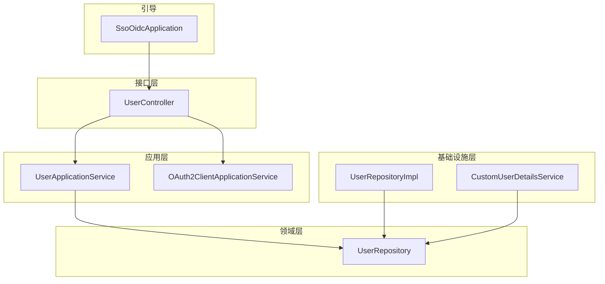
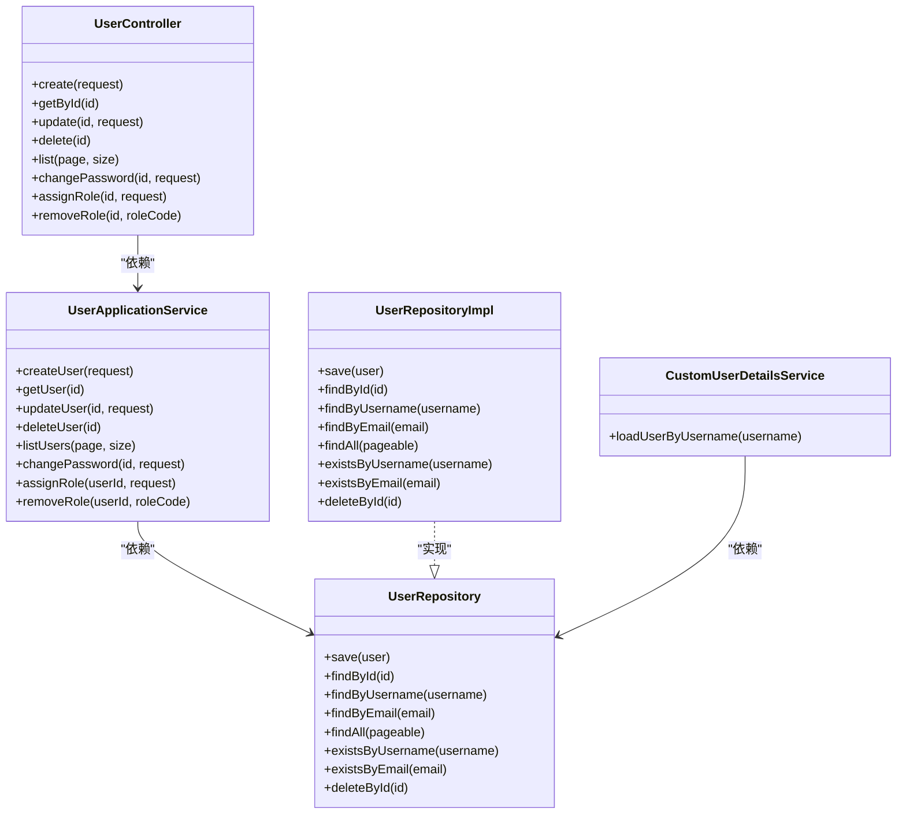
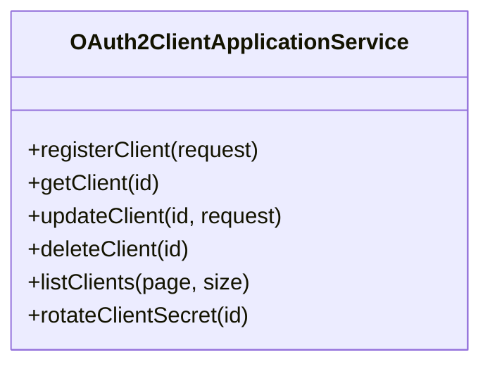
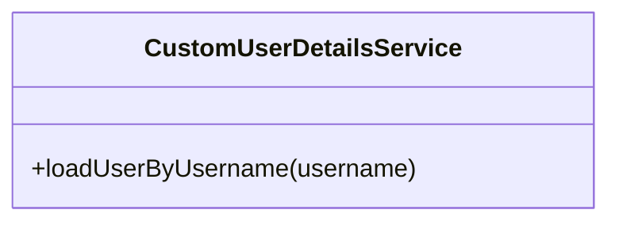
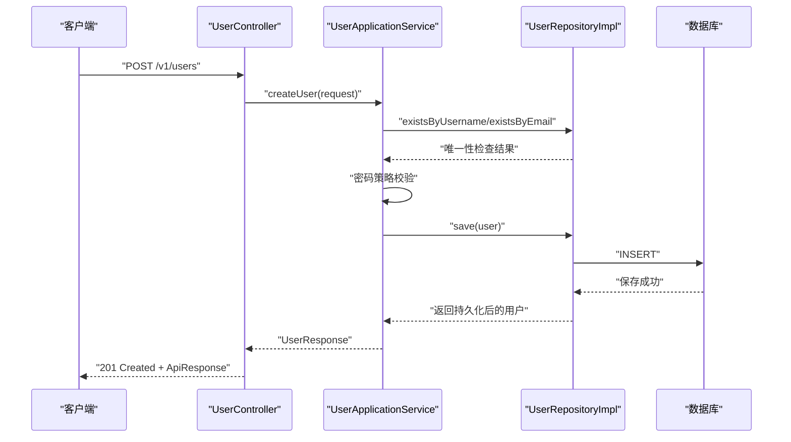
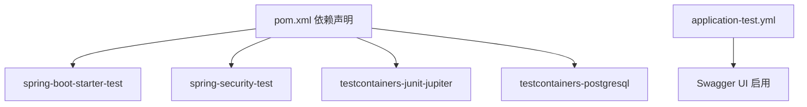

# 测试规范

<cite>
**本文引用的文件**
- [README.md](file://README.md)
- [pom.xml](file://pom.xml)
- [SsoOidcApplication.java](file://src/main/java/sso/oidc/SsoOidcApplication.java)
- [UserApplicationService.java](file://src/main/java/sso/oidc/application/service/UserApplicationService.java)
- [OAuth2ClientApplicationService.java](file://src/main/java/sso/oidc/application/service/OAuth2ClientApplicationService.java)
- [UserController.java](file://src/main/java/sso/oidc/interfaces/rest/UserController.java)
- [CustomUserDetailsService.java](file://src/main/java/sso/oidc/infrastructure/security/CustomUserDetailsService.java)
- [UserRepository.java](file://src/main/java/sso/oidc/domain/repository/UserRepository.java)
- [UserRepositoryImpl.java](file://src/main/java/sso/oidc/infrastructure/persistence/impl/UserRepositoryImpl.java)
- [application-test.yml](file://src/main/resources/application-test.yml)
</cite>

## 目录
1. [引言](#引言)
2. [项目结构](#项目结构)
3. [核心组件](#核心组件)
4. [架构总览](#架构总览)
5. [详细组件分析](#详细组件分析)
6. [依赖分析](#依赖分析)
7. [性能考虑](#性能考虑)
8. [故障排查指南](#故障排查指南)
9. [结论](#结论)
10. [附录](#附录)

## 引言
本测试规范面向基于 Spring Authorization Server 的 IAM Platform 认证服务，目标是建立系统化的测试体系，确保核心业务逻辑、重要功能、一般功能与边缘功能分别达到 100%、90%+、80%+、70%+ 的覆盖率要求；明确单元测试、集成测试与端到端测试的职责边界与金字塔结构；制定测试数据管理策略；规范 Mock/Fake 的使用与 Testcontainers 在集成测试中的应用；并给出测试报告生成与持续集成中的测试执行策略。

## 项目结构
项目采用分层架构（应用层、领域层、基础设施层、接口层），测试目录结构与之对应，便于按层次组织单元测试与集成测试。关键模块包括用户管理、OAuth2 客户端管理、安全细节与控制器层。

图表来源
- [SsoOidcApplication.java:1-13](file://src/main/java/sso/oidc/SsoOidcApplication.java#L1-L13)
- [UserController.java:1-90](file://src/main/java/sso/oidc/interfaces/rest/UserController.java#L1-L90)
- [UserApplicationService.java:1-165](file://src/main/java/sso/oidc/application/service/UserApplicationService.java#L1-L165)
- [OAuth2ClientApplicationService.java:1-170](file://src/main/java/sso/oidc/application/service/OAuth2ClientApplicationService.java#L1-L170)
- [UserRepository.java:1-26](file://src/main/java/sso/oidc/domain/repository/UserRepository.java#L1-L26)
- [UserRepositoryImpl.java:1-92](file://src/main/java/sso/oidc/infrastructure/persistence/impl/UserRepositoryImpl.java#L1-L92)
- [CustomUserDetailsService.java:1-38](file://src/main/java/sso/oidc/infrastructure/security/CustomUserDetailsService.java#L1-L38)

章节来源
- [README.md:104-139](file://README.md#L104-L139)

## 核心组件
- 用户管理：包含用户创建、更新、删除、列表、改密、角色分配/移除等核心业务逻辑，由应用服务承载并在控制器中暴露 REST API。
- OAuth2 客户端管理：负责客户端注册、更新、删除、列表、密钥轮换等，支撑 OIDC Provider 能力。
- 安全细节：自定义用户详情服务加载用户并装配角色，用于认证与授权。
- 存储抽象：领域仓储接口与持久化实现解耦，便于单元测试中注入 Mock。

章节来源
- [UserApplicationService.java:1-165](file://src/main/java/sso/oidc/application/service/UserApplicationService.java#L1-L165)
- [OAuth2ClientApplicationService.java:1-170](file://src/main/java/sso/oidc/application/service/OAuth2ClientApplicationService.java#L1-L170)
- [CustomUserDetailsService.java:1-38](file://src/main/java/sso/oidc/infrastructure/security/CustomUserDetailsService.java#L1-L38)
- [UserRepository.java:1-26](file://src/main/java/sso/oidc/domain/repository/UserRepository.java#L1-L26)
- [UserRepositoryImpl.java:1-92](file://src/main/java/sso/oidc/infrastructure/persistence/impl/UserRepositoryImpl.java#L1-L92)

## 架构总览
测试金字塔建议：
- 单元测试（最底层）：覆盖核心业务逻辑 100%，重点保障应用服务与领域模型的行为正确性。
- 集成测试（中间层）：覆盖重要功能 90%+，验证仓储、安全细节、控制器与外部依赖（数据库、Redis）交互。
- 端到端测试（顶层）：覆盖一般功能 80%+，验证 OIDC 授权流程、令牌发放、用户登录/注册等完整链路。

章节来源
- [README.md:291-298](file://README.md#L291-L298)

## 详细组件分析

### 用户管理组件测试要点
- 核心业务逻辑（100% 覆盖）：用户创建（用户名/邮箱唯一性校验、密码策略校验、默认角色分配）、更新（邮箱唯一性、字段选择性更新）、删除（存在性校验）、改密（旧密验证、新密策略校验）、角色分配/移除（角色存在性校验）。
- 重要功能（90%+）：分页查询、控制器层 API 行为（状态码、响应封装）。
- 边缘功能（70%+）：异常路径（用户不存在、角色不存在、重复邮箱等）。

图表来源
- [UserController.java:1-90](file://src/main/java/sso/oidc/interfaces/rest/UserController.java#L1-L90)
- [UserApplicationService.java:1-165](file://src/main/java/sso/oidc/application/service/UserApplicationService.java#L1-L165)
- [UserRepository.java:1-26](file://src/main/java/sso/oidc/domain/repository/UserRepository.java#L1-L26)
- [UserRepositoryImpl.java:1-92](file://src/main/java/sso/oidc/infrastructure/persistence/impl/UserRepositoryImpl.java#L1-L92)
- [CustomUserDetailsService.java:1-38](file://src/main/java/sso/oidc/infrastructure/security/CustomUserDetailsService.java#L1-L38)

章节来源
- [UserApplicationService.java:36-149](file://src/main/java/sso/oidc/application/service/UserApplicationService.java#L36-L149)
- [UserController.java:35-88](file://src/main/java/sso/oidc/interfaces/rest/UserController.java#L35-L88)

### OAuth2 客户端管理组件测试要点
- 核心业务逻辑（100%）：客户端注册（随机生成 client_id/client_secret、默认配置、有效期）、更新（字段选择性更新）、删除（存在性校验）、密钥轮换（生成新密并落库）。
- 重要功能（90%+）：分页查询、控制器层 API 行为。
- 边缘功能（70%+）：异常路径（客户端不存在）。

图表来源
- [OAuth2ClientApplicationService.java:1-170](file://src/main/java/sso/oidc/application/service/OAuth2ClientApplicationService.java#L1-L170)

章节来源
- [OAuth2ClientApplicationService.java:29-153](file://src/main/java/sso/oidc/application/service/OAuth2ClientApplicationService.java#L29-L153)

### 安全细节组件测试要点
- 重要功能（90%+）：用户详情加载、角色装配、账户启用/锁定状态映射。

图表来源
- [CustomUserDetailsService.java:1-38](file://src/main/java/sso/oidc/infrastructure/security/CustomUserDetailsService.java#L1-L38)

章节来源
- [CustomUserDetailsService.java:23-36](file://src/main/java/sso/oidc/infrastructure/security/CustomUserDetailsService.java#L23-L36)

### 测试流程示意（以用户创建为例）

图表来源
- [UserController.java:35-40](file://src/main/java/sso/oidc/interfaces/rest/UserController.java#L35-L40)
- [UserApplicationService.java:36-63](file://src/main/java/sso/oidc/application/service/UserApplicationService.java#L36-L63)
- [UserRepositoryImpl.java:20-25](file://src/main/java/sso/oidc/infrastructure/persistence/impl/UserRepositoryImpl.java#L20-L25)

## 依赖分析
- 测试依赖：Spring Boot Starter Test、Spring Security Test、Testcontainers（PostgreSQL、JUnit Jupiter）。
- 环境配置：TEST 环境启用 Swagger UI，便于端到端测试与 API 验证。

图表来源
- [pom.xml:117-139](file://pom.xml#L117-L139)
- [application-test.yml:13-16](file://src/main/resources/application-test.yml#L13-L16)

章节来源
- [pom.xml:117-139](file://pom.xml#L117-L139)
- [application-test.yml:13-16](file://src/main/resources/application-test.yml#L13-L16)

## 性能考虑
- 单元测试：优先使用内存数据库或嵌入式数据库，避免真实 IO；对热点方法（如密码编码、角色装配）进行基准测试。
- 集成测试：使用 Testcontainers 启动 PostgreSQL，减少环境差异；控制并发与事务边界，避免长事务阻塞。
- 端到端测试：限制并发与重试次数，关注 OIDC 授权码流程、令牌签发与校验的耗时指标。

## 故障排查指南
- 常见异常路径
  - 用户不存在：在更新、删除、改密、角色分配等场景下触发。
  - 邮箱/用户名重复：创建与更新时触发。
  - 角色不存在：角色分配时触发。
  - 密码不匹配：改密时旧密码校验失败。
- 排查步骤
  - 核对控制器返回的状态码与响应体结构。
  - 检查应用服务日志与异常抛出点。
  - 在集成测试中替换为 Testcontainers PostgreSQL，复现数据库相关问题。

章节来源
- [UserApplicationService.java:65-149](file://src/main/java/sso/oidc/application/service/UserApplicationService.java#L65-L149)
- [OAuth2ClientApplicationService.java:74-153](file://src/main/java/sso/oidc/application/service/OAuth2ClientApplicationService.java#L74-L153)

## 结论
通过分层测试金字塔与明确的覆盖率目标，结合 Testcontainers 与合理的 Mock/Fake 策略，可在保证质量的同时提升测试效率与稳定性。建议在 CI 中强制执行覆盖率阈值，并将端到端测试纳入灰度与生产前置校验流程。

## 附录

### 测试金字塔与覆盖率标准
- 单元测试：核心业务逻辑 100%
- 集成测试：重要功能 90%+
- 端到端测试：一般功能 80%+，边缘功能 70%+

章节来源
- [README.md:291-298](file://README.md#L291-L298)

### 测试数据管理规范
- 创建：使用测试专用初始化脚本或迁移脚本，确保测试数据与生产无关。
- 维护：通过测试夹具（Fixture）或工厂模式生成可复用数据，避免硬编码。
- 清理：每个测试用例结束后清理，必要时使用事务回滚或临时表。

### Mock 与 Fake 使用标准
- Mock：对仓储、外部服务进行接口级替身，隔离被测单元。
- Fake：对复杂逻辑（如密码策略、JWT 签发）提供轻量实现，满足测试需求。
- 原则：保持替身行为与真实实现一致，避免过度 Mock 导致测试失真。

### Testcontainers 在集成测试中的应用
- 启动 PostgreSQL 容器，挂载迁移脚本与初始数据，确保测试环境一致性。
- 通过 @Container 注解与 @DynamicPropertySource 注入连接信息，避免硬编码。
- 在 CI 中缓存镜像，缩短启动时间。

章节来源
- [pom.xml:129-139](file://pom.xml#L129-L139)

### 测试报告与持续集成执行策略
- 报告：使用 Surefire/Failsafe 插件生成 XML 报告，结合覆盖率工具输出 HTML/Cobertura 报告。
- 执行顺序：单元测试优先，集成测试次之，端到端测试最后；在 CI 中按环境（TEST/CANARY/PROD）分别执行。
- 质量门禁：设定覆盖率阈值与失败即停策略，确保每次提交均通过测试。