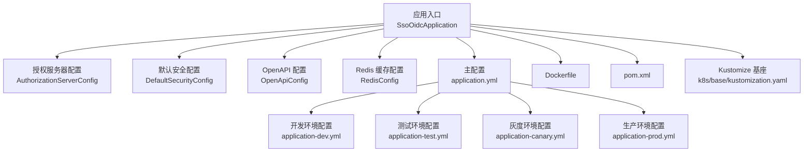
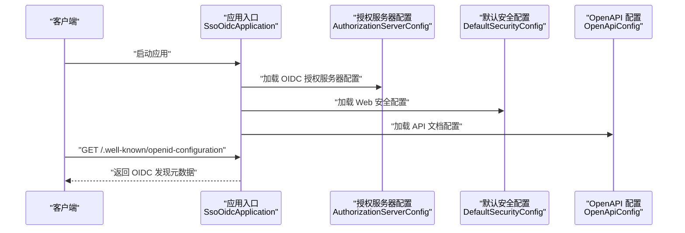
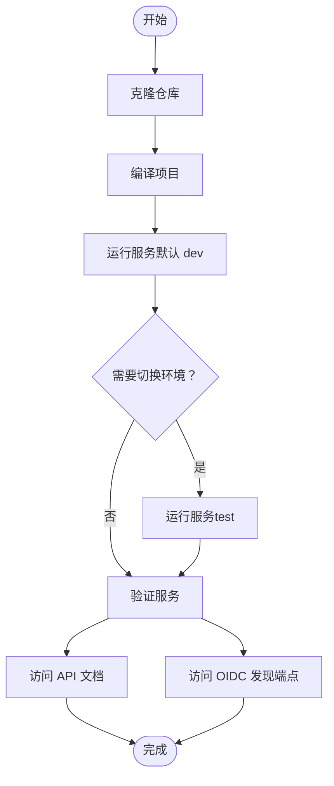
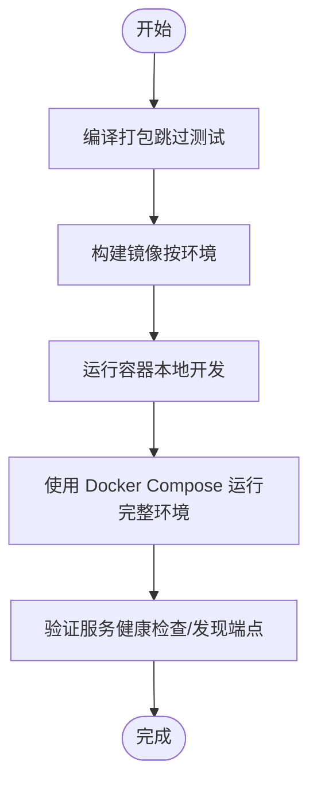
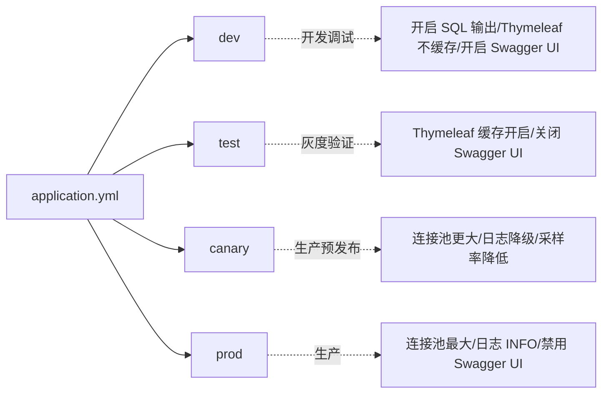
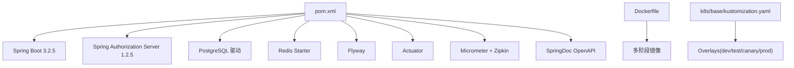

# 快速开始

<cite>
**本文引用的文件**
- [README.md](file://README.md)
- [DEPLOYMENT.md](file://DEPLOYMENT.md)
- [pom.xml](file://pom.xml)
- [Dockerfile](file://Dockerfile)
- [application.yml](file://src/main/resources/application.yml)
- [application-dev.yml](file://src/main/resources/application-dev.yml)
- [application-test.yml](file://src/main/resources/application-test.yml)
- [application-canary.yml](file://src/main/resources/application-canary.yml)
- [application-prod.yml](file://src/main/resources/application-prod.yml)
- [SsoOidcApplication.java](file://src/main/java/sso/oidc/SsoOidcApplication.java)
- [AuthorizationServerConfig.java](file://src/main/java/sso/oidc/infrastructure/config/AuthorizationServerConfig.java)
- [DefaultSecurityConfig.java](file://src/main/java/sso/oidc/infrastructure/config/DefaultSecurityConfig.java)
- [OpenApiConfig.java](file://src/main/java/sso/oidc/infrastructure/config/OpenApiConfig.java)
- [RedisConfig.java](file://src/main/java/sso/oidc/infrastructure/config/RedisConfig.java)
- [kustomization.yaml](file://k8s/base/kustomization.yaml)
</cite>

## 目录
1. [简介](#简介)
2. [项目结构](#项目结构)
3. [核心组件](#核心组件)
4. [架构总览](#架构总览)
5. [详细组件分析](#详细组件分析)
6. [依赖分析](#依赖分析)
7. [性能考虑](#性能考虑)
8. [故障排查指南](#故障排查指南)
9. [结论](#结论)
10. [附录](#附录)

## 简介
本指南面向初学者，帮助你从零开始搭建并运行 IAM Platform 认证服务。内容涵盖：
- 环境要求与安装指导（JDK 21+、PostgreSQL 14+、Redis 7+）
- 本地开发环境搭建（从代码克隆到服务启动）
- Docker 容器化部署（镜像构建、容器运行）
- 多环境配置（dev/test/canary/prod）的使用方法
- API 文档访问与 OIDC 发现端点验证的基本使用示例

## 项目结构
该工程采用 Spring Boot 3 + Spring Authorization Server 1.2.5 构建，支持多环境配置与容器化部署。核心模块划分如下：
- 应用入口与配置：SsoOidcApplication、AuthorizationServerConfig、DefaultSecurityConfig、OpenApiConfig、RedisConfig
- 多环境配置：application.yml 及其 dev/test/canary/prod 子配置
- 构建与部署：pom.xml（Maven）、Dockerfile、DEPLOYMENT.md、Kubernetes Kustomize Overlay

图表来源
- [SsoOidcApplication.java:1-13](file://src/main/java/sso/oidc/SsoOidcApplication.java#L1-L13)
- [AuthorizationServerConfig.java:1-143](file://src/main/java/sso/oidc/infrastructure/config/AuthorizationServerConfig.java#L1-L143)
- [DefaultSecurityConfig.java:1-44](file://src/main/java/sso/oidc/infrastructure/config/DefaultSecurityConfig.java#L1-L44)
- [OpenApiConfig.java:1-22](file://src/main/java/sso/oidc/infrastructure/config/OpenApiConfig.java#L1-L22)
- [RedisConfig.java:1-34](file://src/main/java/sso/oidc/infrastructure/config/RedisConfig.java#L1-L34)
- [application.yml:1-78](file://src/main/resources/application.yml#L1-L78)
- [application-dev.yml:1-22](file://src/main/resources/application-dev.yml#L1-L22)
- [application-test.yml:1-16](file://src/main/resources/application-test.yml#L1-L16)
- [application-canary.yml:1-15](file://src/main/resources/application-canary.yml#L1-L15)
- [application-prod.yml:1-25](file://src/main/resources/application-prod.yml#L1-L25)
- [Dockerfile:1-60](file://Dockerfile#L1-L60)
- [pom.xml:1-225](file://pom.xml#L1-L225)
- [kustomization.yaml:1-11](file://k8s/base/kustomization.yaml#L1-L11)

章节来源
- [README.md:104-139](file://README.md#L104-L139)
- [pom.xml:1-225](file://pom.xml#L1-L225)
- [Dockerfile:1-60](file://Dockerfile#L1-L60)
- [application.yml:1-78](file://src/main/resources/application.yml#L1-L78)
- [kustomization.yaml:1-11](file://k8s/base/kustomization.yaml#L1-L11)

## 核心组件
- 应用入口与启动：负责加载 Spring Boot 应用上下文，启动服务监听端口。
- 授权服务器配置：启用 OIDC Provider 能力，配置授权端点、令牌端点、发现端点、JWKS 端点等。
- 默认安全配置：配置 Web 表单登录、注册、注销以及静态资源放行。
- OpenAPI 配置：在指定环境下启用 Swagger UI，便于 API 文档浏览。
- Redis 缓存配置：启用缓存与会话存储，提升性能与分布式会话能力。
- 多环境配置：通过 application.yml 与各环境子配置文件实现差异化行为。

章节来源
- [SsoOidcApplication.java:1-13](file://src/main/java/sso/oidc/SsoOidcApplication.java#L1-L13)
- [AuthorizationServerConfig.java:1-143](file://src/main/java/sso/oidc/infrastructure/config/AuthorizationServerConfig.java#L1-L143)
- [DefaultSecurityConfig.java:1-44](file://src/main/java/sso/oidc/infrastructure/config/DefaultSecurityConfig.java#L1-L44)
- [OpenApiConfig.java:1-22](file://src/main/java/sso/oidc/infrastructure/config/OpenApiConfig.java#L1-L22)
- [RedisConfig.java:1-34](file://src/main/java/sso/oidc/infrastructure/config/RedisConfig.java#L1-L34)
- [application.yml:1-78](file://src/main/resources/application.yml#L1-L78)
- [application-dev.yml:1-22](file://src/main/resources/application-dev.yml#L1-L22)
- [application-test.yml:1-16](file://src/main/resources/application-test.yml#L1-L16)
- [application-canary.yml:1-15](file://src/main/resources/application-canary.yml#L1-L15)
- [application-prod.yml:1-25](file://src/main/resources/application-prod.yml#L1-L25)

## 架构总览
下图展示了应用启动与 OIDC 发现端点的关键交互路径，体现授权服务器、配置与端点的关系。

图表来源
- [SsoOidcApplication.java:1-13](file://src/main/java/sso/oidc/SsoOidcApplication.java#L1-L13)
- [AuthorizationServerConfig.java:1-143](file://src/main/java/sso/oidc/infrastructure/config/AuthorizationServerConfig.java#L1-L143)
- [DefaultSecurityConfig.java:1-44](file://src/main/java/sso/oidc/infrastructure/config/DefaultSecurityConfig.java#L1-L44)
- [OpenApiConfig.java:1-22](file://src/main/java/sso/oidc/infrastructure/config/OpenApiConfig.java#L1-L22)

## 详细组件分析

### 环境要求与安装指导
- JDK：21+
- PostgreSQL：14+
- Redis：7+
- Docker：可选（用于容器化部署）

建议安装方式（以 Windows 为例）：
- JDK 21：下载并安装 OpenJDK 21，配置 JAVA_HOME 与 PATH。
- PostgreSQL 14+：使用官方安装包或 Docker 方式启动数据库实例。
- Redis 7+：使用官方安装包或 Docker 方式启动缓存实例。

章节来源
- [README.md:50-56](file://README.md#L50-L56)

### 本地开发环境搭建
- 克隆仓库并进入目录
- 编译项目
- 选择环境运行（默认 dev；可切换 test、prod）
- 访问 API 文档与 OIDC 发现端点

章节来源
- [README.md:57-73](file://README.md#L57-L73)
- [README.md:90-102](file://README.md#L90-L102)

### Docker 容器化部署
- 构建镜像（支持 dev/test/canary/prod）
- 运行容器（本地开发模式）
- 使用 Docker Compose 运行完整环境（PostgreSQL + Redis + 应用）

图表来源
- [DEPLOYMENT.md:7-31](file://DEPLOYMENT.md#L7-L31)
- [DEPLOYMENT.md:33-52](file://DEPLOYMENT.md#L33-L52)
- [DEPLOYMENT.md:54-94](file://DEPLOYMENT.md#L54-L94)

章节来源
- [DEPLOYMENT.md:5-94](file://DEPLOYMENT.md#L5-L94)
- [Dockerfile:1-60](file://Dockerfile#L1-L60)
- [pom.xml:184-223](file://pom.xml#L184-L223)

### 多环境配置使用方法
- 通过 Spring Profile 激活不同环境配置
- 环境差异体现在连接池大小、SQL 输出、Swagger UI 开关、日志级别、Thymeleaf 缓存等
- 在 Kubernetes 中通过 Kustomize Overlay 覆盖环境变量与镜像版本

图表来源
- [application.yml:1-78](file://src/main/resources/application.yml#L1-L78)
- [application-dev.yml:1-22](file://src/main/resources/application-dev.yml#L1-L22)
- [application-test.yml:1-16](file://src/main/resources/application-test.yml#L1-L16)
- [application-canary.yml:1-15](file://src/main/resources/application-canary.yml#L1-L15)
- [application-prod.yml:1-25](file://src/main/resources/application-prod.yml#L1-L25)

章节来源
- [DEPLOYMENT.md:200-223](file://DEPLOYMENT.md#L200-L223)
- [application.yml:1-78](file://src/main/resources/application.yml#L1-L78)
- [application-dev.yml:1-22](file://src/main/resources/application-dev.yml#L1-L22)
- [application-test.yml:1-16](file://src/main/resources/application-test.yml#L1-L16)
- [application-canary.yml:1-15](file://src/main/resources/application-canary.yml#L1-L15)
- [application-prod.yml:1-25](file://src/main/resources/application-prod.yml#L1-L25)

### API 文档与 OIDC 发现端点
- API 文档：在 dev/test 环境启用 Swagger UI，访问地址见 README
- OIDC 发现端点：/.well-known/openid-configuration，返回 OIDC 元数据

章节来源
- [README.md:90-102](file://README.md#L90-L102)
- [OpenApiConfig.java:1-22](file://src/main/java/sso/oidc/infrastructure/config/OpenApiConfig.java#L1-L22)
- [AuthorizationServerConfig.java:118-123](file://src/main/java/sso/oidc/infrastructure/config/AuthorizationServerConfig.java#L118-L123)

## 依赖分析
- 构建工具：Maven（Spring Boot 3.2.5、Java 21）
- 运行时依赖：Spring Authorization Server 1.2.5、PostgreSQL、Redis、Flyway、Actuator、Prometheus、Zipkin
- 容器化：Dockerfile（多阶段构建、健康检查、JRE 运行）
- 多环境：Maven Profiles（dev/test/canary/prod）与 Kustomize Overlay

图表来源
- [pom.xml:1-225](file://pom.xml#L1-L225)
- [Dockerfile:1-60](file://Dockerfile#L1-L60)
- [kustomization.yaml:1-11](file://k8s/base/kustomization.yaml#L1-L11)

章节来源
- [pom.xml:1-225](file://pom.xml#L1-L225)
- [Dockerfile:1-60](file://Dockerfile#L1-L60)
- [kustomization.yaml:1-11](file://k8s/base/kustomization.yaml#L1-L11)

## 性能考虑
- 连接池大小：dev/test/canary/prod 依次增大，满足不同负载需求
- 日志级别：生产环境 INFO，灰度环境 INFO，开发/测试 DEBUG
- 缓存与会话：Redis 缓存与分布式会话，提升响应速度与横向扩展能力
- 监控与追踪：Actuator + Prometheus 指标 + Zipkin 链路追踪

章节来源
- [application-prod.yml:1-25](file://src/main/resources/application-prod.yml#L1-L25)
- [application-canary.yml:1-15](file://src/main/resources/application-canary.yml#L1-L15)
- [application-dev.yml:1-22](file://src/main/resources/application-dev.yml#L1-L22)
- [RedisConfig.java:1-34](file://src/main/java/sso/oidc/infrastructure/config/RedisConfig.java#L1-L34)
- [DEPLOYMENT.md:242-289](file://DEPLOYMENT.md#L242-L289)

## 故障排查指南
- 健康检查：通过管理端口 9001 的 /actuator/health 验证应用与数据库、Redis 连通性
- 日志查看：Kubernetes 环境中使用 kubectl logs 查看 Pod 日志
- 数据库连接池：通过 /actuator/hikaricp 查看连接池状态
- API 文档：确认当前环境是否启用 Swagger UI
- OIDC 发现端点：确认授权服务器配置中的 issuer-uri 与访问域名一致

章节来源
- [DEPLOYMENT.md:242-289](file://DEPLOYMENT.md#L242-L289)
- [OpenApiConfig.java:1-22](file://src/main/java/sso/oidc/infrastructure/config/OpenApiConfig.java#L1-L22)
- [AuthorizationServerConfig.java:118-123](file://src/main/java/sso/oidc/infrastructure/config/AuthorizationServerConfig.java#L118-L123)

## 结论
通过本快速开始指南，你可以完成从环境准备、本地开发到容器化部署的全流程，并掌握多环境配置与基础运维技能。建议在本地验证 API 文档与 OIDC 发现端点后，再结合实际业务场景进行 OAuth2/OIDC 客户端集成与灰度发布。

## 附录
- 项目技术栈与功能概览详见 README
- 多环境配置与 Kubernetes 部署细节详见 DEPLOYMENT.md
- OIDC 端点清单与使用示例详见 README

章节来源
- [README.md:1-388](file://README.md#L1-L388)
- [DEPLOYMENT.md:1-289](file://DEPLOYMENT.md#L1-L289)