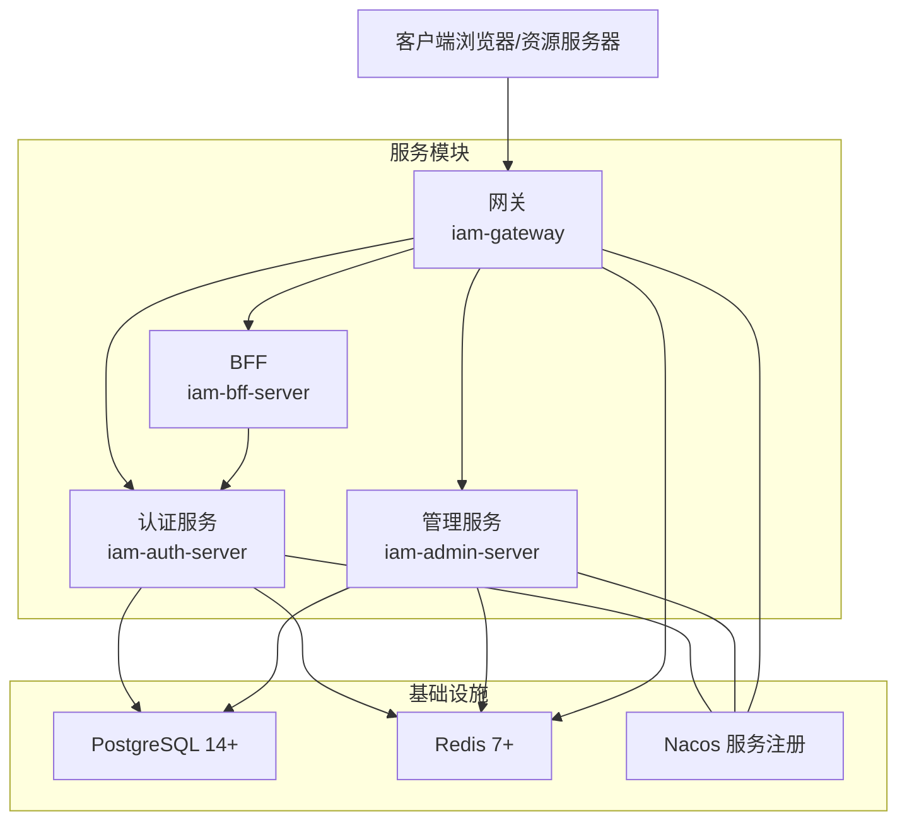
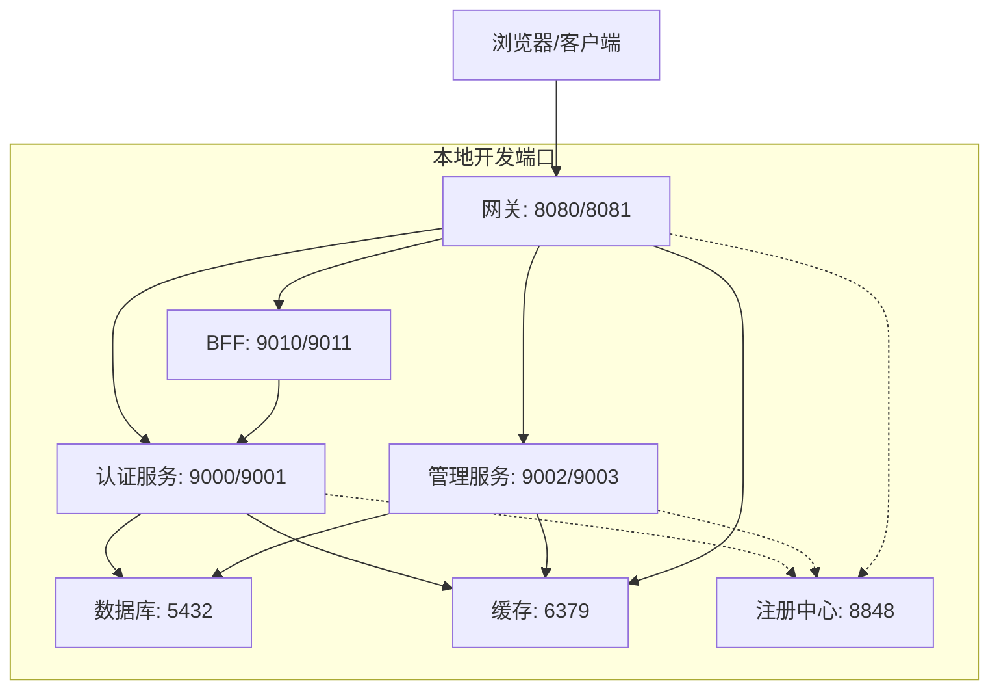
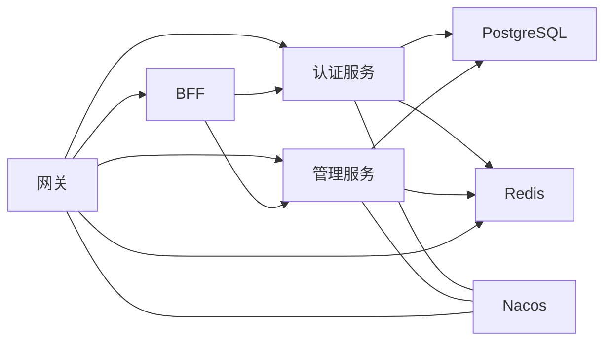
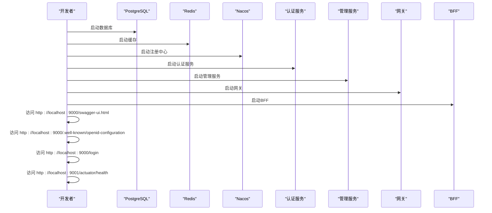
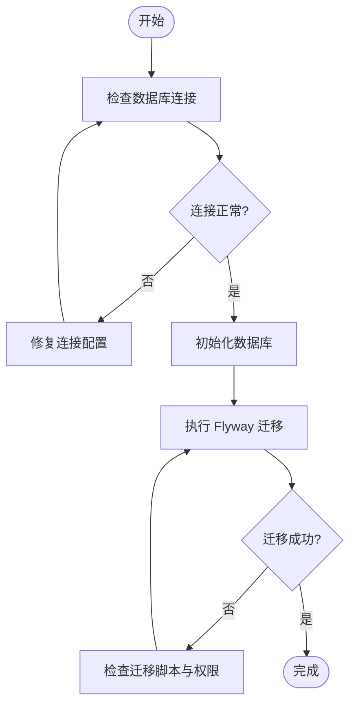

# 快速开始

<cite>
**本文引用的文件**
- [README.md](file://README.md)
- [pom.xml](file://pom.xml)
- [docker-compose.yml](file://docker-compose.yml)
- [iam-admin-server 模块配置](file://iam-admin-server/src/main/resources/application.yml)
- [iam-auth-server 模块配置](file://iam-auth-server/src/main/resources/application.yml)
- [iam-gateway 模块配置](file://iam-gateway/src/main/resources/application.yml)
- [iam-bff-server 模块配置](file://iam-bff-server/src/main/resources/application.yml)
- [iam-admin-server 启动类](file://iam-admin-server/src/main/java/iam/platform/admin/SsoAdminServerApplication.java)
- [iam-auth-server 启动类](file://iam-auth-server/src/main/java/iam/platform/auth/SsoAuthServerApplication.java)
- [iam-gateway 启动类](file://iam-gateway/src/main/java/iam/platform/gateway/IamGatewayApplication.java)
- [iam-bff-server 启动类](file://iam-bff-server/src/main/java/iam/platform/bff/IamBffServerApplication.java)
- [iam-admin-server Nacos 配置](file://iam-admin-server/bootstrap.yml)
- [iam-auth-server Nacos 配置](file://iam-auth-server/bootstrap.yml)
- [iam-gateway Nacos 配置](file://iam-gateway/bootstrap.yml)
- [V1 数据库迁移脚本](file://iam-admin-server/src/main/resources/db/migration/V1__complete_schema_initialization.sql)
</cite>

## 目录
1. [简介](#简介)
2. [项目结构](#项目结构)
3. [核心组件](#核心组件)
4. [架构总览](#架构总览)
5. [详细组件分析](#详细组件分析)
6. [依赖关系分析](#依赖关系分析)
7. [性能考虑](#性能考虑)
8. [故障排除指南](#故障排除指南)
9. [结论](#结论)
10. [附录](#附录)

## 简介
本指南面向首次接触 IAM 平台的开发者，帮助你在本地快速搭建并运行整个系统。你将获得：
- 环境要求与组件安装指引（JDK 21+、PostgreSQL 14+、Redis 7+、Maven 3.8+）
- 本地开发环境搭建步骤（代码克隆、依赖安装、数据库初始化）
- 完整的本地运行命令与启动流程（编译项目与启动各服务模块）
- 如何访问各类服务端点（Swagger UI、OIDC Discovery、登录页面、健康检查等）
- 常见问题与故障排除建议

## 项目结构
本项目采用多模块聚合工程，包含统一认证与授权的核心服务、网关、BFF 层以及公共模块。核心模块如下：
- iam-common：公共 DTO、枚举、异常与通用工具
- iam-auth-server：OAuth2/OIDC 认证服务器（授权码 + PKCE、刷新令牌、JWKS、UserInfo、注销等）
- iam-admin-server：管理后台服务（RBAC、用户/角色/权限/组织/应用管理）
- iam-gateway：API 网关（路由、鉴权、限流、跨域）
- iam-bff-server：前端后端一体化服务（登录/注册/选择租户等）

图表来源
- [docker-compose.yml:1-190](file://docker-compose.yml#L1-L190)
- [iam-auth-server 模块配置:1-144](file://iam-auth-server/src/main/resources/application.yml#L1-L144)
- [iam-admin-server 模块配置:1-102](file://iam-admin-server/src/main/resources/application.yml#L1-L102)
- [iam-gateway 模块配置:1-116](file://iam-gateway/src/main/resources/application.yml#L1-L116)
- [iam-bff-server 模块配置:1-54](file://iam-bff-server/src/main/resources/application.yml#L1-L54)

章节来源
- [README.md:95-108](file://README.md#L95-L108)
- [pom.xml:21-27](file://pom.xml#L21-L27)

## 核心组件
- 认证服务（iam-auth-server）
  - 提供 OIDC Discovery、JWKS、UserInfo、Token Revocation、CAS 支持
  - 内置 Thymeleaf 登录/注册页面
  - 支持短信/邮箱验证码登录
- 管理服务（iam-admin-server）
  - 提供用户、角色、权限、组织、应用等管理 API
  - 集成审计日志与异步处理
- 网关（iam-gateway）
  - 基于 Spring Cloud Gateway 的路径/域名路由
  - 全局跨域与请求限流（Redis）
  - 资源服务器 JWT 校验
- BFF（iam-bff-server）
  - 为前端提供登录/注册/租户选择等页面与验证码接口
  - 通过 Feign 调用认证/管理服务

章节来源
- [README.md:36-64](file://README.md#L36-L64)
- [iam-auth-server 模块配置:1-144](file://iam-auth-server/src/main/resources/application.yml#L1-L144)
- [iam-admin-server 模块配置:1-102](file://iam-admin-server/src/main/resources/application.yml#L1-L102)
- [iam-gateway 模块配置:1-116](file://iam-gateway/src/main/resources/application.yml#L1-L116)
- [iam-bff-server 模块配置:1-54](file://iam-bff-server/src/main/resources/application.yml#L1-L54)

## 架构总览
下图展示了本地开发时各服务的端口与依赖关系，便于理解启动顺序与访问路径。

图表来源
- [iam-auth-server 模块配置:1-144](file://iam-auth-server/src/main/resources/application.yml#L1-L144)
- [iam-admin-server 模块配置:1-102](file://iam-admin-server/src/main/resources/application.yml#L1-L102)
- [iam-gateway 模块配置:1-116](file://iam-gateway/src/main/resources/application.yml#L1-L116)
- [iam-bff-server 模块配置:1-54](file://iam-bff-server/src/main/resources/application.yml#L1-L54)
- [docker-compose.yml:23-182](file://docker-compose.yml#L23-L182)

## 详细组件分析

### 环境要求与安装
- JDK 21+
- PostgreSQL 14+（用于认证/管理服务的数据持久化）
- Redis 7+（用于分布式会话、缓存、限流）
- Maven 3.8+

章节来源
- [README.md:67-72](file://README.md#L67-L72)

### 本地开发环境搭建步骤
- 克隆仓库
- 安装并启动 PostgreSQL 与 Redis（或使用 docker-compose 一键启动）
- 初始化数据库（执行 Flyway 迁移脚本）
- 使用 Maven 编译并启动各服务模块

章节来源
- [README.md:74-82](file://README.md#L74-L82)
- [V1 数据库迁移脚本:1-720](file://iam-admin-server/src/main/resources/db/migration/V1__complete_schema_initialization.sql#L1-L720)

### 本地运行命令与启动流程
- 编译项目
  - 在项目根目录执行：mvnw clean compile
- 启动各服务（默认 dev 环境）
  - 方式一：使用 Maven 插件启动（推荐）
    - 在根目录执行：mvnw spring-boot:run
  - 方式二：分别启动各模块主类
    - 认证服务：SsoAuthServerApplication.main(...)
    - 管理服务：SsoAdminServerApplication.main(...)
    - 网关：IamGatewayApplication.main(...)
    - BFF：IamBffServerApplication.main(...)

章节来源
- [README.md:76-82](file://README.md#L76-L82)
- [iam-auth-server 启动类:1-19](file://iam-auth-server/src/main/java/iam/platform/auth/SsoAuthServerApplication.java#L1-L19)
- [iam-admin-server 启动类:1-17](file://iam-admin-server/src/main/java/iam/platform/admin/SsoAdminServerApplication.java#L1-L17)
- [iam-gateway 启动类:1-15](file://iam-gateway/src/main/java/iam/platform/gateway/IamGatewayApplication.java#L1-L15)
- [iam-bff-server 启动类:1-17](file://iam-bff-server/src/main/java/iam/platform/bff/IamBffServerApplication.java#L1-L17)

### 访问服务端点
- Swagger UI（API 文档）
  - http://localhost:9000/swagger-ui.html
- OIDC Discovery（OIDC 元数据）
  - http://localhost:9000/.well-known/openid-configuration
- 登录页面（Web 登录）
  - http://localhost:9000/login
- 健康检查（应用健康状态）
  - http://localhost:9001/actuator/health

章节来源
- [README.md:84-94](file://README.md#L84-L94)

### 数据库初始化与迁移
- 使用 Flyway 执行数据库迁移脚本
  - 认证服务：Flyway 默认关闭（由管理服务负责）
  - 管理服务：Flyway 默认开启，迁移位置 classpath:db/migration
- 迁移脚本包含：
  - 完整的 SSO OIDC 架构（角色、人员、租户、应用、权限、审计日志等）
  - 默认角色、系统权限与管理员账户种子数据

章节来源
- [iam-auth-server 模块配置:39-39](file://iam-auth-server/src/main/resources/application.yml#L39-L39)
- [iam-admin-server 模块配置:38-41](file://iam-admin-server/src/main/resources/application.yml#L38-L41)
- [V1 数据库迁移脚本:1-720](file://iam-admin-server/src/main/resources/db/migration/V1__complete_schema_initialization.sql#L1-L720)

### 服务配置要点（端口与依赖）
- 认证服务（9000/9001）
  - 数据源：PostgreSQL
  - 缓存：Redis
  - 管理端点：9001
- 管理服务（9002/9003）
  - 数据源：PostgreSQL
  - 缓存：Redis
  - 管理端点：9003
- 网关（8080/8081）
  - 路由：/auth/** 与 /admin/**
  - 跨域：全局允许
  - 管理端点：8081
- BFF（9010/9011）
  - 页面模板：Thymeleaf
  - 管理端点：9011

章节来源
- [iam-auth-server 模块配置:1-144](file://iam-auth-server/src/main/resources/application.yml#L1-L144)
- [iam-admin-server 模块配置:1-102](file://iam-admin-server/src/main/resources/application.yml#L1-L102)
- [iam-gateway 模块配置:1-116](file://iam-gateway/src/main/resources/application.yml#L1-L116)
- [iam-bff-server 模块配置:1-54](file://iam-bff-server/src/main/resources/application.yml#L1-L54)

## 依赖关系分析
- 模块依赖
  - 网关依赖认证/管理服务进行路由与鉴权
  - BFF 通过 Feign 客户端调用认证/管理服务
  - 各服务均依赖 PostgreSQL 与 Redis
  - 服务注册与发现使用 Nacos
- 环境配置
  - 通过 Spring Profile dev/test/canary/prod 切换环境
  - docker-compose 提供一键启动所有依赖与服务

图表来源
- [pom.xml:21-27](file://pom.xml#L21-L27)
- [docker-compose.yml:67-182](file://docker-compose.yml#L67-L182)

章节来源
- [pom.xml:21-27](file://pom.xml#L21-L27)
- [docker-compose.yml:1-190](file://docker-compose.yml#L1-L190)

## 性能考虑
- Redis 作为分布式会话与限流缓存，建议合理设置连接池与过期策略
- PostgreSQL 连接池参数已预设，可根据并发场景调整
- 网关全局跨域与限流策略需结合实际流量评估
- 开启 Zipkin 追踪有助于定位性能瓶颈

## 故障排除指南
- 无法访问 Swagger UI 或 OIDC Discovery
  - 确认认证服务端口 9000 可用且未被占用
  - 检查 SSL 配置是否正确（默认关闭）
- 登录页面 404 或静态资源加载失败
  - 确认 Thymeleaf 模板路径与缓存配置
- 健康检查返回异常
  - 检查各服务管理端口（9001/9003/8081/9011）是否可用
- 数据库连接失败
  - 检查 PostgreSQL 地址、端口、用户名、密码与数据库名
  - 确认数据库已初始化（执行迁移脚本）
- Redis 连接失败
  - 检查 Redis 地址、端口与密码
- 服务间通信异常
  - 确认 Nacos 地址与命名空间配置一致

章节来源
- [iam-auth-server 模块配置:1-144](file://iam-auth-server/src/main/resources/application.yml#L1-L144)
- [iam-admin-server 模块配置:1-102](file://iam-admin-server/src/main/resources/application.yml#L1-L102)
- [iam-gateway 模块配置:1-116](file://iam-gateway/src/main/resources/application.yml#L1-L116)
- [iam-bff-server 模块配置:1-54](file://iam-bff-server/src/main/resources/application.yml#L1-L54)
- [iam-admin-server Nacos 配置:1-10](file://iam-admin-server/bootstrap.yml#L1-L10)
- [iam-auth-server Nacos 配置:1-10](file://iam-auth-server/bootstrap.yml#L1-L10)
- [iam-gateway Nacos 配置:1-10](file://iam-gateway/bootstrap.yml#L1-L10)

## 结论
通过本指南，你可以完成 IAM 平台在本地的环境准备、数据库初始化与服务启动，并成功访问 Swagger UI、OIDC Discovery、登录页面与健康检查端点。建议在开发过程中结合各模块的管理端点与日志输出进行调试，遇到问题可依据“故障排除指南”逐项排查。

## 附录

### 端到端启动序列（概念流程）

### 数据库迁移流程（概念流程）
