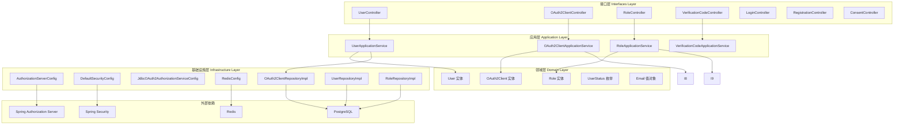
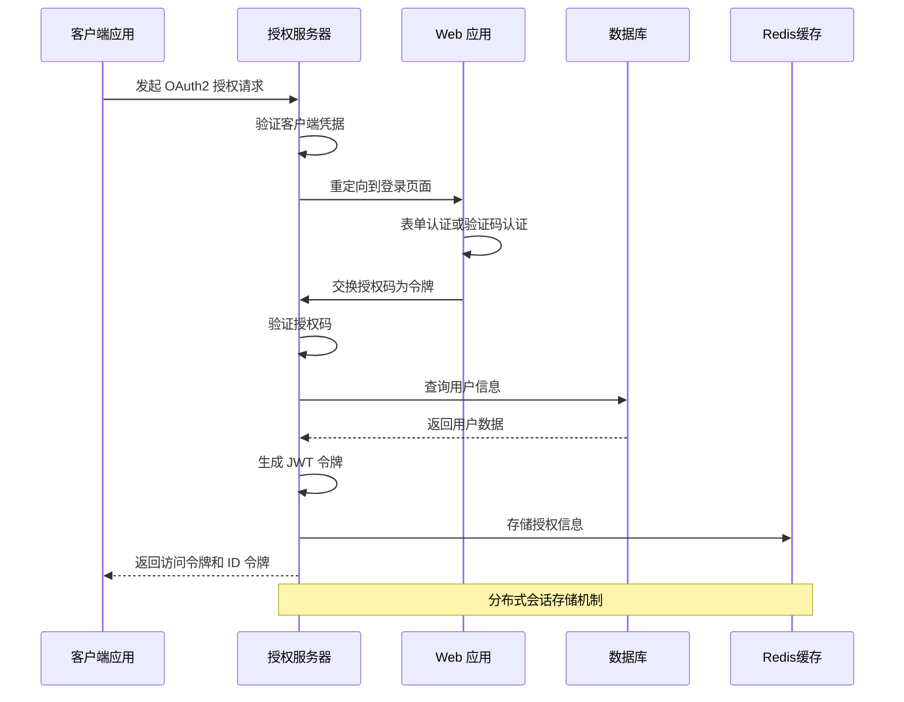
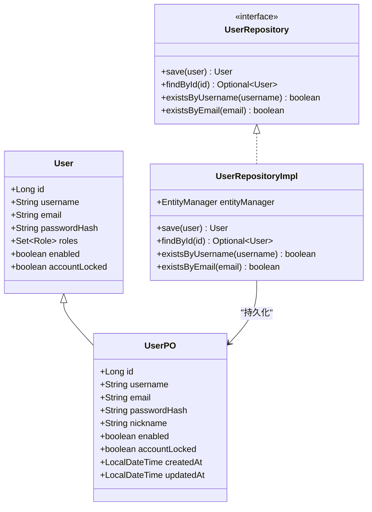
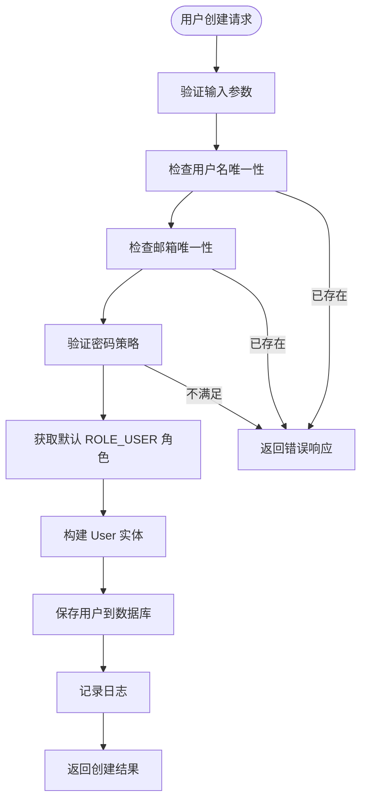
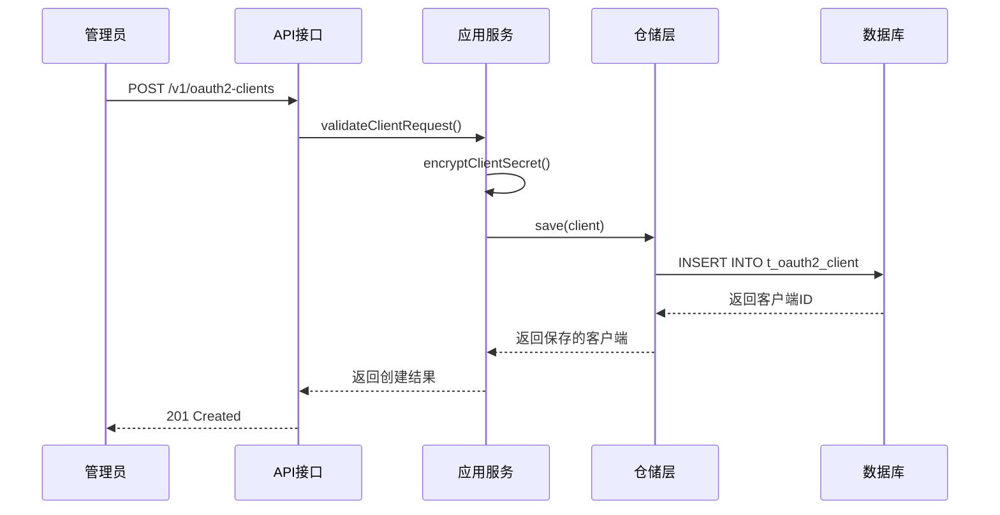
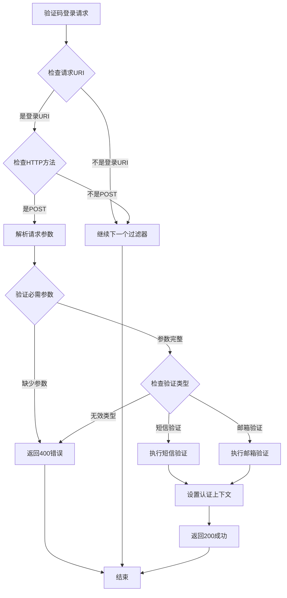
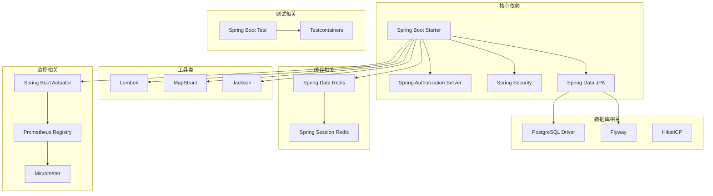

# 技术文档基础设施

<cite>
**本文档中引用的文件**
- [README.md](file://README.md)
- [SsoOidcApplication.java](file://src/main/java/sso/oidc/SsoOidcApplication.java)
- [pom.xml](file://pom.xml)
- [application.yml](file://src/main/resources/application.yml)
- [Dockerfile](file://Dockerfile)
- [AuthorizationServerConfig.java](file://src/main/java/sso/oidc/infrastructure/config/AuthorizationServerConfig.java)
- [DefaultSecurityConfig.java](file://src/main/java/sso/oidc/infrastructure/config/DefaultSecurityConfig.java)
- [UserController.java](file://src/main/java/sso/oidc/interfaces/rest/UserController.java)
- [UserApplicationService.java](file://src/main/java/sso/oidc/application/service/UserApplicationService.java)
- [VerificationCodeAuthenticationFilter.java](file://src/main/java/sso/oidc/infrastructure/security/VerificationCodeAuthenticationFilter.java)
- [User.java](file://src/main/java/sso/oidc/domain/model/entity/User.java)
- [OAuth2Client.java](file://src/main/java/sso/oidc/domain/model/entity/OAuth2Client.java)
- [UserPO.java](file://src/main/java/sso/oidc/infrastructure/persistence/entity/UserPO.java)
- [V1__init_schema_and_seed_roles.sql](file://src/main/resources/db/migration/V1__init_schema_and_seed_roles.sql)
- [index.md](file://docs/index.md)
</cite>

## 目录
1. [简介](#简介)
2. [项目结构](#项目结构)
3. [核心组件](#核心组件)
4. [架构概览](#架构概览)
5. [详细组件分析](#详细组件分析)
6. [依赖关系分析](#依赖关系分析)
7. [性能考虑](#性能考虑)
8. [故障排除指南](#故障排除指南)
9. [结论](#结论)
10. [附录](#附录)

## 简介

IAM Platform 认证服务是一个基于 OpenID Connect 1.0 协议的统一身份认证服务，为微服务架构提供集中式认证授权能力。该项目采用 Clean Architecture + Domain-Driven Design 架构模式，实现了完整的 OAuth2/OIDC 协议支持，包括授权码流程、客户端凭证流程、刷新令牌、OIDC 发现、JWKS 端点、UserInfo 端点和令牌撤销等功能。

项目支持四种环境配置（DEV、TEST、CANARY、PROD），使用 Docker 进行容器化部署，并集成了完整的监控和可观测性功能。

## 项目结构

项目采用分层架构设计，严格按照 Clean Architecture 原则组织代码：



**图表来源**
- [SsoOidcApplication.java:1-13](file://src/main/java/sso/oidc/SsoOidcApplication.java#L1-L13)
- [pom.xml:1-237](file://pom.xml#L1-L237)

**章节来源**
- [README.md:95-109](file://README.md#L95-L109)
- [SsoOidcApplication.java:1-13](file://SsoOidcApplication.java#L1-L13)

## 核心组件

### 应用服务层

应用服务层负责协调业务用例，封装复杂的业务逻辑，并提供简洁的服务接口：

- **UserApplicationService**: 用户管理的核心服务，处理用户创建、更新、删除、密码修改和角色分配
- **OAuth2ClientApplicationService**: OAuth2 客户端管理服务，负责客户端注册、配置和生命周期管理
- **RoleApplicationService**: 角色权限管理服务，提供角色的 CRUD 操作和权限分配
- **VerificationCodeApplicationService**: 验证码认证服务，支持短信和邮箱两种验证方式

### 领域模型层

领域模型层包含核心业务实体和值对象：

- **User 实体**: 用户模型，包含用户名、邮箱、密码哈希、角色集合等属性
- **OAuth2Client 实体**: OAuth2 客户端模型，支持多种授权类型和配置选项
- **Role 实体**: 角色模型，用于 RBAC 权限控制
- **Email 值对象**: 封装邮箱验证逻辑的值对象

### 基础设施配置层

基础设施层提供系统运行所需的配置和实现：

- **AuthorizationServerConfig**: OIDC 授权服务器配置，包括 JWT 密钥管理和安全过滤链
- **DefaultSecurityConfig**: 默认安全配置，处理表单登录、OAuth2 登录和验证码认证
- **RedisConfig**: Redis 缓存配置，支持分布式会话存储
- **JdbcOAuth2AuthorizationServiceConfig**: OAuth2 授权服务的 JDBC 实现

**章节来源**
- [UserApplicationService.java:1-154](file://src/main/java/sso/oidc/application/service/UserApplicationService.java#L1-L154)
- [AuthorizationServerConfig.java:1-123](file://src/main/java/sso/oidc/infrastructure/config/AuthorizationServerConfig.java#L1-L123)
- [DefaultSecurityConfig.java:1-54](file://src/main/java/sso/oidc/infrastructure/config/DefaultSecurityConfig.java#L1-L54)

## 架构概览

系统采用双安全过滤链架构，分别处理 OIDC 授权服务器和 Web 应用的安全需求：



**图表来源**
- [AuthorizationServerConfig.java:42-57](file://src/main/java/sso/oidc/infrastructure/config/AuthorizationServerConfig.java#L42-L57)
- [DefaultSecurityConfig.java:24-47](file://src/main/java/sso/oidc/infrastructure/config/DefaultSecurityConfig.java#L24-L47)

### 数据持久化架构

系统使用 JPA/Hibernate 进行数据持久化，支持多种数据库操作模式：



**图表来源**
- [User.java:1-41](file://src/main/java/sso/oidc/domain/model/entity/User.java#L1-L41)
- [UserPO.java:1-97](file://src/main/java/sso/oidc/infrastructure/persistence/entity/UserPO.java#L1-L97)

**章节来源**
- [V1__init_schema_and_seed_roles.sql:18-84](file://src/main/resources/db/migration/V1__init_schema_and_seed_roles.sql#L18-L84)
- [UserRepositoryImpl.java:1-200](file://src/main/java/sso/oidc/infrastructure/persistence/repository/UserRepositoryImpl.java#L1-L200)

## 详细组件分析

### 用户管理系统

用户管理系统是整个认证服务的核心模块，提供了完整的用户生命周期管理：

#### 用户创建流程



**图表来源**
- [UserApplicationService.java:36-60](file://src/main/java/sso/oidc/application/service/UserApplicationService.java#L36-L60)

#### 密码管理机制

系统采用 BCrypt 进行密码哈希存储，确保密码安全性：

- **密码加密**: 使用 BCryptPasswordEncoder 对明文密码进行哈希处理
- **密码验证**: 登录时使用 matches 方法验证密码正确性
- **密码策略**: 集成 PasswordPolicyService 进行密码强度验证

**章节来源**
- [UserApplicationService.java:36-60](file://src/main/java/sso/oidc/application/service/UserApplicationService.java#L36-L60)
- [DefaultSecurityConfig.java:49-52](file://src/main/java/sso/oidc/infrastructure/config/DefaultSecurityConfig.java#L49-L52)

### OAuth2 客户端管理

OAuth2 客户端管理模块支持多种客户端类型和授权流程：

#### 客户端配置模型

| 配置项 | 类型 | 描述 | 默认值 |
|--------|------|------|--------|
| client_id | String | 客户端标识符 | 必填 |
| client_secret | String | 客户端密钥 | 可选 |
| client_name | String | 客户端显示名称 | 必填 |
| authorization_grant_types | Set<String> | 授权类型集合 | 必填 |
| redirect_uris | Set<String> | 重定向 URI 集合 | 可选 |
| scopes | Set<String> | 授权范围集合 | 必填 |
| require_proof_key | boolean | 是否需要 PKCE | false |
| require_authorization_consent | boolean | 是否需要用户同意 | true |

#### 客户端注册流程



**图表来源**
- [OAuth2ClientApplicationService.java:1-200](file://src/main/java/sso/oidc/application/service/OAuth2ClientApplicationService.java#L1-L200)

**章节来源**
- [OAuth2Client.java:1-69](file://src/main/java/sso/oidc/domain/model/entity/OAuth2Client.java#L1-L69)
- [V1__init_schema_and_seed_roles.sql:86-124](file://src/main/resources/db/migration/V1__init_schema_and_seed_roles.sql#L86-L124)

### 验证码认证系统

验证码认证系统支持短信和邮箱两种验证方式，提供灵活的用户登录选择：

#### 验证码认证流程



**图表来源**
- [VerificationCodeAuthenticationFilter.java:22-75](file://src/main/java/sso/oidc/infrastructure/security/VerificationCodeAuthenticationFilter.java#L22-L75)

#### 验证码服务实现

验证码服务通过外部短信网关或邮件服务提供商发送验证码：

- **短信验证码**: 支持可插拔的短信服务商集成
- **邮箱验证码**: 使用 SMTP 服务器发送邮件验证码
- **验证码存储**: 使用 Redis 存储验证码，设置合理的过期时间
- **频率限制**: 防止验证码轰炸攻击

**章节来源**
- [VerificationCodeAuthenticationFilter.java:1-76](file://src/main/java/sso/oidc/infrastructure/security/VerificationCodeAuthenticationFilter.java#L1-L76)

### 安全配置体系

系统采用双安全过滤链架构，确保不同场景下的安全需求：

#### 授权服务器安全配置

授权服务器配置专门处理 OIDC 协议相关的安全需求：

- **JWT 密钥管理**: 支持 PEM 格式的 RSA 密钥对
- **JWKS 端点**: 自动生成 JSON Web Key Set
- **OIDC 发现**: 提供标准的 OIDC 元数据
- **令牌验证**: 集成 Spring Authorization Server 的令牌验证机制

#### Web 应用安全配置

Web 应用配置处理传统的 Web 应用安全需求：

- **表单认证**: 支持用户名密码登录
- **OAuth2 登录**: 集成第三方社交登录
- **验证码认证**: 支持短信/邮箱验证码登录
- **静态资源访问**: 允许匿名访问静态资源

**章节来源**
- [AuthorizationServerConfig.java:34-123](file://src/main/java/sso/oidc/infrastructure/config/AuthorizationServerConfig.java#L34-L123)
- [DefaultSecurityConfig.java:16-54](file://src/main/java/sso/oidc/infrastructure/config/DefaultSecurityConfig.java#L16-L54)

## 依赖关系分析

项目使用 Maven 进行依赖管理，采用分层的依赖结构：



**图表来源**
- [pom.xml:29-152](file://pom.xml#L29-L152)

### 环境配置管理

项目支持四种环境配置，通过 Spring Profile 实现配置隔离：

| 环境 | Profile | Docker Tag | 主要特性 |
|------|---------|------------|----------|
| DEV | dev | `<version>-dev` | 本地开发，调试模式，详细日志 |
| TEST | test | `<version>-test` | QA 测试，模拟环境 |
| CANARY | canary | `<version>-canary` | 灰度发布，部分功能启用 |
| PROD | prod | `<version>` | 生产环境，优化配置 |

**章节来源**
- [pom.xml:196-235](file://pom.xml#L196-L235)
- [application.yml:75-106](file://src/main/resources/application.yml#L75-L106)

## 性能考虑

### 数据库性能优化

- **连接池配置**: 使用 HikariCP 作为数据库连接池，合理配置最大连接数和超时时间
- **索引优化**: 为常用查询字段建立适当的索引，如用户名、邮箱等
- **查询优化**: 使用分页查询处理大量数据，避免一次性加载所有记录
- **事务管理**: 合理使用事务注解，避免长事务影响性能

### 缓存策略

- **Redis 缓存**: 使用 Redis 缓存用户会话和频繁访问的数据
- **JWKS 缓存**: JWT 密钥集在应用重启后保持稳定，避免客户端缓存失效
- **查询结果缓存**: 对不经常变化的数据使用缓存机制

### 容器化部署优化

- **镜像大小**: 使用 Alpine Linux 作为基础镜像，减少镜像体积
- **多阶段构建**: 编译阶段和运行阶段分离，优化最终镜像
- **健康检查**: 集成 Docker 健康检查，确保容器正常运行
- **资源限制**: 在容器中设置合理的内存和 CPU 限制

## 故障排除指南

### 常见问题诊断

#### 数据库连接问题

**症状**: 应用启动时出现数据库连接异常

**排查步骤**:
1. 检查数据库服务是否正常运行
2. 验证连接参数配置（主机、端口、用户名、密码）
3. 确认网络连通性和防火墙设置
4. 检查数据库用户权限

#### JWT 密钥问题

**症状**: 令牌签发或验证失败

**排查步骤**:
1. 验证密钥文件路径配置
2. 检查 PEM 格式密钥的有效性
3. 确认密钥长度符合 RSA 要求
4. 验证密钥文件权限设置

#### OAuth2 授权问题

**症状**: OAuth2 授权流程中断或失败

**排查步骤**:
1. 检查客户端配置是否正确
2. 验证重定向 URI 配置
3. 确认授权类型支持情况
4. 检查 PKCE 配置（如果需要）

### 日志分析

系统提供详细的日志输出，便于问题诊断：

- **应用日志**: 记录业务操作和错误信息
- **安全日志**: 记录认证和授权相关事件
- **数据库日志**: 显示 SQL 查询和执行计划
- **系统日志**: 监控应用运行状态和性能指标

**章节来源**
- [Dockerfile:50-59](file://Dockerfile#L50-L59)
- [application.yml:90-106](file://src/main/resources/application.yml#L90-L106)

## 结论

IAM Platform 认证服务是一个功能完整、架构清晰的身份认证解决方案。项目采用了先进的 Clean Architecture 设计模式，实现了关注点分离和高内聚低耦合的代码结构。

系统的主要优势包括：

1. **协议完整**: 完整支持 OAuth2/OIDC 协议的所有核心功能
2. **架构清晰**: 清晰的分层架构便于维护和扩展
3. **安全可靠**: 采用业界标准的安全实践和加密算法
4. **部署友好**: 完善的 Docker 化部署和监控支持
5. **文档完善**: 丰富的技术文档和使用指南

该系统适合在微服务架构中作为统一的身份认证中心，为各个业务服务提供安全可靠的认证授权服务。

## 附录

### 快速部署指南

```bash
# 本地开发环境启动
./mvnw spring-boot:run

# Docker 容器启动
docker-compose up -d

# 多环境构建
./ci-build.ps1 -TargetEnvironment dev -Version 1.0.0-SNAPSHOT -Deploy
```

### 监控和运维

- **健康检查**: 通过 `/actuator/health` 端点监控应用状态
- **指标收集**: Prometheus 集成收集系统性能指标
- **日志管理**: 集成 ELK 或类似日志平台
- **告警机制**: 配置关键指标的告警规则

### 扩展建议

1. **多租户支持**: 可以扩展支持多租户场景
2. **审计日志**: 增强审计日志功能，满足合规要求
3. **API 网关集成**: 与 API 网关结合提供统一的认证入口
4. **高级权限控制**: 支持更细粒度的权限控制机制