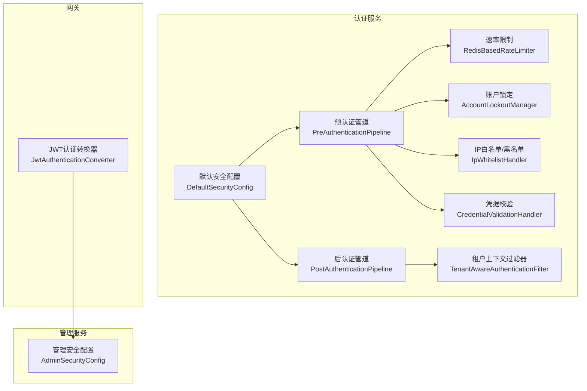
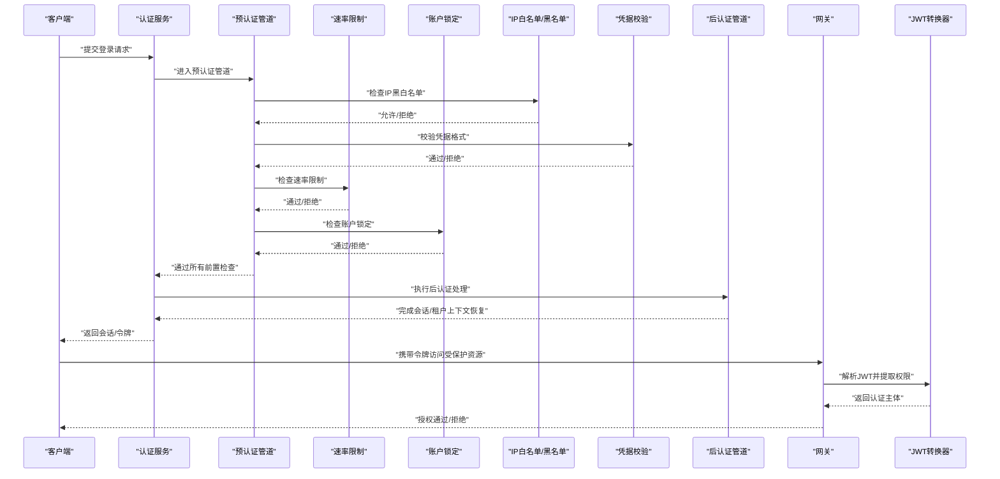
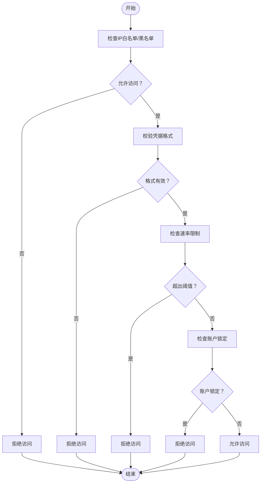
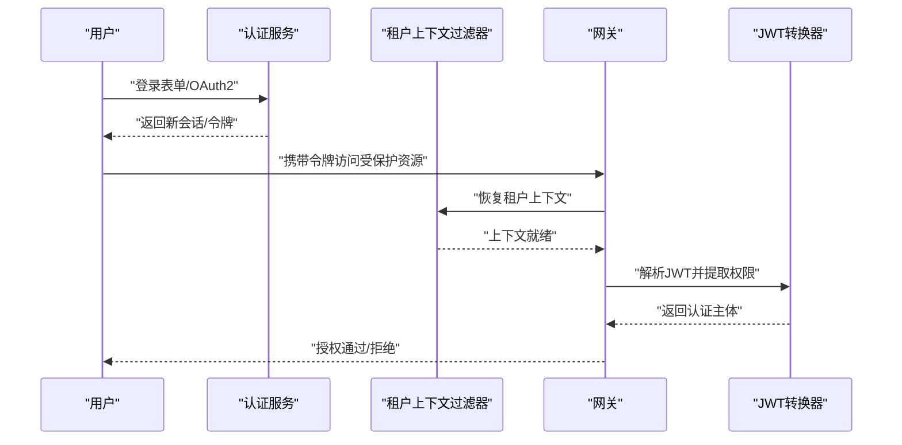
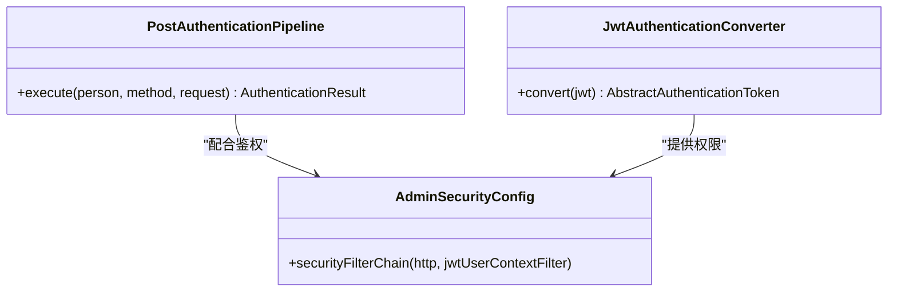
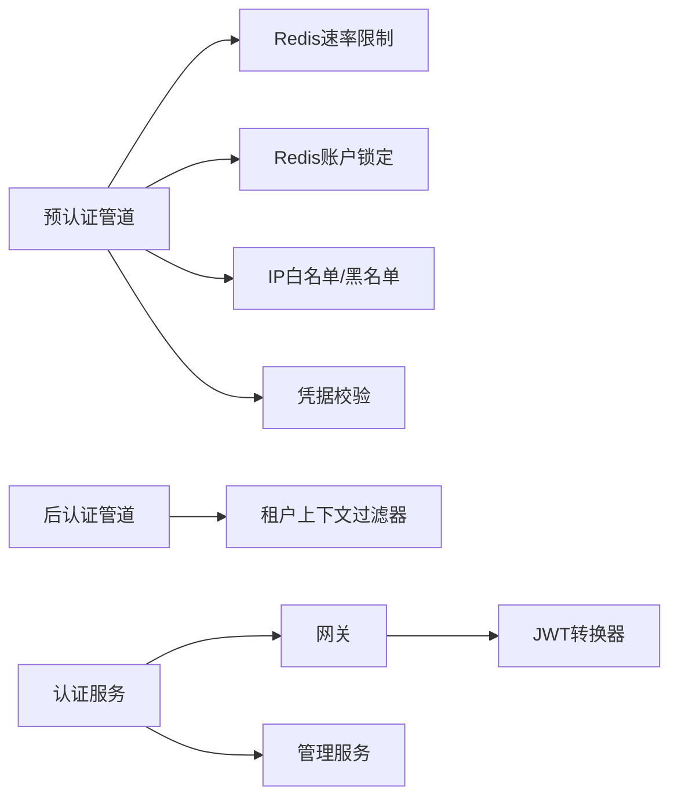

# 安全问题处理

<cite>
**本文引用的文件**
- [PreAuthenticationPipeline.java](file://iam-auth-server/src/main/java/iam/platform/auth/application/service/pipeline/PreAuthenticationPipeline.java)
- [PostAuthenticationPipeline.java](file://iam-auth-server/src/main/java/iam/platform/auth/application/service/pipeline/PostAuthenticationPipeline.java)
- [RedisBasedRateLimiter.java](file://iam-auth-server/src/main/java/iam/platform/auth/infrastructure/security/RedisBasedRateLimiter.java)
- [AccountLockoutManager.java](file://iam-auth-server/src/main/java/iam/platform/auth/infrastructure/security/AccountLockoutManager.java)
- [IpWhitelistHandler.java](file://iam-auth-server/src/main/java/iam/platform/auth/application/service/pipeline/IpWhitelistHandler.java)
- [CredentialValidationHandler.java](file://iam-auth-server/src/main/java/iam/platform/auth/application/service/pipeline/CredentialValidationHandler.java)
- [SecurityPolicyProperties.java](file://iam-auth-server/src/main/java/iam/platform/auth/infrastructure/config/SecurityPolicyProperties.java)
- [DefaultSecurityConfig.java](file://iam-auth-server/src/main/java/iam/platform/auth/infrastructure/config/DefaultSecurityConfig.java)
- [TenantAwareAuthenticationFilter.java](file://iam-auth-server/src/main/java/iam/platform/auth/infrastructure/security/TenantAwareAuthenticationFilter.java)
- [JwtAuthenticationConverter.java](file://iam-gateway/src/main/java/iam/platform/gateway/infrastructure/security/JwtAuthenticationConverter.java)
- [AdminSecurityConfig.java](file://iam-admin-server/src/main/java/iam/platform/admin/infrastructure/config/AdminSecurityConfig.java)
- [application.yml（认证服务）](file://iam-auth-server/src/main/resources/application.yml)
- [application.yml（管理服务）](file://iam-admin-server/src/main/resources/application.yml)
- [Spring Authorization Server 原理与流程.md](file://docs/design/Spring Authorization Server 原理与流程.md)
- [TOKEN_VALIDATION_TEST.md](file://docs/TOKEN_VALIDATION_TEST.md)
- [CasSloService.java](file://iam-auth-server/src/main/java/iam/platform/auth/application/service/CasSloService.java)
</cite>

## 目录
1. [简介](#简介)
2. [项目结构](#项目结构)
3. [核心组件](#核心组件)
4. [架构总览](#架构总览)
5. [详细组件分析](#详细组件分析)
6. [依赖分析](#依赖分析)
7. [性能考虑](#性能考虑)
8. [故障排除指南](#故障排除指南)
9. [结论](#结论)
10. [附录](#附录)

## 简介
本指南面向IAM平台的安全运维与开发人员，聚焦以下目标：
- 暴力破解攻击的检测与防护：账户锁定、IP白名单/黑名单、速率限制
- 会话安全：会话劫持检测、会话固定防护、JWT令牌安全管理
- 权限提升：权限绕过检测、越权访问防护、权限验证机制
- 加密与解密：密钥管理、算法选择、数据保护策略
- 安全配置：HTTPS、安全头、敏感信息保护
- 安全事件响应：事件分类、影响评估、修复验证

## 项目结构
IAM平台采用多模块分层设计，安全相关能力主要分布在认证服务、网关与管理服务中：
- 认证服务（SSO/OAuth2/OIDC）：统一认证入口，包含预/后置认证管道、速率限制、账户锁定、IP过滤、会话与租户上下文恢复等
- 网关：负责JWT解析与权限转换，实现无状态API访问控制
- 管理服务：无状态会话策略，结合JWT上下文过滤器进行鉴权

图表来源
- [PreAuthenticationPipeline.java:1-61](file://iam-auth-server/src/main/java/iam/platform/auth/application/service/pipeline/PreAuthenticationPipeline.java#L1-L61)
- [PostAuthenticationPipeline.java:1-31](file://iam-auth-server/src/main/java/iam/platform/auth/application/service/pipeline/PostAuthenticationPipeline.java#L1-L31)
- [RedisBasedRateLimiter.java:1-124](file://iam-auth-server/src/main/java/iam/platform/auth/infrastructure/security/RedisBasedRateLimiter.java#L1-L124)
- [AccountLockoutManager.java:1-135](file://iam-auth-server/src/main/java/iam/platform/auth/infrastructure/security/AccountLockoutManager.java#L1-L135)
- [IpWhitelistHandler.java:1-107](file://iam-auth-server/src/main/java/iam/platform/auth/application/service/pipeline/IpWhitelistHandler.java#L1-L107)
- [CredentialValidationHandler.java:1-97](file://iam-auth-server/src/main/java/iam/platform/auth/application/service/pipeline/CredentialValidationHandler.java#L1-L97)
- [DefaultSecurityConfig.java:1-95](file://iam-auth-server/src/main/java/iam/platform/auth/infrastructure/config/DefaultSecurityConfig.java#L1-L95)
- [TenantAwareAuthenticationFilter.java:1-68](file://iam-auth-server/src/main/java/iam/platform/auth/infrastructure/security/TenantAwareAuthenticationFilter.java#L1-L68)
- [JwtAuthenticationConverter.java:1-49](file://iam-gateway/src/main/java/iam/platform/gateway/infrastructure/security/JwtAuthenticationConverter.java#L1-L49)
- [AdminSecurityConfig.java:1-41](file://iam-admin-server/src/main/java/iam/platform/admin/infrastructure/config/AdminSecurityConfig.java#L1-L41)

章节来源
- [DefaultSecurityConfig.java:1-95](file://iam-auth-server/src/main/java/iam/platform/auth/infrastructure/config/DefaultSecurityConfig.java#L1-L95)
- [application.yml（认证服务）:1-144](file://iam-auth-server/src/main/resources/application.yml#L1-L144)
- [application.yml（管理服务）:1-102](file://iam-admin-server/src/main/resources/application.yml#L1-L102)

## 核心组件
- 预认证管道：按序执行IP黑白名单、凭据格式校验、速率限制、账户锁定等前置检查
- 后认证管道：在认证成功后执行会话建立、租户上下文恢复、审计等后置处理
- 速率限制：基于Redis滑动窗口计数，支持按用户名/手机号/邮箱/IP维度统计
- 账户锁定：失败次数阈值触发临时锁定，支持自动解锁与计数重置
- IP白名单/黑名单：支持CIDR与精确匹配，优先拒绝黑名单，再按白名单放行
- 凭据校验：对多种认证方式（密码/SMS验证码/邮箱验证码/LDAP）进行格式校验，并设置标识键用于限流
- 租户上下文过滤器：从会话恢复租户信息，避免后续请求丢失上下文
- JWT认证转换器：从JWT中提取角色/权限，构建认证主体
- 默认安全配置：统一过滤链、无状态会话策略、OAuth2登录与登出配置
- 管理安全配置：无状态会话策略，添加JWT上下文过滤器

章节来源
- [PreAuthenticationPipeline.java:1-61](file://iam-auth-server/src/main/java/iam/platform/auth/application/service/pipeline/PreAuthenticationPipeline.java#L1-L61)
- [PostAuthenticationPipeline.java:1-31](file://iam-auth-server/src/main/java/iam/platform/auth/application/service/pipeline/PostAuthenticationPipeline.java#L1-L31)
- [RedisBasedRateLimiter.java:1-124](file://iam-auth-server/src/main/java/iam/platform/auth/infrastructure/security/RedisBasedRateLimiter.java#L1-L124)
- [AccountLockoutManager.java:1-135](file://iam-auth-server/src/main/java/iam/platform/auth/infrastructure/security/AccountLockoutManager.java#L1-L135)
- [IpWhitelistHandler.java:1-107](file://iam-auth-server/src/main/java/iam/platform/auth/application/service/pipeline/IpWhitelistHandler.java#L1-L107)
- [CredentialValidationHandler.java:1-97](file://iam-auth-server/src/main/java/iam/platform/auth/application/service/pipeline/CredentialValidationHandler.java#L1-L97)
- [TenantAwareAuthenticationFilter.java:1-68](file://iam-auth-server/src/main/java/iam/platform/auth/infrastructure/security/TenantAwareAuthenticationFilter.java#L1-L68)
- [JwtAuthenticationConverter.java:1-49](file://iam-gateway/src/main/java/iam/platform/gateway/infrastructure/security/JwtAuthenticationConverter.java#L1-L49)
- [DefaultSecurityConfig.java:1-95](file://iam-auth-server/src/main/java/iam/platform/auth/infrastructure/config/DefaultSecurityConfig.java#L1-L95)
- [AdminSecurityConfig.java:1-41](file://iam-admin-server/src/main/java/iam/platform/admin/infrastructure/config/AdminSecurityConfig.java#L1-L41)

## 架构总览
下图展示认证与会话、JWT令牌在系统中的流转与安全控制点。

图表来源
- [PreAuthenticationPipeline.java:1-61](file://iam-auth-server/src/main/java/iam/platform/auth/application/service/pipeline/PreAuthenticationPipeline.java#L1-L61)
- [RedisBasedRateLimiter.java:1-124](file://iam-auth-server/src/main/java/iam/platform/auth/infrastructure/security/RedisBasedRateLimiter.java#L1-L124)
- [AccountLockoutManager.java:1-135](file://iam-auth-server/src/main/java/iam/platform/auth/infrastructure/security/AccountLockoutManager.java#L1-L135)
- [IpWhitelistHandler.java:1-107](file://iam-auth-server/src/main/java/iam/platform/auth/application/service/pipeline/IpWhitelistHandler.java#L1-L107)
- [CredentialValidationHandler.java:1-97](file://iam-auth-server/src/main/java/iam/platform/auth/application/service/pipeline/CredentialValidationHandler.java#L1-L97)
- [PostAuthenticationPipeline.java:1-31](file://iam-auth-server/src/main/java/iam/platform/auth/application/service/pipeline/PostAuthenticationPipeline.java#L1-L31)
- [JwtAuthenticationConverter.java:1-49](file://iam-gateway/src/main/java/iam/platform/gateway/infrastructure/security/JwtAuthenticationConverter.java#L1-L49)

## 详细组件分析

### 暴力破解攻击：检测与防护
- 速率限制（Redis滑动窗口）
  - 以“标识键+客户端IP”为维度计数，超过阈值则阻断
  - 失败记录与成功重置均持久化至Redis，异常时“fail-open”
- 账户锁定
  - 失败计数与锁定键分离，超过阈值锁定指定时长
  - 成功登录后重置失败计数与锁定状态
- IP白名单/黑名单
  - 黑名单优先拒绝；白名单仅在配置时启用
  - 支持CIDR与精确匹配
- 凭据校验
  - 为不同认证方式设置唯一标识键，便于限流与锁定精准生效

图表来源
- [IpWhitelistHandler.java:1-107](file://iam-auth-server/src/main/java/iam/platform/auth/application/service/pipeline/IpWhitelistHandler.java#L1-L107)
- [CredentialValidationHandler.java:1-97](file://iam-auth-server/src/main/java/iam/platform/auth/application/service/pipeline/CredentialValidationHandler.java#L1-L97)
- [RedisBasedRateLimiter.java:1-124](file://iam-auth-server/src/main/java/iam/platform/auth/infrastructure/security/RedisBasedRateLimiter.java#L1-L124)
- [AccountLockoutManager.java:1-135](file://iam-auth-server/src/main/java/iam/platform/auth/infrastructure/security/AccountLockoutManager.java#L1-L135)

章节来源
- [PreAuthenticationPipeline.java:1-61](file://iam-auth-server/src/main/java/iam/platform/auth/application/service/pipeline/PreAuthenticationPipeline.java#L1-L61)
- [RedisBasedRateLimiter.java:1-124](file://iam-auth-server/src/main/java/iam/platform/auth/infrastructure/security/RedisBasedRateLimiter.java#L1-L124)
- [AccountLockoutManager.java:1-135](file://iam-auth-server/src/main/java/iam/platform/auth/infrastructure/security/AccountLockoutManager.java#L1-L135)
- [IpWhitelistHandler.java:1-107](file://iam-auth-server/src/main/java/iam/platform/auth/application/service/pipeline/IpWhitelistHandler.java#L1-L107)
- [CredentialValidationHandler.java:1-97](file://iam-auth-server/src/main/java/iam/platform/auth/application/service/pipeline/CredentialValidationHandler.java#L1-L97)
- [SecurityPolicyProperties.java:1-37](file://iam-auth-server/src/main/java/iam/platform/auth/infrastructure/config/SecurityPolicyProperties.java#L1-L37)

### 会话安全：会话劫持、会话固定与JWT管理
- 会话固定防护
  - 登录成功后销毁旧会话并生成新会话，避免会话固定风险
  - 会话存储于Redis，支持横向扩展
- 会话劫持检测
  - 通过租户上下文过滤器从会话恢复租户信息，确保后续请求上下文一致
  - 结合速率限制与账户锁定，降低凭据猜测型劫持成功率
- JWT令牌安全管理
  - 网关侧JWT转换器从JWT中提取角色/权限，构建认证主体
  - 认证服务配置无状态会话策略，OAuth2登录与登出流程明确
  - 文档提供了令牌验证流程与测试步骤，便于验证有效性与过期行为

图表来源
- [TenantAwareAuthenticationFilter.java:1-68](file://iam-auth-server/src/main/java/iam/platform/auth/infrastructure/security/TenantAwareAuthenticationFilter.java#L1-L68)
- [JwtAuthenticationConverter.java:1-49](file://iam-gateway/src/main/java/iam/platform/gateway/infrastructure/security/JwtAuthenticationConverter.java#L1-L49)
- [DefaultSecurityConfig.java:1-95](file://iam-auth-server/src/main/java/iam/platform/auth/infrastructure/config/DefaultSecurityConfig.java#L1-L95)
- [Spring Authorization Server 原理与流程.md:422-471](file://docs/design/Spring Authorization Server 原理与流程.md#L422-L471)

章节来源
- [DefaultSecurityConfig.java:1-95](file://iam-auth-server/src/main/java/iam/platform/auth/infrastructure/config/DefaultSecurityConfig.java#L1-L95)
- [TenantAwareAuthenticationFilter.java:1-68](file://iam-auth-server/src/main/java/iam/platform/auth/infrastructure/security/TenantAwareAuthenticationFilter.java#L1-L68)
- [JwtAuthenticationConverter.java:1-49](file://iam-gateway/src/main/java/iam/platform/gateway/infrastructure/security/JwtAuthenticationConverter.java#L1-L49)
- [Spring Authorization Server 原理与流程.md:422-471](file://docs/design/Spring Authorization Server 原理与流程.md#L422-L471)

### 权限提升：绕过检测与越权防护
- 权限加载与验证
  - 后认证管道在认证完成后执行权限加载与上下文构建
  - 网关侧JWT转换器从JWT中提取角色/权限，作为授权依据
- 越权访问防护
  - 管理服务采用无状态会话策略，结合JWT上下文过滤器进行鉴权
  - 认证服务默认过滤链要求除静态资源与公开端点外的所有请求均需认证
- 权限绕过检测
  - 通过严格的凭据校验与速率限制，降低自动化尝试成功率
  - 会话与租户上下文恢复确保请求归属正确，减少越权路径

图表来源
- [PostAuthenticationPipeline.java:1-31](file://iam-auth-server/src/main/java/iam/platform/auth/application/service/pipeline/PostAuthenticationPipeline.java#L1-L31)
- [JwtAuthenticationConverter.java:1-49](file://iam-gateway/src/main/java/iam/platform/gateway/infrastructure/security/JwtAuthenticationConverter.java#L1-L49)
- [AdminSecurityConfig.java:1-41](file://iam-admin-server/src/main/java/iam/platform/admin/infrastructure/config/AdminSecurityConfig.java#L1-L41)

章节来源
- [PostAuthenticationPipeline.java:1-31](file://iam-auth-server/src/main/java/iam/platform/auth/application/service/pipeline/PostAuthenticationPipeline.java#L1-L31)
- [JwtAuthenticationConverter.java:1-49](file://iam-gateway/src/main/java/iam/platform/gateway/infrastructure/security/JwtAuthenticationConverter.java#L1-L49)
- [AdminSecurityConfig.java:1-41](file://iam-admin-server/src/main/java/iam/platform/admin/infrastructure/config/AdminSecurityConfig.java#L1-L41)
- [DefaultSecurityConfig.java:1-95](file://iam-auth-server/src/main/java/iam/platform/auth/infrastructure/config/DefaultSecurityConfig.java#L1-L95)

### 加密与解密：密钥管理与数据保护
- 密钥位置与加载
  - 认证服务与管理服务均支持从环境变量或文件加载密钥
  - 认证服务配置JWK（RSA私钥/公钥）与通用加密密钥
- 算法与策略
  - 密码编码采用BCrypt
  - JWT签名算法为RS256（RSA），依赖JWK公钥验证
- 数据保护
  - 敏感字段通过加密属性与JPA转换器进行持久化保护
  - HTTPS可通过配置开启，建议生产环境强制启用

章节来源
- [application.yml（认证服务）:82-87](file://iam-auth-server/src/main/resources/application.yml#L82-L87)
- [application.yml（管理服务）:66-68](file://iam-admin-server/src/main/resources/application.yml#L66-L68)
- [DefaultSecurityConfig.java:90-94](file://iam-auth-server/src/main/java/iam/platform/auth/infrastructure/config/DefaultSecurityConfig.java#L90-L94)
- [AdminSecurityConfig.java:36-40](file://iam-admin-server/src/main/java/iam/platform/admin/infrastructure/config/AdminSecurityConfig.java#L36-L40)

### 安全配置：HTTPS、安全头与敏感信息
- HTTPS
  - 通过环境变量控制SSL开关与证书路径，建议生产环境开启
- 安全头与会话策略
  - 认证服务默认过滤链禁用CSRF，采用无状态会话策略
  - 管理服务同样采用无状态会话策略，结合JWT上下文过滤器
- 敏感信息保护
  - 数据库连接、Redis访问、JWK与加密密钥均通过环境变量注入
  - 配置文件中避免硬编码敏感信息

章节来源
- [application.yml（认证服务）:1-144](file://iam-auth-server/src/main/resources/application.yml#L1-L144)
- [application.yml（管理服务）:1-102](file://iam-admin-server/src/main/resources/application.yml#L1-L102)
- [DefaultSecurityConfig.java:18-34](file://iam-auth-server/src/main/java/iam/platform/auth/infrastructure/config/DefaultSecurityConfig.java#L18-L34)
- [AdminSecurityConfig.java:18-34](file://iam-admin-server/src/main/java/iam/platform/admin/infrastructure/config/AdminSecurityConfig.java#L18-L34)

### 会话固定攻击防护与CAS单点注销
- 会话固定
  - 登录成功后销毁旧会话并生成新会话，避免会话固定风险
- CAS单点注销
  - 支持前后端通道注销流程，维护会话与服务注册信息，标记无效会话并清理相关票据

章节来源
- [Spring Authorization Server 原理与流程.md:422-471](file://docs/design/Spring Authorization Server 原理与流程.md#L422-L471)
- [CasSloService.java:35-302](file://iam-auth-server/src/main/java/iam/platform/auth/application/service/CasSloService.java#L35-L302)

## 依赖分析
- 组件耦合
  - 预认证管道聚合多个处理器（IP过滤、凭据校验、速率限制、账户锁定）
  - 后认证管道负责会话与租户上下文恢复
  - 网关与管理服务通过JWT转换器与安全配置协作完成鉴权
- 外部依赖
  - Redis用于会话、速率限制与账户锁定状态存储
  - JWK公钥用于JWT签名验证
  - OAuth2/OIDC提供第三方集成与令牌签发

图表来源
- [PreAuthenticationPipeline.java:1-61](file://iam-auth-server/src/main/java/iam/platform/auth/application/service/pipeline/PreAuthenticationPipeline.java#L1-L61)
- [RedisBasedRateLimiter.java:1-124](file://iam-auth-server/src/main/java/iam/platform/auth/infrastructure/security/RedisBasedRateLimiter.java#L1-L124)
- [AccountLockoutManager.java:1-135](file://iam-auth-server/src/main/java/iam/platform/auth/infrastructure/security/AccountLockoutManager.java#L1-L135)
- [IpWhitelistHandler.java:1-107](file://iam-auth-server/src/main/java/iam/platform/auth/application/service/pipeline/IpWhitelistHandler.java#L1-L107)
- [CredentialValidationHandler.java:1-97](file://iam-auth-server/src/main/java/iam/platform/auth/application/service/pipeline/CredentialValidationHandler.java#L1-L97)
- [PostAuthenticationPipeline.java:1-31](file://iam-auth-server/src/main/java/iam/platform/auth/application/service/pipeline/PostAuthenticationPipeline.java#L1-L31)
- [TenantAwareAuthenticationFilter.java:1-68](file://iam-auth-server/src/main/java/iam/platform/auth/infrastructure/security/TenantAwareAuthenticationFilter.java#L1-L68)
- [JwtAuthenticationConverter.java:1-49](file://iam-gateway/src/main/java/iam/platform/gateway/infrastructure/security/JwtAuthenticationConverter.java#L1-L49)
- [DefaultSecurityConfig.java:1-95](file://iam-auth-server/src/main/java/iam/platform/auth/infrastructure/config/DefaultSecurityConfig.java#L1-L95)
- [AdminSecurityConfig.java:1-41](file://iam-admin-server/src/main/java/iam/platform/admin/infrastructure/config/AdminSecurityConfig.java#L1-L41)

## 性能考虑
- Redis依赖
  - 速率限制与账户锁定均依赖Redis，需保证高可用与低延迟
  - 异常时“fail-open”策略确保服务连续性，但会弱化防护强度
- 滑动窗口计数
  - 通过首次计数设置TTL，避免长期占用内存
- 会话存储
  - Redis存储Session支持横向扩展，但需合理设置过期时间与清理策略

## 故障排除指南
- 速率限制误伤
  - 检查标识键是否正确设置（用户名/手机号/邮箱），确认同一IP下的不同标识是否独立计数
  - 核对配置项：最大尝试次数与窗口秒数
- 账户锁定误触发
  - 确认失败计数键与锁定键命名前缀，检查阈值与锁定时长
  - 成功登录后确认计数与锁定键是否被正确清理
- IP白名单/黑名单不生效
  - 确认配置项是否为空列表，CIDR格式是否正确
  - 检查请求真实IP是否被代理或负载均衡覆盖
- 会话固定与劫持
  - 登录成功后确认旧会话已被销毁，新会话已生成
  - 检查租户上下文过滤器是否正确从会话恢复上下文
- JWT验证失败
  - 检查JWK公钥配置与KeyID一致性
  - 使用文档提供的测试步骤验证令牌有效性与过期行为
- HTTPS与安全头
  - 确认SSL开关与证书路径配置正确
  - 检查无状态会话策略与CSRF禁用是否符合预期

章节来源
- [RedisBasedRateLimiter.java:1-124](file://iam-auth-server/src/main/java/iam/platform/auth/infrastructure/security/RedisBasedRateLimiter.java#L1-L124)
- [AccountLockoutManager.java:1-135](file://iam-auth-server/src/main/java/iam/platform/auth/infrastructure/security/AccountLockoutManager.java#L1-L135)
- [IpWhitelistHandler.java:1-107](file://iam-auth-server/src/main/java/iam/platform/auth/application/service/pipeline/IpWhitelistHandler.java#L1-L107)
- [CredentialValidationHandler.java:1-97](file://iam-auth-server/src/main/java/iam/platform/auth/application/service/pipeline/CredentialValidationHandler.java#L1-L97)
- [TenantAwareAuthenticationFilter.java:1-68](file://iam-auth-server/src/main/java/iam/platform/auth/infrastructure/security/TenantAwareAuthenticationFilter.java#L1-L68)
- [JwtAuthenticationConverter.java:1-49](file://iam-gateway/src/main/java/iam/platform/gateway/infrastructure/security/JwtAuthenticationConverter.java#L1-L49)
- [TOKEN_VALIDATION_TEST.md:113-168](file://docs/TOKEN_VALIDATION_TEST.md#L113-L168)
- [application.yml（认证服务）:1-144](file://iam-auth-server/src/main/resources/application.yml#L1-L144)
- [application.yml（管理服务）:1-102](file://iam-admin-server/src/main/resources/application.yml#L1-L102)

## 结论
本指南基于IAM平台现有代码与文档，梳理了暴力破解、会话安全、权限提升、加密解密与安全配置的关键防护点。建议在生产环境中：
- 开启HTTPS并严格管理密钥
- 合理配置速率限制与账户锁定参数
- 使用IP白名单/黑名单强化边界
- 通过JWT转换器与无状态会话策略保障API访问安全
- 建立完善的安全事件响应流程，定期演练与复盘

## 附录
- 令牌验证流程参考：[TOKEN_VALIDATION_TEST.md:113-168](file://docs/TOKEN_VALIDATION_TEST.md#L113-L168)
- 会话与JWT原理参考：[Spring Authorization Server 原理与流程.md:422-471](file://docs/design/Spring Authorization Server 原理与流程.md#L422-L471)